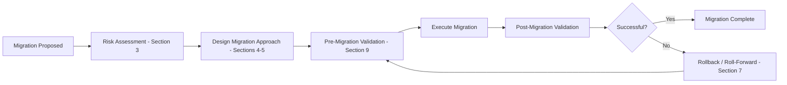
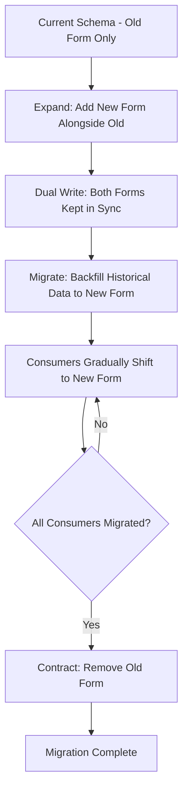
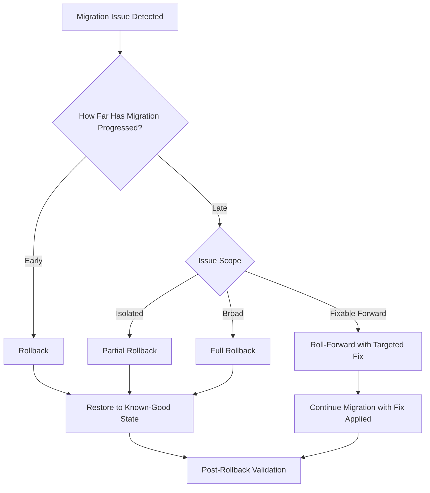
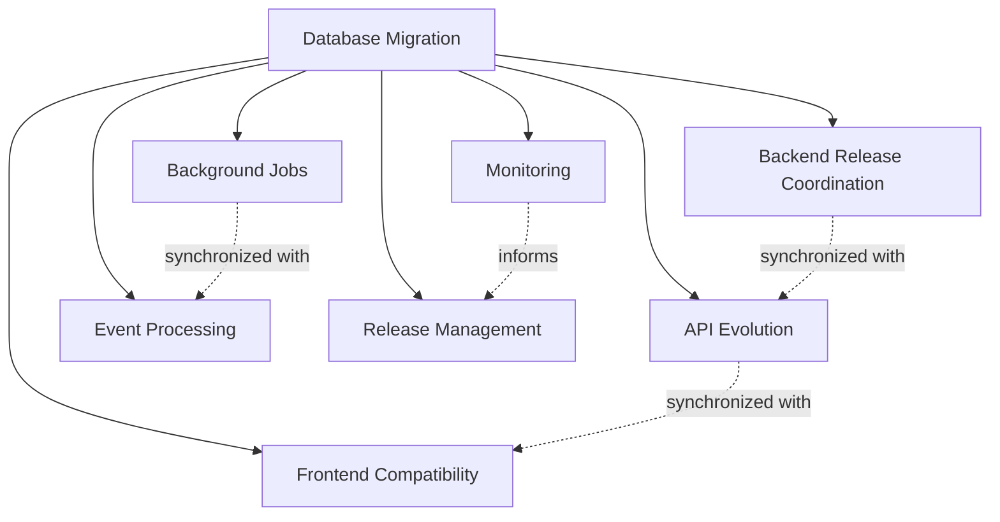

# Database Migration Strategy

## 1. Document Purpose

This document is the official Database Migration Strategy for **StackLeo Tech Store**. It defines enterprise standards for safely evolving database schemas and migrating data while ensuring business continuity, data integrity, operational stability, and minimal disruption.

- **Purpose of Database Migration** — to allow the physical schema defined in `schema-design.md` to evolve safely as business capability grows, without ever putting business-critical data at risk.
- **Relationship with Schema Evolution** — this document defines *how* schema changes are executed safely; `schema-design.md` and `data-model.md` define *what* the schema should ultimately look like.
- **Relationship with Application Deployment** — database migrations are coordinated with application releases (Section 8), since schema and application code must remain compatible throughout a deployment.
- **Relationship with Business Continuity** — migrations are designed to preserve the availability expectations defined in `03_System_Design/quality-attributes.md` (Section 5); a migration must never itself become an outage.
- **Relationship with Database Governance** — migration approval and review follow the governance model defined in `data-governance.md` and Section 11 of this document.

This document is implementation-independent and vendor-neutral. It does not include SQL, migration scripts, ORM-specific migration tools, or vendor-specific migration utilities — it defines migration strategy conceptually.

## 2. Migration Philosophy

- **Safety First** — no migration proceeds without a validated rollback or roll-forward path (Section 7); risk to business-critical data always outweighs migration speed.
- **Incremental Change** — schema evolution proceeds in small, independently verifiable steps rather than large, high-risk rewrites, consistent with ARCH-023.
- **Backward Compatibility** — a migration preserves existing consumer expectations wherever reasonably possible, consistent with `03_System_Design/architecture-principles.md` (ARCH-023).
- **Forward Compatibility** — schema changes anticipate future extension (e.g., Marketplace, Corporate Sales) so that later migrations can build on, rather than undo, earlier ones.
- **Data Integrity** — no migration is considered successful unless the resulting data remains accurate, complete, and consistent (Section 6).
- **Operational Simplicity** — the simplest migration approach that safely achieves the goal is preferred over unnecessarily sophisticated mechanisms.
- **Risk Reduction** — migration risk is actively assessed and mitigated (Section 3), not merely accepted as an unavoidable cost of change.
- **Observability** — every migration is monitored during and after execution (Section 8), so problems are detected quickly rather than discovered later through customer impact.

*Diagram: Database Migration Lifecycle.*

## 3. Migration Categories

| Category | Purpose | Business Scenarios | Risks | Validation Considerations |
|---|---|---|---|---|
| Schema Migration | Changing the structure of the data model (adding, modifying, or removing structures). | Introducing the Corporate Sales domain; adding a new Product attribute. | Structural changes can break existing application assumptions if not coordinated. | Verify the change is compatible with all current consumers before and after. |
| Data Migration | Moving or transforming existing data to fit a new structure or location. | Restructuring how Product Specifications are stored; consolidating duplicated legacy data. | Data loss or corruption if transformation logic is flawed. | Validate transformed data against the original source for completeness and accuracy. |
| Structural Refactoring | Improving the internal organization of existing structures without changing their business meaning. | Splitting an overly broad structure into more cohesive, normalized pieces (`normalization.md`). | Behavior changes if dependent processes assumed the prior structure. | Confirm business behavior is unchanged from the consumer's perspective. |
| Configuration Migration | Changing platform-wide business configuration (per `schema-design.md`, Administration domain). | Updating business rule parameters; introducing a new channel configuration. | Misconfiguration can have broad, immediate operational impact. | Validate configuration changes in a non-Production environment first. |
| Reference Data Migration | Updating relatively static lookup data (Categories, Brands, Attributes). | Restructuring the category hierarchy; consolidating duplicate Brand records. | Broken references if dependent Product records are not updated consistently. | Confirm every dependent reference resolves correctly post-migration. |
| Historical Data Migration | Moving or restructuring data no longer in active use but still retained for reference. | Migrating older Order records into a restructured archival format. | Historical accuracy loss if the migration inadvertently alters recorded facts. | Validate historical records remain bit-for-bit accurate in business meaning, even if physically restructured. |
| Archive Migration | Moving data between active and archival tiers, per `data-retention.md` (Section 5). | Moving Notifications older than their active relevance window to archival storage. | Data becoming temporarily inaccessible during the migration window. | Confirm archived data remains retrievable and intact after migration. |

### Migration Categories Summary

| Category | Typical Risk Level | Typical Frequency |
|---|---|---|
| Schema Migration | Moderate-to-High | Regular, tied to feature delivery |
| Data Migration | High | Occasional, tied to structural change |
| Structural Refactoring | Moderate | Occasional, tied to technical debt reduction |
| Configuration Migration | Low-to-Moderate | Frequent |
| Reference Data Migration | Low | Occasional |
| Historical Data Migration | Moderate | Rare |
| Archive Migration | Low | Recurring, per `data-retention.md` |

## 4. Schema Evolution Strategy

- **Additive Changes** — the preferred, lowest-risk form of change: introducing new structures or attributes without altering or removing existing ones, preserving full backward compatibility.
- **Deprecation Strategy** — structures or attributes no longer needed are marked deprecated and monitored for continued use before removal, never removed abruptly.
- **Breaking Changes** — changes that would break existing consumer expectations are avoided by default; where genuinely unavoidable, they follow the Expand → Migrate → Contract pattern (Section 5), never applied instantaneously.
- **Feature Flag Readiness** — schema changes supporting a not-yet-released feature are designed to coexist safely with the current, active schema until the feature is ready to activate.
- **Compatibility Windows** — a defined period during which both the old and new schema forms remain valid, allowing dependent services to migrate at a safe pace.
- **Progressive Rollout** — schema and data changes are validated on a limited scope before being applied platform-wide, consistent with the deployment strategy in `03_System_Design/deployment-architecture.md` (Section 14).
- **Version Evolution** — schema changes are tracked with the same versioning discipline applied across this repository, per `00_Project_Overview/changelog.md`.

### Schema Evolution Matrix

| Change Type | Compatibility Impact | Recommended Approach |
|---|---|---|
| Adding a new structure or attribute | None (fully additive) | Direct application, no special coordination required |
| Renaming an existing attribute | Breaking | Expand → Migrate → Contract (Section 5) |
| Removing an attribute or structure | Breaking | Deprecation period, then removal after confirmed disuse |
| Changing an attribute's meaning or valid values | Breaking | Compatibility window with dual-read support during transition |
| Splitting a structure (Structural Refactoring) | Breaking | Expand → Migrate → Contract, with careful consumer coordination |

*Diagram: Schema Evolution Timeline.*

## 5. Zero / Minimal Downtime Strategy

- **Expand → Migrate → Contract Pattern** — a three-phase approach to breaking changes: first *expand* the schema to support both old and new forms simultaneously; then *migrate* data and consumers to the new form; finally *contract* by removing the old form once no consumer depends on it.
- **Dual Readiness** — during the "expand" phase, the system is capable of correctly reading both old and new data forms, ensuring no disruption while migration is in progress.
- **Dual Write Readiness** — during transition, writes may be directed to both old and new forms simultaneously, ensuring consistency regardless of which consumers have migrated.
- **Graceful Transition** — consumers migrate to the new form at their own safe pace within the compatibility window (Section 4), rather than being forced to migrate simultaneously.
- **Rolling Deployments** — application changes supporting the new schema form are deployed incrementally, consistent with `03_System_Design/deployment-architecture.md` (Section 7).
- **Operational Safety** — at every phase of the pattern, the system remains in a fully functional, consistent state; no phase depends on an instantaneous, all-or-nothing cutover.

*Diagram: Expand → Migrate → Contract Workflow.*

## 6. Data Integrity Strategy

- **Validation** — data affected by a migration is validated against expected business rules (`01_Business/business-rules.md`) both before and after the migration executes.
- **Consistency Verification** — post-migration data is checked for internal consistency, ensuring no relationship (per `entity-relationship.md`) was left broken or ambiguous.
- **Duplicate Prevention** — migrations are designed to avoid introducing duplicate records, particularly during data migration and reference data consolidation (Section 3).
- **Referential Integrity (Conceptual)** — every relationship affected by a migration is confirmed to resolve correctly afterward, consistent with `entity-relationship.md` (Section 5).
- **Auditability** — migration execution is logged with sufficient detail to reconstruct what changed, when, and under whose authorization, consistent with `schema-design.md` (Section 6).
- **Reconciliation** — for data migrations involving transformation, a reconciliation step compares source and destination record counts and key business values to confirm nothing was lost or altered unexpectedly.

## 7. Rollback Strategy

- **Rollback Philosophy** — every migration plan includes an explicit, validated rollback approach before execution begins; "we'll figure it out if something goes wrong" is never an acceptable plan.
- **Recovery Readiness** — rollback capability is coordinated with the backup and recovery strategy defined in `backup-recovery.md`, ensuring a clean fallback point exists.
- **Safe Rollback** — a rollback restores the system to a known-good, fully consistent state, never a partially reverted, ambiguous one.
- **Partial Rollback** — where a migration affects multiple independent structures, rollback may be scoped to only the affected structures, avoiding unnecessary disruption to unrelated, successfully migrated data.
- **Roll-Forward Strategy** — in some cases, particularly late in a migration, fixing forward (correcting the issue while keeping the new state) may be safer than rolling back; this decision is made deliberately (Section 7 diagram), not by default in either direction.
- **Business Continuity** — the rollback or roll-forward decision always prioritizes minimizing customer-facing impact and data integrity risk over migration schedule adherence.

### Rollback Decision Matrix

| Situation | Recommended Action | Rationale |
|---|---|---|
| Issue detected early in migration, before significant data has changed | Rollback | Minimal state has changed; clean reversion is low-risk. |
| Issue detected late, after most data has migrated successfully | Roll-forward with targeted fix | Rolling back late-stage migration risks losing legitimate progress and introducing new inconsistency. |
| Issue isolated to a single structure among several | Partial rollback | Avoids unnecessary disruption to unaffected, successfully migrated structures. |
| Issue affects data integrity broadly across the migration | Full rollback | Broad integrity risk requires returning to the last fully validated, known-good state. |

*Diagram: Rollback Decision Flow.*

## 8. Deployment Coordination

Database migrations are never executed in isolation; they are coordinated with:

- **Backend Releases** — application code changes depending on a new schema form are deployed in careful sequence with the corresponding migration, per the Expand → Migrate → Contract pattern (Section 5).
- **API Evolution** — API contracts (`05_API`) exposing migrated data are versioned and evolved in coordination with the underlying schema change, consistent with `03_System_Design/service-architecture.md` (Section 7).
- **Frontend Compatibility** — customer- and admin-facing interfaces are confirmed compatible with both old and new data forms during the compatibility window.
- **Background Jobs** — asynchronous processing (per `03_System_Design/integration-architecture.md`, Section 6) is confirmed compatible with the migrated schema before and during transition.
- **Event Processing** — domain events (`03_System_Design/event-flows.md`) affected by a schema change are versioned consistently with the migration, avoiding consumer breakage.
- **Monitoring** — migration execution is actively observed (`03_System_Design/observability.md`) throughout, not only checked after the fact.
- **Release Management** — migrations follow the same release management discipline defined in `03_System_Design/deployment-architecture.md` (Section 14), including UAT sign-off where the migration affects customer-facing behavior.

*Diagram: Deployment Coordination Architecture.*

## 9. Testing & Validation

- **Pre-Migration Validation** — the current data state is validated against expectations before a migration begins, establishing a reliable baseline.
- **Dry Runs** — migrations are executed against a non-Production environment first, validating the approach before it touches real business data.
- **Data Verification** — post-migration data is compared against pre-migration expectations (Section 6) to confirm correctness.
- **Performance Validation** — the migrated schema's query performance is validated against the expectations defined in `indexing-strategy.md` and `02_Product/non-functional-requirements.md`.
- **User Acceptance Readiness** — migrations affecting customer-facing behavior follow the UAT process defined in `02_Product/acceptance-criteria.md` (Section 7) before Production deployment.
- **Post-Migration Review** — a review following each significant migration captures what worked well and what should improve for future migrations.

### Testing & Validation Checklist

| Checklist Item | Purpose |
|---|---|
| Pre-migration data baseline established | Enables accurate before/after comparison |
| Dry run completed in non-Production environment | Validates approach before Production execution |
| Data verification completed post-migration | Confirms correctness and completeness |
| Performance validated against targets | Confirms migration did not degrade query performance |
| UAT sign-off obtained (where customer-facing impact exists) | Confirms business acceptance, per `acceptance-criteria.md` |
| Post-migration review conducted | Captures lessons for continuous improvement |

## 10. Future Evolution

| Future Direction | Migration Strategy Readiness |
|---|---|
| Marketplace | The Marketplace domain (Phase 5) is introduced as an additive schema extension (Section 4), not a breaking change to existing Product/Order structures. |
| AI | AI-supporting structures (Phase 6) are introduced additively, consuming existing data without requiring migration of transactional domains. |
| Multi-Region | Regional scoping extensions (Phase 7) follow the same Expand → Migrate → Contract discipline (Section 5) applied to existing domains. |
| Multi-Cloud | Migration strategy remains provider-neutral, consistent with `03_System_Design/deployment-architecture.md` (Section 1). |
| Event-Driven Systems | Schema migrations are coordinated with event versioning (Section 8), positioning the platform for a formal event bus without migration-pattern disruption. |
| Continuous Delivery | The incremental, additive-first migration philosophy (Section 2) is directly compatible with a future move toward more frequent, smaller releases. |

## 11. Governance

- **Architecture Review** — proposed migrations affecting core domains (Orders, Payments, Inventory) are reviewed against `03_System_Design/architecture-principles.md` and `quality-attributes.md` before approval.
- **Migration Approval** — every migration requires explicit approval from the Database Architect; migrations affecting business-critical domains additionally require Solution Architect sign-off.
- **Documentation Standards** — every migration is documented with its category (Section 3), approach (Sections 4–5), and validation plan (Section 9) before execution.
- **Change Management** — every migration is recorded in `00_Project_Overview/changelog.md`, with significant migrations cross-referenced in `03_System_Design/architecture-decisions.md`.
- **Versioning** — this document follows the Semantic Versioning approach defined in `00_Project_Overview/changelog.md`.
- **Ownership** — the Database Architect owns migration strategy and execution oversight, in partnership with the DevOps Lead for deployment coordination (Section 8).

### Governance Responsibilities

| Role | Responsibility |
|---|---|
| Database Architect | Owns migration strategy, approval, and execution oversight. |
| DevOps Lead | Coordinates migration execution with deployment pipelines (Section 8). |
| Solution Architect | Approves migrations affecting business-critical domains or core architecture. |
| QA Lead | Validates migration outcomes against Section 9's checklist. |
| Product Owner | Approves migrations with customer-facing impact, per UAT sign-off. |

## 12. Anti-Patterns

| Anti-Pattern | Why It Is Avoided |
|---|---|
| Big Bang Migrations | A single, large, all-at-once migration maximizes risk and makes isolating a failure's cause far harder than incremental change (Section 2). |
| Unvalidated Data Changes | Migrating data without validation (Section 6) risks silently corrupting or losing business-critical information. |
| No Rollback Plan | Proceeding without a validated rollback or roll-forward path (Section 7) leaves no safe recovery option if something goes wrong. |
| Breaking Production Compatibility | Introducing a breaking change without the Expand → Migrate → Contract pattern (Section 5) risks an avoidable outage. |
| Skipping Testing | Bypassing dry runs and validation (Section 9) trades short-term speed for a materially higher risk of Production impact. |
| Ignoring Monitoring | Executing a migration without active observation (Section 8) delays detection of a problem until customer impact has already occurred. |
| Poor Communication | Failing to coordinate a migration with dependent teams (Section 8) risks deploying incompatible application and schema changes together. |

### Anti-Pattern Summary

| Anti-Pattern | Primary Risk | Mitigation |
|---|---|---|
| Big Bang Migrations | High blast radius on failure | Favor incremental, additive change (Section 2) |
| Unvalidated Data Changes | Silent data corruption or loss | Apply the Data Integrity Strategy (Section 6) |
| No Rollback Plan | No safe recovery path | Require a validated rollback/roll-forward plan (Section 7) before execution |
| Breaking Production Compatibility | Avoidable outage | Apply Expand → Migrate → Contract (Section 5) |
| Skipping Testing | Undetected issues reach Production | Require the Testing & Validation Checklist (Section 9) |
| Ignoring Monitoring | Delayed problem detection | Actively observe every migration (Section 8) |
| Poor Communication | Incompatible coordinated releases | Follow Deployment Coordination discipline (Section 8) |

## 13. Document Information

| Property | Value |
|----------|-------|
| Document | migration-strategy.md |
| Version | 1.0.0 |
| Status | Active |
| Maintained By | StackLeo |
| Last Updated | 2026-07-17 |

---

© StackLeo. All Rights Reserved.
