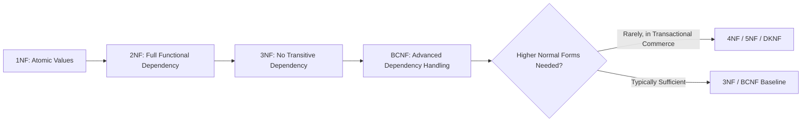
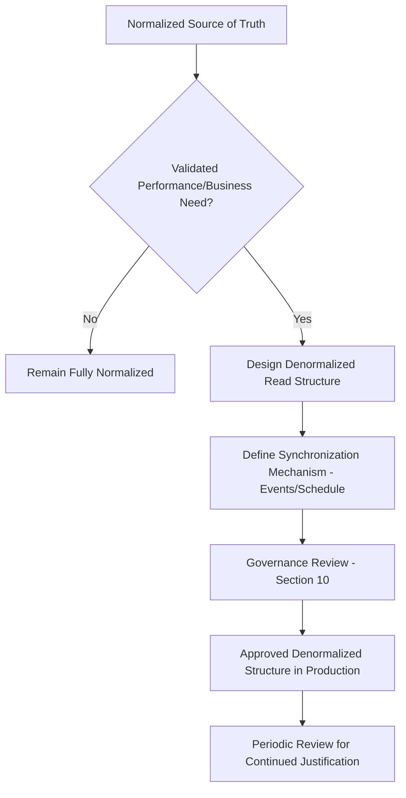
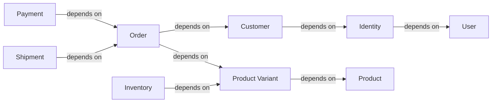
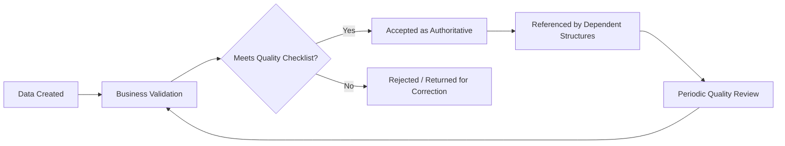
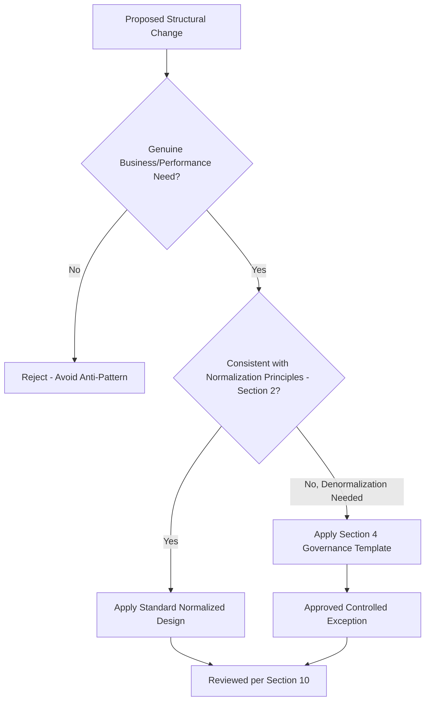

# Database Normalization Strategy

## 1. Document Purpose

This document is the official Database Normalization Strategy for **StackLeo Tech Store**. It defines how normalization principles are applied across the platform to ensure consistency, integrity, maintainability, scalability, and long-term data quality, and explains where controlled denormalization is deliberately and knowingly accepted.

- **Purpose of Normalization** — to structure data so that each business fact is stored exactly once, preventing the same fact from silently drifting into inconsistent copies across the platform.
- **Importance of Data Quality** — normalization is a primary structural safeguard for data quality (Section 7); a well-normalized schema makes many classes of inconsistency structurally impossible rather than merely discouraged.
- **Relationship with Logical and Physical Schema** — this document elaborates the structural discipline referenced in `schema-design.md` (Section 2, Normalization Awareness), applied to the entities defined in `data-model.md` and `entity-relationship.md`.
- **Relationship with Business Rules** — normalization directly supports the single source of truth principle underlying `01_Business/business-rules.md` and `03_System_Design/data-flow.md` (Section 2).
- **Relationship with Performance Engineering** — normalization and performance are in genuine tension (Section 5); this document treats both as first-class concerns and defines where each takes precedence.

This document is implementation-independent. It does not include SQL, `CREATE TABLE` statements, database schemas, or ORM models — it explains normalization strategy conceptually, consistent with `04_Database/README.md`.

## 2. Normalization Philosophy

- **Single Source of Truth** — every business fact is stored in exactly one place, consistent with `03_System_Design/data-flow.md` (Section 2).
- **Elimination of Redundancy** — data is not duplicated across structures unless that duplication is a deliberate, governed exception (Section 4).
- **Data Integrity** — normalized structure prevents many classes of inconsistency (e.g., a Product's price disagreeing with itself across two records) from being structurally possible.
- **Consistency** — normalized data ensures that any two readers of the same fact see the same value, consistent with `database-strategy.md` (Section 4).
- **Business Ownership** — normalization boundaries follow the data ownership boundaries defined in `data-model.md` (Section 6), not incidental technical grouping.
- **Long-Term Maintainability** — a normalized schema is easier to reason about and extend safely as the business grows in complexity.
- **Extensibility** — normalized structures accommodate new business capability (Marketplace, Corporate Sales) as additive structures, not as increasingly tangled duplicated data.
- **Scalability** — normalization is balanced deliberately against the scalability strategy defined in `database-strategy.md` (Section 5), recognizing that some scaling patterns benefit from controlled denormalization.

*Diagram: Normalization Evolution.*

## 3. Normal Forms

### 3.1 First Normal Form (1NF)

- **Atomic Values** — every stored value represents a single, indivisible fact (e.g., a Product's price is one value, not a combined string of price and currency notes).
- **Elimination of Repeating Groups** — a business concept that can occur multiple times (e.g., an Order's multiple Order Items) is represented as its own related structure, never as repeated columns within a single record.
- **Business Benefit** — 1NF prevents the fragile, error-prone pattern of parsing meaning out of combined or repeated values, keeping every fact independently queryable and validatable.

### 3.2 Second Normal Form (2NF)

- **Functional Dependency** — every non-identifying attribute of a structure depends on that structure's whole identifier, not merely part of it.
- **Partial Dependency** — a violation of 2NF occurs when an attribute depends on only part of a composite identifier (e.g., a Product Variant's Brand depending only on the Product portion of a Product+Variant identifier, not the Variant itself).
- **Business Consistency** — 2NF ensures that attributes are stored against the correct level of business granularity, preventing attributes from being duplicated and drifting out of sync across multiple rows that share a partial identifier.

### 3.3 Third Normal Form (3NF)

- **Removal of Transitive Dependencies** — no non-identifying attribute depends on another non-identifying attribute (e.g., a Customer's city should not be derived through a stored Address that itself depends on a separately stored postal code lookup embedded redundantly).
- **Independent Business Entities** — 3NF naturally separates genuinely independent business concepts (e.g., Brand is its own structure, not a set of repeated columns on every Product).
- **Improved Maintainability** — changing a fact (e.g., a Brand's display name) requires updating exactly one record, not searching for every place it was duplicated.

### 3.4 Boyce-Codd Normal Form (BCNF)

- **Advanced Dependency Handling** — BCNF resolves edge cases where a structure satisfies 3NF but still contains a dependency on a non-primary candidate identifier, a subtlety that can arise in structures with multiple legitimate ways to uniquely identify a record (e.g., a Product Variant identifiable by either its internal identifier or its SKU).
- **Complex Business Domains** — BCNF becomes relevant in StackLeo's more intricate domains, such as Catalog (Product, Variant, Attribute, Specification) and future Marketplace (Vendor, Vendor Product), where more than one legitimate identifying path can exist.
- **Enterprise Readiness** — applying BCNF discipline in these domains protects data integrity as catalog and marketplace complexity grows across `product-roadmap.md` phases.

### 3.5 Higher Normal Forms (Overview)

| Normal Form | Concept | Why Rarely Required at StackLeo |
|---|---|---|
| 4NF | Eliminates multi-valued dependencies, where two independent, multi-valued facts about an entity are incorrectly combined. | StackLeo's independent multi-valued facts (e.g., a Product's Categories and Tags) are already modeled as separate relationships in `entity-relationship.md`, avoiding this issue by design. |
| 5NF | Eliminates join dependencies not implied by candidate keys, relevant only in highly complex, multi-way relationship scenarios. | StackLeo's business relationships (per `entity-relationship.md`) are modeled as clear, pairwise relationships; the multi-way join dependency scenarios 5NF addresses do not arise in a typical transactional commerce domain. |
| Domain-Key Normal Form (DKNF) | A theoretical ideal where every constraint is a logical consequence of domain and key constraints. | DKNF is a valuable conceptual benchmark but rarely fully achievable or necessary in practice; StackLeo targets 3NF/BCNF as a pragmatic, sufficient standard for transactional commerce. |

### Normal Forms Summary

| Normal Form | Primary Concern | StackLeo Application |
|---|---|---|
| 1NF | Atomicity, no repeating groups | Applied universally across all domains |
| 2NF | Full functional dependency | Applied universally, particularly relevant to composite associations (e.g., Role-Permission) |
| 3NF | No transitive dependency | Applied universally as the baseline target |
| BCNF | Advanced dependency edge cases | Applied in complex domains: Catalog, future Marketplace |
| 4NF/5NF/DKNF | Advanced multi-valued and join dependencies | Rarely required; addressed by careful relationship modeling instead |

## 4. Controlled Denormalization Strategy

Controlled denormalization is a deliberate, governed exception to normalization, applied only where a specific, validated business or performance need justifies it — never as a default.

| Scenario | Business Goal | Benefits | Risks | Governance | Data Synchronization Considerations |
|---|---|---|---|---|---|
| Product Catalog | Fast, complete product display without excessive cross-structure lookups. | Faster page rendering; fewer relationship traversals for a single product view. | Product attribute duplication becoming stale if the source changes. | Denormalized read structures must be explicitly reviewed and approved via the schema review process (Section 10). | Refreshed via domain events (`ProductUpdated`, per `03_System_Design/event-flows.md`) rather than manual synchronization. |
| Product Search | Fast, relevant search across large catalog volume. | Search-optimized structure avoids expensive real-time joins across Catalog domain structures. | Search results may briefly lag true Catalog state. | Search index structure is explicitly owned by Search Service, per `service-architecture.md`. | Synchronized via `ProductPublished`/`ProductUpdated` events; eventual consistency accepted. |
| Shopping Cart | Fast, responsive cart display reflecting current price and product summary. | Reduces repeated joins during an active, high-frequency browsing session. | Cart-displayed price/product summary could differ from Catalog if not revalidated. | Cart Service is required to revalidate against Catalog/Pricing at checkout (BR-051, BR-052), regardless of any cached summary. | Cart-level denormalized summary is refreshed on each Cart Service interaction. |
| Order History | Fast customer-facing display of past orders without reconstructing historical product/pricing state. | Preserves an accurate historical record even after the Product's current data changes. | None significant; this is an intentional, permanent snapshot, not a synchronization risk. | Order Item is explicitly modeled as an immutable snapshot (`entity-relationship.md`), not a live reference. | Not synchronized by design; Order Items intentionally freeze historical state (BR-024). |
| Customer Dashboard | Fast, consolidated view of orders, returns, and warranty status. | Avoids expensive real-time aggregation across multiple domains on every dashboard load. | Dashboard summary could be briefly stale relative to the very latest underlying event. | Dashboard aggregation is explicitly owned by a read-optimized structure reviewed under Section 10. | Refreshed via domain events from Order, Returns, and Warranty domains. |
| Reporting | Fast generation of standard business reports without burdening transactional structures. | Isolates reporting query load from transactional performance. | Report data may reflect a defined lag relative to live transactional state. | Reporting structures are explicitly owned by Reporting Service, per `service-architecture.md` (SVC-024). | Refreshed on a defined schedule or via event consumption, per `database-strategy.md` (Section 3). |
| Analytics | Fast aggregation of behavioral and performance data at scale. | Supports business intelligence without impacting transactional workloads. | Analytical data is explicitly eventual-consistency by design (`database-strategy.md`, Section 4). | Analytics domain is architecturally separated from transactional domains, per `database-strategy.md` (Section 3). | Fed by events and/or scheduled extraction; never a write path back into transactional domains. |
| Marketplace (Future) | Fast seller and listing browsing across a growing multi-vendor catalog. | Avoids expensive joins across Vendor, Vendor Product, and core Product structures. | Vendor-facing summary data could lag true state during high listing-update volume. | Not yet active; governance to be formalized ahead of Phase 5, consistent with `03_System_Design/architecture-decisions.md` (ADR-019). | To be defined ahead of Phase 5, following the same event-driven synchronization pattern established for Product Catalog. |

*Diagram: Controlled Denormalization Flow.*

## 5. Business Trade-offs

| Trade-off | Normalized Favors | Denormalized Favors | When Denormalization Is Justified |
|---|---|---|---|
| Read Performance | — | Denormalized (fewer joins) | High-frequency, read-heavy paths (Catalog browsing, Search) |
| Write Performance | Normalized (single update point) | — | Rarely denormalize for write performance; writes to critical domains stay normalized |
| Storage Cost | Normalized (no duplication) | — | Storage cost is rarely the deciding factor at StackLeo's current scale |
| Data Integrity | Normalized | — | Financially critical domains (Orders, Payments, Inventory) always favor normalization |
| Consistency | Normalized | — | Strong-consistency domains never trade this away, per `database-strategy.md` (Section 4) |
| Query Simplicity | — | Denormalized (fewer joins to express) | Customer Dashboard, Reporting |
| Operational Complexity | Normalized (simpler to reason about) | — | Denormalization is justified only when the operational cost of synchronization (Section 4) is clearly outweighed by the performance benefit |

Trade-offs are justified only when a specific, measured performance or usability need exists (Section 4), never as a speculative, upfront optimization, consistent with `03_System_Design/architecture-principles.md` (ARCH-023, Simplicity Before Complexity).

## 6. Domain-Based Normalization

| Domain | Normalization Approach | Rationale |
|---|---|---|
| Identity | Fully normalized | Security-critical; no tolerance for inconsistent role/permission data. |
| Customer | Fully normalized | Personal data accuracy is a trust and compliance requirement (BR-128). |
| Product Catalog | Normalized source of truth; denormalized read structures for display/search | Balances authoritative accuracy with customer-facing performance (Section 4). |
| Inventory | Fully normalized | Overselling risk makes any duplication unacceptable (BR-030, BR-031). |
| Orders | Fully normalized, with intentional Order Item snapshotting | Financial accuracy requires normalization; historical snapshots are a deliberate exception (Section 4). |
| Payments | Fully normalized | Financial accuracy and auditability are non-negotiable. |
| Shipping | Fully normalized | Delivery accuracy depends on consistent, current data. |
| Reviews | Fully normalized | Straightforward structure; no performance need currently justifies denormalization. |
| Notifications | Fully normalized | Simple structure; denormalization not currently justified. |
| Marketplace (Future) | Normalized source of truth; denormalized read structures anticipated | Mirrors the Product Catalog approach once seller volume justifies it. |

*Diagram: Data Dependency Model.*

## 7. Data Quality Strategy

- **Duplicate Prevention** — normalized structure, combined with business-key uniqueness rules (e.g., unique Customer contact detail, per BR-001), structurally prevents most duplication.
- **Referential Integrity (Conceptual)** — every reference between entities (per `entity-relationship.md`) is expected to point to a genuinely existing, valid related entity.
- **Business Validation** — data must satisfy the business rules defined in `01_Business/business-rules.md` before being considered valid, independent of structural normalization alone.
- **Data Completeness** — mandatory business attributes (e.g., a Product's required fields before publish, per BR-013) must be present before a record is considered usable.
- **Data Accuracy** — stored data must correctly reflect the real-world business fact it represents at the time it was last updated.
- **Data Consistency** — the same fact, referenced from multiple places, must always resolve to the same value, the direct outcome of normalization discipline (Section 2).
- **Auditability** — data changes affecting governed domains are traceable to a specific actor and time, consistent with `schema-design.md` (Section 6).

### Data Quality Checklist

| Quality Dimension | Verification Approach |
|---|---|
| Duplicate Prevention | Business-key uniqueness enforced per domain (e.g., Customer contact detail, Product SKU). |
| Referential Integrity | Every relationship reference resolves to a valid, existing entity. |
| Completeness | Mandatory business attributes present before a record is considered active/published. |
| Accuracy | Data reflects current, correct real-world business state. |
| Consistency | The same fact resolves identically regardless of which structure references it. |
| Auditability | Governed changes are logged with actor and timestamp. |

*Diagram: Data Quality Lifecycle.*

## 8. Performance Considerations

- **Query Optimization Readiness** — normalized structures are designed with anticipated query patterns (per `entity-relationship.md`) in mind, informing where `indexing-strategy.md` will apply targeted optimization.
- **Indexing Relationship** — normalization and indexing are complementary: normalization prevents inconsistency, while indexing (addressed separately in `indexing-strategy.md`) addresses the read-performance cost normalization can introduce.
- **Caching Relationship** — the caching strategy defined in `database-strategy.md` (Section 6) and `03_System_Design/technology-stack.md` (Section 4.4) absorbs much of the read-performance need that might otherwise tempt premature denormalization.
- **Reporting Considerations** — reporting workloads are directed toward the Analytics domain's separated, appropriately denormalized structures (Section 4), protecting transactional performance.
- **Search Optimization** — search-specific performance needs are met through the dedicated Search domain structures (Section 4), not by denormalizing the core Catalog.
- **Future Analytics** — as analytical needs grow, performance optimization increasingly shifts toward the Data Warehouse evolution described in `database-strategy.md` (Section 9), rather than further denormalizing transactional domains.

## 9. Future Evolution

| Future Direction | Normalization Strategy Readiness |
|---|---|
| Data Warehouse | Analytical data is already architecturally separated (Section 4), ready to feed a future warehouse without further transactional denormalization. |
| AI | AI-assisted capability consumes normalized transactional data and existing denormalized read structures as inputs, requiring no new normalization exceptions. |
| Business Intelligence | Builds on the Data Warehouse evolution, consuming aggregated, intentionally denormalized analytical structures. |
| Marketplace | Extends the Product Catalog normalization pattern (normalized source, denormalized read structures) to Vendor and Vendor Product data. |
| Corporate Sales | Corporate Account and bulk Order data follow the same fully-normalized approach as core Orders, given their financial criticality. |
| Multi-Region | Regional data scoping (per `schema-design.md`, Section 8) is layered onto the existing normalized structures without altering normalization discipline. |
| Event-Driven Architecture | The synchronization mechanisms for controlled denormalization (Section 4) are already event-based, positioning the platform for a formal event bus (`service-architecture.md`, Section 11) without redesign. |

## 10. Governance

- **Modeling Standards** — every structure is normalized to at least 3NF by default; any exception must be documented per the Section 4 template before adoption.
- **Architecture Reviews** — proposed denormalization is reviewed against `03_System_Design/architecture-principles.md` and `quality-attributes.md` before approval.
- **Database Review Process** — normalization decisions are reviewed whenever `data-model.md` or `entity-relationship.md` changes materially.
- **Change Management** — approved denormalization exceptions are recorded in `00_Project_Overview/changelog.md` and cross-referenced in `03_System_Design/architecture-decisions.md` where architecturally significant.
- **Documentation Standards** — this document follows the enterprise Markdown conventions established across this repository.
- **Versioning** — this document follows the Semantic Versioning approach defined in `00_Project_Overview/changelog.md`.

## 11. Anti-Patterns

| Anti-Pattern | Why It Is Avoided |
|---|---|
| Over-Normalization | Splitting data into structures so granular that simple, common business queries require excessive relationship traversal, undermining both performance and comprehensibility without a corresponding integrity benefit. |
| Excessive Denormalization | Duplicating data broadly "just in case," without a validated need (Section 4), reintroducing the inconsistency risk normalization exists to prevent. |
| Duplicate Business Data | Storing the same business fact in more than one place without an explicit, governed synchronization mechanism, violating single source of truth. |
| Hidden Dependencies | Attributes that depend on another attribute not evident from the structure itself, making the data model harder to reason about and more error-prone to change. |
| Circular Relationships | Relationships that create an ownership loop between structures, undermining the clear parent/child ownership model defined in `entity-relationship.md` (Section 5). |
| Premature Optimization | Denormalizing structures ahead of any validated performance need, violating `03_System_Design/architecture-principles.md` (ARCH-023, Simplicity Before Complexity). |

### Anti-Pattern Summary

| Anti-Pattern | Primary Risk | Mitigation |
|---|---|---|
| Over-Normalization | Query complexity, poor comprehensibility | Target 3NF/BCNF as a pragmatic baseline (Section 3), not maximal normalization |
| Excessive Denormalization | Data inconsistency | Require Section 4's governance template for every exception |
| Duplicate Business Data | Silent drift between copies | Enforce single source of truth (Section 2) |
| Hidden Dependencies | Error-prone changes | Apply 2NF/3NF discipline explicitly |
| Circular Relationships | Ambiguous ownership | Enforce clear parent/child ownership per `entity-relationship.md` |
| Premature Optimization | Wasted effort, unjustified complexity | Require validated need before any denormalization (Section 4) |

*Diagram: Normalization Decision Framework.*

## 12. Document Information

| Property | Value |
|----------|-------|
| Document | normalization.md |
| Version | 1.0.0 |
| Status | Active |
| Maintained By | StackLeo |
| Last Updated | 2026-07-17 |

---

© StackLeo. All Rights Reserved.
