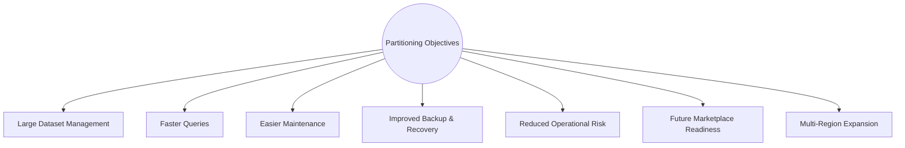
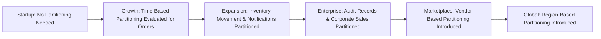
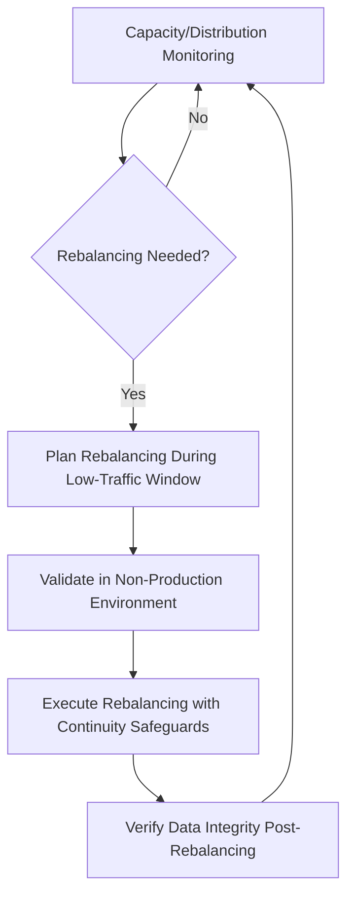
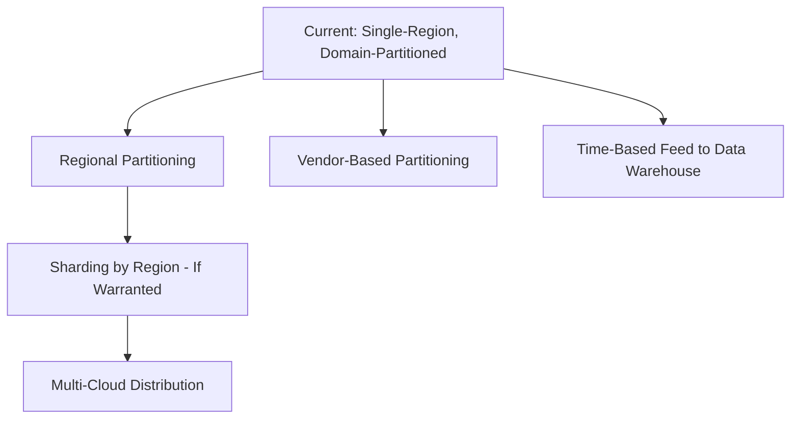

# Database Partitioning Strategy

## 1. Document Purpose

This document is the official Database Partitioning Strategy for **StackLeo Tech Store**. It defines the long-term strategy for distributing, organizing, scaling, and managing large datasets as the platform grows.

- **Purpose of Partitioning** — to keep large, growing datasets (particularly Orders and Inventory history) performant and manageable by dividing them into smaller, meaningful segments, rather than allowing a single unbounded structure to degrade over time.
- **Relationship with Scalability** — partitioning is one of the concrete mechanisms realizing the horizontal scaling strategy defined in `03_System_Design/scalability-strategy.md` (Section 4) and `database-strategy.md` (Section 5).
- **Relationship with Indexing** — partitioning and indexing are complementary: partitioning reduces the volume of data any single operation must consider, while indexing (per `indexing-strategy.md`) optimizes access within each partition.
- **Relationship with Performance Engineering** — partitioning directly supports the performance and scalability targets defined in `02_Product/non-functional-requirements.md` (Sections 5–6).
- **Relationship with Long-Term Growth** — partitioning readiness is planned ahead of the growth stages defined in `03_System_Design/scalability-strategy.md` (Section 3), so that it can be activated deliberately rather than reactively under production strain.

This document is implementation-independent and vendor-neutral. It does not recommend specific partitioning mechanisms, SQL, DDL, or sharding implementation code — it defines partitioning strategy conceptually.

## 2. Partitioning Philosophy

- **Scalability First** — partitioning decisions are made in service of the platform's ability to grow, not as an isolated technical exercise.
- **Operational Simplicity** — partitioning is introduced only where it genuinely simplifies operation at scale; unnecessary partitioning adds operational complexity without benefit.
- **Predictable Performance** — partitioning aims to keep query performance consistent as data volume grows, rather than allowing performance to degrade silently over time.
- **Data Locality** — related data (e.g., an Order and its Order Items) is kept together within the same partition wherever possible, avoiding costly cross-partition operations for common access patterns.
- **Lifecycle Awareness** — partitioning strategy accounts for how data ages (Section 6), aligning partition boundaries with natural data lifecycle transitions.
- **Business Alignment** — partitioning dimensions (Section 4) are chosen based on genuine business meaning (e.g., time, region), not arbitrary technical convenience.
- **Cost Optimization** — partitioning supports moving aging data toward lower-cost storage tiers (Section 6) without disrupting active operations.

## 3. Partitioning Objectives

| Objective | Description |
|---|---|
| Large Dataset Management | Keep high-volume structures (Orders, Inventory Stock Movement, Notifications) manageable as they grow into the millions of records. |
| Faster Queries | Reduce the volume of data any single query must scan, improving response time consistency as data grows. |
| Easier Maintenance | Allow maintenance operations (e.g., archival, reorganization) to be performed on a subset of data without affecting the whole structure. |
| Improved Backup & Recovery | Support more granular, efficient backup and recovery operations, consistent with `backup-recovery.md`. |
| Reduced Operational Risk | Limit the blast radius of an operational issue to a single partition rather than an entire structure. |
| Future Marketplace Readiness | Anticipate partitioning Vendor-related data (e.g., by Vendor or time) as marketplace transaction volume grows. |
| Multi-Region Expansion | Anticipate partitioning by region as StackLeo expands across South Asia and beyond, consistent with `03_System_Design/scalability-strategy.md` (Section 7). |

*Diagram: Data Partitioning Overview.*

## 4. Partitioning Models

| Model | Business Use Cases | Benefits | Trade-offs | Limitations |
|---|---|---|---|---|
| Horizontal Partitioning | Splitting a large structure's rows into segments (e.g., Orders by year). | Keeps each segment's size manageable; supports StackLeo's largest, fastest-growing structures. | Queries spanning multiple segments require coordination across them. | Requires a well-chosen partitioning dimension (Section 4 continued) to avoid uneven distribution. |
| Vertical Partitioning | Splitting a structure's columns into separate groups (e.g., separating frequently accessed Product summary fields from rarely accessed detailed specifications). | Improves performance for queries needing only frequently accessed fields. | Reassembling the full record requires combining multiple partitions. | Less beneficial for structures with uniformly accessed columns. |
| Functional Partitioning | Separating data by business domain (e.g., Orders separate from Analytics), consistent with `schema-design.md` (Section 3). | Aligns physical separation with the bounded contexts already defined in `03_System_Design/bounded-contexts.md`. | Cross-domain queries require coordination across functional partitions. | Primarily an organizational strategy; does not by itself solve single-domain volume growth. |
| Time-Based Partitioning | Segmenting data by a meaningful time dimension (e.g., Orders by month or quarter). | Naturally aligns with business reporting periods and archival strategy (Section 6). | Query patterns spanning multiple time periods touch multiple partitions. | Requires a consistent understanding of which time dimension is business-meaningful per domain. |
| Range Partitioning | Segmenting data by a continuous value range (e.g., a numeric identifier range). | Simple, predictable segment boundaries. | Uneven data distribution if the range is not evenly populated over time. | Less naturally aligned with StackLeo's business-meaningful dimensions than time-based partitioning. |
| Hash Partitioning | Distributing data evenly across segments using a computed value derived from a key. | Achieves even distribution regardless of data patterns, reducing hot-partition risk (Section 12). | Range queries become less efficient, since related values are deliberately spread out. | Less intuitive for business-facing reporting than time-based partitioning. |
| List Partitioning | Segmenting data by a defined, discrete set of values (e.g., delivery Zone A–D, per `01_Business/shipping-policy.md`). | Directly aligns with StackLeo's existing delivery zone model. | Requires the list of values to be relatively stable; new values require partition scheme adjustment. | Less suitable for continuously varying dimensions like time. |

### Partitioning Models Comparison

| Model | Best Suited For | StackLeo Applicability |
|---|---|---|
| Horizontal | Large, growing transactional structures | Orders, Inventory Stock Movement (Section 5) |
| Vertical | Structures with mixed access frequency across columns | Product Catalog (frequently vs. rarely accessed fields) |
| Functional | Domain-level physical separation | Aligns with `schema-design.md` domain organization |
| Time-Based | Structures with a natural time dimension | Orders, Notifications, Audit Records |
| Range | Structures with evenly distributed continuous values | Limited current applicability |
| Hash | Structures at risk of uneven distribution | Candidate for future Marketplace Vendor data |
| List | Structures with a stable, discrete category dimension | Candidate for delivery Zone-based Shipment data |

## 5. Domain-Based Partitioning Strategy

| Domain | Growth Expectations | Partitioning Suitability | Lifecycle | Archival Considerations |
|---|---|---|---|---|
| Orders | High, steady, StackLeo's largest long-term volume | High — primary candidate for time-based horizontal partitioning | Permanent active reference, per `data-model.md` (Section 7) | Older Orders remain queryable but move toward cost-optimized storage over time |
| Payments | Grows in step with Orders | High — aligned with Order partitioning | Permanent, tied to Order | Same archival timeline as Orders |
| Shipments | Grows in step with Orders | Moderate — time-based partitioning candidate | Retained as part of Order fulfillment history | Aligned with Order archival |
| Inventory (Stock Movement) | High write volume, continuous | High — time-based partitioning strongly suited to movement history | Movement records accumulate continuously | Older movement history is a strong archival candidate once no longer operationally relevant |
| Products | Moderate, steady growth; accelerates with Marketplace | Low at current scale; reconsidered if Marketplace catalog grows substantially | Long-lived, actively referenced | Discontinued products remain referenced historically, not removed |
| Reviews | Grows steadily with Order volume | Low-to-moderate at current scale | Long-lived, public trust record | Rarely archived; retained as ongoing trust signal |
| Notifications | High write volume, low per-record query frequency | High — strong archival and time-based partitioning candidate | Short active relevance window | Strong candidate for early archival given low long-term query value |
| Audit Records | Grows continuously, compliance-driven | High — time-based partitioning candidate | Long, compliance-driven retention | Retained per `01_Business/business-rules.md` (BR-104); archived, not deleted |
| Business Metrics | High cumulative volume over time | High — inherently time-based by nature | Aggregated, ongoing | Naturally aligned with future Data Warehouse evolution |
| Marketplace (Future) | Potentially rapid growth once active | High — anticipated hash or list partitioning by Vendor | New domain, Phase 5 | Archival strategy to be defined ahead of Phase 5 |
| Corporate Sales (Future) | Moderate, steady growth once active | Low-to-moderate at anticipated scale | New domain, Phase 4 | Aligned with Order archival patterns once active |

*Diagram: Partition Growth Evolution.*

## 6. Hot, Warm & Cold Data Strategy

| Data Temperature | Description | Representative Data |
|---|---|---|
| Hot | Frequently accessed, actively used in current business operations. | Active Carts, in-progress Orders, current Inventory levels |
| Warm | Occasionally accessed, still operationally relevant but not part of daily active workflows. | Recently completed Orders, recent Notifications |
| Cold | Rarely accessed, retained primarily for historical, compliance, or audit purposes. | Older Orders, historical Stock Movement, older Audit Records |
| Archival | Retained only for compliance or long-term reference, accessed very rarely if ever. | Very old Notifications, long-settled Marketplace Commission records (Future) |

### Data Temperature Matrix

| Domain | Hot Period | Warm Period | Cold/Archival Trigger |
|---|---|---|---|
| Orders | Active fulfillment through recent completion | Several months post-completion | Beyond typical return/warranty-relevant window |
| Inventory Stock Movement | Current operational period | Recent quarters | Beyond standard operational reference need |
| Notifications | Delivery and immediate follow-up window | Short post-delivery period | Shortly after delivery confirmation, given low long-term query value |
| Audit Records | Recent administrative activity | Extended compliance-relevant period | Retained per compliance policy (BR-104), not deleted, but moved to archival tier |

*Diagram: Hot → Warm → Cold Data Lifecycle.*

## 7. Sharding Readiness

- **Difference Between Partitioning and Sharding** — partitioning divides data within a single logical database; sharding distributes data across multiple independent database instances. Sharding is a more significant operational step, reserved for genuine scale needs beyond what partitioning alone addresses.
- **Business Triggers for Sharding** — sharding becomes a genuine consideration only at Enterprise or Global growth stages (`scalability-strategy.md`, Section 3), where a single database instance's capacity is demonstrably insufficient even with partitioning applied.
- **Benefits** — sharding allows near-unbounded horizontal scale and can support regional data locality for multi-region operation.
- **Risks** — sharding introduces significant operational complexity, including cross-shard query coordination and rebalancing complexity (Section 8).
- **Operational Complexity** — sharding requires mature operational tooling and practice; StackLeo's strategy is to exhaust partitioning and read-replication approaches (`database-strategy.md`, Section 5) before considering sharding.
- **Future Global Readiness** — sharding by region is the most natural future path for StackLeo, aligning shard boundaries with the multi-region expansion described in `03_System_Design/scalability-strategy.md` (Section 7), should scale ultimately warrant it.

## 8. Rebalancing Strategy

- **Data Growth** — as partitions grow unevenly over time (e.g., a busier delivery Zone accumulating more Shipment records), rebalancing may be needed to restore even distribution.
- **Capacity Expansion** — rebalancing may accompany the introduction of additional capacity, redistributing data to take advantage of newly available resources.
- **Rebalancing Philosophy** — rebalancing is performed deliberately and infrequently, planned ahead of need rather than reactively under strain, consistent with the capacity planning discipline in `03_System_Design/scalability-strategy.md` (Section 8).
- **Operational Safety** — rebalancing operations are planned to avoid impacting customer-facing availability, consistent with the zero-downtime deployment expectations in `03_System_Design/deployment-architecture.md` (Section 7).
- **Business Continuity** — rebalancing never proceeds at the cost of data integrity or availability for business-critical domains (Orders, Payments, Inventory).

### Rebalancing Strategy

| Trigger | Rebalancing Approach | Business Continuity Safeguard |
|---|---|---|
| Uneven partition growth detected | Redistribute data across partitions gradually | Performed during low-traffic windows, consistent with `deployment-architecture.md` (Section 3) |
| New capacity added | Redistribute to leverage new resources | Planned, not reactive; validated in a non-Production environment first |
| Approaching capacity threshold | Proactive rebalancing ahead of exhaustion | Triggered by capacity planning review (`scalability-strategy.md`, Section 8), not by an active incident |

*Diagram: Partition Rebalancing Workflow.*

## 9. Monitoring & Operations

- **Capacity Monitoring** — partition size and growth rate are continuously monitored, consistent with `03_System_Design/observability.md` (Section 4).
- **Partition Health** — each partition's operational health is monitored individually, allowing issues to be isolated rather than obscured within an aggregate view.
- **Storage Growth** — storage consumption per partition informs the capacity planning process defined in `scalability-strategy.md` (Section 8).
- **Query Distribution** — query load is monitored across partitions to detect emerging hot partitions (Section 12) before they become a performance problem.
- **Maintenance Reviews** — partitioning strategy is reviewed periodically against actual observed growth and access patterns, not left static indefinitely.

### Capacity Planning Checklist

| Checklist Item | Purpose |
|---|---|
| Partition size trend reviewed | Detect approaching capacity limits ahead of time |
| Partition growth rate compared to forecast | Validate capacity planning assumptions (`scalability-strategy.md`, Section 8) |
| Query distribution across partitions reviewed | Detect emerging hot partitions |
| Archival eligibility reviewed | Confirm cold/archival data is being moved per Section 6 |
| Rebalancing need assessed | Determine if proactive rebalancing (Section 8) is warranted |

## 10. Future Evolution

| Future Direction | Partitioning Strategy Readiness |
|---|---|
| Multi-Region | Partitioning by region is a natural extension of the domain-based strategy (Section 5), consistent with `scalability-strategy.md` (Section 7). |
| Global Expansion | Time-based and region-based partitioning together support StackLeo's South Asia and global expansion vision. |
| Multi-Cloud | Partitioning strategy remains provider-neutral, consistent with `03_System_Design/deployment-architecture.md` (Section 1). |
| AI | AI workloads consume partitioned data as read-only inputs, requiring no change to the partitioning approach itself. |
| Data Warehouse | Time-based partitioning of Orders, Notifications, and Audit Records directly feeds the future Data Warehouse evolution described in `database-strategy.md` (Section 9). |
| Marketplace Scale | Vendor-based partitioning (Section 4) is planned ahead of Phase 5 to avoid retrofitting under production load. |
| Event-Driven Systems | Partition boundaries align naturally with the domain event ownership defined in `03_System_Design/event-flows.md`, supporting future event-stream partitioning by the same dimensions. |

*Diagram: Future Global Data Distribution Vision.*

## 11. Governance

- **Review Process** — partitioning strategy is reviewed at the conclusion of each phase defined in `02_Product/product-roadmap.md`, and whenever a domain's growth trajectory materially exceeds forecast.
- **Partition Lifecycle Management** — each partitioned domain's lifecycle (creation, active use, archival) is documented consistent with Section 5 and `schema-design.md` (Section 7).
- **Documentation Standards** — this document follows the enterprise Markdown conventions established across this repository.
- **Change Management** — material changes to partitioning strategy are recorded in `00_Project_Overview/changelog.md` and cross-referenced in `03_System_Design/architecture-decisions.md` where architecturally significant.
- **Versioning** — this document follows the Semantic Versioning approach defined in `00_Project_Overview/changelog.md`.

## 12. Anti-Patterns

| Anti-Pattern | Why It Is Avoided |
|---|---|
| Premature Partitioning | Introducing partitioning before genuine volume justifies it adds operational complexity without benefit, contrary to ARCH-023. |
| Over-Partitioning | Excessive partition granularity increases cross-partition query complexity and operational overhead disproportionate to any benefit. |
| Uneven Data Distribution | A poorly chosen partitioning dimension can concentrate data unevenly, undermining the very performance benefit partitioning is meant to provide. |
| Hot Partitions | A partitioning scheme that concentrates disproportionate read/write load onto a single partition recreates the scaling bottleneck partitioning is meant to solve. |
| Ignoring Lifecycle | Partitioning without regard to data aging (Section 6) misses the opportunity to combine partitioning with cost-effective archival. |
| Complex Partition Keys | Overly intricate partitioning dimensions are difficult to reason about and maintain, undermining operational simplicity (Section 2). |
| Poor Operational Planning | Partitioning or rebalancing without a clear operational safety plan (Section 8) risks customer-facing disruption. |

### Anti-Pattern Summary

| Anti-Pattern | Primary Risk | Mitigation |
|---|---|---|
| Premature Partitioning | Unjustified complexity | Require validated growth justification (Section 5) before adoption |
| Over-Partitioning | Cross-partition query overhead | Apply partitioning only to domains with genuine volume need |
| Uneven Data Distribution | Reintroduced performance bottleneck | Choose partitioning dimension aligned with actual data distribution (Section 4) |
| Hot Partitions | Localized scaling bottleneck | Monitor query distribution (Section 9); consider hash partitioning where needed |
| Ignoring Lifecycle | Missed archival and cost optimization | Align partitioning with the Hot/Warm/Cold strategy (Section 6) |
| Complex Partition Keys | Reduced maintainability | Favor simple, business-meaningful partitioning dimensions |
| Poor Operational Planning | Customer-facing disruption during rebalancing | Follow the Rebalancing Workflow (Section 8) |

## 13. Document Information

| Property | Value |
|----------|-------|
| Document | partitioning-strategy.md |
| Version | 1.0.0 |
| Status | Active |
| Maintained By | StackLeo |
| Last Updated | 2026-07-17 |

---

© StackLeo. All Rights Reserved.
