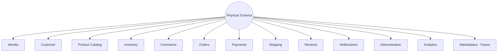
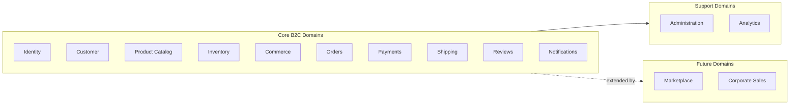
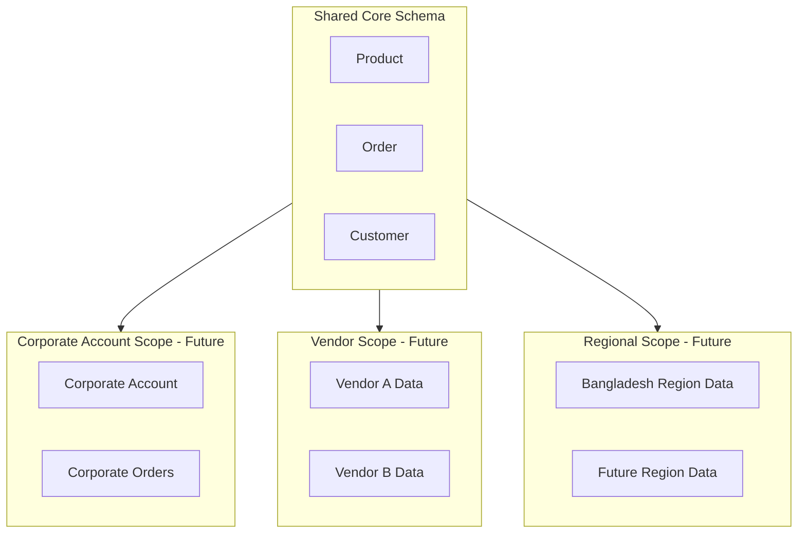

# Physical Schema Design Strategy

## 1. Document Purpose

This document is the official Physical Schema Design Strategy for **StackLeo Tech Store**. It explains how the conceptual and logical entities defined in `data-model.md` and `entity-relationship.md` are translated into a scalable, maintainable physical database schema.

- **Purpose of Physical Schema Design** — to define the organizing principles, naming standards, and structural strategy that guide how entities become physically stored structures, ensuring consistency across every domain rather than leaving each team to improvise independently.
- **Relationship with Conceptual and Logical Models** — this document takes the entities and relationships already defined in `data-model.md` and `entity-relationship.md` as given, and defines *how* they should be structured physically, not *what* they mean.
- **Relationship with Application Architecture** — schema organization mirrors the bounded contexts and services defined in `03_System_Design/bounded-contexts.md` and `service-architecture.md`, so that each service's data ownership is physically reflected, not just conceptually asserted.
- **Long-Term Maintainability** — a disciplined, consistent schema strategy prevents the physical database from becoming harder to understand and evolve than the business it represents, as StackLeo scales through the growth stages defined in `03_System_Design/scalability-strategy.md`.

This document is implementation-independent. It does not include SQL, `CREATE TABLE` statements, ORM models, or database-specific syntax — it defines strategic design standards at a conceptual level, consistent with `04_Database/README.md`.

## 2. Schema Design Principles

- **Simplicity** — the schema favors the simplest structure that correctly represents the business model, avoiding unnecessary structural complexity, consistent with ARCH-023.
- **Consistency** — the same structural pattern is applied consistently across all domains (Section 3), reducing cognitive load for anyone working across multiple domains.
- **Normalization Awareness** — the schema is normalized by default (per `normalization.md`) to avoid data duplication and inconsistency.
- **Controlled Denormalization** — deviations from normalization are deliberate, documented, and justified by a specific, validated performance need, never applied by default.
- **Extensibility** — the schema organization anticipates future domains (Marketplace, Corporate Sales) extending existing structure rather than requiring parallel, disconnected structures.
- **Performance** — structural decisions consider anticipated query patterns (per `entity-relationship.md`) without compromising correctness for speed prematurely.
- **Scalability** — schema organization anticipates future partitioning and replication needs (Section 9), consistent with `database-strategy.md` (Section 5).
- **Auditability** — every domain's schema includes the audit information needed to reconstruct who changed what and when (Section 6).
- **Backward Compatibility** — schema evolution (per `migration-strategy.md`) preserves existing consumer expectations wherever reasonably possible, consistent with ARCH-023.

## 3. Schema Organization Strategy

The physical schema is organized into domain-aligned groupings, mirroring the bounded contexts defined in `03_System_Design/bounded-contexts.md`. Grouping by business domain — rather than by technical convenience or alphabetically — keeps each domain's structures discoverable in one place, reduces the risk of cross-domain coupling, and lets each domain evolve independently.

| Domain Grouping | Contains Structures For | Owning Service (per `service-architecture.md`) |
|---|---|---|
| Identity | User, Role, Permission, Session | Authentication Service, Authorization Service |
| Customer | Customer, Address, Wishlist, Customer Preferences | User Profile Service, Wishlist Service |
| Product Catalog | Product, Brand, Category, Product Variant, Product Media, Specification, Attribute | Product Service, Category Service, Brand Service |
| Inventory | Warehouse, Inventory, Stock Movement, Supplier (Future) | Inventory Service, Warehouse Service |
| Commerce | Cart, Coupon, Promotion | Cart Service, Coupon Service, Promotion Service |
| Orders | Order, Order Item, Invoice | Order Service, Invoice Service |
| Payments | Payment, Refund, Transaction | Payment Service |
| Shipping | Shipment, Delivery Tracking, Courier | Shipping Service, Delivery Tracking Service |
| Reviews | Review, Rating | Review Service |
| Notifications | Notification, Customer Preferences (reference) | Notification Service |
| Administration | Admin User, Audit Record, Configuration | Admin Service, Audit Service, Configuration Service |
| Analytics | Business Metrics, Operational Metrics | Reporting Service, Dashboard Service |
| Marketplace (Future) | Vendor, Vendor Product, Marketplace Order, Commission | Marketplace Service |

*Diagram: Physical Schema Organization Overview.*

*Diagram: Domain-Based Schema Layout.*

## 4. Naming Standards

Naming standards are described conceptually, without prescribing database-specific syntax:

| Element | Conceptual Naming Standard |
|---|---|
| Tables | Singular, business-meaningful nouns reflecting the entity they represent (e.g., a structure representing "Order," not "Orders" or "tbl_order"), consistent with `entity-relationship.md`. |
| Columns | Descriptive, business-meaningful names reflecting the attribute they hold, avoiding cryptic abbreviation. |
| Primary Keys | A consistent, predictable naming pattern identifying the structure's unique identifier, applied uniformly across every domain. |
| Foreign Keys | A consistent naming pattern that makes clear which related entity is being referenced, without requiring the reader to inspect the relationship separately. |
| Constraints | Named descriptively enough to convey the business rule being enforced (e.g., a constraint enforcing non-negative stock, per BR-030) when a name is required. |
| Indexes | Named to convey their purpose (e.g., supporting a specific frequent query pattern) rather than an arbitrary sequence number. |
| Views | Named to reflect the business question or aggregation they answer, distinguishing them clearly from base tables. |
| Junction Tables | Named to reflect the relationship they represent between two entities (e.g., the association between Role and Permission), not merely a concatenation of both names without business context. |
| Audit Fields | A consistent, standard set of fields (Section 6) applied identically across every domain's structures. |

### Naming Convention Matrix

| Element | Convention Style | Consistency Expectation |
|---|---|---|
| Tables | Singular, business noun | Identical style across all 13 domains (Section 3) |
| Columns | Descriptive, unabbreviated | Identical style across all domains |
| Primary Keys | Consistent identifier pattern | Applied uniformly, never domain-specific variation |
| Foreign Keys | Reference-clarifying pattern | Applied uniformly |
| Junction Tables | Relationship-descriptive | Reflects the business relationship being modeled |
| Audit Fields | Standard field set (Section 6) | Identical across every table in every domain |

## 5. Key Strategy

- **Identifier Philosophy** — every entity requires a stable, unique identifier that does not change over the entity's lifetime, independent of any business attribute that might itself change (e.g., a Customer's contact detail).
- **Primary Key Strategy** — each structure is uniquely identified by a single, stable identifier, avoiding composite identification schemes except where a genuine business concept requires it (e.g., a junction association).
- **Foreign Key Philosophy** — relationships between structures (per `entity-relationship.md`) are represented through reference to the related entity's identifier, preserving the ownership and cardinality rules already defined there.
- **Business Keys vs. Surrogate Keys** — a surrogate (system-generated, meaningless) identifier is preferred as the primary identifier, since business-meaningful values (e.g., SKU, Order Number) can change format or convention over time; business keys are retained as a distinct, separately governed identifier for external reference.
- **UUID Readiness** — the identifier strategy is designed to be compatible with globally unique identifier approaches, supporting future distributed or multi-region data generation (`database-strategy.md`, Section 5) without requiring a redesign.
- **External Reference IDs** — externally facing references (Order Number, Tracking Number, SKU) are modeled as distinct, human-meaningful identifiers separate from the internal surrogate identifier, consistent with the Value Object distinction made in `03_System_Design/domain-model.md` (Section 5).

### Identifier Strategy

| Identifier Type | Purpose | Example Entities |
|---|---|---|
| Surrogate Identifier | Stable, internal, system-generated unique identifier for every entity. | All entities |
| Business Key | Human-meaningful, externally referenced identifier, governed separately from the surrogate identifier. | Order (Order Number), Product (SKU), Shipment (Tracking Number) |
| Foreign Reference | An identifier referencing a related entity, preserving relationships defined in `entity-relationship.md`. | Order Item → Order, Inventory → Warehouse |
| External System Reference | An identifier correlating StackLeo's record with an external system's record (e.g., Payment Gateway transaction reference). | Payment, Shipment |

## 6. Audit Strategy

Every domain's structures include a consistent, standard set of audit information, applied identically regardless of domain:

| Audit Concept | Description |
|---|---|
| Created | The point in time (and, where relevant, the responsible actor) at which a record came into existence. |
| Updated | The point in time (and responsible actor, for governed changes) at which a record was last modified. |
| Archived | An indication that a record is no longer part of active business use but has not been deleted, per `data-retention.md`. |
| Deleted | An indication that a record has been logically removed (Section 7), distinct from physical removal. |
| Versioning | A mechanism for tracking that a record has changed over time, supporting conflict detection and historical reconstruction where required. |
| Change Tracking | A more granular record of what specifically changed, applied selectively to governed, business-critical structures (e.g., pricing, inventory adjustments), consistent with `02_Product/user-roles.md` (Section 12) audit requirements. |

### Audit Field Strategy

| Domain | Standard Audit Fields Applied | Enhanced Change Tracking Applied |
|---|---|---|
| Identity | Created, Updated | Yes — login and permission changes are security-sensitive (BR-104) |
| Customer | Created, Updated, Deleted | No — standard audit sufficient |
| Product Catalog | Created, Updated, Archived | Yes — price and publish state changes are governed (BR-024, BR-028) |
| Inventory | Created, Updated | Yes — every stock change is a Stock Movement record (BR-038, BR-039) |
| Orders | Created, Updated | Yes — order status changes are business-critical and audited |
| Payments | Created, Updated | Yes — all payment and refund actions are audited (BR-104) |
| Administration | Created, Updated | Yes — all administrative actions are audited by design |
| All Other Domains | Created, Updated, Archived | No, unless a specific governed action requires it |

## 7. Soft Delete Strategy

- **Logical Deletion** — records representing business-significant history (Orders, Payments, Reviews) are never physically removed; they are logically marked as deleted or archived, preserving the permanent record required by `01_Business/business-rules.md` and compliance obligations.
- **Recovery** — logical deletion allows a mistakenly removed record to be recovered without requiring backup restoration, reducing operational risk.
- **Auditability** — logical deletion preserves the audit trail (Section 6) even for records no longer in active use, satisfying `02_Product/user-roles.md` (Section 12) immutability requirements.
- **Business Considerations** — some data categories (e.g., an abandoned Cart) have no business reason for permanent retention and may be genuinely, physically removed per `data-retention.md`; the soft delete strategy applies specifically to data with lasting business or compliance significance, not universally.

## 8. Multi-Tenancy Readiness

- **Corporate Accounts (Future)** — the schema organization anticipates a future Corporate Account structure that scopes bulk Orders and negotiated terms to a specific organization, extending the existing Customer and Order domains without requiring a separate schema per corporate account.
- **Marketplace Vendors (Future)** — the Marketplace domain (Section 3) is structured so each Vendor's data is clearly scoped and isolable, supporting future per-vendor reporting and access control without requiring physically separate databases per vendor.
- **Regional Expansion (Future)** — the schema anticipates future region-scoping (e.g., an explicit region reference on Address and Shipment structures) to support multi-region operation, consistent with `03_System_Design/scalability-strategy.md` (Section 7), without requiring a redesign of core entities.

*Diagram: Multi-Tenant Readiness Model.*

## 9. Future Evolution

| Future Direction | Schema Design Readiness |
|---|---|
| Partitioning | High-volume domains (Orders, Inventory Stock Movement) are structured with a meaningful partitioning dimension (e.g., time) in mind, per `partitioning-strategy.md`. |
| Read Replicas | Read-heavy domains (Product Catalog) are organized to be cleanly replicable without complex cross-domain joins, per `database-strategy.md` (Section 5). |
| Data Warehouse | Analytics domain structures (Section 3) are designed to be fed from, rather than embedded within, transactional domains, per `database-strategy.md` (Section 9). |
| AI | AI-assisted capability consumes existing domain structures as read-only inputs, requiring no new schema organization pattern. |
| Analytics | The Analytics domain grouping is designed to mature independently as reporting needs grow, without requiring transactional domains to be restructured. |
| Marketplace | The Marketplace domain (Section 3) extends Product Catalog and Orders, consistent with `03_System_Design/domain-model.md` (Section 11). |
| Global Expansion | Multi-region readiness (Section 8) allows schema organization to extend to region-scoped structures without redesigning the core domains. |

### Schema Evolution Roadmap

| Roadmap Phase (per `product-roadmap.md`) | Schema Design Milestone |
|---|---|
| Phase 2 (MVP Launch) | Core domain schema organization established (Section 3), consistent naming and audit standards applied. |
| Phase 3 (Business Growth) | Read-optimized structures introduced for Product Catalog and Search-adjacent domains. |
| Phase 4 (Enterprise) | Partitioning readiness activated for high-volume Order and Inventory structures; Corporate Sales domain introduced. |
| Phase 5 (Marketplace) | Marketplace domain schema activated, extending Product Catalog and Orders. |
| Phase 6 (AI & Automation) | Analytics domain schema matures to support AI and forecasting consumption. |
| Phase 7 (Global Expansion) | Regional scoping extended across Customer, Address, and Shipping domains. |

*Diagram: Schema Evolution Roadmap.*

## 10. Governance

- **Schema Review Process** — proposed schema changes are reviewed against the principles in Section 2 and the domain organization in Section 3 before adoption, ensuring consistency across the entire physical schema.
- **Change Management** — material schema changes are recorded in `00_Project_Overview/changelog.md` and evaluated for downstream impact using `migration-strategy.md`.
- **Versioning** — this document follows the Semantic Versioning approach defined in `00_Project_Overview/changelog.md`.
- **Documentation Standards** — this document follows the enterprise Markdown conventions established across this repository, consistent with `04_Database/README.md`.

## 11. Document Information

| Property | Value |
|----------|-------|
| Document | schema-design.md |
| Version | 1.0.0 |
| Status | Active |
| Maintained By | StackLeo |
| Last Updated | 2026-07-17 |

---

© StackLeo. All Rights Reserved.
