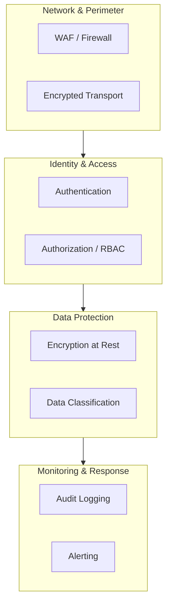
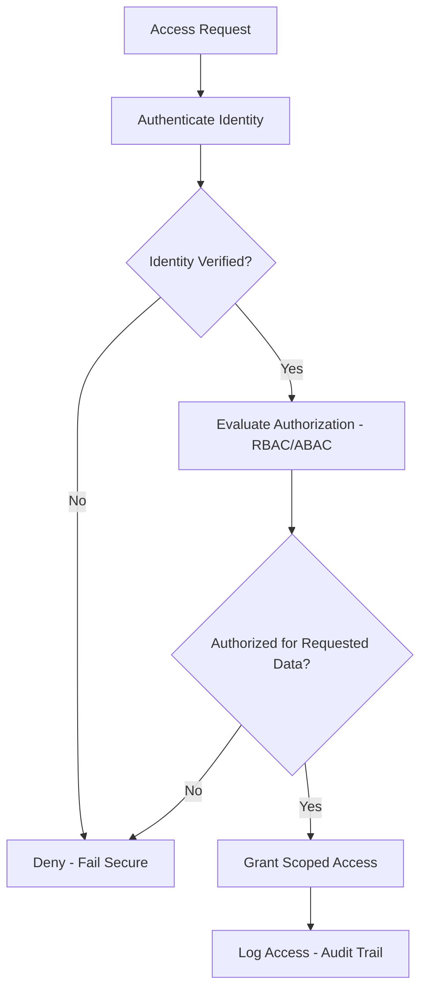
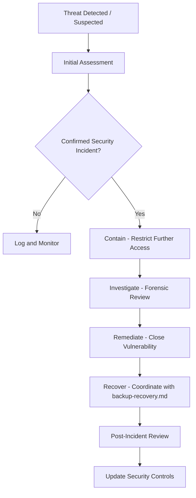
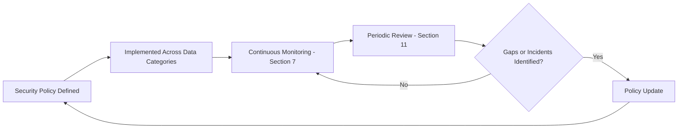

# Database Security Architecture

## 1. Document Purpose

This document is the official Database Security Architecture for **StackLeo Tech Store**. It defines enterprise-level principles, governance, and conceptual controls for protecting business data throughout its lifecycle.

- **Purpose of Database Security** — to protect the confidentiality, integrity, and availability of StackLeo's business data, since a security failure at the data layer is a direct failure of the trust the entire business depends on.
- **Relationship with Enterprise Security** — this document elaborates the data-layer application of the security principles defined in `03_System_Design/architecture-principles.md` (Section 7) and `quality-attributes.md` (Section 7).
- **Relationship with Business Continuity** — data security and business continuity are interdependent: a security incident affecting data availability is also a continuity incident, coordinated with `backup-recovery.md`.
- **Relationship with Compliance Readiness** — this security model provides the technical and procedural foundation supporting the compliance obligations defined in `01_Business/business-rules.md` (Section 17) and `data-governance.md`.
- **Relationship with Data Governance** — security defines *how* data is protected; `data-governance.md` defines *who* is accountable for it; the two frameworks operate together, sharing the classification model defined there.

This document is implementation-independent and vendor-neutral. It does not recommend specific security products, cloud-specific services, SQL, or implementation scripts — it defines security architecture conceptually.

## 2. Security Principles

- **Zero Trust** — no request is trusted by default based on network location or prior authentication elsewhere; every access to data is verified at the point of access, consistent with ARCH-034.
- **Defense in Depth** — data protection relies on multiple independent layers (Section 3 diagram), so that a single control failure does not result in full compromise, consistent with ARCH-035.
- **Least Privilege** — every actor and system component is granted only the data access necessary for its defined responsibility, consistent with ARCH-033.
- **Secure by Design** — security is embedded in data architecture from the outset, consistent with `03_System_Design/architecture-decisions.md` (ADR-015).
- **Privacy by Design** — data collection and access default to the minimum necessary, consistent with ARCH-015 and `01_Business/business-rules.md` (BR-128).
- **Separation of Duties** — no single actor can both perform and approve the same high-impact data change, consistent with `02_Product/user-roles.md` (Section 11).
- **Fail Secure** — when a security control cannot verify a request, the default outcome is denial of access, never silent permission.
- **Continuous Verification** — trust is never assumed to persist indefinitely; access and identity are re-verified at meaningful intervals and boundaries, consistent with Zero Trust.

*Diagram: Defense-in-Depth Architecture.*

## 3. Data Protection Strategy

| Data Category | Sensitivity | Business Impact if Compromised | Protection Expectations |
|---|---|---|---|
| Customer Data | High | Direct harm to customer trust; privacy violation. | Encrypted, least-privilege access, per BR-128. |
| Identity Data | High | Account takeover risk; cascading unauthorized access. | Strong encryption, strict access control, continuous verification. |
| Product Data | Low-to-moderate | Limited direct harm; mostly public-facing. | Integrity protection prioritized over confidentiality. |
| Inventory Data | Moderate | Operational disruption if manipulated (e.g., false availability). | Access restricted to authorized operational roles. |
| Orders | High | Financial and personal data exposure; fraud risk. | Encrypted, strict access control, full auditability. |
| Payments | Highest | Direct financial harm; regulatory exposure. | Strongest encryption, most restrictive access, mandatory audit logging. |
| Shipping | Moderate-to-high | Customer address/contact exposure. | Encrypted, access limited to fulfillment-relevant roles. |
| Reviews | Low | Limited harm; largely public content. | Integrity protection; moderation-related access control. |
| Audit Records | High | Undermines accountability and compliance if tampered with. | Immutable, strictly access-controlled, independently monitored. |
| Analytics Data | Low-to-moderate | Limited direct harm if aggregated/anonymized appropriately. | Anonymization/pseudonymization applied per `data-retention.md` (Section 7). |
| Marketplace Data (Future) | High | Seller financial and business data exposure. | Same protection tier as Orders/Payments once active. |

### Data Classification vs. Protection Matrix

| Classification (per `data-governance.md`) | Encryption Requirement | Access Control Requirement | Audit Requirement |
|---|---|---|---|
| Public | Integrity protection only | Open access | Not required |
| Internal | Standard encryption in transit | Authenticated staff access | Standard logging |
| Confidential | Encryption at rest and in transit | Least-privilege, role-scoped access | Access logged |
| Restricted | Strongest encryption, at rest and in transit | Narrowly scoped, explicitly approved access | Mandatory, immutable audit logging |

## 4. Encryption Strategy

- **Encryption at Rest** — data classified Confidential or Restricted (Section 3) is encrypted while stored, protecting it against unauthorized access to underlying storage.
- **Encryption in Transit** — all data movement across a network or trust boundary is encrypted by default, consistent with `03_System_Design/deployment-architecture.md` (Section 9).
- **Key Rotation** — cryptographic keys are rotated on a defined, disciplined schedule, limiting the impact window of any single key's potential compromise.
- **Key Lifecycle** — every key has a defined lifecycle — generation, active use, rotation, and retirement — managed deliberately rather than indefinitely reused.
- **Cryptographic Agility** — encryption approaches are selected and structured so that StackLeo can adopt stronger cryptographic methods over time without a fundamental architectural redesign.
- **Secure Storage of Secrets** — encryption keys and related secrets are stored separately from the data they protect, consistent with `03_System_Design/architecture-principles.md` (ARCH-030).

### Encryption Strategy Summary

| Data State | Encryption Approach | Applies To |
|---|---|---|
| At Rest | Applied to Confidential and Restricted data by default | Customer Data, Orders, Payments, Audit Records |
| In Transit | Applied universally across all network boundaries | All data, regardless of classification |
| Key Management | Centralized, isolated from application data | All encrypted data categories |
| Backup Data | Encrypted consistent with its source data's classification | Per `backup-recovery.md` (Section 8) |

## 5. Identity & Access Management

- **Authentication Concepts** — every actor accessing data must first present a verified identity, per `03_System_Design/architecture-decisions.md` (ADR-013).
- **Authorization Concepts** — every data access request is evaluated against the requesting identity's permitted scope before being granted, per ADR-014.
- **Role-Based Access Control (RBAC)** — data access is governed by the role model defined in `02_Product/user-roles.md`, ensuring access aligns with genuine organizational responsibility.
- **Attribute-Based Access Control (ABAC) Readiness** — the access model anticipates future scoping by attribute (e.g., warehouse location, region), consistent with `02_Product/user-roles.md` (UR-048), without requiring a redesign of the current RBAC foundation.
- **Least Privilege** — every role's data access is scoped to the minimum necessary, reviewed periodically per `data-governance.md` (Section 9).
- **Privileged Access Management** — elevated access (e.g., Super Admin) is granted sparingly, time-bound where used exceptionally, and closely monitored, per `02_Product/user-roles.md` (Section 14.5).
- **Service-to-Service Identity** — services accessing data on behalf of a business process authenticate and are authorized as distinct identities, consistent with Zero Trust (Section 2), not granted implicit trust based on network location.

*Diagram: Identity & Access Control Flow.*

### Access Control Matrix

| Actor Category | Customer Data | Orders/Payments | Product Catalog | Audit Records |
|---|---|---|---|---|
| Guest | No access | No access | Public read access | No access |
| Customer | Own data only | Own orders/payments only | Public read access | No access |
| Customer Support | Scoped, case-relevant access | Scoped, case-relevant access | Read access | No access |
| Finance Officer | No access (unless case-relevant) | Full access | No access | Read access (financial actions) |
| Admin | Scoped administrative access | Scoped administrative access | Full administrative access | No direct write access |
| Auditor | Read-only, audit-scoped | Read-only, audit-scoped | Read-only | Full read access |
| Super Admin | Full access (governed, logged) | Full access (governed, logged) | Full access | Read access, no modification |

## 6. Secrets & Key Management

- **Secret Lifecycle** — every secret (credential, key, token) has a defined lifecycle from creation through rotation to retirement, consistent with Section 4.
- **Key Management Principles** — encryption keys are managed centrally and separately from the data they protect, with access to key management itself tightly restricted.
- **Credential Rotation** — credentials are rotated on a disciplined schedule and immediately upon any suspected compromise.
- **Secret Isolation** — secrets are never embedded in code, configuration files committed to version control, or logs, consistent with ARCH-030.
- **Emergency Recovery** — a defined, governed process exists for recovering access in the event of key or credential loss, balancing recoverability against the risk of an easily exploitable backdoor.
- **Access Governance** — access to secrets and key management capability is itself governed under the same least-privilege and audit principles applied to business data (Sections 2, 5).

## 7. Audit & Monitoring

- **Audit Logging** — every governed action affecting Confidential or Restricted data (Section 3) is logged immutably, consistent with `02_Product/user-roles.md` (Section 12).
- **Security Events** — authentication failures, unauthorized access attempts, and permission changes are treated as security events requiring visibility, consistent with `03_System_Design/observability.md` (Section 4).
- **Access Reviews** — access grants to sensitive data are periodically reviewed for continued justification, per `data-governance.md` (Section 9).
- **Monitoring** — data access patterns are continuously monitored for anomalies, consistent with `03_System_Design/observability.md` (Section 3).
- **Alerting** — security-relevant conditions generate timely, actionable alerts, consistent with `03_System_Design/observability.md` (Section 7).
- **Incident Readiness** — StackLeo maintains a defined process for responding to a suspected or confirmed security incident (Section 8).
- **Forensic Readiness** — audit logs and monitoring data are retained and structured (per `data-retention.md`) sufficiently to support post-incident investigation.

## 8. Threat Model

| Threat | Business Impact | High-Level Mitigation Principles |
|---|---|---|
| Unauthorized Access | Exposure of Confidential or Restricted data, undermining customer trust. | Zero Trust verification, least privilege, strong authentication (Sections 2, 5). |
| Insider Threats | Misuse of legitimate access by an internal actor. | Separation of duties, access reviews, audit logging (Sections 2, 7). |
| Data Leakage | Unintended exposure of sensitive data outside its intended boundary. | Data classification-driven handling, encryption, least-privilege access (Sections 3–4). |
| Credential Compromise | Unauthorized access using a legitimate but stolen credential. | Strong password/session policy, MFA readiness, credential rotation (Section 6, `technology-stack.md` Section 4.5). |
| Injection Risks | Malicious input manipulating data access or integrity. | Input validation at every boundary, consistent with `03_System_Design/architecture-principles.md` (ARCH-028). |
| Privilege Escalation | An actor gaining access beyond their authorized scope. | Strict RBAC enforcement, no self-elevation (per `02_Product/user-roles.md`, UR-006). |
| Ransomware | Malicious encryption or destruction of business data, demanding payment for recovery. | Immutable backup readiness (Section 9), isolated backups, rapid recovery capability. |
| Backup Compromise | Unauthorized access to or corruption of backup data. | Backup isolation and encryption, consistent with `backup-recovery.md` (Section 8). |

*Diagram: Threat Response Workflow.*

### Threat & Risk Matrix

| Threat | Likelihood | Impact | Priority |
|---|---|---|---|
| Unauthorized Access | Medium | High | Critical |
| Insider Threats | Low | High | High |
| Data Leakage | Medium | High | Critical |
| Credential Compromise | Medium | High | Critical |
| Injection Risks | Medium | Medium | High |
| Privilege Escalation | Low | High | High |
| Ransomware | Low | Critical | Critical |
| Backup Compromise | Low | Critical | High |

## 9. Resilience & Recovery

- **Secure Backup Alignment** — backup data is protected with the same rigor as the primary data it represents, consistent with `backup-recovery.md` (Section 8).
- **Recovery Security** — the recovery process itself is a governed, access-controlled operation, preventing recovery capability from becoming an alternate attack path.
- **Immutable Backup Readiness** — the security model anticipates immutable backups (Section 8, Ransomware mitigation) as a future protection against malicious backup tampering.
- **Disaster Recovery Integration** — security controls extend to the Disaster Recovery environment defined in `03_System_Design/deployment-architecture.md` (Section 10), ensuring recovery does not become a security gap.
- **Operational Resilience** — security and resilience are treated as complementary, not competing, priorities; a secure system that cannot recover is not truly resilient, and a recoverable system that is insecure is not truly protected.

## 10. Future Evolution

| Future Direction | Security Model Readiness |
|---|---|
| Confidential Computing | The layered security model (Section 2) is structured to incorporate confidential computing approaches as an additional protection layer, should future scale and sensitivity warrant it. |
| AI Security | AI-assisted capability (Phase 6) will be governed under the same classification and access principles (Sections 3, 5), with additional consideration for training data provenance and model output integrity. |
| Multi-Region | Security controls extend consistently across regions, per `03_System_Design/scalability-strategy.md` (Section 7), without a different security posture per region. |
| Multi-Cloud | Security architecture remains provider-neutral, consistent with `03_System_Design/deployment-architecture.md` (Section 1). |
| Marketplace Security | Vendor and Marketplace Order data (Future) are governed under the same Restricted-tier protection as core financial data once active. |
| Advanced Threat Detection | Monitoring and alerting (Section 7) provide the foundation for future AI-assisted anomaly and threat detection. |
| Quantum-Resistant Cryptography Readiness | The cryptographic agility principle (Section 4) ensures StackLeo can adopt quantum-resistant cryptographic approaches in the future without a fundamental architectural redesign. |

## 11. Governance

- **Security Ownership** — the Security Lead owns this document's accuracy and the overall database security posture, in partnership with the Database Architect.
- **Security Review Process** — this document is reviewed following any security incident, and at the conclusion of each phase defined in `02_Product/product-roadmap.md`.
- **Risk Assessment** — the Threat & Risk Matrix (Section 8) is reassessed periodically and whenever new capability (e.g., Marketplace) introduces new data categories.
- **Exception Management** — any deviation from this security model requires explicit, documented approval from the Security Lead, time-bound wherever possible.
- **Documentation Standards** — this document follows the enterprise Markdown conventions established across this repository.
- **Versioning** — this document follows the Semantic Versioning approach defined in `00_Project_Overview/changelog.md`.

### Security Governance Responsibilities

| Role | Responsibility |
|---|---|
| Security Lead | Owns database security posture and this document's accuracy. |
| Database Architect | Ensures security controls are consistent with `schema-design.md` and `database-strategy.md`. |
| Data Owner (per `data-governance.md`) | Ensures their data category's protection matches its classification (Section 3). |
| Auditor | Independently verifies security control effectiveness and audit trail completeness. |
| DevOps Lead | Implements infrastructure-level security controls, per `03_System_Design/deployment-architecture.md` (Section 9). |
| Founder / Business Owner | Approves significant security exceptions and incident-driven policy changes. |

*Diagram: Security Governance Lifecycle.*

## 12. Anti-Patterns

| Anti-Pattern | Why It Is Avoided |
|---|---|
| Shared Credentials | Shared credentials eliminate individual accountability and make access review and incident investigation meaningless. |
| Hardcoded Secrets | Secrets embedded in code or configuration files are easily exposed and difficult to rotate, violating ARCH-030. |
| Excessive Privileges | Access broader than genuinely needed increases the impact of any single compromised credential, violating least privilege (Section 2). |
| Unencrypted Sensitive Data | Confidential or Restricted data stored or transmitted without encryption (Section 4) is exposed to anyone who gains underlying access. |
| Missing Audit Logs | Ungoverned or unlogged access to sensitive data eliminates the accountability and forensic readiness described in Section 7. |
| Weak Key Rotation | Keys that are never rotated extend the impact window of any single key compromise indefinitely. |
| Overly Broad Access | Access scoped to an entire data category when only a subset is genuinely needed unnecessarily increases exposure. |
| Security Through Obscurity | Relying on secrecy of design or implementation, rather than genuine controls, provides no real protection once that secrecy is inevitably lost. |

### Security Anti-Pattern Summary

| Anti-Pattern | Primary Risk | Mitigation |
|---|---|---|
| Shared Credentials | Loss of individual accountability | Enforce unique identity per actor (Section 5) |
| Hardcoded Secrets | Easy exposure, difficult rotation | Enforce secret isolation (Section 6) |
| Excessive Privileges | Amplified impact of compromise | Enforce least privilege and periodic access review (Sections 2, 5) |
| Unencrypted Sensitive Data | Direct exposure risk | Enforce classification-driven encryption (Section 4) |
| Missing Audit Logs | No accountability or forensic trail | Enforce mandatory audit logging for Restricted/Confidential data (Section 7) |
| Weak Key Rotation | Extended compromise impact window | Enforce disciplined key rotation schedule (Section 4) |
| Overly Broad Access | Unnecessary exposure | Scope access to genuine need (Section 5) |
| Security Through Obscurity | False sense of protection | Rely on genuine, layered controls (Section 2) |

## 13. Document Information

| Property | Value |
|----------|-------|
| Document | security-model.md |
| Version | 1.0.0 |
| Status | Active |
| Maintained By | StackLeo |
| Last Updated | 2026-07-17 |

---

© StackLeo. All Rights Reserved.
