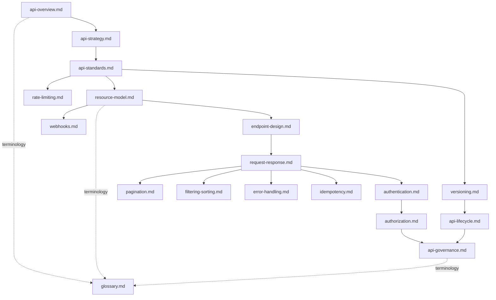

# 05_API

## 1. Overview

This folder contains the official API Architecture documentation for **StackLeo Tech Store**. It defines how the platform exposes its capabilities — established across `02_Product`, `03_System_Design`, and `04_Database` — to consumers: web and future mobile clients, internal services, and eventual third-party and partner integrations.

This README is the navigation hub for `05_API`. It explains the purpose of each document, the recommended reading order, and how this folder relates to the rest of the repository. This folder is strictly implementation independent: it does not define API endpoints, does not contain OpenAPI specifications, and does not include code examples. It documents the *architecture and governance* of the API layer — the principles, standards, and structural decisions that any concrete API implementation must honor — not the API itself.

## 2. Objectives

The documentation in `05_API` exists to ensure the platform's API layer achieves:

- **Consistency** — every API surface behaves predictably, following the same design, naming, and structural conventions regardless of which domain it exposes.
- **Scalability** — the API layer supports growth from a single web client through multiple channels (mobile, POS, partner integrations) and multiplying request volume, consistent with `03_System_Design/scalability-strategy.md`.
- **Security** — every API interaction is authenticated, authorized, and protected by design, consistent with `03_System_Design/architecture-principles.md` and the future `09_Security` folder.
- **Reliability** — APIs behave predictably under failure, degrade gracefully, and provide consumers the means to safely retry operations.
- **Maintainability** — the API layer can evolve without breaking existing consumers, through disciplined versioning and change management.
- **Discoverability** — consumers, internal and external, can understand what an API offers and how to use it without reverse-engineering behavior.
- **Developer Experience** — building against StackLeo's APIs is predictable, well-documented, and free of unnecessary friction.
- **Future Extensibility** — the API architecture accommodates future channels, future business models (Corporate Sales, Wholesale, Multi-Vendor Marketplace), and future markets without structural rework.

## 3. Documentation Guide

| Document | Description |
|---|---|
| `api-overview.md` | Introduces the API architecture's purpose, scope, and place within the overall system architecture. |
| `api-strategy.md` | Defines the high-level strategic approach to API design, exposure, and evolution over time. |
| `api-standards.md` | Establishes the conventions and quality expectations every API must follow. |
| `resource-model.md` | Defines how business domains and entities are represented as API resources. |
| `endpoint-design.md` | Defines the structural principles governing how endpoints are organized and named, without specifying literal endpoints. |
| `request-response.md` | Defines the conceptual structure and conventions for API requests and responses. |
| `authentication.md` | Defines how API consumers establish and prove their identity. |
| `authorization.md` | Defines how API access is governed once identity is established. |
| `versioning.md` | Defines the strategy for evolving APIs without breaking existing consumers. |
| `pagination.md` | Defines the conceptual approach to returning large result sets efficiently. |
| `filtering-sorting.md` | Defines the conceptual approach to narrowing and ordering API results. |
| `error-handling.md` | Defines how APIs communicate failure consistently and meaningfully. |
| `rate-limiting.md` | Defines how API consumption is governed to protect platform stability and fairness. |
| `idempotency.md` | Defines how APIs guarantee safe retry behavior for critical operations. |
| `webhooks.md` | Defines the conceptual approach to asynchronous, event-driven notification to external consumers. |
| `api-lifecycle.md` | Defines how APIs progress from design through deprecation and retirement. |
| `api-governance.md` | Defines ownership, review, and compliance processes governing the API layer. |
| `glossary.md` | Defines API-specific terminology, extending `03_System_Design/glossary.md` and `04_Database/glossary.md`. |

### Document Index

| # | Document | Category |
|---|---|---|
| 1 | `api-overview.md` | Foundation |
| 2 | `api-strategy.md` | Foundation |
| 3 | `api-standards.md` | Foundation |
| 4 | `resource-model.md` | Design |
| 5 | `endpoint-design.md` | Design |
| 6 | `request-response.md` | Design |
| 7 | `authentication.md` | Security |
| 8 | `authorization.md` | Security |
| 9 | `versioning.md` | Evolution |
| 10 | `pagination.md` | Interaction Patterns |
| 11 | `filtering-sorting.md` | Interaction Patterns |
| 12 | `error-handling.md` | Interaction Patterns |
| 13 | `rate-limiting.md` | Reliability & Protection |
| 14 | `idempotency.md` | Reliability & Protection |
| 15 | `webhooks.md` | Extensibility |
| 16 | `api-lifecycle.md` | Governance |
| 17 | `api-governance.md` | Governance |
| 18 | `glossary.md` | Reference |

## 4. Recommended Reading Order

| Order | Document | Why This Order |
|---|---|---|
| 1 | `api-overview.md` | Establishes the purpose and scope of the API architecture. |
| 2 | `api-strategy.md` | Establishes the strategic direction before detailed design begins. |
| 3 | `api-standards.md` | Establishes the conventions every subsequent document builds upon. |
| 4 | `resource-model.md` | Defines the resources the rest of this folder's design decisions act upon. |
| 5 | `endpoint-design.md` | Defines how those resources are structurally organized and accessed. |
| 6 | `request-response.md` | Defines how consumers exchange data with those endpoints. |
| 7 | `authentication.md` | Establishes identity before addressing access control. |
| 8 | `authorization.md` | Builds on authentication to govern what an identified consumer may do. |
| 9 | `versioning.md` | Addresses how the design established so far evolves safely over time. |
| 10 | `pagination.md` | Addresses how large result sets are returned efficiently. |
| 11 | `filtering-sorting.md` | Addresses how consumers narrow and order those results. |
| 12 | `error-handling.md` | Addresses how failure is communicated across all prior interaction patterns. |
| 13 | `rate-limiting.md` | Addresses how consumption of the API is governed and protected. |
| 14 | `idempotency.md` | Addresses how critical operations remain safe under retry. |
| 15 | `webhooks.md` | Extends the API's interaction model to asynchronous, event-driven notification. |
| 16 | `api-lifecycle.md` | Frames how everything defined above progresses over its lifetime. |
| 17 | `api-governance.md` | Establishes ownership and process over everything defined above. |
| 18 | `glossary.md` | Consolidates terminology encountered throughout. |

This order mirrors the natural progression of API architectural reasoning: establish purpose and strategy first, define standards and resource structure, address identity and access, then address interaction patterns, protection, extensibility, and lifecycle — concluding with governance and shared terminology.

*Diagram: Document Relationship Map for `05_API`.*

## 5. Relationship with Other Documentation

| Folder | Relationship |
|---|---|
| `02_Product` | `functional-requirements.md`, `use-cases.md`, and `business-workflows.md` define the business capabilities the API layer must expose; API design cannot introduce behavior beyond what these documents establish. |
| `03_System_Design` | `service-architecture.md` and `component-architecture.md` define the services the API layer fronts; `integration-architecture.md` establishes the broader integration context the API architecture operates within. |
| `04_Database` | `data-model.md` and `entity-relationship.md` define the entities that `resource-model.md` translates into API resources; API design must remain consistent with the data ownership boundaries established there. |
| `07_Backend` | Backend services implement the API contracts and business logic this folder's principles govern; `07_Backend` realizes what `05_API` architects. |
| `08_Frontend` | Web and future mobile clients consume the APIs designed here; frontend data-fetching, state, and error-handling patterns depend on the consistency this folder establishes. |
| `09_Security` | Platform-wide security architecture provides the broader security context that `authentication.md` and `authorization.md` operate within; this folder defines the API-layer application of those principles. |
| `11_Deployment` | Deployment architecture provisions the infrastructure — gateways, load balancers, edge protection — that operationalizes the rate-limiting, versioning, and lifecycle strategies defined here. |

### Folder Relationships

| Folder | Direction | Nature of Dependency |
|---|---|---|
| `02_Product` | Upstream | Supplies business capability and behavior requirements |
| `03_System_Design` | Upstream | Supplies service boundaries and integration context |
| `04_Database` | Upstream | Supplies the entity and relationship model behind API resources |
| `07_Backend` | Downstream | Implements the contracts and standards defined here |
| `08_Frontend` | Downstream | Consumes the APIs designed here |
| `09_Security` | Bidirectional | Supplies platform security principles; receives API-layer security requirements |
| `11_Deployment` | Downstream | Provisions infrastructure realizing this folder's operational strategies |

## 6. API Design Principles

- **API First** — the API contract is designed and agreed upon before implementation begins, ensuring the API serves consumer need rather than reflecting internal implementation convenience.
- **Consumer-Centric Design** — APIs are designed from the perspective of what consumers need to accomplish, not from how backend systems happen to be structured.
- **Resource-Oriented Design** — APIs are organized around business resources (per `resource-model.md`), not actions, procedures, or internal system operations.
- **Stateless Communication** — each API interaction is self-contained; the API layer does not depend on server-side session state between requests, supporting scalability and reliability.
- **Consistency** — naming, structure, error handling, and interaction patterns remain uniform across every API surface, regardless of which team or domain owns it.
- **Evolvability** — the API architecture anticipates change, allowing new capability to be added without disrupting existing consumers.
- **Backward Compatibility** — changes to existing APIs preserve the experience of existing consumers wherever possible, with breaking change governed deliberately through `versioning.md` and `api-lifecycle.md`.
- **Observability** — API behavior is transparent and traceable, enabling both consumers and the platform to understand what happened during an interaction, consistent with `03_System_Design/observability.md`.

## 7. Governance

- **Ownership** — the API Architect (or, at current organizational scale, the Solution Architect acting in that capacity) owns the coherence and accuracy of `05_API`, in partnership with the governance model defined in `api-governance.md`.
- **Review Process** — this folder's documentation is reviewed at the conclusion of each phase defined in `02_Product/product-roadmap.md`, and whenever `03_System_Design/service-architecture.md` or `04_Database/data-model.md` changes materially.
- **Documentation Standards** — every document follows the enterprise Markdown conventions established across this repository: numbered sections, Markdown tables for structured data, Mermaid diagrams for visual relationships, and a closing Document Information table.
- **Versioning** — every document in this folder follows the Semantic Versioning approach defined in `00_Project_Overview/changelog.md`; this is distinct from the API versioning strategy defined in `versioning.md`, which governs the APIs themselves.
- **Change Management** — material changes to API architecture are recorded in `00_Project_Overview/changelog.md` and evaluated for consumer impact through the lifecycle process defined in `api-lifecycle.md`.

### Governance Summary

| Aspect | Description |
|---|---|
| Ownership | API Architect / Solution Architect, with governance process defined in `api-governance.md` |
| Review Cadence | End of each `product-roadmap.md` phase; upon material service or data model change |
| Versioning | Semantic Versioning (documentation), per `00_Project_Overview/changelog.md`; API versioning per `versioning.md` |
| Change Record | All material changes recorded in `00_Project_Overview/changelog.md` |
| Compliance Alignment | Reviewed against `01_Business/business-rules.md` and the future `09_Security` folder |

## 8. Document Information

| Property | Value |
|----------|-------|
| Folder | 05_API |
| Version | 1.0.0 |
| Status | Active |
| Maintained By | StackLeo |
| Last Updated | 2026-07-17 |

---

© StackLeo. All Rights Reserved.
