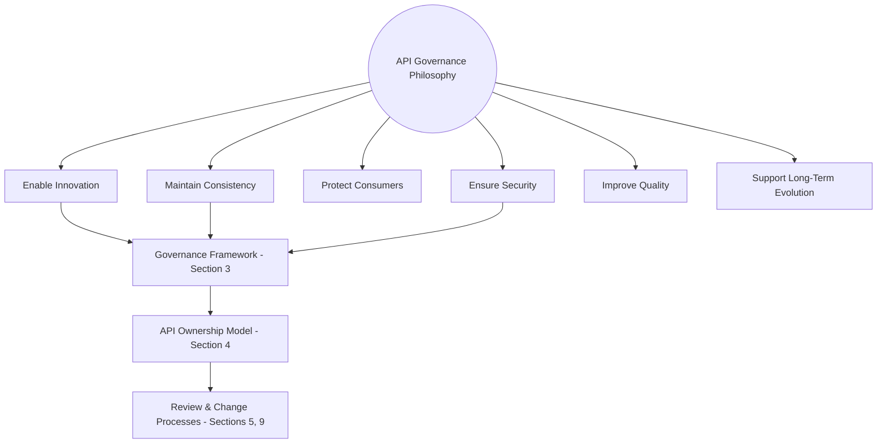
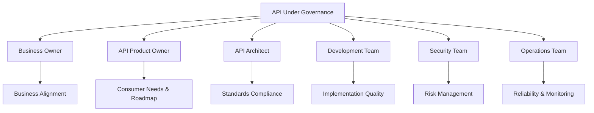
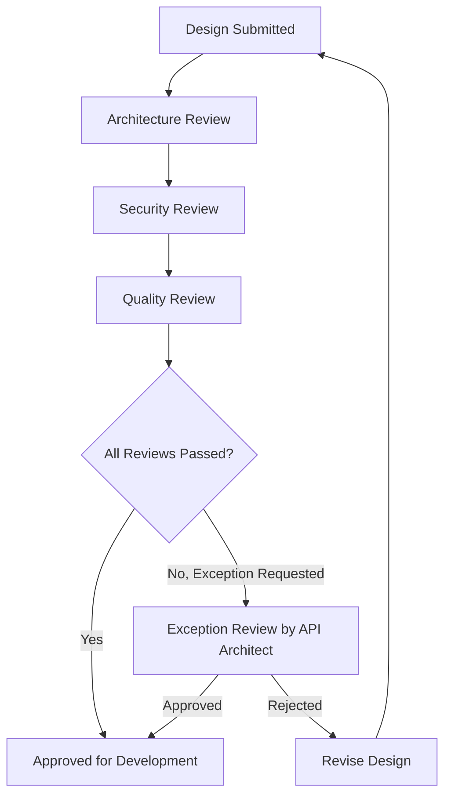
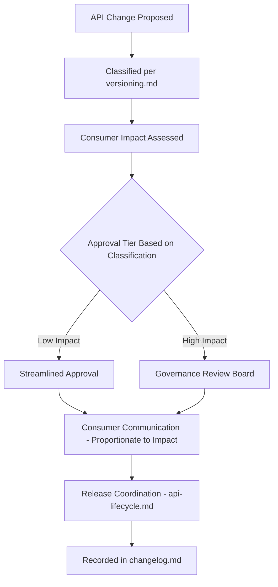
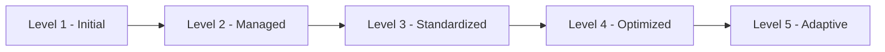

# Enterprise API Governance Framework

## 1. Document Purpose

This document establishes the Enterprise API Governance Framework for **StackLeo Tech Store**: the organizational structures, processes, and authority that ensure every document and decision across `05_API` is consistently applied in practice.

- **Purpose of API Governance** — to ensure the principles, standards, and strategies defined across `05_API` are not merely documented but genuinely enforced, reviewed, and continuously improved.
- **Relationship with Enterprise Architecture** — this document operationalizes TOGAF-inspired architecture governance specifically for the API layer, complementing the broader principles in `03_System_Design/architecture-principles.md`.
- **Relationship with API Lifecycle** — `api-lifecycle.md` defines the stages an API moves through; this document defines the governing bodies and processes that make decisions at each stage.
- **Relationship with Security Governance** — this document establishes API-layer security governance (Section 7) that operates in concert with the platform-wide security governance defined in `04_Database/security-model.md`.
- **Relationship with Business Strategy** — API governance ensures the API surface remains aligned with `01_Business/business-model.md` and `02_Product/product-roadmap.md`, never evolving purely on technical momentum disconnected from business need.

## 2. API Governance Philosophy

- **Enable Innovation** — governance exists to make good decisions faster and more confidently, not to slow down legitimate progress.
- **Maintain Consistency** — every API, regardless of which team builds it, adheres to the same standards defined across `05_API`.
- **Protect Consumers** — governance decisions are made with genuine consideration for the consumers who depend on the API surface, per `api-overview.md` (Section 4).
- **Ensure Security** — no API reaches consumers without appropriate security governance applied, per Section 7.
- **Improve Quality** — governance is a continuous improvement mechanism, not a one-time gate.
- **Support Long-Term Evolution** — governance decisions consider not only immediate need but the API surface's long-term coherence and maintainability.

*Diagram: API Governance Framework.*

## 3. Governance Framework

| Governance Area | Purpose | Responsibilities | Expected Outcomes |
|---|---|---|---|
| API Design Governance | Ensures every API's design conforms to `api-standards.md` and `resource-model.md`. | API Architect leads design review, per Section 5. | Consistent, predictable API surface across all domains. |
| Security Governance | Ensures every API meets the platform's security expectations. | Security Lead owns review, per Section 7. | No API exposes unauthorized access or data risk. |
| Documentation Governance | Ensures every API is accurately and completely documented. | Technical Writer owns documentation quality, per Section 8. | Consumers can integrate confidently without ambiguity. |
| Lifecycle Governance | Ensures every API progresses deliberately through the stages defined in `api-lifecycle.md`. | API Architect owns stage-gate decisions. | No API exists without deliberate ownership and direction. |
| Change Governance | Ensures every API change is classified, assessed, and communicated appropriately. | API Architect and Product Manager jointly own approval, per Section 9. | Consumers are never broken without warning. |
| Quality Governance | Ensures every API meets functional, performance, and reliability expectations. | QA Lead and Performance Engineer jointly own quality validation. | Consistently reliable, well-performing APIs. |
| Compliance Governance | Ensures every API adheres to business rules and applicable policy. | Compliance/Audit function owns periodic verification, per Section 10. | Demonstrable adherence to governing policy at any point in time. |

### Governance Area Matrix

| Governance Area | Primary Owning Role | Governing Document |
|---|---|---|
| API Design Governance | API Architect | `api-standards.md`, `resource-model.md` |
| Security Governance | Security Lead | `authentication.md`, `authorization.md` |
| Documentation Governance | Technical Writer | Section 8 (this document) |
| Lifecycle Governance | API Architect | `api-lifecycle.md` |
| Change Governance | API Architect / Product Manager | `versioning.md` |
| Quality Governance | QA Lead / Performance Engineer | `api-lifecycle.md` (Section 5) |
| Compliance Governance | Compliance / Audit Function | `01_Business/business-rules.md` |

## 4. API Ownership Model

### Business Owner

Responsibilities: Business Alignment, Priority Decisions, Value Measurement.

- Ensures the API's continued existence and evolution remains justified by genuine business value, consistent with `01_Business/business-model.md`.

### API Product Owner

Responsibilities: Consumer Needs, Roadmap Management, Adoption.

- Represents consumer interest throughout the lifecycle, prioritizing evolution based on genuine consumer feedback, per `api-lifecycle.md` (Stage 7).

### API Architect

Responsibilities: Architecture Decisions, Standards Compliance, Design Reviews.

- Owns the technical coherence of the API surface and the enforcement of `api-standards.md` and `resource-model.md`.

### Development Team

Responsibilities: Implementation Quality, Maintenance.

- Implements approved API designs and maintains their ongoing correctness and reliability.

### Security Team

Responsibilities: Security Reviews, Risk Management.

- Validates every API against the security expectations defined in `authentication.md`, `authorization.md`, and `04_Database/security-model.md`.

### Operations Team

Responsibilities: Reliability, Monitoring.

- Owns the ongoing operational health of released APIs, consistent with `api-lifecycle.md` (Stage 6).

### Ownership Responsibility Matrix

| Role | Primary Responsibility | Lifecycle Stage Focus |
|---|---|---|
| Business Owner | Business alignment and value | Planning, Evolution |
| API Product Owner | Consumer needs and roadmap | Planning, Evolution, Deprecation |
| API Architect | Architecture and standards compliance | Design, Validation, all stage gates |
| Development Team | Implementation and maintenance | Development, Operation |
| Security Team | Security review and risk management | Validation, ongoing Operation |
| Operations Team | Reliability and monitoring | Operation |

*Diagram: API Ownership Model.*

## 5. API Design Review Process

- **Design Submission** — a proposed API design, conforming to `resource-model.md` and `api-standards.md`, is submitted for review before development begins.
- **Architecture Review** — the API Architect evaluates the design against architectural principles and existing resource model coherence.
- **Security Review** — the Security Team evaluates the design's authentication, authorization, and data protection implications.
- **Quality Review** — the design is evaluated against testability and maintainability expectations.
- **Approval Process** — a design proceeds to development only once all required reviews are satisfied.
- **Exception Handling** — a design that deviates from established standards may proceed only with an explicit, recorded exception approved by the API Architect, never as a silent departure.

### Review Process Matrix

| Review Type | Reviewing Role | Evaluated Against |
|---|---|---|
| Architecture Review | API Architect | `resource-model.md`, `endpoint-design.md` |
| Security Review | Security Team | `authentication.md`, `authorization.md` |
| Quality Review | QA Lead | `api-lifecycle.md` (Section 5) |
| Documentation Review | Technical Writer | Section 8 (this document) |
| Exception Review | API Architect | Recorded justification against standard deviation |

*Diagram: API Review Workflow.*

## 6. Standards Enforcement

Governance ensures ongoing conformance across the following standards areas, each defined in its own dedicated document:

| Standards Area | Governing Document | Enforcement Point |
|---|---|---|
| Resource Modeling | `resource-model.md` | Design Review |
| Endpoint Design | `endpoint-design.md` | Design Review |
| Request/Response Contracts | `request-response.md` | Design Review, Quality Review |
| Error Handling | `error-handling.md` | Design Review, Validation |
| Versioning | `versioning.md` | Change Governance, per Section 9 |
| Documentation | Section 8 (this document) | Release Gate, per `api-lifecycle.md` |
| Security Standards | `authentication.md`, `authorization.md` | Security Review |

## 7. API Security Governance

- **Authentication Governance** — every API's authentication approach is validated against `authentication.md` before release and periodically thereafter.
- **Authorization Governance** — every API's access control model is validated against `authorization.md`, ensuring least-privilege enforcement.
- **Data Protection** — every API's handling of sensitive data is validated against the data classification and protection principles in `04_Database/security-model.md`.
- **Threat Management** — API-layer threats are assessed and mitigated consistent with the threat model defined in `04_Database/security-model.md` (Section 7).
- **Audit Requirements** — security-relevant API activity is retained and auditable, consistent with `04_Database/data-governance.md` (Section 3).

### Security Governance Matrix

| Security Area | Governance Checkpoint | Owning Role |
|---|---|---|
| Authentication Governance | Design Review, periodic Security Audit | Security Lead |
| Authorization Governance | Design Review, periodic Security Audit | Security Lead |
| Data Protection | Design Review, Validation | Security Lead / Database Architect |
| Threat Management | Validation, ongoing Operation | Security Lead |
| Audit Requirements | Ongoing Operation | Security Lead / Compliance Function |

## 8. Documentation Governance

- **Documentation Ownership** — every API's documentation has a clearly accountable owner, per Section 4.
- **Documentation Quality** — documentation is held to the same enterprise Markdown conventions and clarity expectations applied across this repository.
- **Change Updates** — documentation is updated in step with every material API change, never allowed to drift out of sync with actual behavior.
- **Consumer Accessibility** — documentation is written and organized to be genuinely usable by its intended consumers, per `api-standards.md` (Section 11).
- **Knowledge Management** — documentation for retired APIs is archived rather than deleted, preserving institutional knowledge, per `api-lifecycle.md` (Stage 9).

### Documentation Governance Matrix

| Documentation Aspect | Requirement | Verification Point |
|---|---|---|
| Ownership | Every API has a named documentation owner | Release Gate |
| Quality | Conforms to enterprise Markdown conventions | Documentation Review |
| Change Updates | Updated alongside every material change | Change Governance, per Section 9 |
| Consumer Accessibility | Written from the consumer's perspective | Documentation Review |
| Knowledge Management | Archived, not deleted, upon retirement | Retirement Gate, per `api-lifecycle.md` |

## 9. Change Governance

- **Change Classification** — every proposed API change is classified consistent with `versioning.md` (Section 4).
- **Impact Assessment** — every change is assessed for its effect on existing consumers before approval.
- **Approval Process** — approval speed and rigor are proportionate to a change's classification, per `api-lifecycle.md` (Section 7).
- **Consumer Communication** — consumers are informed of changes proportionate to their impact, per `versioning.md` (Section 7).
- **Release Coordination** — changes are coordinated with the broader release process defined in `api-lifecycle.md` (Stage 5).

*Diagram: API Change Approval Process.*

## 10. API Compliance & Audit

- **Policy Compliance** — APIs are periodically verified against `01_Business/business-rules.md` and applicable governance policy.
- **Security Audits** — APIs undergo periodic security audit consistent with `04_Database/security-model.md` (Section 8).
- **Architecture Reviews** — the overall API landscape is periodically reviewed for continued architectural coherence, per `api-strategy.md` (Section 4).
- **Documentation Audits** — documentation is periodically verified for continued accuracy against actual API behavior.
- **Lifecycle Reviews** — active and deprecated APIs are periodically reviewed to confirm their lifecycle stage remains deliberate, per `api-lifecycle.md` (Section 10).

## 11. API Maturity Model

| Level | Name | Characteristics | Capabilities | Governance Expectations |
|---|---|---|---|---|
| 1 | Initial | APIs are built ad hoc, with limited consistency or documentation. | Basic functional capability exists. | Minimal; governance framework not yet consistently applied. |
| 2 | Managed | APIs follow documented standards, with defined ownership. | Consistent design and documented ownership. | Design Review and basic Documentation Governance applied. |
| 3 | Standardized | APIs consistently conform to `api-standards.md` and `resource-model.md` across all domains. | Predictable, consistent API surface platform-wide. | Full Governance Framework (Section 3) actively applied. |
| 4 | Optimized | APIs are continuously monitored and improved based on operational and consumer feedback data. | Data-driven evolution and proactive quality management. | Quality Governance and Compliance Governance fully mature. |
| 5 | Adaptive | The API ecosystem adapts proactively to changing business and consumer needs, including external partner and public consumption. | Full support for Public APIs, Partner Ecosystem, and Marketplace APIs. | Governance framework extends to external, formally governed relationships. |

### API Maturity Model

| Level | Focus | Representative Milestone |
|---|---|---|
| 1 — Initial | Basic functionality | First APIs delivered to meet immediate business need |
| 2 — Managed | Consistency and ownership | `05_API` documentation suite established |
| 3 — Standardized | Platform-wide conformance | All domains conform to `api-standards.md` |
| 4 — Optimized | Continuous, data-driven improvement | Operational feedback loops actively shape evolution |
| 5 — Adaptive | External ecosystem readiness | Public and Partner APIs governed at enterprise scale |

*Diagram: API Maturity Evolution Roadmap.*

## 12. Future Evolution

- **Public APIs** — the governance framework defined here is designed to extend, with heightened rigor, to a future publicly exposed API surface.
- **Partner Ecosystem** — partner-facing APIs are governed under the same framework, supplemented by formal partnership agreements, per `api-strategy.md` (Section 4).
- **Marketplace APIs** — vendor-facing capability introduced under the future Multi-Vendor Marketplace model is governed identically to existing domains from inception.
- **AI APIs** — future AI-facing APIs are subject to the same governance framework, extended to address AI-specific risk as it emerges.
- **Event-Driven Architecture** — governance extends naturally to webhook and event contracts, per `webhooks.md`, as the platform's event model matures.
- **Global Expansion** — the governance framework remains coherent and consistently applied as the API surface grows to serve South Asia and global markets.

## 13. Anti-Patterns

| Anti-Pattern | Description | Why It Should Be Avoided |
|---|---|---|
| No API Ownership | Operating an API without clearly assigned roles per the Ownership Model (Section 4). | Leaves no one accountable for quality, security, or evolution decisions. |
| No Standards | Allowing APIs to be designed without conforming to `api-standards.md`. | Produces an inconsistent, unpredictable API surface, undermining Maintain Consistency (Section 2). |
| Poor Documentation | Allowing documentation to be incomplete or to drift out of sync with actual behavior. | Directly undermines Documentation Governance (Section 8) and consumer trust. |
| Security as Afterthought | Deferring security review until after an API is largely built or released. | Directly conflicts with Ensure Security (Section 2) and risks costly late-stage rework or genuine exposure. |
| No Review Process | Allowing APIs to reach consumers without passing through the Design Review process (Section 5). | Removes the primary mechanism for catching design, security, and quality problems early. |
| No Lifecycle Management | Allowing APIs to exist indefinitely without deliberate progression through `api-lifecycle.md`. | Produces unmanaged sprawl and unaccountable legacy accumulation. |
| Excessive Bureaucracy | Applying governance so rigidly that legitimate, low-risk changes are unreasonably delayed. | Directly conflicts with Enable Innovation (Section 2) and encourages teams to circumvent governance entirely. |
| Ignoring Consumers | Making governance decisions without genuine consideration of consumer impact. | Directly conflicts with Protect Consumers (Section 2) and undermines long-term platform trust. |

### Anti-Pattern Summary

| Anti-Pattern | Primary Risk | Mitigating Principle |
|---|---|---|
| No API Ownership | Unaccountable decision-making | API Ownership Model |
| No Standards | Inconsistent API surface | Maintain Consistency |
| Poor Documentation | Reduced consumer trust | Documentation Governance |
| Security as Afterthought | Late-stage rework or genuine exposure | Ensure Security |
| No Review Process | Undetected design and security flaws | API Design Review Process |
| No Lifecycle Management | Unmanaged API sprawl | Lifecycle Governance |
| Excessive Bureaucracy | Governance circumvention | Enable Innovation |
| Ignoring Consumers | Eroded platform trust | Protect Consumers |

## 14. Document Information

| Property | Value |
|----------|-------|
| Document | api-governance.md |
| Version | 1.0.0 |
| Status | Active |
| Maintained By | StackLeo |
| Last Updated | 2026-07-17 |

---

© StackLeo. All Rights Reserved.
