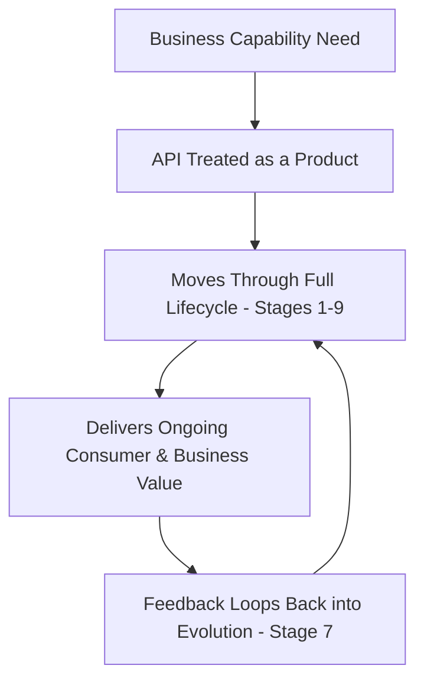
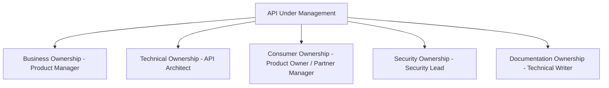
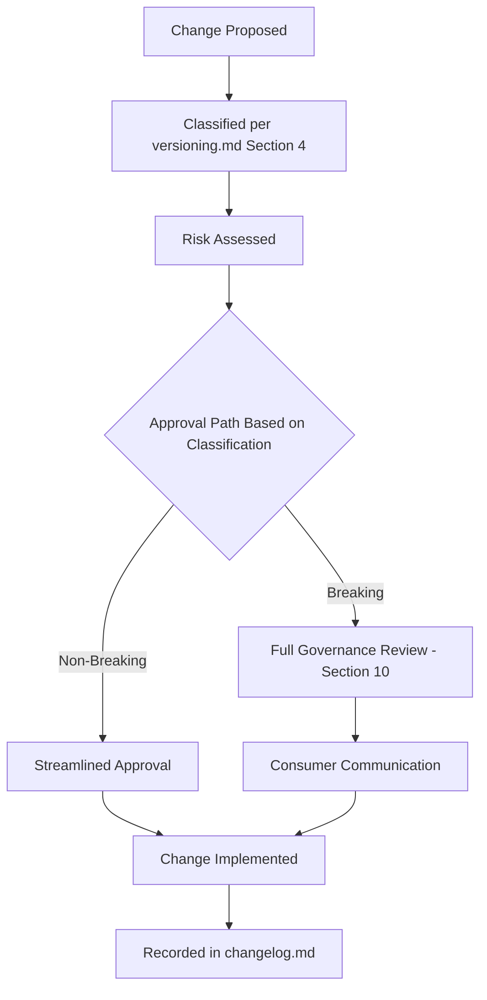
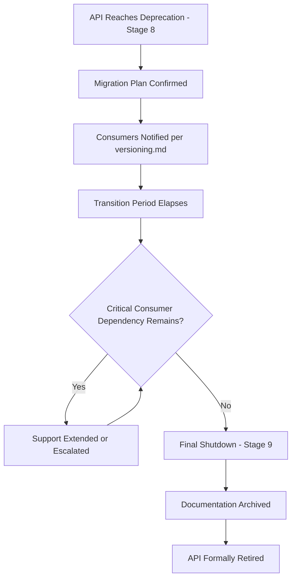

# Enterprise API Lifecycle Management

## 1. Document Purpose

This document establishes Enterprise API Lifecycle Management for **StackLeo Tech Store**: the complete journey an API takes from initial business need through eventual retirement.

- **Purpose of API Lifecycle Management** — to ensure every API is deliberately planned, designed, released, operated, evolved, and eventually retired, rather than existing indefinitely without ownership or direction.
- **Relationship with API Governance** — this document defines the *stages* an API moves through; `api-governance.md` defines the *organizational structures and authority* that oversee those stages.
- **Relationship with Business Evolution** — API lifecycle stages are paced by genuine business need, per `02_Product/product-roadmap.md`, ensuring the API surface grows in step with the business rather than ahead of or behind it.
- **Relationship with Developer Experience** — a well-managed lifecycle is what makes Developer Experience (`05_API/README.md`, Section 2) sustainable over time, not just at initial release.
- **Relationship with Operational Excellence** — lifecycle management extends beyond release into ongoing operation, ensuring APIs remain reliable and well-supported for as long as they are active.

## 2. API Lifecycle Philosophy

- **APIs as Products** — every API is treated as a product with its own consumers, value proposition, and lifecycle, not merely as a technical artifact.
- **Consumer-Centric Thinking** — every lifecycle decision is evaluated primarily by its impact on consumers, internal and external.
- **Continuous Improvement** — an API's design and operation are expected to improve over time based on real usage and feedback, not remain static after initial release.
- **Governance Without Blocking Innovation** — lifecycle governance exists to ensure quality and consistency, not to create unnecessary friction for legitimate, well-justified change.
- **Quality First** — an API does not progress to the next lifecycle stage until it genuinely meets the quality expectations of its current stage, per Section 5.
- **Long-Term Ownership** — every API has a clearly accountable owner for its entire lifecycle, from planning through retirement, per Section 4.

*Diagram: Complete API Lifecycle Flow.*

## 3. API Lifecycle Stages

### Stage 1: Planning

- **Business Need Identification** — an API's existence is justified by a genuine business capability requirement, traceable to `01_Business/business-requirements.md` or `02_Product/functional-requirements.md`.
- **Consumer Analysis** — the intended consumers, per `api-overview.md` (Section 4), are identified before design begins.
- **Scope Definition** — the boundaries of what the API will and will not cover are explicitly defined, consistent with `api-overview.md` (Section 3).
- **Feasibility Assessment** — the API's technical and business feasibility is assessed before committing design effort.

### Stage 2: Design

- **Resource Modeling** — the API's resources are defined consistent with `resource-model.md`.
- **Contract Design** — the request/response contract is designed consistent with `request-response.md` and `api-standards.md`.
- **Security Considerations** — authentication, authorization, and data protection needs are addressed from the outset, per `authentication.md` and `authorization.md`.
- **Documentation Planning** — the documentation needed to support consumers is planned alongside the design itself, not deferred to after release.

### Stage 3: Development

- **Implementation Readiness** — the approved design is handed to `07_Backend` for implementation, with the contract serving as the binding specification.
- **Quality Expectations** — implementation is held to the standards defined in `api-standards.md` throughout development, not only at final review.
- **Review Process** — implementation progress is reviewed against the approved design to catch drift early.
- **Testing Requirements** — automated and manual testing coverage is established as a development deliverable, not an afterthought.

### Stage 4: Validation

- **Functional Validation** — the implemented API is verified to behave according to its approved contract.
- **Security Validation** — the API is verified against the security expectations defined in `authentication.md`, `authorization.md`, and `04_Database/security-model.md`.
- **Performance Validation** — the API is verified against the performance expectations defined in `02_Product/non-functional-requirements.md`.
- **Consumer Validation** — where practical, intended consumers validate the API against their actual integration needs before general release.

### Stage 5: Release

- **Release Approval** — a formal, governed sign-off confirms the API is ready for consumer use, per Section 10.
- **Documentation Availability** — complete, accurate documentation is available at the moment of release, not published afterward.
- **Consumer Communication** — intended consumers are informed of the release, its capability, and how to begin integration.
- **Adoption Preparation** — the platform is prepared to support early adopters, including anticipated support and monitoring needs.

### Stage 6: Operation

- **Monitoring** — the API's health and behavior are continuously observed, consistent with `03_System_Design/observability.md`.
- **Reliability** — the API is operated to meet the reliability expectations established at design time, per `api-overview.md` (Section 7).
- **Performance** — the API's real-world performance is tracked against its validated expectations.
- **Support** — consumers experiencing difficulty have a clear path to assistance.

### Stage 7: Evolution

- **Improvements** — the API is refined over time based on operational experience and consumer feedback.
- **Feature Addition** — new capability is added consistent with the Evolvability principle in `api-standards.md` (Section 2).
- **Consumer Feedback** — evolution decisions are informed by genuine consumer input, not assumption.
- **Compatibility Management** — evolution respects the Backward Compatibility commitments defined in `versioning.md`.

### Stage 8: Deprecation

- **Migration Planning** — a clear path for consumers to move away from the deprecated capability is defined before deprecation is announced, per `versioning.md` (Section 7).
- **Communication** — deprecation is announced clearly and with adequate lead time, per `versioning.md` (Section 6).
- **Transition Support** — consumers migrating away from a deprecated API receive practical support during the transition period.

### Stage 9: Retirement

- **Final Shutdown** — the API is formally withdrawn once its sunset period concludes, per `versioning.md` (Section 6).
- **Consumer Migration Completion** — retirement proceeds only once genuine confirmation exists that no critical consumer dependency remains.
- **Documentation Archive** — the retired API's documentation and history are preserved for reference, consistent with `00_Project_Overview/changelog.md`, rather than simply deleted.

### API Lifecycle Stage Summary

| Stage | Primary Focus | Key Deliverable | Governance Checkpoint |
|---|---|---|---|
| Planning | Business justification | Approved scope and feasibility | Business Need Review |
| Design | Contract definition | Approved resource model and contract | Design Review, per `resource-model.md` |
| Development | Implementation | Working implementation conforming to contract | Implementation Review |
| Validation | Verification | Confirmed functional, security, and performance conformance | Validation Sign-off |
| Release | Consumer availability | Published, documented, supported API | Release Approval |
| Operation | Ongoing reliability | Sustained monitored operation | Ongoing Operational Review |
| Evolution | Continuous improvement | Backward-compatible enhancement | Change Management Review, per Section 7 |
| Deprecation | Managed transition | Migration path and consumer communication | Deprecation Approval |
| Retirement | Formal withdrawal | Confirmed consumer migration and archived documentation | Retirement Approval |

*Diagram: API Product Lifecycle Model.*

## 4. API Ownership Model

- **Business Ownership** — a Product Manager or equivalent business role owns the justification and business value of an API throughout its lifecycle.
- **Technical Ownership** — the API Architect, together with the Backend Engineering Lead, owns the API's technical design and implementation quality.
- **Consumer Ownership** — a designated role maintains the relationship with the API's consumers, gathering feedback and communicating changes.
- **Security Ownership** — the Security Lead owns the API's ongoing security posture, per `authentication.md` and `authorization.md`.
- **Documentation Ownership** — a Technical Writer, or the API Architect in their absence, owns the accuracy and completeness of the API's documentation throughout its lifecycle.

### Ownership Responsibility Matrix

| Ownership Area | Owning Role | Primary Accountability |
|---|---|---|
| Business Ownership | Product Manager | Ongoing business justification and value |
| Technical Ownership | API Architect / Backend Engineering Lead | Design integrity and implementation quality |
| Consumer Ownership | API Product Owner / Partner Manager | Consumer relationship and feedback |
| Security Ownership | Security Lead | Ongoing security posture |
| Documentation Ownership | Technical Writer / API Architect | Documentation accuracy and completeness |

*Diagram: API Ownership Model.*

## 5. Quality Management

- **Design Reviews** — every API design is reviewed against `api-standards.md` and `resource-model.md` before development begins, per Stage 2.
- **Testing Expectations** — every API meets a defined standard of test coverage before progressing to Validation, per Stage 3.
- **Performance Reviews** — every API's real-world performance is periodically reviewed against its original expectations, not only validated once at release.
- **Security Reviews** — every API undergoes periodic security review consistent with `04_Database/security-model.md` (Section 8), beyond its initial Validation stage review.
- **Documentation Reviews** — API documentation is reviewed for accuracy at each Evolution cycle, preventing drift between actual and documented behavior.

### Quality Management Matrix

| Quality Practice | Applied At Stage | Owning Role |
|---|---|---|
| Design Reviews | Design | API Architect |
| Testing Expectations | Development, Validation | Backend Engineering Lead, QA Lead |
| Performance Reviews | Operation, Evolution | Performance Engineer |
| Security Reviews | Validation, ongoing during Operation | Security Lead |
| Documentation Reviews | Release, Evolution | Technical Writer |

## 6. Operational Management

- **Monitoring** — every operational API is continuously observed for health, error rate, and performance, consistent with `03_System_Design/observability.md`.
- **Reliability Tracking** — an API's reliability is tracked against its committed expectations over time, not assumed to remain constant.
- **Incident Management** — API-related incidents follow the investigation and resolution process defined in `error-handling.md` (Section 8).
- **Performance Management** — performance trends are tracked and addressed proactively, rather than only in response to consumer complaints.
- **Consumer Support** — consumers experiencing operational difficulty have access to timely, informed support.

## 7. Change Management

- **Change Classification** — every proposed change to an API is classified consistent with the Change Classification framework in `versioning.md` (Section 4).
- **Approval Process** — changes are approved commensurate with their classification: minor, non-breaking changes move quickly; breaking changes require the fuller governance process defined in `versioning.md` (Section 10).
- **Consumer Communication** — consumers are informed of changes proportionate to their impact, per `versioning.md` (Section 7).
- **Risk Assessment** — every proposed change is assessed for consumer impact and technical risk before approval.

### Change Management Matrix

| Change Type | Approval Speed | Consumer Communication |
|---|---|---|
| Non-Breaking Change | Fast, streamlined | Optional |
| Potentially Breaking Change | Moderate, requires review | Recommended |
| Breaking Change | Slow, requires full governance review | Required, per `versioning.md` |
| Documentation-Only Change | Fast, minimal review | Not required |

*Diagram: API Change Management Workflow.*

## 8. API Evolution Strategy

- **Backward Compatibility** — evolution preserves existing consumer functioning wherever possible, per `versioning.md` (Section 2).
- **Version Management** — evolution requiring a new version follows the models and governance defined in `versioning.md`.
- **Feature Evolution** — new capability is added incrementally, consistent with the Incremental Evolution principle in `api-strategy.md` (Section 3).
- **Deprecation Strategy** — capability that must be retired follows the formal Deprecation Strategy defined in `versioning.md` (Section 6).

### Evolution Strategy Matrix

| Evolution Type | Approach | Related Document |
|---|---|---|
| Additive Capability | Introduced without a new version where possible | `api-standards.md` (Section 6) |
| Breaking Capability Change | Introduced through a governed new version | `versioning.md` |
| Deprecated Capability | Retired through a defined transition period | `versioning.md` (Section 6) |
| Consumer-Driven Enhancement | Prioritized based on tracked consumer feedback | Stage 7, Section 3 |

## 9. Future Evolution

- **Event-Driven APIs** — lifecycle management extends to event and webhook contracts, per `webhooks.md`, as the platform's event model matures.
- **Microservices** — as `03_System_Design/service-architecture.md` decomposes further, lifecycle management scales to a larger number of independently owned APIs.
- **Public APIs** — a future publicly exposed API surface will apply this same lifecycle discipline with heightened rigor, given the difficulty of coordinating external consumer migration.
- **Partner Ecosystem** — partner-facing APIs follow this lifecycle with additional formal agreement-based governance, per `api-strategy.md` (Section 4).
- **AI Services** — future AI-facing APIs are managed through the same lifecycle stages, with quality management (Section 5) extended to address AI-specific considerations as they emerge.
- **Global Platform Expansion** — lifecycle management remains coherent and consistently applied as the API surface grows to serve South Asia and global markets.

## 10. Governance

- **Lifecycle Governance** — the API Architect owns the overall integrity of the lifecycle process defined in this document.
- **Review Boards** — significant lifecycle transitions (Release, Deprecation, Retirement) are reviewed by a cross-functional group including the API Architect, Security Lead, and Product Manager.
- **Standards Compliance** — every API's progression through the lifecycle is contingent on compliance with `api-standards.md` and `resource-model.md`.
- **Documentation Requirements** — no API progresses to Release without complete documentation, per Stage 5.
- **Audit Process** — active and deprecated APIs are periodically audited to confirm their lifecycle stage remains accurate and deliberate, not accidental.

### Governance Responsibilities

| Role | Responsibility |
|---|---|
| API Architect | Owns overall lifecycle governance and stage-gate decisions. |
| Product Manager | Validates business justification at Planning and Evolution stages. |
| Security Lead | Validates security readiness at Validation and ongoing Operation. |
| Backend Engineering Lead | Ensures Development and Operation meet quality expectations. |
| Technical Writer | Ensures Documentation Requirements are met before Release. |

*Diagram: API Retirement Process.*

## 11. Anti-Patterns

| Anti-Pattern | Description | Why It Should Be Avoided |
|---|---|---|
| No Ownership | Operating an API without a clearly accountable owner across the areas defined in Section 4. | Leaves no one accountable for quality, evolution, or eventual retirement decisions. |
| No Documentation | Releasing or operating an API without complete, current documentation. | Directly undermines Developer Experience and increases consumer integration risk. |
| No Monitoring | Operating an API without observing its health, error rate, or performance. | Prevents timely detection of degradation, undermining Operational Management (Section 6). |
| No Consumer Feedback | Evolving an API based purely on internal assumption rather than genuine consumer input. | Produces evolution that fails to serve actual consumer need, undermining Consumer-Centric Thinking (Section 2). |
| Releasing Without Governance | Bypassing the Release stage's approval checkpoint. | Risks releasing an API that has not genuinely met quality, security, or documentation expectations. |
| Ignoring Deprecation | Retiring an API without a formal deprecation and migration process. | Forces abrupt, unplanned consumer disruption, directly violating Stage 8 and `versioning.md` (Section 6). |
| Treating APIs as Code Only | Managing an API purely as a software artifact without product-level ownership. | Directly conflicts with the APIs as Products philosophy (Section 2) and leads to unmanaged, undirected evolution. |
| No Long-Term Strategy | Managing each API in isolation without a coherent lifecycle applied consistently. | Undermines Long-Term Ownership and produces inconsistent consumer experience across the API landscape. |

### Anti-Pattern Summary

| Anti-Pattern | Primary Risk | Mitigating Principle |
|---|---|---|
| No Ownership | Unaccountable quality and evolution decisions | API Ownership Model |
| No Documentation | Poor consumer integration experience | Documentation Ownership |
| No Monitoring | Undetected degradation | Operational Management |
| No Consumer Feedback | Misaligned evolution | Consumer-Centric Thinking |
| Releasing Without Governance | Substandard release quality | Quality First |
| Ignoring Deprecation | Abrupt consumer disruption | Deprecation Strategy |
| Treating APIs as Code Only | Undirected, unmanaged evolution | APIs as Products |
| No Long-Term Strategy | Inconsistent consumer experience | Long-Term Ownership |

## 12. Document Information

| Property | Value |
|----------|-------|
| Document | api-lifecycle.md |
| Version | 1.0.0 |
| Status | Active |
| Maintained By | StackLeo |
| Last Updated | 2026-07-17 |

---

© StackLeo. All Rights Reserved.
