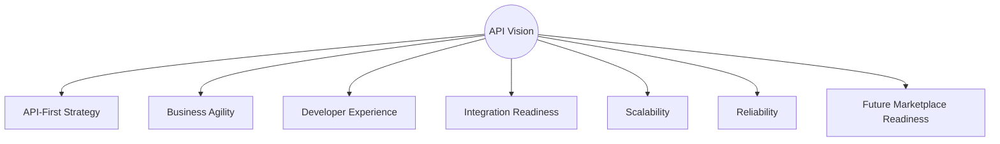
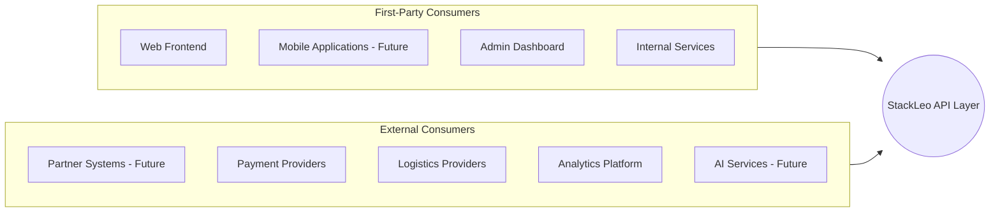
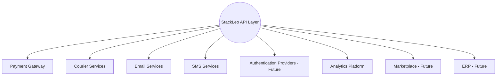
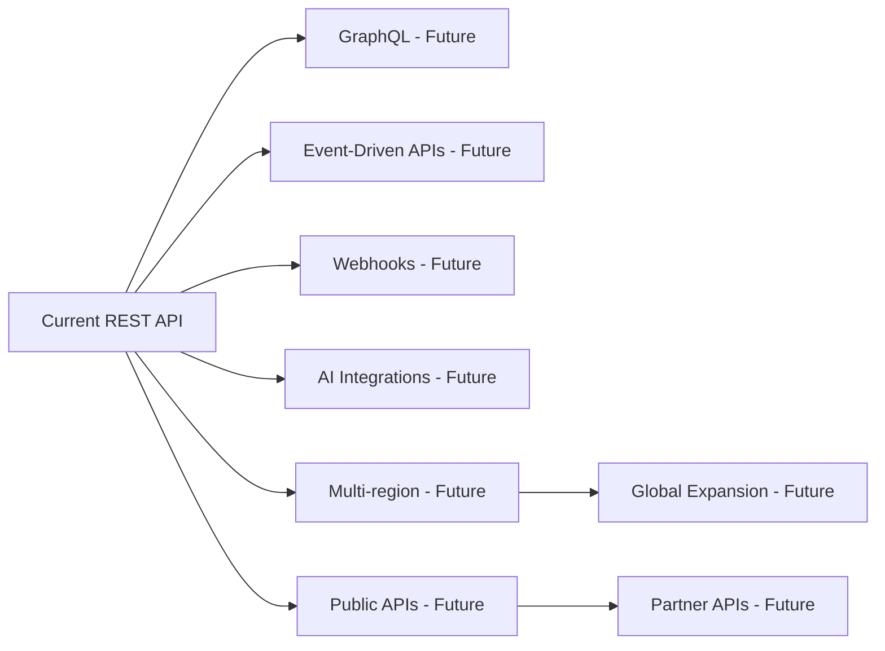
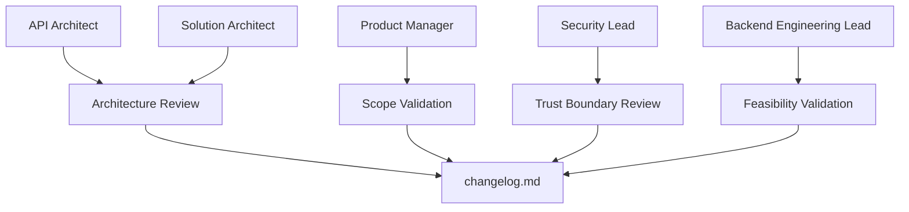

# API Overview

## 1. Document Purpose

This document establishes the vision, scope, philosophy, and architectural foundation of the **StackLeo Tech Store** API ecosystem. It is the entry point for understanding why the API layer exists and how it fits within the broader enterprise architecture.

- **Purpose of the API Architecture** — the API layer is the platform's single, governed surface through which every consumer — web, future mobile, internal services, and future partners — accesses StackLeo's business capability. It exists to decouple *how* capability is consumed from *how* it is implemented, allowing each to evolve independently.
- **Relationship with Business Architecture** — the API layer exposes exactly the capabilities defined in `01_Business/business-requirements.md` and `02_Product/functional-requirements.md`; it introduces no business behavior of its own and exposes no capability the business architecture has not authorized.
- **Relationship with System Architecture** — the API layer is the externally facing contract for the services defined in `03_System_Design/service-architecture.md` and `03_System_Design/component-architecture.md`; it translates internal service boundaries into a consistent, consumer-facing resource model.
- **Relationship with Database Architecture** — API resources (per `resource-model.md`) are conceptually derived from the entities defined in `04_Database/data-model.md` and `04_Database/entity-relationship.md`, though a resource is a consumer-facing abstraction, not a direct exposure of underlying data structure.
- **Relationship with Backend Architecture** — the API layer defines the *contract* backend services must fulfill; `07_Backend` is responsible for realizing that contract. This document and its accompanying `05_API` documents constrain what `07_Backend` may expose, not how it is built.

## 2. API Vision

StackLeo's API ecosystem is built on the following vision:

- **API-First Strategy** — every capability is designed as an API before it is designed as a user interface, ensuring consistent capability across web, future mobile, and future partner channels.
- **Business Agility** — the API layer allows new business models (Corporate Sales, Wholesale, Multi-Vendor Marketplace) to be introduced by extending the API surface, not by re-architecting it.
- **Developer Experience** — internal and, eventually, external developers can understand and integrate against StackLeo's APIs predictably, consistent with the Developer Experience objective in `05_API/README.md` (Section 2).
- **Integration Readiness** — the API layer is designed from inception to support payment, logistics, and future ERP and marketplace integrations without structural rework.
- **Scalability** — the API layer scales independently of any single consumer's demand, consistent with `03_System_Design/scalability-strategy.md`.
- **Reliability** — consumers can depend on consistent, predictable API behavior, including under partial failure.
- **Future Marketplace Readiness** — the API architecture anticipates the future Multi-Vendor Marketplace model, ensuring vendor-facing capability can be added as a natural extension rather than a redesign.

*Diagram: API Ecosystem Overview.*

## 3. Scope

The StackLeo API platform conceptually covers the following business capability areas:

| In Scope | Description |
|---|---|
| Authentication | Identity establishment for all consumer types. |
| User Management | Customer and staff account lifecycle. |
| Product Catalog | Products, variants, specifications, and media. |
| Search | Product and content discovery. |
| Categories | Hierarchical product classification. |
| Brands | Brand-level product organization. |
| Inventory | Stock availability visibility. |
| Shopping Cart | Pre-purchase item collection. |
| Wishlist | Customer-saved product intent. |
| Orders | Order placement and lifecycle. |
| Payments | Payment initiation and status. |
| Shipping | Shipment and delivery tracking. |
| Notifications | Customer and staff communication triggers. |
| Reviews | Product feedback and ratings. |
| Customer Dashboard | Customer self-service capability. |
| Admin Portal | Staff-facing administrative capability. |
| Analytics | Business and operational metric exposure. |
| Corporate Sales | Future bulk and organizational buyer capability. |
| Marketplace (Future) | Future multi-vendor capability. |

**Outside Scope** — this document, and `05_API` generally, do not define: literal endpoint paths or methods, request/response payload schemas, OpenAPI or other machine-readable specifications, backend implementation detail, database schema, or infrastructure/deployment configuration. These belong to `07_Backend`, `04_Database`, and `11_Deployment` respectively.

### API Scope Matrix

| Capability Area | Current Scope | Future Scope | Primary Related Domain |
|---|---|---|---|
| Authentication | Customer, Admin login | Partner, Vendor identity | `04_Database` Identity |
| User Management | Customer accounts | Corporate accounts | `04_Database` Customer |
| Product Catalog | Full product data | AI-enriched catalog data | `04_Database` Catalog |
| Search | Keyword, filter-based | AI-assisted, semantic search | `04_Database` Catalog |
| Categories | Hierarchical browsing | Multi-market categorization | `04_Database` Catalog |
| Brands | Brand browsing | Brand partnership capability | `04_Database` Catalog |
| Inventory | Stock visibility | Multi-warehouse, multi-vendor visibility | `04_Database` Inventory |
| Shopping Cart | Single-cart per customer | Multi-cart, saved-for-later | `04_Database` Commerce |
| Wishlist | Basic saved items | Shareable wishlists | `04_Database` Commerce |
| Orders | Full order lifecycle | Multi-vendor order splitting | `04_Database` Orders |
| Payments | BDT payment initiation | Multi-currency payment | `04_Database` Payments |
| Shipping | Tracking visibility | Multi-courier orchestration | `04_Database` Shipping |
| Notifications | Transactional notices | Marketing, preference-based notices | `04_Database` Administration |
| Reviews | Product reviews | Vendor reviews | `04_Database` Customer Experience |
| Customer Dashboard | Order, profile self-service | Loyalty, subscription self-service | `02_Product` |
| Admin Portal | Operational administration | Vendor management console | `02_Product` |
| Analytics | Internal reporting exposure | Partner-facing analytics | `04_Database` Analytics |
| Corporate Sales | Not yet active | Bulk pricing, PO-based ordering | `01_Business/business-model.md` |
| Marketplace (Future) | Not yet active | Vendor onboarding, commission | `04_Database` Future Marketplace |

## 4. API Consumer Landscape

| Consumer | Purpose | Trust Level | Integration Expectations |
|---|---|---|---|
| Web Frontend | Primary customer-facing storefront and account experience. | High (first-party) | Full API surface access; consistent, low-latency interaction. |
| Mobile Applications (Future) | Native customer experience across devices. | High (first-party) | Same capability parity as Web Frontend; offline-tolerant interaction patterns. |
| Admin Dashboard | Staff-facing operational and administrative interface. | High (first-party, privileged) | Elevated authorization scope; access to administrative and analytics capability. |
| Internal Services | Service-to-service capability consumption within the platform. | High (first-party, trusted) | Consistent, machine-oriented interaction; no UI-specific accommodation needed. |
| Partner Systems (Future) | Third-party business integration (e.g., corporate buyers, future affiliates). | Medium (authenticated third-party) | Governed access scope; formal onboarding and agreement required. |
| Payment Providers | External settlement of customer payments. | Medium (trusted external, narrow scope) | Narrow, purpose-specific integration; strict verification of authenticity. |
| Logistics Providers | External fulfillment and delivery execution. | Medium (trusted external, narrow scope) | Narrow, purpose-specific integration; shipment and tracking data exchange only. |
| Analytics Platform | Internal or future external consumption of aggregated business data. | Medium to High (context-dependent) | Read-oriented access to aggregated, non-sensitive data. |
| AI Services (Future) | Future intelligent capability (recommendations, assistance). | Medium (trusted internal or contracted external) | Read access to catalog and behavioral data, governed by future AI governance policy. |

### API Consumer Matrix

| Consumer | Access Pattern | Data Sensitivity Exposure | Onboarding Model |
|---|---|---|---|
| Web Frontend | Interactive, session-driven | Customer-scoped only | Built-in (first-party) |
| Mobile Applications | Interactive, session-driven | Customer-scoped only | Built-in (first-party) |
| Admin Dashboard | Interactive, privileged | Broad, role-scoped | Built-in (first-party, privileged) |
| Internal Services | Programmatic, service-to-service | Domain-scoped | Platform-managed |
| Partner Systems | Programmatic, agreement-based | Narrow, contractually scoped | Formal partner onboarding |
| Payment Providers | Programmatic, callback-based | Payment-transaction scoped only | Formal provider integration |
| Logistics Providers | Programmatic, callback-based | Shipment-scoped only | Formal provider integration |
| Analytics Platform | Programmatic, read-oriented | Aggregated, de-identified where possible | Platform-managed |
| AI Services (Future) | Programmatic, read-oriented | Catalog and behavioral, governed | Future governance-managed |

*Diagram: API Consumer Landscape.*

## 5. API Architecture Principles

- **API First** — every capability is designed as a contract before it is implemented, ensuring the API serves consumer need rather than internal convenience.
- **Resource-Oriented Design** — APIs are organized around business resources, aligned with `04_Database/data-model.md`, not around internal procedures.
- **Stateless Communication** — each API interaction is self-contained, supporting horizontal scalability and simplifying failure recovery.
- **Consumer-Centric Design** — API structure reflects what consumers need to accomplish, informed by `02_Product/user-journeys.md` and `02_Product/use-cases.md`.
- **Consistency** — naming, structure, and interaction patterns remain uniform across every capability area listed in Section 3.
- **Evolvability** — new capability extends the API surface without disrupting what already exists.
- **Discoverability** — the structure and intent of the API surface is self-evident to a consumer familiar with the resource model.
- **Security by Design** — every API interaction is authenticated and authorized by default, consistent with `03_System_Design/architecture-principles.md`.
- **Observability** — API behavior is traceable end-to-end, consistent with `03_System_Design/observability.md`.
- **Backward Compatibility** — existing consumers are not broken by API evolution, governed formally through `versioning.md` and `api-lifecycle.md`.

## 6. Integration Strategy

The API layer is the coordination point for the platform's external integrations, each addressed conceptually and without implementation detail:

| Integration | Purpose | Direction |
|---|---|---|
| Payment Gateway | Settling customer payments in BDT, with future multi-currency capability. | Outbound (StackLeo initiates), Inbound (provider confirms) |
| Courier Services | Fulfilling and tracking shipments. | Outbound (StackLeo initiates), Inbound (provider updates) |
| Email Services | Delivering transactional and future marketing communication. | Outbound |
| SMS Services | Delivering time-sensitive transactional notices, relevant to the Bangladesh market. | Outbound |
| Authentication Providers | Supporting future federated or social identity verification. | Bidirectional |
| Analytics Platform | Supplying aggregated business and operational data for insight. | Outbound |
| Marketplace | Future vendor onboarding, product syndication, and commission settlement. | Bidirectional |
| ERP (Future) | Future enterprise resource coordination for Corporate Sales and Wholesale. | Bidirectional |

### Integration Matrix

| Integration | Criticality | Trust Level | Coupling Style |
|---|---|---|---|
| Payment Gateway | Critical | Trusted external | Loosely coupled, callback-based |
| Courier Services | High | Trusted external | Loosely coupled, callback-based |
| Email Services | Medium | Trusted external | Loosely coupled, fire-and-forget |
| SMS Services | Medium | Trusted external | Loosely coupled, fire-and-forget |
| Authentication Providers | Medium (future) | Trusted external | Loosely coupled, federated |
| Analytics Platform | Medium | Internal or trusted external | Loosely coupled, read-oriented |
| Marketplace | High (future) | Governed external (vendors) | Loosely coupled, contract-governed |
| ERP (Future) | Medium (future) | Trusted external | Loosely coupled, contract-governed |

*Diagram: High-Level Integration Architecture.*

## 7. Quality Attributes

| Quality Attribute | Expectation |
|---|---|
| Availability | The API layer remains accessible to consumers consistent with the trust-focused brand positioning. |
| Reliability | API behavior is predictable and consistent, including during partial platform failure. |
| Performance | API responsiveness meets the expectations defined in `02_Product/non-functional-requirements.md`. |
| Scalability | The API layer scales to accommodate growing consumer count and request volume without redesign. |
| Security | Every API interaction is protected by design, consistent with `03_System_Design/architecture-principles.md`. |
| Maintainability | The API surface remains comprehensible and safely evolvable as capability grows. |
| Extensibility | New capability, consumers, and integrations can be added without structural rework. |
| Testability | API behavior can be independently verified against its documented contract. |
| Observability | API behavior is traceable end-to-end, supporting diagnosis and continuous improvement. |

### Quality Attributes Summary

| Attribute | Primary Beneficiary | Related Document |
|---|---|---|
| Availability | All consumers | `03_System_Design/quality-attributes.md` |
| Reliability | All consumers | `03_System_Design/quality-attributes.md` |
| Performance | Customer-facing consumers | `02_Product/non-functional-requirements.md` |
| Scalability | Platform growth | `03_System_Design/scalability-strategy.md` |
| Security | All consumers and the business | `03_System_Design/architecture-principles.md` |
| Maintainability | Engineering teams | `api-standards.md` |
| Extensibility | Future business models | `api-lifecycle.md` |
| Testability | Engineering and QA teams | `07_Backend` (future) |
| Observability | Engineering and operations teams | `03_System_Design/observability.md` |

## 8. Future Evolution

The API architecture is designed to accommodate the following future directions without structural redesign:

- **GraphQL** — a future complementary query approach for consumers with complex, variable data needs, alongside the primary RESTful approach.
- **Event-Driven APIs** — extending beyond request-response into asynchronous, event-based interaction, building on `03_System_Design/event-flows.md`.
- **Webhooks** — enabling external consumers to receive asynchronous notification of business events, per `webhooks.md`.
- **AI Integrations** — exposing catalog, behavioral, and operational data to future AI-driven capability under governed access.
- **Multi-region** — supporting API consumption across multiple geographic regions as StackLeo expands beyond Bangladesh.
- **Global Expansion** — accommodating multi-currency, multi-language, and multi-regulatory-context consumption.
- **Public APIs** — a future governed, publicly documented API surface for external developers.
- **Partner APIs** — a future dedicated surface for Corporate Sales, Wholesale, and Marketplace partner integration.

*Diagram: Future API Evolution Roadmap.*

## 9. Governance

- **Ownership** — the API Architect (or, at current organizational scale, the Solution Architect acting in that capacity) owns the coherence and accuracy of the API architecture defined across `05_API`.
- **Architecture Review** — API design decisions are reviewed against the principles in Section 5 and the standards defined in `api-standards.md` before capability is exposed to any consumer.
- **Documentation Standards** — this document, and every document in `05_API`, follows the enterprise Markdown conventions established across this repository.
- **Change Management** — material changes to API scope, consumer landscape, or integration strategy are recorded in `00_Project_Overview/changelog.md` and evaluated for consumer impact through `api-lifecycle.md`.
- **Versioning** — this document follows the Semantic Versioning approach defined in `00_Project_Overview/changelog.md`; the APIs it describes are versioned per the dedicated strategy in `versioning.md`.

### Governance Responsibilities

| Role | Responsibility |
|---|---|
| API Architect | Owns overall API architecture coherence and this document's accuracy. |
| Solution Architect | Ensures API architecture remains aligned with system-wide architecture. |
| Product Manager | Validates API scope against business and product requirements. |
| Security Lead | Reviews authentication, authorization, and integration trust boundaries. |
| Backend Engineering Lead | Validates that API contracts are implementable and maintainable. |

*Diagram: API Governance Overview.*

## 10. Document Information

| Property | Value |
|----------|-------|
| Document | api-overview.md |
| Version | 1.0.0 |
| Status | Active |
| Maintained By | StackLeo |
| Last Updated | 2026-07-17 |

---

© StackLeo. All Rights Reserved.
