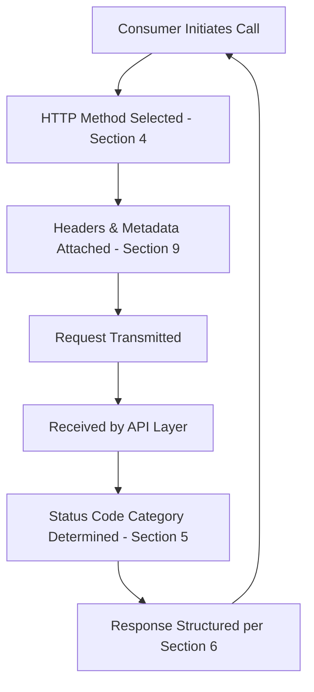
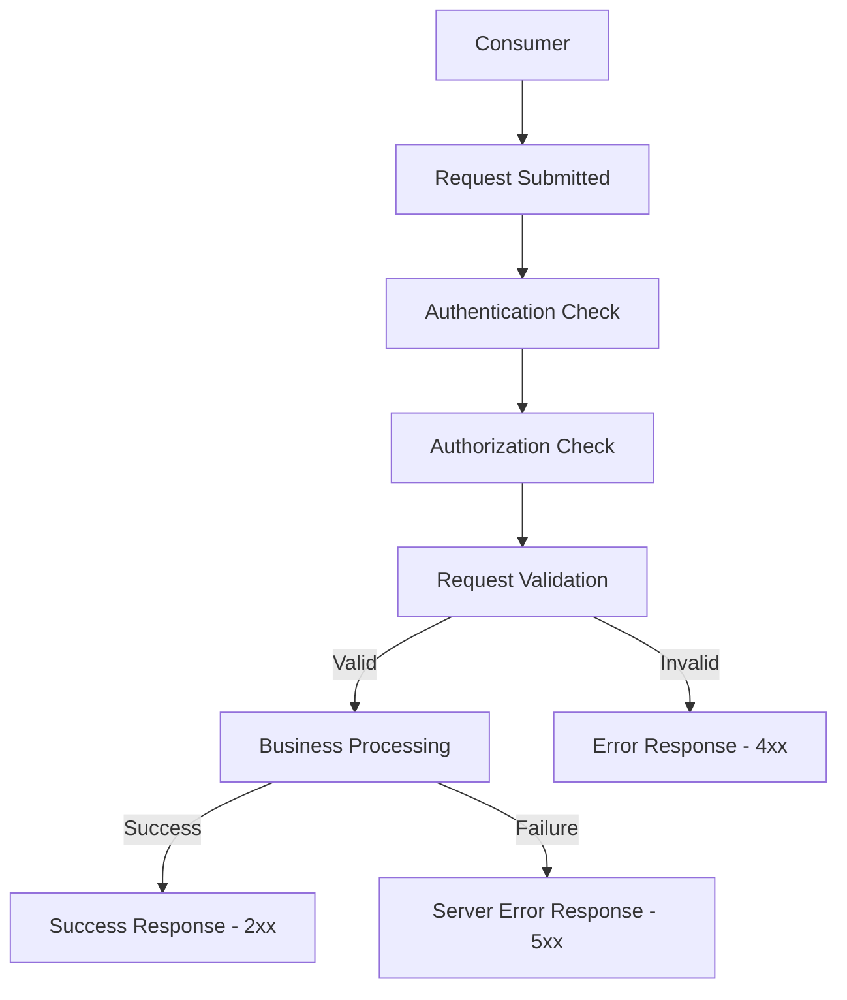
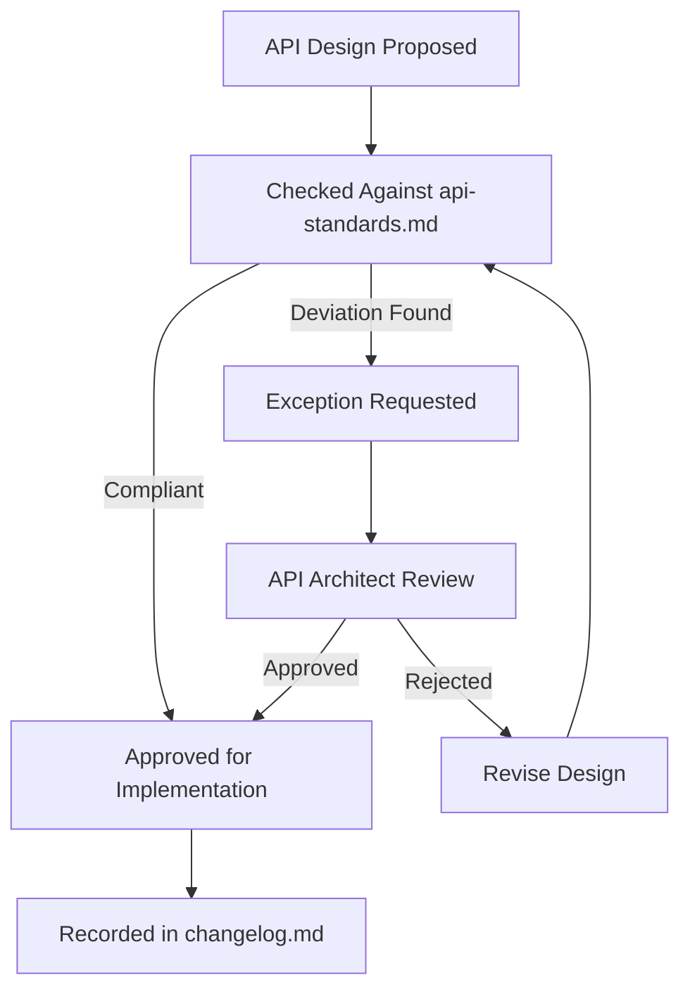
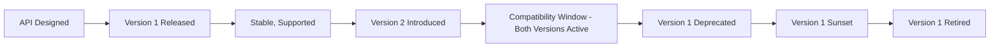
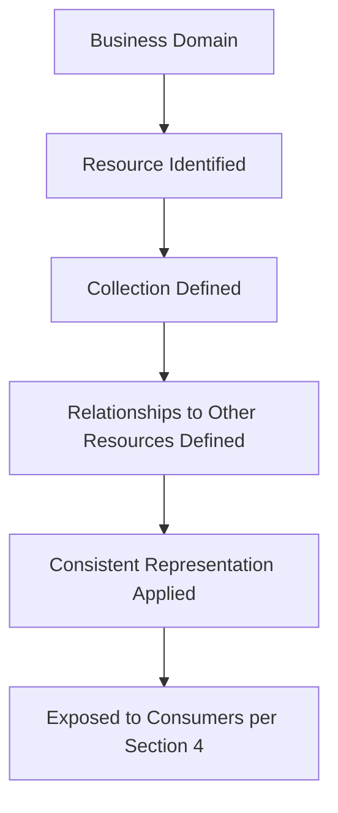

# API Design Standards

## 1. Document Purpose

This document establishes the enterprise-wide API Design Standards for **StackLeo Tech Store**: the conventions every API, present and future, must follow to remain consistent, predictable, and maintainable.

- **Purpose of API Standards** — to ensure that any two APIs built by any two teams, at any point in the platform's lifetime, feel like they came from the same design mind.
- **Benefits of Consistency** — consumers learn the API surface once and apply that understanding everywhere; engineering teams build faster by following established patterns rather than inventing new ones per feature.
- **Relationship with API Governance** — this document defines *what* the standard is; `api-governance.md` defines *how compliance with it is enforced* across the organization.
- **Relationship with Developer Experience** — standards are the foundation of the Developer Experience objective established in `05_API/README.md` (Section 2); inconsistency is the single greatest driver of integration friction.
- **Relationship with Long-Term Maintainability** — consistent standards make the API surface comprehensible as it grows, directly supporting the Maintainability objective in `api-overview.md` (Section 7).

## 2. API Design Philosophy

- **API First** — the contract is designed before implementation, ensuring standards are applied from inception, not retrofitted.
- **Consumer-Centric Design** — every standard in this document exists to make the API easier to consume, not easier to build.
- **Resource-Oriented Design** — APIs are organized around business resources (per `resource-model.md`), not internal actions or procedures.
- **Predictability** — a consumer who understands one part of the API surface should be able to correctly predict the behavior of another.
- **Simplicity** — the simplest design that meets the business need is preferred over a more elaborate one.
- **Evolvability** — standards are designed to allow the API to grow without breaking what already exists.
- **Security by Design** — every standard accounts for security implications from the outset, not as a later addition.
- **Observability by Design** — every standard supports the ability to trace and understand API behavior after the fact.

## 3. Resource Naming Standards

- **Resource Naming** — resources are named after the business concept they represent (e.g., a resource representing "Order"), not after technical or database structures.
- **Collection Naming** — a collection of resources is named using the plural form of the resource concept, representing "many of this business concept."
- **Singular vs. Plural Resources** — a collection is referenced in plural form; a specific individual member of that collection is referenced through the plural collection combined with an identifier, keeping the pattern uniform rather than switching between singular and plural forms.
- **Nested Resources** — a resource that exists only in the context of a parent (such as an Order's line items) is expressed as nested beneath that parent, reflecting genuine ownership; resources that exist independently are not artificially nested.
- **URI Readability** — resource paths are structured to be human-readable and self-descriptive, favoring clarity over brevity.
- **Consistency Principles** — the same resource concept is named identically everywhere it appears across the API surface; no domain is permitted a locally divergent convention.

## 4. HTTP Method Philosophy

| Method | Intended Purpose | Safety | Idempotency Concept | Typical Business Scenario |
|---|---|---|---|---|
| GET | Retrieve a representation of a resource without changing it. | Safe | Idempotent | Viewing a product's detail page. |
| POST | Create a new resource or trigger a business action that does not map cleanly to an existing resource. | Not safe | Not idempotent by default | Placing a new order. |
| PUT | Replace a resource's entire state with the supplied representation. | Not safe | Idempotent | Replacing a customer's full shipping address. |
| PATCH | Apply a partial modification to a resource's existing state. | Not safe | Not idempotent by default, though may be made so | Updating a single field of a customer profile. |
| DELETE | Remove a resource. | Not safe | Idempotent | Removing an item from a wishlist. |
| OPTIONS | Discover the capabilities and allowed interactions available for a resource. | Safe | Idempotent | A consumer determining what operations a resource supports. |
| HEAD | Retrieve the metadata of a resource without its body. | Safe | Idempotent | Checking if a resource exists or has changed before retrieving it fully. |

*"Safety" means the method does not alter server state. "Idempotency" means repeating the same request produces the same end state as performing it once — a critical guarantee for safe retry, elaborated in `idempotency.md`.*

*Diagram: API Request Lifecycle.*

## 5. HTTP Status Code Strategy

- **2xx Success** — the request was understood, accepted, and processed as intended; used whenever a business operation completes successfully, whether returning data, confirming creation, or confirming an action with no content to return.
- **3xx Redirection** — the requested resource requires further consumer action to complete the request, such as being informed of a resource's new permanent location.
- **4xx Client Errors** — the request itself could not be fulfilled due to a problem originating with the consumer, such as invalid input, missing authentication, or a request for a resource that does not exist.
- **5xx Server Errors** — the request was valid, but the platform failed to fulfill it due to an internal condition; these represent platform failures, not consumer mistakes, and are treated as operational incidents.

### Status Code Categories

| Category | Meaning | Consumer Expectation |
|---|---|---|
| 2xx Success | The operation completed as intended. | Proceed normally; response reflects the outcome. |
| 3xx Redirection | Further action is needed to complete the request. | Follow the guidance provided; not an error condition. |
| 4xx Client Errors | The request could not be fulfilled due to consumer input or state. | Correct the request before retrying; retrying unchanged will fail again. |
| 5xx Server Errors | The platform failed to fulfill an otherwise valid request. | Retry may succeed once the underlying condition resolves; treated as a platform incident. |

## 6. Request & Response Principles

- **Consistent Payload Structure** — every API response follows the same overall shape regardless of which domain it represents, so a consumer's parsing logic generalizes across the platform.
- **Metadata** — responses carry supporting context (such as pagination or timing information) in a structurally consistent, clearly separated location from the primary business data.
- **Pagination Readiness** — every collection-returning response is structured from inception to support pagination, per `pagination.md`, even where current data volume does not yet require it.
- **Validation** — every request is validated against the resource's defined constraints before any business effect occurs.
- **Error Representation** — failures are represented in a single, consistent structural form across the entire API surface, per `error-handling.md`.
- **Extensibility** — payload structures allow new, optional fields to be introduced without breaking consumers that do not yet expect them.
- **Backward Compatibility** — payload evolution never removes or repurposes an existing field's meaning within the same API version.

*Diagram: Request → Validation → Response Flow.*

## 7. Naming Conventions

| Element | Convention | Rationale |
|---|---|---|
| Resources | Business-meaningful nouns, plural for collections. | Reflects the resource-oriented philosophy in Section 2. |
| Fields | Descriptive, unambiguous business terms, consistent casing across the entire API surface. | Prevents a consumer from needing to remember per-endpoint casing exceptions. |
| Parameters | Named after the business concept they constrain or identify. | Keeps parameter intent self-evident. |
| Query Parameters | Lowercase, descriptive terms reflecting filtering, sorting, or pagination intent. | Supports the discoverability principle in Section 2. |
| Headers | Standard, purpose-descriptive names, consistent across all APIs. | Enables uniform cross-cutting handling (Section 9). |
| Enums | Descriptive, stable business-state values, never renumbered or repurposed once published. | Prevents silent breaking change to consumers relying on specific values. |
| Identifiers | Stable, opaque values that do not encode meaning a consumer should not depend on. | Prevents consumers from taking dependencies on identifier structure that later constrains implementation. |

### Naming Convention Matrix

| Element | Case Style | Pluralization | Stability Expectation |
|---|---|---|---|
| Resources | Business-term based | Plural for collections, singular reference via identifier | Stable for the life of an API version |
| Fields | Consistent casing platform-wide | Singular or plural per meaning | Stable for the life of an API version |
| Parameters | Consistent casing platform-wide | As meaning requires | Stable for the life of an API version |
| Query Parameters | Lowercase, descriptive | As meaning requires | Stable for the life of an API version |
| Headers | Standard, purpose-descriptive | N/A | Stable across API versions |
| Enums | Descriptive constant values | N/A | Additive only; existing values never repurposed |
| Identifiers | Opaque, stable values | N/A | Immutable once assigned |

## 8. Pagination, Filtering & Sorting

- **Pagination** — every collection response is divided into manageable segments rather than returning unbounded results, protecting both consumer and platform performance, per `pagination.md`.
- **Cursor Readiness** — the pagination approach is designed to support cursor-based navigation for large or frequently changing collections, in addition to simpler offset-based navigation for smaller ones.
- **Filtering** — consumers can narrow a collection to results meeting specific business criteria, per `filtering-sorting.md`.
- **Sorting** — consumers can request a collection in a specific, meaningful order.
- **Searching** — consumers can request results matching a broader, less structured query intent, distinct from precise filtering.

### Pagination Strategy Comparison

| Strategy | Best Suited For | Trade-off |
|---|---|---|
| Offset-Based | Smaller, relatively stable collections (e.g., a customer's own order history). | Simple to reason about; can produce inconsistent results if data changes mid-navigation. |
| Cursor-Based | Large or frequently changing collections (e.g., the full product catalog). | Consistent results under concurrent change; less intuitive for arbitrary page jumping. |

## 9. Headers & Metadata

- **Authentication Headers** — convey the consumer's proof of identity, consistent with `authentication.md`.
- **Correlation IDs** — allow a single consumer-initiated action to be traced across every platform component it touches.
- **Request IDs** — uniquely identify a single API request for diagnostic and support purposes.
- **Content Negotiation** — allows a consumer and the API to agree on the representation format of exchanged data.
- **Version Indicators** — convey which version of an API contract a request or response applies to, per `versioning.md`.
- **Caching Metadata** — conveys how long a response may be considered valid without being re-requested, supporting Caching Readiness in `api-strategy.md` (Section 7).

### Header & Metadata Summary

| Header/Metadata Type | Purpose | Applies To |
|---|---|---|
| Authentication Headers | Establish consumer identity | Every authenticated request |
| Correlation IDs | Trace a single action across the platform | Every request |
| Request IDs | Identify an individual request for diagnostics | Every request |
| Content Negotiation | Agree on representation format | Every request/response pair |
| Version Indicators | Convey applicable API contract version | Every request/response pair |
| Caching Metadata | Convey response validity duration | Cacheable responses |

## 10. Error Handling Principles

- **Consistency** — every API surface represents errors using the same structural form, per `error-handling.md`.
- **Human-Readable Messages** — every error includes a message a person can understand without consulting internal documentation.
- **Machine-Readable Errors** — every error also includes a stable, structured code a consuming system can programmatically act on.
- **Traceability** — every error can be correlated back to a specific request via the identifiers defined in Section 9.
- **Validation Feedback** — input validation failures clearly identify which part of the request was invalid and why.
- **Retry Considerations** — errors distinguish conditions worth retrying (such as a transient platform issue) from conditions that will not change with retry (such as invalid input).

## 11. Documentation Standards

- **API Documentation** — every API surface is documented in a manner consistent with this repository's enterprise Markdown conventions, describing purpose and behavior without prescribing implementation.
- **Version History** — every API version's introduction and status is recorded, consistent with `versioning.md`.
- **Deprecation Notices** — consumers are informed clearly and with adequate lead time before a version or capability is retired, per `api-lifecycle.md`.
- **Change Logs** — material API changes are recorded in `00_Project_Overview/changelog.md`.
- **Consumer Guidance** — documentation is written from the consumer's perspective, explaining how to accomplish business goals, not merely listing technical structure.

## 12. Future Evolution

- **GraphQL** — standards are structured so resource-oriented thinking translates naturally to a future complementary query approach.
- **Webhooks** — outbound notification design (per `webhooks.md`) follows the same consistency and versioning discipline as inbound APIs.
- **Event-Driven APIs** — future event-based interaction will apply the same naming and consistency principles established here.
- **AI Consumers** — machine-driven consumers are held to the same contract stability expectations as human-facing ones.
- **Public APIs** — these standards are written at a level of discipline suitable for eventual external, public consumption, not merely internal convenience.
- **Marketplace APIs** — vendor-facing capability will extend, not deviate from, the standards defined in this document.

## 13. Governance

- **Design Review** — every new or materially changed API design is reviewed against this document before implementation begins.
- **Architecture Approval** — significant deviations from these standards require explicit approval from the API Architect, recorded as an exception, not a silent departure.
- **Standards Compliance** — compliance with this document is a precondition for an API being considered ready for consumer exposure.
- **Documentation Standards** — this document itself follows the enterprise Markdown conventions established across this repository.
- **Change Management** — changes to these standards are recorded in `00_Project_Overview/changelog.md` and communicated to all API-owning teams.
- **Versioning** — this document follows Semantic Versioning per `00_Project_Overview/changelog.md`.

### Governance Responsibilities

| Role | Responsibility |
|---|---|
| API Architect | Owns these standards and approves exceptions. |
| Solution Architect | Ensures standards remain aligned with enterprise architecture. |
| Backend Engineering Lead | Ensures implementations comply with these standards. |
| QA Lead | Validates API behavior against documented standards. |
| Technical Writer | Maintains documentation quality and consistency. |

*Diagram: API Standard Governance Workflow.*

## 14. Anti-Patterns

| Anti-Pattern | Description | Why It Should Be Avoided |
|---|---|---|
| Inconsistent Naming | Using different naming conventions for equivalent concepts across APIs. | Forces consumers to relearn conventions per API, undermining Consistency (Section 2). |
| Verb-Based Resources | Naming resources after actions rather than business concepts. | Conflicts with Resource-Oriented Design and produces an unpredictable, procedural API surface. |
| Breaking Changes | Modifying an existing API contract in ways that disrupt current consumers. | Directly violates Backward Compatibility and damages consumer trust. |
| Overloaded Endpoints | Making a single resource serve many unrelated purposes based on hidden parameters. | Undermines Predictability and Discoverability; consumers cannot reason about behavior from structure alone. |
| Leaking Internal Models | Exposing internal database or implementation structure directly through the API. | Couples consumers to implementation detail, undermining Evolvability and the Implementation Independence principle. |
| Inconsistent Error Formats | Representing errors differently across different parts of the API. | Forces consumers to write per-API error handling, undermining Consistency and Traceability. |
| Ignoring Idempotency | Failing to make appropriate operations safe to retry. | Makes safe recovery from network failure impossible, undermining Reliability; see `idempotency.md`. |
| Poor Documentation | Publishing an API without clear, consumer-oriented documentation. | Directly undermines Developer Experience and increases integration risk and support burden. |

### Anti-Pattern Summary

| Anti-Pattern | Primary Risk | Mitigating Principle |
|---|---|---|
| Inconsistent Naming | Increased consumer learning cost | Consistency |
| Verb-Based Resources | Unpredictable API surface | Resource-Oriented Design |
| Breaking Changes | Consumer disruption | Backward Compatibility |
| Overloaded Endpoints | Reduced predictability | Predictability |
| Leaking Internal Models | Tight coupling to implementation | Implementation Independence |
| Inconsistent Error Formats | Fragmented consumer error handling | Consistency in Error Handling |
| Ignoring Idempotency | Unsafe retry behavior | Idempotency |
| Poor Documentation | Poor developer experience | Documentation Standards |

*Diagram: API Evolution & Version Lifecycle.*

*Diagram: Resource-Oriented Design Overview.*

## 15. Document Information

| Property | Value |
|----------|-------|
| Document | api-standards.md |
| Version | 1.0.0 |
| Status | Active |
| Maintained By | StackLeo |
| Last Updated | 2026-07-17 |

---

© StackLeo. All Rights Reserved.
