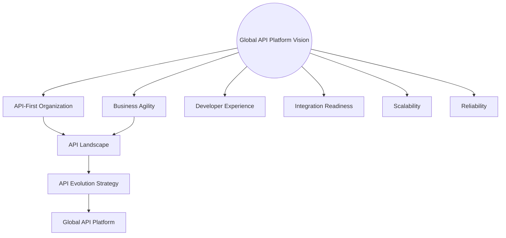
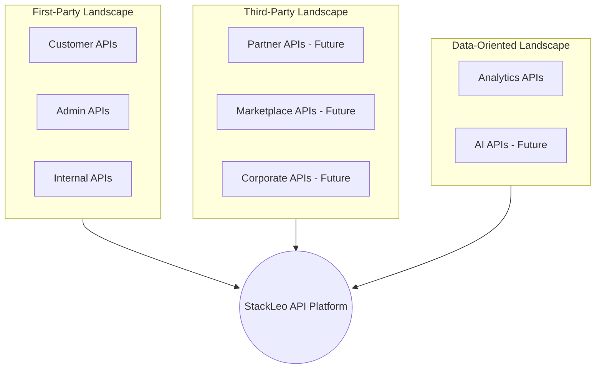
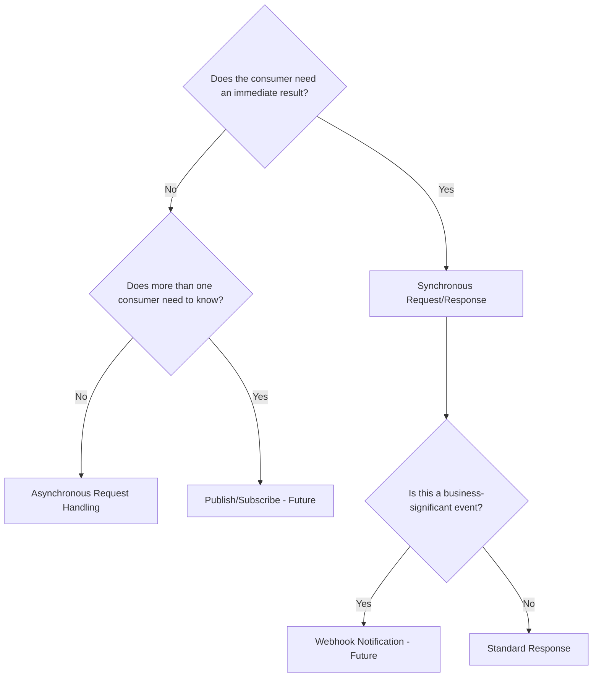
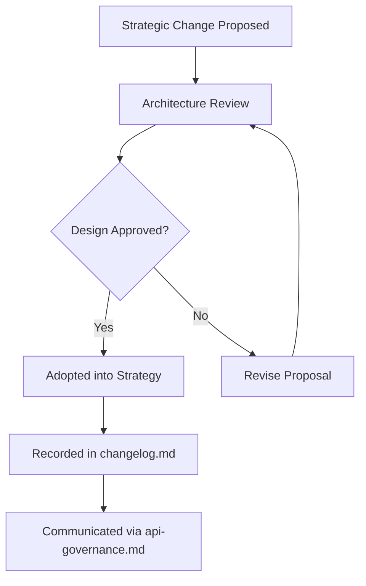

# API Strategy

## 1. Document Purpose

This document establishes the long-term Enterprise API Strategy for **StackLeo Tech Store** — how APIs are designed, evolved, governed, integrated, secured, and scaled across the platform's lifetime.

- **Purpose of API Strategy** — to ensure every API decision, present and future, serves a deliberate, coherent long-term direction rather than accumulating as isolated, inconsistent choices.
- **Relationship with Business Strategy** — this strategy exists to enable the business models defined in `01_Business/business-model.md` (B2C today; future B2B, Corporate Sales, Wholesale, and Multi-Vendor Marketplace) without requiring architectural rework at each stage.
- **Relationship with Enterprise Architecture** — this strategy operationalizes the principles in `03_System_Design/architecture-principles.md` and `03_System_Design/architectural-drivers.md` specifically for the API layer.
- **Relationship with Product Strategy** — this strategy is paced by `02_Product/product-roadmap.md`; API capability expands as product capability expands, never ahead of validated business need.
- **Relationship with Backend Architecture** — this strategy defines the contract-level direction `07_Backend` must implement toward; it does not prescribe backend technology or implementation.
- **Relationship with API Governance** — this strategy is the "why" and "what direction"; `api-governance.md` and Section 11 of this document define the "who" and "how enforced."

## 2. API Vision

- **API-First Organization** — every business capability is designed as an API before any consumer-facing surface is built on top of it.
- **Business Agility** — new business models are introduced by extending the API landscape (Section 4), not by re-architecting it.
- **Developer Experience** — internal, and eventually external, developers can build against StackLeo's APIs predictably and efficiently.
- **Integration Readiness** — the platform integrates with payment, logistics, identity, and future ERP/CRM/marketing/AI systems without structural rework, per Section 6.
- **Scalability** — the API platform scales horizontally and geographically as demand and market footprint grow, per Section 7.
- **Reliability** — consumers can depend on consistent API behavior under both normal and degraded conditions.
- **Global API Platform Vision** — the long-term destination is a governed API platform capable of serving Bangladesh, South Asia, and eventually global markets, and internal, partner, and public developer audiences alike.

*Diagram: Enterprise API Strategy Overview.*

## 3. Strategic Principles

- **API First** — the contract is designed before the implementation, ensuring APIs serve consumer need, not internal convenience.
- **Consumer First** — API design decisions prioritize consumer usability over provider convenience.
- **Resource-Oriented Design** — APIs are organized around business resources aligned with `04_Database/data-model.md`, not internal procedures.
- **Stateless Communication** — each interaction is self-contained, supporting horizontal scale and simple recovery.
- **Backward Compatibility** — evolution preserves existing consumers' functioning wherever possible.
- **Evolvability** — new capability extends the API surface without disrupting what exists.
- **Consistency** — naming, structure, and interaction patterns remain uniform across the entire API landscape.
- **Discoverability** — the intent and structure of an API is self-evident to a consumer familiar with the resource model.
- **Security by Design** — every API interaction is authenticated and authorized by default, never as an afterthought.
- **Observability by Design** — API behavior is traceable from inception, not retrofitted once problems emerge.

## 4. API Landscape

| API Category | Purpose | Consumer | Trust Boundary | Lifecycle Expectations |
|---|---|---|---|---|
| Customer APIs | Expose catalog, cart, order, and account capability to customers. | Web Frontend, Mobile Applications (Future) | First-party, customer-scoped | Long-lived; evolved conservatively due to broad consumer base. |
| Admin APIs | Expose operational and administrative capability to staff. | Admin Dashboard | First-party, privileged | Long-lived; evolved in step with internal tooling needs. |
| Internal APIs | Enable service-to-service capability sharing within the platform. | Internal Services | First-party, trusted | Evolved freely; internal consumers upgrade in lockstep. |
| Partner APIs | Enable governed external business integration. | Partner Systems (Future) | Third-party, contractually scoped | Long-lived; changes governed by formal agreement. |
| Marketplace APIs (Future) | Enable vendor onboarding, catalog syndication, and commission settlement. | Marketplace Vendors (Future) | Third-party, governed | Introduced at Phase 5; long-lived once active. |
| Corporate APIs | Enable bulk ordering and organizational account capability. | Corporate Buyers (Future) | Third-party, contractually scoped | Introduced at Phase 4; long-lived once active. |
| Analytics APIs | Expose aggregated business and operational data. | Analytics Platform | Internal or trusted external | Read-oriented; evolved conservatively due to downstream reporting dependency. |
| AI APIs (Future) | Expose catalog and behavioral data to intelligent capability. | AI Services (Future) | Trusted internal or contracted external | Introduced at Phase 6; governed by future AI policy. |

### API Landscape Matrix

| Category | Read/Write Profile | Change Frequency | Criticality |
|---|---|---|---|
| Customer APIs | Read-heavy, transactional write | Low-to-moderate | Critical |
| Admin APIs | Balanced read/write | Moderate | High |
| Internal APIs | Balanced read/write | High | High |
| Partner APIs | Read-heavy, governed write | Low | High (future) |
| Marketplace APIs (Future) | Balanced read/write | Low | High (future) |
| Corporate APIs | Read-heavy, batch write | Low | Medium (future) |
| Analytics APIs | Read-only | Low | Medium |
| AI APIs (Future) | Read-only | Low | Medium (future) |

*Diagram: API Landscape Architecture.*

## 5. Communication Strategy

- **Synchronous Communication** — used where a consumer requires an immediate, definitive result before proceeding, such as retrieving product detail or confirming order placement.
- **Asynchronous Communication** — used where the consumer does not require an immediate result, such as triggering a notification or a background stock reconciliation.
- **Event-Driven Readiness** — the platform's internal event model (per `03_System_Design/event-flows.md`) positions the API layer to expose business events to external consumers as this strategy matures.
- **Request/Response Pattern** — the default pattern for direct, consumer-initiated interaction, such as a customer browsing the catalog.
- **Publish/Subscribe Readiness** — a future pattern for one-to-many notification, such as informing multiple interested systems that an order has shipped, without each needing to poll individually.

### Communication Strategy Comparison

| Pattern | Business Scenario | Consumer Experience | Maturity |
|---|---|---|---|
| Synchronous Request/Response | Browsing catalog, placing an order, viewing account. | Immediate result | Current, primary pattern |
| Asynchronous Request Handling | Triggering a notification, background inventory sync. | Result delivered separately | Current, selective use |
| Event-Driven (Webhooks) | Notifying a courier integration of a new shipment. | Consumer notified without polling | Near-term future |
| Publish/Subscribe | Broadcasting an order status change to multiple interested systems. | Multiple consumers notified simultaneously | Longer-term future |

*Diagram: Communication Pattern Selection Framework.*

## 6. Integration Strategy

| Integration | Purpose | Strategic Posture |
|---|---|---|
| Payment Providers | Settle customer payments in BDT, with future multi-currency capability. | Loosely coupled, replaceable without API redesign. |
| Courier Services | Fulfill and track shipments. | Loosely coupled, supports multiple concurrent providers. |
| Identity Providers | Support future federated or social authentication. | Loosely coupled, additive to existing authentication model. |
| ERP Systems (Future) | Coordinate enterprise resource data for Corporate Sales and Wholesale. | Governed, contract-based integration. |
| CRM Systems (Future) | Support future customer relationship and sales management. | Governed, contract-based integration. |
| Analytics Platforms | Supply aggregated business and operational data. | Read-oriented, one-directional data flow. |
| Marketing Platforms (Future) | Support future customer engagement and campaign capability. | Loosely coupled, opt-in data sharing. |
| AI Platforms (Future) | Support future intelligent recommendation and assistance capability. | Governed, read-oriented data flow. |

### Integration Matrix

| Integration | Criticality | Coupling Style | Data Direction |
|---|---|---|---|
| Payment Providers | Critical | Loose, callback-based | Bidirectional |
| Courier Services | High | Loose, callback-based | Bidirectional |
| Identity Providers | Medium (future) | Loose, federated | Bidirectional |
| ERP Systems (Future) | Medium | Governed, contract-based | Bidirectional |
| CRM Systems (Future) | Medium | Governed, contract-based | Bidirectional |
| Analytics Platforms | Medium | Loose, read-oriented | Outbound |
| Marketing Platforms (Future) | Low-Medium | Loose, opt-in | Outbound |
| AI Platforms (Future) | Medium | Governed, read-oriented | Outbound |

## 7. Scalability Strategy

- **Horizontal Scaling** — the API layer scales by adding capacity, not by growing individual components, consistent with `03_System_Design/scalability-strategy.md`.
- **API Gateway Readiness** — the architecture anticipates a governed entry point capable of enforcing cross-cutting concerns (authentication, rate limiting, routing) consistently, without naming a specific product.
- **Load Distribution** — consumer traffic is distributed evenly across available capacity to prevent concentration-driven degradation.
- **Rate Limiting Readiness** — the API layer is designed to fairly govern consumption per `rate-limiting.md`, protecting platform stability under uneven demand.
- **Caching Readiness** — frequently requested, slowly changing data (such as catalog browsing) is structured to support caching, reducing redundant computation.
- **Edge Readiness** — the architecture anticipates serving content closer to consumers geographically as the platform expands beyond Bangladesh.
- **Global Expansion** — the API platform is designed so that regional expansion (South Asia → Global) extends capacity and locality without altering the API contract consumers depend on.

## 8. API Evolution Strategy

- **Version Evolution** — APIs evolve through deliberate, governed versions rather than silent, breaking change, per `versioning.md`.
- **Deprecation Policy** — outgoing API versions are formally deprecated with clear communication before removal, per `api-lifecycle.md`.
- **Compatibility Windows** — a defined period during which both an outgoing and incoming API version remain available, giving consumers time to migrate.
- **Progressive Adoption** — new capability can be adopted incrementally by consumers rather than requiring a single, disruptive migration.
- **Feature Toggles Readiness** — the architecture anticipates the ability to introduce capability conditionally, supporting controlled rollout.
- **Sunset Strategy** — every API version has a defined path to eventual retirement, preventing indefinite accumulation of legacy surfaces.

### API Evolution Roadmap

| Stage | Focus | Alignment |
|---|---|---|
| Foundation | Establish Customer, Admin, and Internal APIs for core B2C operation. | `02_Product/product-roadmap.md` Phase 1-2 |
| Expansion | Introduce Corporate APIs for bulk and organizational buyers. | Phase 4 |
| Marketplace | Introduce Marketplace APIs for vendor onboarding and syndication. | Phase 5 |
| Intelligence | Introduce AI APIs for recommendation and assistance capability. | Phase 6 |
| Global Platform | Introduce Partner and Public APIs; extend for multi-region operation. | Phase 7 |

*Diagram: API Evolution Timeline.*

## 9. API Quality Strategy

| Quality Attribute | Strategic Commitment |
|---|---|
| Reliability | APIs behave predictably, including under partial platform failure. |
| Availability | APIs remain accessible consistent with `03_System_Design/quality-attributes.md`. |
| Performance | API responsiveness meets `02_Product/non-functional-requirements.md` expectations. |
| Security | Every API interaction is protected by design, per Section 3. |
| Testability | Every API contract can be independently verified against documented expectations. |
| Maintainability | The API surface remains comprehensible as capability grows. |
| Observability | API behavior is traceable end-to-end, per `03_System_Design/observability.md`. |
| Resilience | The API layer degrades gracefully rather than failing completely under stress. |

### API Quality Attributes

| Attribute | Governing Document | Business Impact |
|---|---|---|
| Reliability | `api-overview.md` (Section 7) | Customer and partner trust |
| Availability | `03_System_Design/quality-attributes.md` | Revenue continuity |
| Performance | `02_Product/non-functional-requirements.md` | Customer experience |
| Security | `authentication.md`, `authorization.md` | Risk and compliance |
| Testability | `api-standards.md` | Engineering confidence |
| Maintainability | `api-standards.md` | Long-term cost of change |
| Observability | `03_System_Design/observability.md` | Operational response time |
| Resilience | `rate-limiting.md`, `idempotency.md` | Platform stability under stress |

## 10. Future Evolution

- **GraphQL** — a future complementary query approach for consumers with complex or highly variable data needs.
- **Webhooks** — enabling external consumers to receive asynchronous business event notification, per `webhooks.md`.
- **Event Streaming** — extending the platform's internal event model to continuous, consumable business event flows.
- **AI Integrations** — governed exposure of catalog and behavioral data to intelligent capability.
- **Marketplace** — vendor-facing API capability supporting the future Multi-Vendor Marketplace business model.
- **Public APIs** — a governed, publicly documented API surface for external developers.
- **Third-Party Developers** — a broader developer ecosystem building on StackLeo's platform capability.
- **Multi-region** — API capability distributed across multiple geographic regions as the business expands.
- **Multi-cloud** — architectural neutrality preserved so the API platform is not structurally bound to a single infrastructure provider.

## 11. Governance

- **API Ownership** — the API Architect owns this strategy's coherence, in partnership with the Solution Architect and Product Manager.
- **Architecture Review** — proposed API landscape changes are reviewed against Section 3's principles before adoption.
- **Design Approval** — new API categories or significant structural changes require formal approval, recorded per `api-governance.md`.
- **Documentation Standards** — this document follows the enterprise Markdown conventions established across this repository.
- **Change Management** — material strategic changes are recorded in `00_Project_Overview/changelog.md`.
- **Versioning** — this document follows Semantic Versioning per `00_Project_Overview/changelog.md`, distinct from the API versioning strategy defined in `versioning.md`.

### Governance Responsibilities

| Role | Responsibility |
|---|---|
| API Architect | Owns overall API strategy coherence. |
| Solution Architect | Ensures alignment with enterprise architecture direction. |
| Product Manager | Validates strategy against business and product roadmap. |
| Security Lead | Validates strategy against security and trust boundary expectations. |
| Backend Engineering Lead | Validates strategic direction is implementable. |

*Diagram: API Governance Lifecycle.*

## 12. Anti-Patterns

| Anti-Pattern | Description | Why It Should Be Avoided |
|---|---|---|
| API-Last Development | Designing the API surface only after implementation or UI is complete. | Produces APIs shaped by internal convenience rather than consumer need, undermining Consumer First (Section 3). |
| Breaking Changes | Modifying an API in ways that disrupt existing consumers without warning. | Erodes consumer trust and violates the Backward Compatibility principle. |
| Tight Coupling | Allowing consumers to depend on internal implementation detail rather than the published contract. | Prevents independent evolution of backend and consumer, undermining Evolvability. |
| Inconsistent Standards | Allowing different teams or domains to adopt divergent naming, structure, or error conventions. | Increases cognitive load for every consumer and undermines Consistency. |
| Chatty APIs | Requiring consumers to make many fine-grained calls to accomplish one business task. | Degrades performance and consumer experience; conflicts with Resource-Oriented Design done well. |
| Technology-Driven Design | Shaping the API around a specific backend technology or database structure. | Undermines vendor neutrality and Implementation Independence, and complicates future migration. |
| No Lifecycle Planning | Introducing API versions without a defined deprecation or sunset path. | Leads to unmanageable accumulation of legacy surfaces over time; violates Section 8. |
| Ignoring Consumers | Making API changes without considering or communicating impact to existing consumers. | Directly undermines Consumer First and damages trust with both internal and future external developers. |

### Anti-Pattern Summary

| Anti-Pattern | Primary Risk | Mitigating Principle |
|---|---|---|
| API-Last Development | Poor consumer fit | API First |
| Breaking Changes | Consumer disruption | Backward Compatibility |
| Tight Coupling | Reduced flexibility | Evolvability |
| Inconsistent Standards | Increased integration cost | Consistency |
| Chatty APIs | Poor performance | Resource-Oriented Design |
| Technology-Driven Design | Vendor lock-in | Implementation Independence |
| No Lifecycle Planning | Legacy accumulation | Sunset Strategy |
| Ignoring Consumers | Trust erosion | Consumer First |

## 13. Document Information

| Property | Value |
|----------|-------|
| Document | api-strategy.md |
| Version | 1.0.0 |
| Status | Active |
| Maintained By | StackLeo |
| Last Updated | 2026-07-17 |

---

© StackLeo. All Rights Reserved.
