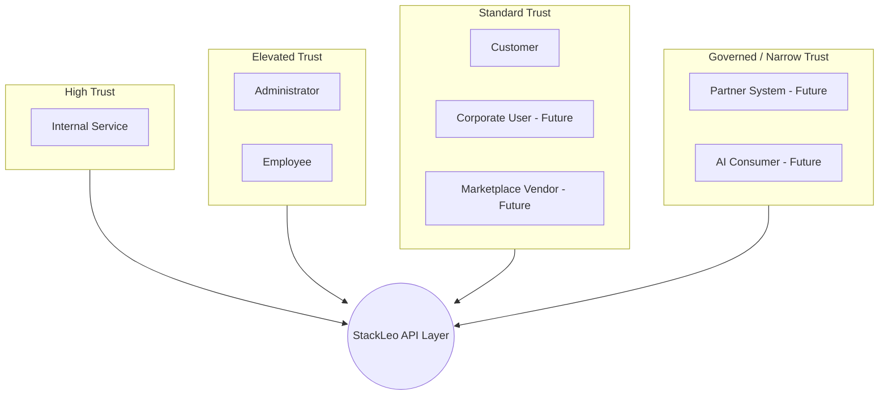
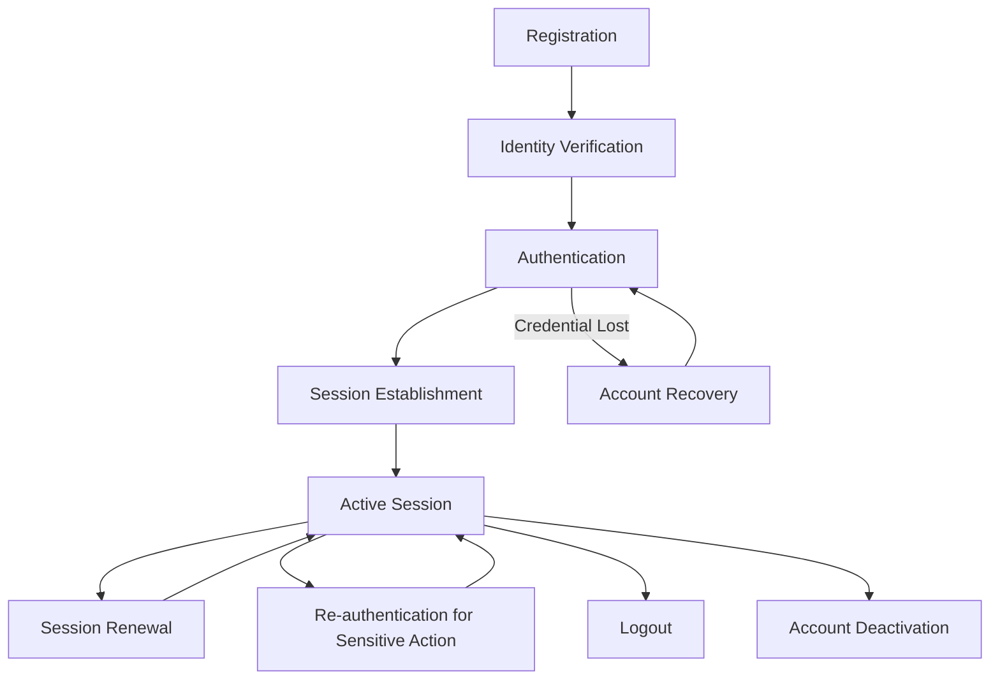
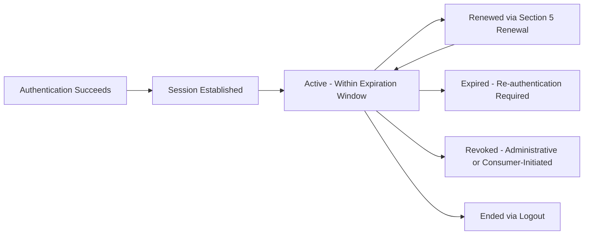
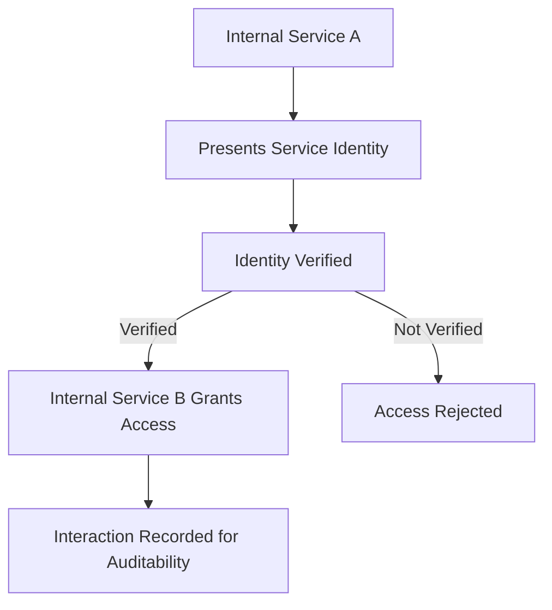
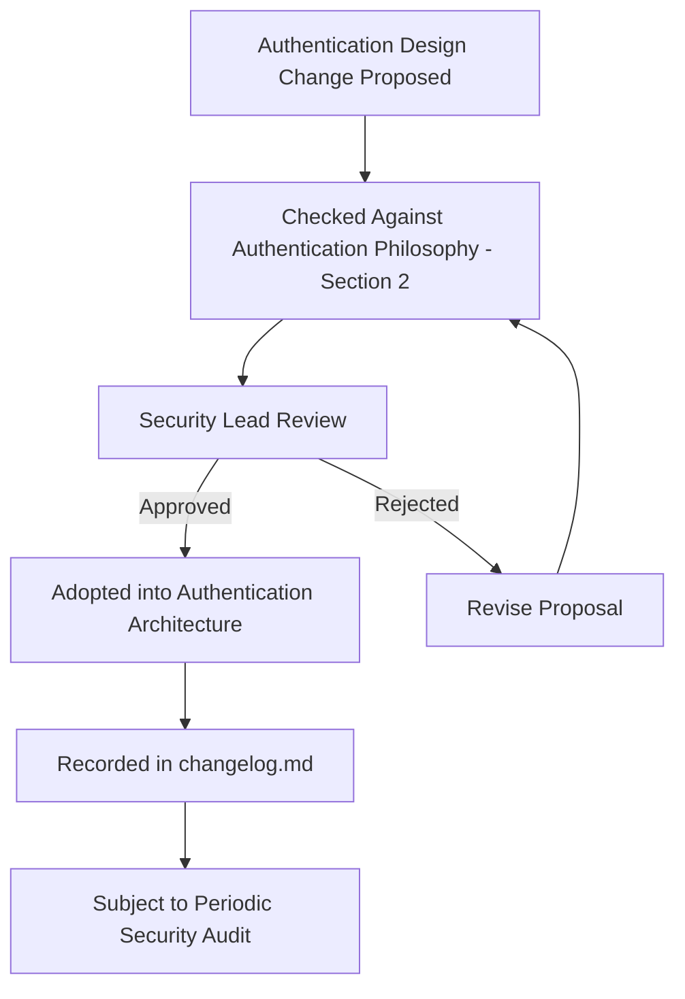

# API Authentication Architecture

## 1. Document Purpose

This document establishes the enterprise-wide Authentication Architecture for **StackLeo Tech Store**: how every consumer of the API proves who they are before any interaction is trusted.

- **Purpose of Authentication** — to ensure every API interaction is tied to a verified identity before any business effect occurs, forming the foundation every other security control depends on.
- **Relationship with API Security** — authentication is the first of the layered protections described in `04_Database/security-model.md`; no authorization, audit, or data protection control is meaningful without a verified identity beneath it.
- **Relationship with Authorization** — authentication establishes *who* is interacting with the platform; `authorization.md` determines *what* that verified identity is permitted to do. Authentication always precedes authorization.
- **Relationship with Identity Management** — this document defines how identity is verified at the point of API interaction; the underlying identity records themselves are governed by the Identity domain defined in `04_Database/data-model.md` and `resource-model.md` (Section 3).
- **Relationship with Zero Trust Architecture** — this document operationalizes the Zero Trust principle established in `04_Database/security-model.md` (Section 3) specifically at the API layer: no request is trusted by default, regardless of its origin.

## 2. Authentication Philosophy

- **Verify Every Request** — no API interaction is trusted based on network origin, prior interaction, or assumption; identity is verified at every request.
- **Identity First** — every design decision in the API layer begins from the question of whose identity is acting, before considering what that identity wants to do.
- **Least Trust** — an identity is granted no more trust than is strictly necessary to complete a verified interaction.
- **Secure by Default** — every API surface requires authentication unless a capability is deliberately and explicitly designated as public.
- **Defense in Depth** — authentication is one layer among several (network, application, data) described in `04_Database/security-model.md`; it is never relied upon as the platform's sole protection.
- **Privacy by Design** — identity verification collects and retains only what is necessary to establish trust, consistent with `04_Database/data-governance.md`.
- **Consumer-Centric Security** — authentication is designed to be as unobtrusive as possible for legitimate consumers while remaining rigorous against illegitimate ones.

## 3. Identity Model

| Identity | Identity Purpose | Trust Level | Authentication Expectations |
|---|---|---|---|
| Customer | Represents a person purchasing from StackLeo. | Standard | Verified at registration; re-verified at each session per Section 5. |
| Administrator | Represents privileged staff managing platform operations. | Elevated | Verified with stronger assurance than Customer; subject to Step-up Authentication (Section 7) for sensitive actions. |
| Employee | Represents staff performing operational, non-administrative duties. | Standard-to-Elevated | Verified consistent with assigned role scope. |
| Corporate User (Future) | Represents a user acting on behalf of a Corporate Sales account. | Standard, organizationally scoped | Verified individually, with identity linked to an organizational account. |
| Marketplace Vendor (Future) | Represents a vendor operating within the future Multi-Vendor Marketplace. | Standard, contractually scoped | Verified through a formal vendor onboarding process before platform access. |
| Partner System (Future) | Represents an external business system integrating with StackLeo. | Medium, narrowly scoped | Verified through formal, agreement-based credential issuance. |
| Internal Service | Represents a StackLeo platform service acting on its own behalf. | High, platform-trusted | Verified through service-to-service authentication, per Section 8. |
| AI Consumer (Future) | Represents a future intelligent system acting on behalf of the platform or a consumer. | Medium, governed | Verified under future AI governance policy, with clear attribution of the identity it acts on behalf of. |

*Diagram: Identity Trust Model.*

## 4. Authentication Lifecycle

| Stage | Description | Business Scenario |
|---|---|---|
| Registration | An identity is established for the first time. | A customer creates an account. |
| Identity Verification | The claimed identity is confirmed to a level appropriate to its trust level. | A customer confirms their contact information. |
| Authentication | A returning identity proves it is who it claims to be. | A customer logs in. |
| Session Establishment | A verified authentication event is translated into an ongoing period of trust. | A customer's login results in an active session. |
| Re-authentication | An already-authenticated identity is asked to prove itself again for a specific reason. | A customer is asked to confirm their identity before changing their password. |
| Session Renewal | An active session's period of trust is extended without requiring full re-authentication. | A customer remains logged in across a browsing session. |
| Logout | An identity deliberately ends its current session. | A customer signs out. |
| Account Recovery | An identity regains access after losing its means of authentication. | A customer resets a forgotten password. |
| Account Deactivation | An identity's ability to authenticate is deliberately and formally ended. | A customer closes their account, or an administrator's access is revoked upon role change. |

*Diagram: Authentication Lifecycle.*

## 5. Session Strategy

- **Stateless Sessions** — a session model where each request carries sufficient proof of authentication independently, supporting horizontal scalability consistent with `api-standards.md` (Section 2).
- **Stateful Sessions** — a session model where the platform maintains authoritative session state, appropriate where immediate, centralized revocation capability is prioritized over statelessness.
- **Session Expiration** — every session has a defined maximum lifetime, after which re-authentication is required regardless of activity.
- **Session Renewal** — an active, legitimately used session may extend its validity without requiring the consumer to fully re-authenticate, balancing security with usability.
- **Device Awareness** — the platform recognizes the device or client context associated with a session, supporting anomaly detection and consumer transparency.
- **Concurrent Sessions** — the platform's posture toward a single identity holding multiple simultaneous sessions is deliberate and governed, not incidental.
- **Trusted Devices** — a consumer may designate a device as trusted, appropriately reducing friction for future authentication from that device without reducing underlying security assurance.

### Session Strategy Comparison

| Aspect | Stateless Sessions | Stateful Sessions |
|---|---|---|
| Scalability | High; no centralized session store dependency | Moderate; depends on centralized session state |
| Revocation Immediacy | Delayed until credential expiration, unless supplemented | Immediate, since the platform holds authoritative state |
| Typical Use | Customer and partner-facing API consumption | Administrative sessions requiring immediate revocation capability |
| Failure Resilience | High; any node can validate independently | Dependent on session store availability |

*Diagram: Session Lifecycle.*

## 6. Token Strategy

- **Access Tokens** — a short-lived credential proving an already-authenticated identity's continued trust for a bounded period, without requiring the underlying credential to be re-presented on every request.
- **Refresh Tokens** — a longer-lived credential used specifically to obtain a new access token without requiring full re-authentication, held to a stricter protection standard than access tokens.
- **Short-lived Credentials** — the platform favors credentials with the shortest lifetime consistent with usability, minimizing the impact window of any single credential's potential compromise.
- **Credential Rotation** — credentials are periodically replaced rather than remaining valid indefinitely, consistent with `04_Database/security-model.md` (Section 4).
- **Token Revocation** — the platform retains the ability to invalidate a credential before its natural expiration when circumstances warrant (e.g., suspected compromise, account closure).
- **Token Lifecycle** — every credential has a defined issuance, active use, renewal, and expiration or revocation path; no credential remains valid indefinitely by default.

### Token Lifecycle Summary

| Stage | Description |
|---|---|
| Issuance | A credential is created following successful authentication. |
| Active Use | The credential is presented to prove continued trust for a bounded period. |
| Renewal | A valid credential is used to obtain a replacement before expiration, where the renewal mechanism permits. |
| Expiration | The credential naturally ceases to be valid after its defined lifetime. |
| Revocation | The credential is deliberately invalidated before its natural expiration. |

## 7. Multi-Factor Authentication Readiness

- **MFA Philosophy** — authentication assurance is proportional to the sensitivity of what is being protected; not every interaction requires the same verification strength.
- **Step-up Authentication** — an already-authenticated identity may be required to provide additional verification before performing a particularly sensitive action, without requiring a full new session.
- **High-Risk Operations** — operations with significant business or financial consequence (such as changing payment details or administrative privilege changes) are candidates for elevated verification.
- **Adaptive Authentication** — the verification strength required may adjust based on contextual signals (such as an unfamiliar device or location), rather than being uniformly fixed.
- **Risk-Based Authentication** — authentication decisions weigh the assessed risk of a given interaction, applying stronger controls where risk is elevated and lighter controls where it is not.

### MFA Readiness Matrix

| Scenario | Current Posture | Future Readiness |
|---|---|---|
| Standard Customer Login | Single-factor, primary credential | Additive MFA option |
| Payment Detail Change | Candidate for step-up verification | Adaptive, risk-based step-up |
| Administrative Privilege Change | Elevated verification expected | Mandatory step-up authentication |
| Unfamiliar Device Login | Device awareness noted | Adaptive authentication response |
| Corporate/Vendor Account Actions (Future) | Not yet active | Elevated verification by default |

## 8. Service-to-Service Authentication

- **Internal APIs** — services calling one another within the platform authenticate using platform-issued, machine-oriented credentials distinct from consumer-facing ones.
- **Background Jobs** — scheduled or triggered background processes authenticate using credentials scoped narrowly to their specific function.
- **Scheduled Tasks** — recurring platform operations carry their own identity and credential, never borrowing a human identity's credential.
- **Event Consumers** — services reacting to platform events authenticate as themselves when performing any resulting action, preserving accurate attribution.
- **Microservice Readiness** — the service-to-service authentication model is designed to scale to many independent internal services without requiring a redesign as `03_System_Design/service-architecture.md` evolves.

*Diagram: Service-to-Service Authentication Flow.*

## 9. Future Evolution

- **Passwordless Authentication** — reducing reliance on traditional shared secrets in favor of stronger, more consumer-friendly verification methods.
- **Single Sign-On (SSO)** — enabling a single authenticated identity to be recognized consistently across future StackLeo surfaces (web, mobile, partner portals).
- **Federation** — enabling identity verified by a trusted external party to be recognized by StackLeo without duplicating verification effort.
- **Passkeys** — supporting modern, phishing-resistant credential approaches as they become mainstream expectations.
- **Biometric Authentication** — supporting device-level biometric verification as a convenient, strong authentication factor, particularly for future mobile applications.
- **AI Consumers** — extending clear, attributable identity verification to future AI-driven consumers acting on the platform's or a consumer's behalf.
- **Multi-region Identity** — ensuring authentication remains coherent and performant as StackLeo expands beyond Bangladesh into South Asia and global markets.

## 10. Governance

- **Identity Ownership** — the Security Lead owns the authentication architecture's coherence, in partnership with the API Architect for API-layer application.
- **Authentication Reviews** — authentication design decisions are reviewed against this document's principles before any new identity type or authentication flow is introduced.
- **Documentation Standards** — this document follows the enterprise Markdown conventions established across this repository.
- **Security Audits** — authentication mechanisms are subject to periodic review consistent with the audit practices defined in `04_Database/security-model.md` (Section 8).
- **Change Management** — material changes to authentication architecture are recorded in `00_Project_Overview/changelog.md`.
- **Versioning** — this document follows Semantic Versioning per `00_Project_Overview/changelog.md`.

### Governance Responsibilities

| Role | Responsibility |
|---|---|
| Security Lead | Owns authentication architecture coherence and security posture. |
| API Architect | Ensures authentication design integrates coherently with the broader API architecture. |
| Solution Architect | Ensures alignment with platform-wide Zero Trust and security principles. |
| Backend Engineering Lead | Ensures implementations conform to approved authentication architecture. |
| Compliance/Audit Function | Validates authentication practices against governance and audit expectations. |

*Diagram: Authentication Governance Lifecycle.*

## 11. Anti-Patterns

| Anti-Pattern | Description | Why It Should Be Avoided |
|---|---|---|
| Long-lived Credentials | Issuing credentials with excessively long or indefinite validity. | Widens the impact window of any single credential's compromise, conflicting with Short-lived Credentials (Section 6). |
| Shared Accounts | Multiple people or systems authenticating under a single shared identity. | Destroys individual accountability and undermines Auditability. |
| Weak Identity Verification | Accepting insufficient proof of identity relative to the trust level required. | Undermines the entire trust model described in Section 3. |
| Missing Session Expiration | Allowing sessions to remain valid indefinitely. | Widens the window during which a compromised session remains exploitable, conflicting with Section 5. |
| Excessive Trust | Granting an identity more implicit trust than its verified assurance level warrants. | Directly conflicts with Least Trust (Section 2) and Zero Trust principles. |
| Hardcoded Credentials | Embedding fixed credentials directly into a service or client rather than issuing them properly. | Makes credentials nearly impossible to rotate and highly susceptible to exposure. |
| Ignoring Device Risk | Failing to account for the context a session or authentication attempt originates from. | Undermines Adaptive Authentication (Section 7) and misses a meaningful risk signal. |
| No Credential Rotation | Allowing a credential to remain unchanged indefinitely once issued. | Conflicts directly with Credential Rotation (Section 6) and increases long-term compromise risk. |

### Anti-Pattern Summary

| Anti-Pattern | Primary Risk | Mitigating Principle |
|---|---|---|
| Long-lived Credentials | Extended compromise window | Short-lived Credentials |
| Shared Accounts | Loss of accountability | Identity First |
| Weak Identity Verification | Misplaced trust | Identity Model (Section 3) |
| Missing Session Expiration | Persistent compromised access | Session Expiration |
| Excessive Trust | Unwarranted access | Least Trust |
| Hardcoded Credentials | Difficult rotation, high exposure risk | Credential Rotation |
| Ignoring Device Risk | Missed anomaly signals | Adaptive Authentication |
| No Credential Rotation | Increasing long-term risk | Credential Rotation |

## 12. Document Information

| Property | Value |
|----------|-------|
| Document | authentication.md |
| Version | 1.0.0 |
| Status | Active |
| Maintained By | StackLeo |
| Last Updated | 2026-07-17 |

---

© StackLeo. All Rights Reserved.
