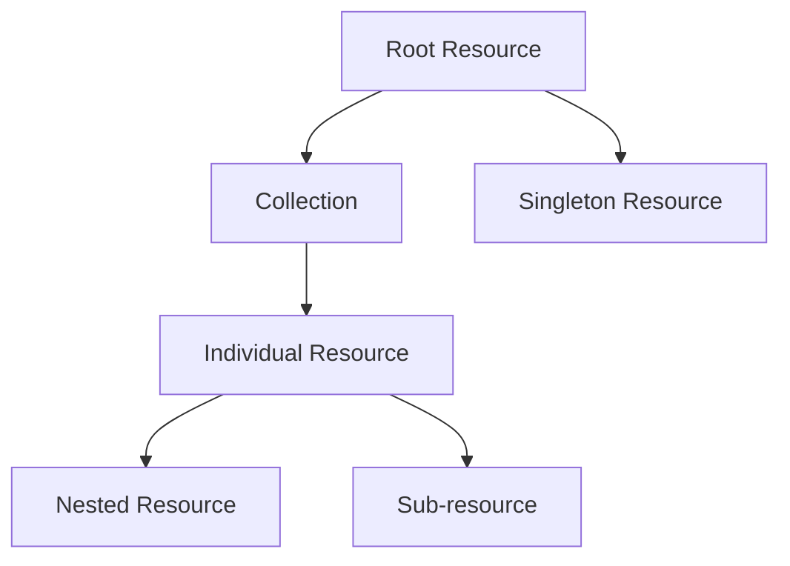
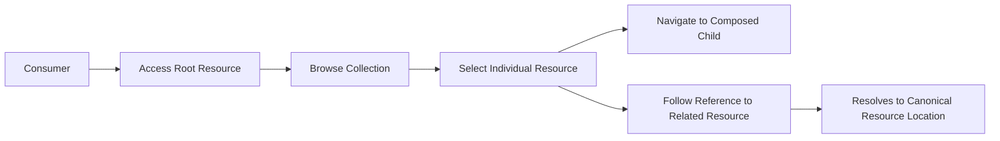
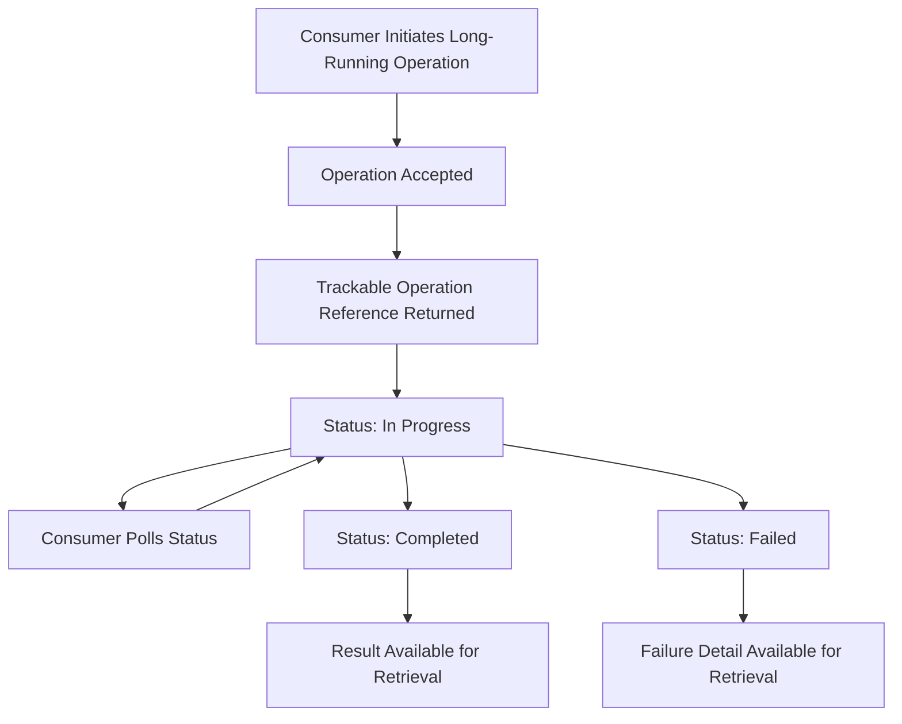
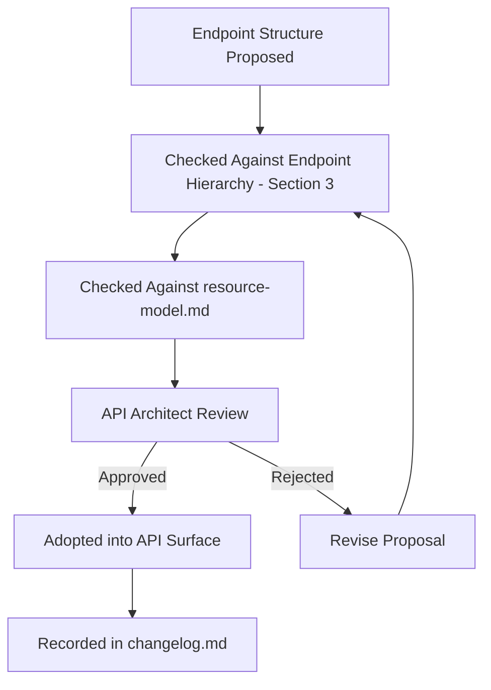
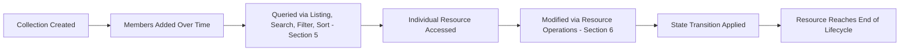

# Endpoint Design Guide

## 1. Document Purpose

This document establishes the enterprise-wide Endpoint Design Guide for **StackLeo Tech Store**: the structural standards governing how API endpoints are organized, without defining any literal endpoint.

- **Purpose of Endpoint Design** — to ensure the structural shape of the API surface is consistent, predictable, and reflects genuine business meaning rather than incidental implementation convenience.
- **Relationship with REST Architecture** — this document applies Resource-Oriented Design (`api-standards.md`, Section 2) at the structural level: how resources are organized into addressable, navigable hierarchies.
- **Relationship with Resource Model** — every endpoint structure described here operates on the canonical resources, aggregates, and relationships defined in `resource-model.md`; this document does not introduce new resources, only the structural conventions for accessing them.
- **Relationship with API Governance** — endpoint structure is subject to the same review and approval discipline defined in `api-governance.md` as every other API design decision.
- **Relationship with Developer Experience** — a predictable endpoint hierarchy is one of the most direct contributors to Developer Experience (`05_API/README.md`, Section 2); consumers who understand the hierarchy for one resource can predict it for another.

## 2. Endpoint Design Principles

- **Resource-Oriented Design** — endpoint structure reflects business resources and their relationships, per `resource-model.md`, never internal actions or procedures.
- **Predictability** — a consumer who understands the structural pattern for one resource can correctly predict the pattern for any other.
- **Consistency** — the same structural conventions apply uniformly across every domain, with no domain-specific exceptions.
- **Simplicity** — the simplest hierarchy that accurately reflects business ownership is preferred over a more elaborate one.
- **Discoverability** — the structure of the API surface is self-evident to a consumer familiar with the resource model, per Section 9.
- **Evolvability** — the hierarchy accommodates new resources and relationships without restructuring what already exists.
- **Backward Compatibility** — an established endpoint structure remains stable for the life of an API version, per `versioning.md`.
- **Security by Design** — endpoint structure never exposes a resource's existence or detail to a consumer without appropriate authorization, per `authorization.md`.

## 3. Endpoint Hierarchy

- **Root Resources** — top-level business concepts with independent existence and their own domain ownership, forming the entry points into the API surface (e.g., the concept of a Product, addressed independent of any other resource).
- **Collections** — the addressable grouping of all instances of a root or nested resource, used when a consumer needs to browse, search, or enumerate.
- **Individual Resources** — a single, specific instance of a resource, addressed through its collection combined with its stable identity (per `resource-model.md`, Section 6).
- **Nested Resources** — resources meaningfully scoped beneath a parent due to composition ownership (per `resource-model.md`, Section 5), such as an Order's line items.
- **Singleton Resources** — a resource of which exactly one meaningful instance exists in a given context, addressed without a collection or identifier, such as a customer's own profile within their own authenticated context.
- **Sub-resources** — a resource representing a specific facet or state of a parent, addressed as an extension of that parent, appropriate when the facet has no independent meaning outside that parent's context.

### Endpoint Hierarchy Patterns

| Pattern | Structural Shape (Conceptual) | Appropriate When |
|---|---|---|
| Root Resource | Top-level, independently addressable concept | The resource has independent business meaning and its own domain ownership. |
| Collection | Grouping of many instances of a resource | Consumers need to browse, search, or enumerate. |
| Individual Resource | Collection scoped to one stable identity | Consumers need to act on one specific, known instance. |
| Nested Resource | Parent resource scoped to a composed child | The child has no independent existence apart from its parent (composition). |
| Singleton Resource | Addressed without collection or identifier | Exactly one meaningful instance exists in the current consumer's context. |
| Sub-resource | Parent resource extended by a specific facet | The facet is a state or aspect of the parent with no independent meaning. |

### Collection vs Singleton Comparison

| Aspect | Collection Resource | Singleton Resource |
|---|---|---|
| Cardinality | Many instances | Exactly one instance in a given context |
| Addressing | Reached via the collection, then a specific identity | Reached directly, without an identifier |
| Typical Operations | Listing, searching, filtering, sorting, creation | Retrieval, update |
| Business Example | Browsing the Product collection | A customer's own profile within their authenticated context |
| Ownership Implication | Owned by its domain, independent of any one consumer | Often scoped to a specific consumer or context |

*Diagram: Endpoint Hierarchy Overview.*

## 4. Resource Navigation

- **Parent-Child Relationships** — navigation from a parent to its composed children reflects genuine aggregate ownership, per `resource-model.md` (Section 4).
- **Linked Resources** — resources related by reference, not composition, are navigated through their own root-level location, referenced by stable identity rather than embedded structurally.
- **Composition** — navigation into a nested resource is only appropriate where that resource cannot meaningfully exist apart from its parent.
- **References** — a resource may point to another resource it does not own by carrying that resource's stable identity, allowing the consumer to navigate independently.
- **Resource Traversal** — a consumer should be able to move from a resource to its meaningfully related resources without needing external knowledge of the platform's internal structure.
- **Canonical Resource Access** — every resource has exactly one canonical structural location; references and links always resolve back to that single canonical path.

*Diagram: Resource Navigation Flow.*

## 5. Collection Operations

- **Listing Resources** — a collection supports returning its members as a navigable, bounded set, never an unbounded result.
- **Searching** — a collection supports locating members matching a broader, less structured query intent, distinct from precise filtering.
- **Filtering** — a collection supports narrowing its members to those matching specific business criteria, per `filtering-sorting.md`.
- **Sorting** — a collection supports returning its members in a meaningful, consumer-specified order.
- **Pagination** — every collection operation is designed from inception to return results in manageable segments, per `pagination.md`.
- **Bulk Retrieval** — a collection may support retrieving multiple specifically identified resources in a single interaction, reducing round-trips for consumers with a known set of identities.

*No literal query parameter names or syntax are defined here; those belong to implementation-level API documentation outside this repository.*

## 6. Resource Operations

| Operation | Conceptual Intent | Applies To |
|---|---|---|
| Creation | Bring a new resource into existence within its owning collection. | Root and nested resources with independent creation events. |
| Retrieval | Return the current representation of a resource or collection. | All resource types. |
| Update | Replace a resource's full state with a new, complete representation. | Resources whose entire state is meaningfully replaced together. |
| Partial Update | Apply a targeted modification to specific attributes of a resource. | Resources where isolated attribute changes are a common business scenario. |
| Deletion | Remove a resource or render it no longer accessible in normal operation. | Resources whose lifecycle (per `resource-model.md`, Section 7) includes deletion. |
| State Transition | Move a resource through a defined lifecycle stage without replacing its full representation. | Resources with a governed lifecycle, such as an Order moving from placed to shipped. |

### Resource Operation Matrix

| Resource Type | Creation | Update | Partial Update | Deletion | State Transition |
|---|---|---|---|---|---|
| Root Resource | Supported | Supported | Supported | Supported where lifecycle permits | Supported where a lifecycle is defined |
| Collection | Not applicable (collection itself is not created) | Not applicable | Not applicable | Not applicable | Not applicable |
| Individual Resource | Inherits from Root/Nested | Supported | Supported | Supported where lifecycle permits | Supported where a lifecycle is defined |
| Nested Resource | Supported within parent's aggregate boundary | Supported | Supported | Supported | Rare; typically inherits parent's lifecycle |
| Singleton Resource | Not applicable (exists implicitly) | Supported | Supported | Not typically applicable | Not typically applicable |
| Sub-resource | Not applicable (derived from parent) | Supported where the facet is directly modifiable | Supported | Not typically applicable | Common (e.g., a status-facet transition) |

## 7. Batch & Bulk Operations

- **Bulk Processing** — operating on multiple resources within a single collection in one interaction, appropriate when a consumer has a legitimate need to act on many resources at once (e.g., an administrator updating multiple inventory records).
- **Batch Requests** — grouping multiple, potentially heterogeneous operations into a single interaction, reducing round-trip overhead for consumers with many small, related operations.
- **Asynchronous Processing Readiness** — bulk and batch operations are designed with the expectation that large operations may not complete within a single synchronous interaction, per Section 8.
- **Partial Success Handling** — a bulk or batch operation clearly communicates which individual operations succeeded and which failed, rather than treating the entire batch as a single pass/fail unit.
- **Operational Considerations** — bulk and batch capability is governed by the same rate-limiting and fairness principles as any other API interaction, per `rate-limiting.md`, preventing a single consumer's bulk operation from degrading platform stability.

### Batch vs Bulk Comparison

| Aspect | Batch Operations | Bulk Operations |
|---|---|---|
| Composition | Multiple distinct, potentially heterogeneous operations | Multiple instances of the same operation |
| Typical Use | Combining several related actions into one round-trip | Acting on many resources of the same type at once |
| Partial Success | Common; each operation in the batch succeeds or fails independently | Common; each affected resource succeeds or fails independently |
| Business Example | An administrator updating an order's status and adding a note in one interaction | An administrator updating stock levels for many products at once |

## 8. Long-Running Operations

- **Background Processing** — operations that cannot reasonably complete within a single synchronous interaction are handled as background work, with the initial interaction acknowledging acceptance rather than completion.
- **Asynchronous Workflows** — a long-running operation is represented as its own trackable concept, allowing the consumer to check progress independently of the original request.
- **Status Tracking** — every long-running operation exposes a current status a consumer can retrieve at any time.
- **Retry Readiness** — long-running operations are designed to be safely retried or resumed without unintended duplication, consistent with `idempotency.md`.
- **Progress Visibility** — where meaningful, a long-running operation communicates how far it has progressed, not merely whether it is finished.

*Diagram: Long-Running Operation Workflow.*

## 9. Discoverability

- **Self-Descriptive APIs** — a consumer can understand a resource's available relationships and capabilities from its representation, without relying on undocumented, out-of-band knowledge.
- **Resource Relationships** — related resources are consistently and predictably reachable, per Section 4, supporting exploration without external documentation.
- **Documentation Alignment** — the structural hierarchy described in this document is reflected faithfully in the consumer-facing documentation defined in `api-standards.md` (Section 11).
- **Version Awareness** — a consumer can determine which version of the API contract a given endpoint structure belongs to, per `versioning.md`.
- **Consumer Usability** — discoverability exists to reduce the effort a new consumer requires to become productive against the API, directly supporting Developer Experience.

## 10. Future Evolution

- **GraphQL** — the resource hierarchy defined here maps naturally to a future complementary graph-based query approach, since both are grounded in the same canonical resource model.
- **Event-Driven APIs** — resource state transitions (Section 6) provide the natural basis for future business events exposed through `webhooks.md`.
- **Public APIs** — the discipline established here — consistent, predictable, self-descriptive structure — is designed to withstand eventual external, public consumption.
- **Partner APIs** — partner-facing endpoint structures extend existing hierarchy patterns rather than introducing parallel, divergent ones.
- **Marketplace APIs** — vendor-facing endpoint structures follow the same hierarchy conventions established for existing domains.
- **AI Consumers** — a consistent, predictable hierarchy allows machine-driven consumers to navigate the API surface as reliably as human-facing tooling.

## 11. Governance

- **Endpoint Ownership** — every endpoint's structure is owned by the domain that owns its underlying resource, per `resource-model.md` (Section 3).
- **Design Review** — proposed endpoint structures are reviewed against this document's principles before implementation.
- **Architecture Approval** — deviations from established hierarchy conventions require explicit API Architect approval, recorded as an exception.
- **Documentation Standards** — this document follows the enterprise Markdown conventions established across this repository.
- **Change Management** — material changes to endpoint structure conventions are recorded in `00_Project_Overview/changelog.md`.
- **Versioning** — this document follows Semantic Versioning per `00_Project_Overview/changelog.md`; changes to actual endpoint structures are governed by `versioning.md`.

### Governance Responsibilities

| Role | Responsibility |
|---|---|
| API Architect | Owns endpoint structure conventions and approves exceptions. |
| Domain Owner | Ensures endpoint structures for their domain reflect genuine resource ownership. |
| Backend Engineering Lead | Ensures implementations comply with approved endpoint structures. |
| Technical Writer | Ensures documentation accurately reflects the approved hierarchy. |

*Diagram: Endpoint Governance Lifecycle.*

## 12. Anti-Patterns

| Anti-Pattern | Description | Why It Should Be Avoided |
|---|---|---|
| Verb-based Endpoints | Structuring endpoints around actions rather than resources. | Conflicts with Resource-Oriented Design and produces an unpredictable, procedural surface. |
| Deeply Nested Resources | Nesting resources many levels beyond genuine composition ownership. | Produces a rigid hierarchy that breaks whenever ownership assumptions change; undermines Simplicity. |
| RPC-style APIs | Modeling endpoints as remote procedure calls rather than resource interactions. | Undermines Predictability and Discoverability; consumers cannot reason about behavior from structure. |
| Inconsistent Hierarchies | Applying different structural conventions to different domains. | Forces consumers to relearn structure per domain, undermining Consistency. |
| Duplicate Endpoints | Exposing the same resource through more than one structural path. | Undermines Canonical Resource Access (Section 4) and confuses consumers about the authoritative location. |
| Leaking Internal Implementation | Structuring endpoints around internal system or database organization rather than business resources. | Couples the API to implementation detail, undermining Evolvability and Implementation Independence. |
| Unclear Ownership | Structuring an endpoint without a clear, single owning domain. | Produces conflicting design decisions and unclear accountability, undermining Endpoint Ownership. |
| Breaking URI Stability | Changing an established endpoint's structural location without a governed migration path. | Directly violates Backward Compatibility and breaks every existing consumer integration. |

### Anti-Pattern Summary

| Anti-Pattern | Primary Risk | Mitigating Principle |
|---|---|---|
| Verb-based Endpoints | Unpredictable API surface | Resource-Oriented Design |
| Deeply Nested Resources | Rigid, brittle structure | Simplicity |
| RPC-style APIs | Reduced predictability | Predictability |
| Inconsistent Hierarchies | Increased consumer learning cost | Consistency |
| Duplicate Endpoints | Consumer confusion | Canonical Resource Access |
| Leaking Internal Implementation | Implementation coupling | Evolvability |
| Unclear Ownership | Conflicting design decisions | Endpoint Ownership |
| Breaking URI Stability | Consumer integration failure | Backward Compatibility |

*Diagram: Collection & Resource Lifecycle.*

## 13. Document Information

| Property | Value |
|----------|-------|
| Document | endpoint-design.md |
| Version | 1.0.0 |
| Status | Active |
| Maintained By | StackLeo |
| Last Updated | 2026-07-17 |

---

© StackLeo. All Rights Reserved.
