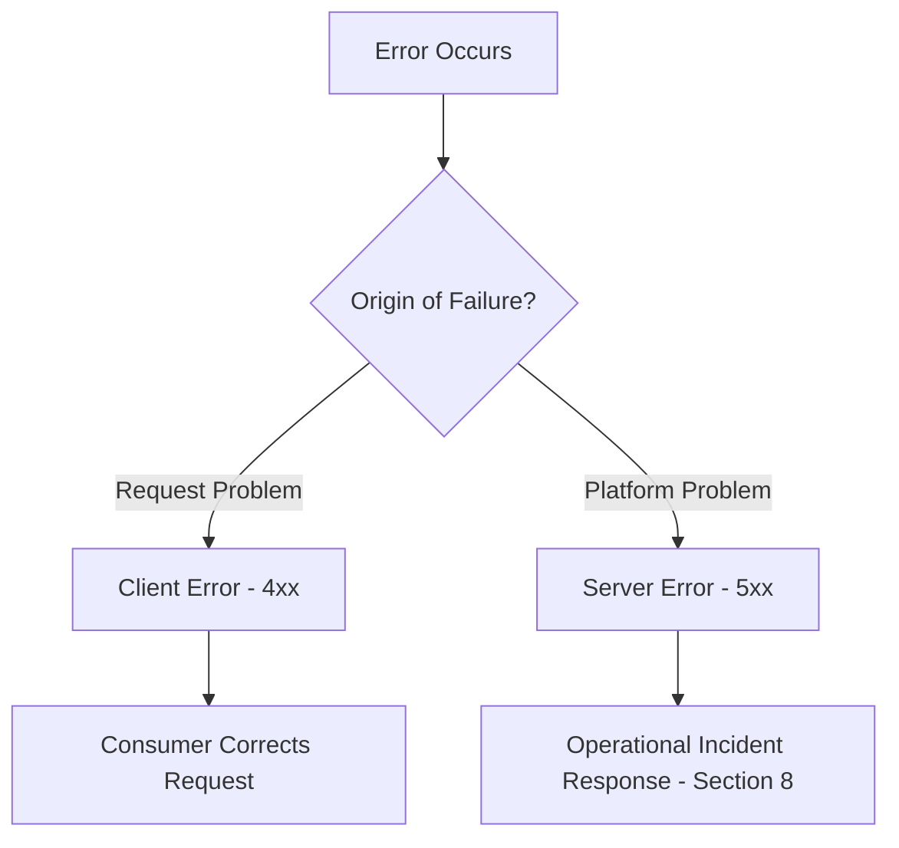
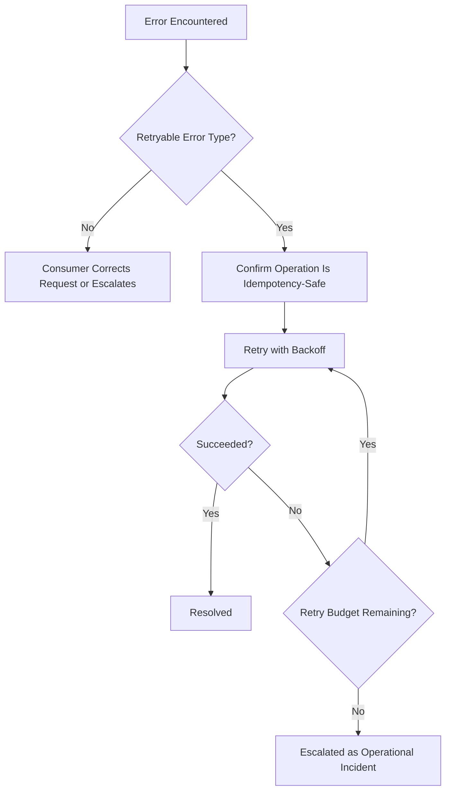
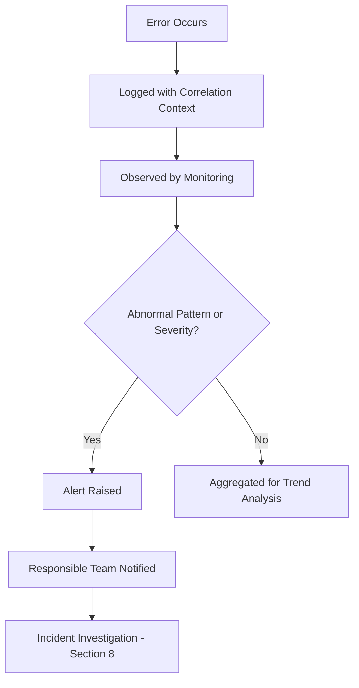
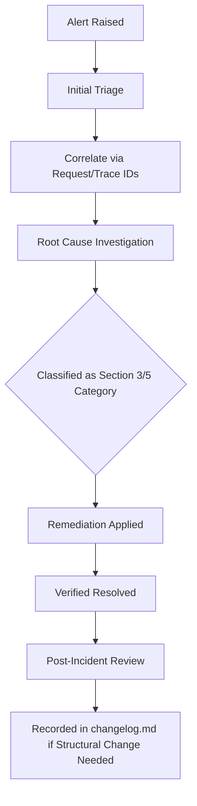
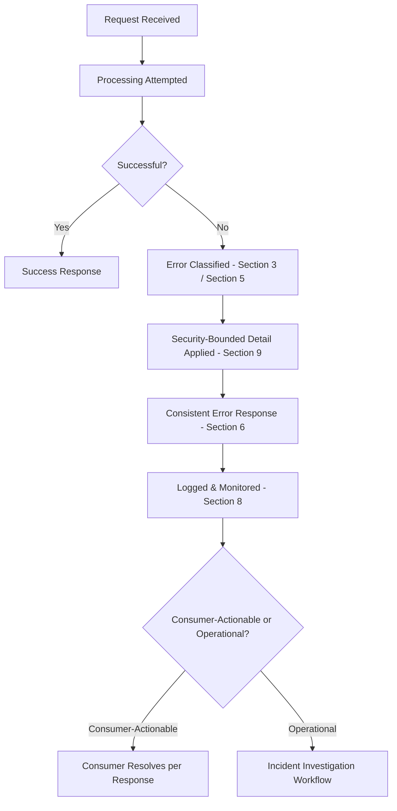

# Enterprise API Error Handling Strategy

## 1. Document Purpose

This document establishes the Enterprise API Error Handling Strategy for **StackLeo Tech Store**: how the platform communicates, classifies, and operationally responds to failure across every API interaction.

- **Purpose of API Error Handling** — to ensure every failure, expected or unexpected, is communicated consistently, understood clearly, and handled predictably by both consumers and the platform itself.
- **Relationship with API Reliability** — disciplined error handling is a direct expression of the Reliability and Resilience quality attributes defined in `api-overview.md` (Section 7) and `api-strategy.md` (Section 9).
- **Relationship with Developer Experience** — clear, consistent errors are one of the strongest contributors to Developer Experience (`05_API/README.md`, Section 2); a consumer who understands why something failed can resolve it without support intervention.
- **Relationship with Observability** — this document extends the observability principles in `03_System_Design/observability.md` to the specific discipline of surfacing and investigating API failure, per Section 8.
- **Relationship with Security** — error communication must never become a vector for information disclosure, consistent with `04_Database/security-model.md`; Section 9 addresses this directly.

## 2. Error Handling Philosophy

- **Predictability** — a consumer can anticipate how failure will be communicated before encountering it, based on consistent, documented conventions.
- **Transparency** — an error clearly communicates what went wrong, to the extent that can be safely disclosed.
- **Security Awareness** — error detail is bounded by what is safe to disclose, never by what is merely convenient to omit.
- **Consumer-Friendly Errors** — every error is actionable from the consumer's perspective, not merely descriptive of an internal condition.
- **Operational Debugging** — every error carries sufficient internal context for StackLeo's own teams to investigate and resolve the underlying cause.
- **Consistency** — errors are represented identically in structure and meaning across the entire API surface, per `api-standards.md` (Section 10).
- **Resilience** — the platform's error handling supports graceful degradation and safe recovery rather than cascading failure.

## 3. Error Classification

### Client Errors

Examples: Invalid Input, Authentication Failure, Authorization Failure, Resource Not Found, Conflict.

- **Consumer Responsibility** — client errors arise from a problem in the request itself; resolving them requires the consumer to change what was sent.
- **Resolution Expectations** — a client error clearly identifies what about the request was problematic so the consumer can correct it without guesswork; retrying an unchanged request will not succeed.

### Server Errors

Examples: Internal Failure, Dependency Failure, Service Unavailable, Timeout.

- **Operational Responsibility** — server errors arise from a problem within the platform itself; resolving them is StackLeo's responsibility, not the consumer's.
- **Recovery Expectations** — a server error is treated as an operational incident, triggering the monitoring and alerting response defined in Section 8; a well-formed retry, per Section 7, may succeed once the underlying condition resolves.

### Client vs Server Error Comparison

| Aspect | Client Errors | Server Errors |
|---|---|---|
| Origin | The request itself | The platform's ability to fulfill an otherwise valid request |
| Responsibility for Resolution | Consumer | StackLeo (platform operations) |
| Retry Value | Not useful without changing the request | Potentially useful once the underlying condition resolves |
| Operational Response | Logged for pattern analysis | Triggers monitoring and alerting, per Section 8 |
| Consumer Communication | Specific, actionable detail | General, safe detail; internal detail retained for operational use only |

*Diagram: Error Classification Decision Flow.*

## 4. Business Error Model

Beyond generic technical classification, StackLeo's business domains produce errors with specific business meaning:

- **Inventory Issues** — such as attempting to order a quantity exceeding available stock, per `04_Database/data-model.md` (Inventory domain).
- **Payment Problems** — such as a declined payment or settlement failure, per `04_Database/data-model.md` (Payments domain).
- **Order State Conflicts** — such as attempting to cancel an order that has already shipped, violating the Order Aggregate's lifecycle per `resource-model.md` (Section 4).
- **Shipping Issues** — such as an address that cannot be serviced by available courier coverage.
- **Account Restrictions** — such as an action blocked due to a suspended or restricted customer account.
- **Marketplace Rules (Future)** — such as a vendor action violating marketplace onboarding or commission terms.

**Why Business Errors Need Clear Communication** — a business error is not a technical failure; it reflects a legitimate business rule being enforced, per `01_Business/business-rules.md`. Consumers must be able to distinguish "something is broken" from "the business rule correctly prevented this," since the appropriate response differs entirely between the two.

## 5. Error Categories

| Category | Meaning | Business Impact | Handling Approach |
|---|---|---|---|
| Validation Errors | The request's structure or values do not meet the target resource's basic constraints. | Low; resolved directly by the consumer correcting input. | Rejected before further processing, with field-level feedback. |
| Authentication Errors | The consumer's identity could not be verified, per `authentication.md`. | Moderate; blocks all further interaction until resolved. | Rejected immediately; consumer must re-authenticate. |
| Authorization Errors | The verified identity lacks permission for the requested action. | Moderate; may indicate a legitimate access boundary or a misconfiguration. | Rejected with a clear, safe indication that permission is lacking, per `authorization.md`. |
| Resource Errors | The targeted resource does not exist or is not in an addressable state. | Low to Moderate; often reflects normal navigation to stale or invalid references. | Rejected clearly, without confirming or denying the existence of unauthorized resources. |
| Business Rule Errors | The request is technically valid but violates a governed business rule. | Moderate to High; reflects the business intentionally preventing an action. | Rejected with business-meaningful explanation, per Section 4. |
| Integration Errors | A failure originating from an external dependency, such as a payment or courier provider. | Moderate to High; may block a critical business flow. | Classified by retryability, per Section 7; escalated if persistent. |
| System Errors | An unexpected internal platform failure. | High; represents unplanned platform malfunction. | Treated as an operational incident, per Section 8. |
| Operational Errors | A failure related to platform capacity, availability, or maintenance state. | Moderate to High; affects consumer-visible availability. | Communicated transparently where safe; triggers operational response. |

### Error Classification Matrix

| Category | Primary Class | Retryable by Default | Consumer-Actionable |
|---|---|---|---|
| Validation Errors | Client Error | No | Yes |
| Authentication Errors | Client Error | No (without re-authentication) | Yes |
| Authorization Errors | Client Error | No | Limited (may require escalation) |
| Resource Errors | Client Error | No | Yes |
| Business Rule Errors | Client Error | No | Yes |
| Integration Errors | Server Error (typically) | Often | Limited |
| System Errors | Server Error | Sometimes | No |
| Operational Errors | Server Error | Often | No |

## 6. Error Response Principles

- **Consistent Error Communication** — every error, regardless of origin, is communicated through the same structural conventions, per `api-standards.md` (Section 10).
- **Human Readability** — every error includes a message a person can understand without consulting internal documentation.
- **Machine Processing** — every error also includes a stable, structured indicator a consuming system can programmatically act on.
- **Traceability** — every error can be correlated back to a specific request, per Section 8.
- **Security Considerations** — error detail never exceeds what is safe to disclose to the requesting consumer, per Section 9.
- **Localization Readiness** — human-readable error messaging is structured to support future presentation in multiple languages, consistent with `request-response.md` (Section 8).

## 7. Retry Strategy

- **Retryable Errors** — failures whose underlying cause may resolve on its own, such as a transient dependency failure, where repeating the same request may succeed.
- **Non-Retryable Errors** — failures whose underlying cause will not change without the consumer altering something, such as invalid input; repeating the request unchanged will fail identically.
- **Temporary Failures** — failures expected to resolve within a short timeframe, appropriate for near-term retry.
- **Permanent Failures** — failures that will not resolve without external intervention, inappropriate for automatic retry.
- **Backoff Concepts** — a consumer retrying a failed request progressively increases the delay between attempts, avoiding compounding an already-strained condition.
- **Consumer Responsibility** — consumers are expected to distinguish retryable from non-retryable failures and to retry critical operations only in a manner consistent with `idempotency.md`, avoiding unintended duplicate effects.

### Retry Decision Matrix

| Failure Type | Retry Appropriate? | Recommended Approach |
|---|---|---|
| Validation Errors | No | Correct the request before resubmitting. |
| Authentication Errors | No (without re-authentication) | Re-authenticate, then resubmit. |
| Authorization Errors | No | Escalate or seek appropriate access; do not retry. |
| Resource Not Found | No | Confirm resource identity before resubmitting. |
| Business Rule Errors | No | Address the underlying business condition. |
| Transient Integration Failures | Yes | Retry with backoff, respecting idempotency. |
| Service Unavailable / Timeout | Yes | Retry with backoff, respecting idempotency. |
| Persistent System Errors | Limited | Escalate if retries continue to fail. |

*Diagram: Retry Decision Workflow.*

## 8. Observability Integration

- **Logging** — every error is recorded with sufficient context for later investigation, consistent with `03_System_Design/observability.md`.
- **Monitoring** — error rates and patterns are continuously observed to detect degradation before it becomes a significant incident.
- **Alerting** — server errors and abnormal client error patterns trigger timely notification to responsible teams.
- **Correlation IDs** — every error is traceable to the specific request and broader consumer action it originated from, per `request-response.md` (Section 9).
- **Tracing** — an error occurring within a multi-component interaction can be traced to its originating component, consistent with `03_System_Design/observability.md`.
- **Incident Investigation** — errors provide the starting point for structured incident investigation, per the workflow in this section.
- **Operational Visibility** — aggregated error data informs ongoing platform reliability improvement, not merely individual incident response.

### Observability Requirements

| Requirement | Purpose | Related Document |
|---|---|---|
| Logging | Capture sufficient error context for investigation | `03_System_Design/observability.md` |
| Monitoring | Detect degradation trends before major impact | `03_System_Design/observability.md` |
| Alerting | Notify responsible teams of significant failures | `03_System_Design/observability.md` |
| Correlation IDs | Trace an error to its originating request and action | `request-response.md` |
| Tracing | Trace an error across multi-component interactions | `03_System_Design/observability.md` |
| Incident Investigation | Structure the response to significant failures | Section 8 (this document) |

*Diagram: Error Monitoring & Alerting Flow.*

*Diagram: Incident Investigation Workflow.*

## 9. Security Considerations

- **Avoid Information Leakage** — error messages never reveal internal implementation, infrastructure, or data structure detail.
- **Sensitive Data Protection** — an error never echoes back sensitive submitted data (such as payment detail) as part of its explanation.
- **Safe Error Messages** — consumer-facing error detail is deliberately bounded to what is necessary for resolution, with fuller diagnostic detail retained internally only.
- **Attack Prevention** — error responses do not provide information that would help an unauthorized party enumerate resources, probe for vulnerabilities, or distinguish valid from invalid credentials beyond what is necessary.
- **Audit Requirements** — errors involving authentication, authorization, or business-rule enforcement are retained consistent with the auditability principles in `04_Database/data-governance.md` (Section 3).

## 10. Error Handling Across Domains

### Domain Error Categories

| Domain | Representative Error Scenario | Handling Emphasis |
|---|---|---|
| Authentication | Invalid or expired credentials. | Clear, safe rejection without revealing which part of a credential was incorrect. |
| Product Catalog | A requested product no longer exists or is unpublished. | Clear resource-not-found handling without exposing internal catalog state. |
| Cart | An item added to a cart is no longer available in the requested quantity. | Business error clearly explaining the inventory constraint, per Section 4. |
| Orders | An attempt to modify an order past a permitted lifecycle stage. | Business error explaining the order's current state and why the action is disallowed. |
| Payments | A declined or failed payment attempt. | Business error communicated without exposing sensitive payment provider detail. |
| Shipping | An address outside serviceable delivery coverage. | Business error clearly identifying the constraint, with no operational detail exposed. |
| Reviews | An attempt to review a product without a qualifying purchase. | Business error explaining the eligibility rule. |
| Notifications | A failure to deliver a notification. | Treated as an operational error; retried per Section 7 where appropriate, without consumer-facing disruption. |
| Admin Operations | An administrative action violating a governance rule. | Clear authorization or business-rule error, fully audited per Section 9. |
| Marketplace (Future) | A vendor action violating marketplace terms. | Business error referencing the specific marketplace rule violated. |

## 11. Future Evolution

- **AI-Based Troubleshooting** — future capability to assist consumers or internal teams in diagnosing errors using accumulated error pattern data.
- **Automated Incident Response** — future capability to trigger predefined remediation for well-understood, recurring failure patterns.
- **Self-Healing Systems** — future architectural capability to automatically recover from certain classes of transient failure without human intervention.
- **Distributed Systems** — error handling remains coherent as `03_System_Design/service-architecture.md` evolves toward a more distributed operational model.
- **Event-Driven Architecture** — error handling extends to asynchronous, event-based interaction as the platform's event model matures, per `03_System_Design/event-flows.md`.
- **Multi-region Operations** — error handling and observability remain consistent as the platform expands operational footprint beyond Bangladesh.

## 12. Governance

- **Error Taxonomy Ownership** — the API Architect owns the error classification and taxonomy defined in this document, in partnership with the Security Lead for security-sensitive error handling.
- **Review Process** — new error categories or significant changes to existing error handling are reviewed against this document's principles before implementation.
- **Documentation Standards** — this document follows the enterprise Markdown conventions established across this repository.
- **Monitoring Standards** — error observability practices conform to `03_System_Design/observability.md`.
- **Change Management** — material changes to error handling strategy are recorded in `00_Project_Overview/changelog.md`.

### Governance Responsibilities

| Role | Responsibility |
|---|---|
| API Architect | Owns overall error taxonomy and handling strategy coherence. |
| Security Lead | Reviews error handling for information leakage and security risk, per Section 9. |
| SRE / Operations Lead | Owns observability integration and incident response practices, per Section 8. |
| Backend Engineering Lead | Ensures implementations conform to approved error classification and handling. |
| Domain Owner | Ensures domain-specific business errors (Section 4) are accurately represented. |

## 13. Anti-Patterns

| Anti-Pattern | Description | Why It Should Be Avoided |
|---|---|---|
| Generic Error Messages | Returning vague, non-specific error detail regardless of the actual failure. | Undermines Consumer-Friendly Errors and increases support burden. |
| Leaking Internal Details | Exposing internal implementation, stack, or infrastructure detail in an error. | Directly violates Avoid Information Leakage (Section 9) and aids potential attackers. |
| Inconsistent Error Formats | Representing errors differently across different parts of the API. | Undermines Consistency (Section 2) and forces per-domain consumer error handling. |
| Missing Error Tracking | Failing to log or correlate errors for later investigation. | Undermines Observability Integration (Section 8) and delays incident resolution. |
| Ignoring Business Errors | Treating legitimate business rule enforcement as a generic technical failure. | Confuses consumers about whether something is broken or working as intended, per Section 4. |
| No Retry Strategy | Failing to distinguish retryable from non-retryable failures. | Leaves consumers unable to safely recover from transient failure, undermining Resilience. |
| Poor Logging | Logging errors without sufficient context to investigate them. | Directly undermines Operational Debugging (Section 2) and prolongs incident resolution. |
| Silent Failures | Failing to surface an error condition at all. | Prevents both consumers and operational teams from detecting and responding to genuine problems. |

### Anti-Pattern Summary

| Anti-Pattern | Primary Risk | Mitigating Principle |
|---|---|---|
| Generic Error Messages | Poor consumer resolution ability | Consumer-Friendly Errors |
| Leaking Internal Details | Security exposure | Avoid Information Leakage |
| Inconsistent Error Formats | Increased integration cost | Consistency |
| Missing Error Tracking | Delayed incident resolution | Observability Integration |
| Ignoring Business Errors | Consumer confusion | Business Error Model |
| No Retry Strategy | Unsafe or absent recovery | Retry Strategy |
| Poor Logging | Prolonged investigation time | Operational Debugging |
| Silent Failures | Undetected platform problems | Transparency |

*Diagram: API Error Handling Lifecycle.*

## 14. Document Information

| Property | Value |
|----------|-------|
| Document | error-handling.md |
| Version | 1.0.0 |
| Status | Active |
| Maintained By | StackLeo |
| Last Updated | 2026-07-17 |

---

© StackLeo. All Rights Reserved.
