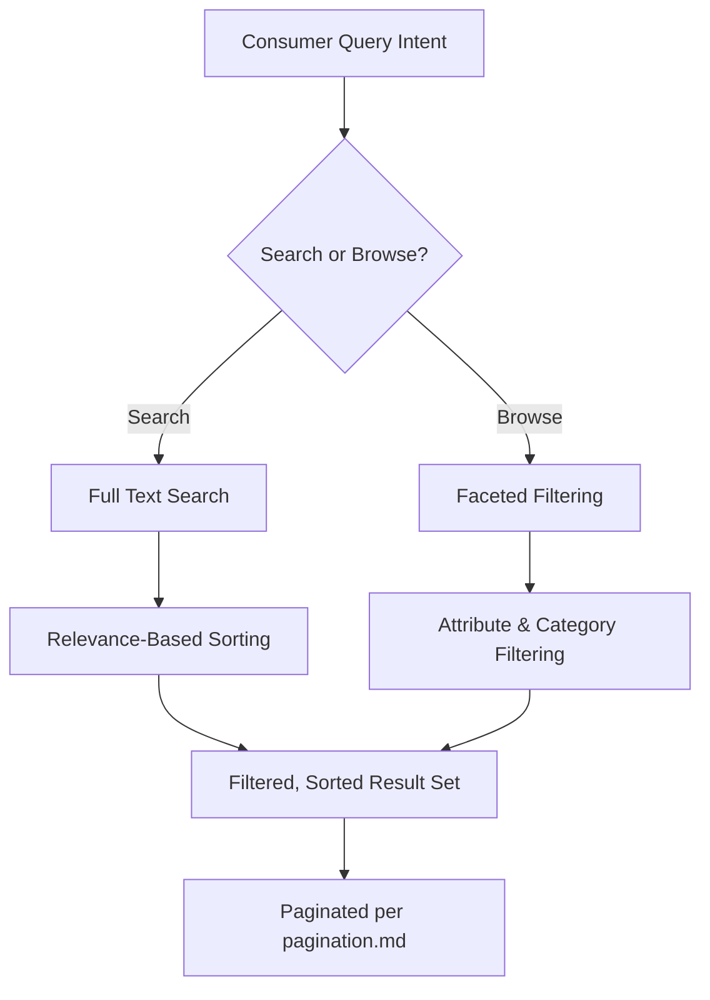
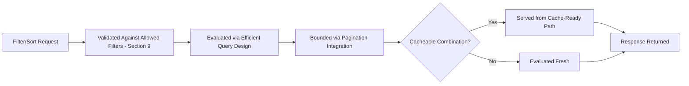
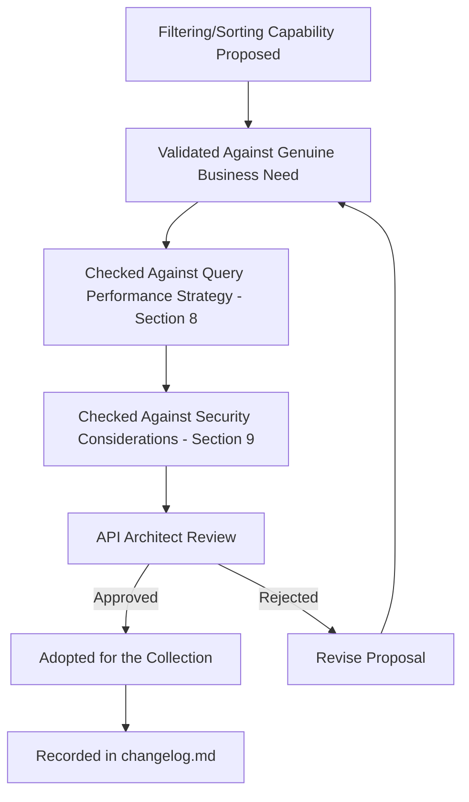
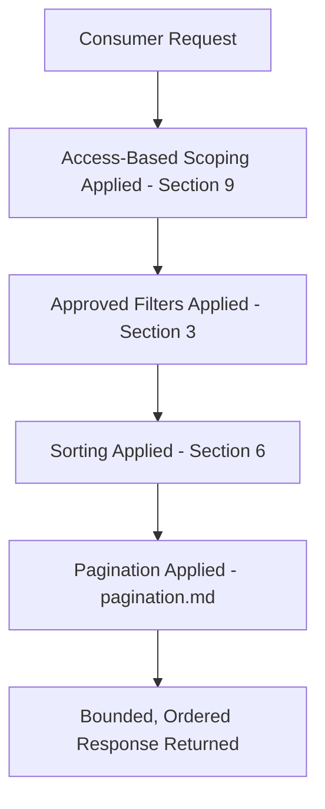
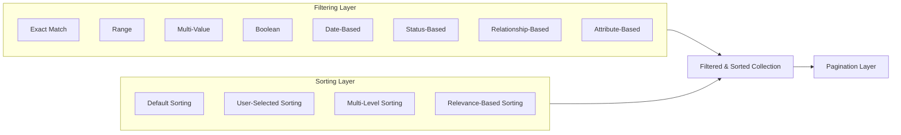

# Enterprise API Filtering & Sorting Strategy

## 1. Document Purpose

This document establishes the Enterprise API Filtering & Sorting Strategy for **StackLeo Tech Store**: the principles governing how consumers narrow and order collections of resources.

- **Purpose of Filtering and Sorting** — to allow consumers to retrieve precisely the subset and ordering of data relevant to their business need, rather than retrieving and processing an entire collection themselves.
- **Relationship with API Usability** — well-designed filtering and sorting are central to a consumer's ability to accomplish real business tasks efficiently, directly supporting Developer Experience (`05_API/README.md`, Section 2).
- **Relationship with Performance** — filtering reduces the volume of data a query must return and a consumer must process, directly supporting the Performance quality attribute in `api-overview.md` (Section 7).
- **Relationship with Pagination** — filtering and sorting determine *which* records and in *what order* a collection is divided into pages, per `pagination.md` (Section 6); pagination cannot be reasoned about correctly without a stable filtering and sorting foundation.
- **Relationship with Search Experience** — filtering and sorting are foundational building blocks of the broader product discovery and search experience described in `02_Product/user-journeys.md`, and in Section 7 of this document.

## 2. Query Design Philosophy

- **Consumer-Friendly Queries** — filtering and sorting capability is designed around how consumers naturally think about narrowing data, not around internal data structure.
- **Predictability** — a consumer who understands how to filter or sort one collection can correctly predict how to filter or sort another.
- **Consistency** — filtering and sorting conventions apply uniformly across every domain, per `api-standards.md` (Section 6).
- **Performance Awareness** — every supported filter and sort option is chosen with its underlying retrieval cost in mind, not offered purely for consumer convenience.
- **Scalability** — filtering and sorting remain efficient as collection size grows toward marketplace scale, per Section 4 and Section 8.
- **Discoverability** — the filtering and sorting capability available for a given collection is self-evident to a consumer familiar with the resource model, consistent with `endpoint-design.md` (Section 9).
- **Security Considerations** — filtering never becomes a means of exposing data a consumer is not authorized to see, per Section 9.

## 3. Filtering Strategy

| Approach | Business Scenario | Advantages | Trade-offs |
|---|---|---|---|
| Exact Match Filtering | A customer filters products to a specific brand. | Simple, precise, and efficient to evaluate. | Cannot express nuance beyond an exact value. |
| Range Filtering | A customer filters products to a price range. | Captures naturally continuous business criteria intuitively. | Requires well-indexed underlying data to remain efficient at scale. |
| Multi-Value Filtering | A customer filters products across several selected categories at once. | Reflects natural "any of these" consumer intent. | Query complexity and cost grow with the number of values supported. |
| Boolean Filtering | An administrator filters products to only those currently in stock. | Simple, low-cost to evaluate. | Limited expressiveness beyond a binary condition. |
| Date-Based Filtering | A customer filters their order history to a specific time period. | Aligns with naturally time-ordered business data. | Requires clear timezone and boundary handling to avoid consumer confusion. |
| Status-Based Filtering | An administrator filters orders to those "Pending Fulfillment." | Directly reflects business process state; high business value. | Status vocabularies must remain stable and well-governed over time. |
| Relationship-Based Filtering | A customer filters reviews to those for a specific product. | Reflects natural navigation through related resources. | Can encourage inappropriate cross-aggregate query patterns if not bounded carefully. |
| Attribute-Based Filtering | A customer filters products by a technical specification (e.g., storage capacity). | Supports rich, domain-specific product discovery. | Attribute vocabularies vary significantly by product category, adding modeling complexity. |

### Filtering Strategy Comparison

| Approach | Query Cost Profile | Consumer Intuitiveness | Best Fit |
|---|---|---|---|
| Exact Match Filtering | Low | High | Categorical, precise criteria |
| Range Filtering | Moderate | High | Continuous criteria (price, date) |
| Multi-Value Filtering | Moderate to High | High | "Any of" selection scenarios |
| Boolean Filtering | Low | High | Binary conditions |
| Date-Based Filtering | Moderate | High | Time-ordered collections |
| Status-Based Filtering | Low | High | Business process state |
| Relationship-Based Filtering | Moderate to High | Moderate | Cross-resource navigation |
| Attribute-Based Filtering | Moderate to High | Moderate | Rich product discovery |

## 4. Product Catalog Filtering

- **Categories** — filtering by the hierarchical classification defined in `resource-model.md` (Section 3), supporting natural browsing behavior.
- **Brands** — filtering by manufacturer, a common and high-value customer filtering criterion in Technology & Electronics Retail.
- **Price Range** — a range-based filter reflecting one of the most consistently used customer decision criteria.
- **Availability** — filtering to only currently purchasable products, directly affecting conversion.
- **Ratings** — filtering by aggregated customer review scores, supporting trust-based decision-making.
- **Specifications** — filtering by structured technical detail relevant to electronics purchasing decisions.
- **Attributes** — filtering by broader product characteristics beyond formal specifications.
- **Promotions** — filtering to products currently subject to a promotional offer, per `01_Business/pricing-strategy.md`.

**Marketplace-Scale Considerations** — as the future Multi-Vendor Marketplace model introduces many vendors contributing to a shared catalog, filtering must remain efficient and consistent even as product volume and attribute diversity multiply substantially beyond the current single-seller catalog.

## 5. Order & Customer Filtering

- **Order Status** — filtering orders by their current lifecycle stage, per `resource-model.md` (Section 7), supporting both customer self-service and staff operational needs.
- **Date Range** — filtering orders or customer activity to a relevant time period, supporting both customer history review and business reporting.
- **Customer History** — filtering a customer's own past activity, supporting the Customer Dashboard experience defined in `02_Product/user-journeys.md`.
- **Payment Status** — filtering orders by settlement state, supporting finance and operational visibility.
- **Shipping Status** — filtering orders by fulfillment progress, supporting both customer tracking and logistics coordination.
- **Business Reports** — filtering combinations supporting the aggregated views described in `04_Database/data-model.md` (Analytics domain), where filtering criteria are typically broader and more combinable than customer-facing filters.

## 6. Sorting Strategy

- **Default Sorting** — every collection has a well-defined default order applied when a consumer expresses no explicit preference, chosen to reflect the most common business need.
- **User-Selected Sorting** — consumers may choose from a defined set of meaningful sort orders relevant to the collection.
- **Multi-Level Sorting** — sorting may consider more than one criterion, with a defined precedence, to resolve ties meaningfully rather than arbitrarily.
- **Stable Sorting** — sorting produces a consistent, repeatable order across paginated requests, per `pagination.md` (Section 6).
- **Business Priority Sorting** — certain collections may reflect deliberate business priority in their ordering (such as promoted products), distinct from purely attribute-based sorting.
- **Relevance-Based Sorting** — where a collection results from a search operation, sorting reflects the degree of match to the consumer's query intent, per Section 7.

### Sorting Strategy Matrix

| Sorting Type | Determinism | Typical Use | Related Principle |
|---|---|---|---|
| Default Sorting | Fully deterministic | Applied when no preference is expressed | Predictability |
| User-Selected Sorting | Fully deterministic | Customer-chosen ordering (e.g., price, newest) | Consumer-Friendly Queries |
| Multi-Level Sorting | Fully deterministic | Resolving ties meaningfully | Stable Sorting |
| Stable Sorting | Fully deterministic | Ensuring consistent pagination traversal | `pagination.md` Section 6 |
| Business Priority Sorting | Deterministic, business-governed | Promoted or featured product placement | Business alignment |
| Relevance-Based Sorting | Deterministic given a fixed query and index state | Search result ordering | Search Integration (Section 7) |

## 7. Search Integration

- **Full Text Search** — filtering and sorting apply consistently to the results of a broader text-based search, rather than representing a wholly separate mechanism.
- **Product Discovery** — filtering and sorting are the primary mechanism by which a customer refines a broad catalog into a personally relevant result set, per `02_Product/user-journeys.md`.
- **Faceted Search** — filtering options are presented to consumers as facets reflecting genuinely meaningful, commonly used narrowing criteria for the collection being explored.
- **Autocomplete** — a complementary, lighter-weight discovery mechanism that guides a consumer toward an effective search or filter choice.
- **Recommendation Systems** — filtering and sorting principles inform how a future recommendation-driven collection is ordered, extending relevance-based sorting into personalized contexts.
- **AI Search (Future)** — future AI-driven search capability builds on the same filtering and sorting foundation, applying relevance-based sorting derived from more sophisticated matching.

### Search Integration Model

| Capability | Relationship to Filtering & Sorting | Maturity |
|---|---|---|
| Full Text Search | Results are subsequently narrowed and ordered using the same filtering and sorting conventions. | Current |
| Faceted Search | Presents filtering options as consumer-facing facets over a searched or browsed collection. | Current |
| Autocomplete | Guides consumers toward effective filter or search input; does not itself return a final collection. | Current |
| Recommendation Systems | Applies relevance-based sorting principles in a personalized context. | Near-term future |
| AI Search | Extends relevance-based sorting with more sophisticated, model-driven matching. | Longer-term future |

*Diagram: Search Integration Flow.*

## 8. Query Performance Strategy

- **Efficient Query Design** — filtering and sorting options are chosen and structured to remain efficiently evaluable against the underlying data model, per `04_Database/indexing-strategy.md`.
- **Result Limitation** — every filtered and sorted collection remains subject to the pagination discipline defined in `pagination.md`, never returning an unbounded result.
- **Pagination Integration** — filtering and sorting are always applied before pagination divides the result into segments, per `pagination.md` (Section 6).
- **Caching Readiness** — common, high-frequency filter and sort combinations are structured to support caching, consistent with `api-strategy.md` (Section 7).
- **Large Dataset Handling** — as catalog and order volume grow toward marketplace scale, filtering and sorting strategy prioritizes options that remain efficient at that scale, per Section 4.
- **Consumer Performance** — well-scoped filtering reduces the data volume a consumer application must process and render, improving overall responsiveness.

### Performance Consideration Matrix

| Consideration | Primary Beneficiary | Related Document |
|---|---|---|
| Efficient Query Design | Platform operations | `04_Database/indexing-strategy.md` |
| Result Limitation | All consumers | `pagination.md` |
| Pagination Integration | All consumers | `pagination.md` |
| Caching Readiness | High-frequency consumers | `api-strategy.md` |
| Large Dataset Handling | Marketplace-scale operations | `04_Database/partitioning-strategy.md` |
| Consumer Performance | Frontend and mobile consumers | `02_Product/non-functional-requirements.md` |

*Diagram: Query Optimization Lifecycle.*

## 9. Security Considerations

- **Allowed Filters** — only explicitly approved filtering criteria are supported for a given collection; consumers cannot filter on arbitrary internal fields.
- **Sensitive Data Protection** — filtering criteria never allow a consumer to indirectly infer sensitive data they are not authorized to view, consistent with `04_Database/security-model.md`.
- **Query Abuse Prevention** — filtering and sorting capability is governed by the same rate-limiting and fairness principles as any other API interaction, per `rate-limiting.md`, preventing overly broad or repetitive queries from degrading platform stability.
- **Access-Based Filtering** — every query is implicitly scoped to what the requesting identity is authorized to see, per `authorization.md`, before any consumer-supplied filter is applied.
- **Data Exposure Prevention** — filtering and sorting never become a mechanism for enumerating or discovering resources outside a consumer's authorized visibility.

### Security Consideration Matrix

| Consideration | Risk If Ignored | Mitigating Practice |
|---|---|---|
| Allowed Filters | Exposure of internal or unintended fields | Explicit filter allow-listing per collection |
| Sensitive Data Protection | Indirect inference of protected data | Filter criteria reviewed against data classification, per `04_Database/security-model.md` |
| Query Abuse Prevention | Platform performance degradation | Governed by `rate-limiting.md` |
| Access-Based Filtering | Unauthorized data visibility | Authorization scoping applied before consumer filters, per `authorization.md` |
| Data Exposure Prevention | Resource enumeration by unauthorized consumers | Consistent authorization-first query evaluation |

## 10. Future Evolution

- **AI-Powered Search** — future intelligent search capability builds on the filtering and sorting foundation established here, extending relevance-based sorting with more sophisticated matching.
- **Semantic Search** — future capability to match based on meaning rather than exact terms, complementing rather than replacing structured filtering.
- **Natural Language Query** — future capability to translate conversational consumer intent into the structured filtering and sorting concepts defined in this document.
- **Marketplace Search** — vendor-scale product discovery extends existing filtering and sorting conventions rather than introducing parallel ones, per Section 4.
- **Analytics Query APIs** — future analytical query capability applies the same filtering discipline, adapted to aggregated rather than transactional data.
- **GraphQL Filtering** — the filtering and sorting concepts defined here map naturally onto a future complementary graph-based query approach's argument-based filtering.

## 11. Governance

- **Query Standard Ownership** — the API Architect owns the filtering and sorting strategy's coherence, in partnership with the Database Architect for underlying query efficiency.
- **Review Process** — proposed filtering or sorting capability for a collection is reviewed against this document's principles, including the security considerations in Section 9, before implementation.
- **Documentation Standards** — this document follows the enterprise Markdown conventions established across this repository.
- **Change Management** — material changes to filtering and sorting strategy are recorded in `00_Project_Overview/changelog.md`.
- **Versioning** — this document follows Semantic Versioning per `00_Project_Overview/changelog.md`; changes affecting existing consumer query capability are governed additionally by `versioning.md`.

### Governance Responsibilities

| Role | Responsibility |
|---|---|
| API Architect | Owns overall filtering and sorting strategy coherence. |
| Database Architect | Ensures filtering and sorting options align with efficient data retrieval. |
| Security Lead | Reviews filtering capability for data exposure risk, per Section 9. |
| Backend Engineering Lead | Ensures implementations conform to approved filtering and sorting design. |
| Product Manager | Validates filtering and sorting options against genuine business need. |

*Diagram: Query Governance Workflow.*

## 12. Anti-Patterns

| Anti-Pattern | Description | Why It Should Be Avoided |
|---|---|---|
| Unlimited Filtering | Allowing consumers to filter on any arbitrary field without governance. | Undermines Allowed Filters (Section 9) and risks both performance and data exposure issues. |
| Inconsistent Rules | Applying different filtering and sorting conventions across different collections. | Undermines Consistency and Predictability (Section 2). |
| Database Field Exposure | Naming filter criteria directly after internal database columns. | Couples the API to implementation detail, undermining Implementation Independence. |
| Unstable Sorting | Allowing sort order to vary unpredictably between requests for the same criteria. | Produces inconsistent pagination traversal, directly conflicting with `pagination.md` (Section 6). |
| Poor Search Experience | Offering filtering and sorting options that do not reflect genuine consumer decision-making criteria. | Undermines Consumer-Friendly Queries and product discovery effectiveness. |
| Expensive Queries | Supporting filter or sort combinations that are disproportionately costly to evaluate. | Undermines Performance Awareness and risks platform-wide performance degradation. |
| Missing Pagination Integration | Applying filtering or sorting without coordinating with pagination. | Produces incorrect or inconsistent result sets, violating Section 8. |
| Ignoring Security | Failing to scope filtering to what a consumer is authorized to see. | Directly undermines Access-Based Filtering (Section 9) and risks unauthorized data exposure. |

### Anti-Pattern Summary

| Anti-Pattern | Primary Risk | Mitigating Principle |
|---|---|---|
| Unlimited Filtering | Performance and exposure risk | Allowed Filters |
| Inconsistent Rules | Increased consumer learning cost | Consistency |
| Database Field Exposure | Implementation coupling | Implementation Independence |
| Unstable Sorting | Broken pagination traversal | Stable Sorting |
| Poor Search Experience | Reduced product discovery effectiveness | Consumer-Friendly Queries |
| Expensive Queries | Platform performance degradation | Performance Awareness |
| Missing Pagination Integration | Incorrect result sets | Pagination Integration |
| Ignoring Security | Unauthorized data exposure | Access-Based Filtering |

*Diagram: Query Processing Flow.*

*Diagram: Filtering & Sorting Architecture.*

## 13. Document Information

| Property | Value |
|----------|-------|
| Document | filtering-sorting.md |
| Version | 1.0.0 |
| Status | Active |
| Maintained By | StackLeo |
| Last Updated | 2026-07-17 |

---

© StackLeo. All Rights Reserved.
