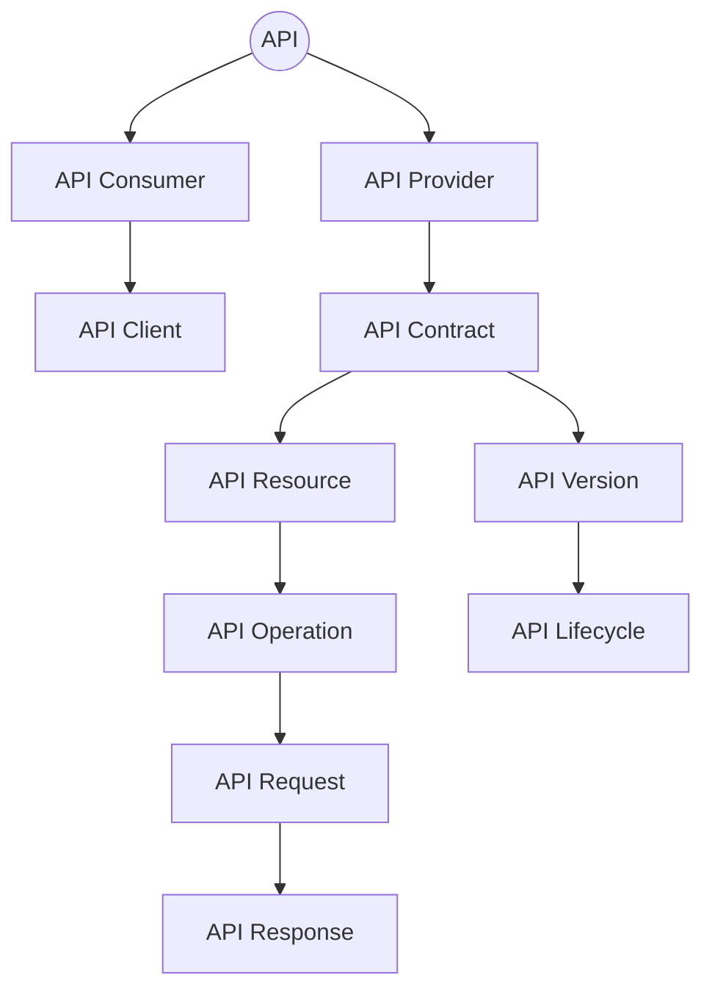
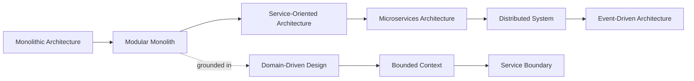
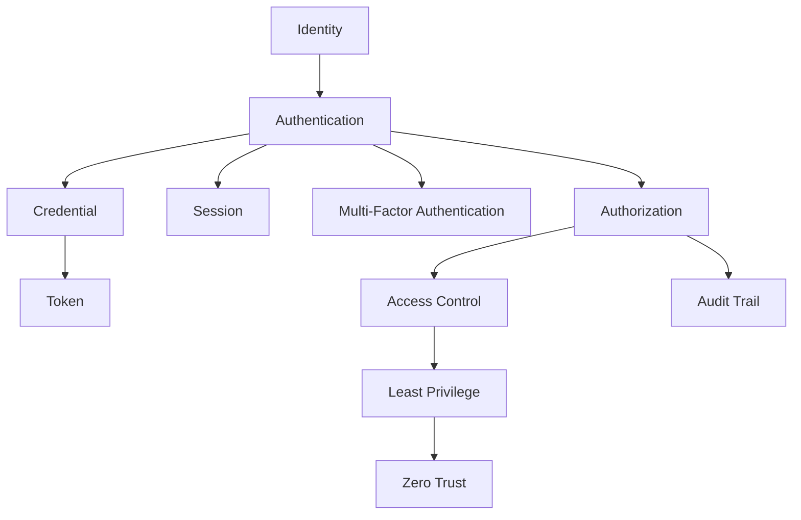
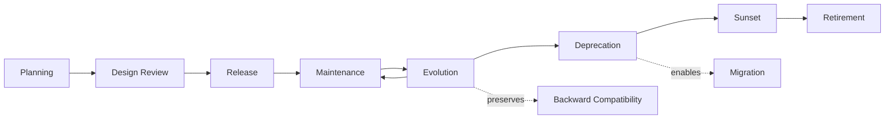
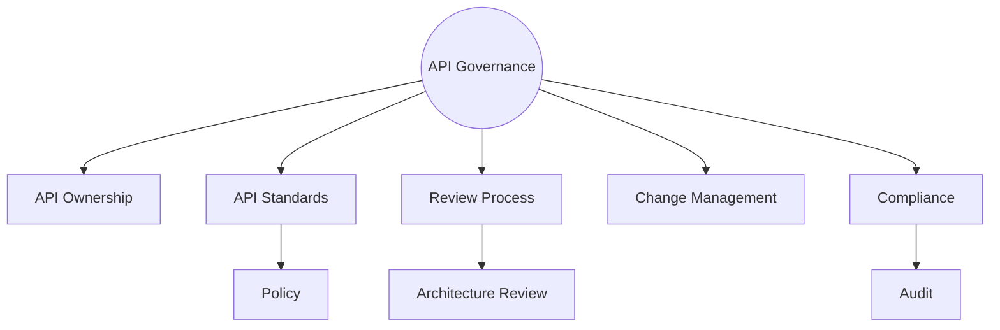

# API Architecture Glossary

## 1. Document Purpose

This document is the official API Architecture Glossary for **StackLeo Tech Store**, defining common terminology used across API architecture, security, integration, lifecycle management, governance, and distributed systems.

- **Purpose of the Glossary** — to ensure every reader of `05_API` interprets its terminology identically, whether they are an API Architect, a Backend Engineer, or a Business Stakeholder.
- **Importance of Shared Terminology** — API and distributed systems concepts (such as "idempotency," "throttling," or "bounded context") are easily confused or used loosely; a single authoritative reference prevents that confusion from propagating into design or communication mistakes.
- **Relationship with Architecture Documentation** — this glossary consolidates terminology introduced across every document in `05_API`, extending `03_System_Design/glossary.md` and `04_Database/glossary.md` with API-specific definitions.
- **Relationship with Team Communication** — a shared vocabulary allows developers, architects, product managers, QA engineers, security teams, and business stakeholders to collaborate on API decisions without talking past one another.

## 2. API Fundamental Terms

| Term | Definition | Business Context | Technical Context |
|---|---|---|---|
| API | A governed interface through which consumers access platform capability. | The single, consistent way any consumer interacts with StackLeo's business capability. | See `api-overview.md`. |
| API Consumer | Any system or person that interacts with an API. | Includes the Web Frontend, future Mobile Applications, Admin Dashboard, and future Partner Systems. | See `api-overview.md` (Section 4). |
| API Provider | The platform or service exposing an API for consumption. | StackLeo itself, in its role as the provider of the API ecosystem. | See `api-overview.md`. |
| API Contract | The agreed structure and behavior an API commits to for its consumers. | The basis of trust between StackLeo and every consumer building against its API. | See `request-response.md`. |
| API Resource | A business concept exposed through the API, per the canonical resource model. | Represents something a business stakeholder recognizes, such as an Order or Product. | See `resource-model.md`. |
| API Operation | A specific action that can be performed on or via a resource. | Reflects a business capability, such as placing an Order. | See `endpoint-design.md` (Section 6). |
| API Request | A consumer-initiated interaction with the API. | The mechanism by which a consumer expresses business intent. | See `request-response.md` (Section 3). |
| API Response | The API's reply to a request, communicating outcome and data. | Confirms to the consumer what happened as a result of their request. | See `request-response.md` (Section 4). |
| API Client | The software component initiating API requests on behalf of a consumer. | Includes browser-based, mobile, and server-side integrations. | Conceptual; no specific technology implied. |
| API Gateway | A conceptual entry point capable of enforcing cross-cutting concerns for API traffic. | Referenced conceptually without naming a specific product, per `api-strategy.md` (Section 7). | See `api-strategy.md` (Section 7). |
| API Lifecycle | The complete journey an API takes from planning through retirement. | Ensures every API is deliberately managed, not left to exist indefinitely. | See `api-lifecycle.md`. |
| API Version | A distinct, identifiable state of an API's contract. | Allows the API to evolve without breaking existing consumers. | See `versioning.md`. |

### API Terminology

| Term | Category |
|---|---|
| API | Fundamental |
| API Consumer | Fundamental |
| API Provider | Fundamental |
| API Contract | Fundamental |
| API Resource | Fundamental |
| API Operation | Fundamental |
| API Request | Fundamental |
| API Response | Fundamental |
| API Client | Fundamental |
| API Gateway | Fundamental |
| API Lifecycle | Fundamental |
| API Version | Fundamental |

*Diagram: API Knowledge Map.*

## 3. Architecture Terms

| Term | Definition | Business Context | Related Terms |
|---|---|---|---|
| Monolithic Architecture | An architecture where the entire application is built and deployed as a single unit. | Represents a simpler starting architecture, less suited to StackLeo's long-term multi-domain scale. | Modular Monolith |
| Modular Monolith | A single deployable unit internally organized into clearly separated, cohesive modules. | Reflects StackLeo's current architectural stage, per `03_System_Design/architecture-principles.md`. | Monolithic Architecture, Bounded Context |
| Service-Oriented Architecture | An architecture organizing capability into coarse-grained, independently addressable services. | An intermediate evolutionary step referenced in `03_System_Design/service-architecture.md`. | Microservices Architecture |
| Microservices Architecture | An architecture decomposing capability into many small, independently deployable services. | A future evolutionary direction as `03_System_Design/service-architecture.md` matures. | Service-Oriented Architecture, Distributed System |
| Event-Driven Architecture | An architecture where components communicate primarily through published and consumed events. | The future direction of StackLeo's internal and external (webhook) communication model. | Webhook, Event |
| Distributed System | A system whose components run across multiple independent nodes communicating over a network. | Introduces the reliability and consistency challenges addressed in `idempotency.md`. | Microservices Architecture |
| Domain-Driven Design | A design approach modeling software around business domains and their ubiquitous language. | The foundation of `resource-model.md` and `03_System_Design/domain-model.md`. | Bounded Context |
| Bounded Context | A boundary within which a specific domain model applies consistently. | Prevents business terms from meaning different things across domains. | Domain-Driven Design |
| Service Boundary | The defined edge of a service's responsibility and ownership. | Clarifies which team or domain is accountable for a given capability. | Bounded Context |
| Scalability | The ability to handle growing demand by adding capacity. | Directly supports StackLeo's growth stages, per `03_System_Design/scalability-strategy.md`. | Availability |
| Availability | The proportion of time a system is capable of correctly serving requests. | Directly affects the trust-focused customer experience. | Reliability |
| Reliability | The property that a system behaves predictably and consistently, including under failure. | Central to consumer trust in the API layer, per `api-overview.md` (Section 7). | Availability, Fault Tolerance |

### Architecture Terminology

| Term | Maturity at StackLeo |
|---|---|
| Monolithic Architecture | Historical reference point |
| Modular Monolith | Current |
| Service-Oriented Architecture | Transitional, future |
| Microservices Architecture | Future |
| Event-Driven Architecture | Near-term future |
| Distributed System | Future, as decomposition matures |
| Domain-Driven Design | Current, foundational |
| Bounded Context | Current, foundational |
| Service Boundary | Current |
| Scalability | Current, ongoing |
| Availability | Current, ongoing |
| Reliability | Current, ongoing |

*Diagram: Architecture Concept Relationship.*

## 4. Security Terms

| Term | Definition | Business Context | Related Terms |
|---|---|---|---|
| Authentication | The process of verifying a consumer's claimed identity. | The foundation every other security control depends on. | See `authentication.md`. |
| Authorization | The process of determining what a verified identity is permitted to do. | Applied only after authentication succeeds. | See `authorization.md`. |
| Identity | The verified representation of who or what is interacting with the API. | Anchors accountability for every API interaction. | See `authentication.md` (Section 3). |
| Access Control | The mechanism governing which identities may perform which operations. | Protects business data and capability from unauthorized use. | Authorization |
| Least Privilege | Granting only the access necessary for a defined responsibility. | Limits the impact of compromised or misused credentials. | Zero Trust |
| Zero Trust | A security posture where no request is trusted by default regardless of origin. | Ensures every API interaction is verified, not assumed. | Least Privilege |
| Multi-Factor Authentication | Verification requiring more than one independent proof of identity. | Strengthens assurance for sensitive operations, per `authentication.md` (Section 7). | Authentication |
| Session | A period of established trust following successful authentication. | Balances security with usability across a consumer's interaction. | See `authentication.md` (Section 5). |
| Credential | Information used to prove an identity's authenticity. | Must be protected against exposure and compromise. | Token |
| Token | A credential representing a verified identity's continued trust for a bounded period. | Enables efficient, repeated authentication without re-presenting original credentials. | See `authentication.md` (Section 6). |
| Encryption | Protecting data through cryptographic transformation. | Protects sensitive data from unauthorized exposure. | See `04_Database/security-model.md`. |
| Audit Trail | A traceable record of who did what and when. | Supports accountability and compliance investigation. | See `04_Database/data-governance.md`. |

### Security Terminology

| Term | Category |
|---|---|
| Authentication | Identity Verification |
| Authorization | Access Governance |
| Identity | Identity Verification |
| Access Control | Access Governance |
| Least Privilege | Access Governance |
| Zero Trust | Security Posture |
| Multi-Factor Authentication | Identity Verification |
| Session | Identity Verification |
| Credential | Identity Verification |
| Token | Identity Verification |
| Encryption | Data Protection |
| Audit Trail | Accountability |

*Diagram: Security Concept Relationship.*

## 5. Data & Query Terms

| Term | Definition | Related Document |
|---|---|---|
| Resource Collection | The addressable grouping of all instances of a resource. | `endpoint-design.md` (Section 3) |
| Pagination | Dividing a collection response into manageable, bounded segments. | `pagination.md` |
| Filtering | Narrowing a collection to results meeting specific business criteria. | `filtering-sorting.md` |
| Sorting | Returning a collection's members in a meaningful, requested order. | `filtering-sorting.md` |
| Search | Locating results matching a broader, less structured query intent. | `filtering-sorting.md` (Section 7) |
| Query | A request for specific data meeting defined criteria. | `filtering-sorting.md` |
| Data Consistency | The property that all readers of the same data see the same, correct value. | `04_Database/database-strategy.md` |
| Transaction | A unit of work treated as a single, indivisible operation. | `04_Database/glossary.md` |
| Idempotency | The guarantee that repeating an operation produces the same end state as performing it once. | `idempotency.md` |
| Data Integrity | The accuracy and internal consistency of data over its lifetime. | `04_Database/security-model.md` |

### Data & Query Terminology

| Term | Primary Governing Document |
|---|---|
| Resource Collection | `endpoint-design.md` |
| Pagination | `pagination.md` |
| Filtering | `filtering-sorting.md` |
| Sorting | `filtering-sorting.md` |
| Search | `filtering-sorting.md` |
| Query | `filtering-sorting.md` |
| Data Consistency | `04_Database/database-strategy.md` |
| Transaction | `04_Database/glossary.md` |
| Idempotency | `idempotency.md` |
| Data Integrity | `04_Database/security-model.md` |

## 6. Integration Terms

| Term | Definition | Business Context | Related Terms |
|---|---|---|---|
| Webhook | A publisher-initiated notification of a business event to a registered consumer. | Keeps external and internal consumers synchronized without polling. | See `webhooks.md`. |
| Event | A record that something meaningful has occurred within the platform. | The foundational unit of event-driven communication. | Webhook |
| Event Producer | The component that generates and publishes an event. | Owned by the domain responsible for the underlying business fact. | Event Consumer |
| Event Consumer | The component that receives and processes a published event. | Acts independently of how the event was produced. | Event Producer |
| Event-Driven Communication | A communication style where components interact by publishing and reacting to events. | The future direction of StackLeo's internal and external interaction model. | Event-Driven Architecture |
| External Integration | A connection between StackLeo's platform and a system outside its direct ownership. | Includes Payment Providers, Courier Services, and future ERP/CRM systems. | Partner System |
| Partner System | An external business system integrating with StackLeo under a formal relationship. | Represents future Corporate Sales and Marketplace integration partners. | External Integration |
| Third-Party Service | A service provided and operated by an organization outside StackLeo. | Includes Payment and Courier Services. | External Integration |
| Service-to-Service Communication | Interaction between internal platform services. | Governed by `authentication.md` (Section 8) service-identity principles. | Internal Service |

### Integration Terminology

| Term | Category |
|---|---|
| Webhook | Notification Mechanism |
| Event | Foundational Concept |
| Event Producer | Event-Driven Role |
| Event Consumer | Event-Driven Role |
| Event-Driven Communication | Communication Style |
| External Integration | Integration Relationship |
| Partner System | Integration Relationship |
| Third-Party Service | Integration Relationship |
| Service-to-Service Communication | Internal Communication |

## 7. Reliability Terms

| Term | Definition | Business Context | Related Terms |
|---|---|---|---|
| Fault Tolerance | The ability of a system to continue operating correctly despite component failure. | Protects continuity of core business operations. | Failure Recovery |
| Failure Recovery | The process of restoring normal operation after a failure. | Minimizes business disruption from platform incidents. | Fault Tolerance |
| Retry | Repeating a failed request in the expectation it may succeed. | Enables consumers to recover from transient failure safely. | See `error-handling.md` (Section 7). |
| Timeout | A defined limit on how long a consumer waits for a response before considering a request failed. | Prevents indefinite waiting during platform degradation. | Retry |
| Rate Limiting | Bounding the number of requests a consumer may make within a defined period. | Protects the platform's shared capacity, per `rate-limiting.md`. | Throttling |
| Throttling | Deliberately slowing requests as a consumer approaches a limit. | Smooths demand rather than abruptly rejecting it. | Rate Limiting |
| Back Pressure | A signal that the platform is approaching capacity, encouraging reduced demand. | Enables graceful, cooperative degradation. | Throttling |
| Graceful Degradation | Prioritizing core capability over lesser capability under extreme load. | Preserves the most business-critical functions during stress. | Fault Tolerance |
| High Availability | An architectural property ensuring minimal downtime. | Supports the trust-focused brand positioning. | Availability |

### Reliability Terminology

| Term | Primary Governing Document |
|---|---|
| Fault Tolerance | `api-overview.md` |
| Failure Recovery | `error-handling.md` |
| Retry | `error-handling.md` |
| Timeout | `error-handling.md` |
| Rate Limiting | `rate-limiting.md` |
| Throttling | `rate-limiting.md` |
| Back Pressure | `rate-limiting.md` |
| Graceful Degradation | `rate-limiting.md` |
| High Availability | `03_System_Design/quality-attributes.md` |

## 8. API Lifecycle Terms

| Term | Definition | Business Context | Related Terms |
|---|---|---|---|
| Planning | The stage where a business need for an API is identified and evaluated. | Ensures every API is justified before design effort begins. | See `api-lifecycle.md` (Stage 1). |
| Design Review | The formal evaluation of a proposed API design against enterprise standards. | Catches design, security, and quality issues before implementation. | See `api-governance.md` (Section 5). |
| Release | The stage where an API becomes available to consumers. | Marks the transition from internal development to consumer dependency. | See `api-lifecycle.md` (Stage 5). |
| Maintenance | Ongoing support and correction of a released API. | Preserves reliability throughout an API's active life. | See `api-lifecycle.md` (Stage 6). |
| Evolution | The stage where an API is improved based on operational and consumer feedback. | Keeps the API aligned with genuine, changing consumer need. | See `api-lifecycle.md` (Stage 7). |
| Deprecation | The formal marking of an API version for eventual retirement. | Gives consumers advance notice and time to migrate. | See `versioning.md` (Section 6). |
| Sunset | The stage where a deprecated API is no longer recommended for new or continued use. | The final warning stage before retirement. | Deprecation |
| Retirement | The formal, final withdrawal of an API from support. | Concludes an API's lifecycle deliberately, not by neglect. | See `api-lifecycle.md` (Stage 9). |
| Backward Compatibility | The property that new API changes do not break existing consumers. | Preserves consumer trust and integration stability. | See `versioning.md` (Section 2). |
| Migration | The process by which a consumer moves from one API version to another. | Supported through defined guidance, per `versioning.md` (Section 7). | Deprecation |

### Lifecycle Terminology

| Term | Lifecycle Stage |
|---|---|
| Planning | Stage 1 |
| Design Review | Stage 2 (Design) |
| Release | Stage 5 |
| Maintenance | Stage 6 (Operation) |
| Evolution | Stage 7 |
| Deprecation | Stage 8 |
| Sunset | Stage 8 |
| Retirement | Stage 9 |
| Backward Compatibility | Cross-cutting, Stages 7-8 |
| Migration | Stages 8-9 |

*Diagram: API Lifecycle Concept Map.*

## 9. Governance Terms

| Term | Definition | Business Context | Related Terms |
|---|---|---|---|
| API Governance | The organizational structures and processes ensuring API standards and strategy are genuinely enforced. | Turns documented intent into consistent practice. | See `api-governance.md`. |
| API Ownership | The assignment of clear accountability for an API across business, technical, security, and documentation dimensions. | Ensures no API exists without a responsible party. | See `api-governance.md` (Section 4). |
| API Standards | The enterprise-wide conventions every API must follow. | Ensures consistency across every team and domain. | See `api-standards.md`. |
| Compliance | Adherence to governing business rules and policy. | Demonstrates the platform operates within its own governance framework. | See `api-governance.md` (Section 10). |
| Audit | A formal review verifying adherence to standards, security, or policy. | Provides accountability and evidence of governance in practice. | See `api-governance.md` (Section 10). |
| Policy | A formally adopted rule governing API design or operation. | Encodes governance decisions into enforceable expectations. | API Standards |
| Review Process | The structured evaluation an API design or change undergoes before approval. | Ensures decisions are deliberate, not incidental. | See `api-governance.md` (Section 5). |
| Change Management | The disciplined process governing how API changes are classified, approved, and communicated. | Protects consumers from unexpected disruption. | See `versioning.md`, `api-lifecycle.md` (Section 7). |
| Architecture Review | The evaluation of an API design against enterprise architecture principles. | Ensures long-term coherence of the API landscape. | See `api-governance.md` (Section 5). |

### Governance Terminology

| Term | Category |
|---|---|
| API Governance | Framework |
| API Ownership | Accountability |
| API Standards | Enforcement Basis |
| Compliance | Verification |
| Audit | Verification |
| Policy | Enforcement Basis |
| Review Process | Process |
| Change Management | Process |
| Architecture Review | Process |

*Diagram: Governance Concept Relationship.*

## 10. Business Domain Terms

| Term | Definition | Governing Document |
|---|---|---|
| Customer | A person who purchases from StackLeo. | `resource-model.md` (Section 3) |
| Product | A sellable item offered through the Product Catalog. | `resource-model.md` (Section 3) |
| Category | A hierarchical classification organizing products for navigation. | `resource-model.md` (Section 3) |
| Brand | A manufacturer or brand-level grouping of products. | `resource-model.md` (Section 3) |
| Inventory | The tracked availability of stock across locations. | `resource-model.md` (Section 3) |
| Cart | A customer's pre-purchase item selection. | `resource-model.md` (Section 4) |
| Order | A confirmed purchase commitment. | `resource-model.md` (Section 4) |
| Payment | The financial settlement of an order. | `resource-model.md` (Section 4) |
| Shipment | The physical fulfillment of an order. | `resource-model.md` (Section 4) |
| Review | Customer feedback on a purchased product. | `resource-model.md` (Section 4) |
| Vendor (Future) | A third party selling products through the future Multi-Vendor Marketplace. | `resource-model.md` (Section 3) |
| Marketplace | StackLeo's future multi-vendor business model. | `01_Business/business-model.md` |
| Corporate Customer | A future organizational buyer under the Corporate Sales business model. | `01_Business/business-model.md` |

### Business Domain Terminology

| Term | Domain |
|---|---|
| Customer | Customer |
| Product | Product Catalog |
| Category | Product Catalog |
| Brand | Product Catalog |
| Inventory | Inventory |
| Cart | Commerce |
| Order | Order |
| Payment | Payment |
| Shipment | Shipping |
| Review | Customer Experience |
| Vendor (Future) | Marketplace |
| Marketplace | Marketplace |
| Corporate Customer | Corporate Sales |

## 11. Future Technology Terms

| Term | Definition | Business Context |
|---|---|---|
| AI Consumer | A future intelligent system acting on behalf of the platform or a consumer. | Held to the same authentication and traceability expectations as any other consumer, per `authentication.md`. |
| AI Agent | A future autonomous software entity capable of initiating API interactions to accomplish a goal. | An advanced form of AI Consumer with broader operational autonomy. |
| Semantic Search | Search capability matching based on meaning rather than exact terms. | A future enhancement to product discovery, per `filtering-sorting.md` (Section 10). |
| Machine Learning Integration | The future incorporation of model-driven capability into platform decisions such as search ranking or recommendations. | Builds on the relevance-based sorting foundation in `filtering-sorting.md`. |
| Public API | A future governed, publicly documented API surface for external developers. | Represents the platform's furthest stage of external openness. |
| Partner API | A future dedicated API surface for Corporate Sales, Wholesale, and Marketplace partners. | Governed by formal partnership agreements, per `api-strategy.md` (Section 4). |
| Multi-Region System | A system operating consistently across more than one geographic region. | Supports expansion beyond Bangladesh into South Asia and global markets. |
| Global Platform | The long-term vision of StackLeo operating consistently across multiple markets and currencies. | The ultimate destination of the API Vision defined in `api-overview.md` (Section 2). |

### Future Technology Terminology

| Term | Maturity |
|---|---|
| AI Consumer | Future |
| AI Agent | Longer-term future |
| Semantic Search | Future |
| Machine Learning Integration | Future |
| Public API | Future |
| Partner API | Near-term future |
| Multi-Region System | Future |
| Global Platform | Long-term vision |

## 12. Glossary Maintenance

- **Ownership** — the API Architect, in partnership with the Technical Writer, owns this glossary's accuracy and completeness.
- **Update Process** — new terminology is added whenever a new document in `05_API` introduces a concept not yet defined here.
- **Review Frequency** — this glossary is reviewed at the conclusion of each phase defined in `02_Product/product-roadmap.md`, and whenever a document within `05_API` changes materially.
- **Contribution Guidelines** — any contributor introducing a new API-related term in documentation is expected to propose its addition here, following the established Term/Definition/Context format.
- **Version Management** — this document follows the Semantic Versioning approach defined in `00_Project_Overview/changelog.md`.

## 13. Document Information

| Property | Value |
|----------|-------|
| Document | glossary.md |
| Version | 1.0.0 |
| Status | Active |
| Maintained By | StackLeo |
| Last Updated | 2026-07-17 |

---

© StackLeo. All Rights Reserved.
