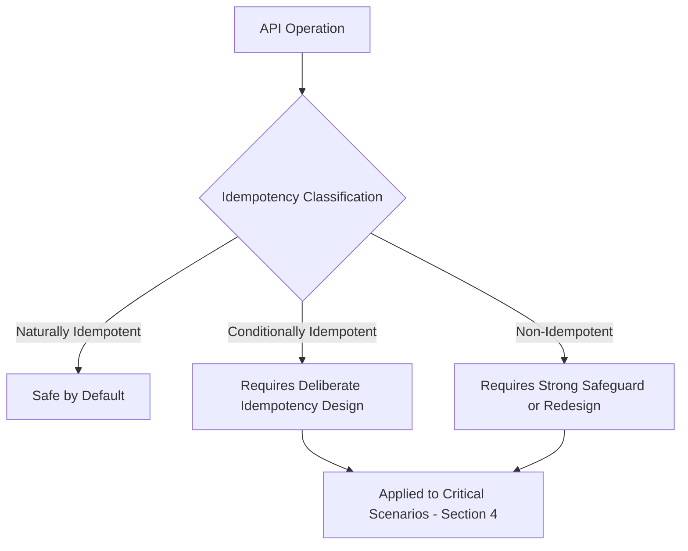
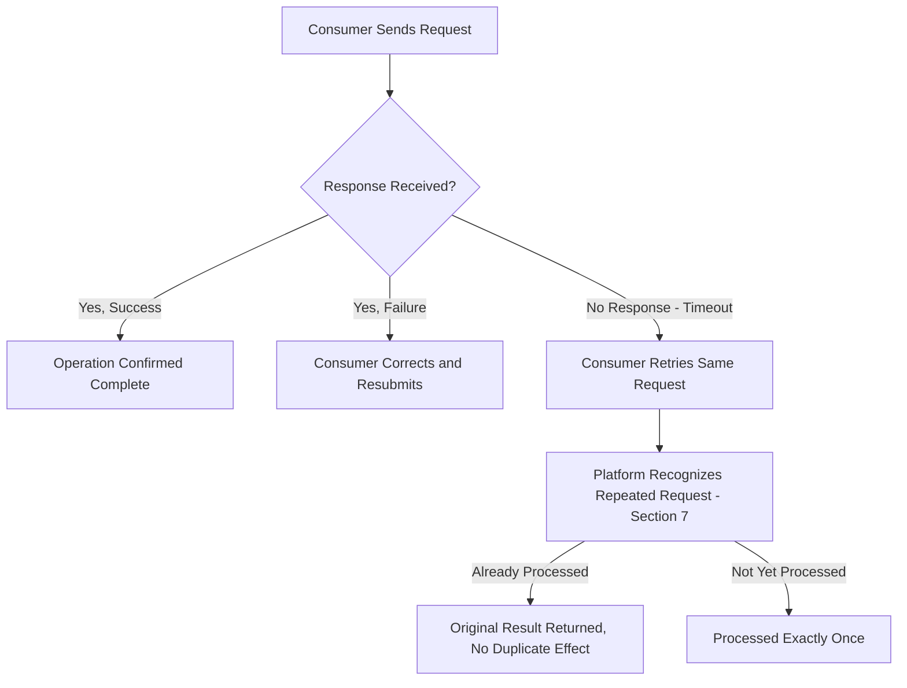
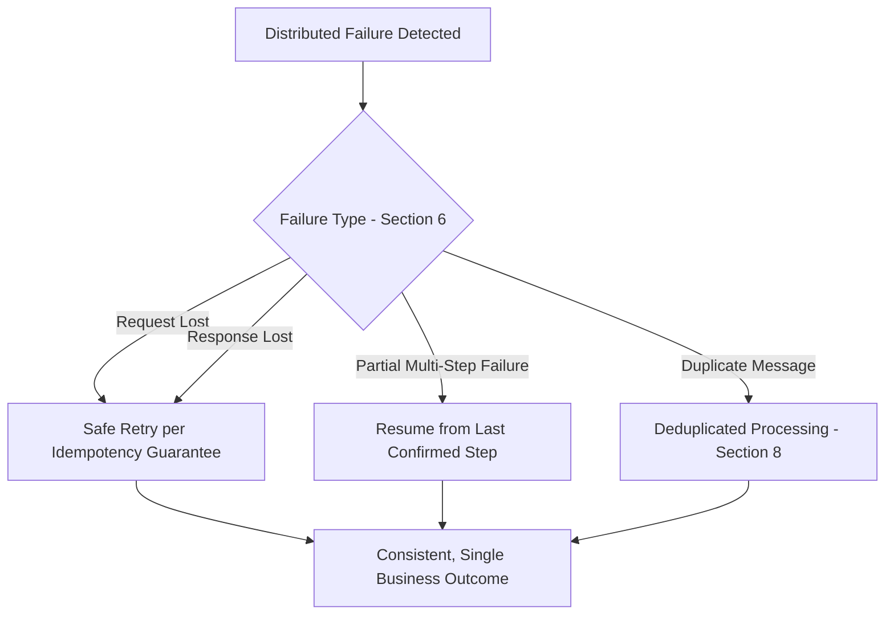
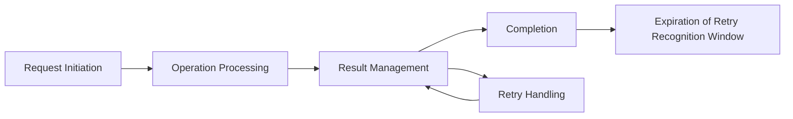
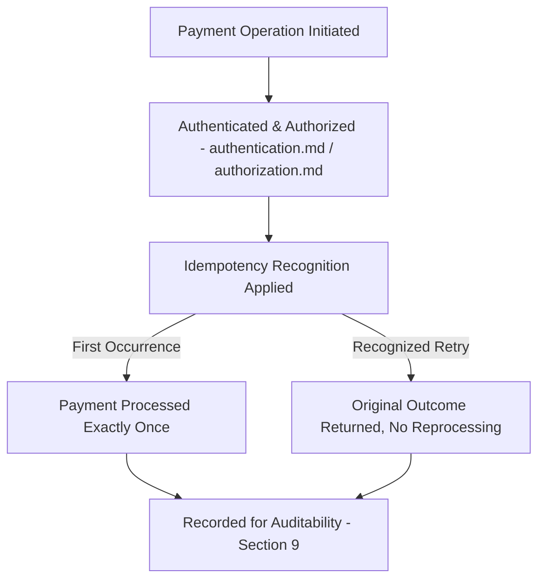
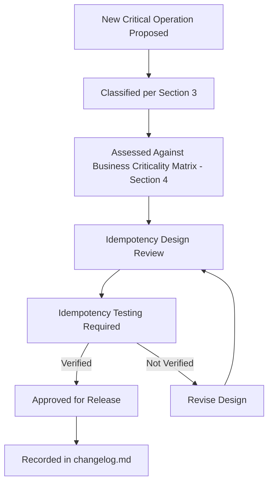

# Enterprise API Idempotency Strategy

## 1. Document Purpose

This document establishes the Enterprise API Idempotency Strategy for **StackLeo Tech Store**: how the platform ensures repeated requests do not produce unintended duplicate business effects.

- **Purpose of Idempotency** — to guarantee that a consumer can safely retry a request without risk of an unintended duplicate outcome, such as being charged twice or placing the same order twice.
- **Relationship with Reliability** — idempotency is a foundational contributor to the Reliability and Resilience quality attributes defined in `api-overview.md` (Section 7) and `error-handling.md` (Section 2); safe retry is the primary tool for recovering from failure without manual intervention.
- **Relationship with Distributed Systems** — as `03_System_Design/service-architecture.md` evolves toward a more distributed operational model, idempotency becomes essential for tolerating the network uncertainty inherent in distributed communication, per Section 6.
- **Relationship with Transaction Safety** — idempotency directly protects the consistency of critical aggregates defined in `resource-model.md` (Section 4), particularly Order and Payment.
- **Relationship with API Resilience** — idempotency is the mechanism that makes the Retry Strategy defined in `error-handling.md` (Section 7) actually safe to apply.

## 2. Idempotency Philosophy

- **Safe Retries** — a consumer facing uncertainty about whether a request succeeded should always be able to retry it without fear of a duplicate effect.
- **Predictable Operations** — an idempotent operation produces the same end state whether performed once or many times, and this guarantee is documented and dependable.
- **Duplicate Prevention** — the platform actively guards against unintended repeated execution of the same business operation, rather than passively trusting consumers to avoid it.
- **Consumer Confidence** — consumers can build reliable integrations without needing complex, error-prone workarounds to avoid duplicate effects themselves.
- **Fault Tolerance** — idempotency allows the platform and its consumers to recover gracefully from network and processing failures rather than treating every uncertain outcome as a crisis.
- **Distributed System Reliability** — idempotency is treated as a first-class architectural concern, not an afterthought, in recognition that distributed communication can never fully eliminate uncertainty.

## 3. Idempotent vs Non-Idempotent Operations

| Operation Type | Business Meaning | Risk Level | Appropriate Handling |
|---|---|---|---|
| Naturally Idempotent Operations | Operations whose repeated execution inherently produces the same end state, such as retrieving a resource or setting a value to a specific state. | Low | No special safeguard required beyond standard request handling. |
| Conditionally Idempotent Operations | Operations that are idempotent only when specific conditions are deliberately engineered, such as creating a resource using a consumer-supplied, stable reference. | Moderate | Requires deliberate design, per Section 4, to guarantee safety. |
| Non-Idempotent Operations | Operations whose repeated execution inherently produces a different or additional effect each time, such as appending to a log or incrementing a counter. | High | Requires the strongest safeguards, or must be redesigned into a conditionally idempotent equivalent where the business operation is critical. |

### Idempotency Classification

| Classification | Example (Conceptual) | Default Safety Without Design |
|---|---|---|
| Naturally Idempotent | Retrieving an Order's current status | Safe by nature |
| Conditionally Idempotent | Placing an Order (checkout) | Unsafe unless deliberately engineered, per Section 4 |
| Non-Idempotent | Submitting a new Review | Unsafe; requires business-level duplicate handling |

*Diagram: Idempotent Operation Flow.*

## 4. Critical Business Scenarios

### Checkout

- **Prevent Duplicate Checkout Processing** — a consumer retrying a checkout request due to network uncertainty must not result in two separate orders being created from the same cart.
- **Maintain Order Consistency** — the Order Aggregate, per `resource-model.md` (Section 4), must reflect exactly one coherent outcome regardless of how many times the checkout request was transmitted.

### Payments

- **Prevent Duplicate Payment Attempts** — a consumer retrying a payment request must never result in a customer being charged more than once for the same transaction.
- **Transaction Safety** — the Payment Aggregate's financial state changes only through deliberate, safeguarded transitions, consistent with `04_Database/security-model.md`.
- **Financial Reliability** — payment idempotency is treated as the platform's single highest-priority reliability concern, given its direct financial and trust consequences.

### Orders

- **Duplicate Order Prevention** — beyond the checkout moment itself, any order-affecting operation (such as applying a discount) must be safe to retry without compounding its effect.
- **Order State Consistency** — retried operations against an Order never leave it in an ambiguous or internally inconsistent state.

### Inventory

- **Stock Reservation Safety** — reserving inventory for a pending order must not result in stock being reserved multiple times for what is actually a single customer intent.
- **Availability Consistency** — retried inventory operations must not cause available stock figures to drift from actual, accurate levels.

### Shipping

- **Duplicate Shipment Prevention** — a retried fulfillment request must not result in more than one physical shipment being created for the same order.
- **Logistics Reliability** — shipping idempotency protects both cost (avoiding duplicate courier engagement) and customer experience (avoiding duplicate deliveries).

### Business Criticality Matrix

| Scenario | Business Criticality | Consequence of Failure | Idempotency Priority |
|---|---|---|---|
| Checkout | Critical | Duplicate orders, customer confusion, inventory miscount | Highest |
| Payments | Critical | Duplicate charges, financial and trust damage | Highest |
| Orders (post-checkout operations) | High | Inconsistent order state | High |
| Inventory | High | Inaccurate stock, overselling or underselling | High |
| Shipping | High | Duplicate physical shipment, cost and customer impact | High |

## 5. Retry Strategy

- **Why Retries Happen** — consumers retry requests because they cannot always distinguish between a request that failed and one that succeeded but whose confirmation was lost, per Section 6.
- **Network Failures** — a request or its response may be lost in transit, leaving the consumer genuinely uncertain of the outcome.
- **Timeout Scenarios** — a consumer may time out waiting for a response even though the platform ultimately completed the operation successfully.
- **Client Retries** — consumers retry critical operations as a normal, expected part of building resilient integrations, per `error-handling.md` (Section 7).
- **Service Retries** — internal platform components retry calls to one another under equivalent uncertainty, per Section 6.
- **Safe Retry Principles** — a retry of a properly idempotent operation is always safe to perform; the platform's responsibility is to ensure this safety holds for every critical operation identified in Section 4.

### Retry Safety Matrix

| Operation Type | Safe to Retry Automatically? | Required Safeguard |
|---|---|---|
| Naturally Idempotent Operations | Yes | None beyond standard handling |
| Conditionally Idempotent Operations (properly designed) | Yes | Recognition of repeated intent, per Section 7 |
| Conditionally Idempotent Operations (not yet designed) | No | Must be redesigned before safe retry is possible |
| Non-Idempotent Operations | No | Requires business-level deduplication or redesign |
| Critical Scenarios (Checkout, Payments) | Yes, only with full idempotency design | Mandatory idempotency safeguard, per Section 4 |

*Diagram: Retry Handling Workflow.*

## 6. Distributed System Considerations

- **Network Uncertainty** — in any distributed interaction, a consumer cannot always determine with certainty whether a request reached the platform or whether its response was successfully returned.
- **Partial Failures** — a multi-step business operation (such as checkout, which touches Cart, Order, Inventory, and Payment) may fail partway through, requiring idempotency to safely resume or retry without duplicating already-completed steps.
- **Duplicate Messages** — as the platform's event model matures per `03_System_Design/event-flows.md`, message delivery mechanisms may redeliver the same message more than once, requiring consuming logic to remain idempotent.
- **Eventual Consistency** — where different parts of the platform reach a consistent state at different times, idempotency ensures repeated operations do not compound the temporary inconsistency.
- **Transaction Boundaries** — idempotency safeguards are applied at the boundary of each aggregate defined in `resource-model.md` (Section 4), ensuring a retried request cannot partially reapply across that boundary.
- **Recovery Strategies** — idempotency is a core enabler of the platform's broader recovery approach, allowing failed operations to be safely reattempted rather than requiring manual reconciliation.

### Distributed Failure Scenarios

| Scenario | Uncertainty Introduced | Idempotency's Role |
|---|---|---|
| Request Lost in Transit | Consumer does not know if the platform received the request | Safe retry produces the same outcome as if sent once |
| Response Lost in Transit | Consumer does not know if the operation succeeded | Safe retry returns the original result without reprocessing |
| Partial Multi-Step Failure | Some steps of a business operation completed, others did not | Retry safely resumes without duplicating completed steps |
| Duplicate Message Delivery | The same event or message is delivered more than once | Idempotent processing ensures a single effective outcome |
| Timeout Under Load | Consumer times out despite eventual platform success | Safe retry avoids compounding an already-successful operation |

*Diagram: Distributed Failure Recovery Flow.*

## 7. Idempotency Lifecycle

- **Request Initiation** — a consumer initiates a critical operation, conceptually associating it with a stable reference to its own intent.
- **Operation Processing** — the platform processes the operation, recognizing whether this specific intent has already been handled.
- **Result Management** — the outcome of a processed operation is retained long enough to be returned again if the same request is repeated.
- **Retry Handling** — a repeated request referencing the same intent is recognized and returns the original outcome rather than reprocessing, per Section 5.
- **Completion** — once an operation's outcome is durably established, further repeated requests consistently return that same outcome.
- **Expiration** — the window during which a repeated request is recognized as referring to the same original intent is bounded, consistent with the operation's realistic retry timeframe.

*Diagram forms part of the broader Idempotent Operation Flow (Section 3).*

## 8. Event-Driven Readiness

- **Event Processing** — as the platform's event model per `03_System_Design/event-flows.md` matures, each event handler is designed to process the same event safely even if delivered more than once.
- **Message Consumption** — consumers of asynchronous messages apply the same idempotency discipline as synchronous API consumers, per Section 6.
- **Background Jobs** — scheduled or triggered background processes are designed to be safely re-run without duplicating their effect if interrupted and restarted.
- **Asynchronous Workflows** — long-running operations, per `endpoint-design.md` (Section 8), apply idempotency at each discrete step, not only at the overall operation's boundary.
- **Future Microservices** — as `03_System_Design/service-architecture.md` decomposes further, idempotency becomes increasingly important at every inter-service boundary, not only at the consumer-facing API layer.

### Event Processing Considerations

| Consideration | Risk Without Idempotency | Mitigation |
|---|---|---|
| Duplicate Event Delivery | An event is processed more than once, compounding its effect | Idempotent event handler design |
| Out-of-Order Delivery | Events processed in an unexpected sequence produce inconsistent state | Idempotent, order-tolerant processing logic |
| Background Job Restart | An interrupted job re-runs and duplicates already-completed work | Idempotent job design tracking completed work |
| Long-Running Workflow Step Repetition | A retried workflow step duplicates a prior step's effect | Per-step idempotency within the workflow |

## 9. Security Considerations

- **Abuse Prevention** — idempotency safeguards are designed so they cannot themselves be exploited to probe for information about prior requests.
- **Replay Protection** — idempotency mechanisms are distinct from, and complementary to, replay attack protection; a legitimate retry is not the same as a malicious replay, and the platform's design distinguishes between them.
- **Sensitive Operations** — the most sensitive operations (Payments, per Section 4) receive the strongest idempotency guarantees, consistent with their elevated risk profile.
- **Authentication Relationship** — idempotency safeguards operate only in the context of an already-authenticated identity, per `authentication.md`; they are not a substitute for authentication or authorization controls.
- **Auditability** — every idempotent operation's original execution and any subsequent recognized retries are traceable, consistent with `04_Database/data-governance.md` (Section 3).

*Diagram: Payment Safety Architecture.*

## 10. Future Evolution

- **Payment Ecosystems** — as StackLeo integrates with additional payment providers, idempotency remains the consistent safeguard applied uniformly regardless of provider.
- **Marketplace Transactions** — the future Multi-Vendor Marketplace introduces multi-party transactions (commission settlement, split payments) requiring idempotency to extend across more complex transactional boundaries.
- **Global Commerce** — idempotency safeguards remain coherent as the platform expands into South Asia and global markets, potentially across multiple currencies and regions.
- **Event-Driven Architecture** — idempotency becomes increasingly central as the platform's internal communication model shifts further toward asynchronous, event-driven interaction, per Section 8.
- **Distributed Services** — as `03_System_Design/service-architecture.md` evolves, idempotency discipline extends to every new inter-service boundary introduced.
- **AI Transactions** — future AI-driven consumers initiating business operations on behalf of the platform or a consumer are held to the same idempotency-safe design as any other consumer.

## 11. Governance

- **Idempotency Ownership** — the API Architect owns the idempotency strategy's coherence, in partnership with the Payment Systems Architect for payment-specific safeguards.
- **Critical Operation Review** — any new operation classified as Critical or High business criticality, per Section 4, undergoes explicit idempotency design review before implementation.
- **Documentation Standards** — this document follows the enterprise Markdown conventions established across this repository.
- **Testing Requirements** — idempotency guarantees for critical operations are explicitly verified, not merely assumed, before release.
- **Change Management** — material changes to idempotency strategy are recorded in `00_Project_Overview/changelog.md`.

### Governance Responsibilities

| Role | Responsibility |
|---|---|
| API Architect | Owns overall idempotency strategy coherence. |
| Payment Systems Architect | Owns idempotency safeguards for payment-critical operations, per Section 4. |
| Backend Engineering Lead | Ensures implementations conform to approved idempotency design. |
| QA Lead | Validates idempotency guarantees are tested and verified for critical operations. |
| Security Lead | Reviews idempotency mechanisms for abuse and replay resistance, per Section 9. |

*Diagram: Idempotency Governance Lifecycle.*

## 12. Anti-Patterns

| Anti-Pattern | Description | Why It Should Be Avoided |
|---|---|---|
| Ignoring Duplicate Requests | Treating every incoming request as a new, independent operation regardless of prior identical attempts. | Directly causes duplicate business effects for critical operations, undermining Duplicate Prevention (Section 2). |
| Unsafe Retries | Retrying non-idempotent operations without any safeguard. | Compounds failures rather than resolving them, undermining Fault Tolerance. |
| No Transaction Protection | Allowing a multi-step critical operation to lack any consistency safeguard across its steps. | Risks partial, inconsistent outcomes for high-criticality scenarios like Checkout and Payments, per Section 4. |
| Inconsistent Behavior | Applying idempotency safeguards to some operations of a given type but not others. | Undermines Predictable Operations and consumer trust in the platform's guarantees. |
| Applying Idempotency Everywhere Without Need | Adding idempotency safeguards to naturally low-risk, non-critical operations indiscriminately. | Adds unnecessary complexity and cost without proportional business benefit; conflicts with Simplicity principles in `api-standards.md`. |
| No Failure Recovery Strategy | Providing idempotency safeguards without a coherent approach to recovering from the failures they are meant to tolerate. | Leaves the platform only partially resilient, undermining the broader purpose of Section 6. |
| Missing Audit Trail | Failing to record idempotent operations and their recognized retries. | Undermines Auditability (Section 9) and complicates investigation of disputed transactions. |

### Anti-Pattern Summary

| Anti-Pattern | Primary Risk | Mitigating Principle |
|---|---|---|
| Ignoring Duplicate Requests | Duplicate business effects | Duplicate Prevention |
| Unsafe Retries | Compounded failures | Fault Tolerance |
| No Transaction Protection | Inconsistent critical outcomes | Business Criticality Matrix (Section 4) |
| Inconsistent Behavior | Eroded consumer trust | Predictable Operations |
| Applying Idempotency Everywhere Without Need | Unnecessary complexity | Business Criticality Matrix (Section 4) |
| No Failure Recovery Strategy | Incomplete resilience | Distributed System Reliability |
| Missing Audit Trail | Poor dispute investigability | Auditability |

## 13. Document Information

| Property | Value |
|----------|-------|
| Document | idempotency.md |
| Version | 1.0.0 |
| Status | Active |
| Maintained By | StackLeo |
| Last Updated | 2026-07-17 |

---

© StackLeo. All Rights Reserved.
