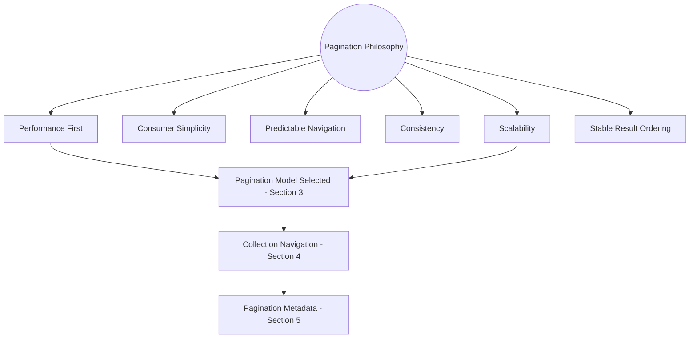
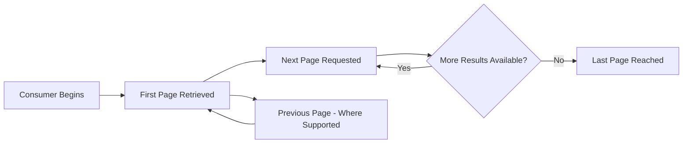
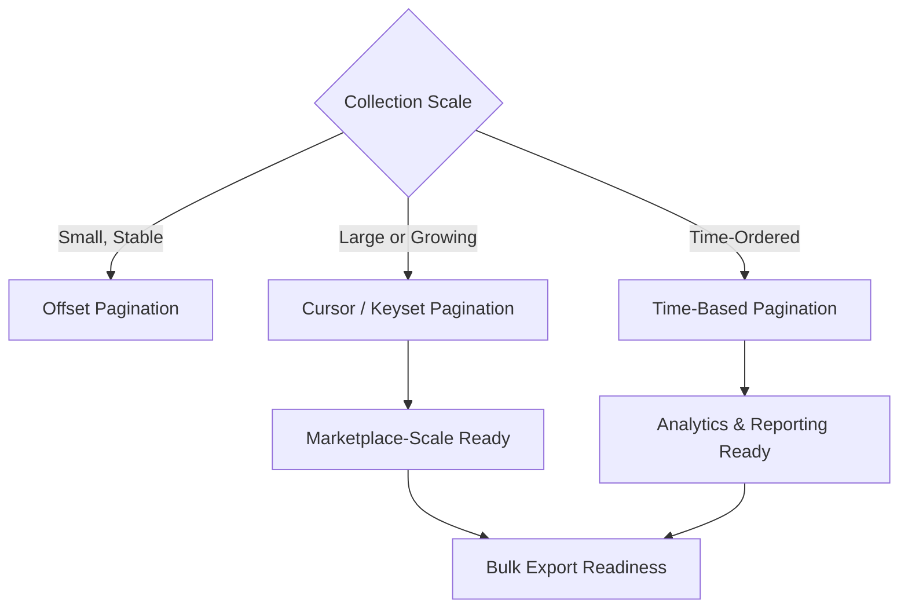
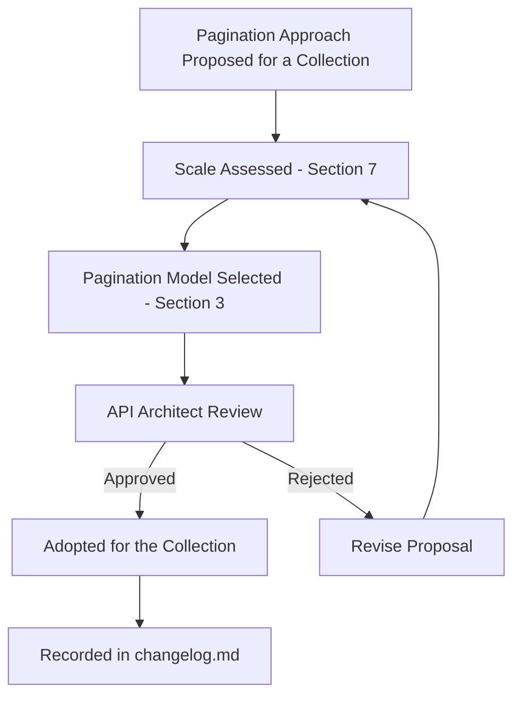
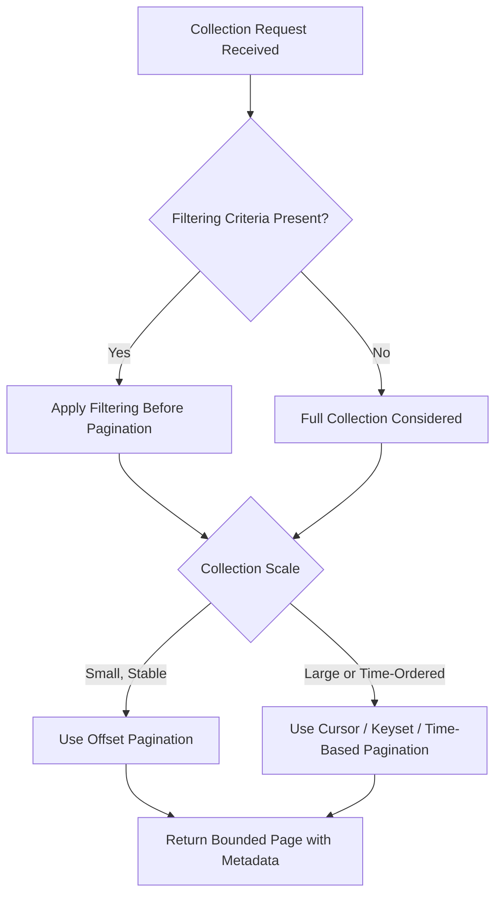

# Enterprise API Pagination Strategy

## 1. Document Purpose

This document establishes the Enterprise API Pagination Strategy for **StackLeo Tech Store**: the principles governing how APIs return large collections of resources without overwhelming consumers or the platform itself.

- **Purpose of Pagination** — to allow consumers to retrieve collections of any size through a bounded, manageable series of interactions rather than a single unbounded response.
- **Relationship with API Performance** — pagination is a direct application of the Performance quality attribute defined in `api-overview.md` (Section 7); unbounded collections are one of the most common sources of API performance degradation.
- **Relationship with Scalability** — pagination protects the platform as data volume grows, consistent with `03_System_Design/scalability-strategy.md` and `04_Database/partitioning-strategy.md`.
- **Relationship with User Experience** — pagination directly shapes how customers browse the Product Catalog and how staff navigate Orders and Admin data, per `02_Product/user-journeys.md`.
- **Relationship with API Consistency** — this document elaborates the Pagination Readiness principle established in `api-standards.md` (Section 6) into a dedicated strategy.

## 2. Pagination Philosophy

- **Performance First** — every collection-returning API is designed from inception to avoid returning unbounded results, regardless of current data volume.
- **Consumer Simplicity** — pagination is as easy to use correctly as it is to use incorrectly; the simplest correct usage pattern is the default.
- **Predictable Navigation** — a consumer who understands how to navigate one collection can navigate any other collection identically.
- **Consistency** — pagination behaves identically across every domain and resource type, per `api-standards.md` (Section 6).
- **Scalability** — pagination strategy is chosen to remain efficient as collection size grows from hundreds to millions of records, per Section 7.
- **Stable Result Ordering** — a consumer paginating through a collection receives a coherent, non-duplicating, non-skipping view of that collection, per Section 6.
- **Future Evolution** — pagination is designed to extend naturally to future interaction models (GraphQL, event streams) without conceptual rework, per Section 9.

*Diagram: Pagination Strategy Overview.*

## 3. Pagination Models

| Model | Concept | Advantages | Trade-offs | Appropriate Business Scenarios | Scalability Considerations |
|---|---|---|---|---|---|
| Offset Pagination | Results are navigated by skipping a specified number of records from the start of the collection. | Simple to understand; supports arbitrary page jumping. | Performance degrades as offset grows deep into a large collection; results can shift if the underlying data changes mid-navigation. | A customer's own order history; small, relatively stable admin lists. | Poor at very large scale; acceptable for bounded, modestly sized collections. |
| Cursor Pagination | Results are navigated using an opaque marker referencing a specific position in the collection. | Consistent performance regardless of position within the collection; resilient to concurrent data changes. | Does not support arbitrary page jumping; less intuitive for consumers expecting page numbers. | Browsing the full Product Catalog; any large or frequently changing collection. | Strong; performance remains stable as collection size grows. |
| Keyset Pagination | Results are navigated using the last seen record's sort key as the basis for retrieving the next set. | Highly efficient at any depth; naturally resilient to insertions and deletions elsewhere in the collection. | Requires a well-defined, stable sort key; less flexible for arbitrary re-sorting mid-navigation. | Large, append-heavy collections such as Order history at platform scale or Audit Records. | Strong; among the most scalable approaches for very large collections. |
| Time-Based Pagination | Results are navigated using a time boundary as the position marker. | Intuitive for naturally time-ordered data; simplifies incremental synchronization scenarios. | Less suitable for collections without a meaningful, unique time ordering. | Notification history; activity or audit feeds; incremental data synchronization for integrations. | Strong for time-ordered data; depends on sufficient timestamp precision and uniqueness. |
| Hybrid Strategies | Combining elements of the above, such as cursor pagination with optional offset-like jump capability for smaller collections. | Balances consumer convenience with scalability where collection size varies significantly by context. | Adds conceptual and implementation complexity; requires clear governance on when each mode applies. | A platform serving both small (Customer Dashboard) and very large (Product Catalog, Marketplace) collections through consistent conventions. | Variable; depends on how well the hybrid boundaries are defined and governed. |

### Pagination Model Comparison

| Model | Deep-Page Performance | Resilience to Concurrent Change | Supports Arbitrary Page Jump | Best Fit |
|---|---|---|---|---|
| Offset Pagination | Poor | Low | Yes | Small, stable collections |
| Cursor Pagination | Strong | High | No | Large or frequently changing collections |
| Keyset Pagination | Strong | High | No | Very large, append-heavy collections |
| Time-Based Pagination | Strong (for time-ordered data) | High | Limited | Time-ordered feeds, sync scenarios |
| Hybrid Strategies | Variable | Variable | Context-dependent | Platforms with mixed collection scale |

## 4. Collection Navigation

- **First Page** — every paginated collection provides a consistent way for a consumer to begin navigation from the start.
- **Next Page** — a consumer can retrieve the subsequent segment of results relative to their current position.
- **Previous Page** — where the chosen pagination model supports it, a consumer can retrieve the preceding segment of results.
- **Last Page** — where meaningful and efficient to provide, a consumer can determine or reach the end of a collection.
- **Sequential Navigation** — the default and most common navigation pattern, moving through a collection one segment at a time.
- **Infinite Scrolling Readiness** — pagination is structured to support a continuous, incremental consumption pattern suited to modern browsing interfaces, without requiring the consumer to reason about discrete page numbers.

### Collection Navigation Summary

| Navigation Capability | Offset Pagination | Cursor / Keyset Pagination |
|---|---|---|
| First Page | Natural, trivial | Natural, trivial |
| Next Page | Supported | Supported |
| Previous Page | Supported | Supported where cursors are bidirectional |
| Last Page / Jump-to-Page | Natural | Difficult or unsupported by design |
| Infinite Scrolling Fit | Adequate for shallow use | Strong fit |

*Diagram: Collection Navigation Flow.*

## 5. Pagination Metadata

- **Collection Size** — an indication of the collection's overall size, where it can be determined without disproportionate cost.
- **Page Information** — an indication of the consumer's current position within the collection's navigation.
- **Navigation Information** — the means by which a consumer determines how to retrieve the next (and where applicable, previous) segment of results.
- **Continuation Indicators** — a clear signal of whether further results remain to be retrieved.
- **Processing Metadata** — contextual information about how the collection response was generated, consistent with `request-response.md` (Section 5).
- **Traceability Metadata** — correlation and request identification information, consistent with `request-response.md` (Section 9), supporting diagnosis of pagination-related issues.

### Metadata Classification

| Metadata Type | Purpose | Present In |
|---|---|---|
| Collection Size | Communicates overall scope of the collection | Collection responses where determinable |
| Page Information | Communicates current navigation position | Every paginated response |
| Navigation Information | Enables retrieval of adjacent segments | Every paginated response |
| Continuation Indicators | Signals whether more results remain | Every paginated response |
| Processing Metadata | Communicates operational context of the response | Collection responses, per `request-response.md` |
| Traceability Metadata | Supports diagnosis and correlation | Every response, per `request-response.md` |

## 6. Sorting & Filtering Integration

- **Stable Sorting** — a collection's ordering remains consistent across paginated requests, so a consumer's navigation reflects a coherent traversal rather than a shifting one.
- **Filtering Before Pagination** — filtering criteria are applied to determine the qualifying collection before pagination divides it into segments, ensuring pagination operates on the correct, intended result set.
- **Search Integration** — where a collection is the result of a search operation, pagination applies to the ranked or matched result set consistently with the same principles as any other collection.
- **Deterministic Ordering** — the sort criteria applied to a collection are sufficiently well-defined that repeated navigation produces the same ordering, avoiding ambiguity when multiple records share a sort value.
- **Duplicate Prevention** — pagination is designed so a consumer traversing an entire collection does not encounter the same record more than once under normal conditions.
- **Missing Record Prevention** — pagination is designed so a consumer traversing an entire collection does not skip records due to concurrent changes to the underlying data.

## 7. Large Dataset Strategy

- **Millions of Records** — pagination models capable of maintaining consistent performance regardless of collection depth (Cursor, Keyset) are favored as any given collection's scale grows toward this range.
- **Marketplace Scale** — the future Multi-Vendor Marketplace model is expected to multiply Product and Order volume substantially; pagination strategy is chosen with this future scale in mind, not only current volume.
- **Product Catalog Growth** — the Product Catalog is one of the platform's fastest-growing collections and a primary candidate for scalable pagination models.
- **Order History** — as StackLeo's customer base and operating history grow, Order collections benefit from append-friendly pagination models such as Keyset or Time-Based approaches.
- **Analytics Data** — aggregated business and operational data, per `04_Database/data-model.md` (Analytics domain), often benefits from time-based navigation reflecting its naturally time-ordered nature.
- **Reporting** — reporting scenarios often require complete, consistent traversal of a large collection, favoring models resilient to concurrent change.
- **Export Readiness** — pagination strategy anticipates future bulk export capability, where a consumer needs to reliably retrieve an entire large collection over an extended interaction.

*Diagram: Large Dataset Navigation Architecture.*

## 8. Performance Considerations

- **Response Time** — pagination bounds the amount of data processed and transmitted per interaction, keeping response time predictable regardless of total collection size.
- **Resource Utilization** — bounded result sets reduce the computational and memory burden placed on the platform per request.
- **Database Efficiency** — pagination model selection is coordinated with the indexing and partitioning strategies defined in `04_Database/indexing-strategy.md` and `04_Database/partitioning-strategy.md` to ensure efficient underlying data retrieval.
- **Caching Readiness** — pagination is structured to support caching of frequently requested segments, consistent with `api-strategy.md` (Section 7).
- **Network Efficiency** — bounded response sizes reduce bandwidth consumption, particularly relevant for future mobile application consumers on constrained connections.
- **Consumer Performance** — bounded, predictable response sizes allow consumer applications to render and process results efficiently, supporting a responsive user experience.

### Performance Consideration Matrix

| Consideration | Primary Beneficiary | Related Document |
|---|---|---|
| Response Time | All consumers | `02_Product/non-functional-requirements.md` |
| Resource Utilization | Platform operations | `03_System_Design/scalability-strategy.md` |
| Database Efficiency | Platform operations | `04_Database/indexing-strategy.md` |
| Caching Readiness | All consumers | `api-strategy.md` |
| Network Efficiency | Mobile and constrained consumers | `02_Product/non-functional-requirements.md` |
| Consumer Performance | Frontend and mobile consumers | `08_Frontend` (future) |

## 9. Future Evolution

- **GraphQL Connections** — the collection and cursor concepts defined here map directly onto a future complementary graph-based query approach's connection pattern.
- **Event Streams** — the concept of a continuation indicator (Section 5) extends naturally to a future continuous event stream's position-tracking needs.
- **Live Data** — pagination principles anticipate a future need to reconcile paginated, point-in-time views with continuously updating data.
- **AI Consumers** — machine-driven consumers benefit from the same predictable, stable navigation as human-facing ones, particularly for large-scale data retrieval.
- **Marketplace APIs** — vendor-facing collections (products, orders, commissions) apply the same pagination discipline established for existing domains.
- **Global Expansion** — pagination remains consistent and performant as collection volume grows across South Asia and global markets.
- **Multi-region** — pagination strategy accounts for the future need to navigate collections that may span multiple regional data locations.

## 10. Governance

- **Pagination Ownership** — the API Architect owns the pagination strategy's coherence, in partnership with the Database Architect for underlying data retrieval efficiency.
- **Review Process** — proposed pagination approaches for a new collection are reviewed against this document's principles before implementation.
- **Documentation Standards** — this document follows the enterprise Markdown conventions established across this repository.
- **Change Management** — material changes to pagination strategy are recorded in `00_Project_Overview/changelog.md`.
- **Versioning** — this document follows Semantic Versioning per `00_Project_Overview/changelog.md`; changes affecting existing consumer navigation are governed additionally by `versioning.md`.

### Governance Responsibilities

| Role | Responsibility |
|---|---|
| API Architect | Owns overall pagination strategy coherence. |
| Database Architect | Ensures pagination models align with underlying data retrieval efficiency. |
| Backend Engineering Lead | Ensures implementations conform to approved pagination models. |
| Performance Engineer | Validates pagination behavior against performance expectations. |
| Technical Writer | Maintains pagination documentation consistency. |

*Diagram: Pagination Governance Lifecycle.*

## 11. Anti-Patterns

| Anti-Pattern | Description | Why It Should Be Avoided |
|---|---|---|
| Unbounded Collections | Returning an entire collection without any pagination at all. | Directly violates Performance First (Section 2) and risks severe platform and consumer performance degradation as data grows. |
| Inconsistent Ordering | Allowing a collection's order to vary unpredictably between paginated requests. | Produces duplicate or missing records during traversal, undermining Stable Result Ordering. |
| Duplicate Results | A consumer encountering the same record more than once while navigating a collection. | Confuses consumers and undermines trust in the pagination mechanism, per Section 6. |
| Missing Records | A consumer failing to encounter a record that should have appeared during navigation. | Produces incomplete data views, which is especially damaging for reporting and export scenarios. |
| Expensive Page Navigation | Using a pagination model whose cost grows significantly with navigation depth. | Degrades performance precisely where it matters most — large collections — undermining Scalability. |
| Pagination Before Filtering | Applying pagination to an unfiltered collection and only filtering within each retrieved page. | Produces incorrect, incomplete filtered results and inconsistent page sizes, violating Section 6. |
| No Metadata | Returning paginated results without sufficient navigation or continuation information. | Leaves consumers unable to reliably navigate or determine when a traversal is complete, undermining Consumer Simplicity. |
| Consumer Confusion | Applying inconsistent pagination conventions across different collections. | Forces consumers to relearn navigation per resource, undermining Predictable Navigation and Consistency. |

### Pagination Anti-Pattern Summary

| Anti-Pattern | Primary Risk | Mitigating Principle |
|---|---|---|
| Unbounded Collections | Severe performance degradation | Performance First |
| Inconsistent Ordering | Duplicate or missing records | Stable Result Ordering |
| Duplicate Results | Consumer confusion, data inaccuracy | Duplicate Prevention |
| Missing Records | Incomplete data views | Missing Record Prevention |
| Expensive Page Navigation | Poor scalability at depth | Scalability |
| Pagination Before Filtering | Incorrect filtered results | Filtering Before Pagination |
| No Metadata | Unreliable navigation | Pagination Metadata |
| Consumer Confusion | Increased integration cost | Consistency, Predictable Navigation |

*Diagram: Pagination Decision Framework.*

## 12. Document Information

| Property | Value |
|----------|-------|
| Document | pagination.md |
| Version | 1.0.0 |
| Status | Active |
| Maintained By | StackLeo |
| Last Updated | 2026-07-17 |

---

© StackLeo. All Rights Reserved.
