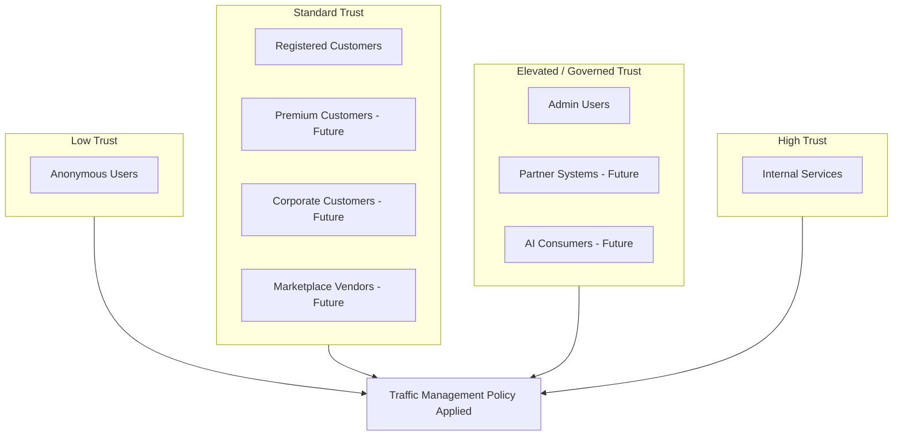
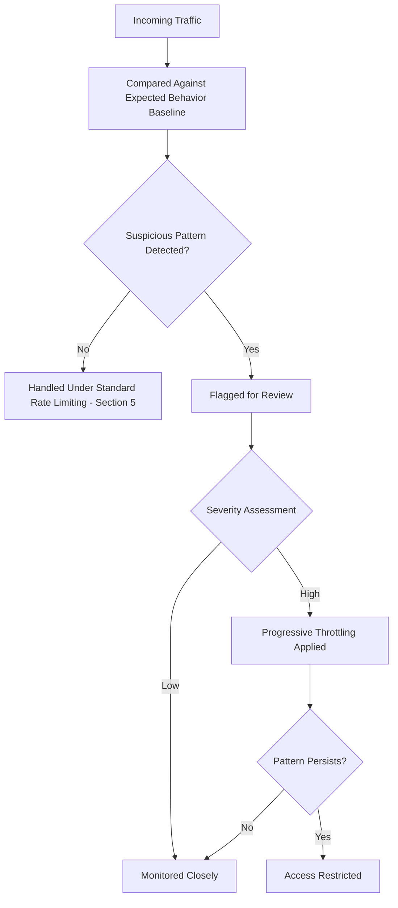
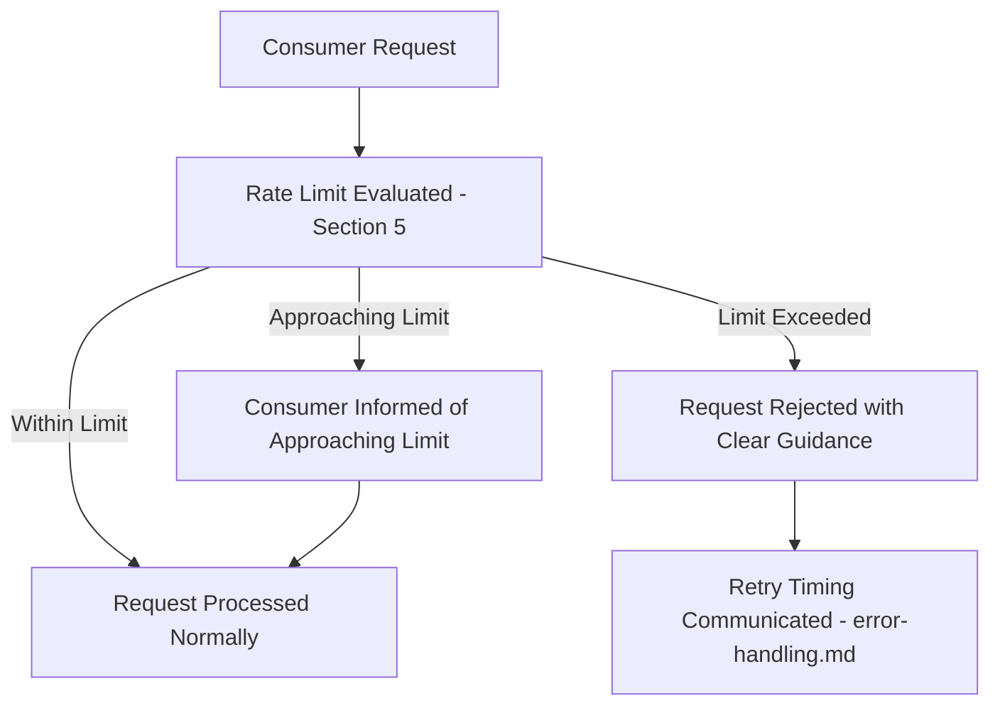
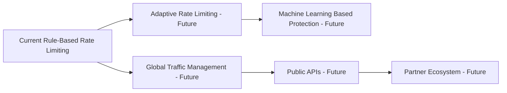
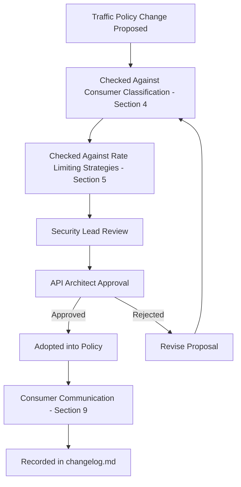

# Enterprise API Rate Limiting and Traffic Management Strategy

## 1. Document Purpose

This document establishes the Enterprise API Rate Limiting and Traffic Management Strategy for **StackLeo Tech Store**: how the platform governs consumption of its API surface to remain stable, fair, and available under any traffic condition.

- **Purpose of Rate Limiting** — to protect the platform's shared capacity from being degraded or exhausted by any single consumer, whether through legitimate high demand or illegitimate abuse.
- **Relationship with API Reliability** — traffic management is a direct expression of the Reliability and Resilience quality attributes defined in `api-overview.md` (Section 7) and `error-handling.md` (Section 2).
- **Relationship with Security** — rate limiting is a core defensive control against abuse patterns such as credential attacks and scraping, complementing the identity and access controls in `authentication.md` and `authorization.md`, per Section 7.
- **Relationship with Scalability** — traffic management works alongside the horizontal scaling strategy in `03_System_Design/scalability-strategy.md`, ensuring capacity is protected even while it grows.
- **Relationship with Consumer Experience** — rate limiting exists to protect the experience of all consumers collectively; Section 9 addresses how it is communicated so it does not itself become a source of consumer frustration.

## 2. Rate Limiting Philosophy

- **Protect the Platform** — the platform's shared capacity is treated as a finite resource that must be defended against any single consumer's excessive demand.
- **Fair Resource Usage** — no consumer's usage should degrade the experience of any other consumer, regardless of relative traffic volume.
- **Availability Preservation** — traffic management exists first and foremost to preserve the platform's availability for legitimate use, per `03_System_Design/quality-attributes.md`.
- **Abuse Prevention** — rate limiting is a primary defense against automated and malicious traffic patterns, per Section 7.
- **Consumer Experience** — limits are set and communicated in a way that legitimate consumers rarely, if ever, notice them.
- **Predictable Behavior** — a consumer can reliably anticipate how the platform will respond as their usage approaches a limit.
- **Business Alignment** — traffic management priorities reflect genuine business priority (Section 5), not a uniform, undifferentiated policy applied blindly to every consumer.

## 3. Traffic Management Concepts

| Concept | Purpose | Business Impact | Appropriate Usage |
|---|---|---|---|
| Rate Limiting | Bounds the number of requests a consumer may make within a defined period. | Prevents any single consumer from consuming disproportionate platform capacity. | Applied broadly across all consumer-facing API interaction. |
| Throttling | Deliberately slows, rather than rejects, requests once a consumer approaches a limit. | Smooths demand rather than abruptly cutting off legitimate but heavy usage. | Applied where graceful degradation is preferable to hard rejection. |
| Quotas | Bounds total consumption over a longer period (e.g., daily or monthly). | Supports predictable capacity planning and tiered consumer agreements. | Applied to partner, corporate, and future marketplace vendor consumers. |
| Burst Control | Allows short-term spikes above the steady-state limit within defined bounds. | Accommodates legitimate, naturally bursty consumer behavior without penalizing it. | Applied to interactive, consumer-facing traffic such as browsing behavior. |
| Traffic Shaping | Actively manages the pattern and timing of traffic to smooth demand across time. | Reduces the likelihood of demand spikes causing platform-wide degradation. | Applied at the platform level during anticipated high-demand periods, per Section 8. |
| Back Pressure | Signals to a consumer that the platform is approaching capacity, encouraging voluntary demand reduction. | Enables graceful, cooperative degradation rather than abrupt failure. | Applied as a complementary signal alongside hard limits during sustained high load. |

### Rate Limiting Strategy Comparison

| Strategy | Advantage | Trade-off |
|---|---|---|
| User-Based Limits | Reflects genuine individual consumer behavior. | Requires reliable identity, per `authentication.md`. |
| Application-Based Limits | Protects the platform from a single integrating application regardless of end-user count. | May not reflect fairness across many end-users sharing one application. |
| IP-Based Limits | Useful first line of defense against anonymous or unauthenticated abuse. | Imprecise for consumers sharing network infrastructure; easily circumvented by a determined actor. |
| Resource-Based Limits | Protects specific high-cost resources or operations disproportionately. | Requires ongoing assessment of which resources carry elevated cost. |
| Operation-Based Limits | Differentiates cost-sensitive operations (e.g., search) from lightweight ones. | Adds policy complexity requiring careful business alignment. |
| Business Priority Limits | Directly reflects the business value of different consumer classes, per Section 4. | Requires clear, governed classification to remain fair and defensible. |

## 4. Consumer Classification

| Consumer Group | Trust Level | Expected Usage | Protection Requirements |
|---|---|---|---|
| Anonymous Users | Low | Browsing, search, unauthenticated catalog access. | Strictest limits; primary target of abuse prevention, per Section 7. |
| Registered Customers | Standard | Full customer journey — browsing, cart, checkout, account management. | Balanced limits supporting normal shopping behavior without friction. |
| Premium Customers (Future) | Standard, elevated | Same as Registered Customers, potentially with expanded usage patterns. | Generous limits reflecting their elevated business value. |
| Admin Users | Elevated, trusted | Operational and administrative platform management. | Limits calibrated to legitimate operational bulk activity, not customer-scale patterns. |
| Corporate Customers (Future) | Standard, organizationally scoped | Bulk ordering and account management. | Quota-based limits reflecting agreed organizational usage. |
| Partner Systems (Future) | Medium, contractually scoped | Programmatic, agreement-based integration. | Quota and rate limits reflecting the specific partnership agreement. |
| Internal Services | High, platform-trusted | Continuous, high-volume service-to-service interaction. | Minimal restriction relative to external consumers, governed internally. |
| Marketplace Vendors (Future) | Standard, contractually scoped | Product and order management at vendor scale. | Limits calibrated to legitimate vendor operational volume. |
| AI Consumers (Future) | Medium, governed | Programmatic, potentially high-frequency data access. | Limits governed by future AI access policy, reflecting both trust and cost. |

### Traffic Consumer Classification

| Consumer Group | Default Limit Posture | Escalation Path |
|---|---|---|
| Anonymous Users | Strict | May register to receive standard limits |
| Registered Customers | Standard | May be elevated for verified premium status (future) |
| Premium Customers (Future) | Elevated | Governed by future premium agreement |
| Admin Users | Operational-scale | Governed by internal role assignment |
| Corporate Customers (Future) | Quota-based | Governed by corporate agreement terms |
| Partner Systems (Future) | Quota-based | Governed by partner agreement terms |
| Internal Services | Minimal restriction | Governed by internal service registration |
| Marketplace Vendors (Future) | Quota-based | Governed by vendor onboarding agreement |
| AI Consumers (Future) | Governed | Governed by future AI access policy |

*Diagram: Consumer Traffic Classification Model.*

## 5. Rate Limiting Strategies

- **User-Based Limits** — bound consumption per authenticated identity, reflecting the natural behavior of a single individual consumer.
- **Application-Based Limits** — bound consumption per integrating client application, appropriate where many end-users share one integration.
- **IP-Based Limits** — bound consumption by network origin, most useful as a coarse first defense for unauthenticated traffic.
- **Resource-Based Limits** — bound consumption of specific resources known to carry higher retrieval or processing cost.
- **Operation-Based Limits** — bound consumption differently across operation types, reflecting that not all API interactions carry equal cost.
- **Business Priority Limits** — bound consumption according to the consumer classification defined in Section 4, ensuring higher-value or higher-trust consumers are not disadvantaged by uniform policy.

*Advantages and trade-offs for each strategy are detailed in the Rate Limiting Strategy Comparison table in Section 3.*

## 6. API Protection Scenarios

| Scenario | Protection Emphasis |
|---|---|
| Authentication Operations | Strict limits; primary target for credential attacks, per Section 7. |
| Product Search | Resource-based limits reflecting the higher computational cost of search relative to simple retrieval. |
| Product Catalog | Generous limits supporting natural browsing behavior; cacheable, per `pagination.md` and `api-strategy.md`. |
| Cart Operations | Balanced limits supporting normal interactive shopping behavior without excessive friction. |
| Order Processing | Protected by both rate limiting and idempotency safeguards, per `idempotency.md`, given its business criticality. |
| Payment Operations | Among the strictest limits; high business sensitivity and a common target for abuse. |
| Reviews | Moderate limits; protects against review manipulation or spam. |
| Reports | Resource-based limits reflecting the potentially high computational cost of aggregation, per `04_Database/data-model.md` (Analytics domain). |
| Admin Operations | Limits calibrated to legitimate operational bulk activity, distinct from customer-facing patterns. |

### API Protection Matrix

| Scenario | Primary Limiting Strategy | Business Criticality |
|---|---|---|
| Authentication Operations | User-Based, IP-Based | Critical (abuse target) |
| Product Search | Resource-Based, Operation-Based | High |
| Product Catalog | User-Based (generous) | High |
| Cart Operations | User-Based | High |
| Order Processing | User-Based, Business Priority | Critical |
| Payment Operations | User-Based, Resource-Based | Critical |
| Reviews | User-Based | Medium |
| Reports | Resource-Based | Medium |
| Admin Operations | User-Based (operational scale) | High |

## 7. Abuse Prevention

- **Automated Abuse** — traffic patterns indicating non-human, scripted interaction inconsistent with genuine consumer behavior.
- **Excessive Requests** — a volume of requests from a single source clearly exceeding any legitimate business need.
- **Credential Attacks** — repeated authentication attempts characteristic of credential guessing or stuffing, addressed jointly with `authentication.md` (Section 2).
- **Scraping Risks** — systematic, bulk extraction of catalog or business data inconsistent with normal browsing behavior.
- **Resource Exhaustion** — traffic deliberately or incidentally targeting the platform's most computationally expensive operations.
- **Suspicious Traffic Patterns** — deviations from expected consumer behavior that merit investigation even before a hard limit is breached.

### Abuse Prevention Matrix

| Abuse Pattern | Detection Signal | Response Posture |
|---|---|---|
| Automated Abuse | Non-human request timing and pattern | Progressive throttling, then blocking |
| Excessive Requests | Volume clearly exceeding legitimate use | Rate limit enforcement, per Section 5 |
| Credential Attacks | Repeated failed authentication attempts | Strict limiting on Authentication Operations, per Section 6 |
| Scraping Risks | Systematic, exhaustive catalog traversal | Resource-based limiting and pattern monitoring |
| Resource Exhaustion | Concentrated load on expensive operations | Operation-based limiting, per Section 5 |
| Suspicious Traffic Patterns | Deviation from expected consumer behavior baseline | Flagged for investigation before hard action taken |

*Diagram: Abuse Detection Workflow.*

## 8. High Availability Considerations

- **Traffic Spikes** — the platform anticipates and absorbs short-term, legitimate demand surges without service degradation, per Burst Control (Section 3).
- **Flash Sales** — promotional events, per `01_Business/pricing-strategy.md`, are anticipated as deliberate, planned high-demand periods requiring proactive traffic management coordination.
- **Seasonal Events** — recurring high-demand periods (such as major shopping occasions relevant to the Bangladesh market) are planned for in advance rather than reacted to.
- **Marketplace Growth** — the future Multi-Vendor Marketplace model is expected to substantially increase both consumer count and traffic diversity; traffic management strategy anticipates this scale.
- **Graceful Degradation** — under sustained extreme load, the platform prioritizes protecting core, business-critical capability (such as checkout) over less critical capability.
- **Service Protection** — traffic management works in concert with `03_System_Design/scalability-strategy.md` to ensure protected capacity is preserved during periods of elevated demand.

### High Availability Considerations

| Scenario | Risk If Unmanaged | Mitigation Approach |
|---|---|---|
| Traffic Spikes | Service degradation from unexpected surges | Burst Control, per Section 3 |
| Flash Sales | Overwhelmed capacity during promotional peaks | Proactive Traffic Shaping ahead of planned events |
| Seasonal Events | Repeated, predictable degradation during known peak periods | Advance capacity and policy planning |
| Marketplace Growth | Traffic management strategy outgrown by scale | Designed for marketplace-scale from inception, per Section 4 |
| Sustained Extreme Load | Platform-wide failure | Graceful Degradation prioritizing critical capability |

## 9. Consumer Experience

- **Clear Communication** — consumers are informed clearly when they are approaching or have reached a limit, consistent with the transparency principle in `error-handling.md` (Section 2).
- **Predictable Limits** — limits are documented and consistent, never arbitrary or silently changed without notice.
- **Retry Guidance** — a consumer who encounters a limit is given clear guidance on when it is appropriate to retry, consistent with `error-handling.md` (Section 7).
- **Fair Usage Policies** — limits are set and explained in terms of fairness to the broader consumer community, not presented as an arbitrary restriction.
- **Developer Experience** — well-communicated, predictable traffic management reduces integration friction and support burden, directly supporting the Developer Experience objective in `05_API/README.md` (Section 2).

*Diagram: Rate Limiting Decision Flow.*

## 10. Future Evolution

- **AI Traffic Management** — future capability to apply intelligent analysis to traffic patterns, improving both abuse detection and fairness.
- **Adaptive Rate Limiting** — future capability for limits to adjust dynamically based on real-time platform capacity rather than remaining fixed.
- **Machine Learning Based Protection** — future capability to detect novel abuse patterns beyond fixed, rule-based thresholds.
- **Global Traffic Management** — traffic management strategy extends coherently as the platform expands operational footprint across South Asia and global markets.
- **Public APIs** — a future publicly exposed API surface will require the most rigorous application of consumer classification and abuse prevention defined here.
- **Partner Ecosystem** — a growing partner and marketplace vendor ecosystem is accommodated through the quota-based and business-priority strategies already established in Sections 3–4.

*Diagram: API Traffic Management Architecture.*

## 11. Governance

- **Rate Limit Ownership** — the API Architect owns the traffic management strategy's coherence, in partnership with the Security Lead for abuse prevention and the SRE function for operational thresholds.
- **Policy Review** — proposed changes to limits or consumer classification are reviewed against this document's principles before implementation.
- **Consumer Communication** — material changes to published limits are communicated to affected consumers in advance, consistent with Section 9.
- **Monitoring** — traffic patterns and limit effectiveness are continuously monitored, consistent with `03_System_Design/observability.md`.
- **Change Management** — material changes to traffic management strategy are recorded in `00_Project_Overview/changelog.md`.
- **Documentation Standards** — this document follows the enterprise Markdown conventions established across this repository.

### Governance Responsibilities

| Role | Responsibility |
|---|---|
| API Architect | Owns overall traffic management strategy coherence. |
| Security Lead | Owns abuse prevention posture, per Section 7. |
| SRE / Operations Lead | Owns operational thresholds and high-availability coordination, per Section 8. |
| Backend Engineering Lead | Ensures implementations conform to approved traffic management policy. |
| Product Manager | Validates consumer classification and business priority alignment, per Section 4. |

*Diagram: Rate Limit Governance Lifecycle.*

## 12. Anti-Patterns

| Anti-Pattern | Description | Why It Should Be Avoided |
|---|---|---|
| No Protection Strategy | Operating the API surface without any traffic management in place. | Leaves the platform fully exposed to both accidental overload and deliberate abuse. |
| Extremely Aggressive Limits | Setting limits so strict that legitimate consumer behavior is regularly blocked. | Directly undermines Consumer Experience (Section 9) and damages platform trust. |
| Ignoring Business Priority | Applying uniform limits regardless of consumer classification. | Undermines Business Alignment (Section 2) and disadvantages high-value consumers unfairly. |
| Blocking Legitimate Users | Failing to distinguish genuine high-demand usage from abuse. | Directly conflicts with Fair Resource Usage and damages the consumer relationship. |
| No Monitoring | Operating traffic management policy without observing its actual effectiveness. | Prevents detection of both under- and over-restrictive policy, undermining Governance (Section 11). |
| Inconsistent Policies | Applying different traffic management conventions across different parts of the API. | Undermines Predictable Behavior (Section 2) and increases consumer confusion. |
| Hidden Limits | Failing to document or communicate applicable limits to consumers. | Directly violates Clear Communication (Section 9) and Predictable Limits. |
| No Abuse Detection | Relying solely on static limits without monitoring for emerging abuse patterns. | Leaves the platform vulnerable to abuse patterns that evolve to stay just under fixed thresholds. |

### Anti-Pattern Summary

| Anti-Pattern | Primary Risk | Mitigating Principle |
|---|---|---|
| No Protection Strategy | Platform-wide vulnerability | Protect the Platform |
| Extremely Aggressive Limits | Consumer frustration and churn | Consumer Experience |
| Ignoring Business Priority | Unfair treatment of high-value consumers | Business Alignment |
| Blocking Legitimate Users | Damaged consumer trust | Fair Resource Usage |
| No Monitoring | Undetected policy failure | Governance (Monitoring) |
| Inconsistent Policies | Consumer confusion | Predictable Behavior |
| Hidden Limits | Consumer distrust | Clear Communication |
| No Abuse Detection | Evolving abuse going undetected | Abuse Prevention |

## 13. Document Information

| Property | Value |
|----------|-------|
| Document | rate-limiting.md |
| Version | 1.0.0 |
| Status | Active |
| Maintained By | StackLeo |
| Last Updated | 2026-07-17 |

---

© StackLeo. All Rights Reserved.
