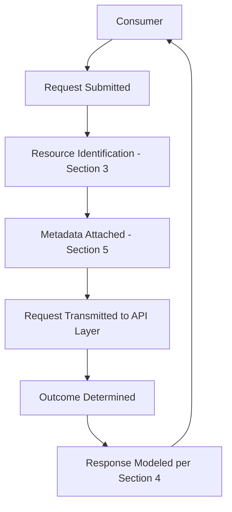
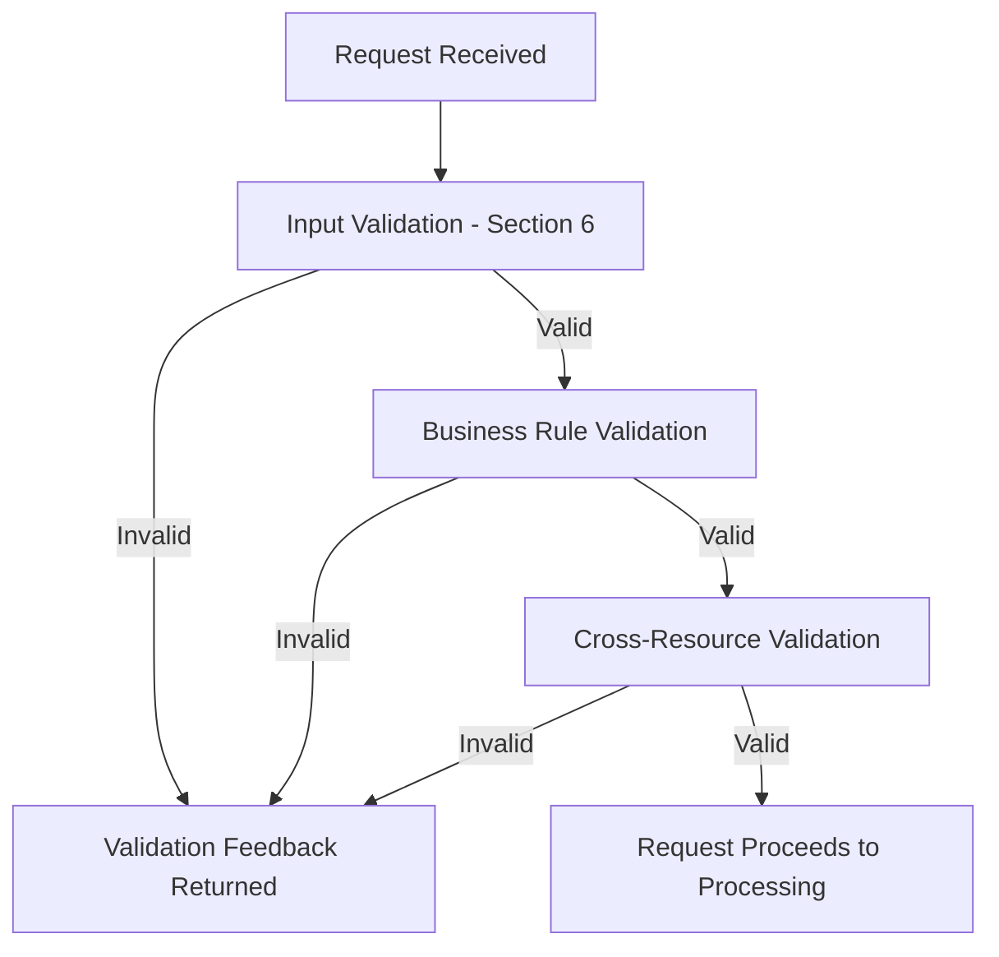
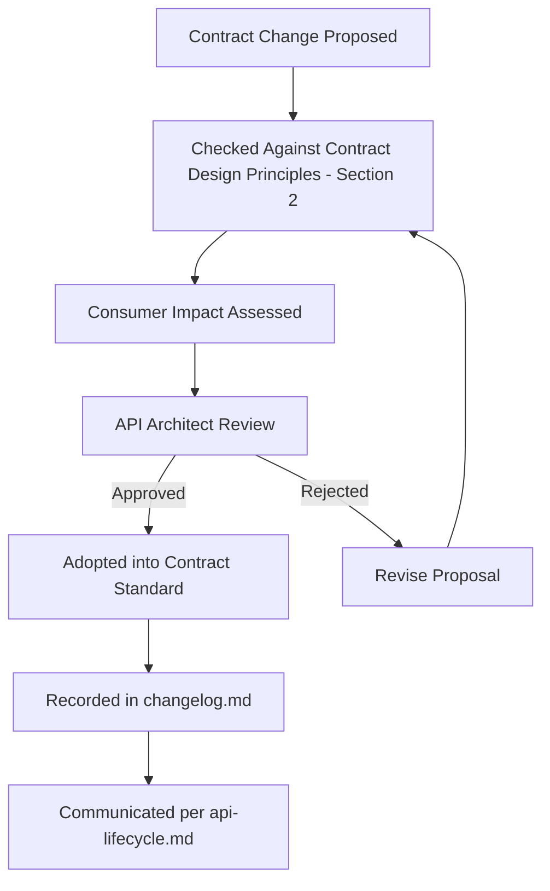
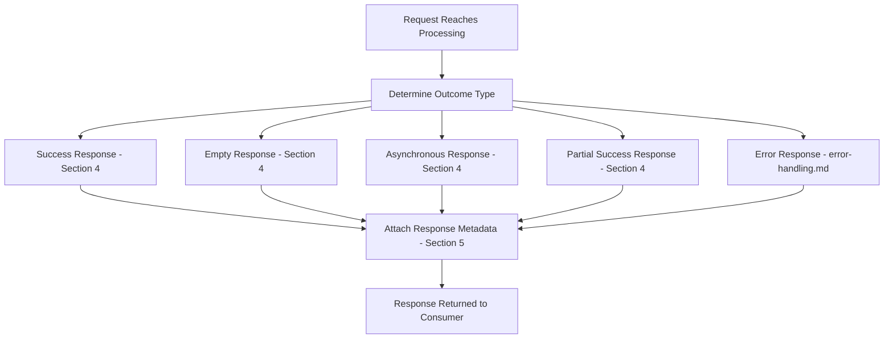
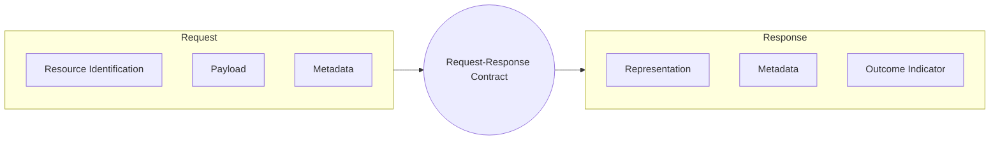

# API Request & Response Contract Standard

## 1. Document Purpose

This document establishes the enterprise-wide Request & Response Contract Standard for **StackLeo Tech Store**: the conceptual principles governing how consumers exchange data with the API, independent of any specific payload structure.

- **Purpose of Request/Response Contracts** — to ensure every interaction between a consumer and the API follows a predictable, coherent shape, regardless of which domain or resource is involved.
- **Relationship with API Consistency** — this document elaborates the Request & Response Principles introduced in `api-standards.md` (Section 6) into a dedicated contract standard.
- **Relationship with Developer Experience** — a predictable, self-descriptive contract is one of the most direct contributors to Developer Experience (`05_API/README.md`, Section 2); consumers should never need to guess how a response is shaped.
- **Relationship with API Governance** — contract design decisions are subject to the same review and approval discipline defined in `api-governance.md`.
- **Relationship with Long-Term Maintainability** — a disciplined contract standard allows the API surface to grow — new resources, new fields, new consumers — without repeatedly renegotiating how data is exchanged.

## 2. Contract Design Principles

- **Consistency** — every request and response follows the same structural conventions regardless of domain, per `api-standards.md` (Section 6).
- **Predictability** — a consumer who understands the contract for one resource can correctly predict the contract for another.
- **Consumer-Centric Design** — the contract is shaped around what consumers need to accomplish, not around internal implementation convenience.
- **Backward Compatibility** — an established contract's existing meaning is preserved for the life of an API version, per `versioning.md`.
- **Extensibility** — the contract accommodates new, optional information over time without breaking consumers unaware of it.
- **Self-Descriptive Messages** — a request or response is understandable on its own terms, without requiring undocumented, out-of-band knowledge.
- **Loose Coupling** — the contract does not expose or depend on internal implementation or storage structure, per `resource-model.md` (Section 2).
- **Security by Design** — every contract element is designed with its security and data-sensitivity implications considered from the outset, not layered on afterward.

## 3. Request Model

- **Resource Identification** — every request that acts on a specific resource identifies it using that resource's stable, canonical identity, per `resource-model.md` (Section 6).
- **Payload Structure** — every request payload follows a consistent structural shape across the API surface, so a consumer's request-building logic generalizes across domains.
- **Validation Expectations** — every request is validated against the target resource's defined constraints before any business effect occurs, per Section 6.
- **Optional vs. Required Information** — a request clearly distinguishes information that must be supplied from information that may be omitted, and this distinction remains stable for the life of an API version.
- **Metadata** — supporting context accompanying a request (such as correlation identifiers) is structurally separated from the primary business data being submitted, per Section 5.
- **Idempotency Readiness** — requests representing critical operations are designed to support safe retry from inception, consistent with `idempotency.md`.
- **Localization Readiness** — requests are designed to convey locale-relevant information (such as preferred language or currency) where the underlying business capability requires it, per Section 8.

### Request Design Principles

| Principle | Business Rationale |
|---|---|
| Resource Identification | Ensures a request unambiguously targets the intended resource. |
| Consistent Payload Structure | Reduces per-domain integration effort for consumers. |
| Validation Before Effect | Prevents partially applied or inconsistent business operations. |
| Clear Required/Optional Distinction | Reduces consumer trial-and-error and support burden. |
| Structurally Separated Metadata | Keeps business data and supporting context unambiguous. |
| Idempotency Readiness | Enables safe retry without unintended duplicate effects. |
| Localization Readiness | Supports the Bangladesh market today and multi-market expansion tomorrow. |

## 4. Response Model

- **Success Responses** — communicate that a requested operation completed as intended, and return whatever data is relevant to that outcome.
- **Empty Responses** — used where an operation completes successfully but there is no meaningful data to return, still communicated unambiguously as success.
- **Collection Responses** — return a bounded, navigable set of resources along with the metadata needed to understand and further navigate that set, per `pagination.md`.
- **Resource Responses** — return the canonical representation of a single resource, per `resource-model.md` (Section 8).
- **Asynchronous Responses** — acknowledge that a request has been accepted for processing without yet reflecting a final outcome, appropriate for long-running operations per `endpoint-design.md` (Section 8).
- **Partial Success Responses** — used for batch or bulk operations where some individual operations succeeded and others failed, clearly attributing outcome to each, per `endpoint-design.md` (Section 7).

### Response Categories

| Category | Business Rationale | Typical Scenario |
|---|---|---|
| Success Response | Confirms an operation's intended effect occurred. | A customer's order is successfully placed. |
| Empty Response | Confirms success where no return data is meaningful. | A wishlist item is successfully removed. |
| Collection Response | Supports browsing and discovery at scale. | A customer browses the product catalog. |
| Resource Response | Supports acting on or reviewing one specific resource. | A customer views one product's detail. |
| Asynchronous Response | Supports operations that cannot complete within a single interaction. | A bulk inventory update is accepted for background processing. |
| Partial Success Response | Supports transparency in multi-operation requests. | An administrator's batch update succeeds for most, fails for a few items. |

*Diagram: API Request Lifecycle.*

## 5. Metadata Strategy

- **Request Metadata** — supporting context accompanying a request, such as correlation and version information, structurally separated from business data.
- **Response Metadata** — supporting context accompanying a response, such as pagination or timing information, structurally separated from the primary business data returned.
- **Pagination Metadata** — conveys a collection response's position within the broader result set, per `pagination.md`.
- **Correlation Information** — allows a single consumer-initiated action to be traced across every platform component it touches, per Section 9.
- **Traceability Information** — allows any individual request or response to be identified and investigated after the fact.
- **Version Awareness** — conveys which version of the API contract a request or response applies to, per `versioning.md`.
- **Processing Context** — conveys relevant operational context about how a request was handled, such as whether it was served synchronously or accepted for asynchronous processing.

### Metadata Classification

| Metadata Type | Applies To | Purpose |
|---|---|---|
| Request Metadata | Requests | Carries supporting context without polluting business payload. |
| Response Metadata | Responses | Carries supporting context distinct from returned business data. |
| Pagination Metadata | Collection responses | Conveys position and navigation within a result set. |
| Correlation Information | Requests and responses | Traces a single action across the platform. |
| Traceability Information | Requests and responses | Supports diagnostics and support investigation. |
| Version Awareness | Requests and responses | Conveys applicable contract version. |
| Processing Context | Responses | Conveys how a request was handled operationally. |

## 6. Validation Strategy

- **Input Validation** — confirms a request's structure and values conform to the target resource's basic constraints before any further processing occurs.
- **Business Rule Validation** — confirms a request satisfies the business rules governing the target resource, per `01_Business/business-rules.md`, beyond simple structural correctness.
- **Consistency Validation** — confirms a request does not place a resource or aggregate into an internally inconsistent state, per `resource-model.md` (Section 4).
- **Cross-Resource Validation** — confirms a request's implications are valid across related resources, such as confirming sufficient inventory exists before confirming an order.
- **Validation Feedback Principles** — every validation failure clearly identifies what was invalid and why, in terms a consumer can act on, per `api-standards.md` (Section 10).

### Validation Strategy Matrix

| Validation Type | Checked Against | Failure Handling |
|---|---|---|
| Input Validation | Structural and value constraints of the target resource | Rejected before further processing; clear field-level feedback |
| Business Rule Validation | `01_Business/business-rules.md` | Rejected with business-meaningful explanation |
| Consistency Validation | Aggregate boundaries per `resource-model.md` | Rejected to prevent inconsistent aggregate state |
| Cross-Resource Validation | Related resource state (e.g., Inventory, Customer standing) | Rejected with explanation referencing the related resource |

## 7. Partial Responses & Field Selection

- **Summary Representations** — a reduced representation suitable for collection listings, per `resource-model.md` (Section 8).
- **Detailed Representations** — the complete canonical representation, returned when a consumer requests a specific resource directly.
- **Optional Fields** — a representation may include fields that are only conditionally present, clearly and consistently distinguished from always-present fields.
- **Selective Retrieval** — consumers may be able to request a reduced or expanded subset of a representation's fields where doing so provides genuine performance or usability benefit.
- **Performance Considerations** — the ability to select fields or representation depth exists primarily to reduce unnecessary payload size and processing cost for consumers with narrower data needs.

## 8. Localization & Internationalization

- **Multiple Languages** — the contract is structured to accommodate content in multiple languages as the platform expands beyond its current primary market.
- **Regional Formatting** — the contract accommodates regionally appropriate formatting conventions (such as date and number formatting) without embedding a single fixed convention.
- **Currency Representation** — the contract represents monetary values in a manner that accommodates BDT today and Multi-Currency in the future, per `01_Business/pricing-strategy.md`.
- **Time Zone Awareness** — time-related information is represented unambiguously, remaining meaningful regardless of the consumer's or platform's geographic location.
- **Locale-Specific Content** — content that varies by locale (such as legal or promotional text) is structured to be substitutable without altering the surrounding contract shape.

### Localization Readiness Matrix

| Concern | Current State | Future Readiness |
|---|---|---|
| Language | Single primary language | Contract structured for multi-language content |
| Currency | BDT only | Contract structured for Multi-Currency representation |
| Regional Formatting | Bangladesh conventions | Contract structured for regionally variable formatting |
| Time Zone | Single primary time zone | Contract structured for unambiguous, zone-aware representation |
| Locale-Specific Content | Not yet required | Contract structured for substitutable, locale-variable content |

## 9. Traceability

- **Correlation IDs** — allow a single consumer-initiated action to be traced across every platform component it touches, consistent with `api-standards.md` (Section 9).
- **Request IDs** — uniquely identify a single API request for diagnostic and support purposes.
- **Auditability** — every request that changes platform state can be traced back to a specific actor, time, and outcome, consistent with `04_Database/data-governance.md` (Section 3).
- **Diagnostic Readiness** — the contract carries sufficient information for engineering and support teams to investigate an issue without needing to reproduce it from scratch.
- **Operational Visibility** — traceability information supports the broader observability strategy defined in `03_System_Design/observability.md`.

*Diagram: Request Validation Workflow.*

## 10. Future Evolution

- **GraphQL** — the contract's discipline around consistent, self-descriptive representation translates directly to a future complementary query approach.
- **Event-Driven APIs** — the response model's asynchronous handling (Section 4) provides the conceptual foundation for future event-driven interaction.
- **Streaming Responses** — the contract anticipates a future need for continuously delivered, rather than single-shot, response data for appropriate use cases.
- **AI Consumers** — a consistent, predictable, self-descriptive contract allows machine-driven consumers to rely on the same structure as human-facing ones.
- **Marketplace APIs** — vendor-facing contracts extend the same request/response principles established here, rather than introducing parallel conventions.
- **Public APIs** — the contract standard is designed at a level of discipline suitable for eventual external, public consumption.

## 11. Governance

- **Contract Ownership** — the API Architect owns the coherence of the request/response contract standard, in partnership with domain owners for domain-specific application.
- **Review Process** — proposed contract changes are reviewed against this document's principles before implementation.
- **Documentation Standards** — this document follows the enterprise Markdown conventions established across this repository.
- **Change Management** — material contract changes are recorded in `00_Project_Overview/changelog.md`.
- **Versioning** — this document follows Semantic Versioning per `00_Project_Overview/changelog.md`; changes to actual API contracts are governed by `versioning.md`.
- **Consumer Communication** — contract changes affecting existing consumers are communicated through the deprecation and change processes defined in `api-lifecycle.md`.

### Governance Responsibilities

| Role | Responsibility |
|---|---|
| API Architect | Owns overall contract standard coherence. |
| Domain Owner | Ensures domain-specific contracts comply with this standard. |
| Backend Engineering Lead | Ensures implementations conform to approved contract structure. |
| QA Lead | Validates contract behavior against documented expectations. |
| Technical Writer | Maintains contract documentation accuracy. |

*Diagram: Contract Governance Lifecycle.*

## 12. Anti-Patterns

| Anti-Pattern | Description | Why It Should Be Avoided |
|---|---|---|
| Inconsistent Response Shapes | Structuring responses differently across different parts of the API. | Forces consumers to write per-domain parsing logic, undermining Consistency. |
| Hidden Required Fields | Requiring information not clearly documented as mandatory. | Produces unpredictable failures and consumer frustration, undermining Predictability. |
| Overloaded Responses | Returning excessive, unrelated data "just in case" it might be useful. | Degrades performance and obscures the response's actual intent, undermining Consumer-Centric Design. |
| Breaking Contract Changes | Modifying an existing contract in ways that disrupt current consumers. | Directly violates Backward Compatibility and damages consumer trust. |
| Leaking Internal Models | Exposing internal implementation or storage structure directly in a contract. | Couples consumers to implementation detail, undermining Loose Coupling. |
| Missing Metadata | Omitting the supporting context (correlation, pagination, version) consumers need to operate reliably. | Undermines Traceability and makes diagnosing issues significantly harder. |
| Poor Validation Feedback | Returning vague or unhelpful validation failure information. | Increases consumer trial-and-error and support burden, undermining Self-Descriptive Messages. |
| Ambiguous Success Indicators | Failing to clearly and consistently communicate whether an operation succeeded. | Forces consumers to guess at outcome, undermining trust in the contract entirely. |

### Anti-Pattern Summary

| Anti-Pattern | Primary Risk | Mitigating Principle |
|---|---|---|
| Inconsistent Response Shapes | Increased integration cost | Consistency |
| Hidden Required Fields | Unpredictable failures | Predictability |
| Overloaded Responses | Degraded performance | Consumer-Centric Design |
| Breaking Contract Changes | Consumer disruption | Backward Compatibility |
| Leaking Internal Models | Implementation coupling | Loose Coupling |
| Missing Metadata | Poor diagnosability | Traceability |
| Poor Validation Feedback | Increased support burden | Self-Descriptive Messages |
| Ambiguous Success Indicators | Erosion of consumer trust | Self-Descriptive Messages |

*Diagram: Response Generation Flow.*

*Diagram: Request–Response Contract Model.*

## 13. Document Information

| Property | Value |
|----------|-------|
| Document | request-response.md |
| Version | 1.0.0 |
| Status | Active |
| Maintained By | StackLeo |
| Last Updated | 2026-07-17 |

---

© StackLeo. All Rights Reserved.
