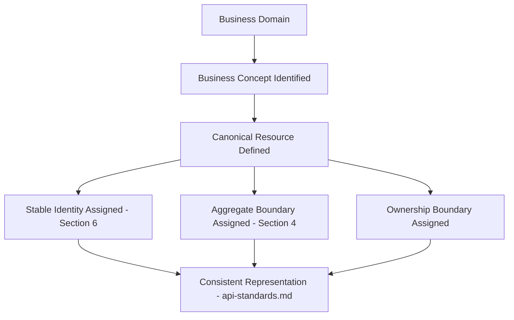
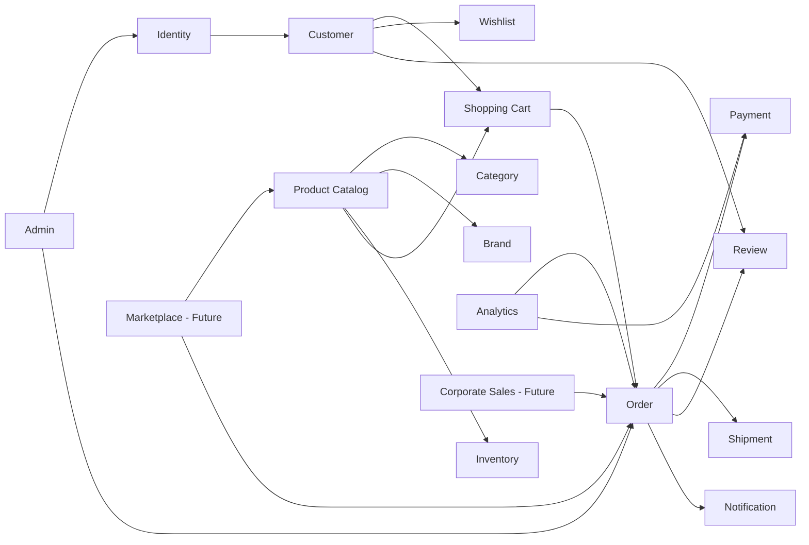
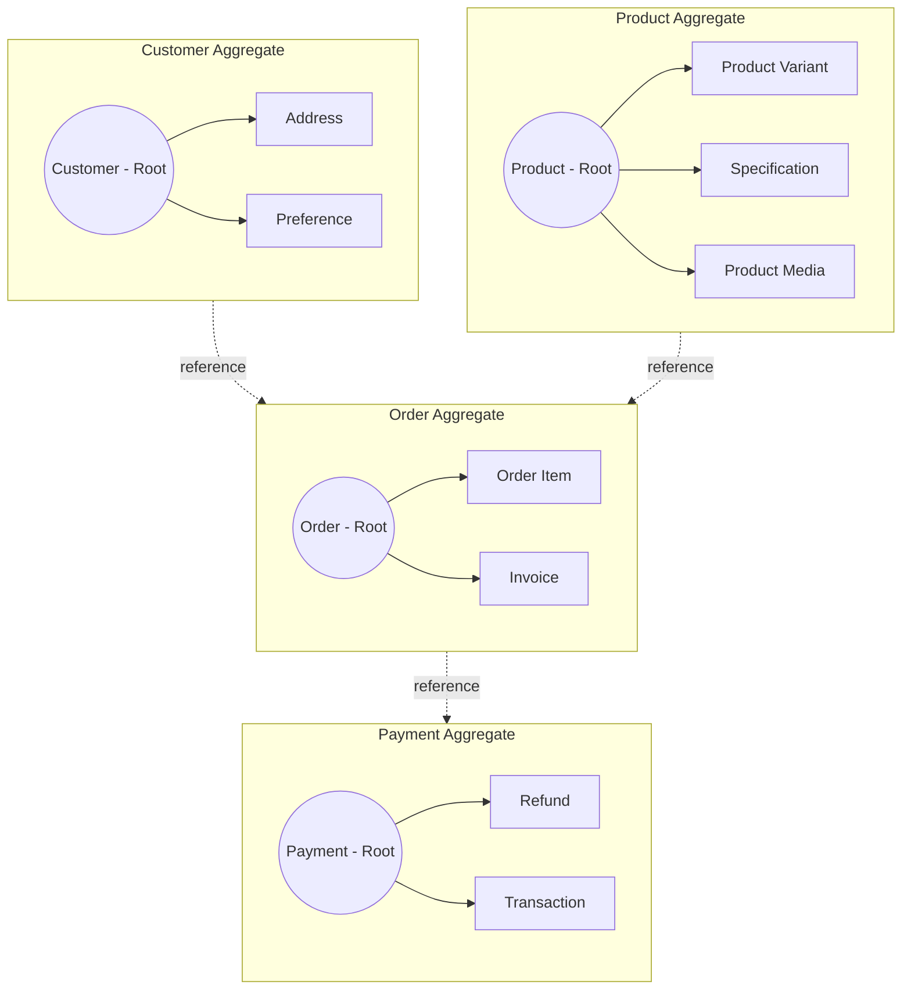
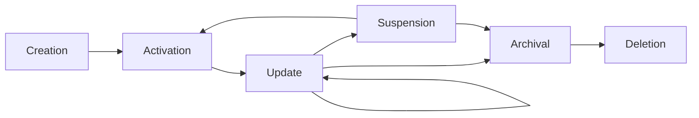
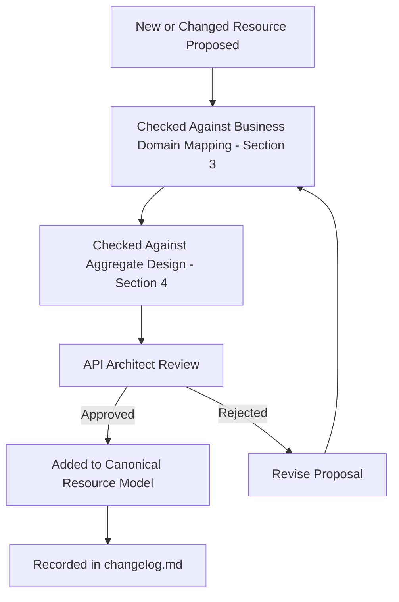

# Canonical API Resource Model

## 1. Document Purpose

This document establishes the canonical API Resource Model for **StackLeo Tech Store**: the conceptual resources, ownership boundaries, aggregate structures, and relationships every API surface must represent consistently.

- **Purpose of a Resource Model** — to define, once and authoritatively, what a "resource" means for each business concept the API exposes, so no two APIs invent competing representations of the same concept.
- **Relationship with REST Architecture** — this document is the foundation of Resource-Oriented Design, one of the core principles established in `api-standards.md` (Section 2); a REST API is only as coherent as the resource model beneath it.
- **Relationship with Domain-Driven Design** — this document's aggregates and boundaries are conceptually derived from `03_System_Design/domain-model.md` and `04_Database/data-model.md`, translating internal domain modeling into consumer-facing resource design.
- **Relationship with API Consistency** — every naming, structural, and relationship convention in `api-standards.md` depends on a shared, canonical understanding of what each resource is — this document is that shared understanding.
- **Relationship with Long-Term Maintainability** — a well-bounded resource model allows the API surface to grow by adding resources, not by repeatedly redesigning existing ones.

## 2. Resource Modeling Principles

- **Resources Represent Business Concepts** — every resource corresponds to something a business stakeholder would recognize and name, never an internal technical structure.
- **Stable Identities** — a resource's identity persists for its entire lifecycle, independent of changes to its attributes, per Section 6.
- **Resource Lifecycle** — every resource has a defined, deliberate lifecycle (Section 7), rather than an implicit or undefined one.
- **Aggregate Boundaries** — related resources that must change together consistently are grouped into aggregates (Section 4), preventing partial, inconsistent updates.
- **Resource Ownership** — every resource has exactly one owning domain, consistent with the ownership boundaries defined in `04_Database/data-governance.md`.
- **Loose Coupling** — resources reference one another through stable identity, not through structural embedding of another domain's internal detail.
- **Consistent Representations** — a given resource is represented identically everywhere it appears across the API surface, per `api-standards.md` (Section 6).
- **Canonical Resource Definitions** — each resource has exactly one authoritative definition, recorded in this document, that all other API documentation and implementation must conform to.

*Diagram: Enterprise Resource Model Overview.*

## 3. Business Domain Mapping

### Business Domain → Resource Mapping

| Domain | Business Purpose | Primary Resources | Ownership Boundary | Relationships to Other Domains |
|---|---|---|---|---|
| Identity | Establishes and manages who is interacting with the platform. | User, Session, Role, Permission | Identity domain | Referenced by every domain requiring an actor. |
| Customer | Represents the people who purchase from StackLeo. | Customer, Address, Preference | Customer domain | Owns Wishlist; referenced by Order, Cart, Review. |
| Product Catalog | Represents sellable products and their attributes. | Product, Product Variant, Specification, Product Media | Product Catalog domain | Referenced by Cart, Order, Inventory, Review. |
| Category | Organizes products into a navigable hierarchy. | Category | Product Catalog domain | Referenced by Product. |
| Brand | Represents manufacturers and brand-level organization. | Brand | Product Catalog domain | Referenced by Product. |
| Inventory | Tracks stock availability across locations. | Warehouse, Inventory Record, Stock Movement | Inventory domain | Referenced by Product Catalog, Order. |
| Shopping Cart | Represents a customer's pre-purchase item selection. | Cart, Cart Item | Commerce domain | References Customer, Product; precedes Order. |
| Wishlist | Represents customer-saved purchase intent. | Wishlist, Wishlist Item | Customer domain | References Customer, Product. |
| Order | Represents a confirmed purchase commitment. | Order, Order Item, Invoice | Order domain | References Customer, Product, Payment, Shipment. |
| Payment | Represents the financial settlement of an order. | Payment, Refund, Transaction | Payment domain | References Order. |
| Shipment | Represents the physical fulfillment of an order. | Shipment, Delivery Tracking | Shipping domain | References Order. |
| Review | Represents customer feedback on a product. | Review, Rating | Customer Experience domain | References Customer, Product, Order. |
| Notification | Represents a communication triggered to a consumer. | Notification | Administration domain | References Customer, Order, Shipment. |
| Customer Dashboard | Aggregates a customer's own data for self-service. | (Composed view; no independent resource) | Customer domain | Composes Order, Wishlist, Review, Notification. |
| Admin | Provides staff-facing operational and administrative capability. | Admin User, Audit Record | Administration domain | References every domain requiring administrative oversight. |
| Analytics | Exposes aggregated business and operational data. | Business Metric, Operational Metric | Analytics domain | Derived from Order, Payment, Product, Customer data. |
| Corporate Sales (Future) | Represents bulk and organizational buyer capability. | Corporate Account, Purchase Order | Corporate Sales domain (future) | References Customer, Order, Product. |
| Marketplace (Future) | Represents multi-vendor selling capability. | Vendor, Vendor Product, Commission | Marketplace domain (future) | References Product Catalog, Order, Payment. |

*Diagram: Business Domain Relationships.*

## 4. Aggregate Design

| Aggregate | Aggregate Root | Child Resources | Consistency Boundary | Lifecycle | Business Responsibilities |
|---|---|---|---|---|---|
| Customer Aggregate | Customer | Address, Preference | All customer profile data changes consistently together. | Registration through account closure. | Ensures a customer's identity and contact data remain internally consistent. |
| Product Aggregate | Product | Product Variant, Specification, Product Media | A product's sellable definition changes as one consistent unit. | Creation through discontinuation. | Ensures a product's catalog representation is never partially updated. |
| Cart Aggregate | Cart | Cart Item | A cart's contents and totals remain consistent as items are added or removed. | Creation through checkout or abandonment. | Ensures cart state accurately reflects customer intent at all times. |
| Order Aggregate | Order | Order Item, Invoice | An order's committed contents and totals are immutable once confirmed. | Placement through completion or cancellation. | Ensures the order record remains an accurate, trustworthy record of a business transaction. |
| Payment Aggregate | Payment | Refund, Transaction | A payment's financial state changes only through governed, auditable transitions. | Initiation through settlement or refund. | Ensures financial integrity and auditability of every monetary movement. |
| Shipment Aggregate | Shipment | Delivery Tracking | A shipment's fulfillment state changes only through recognized status transitions. | Creation through delivery confirmation. | Ensures fulfillment status is accurate and traceable. |
| Review Aggregate | Review | Rating | A review's content and rating are published as a single consistent unit. | Submission through moderation and publication. | Ensures published feedback is trustworthy and internally consistent. |

### Aggregate Summary

| Aggregate | Primary Domain | Mutability After Confirmation | Cross-Aggregate Reference Style |
|---|---|---|---|
| Customer Aggregate | Customer | Mutable throughout lifecycle | Referenced by identity from Order, Cart, Review |
| Product Aggregate | Product Catalog | Mutable throughout lifecycle | Referenced by identity from Cart, Order, Review |
| Cart Aggregate | Commerce | Mutable until checkout | Converts into Order Aggregate at checkout |
| Order Aggregate | Order | Immutable core; status transitions only | Referenced by identity from Payment, Shipment, Review |
| Payment Aggregate | Payment | Append-only transaction history | Referenced by identity from Order |
| Shipment Aggregate | Shipping | Status transitions only | Referenced by identity from Order |
| Review Aggregate | Customer Experience | Mutable until moderation lock | Referenced by identity from Product, Order |

*Diagram: Aggregate Boundary Diagram.*

## 5. Resource Relationships

- **One-to-One** — appropriate where a resource has exactly one corresponding counterpart, such as an Order and its Invoice.
- **One-to-Many** — the most common relationship, appropriate where a parent resource has multiple related child resources, such as a Product and its Reviews.
- **Many-to-Many** — appropriate where two resource types each relate to multiple instances of the other, such as Products and Categories.
- **Composition** — used within an aggregate, where a child resource has no independent existence or meaning apart from its root, such as an Order Item apart from its Order.
- **Association** — used between resources in different aggregates that relate but do not own one another, such as a Review associating a Customer and a Product.
- **Reference** — the mechanism by which one resource points to another by stable identity rather than embedding its full representation, preserving loose coupling.
- **Containment** — used where a resource is meaningfully scoped within a parent's context for access purposes, such as a Cart Item accessed in the context of its Cart, without implying the child cannot be independently reasoned about.

### Resource Relationship Matrix

| Relationship Type | Example | Coupling Implication |
|---|---|---|
| One-to-One | Order ↔ Invoice | Tight; the two evolve together. |
| One-to-Many | Product → Reviews | Loose; children reference the parent, not vice versa. |
| Many-to-Many | Product ↔ Category | Loose; resolved through an association, not direct embedding. |
| Composition | Order → Order Item | Tight; child cannot exist independently of the aggregate root. |
| Association | Review → Customer, Review → Product | Loose; related but independently owned. |
| Reference | Order → Customer (by identity) | Loose; avoids duplicating Customer data within Order. |
| Containment | Cart → Cart Item | Moderate; scoped access without full ownership implications. |

## 6. Resource Identity

- **Stable Resource Identity** — every resource is assigned an identity at creation that never changes for the resource's lifetime.
- **Canonical Identifiers** — each resource has exactly one authoritative identifier used consistently across every API surface that references it.
- **External vs. Internal Identity** — the identity exposed to API consumers is treated as the canonical identity; any internal representation detail remains implementation concern, outside this document's scope.
- **Identity Lifecycle** — an identity is assigned once, at resource creation, and is never reassigned, reused, or repurposed, even after the resource's eventual deletion.
- **Immutable Identity Principles** — while a resource's attributes may change throughout its lifecycle, its identity is the one property guaranteed never to change, forming the stable anchor consumers depend on.

## 7. Resource Lifecycle

| Stage | Description | Business Scenario |
|---|---|---|
| Creation | A resource comes into existence with an assigned identity. | A customer registers, creating a Customer resource. |
| Activation | A resource becomes eligible for normal business use. | A Product becomes visible in the catalog once approved. |
| Update | A resource's attributes change while its identity and core meaning persist. | A customer updates their shipping address. |
| Suspension | A resource is temporarily restricted from normal use without being removed. | A Product is temporarily hidden pending a stock correction. |
| Archival | A resource is retained but no longer actively participates in current operations. | A completed Order moves to historical status after the active fulfillment window ends. |
| Deletion | A resource, or its accessible representation, is permanently removed or rendered inaccessible. | A customer requests account closure. |

### Resource Lifecycle Matrix

| Resource | Creation Trigger | Typical End State |
|---|---|---|
| Customer | Registration | Archival (closure) or Deletion (on request) |
| Product | Catalog onboarding | Archival (discontinuation) |
| Cart | First item added | Conversion to Order or Deletion (abandonment) |
| Order | Checkout confirmation | Archival (completion) |
| Payment | Order confirmation | Archival (settlement) |
| Shipment | Order fulfillment begins | Archival (delivery confirmed) |
| Review | Customer submission | Archival (superseded) or Deletion (moderation removal) |

*Diagram: Resource Lifecycle Flow.*

## 8. Representation Strategy

- **Canonical Representation** — the single, authoritative structural form of a resource, from which all other representations are derived.
- **Summary Representation** — a reduced form of a resource suitable for collection listings, containing only what a consumer typically needs before deciding to request the full resource.
- **Detailed Representation** — the complete canonical representation, returned when a consumer requests a specific resource directly.
- **Embedded Relationships** — related resource data included directly within a response, appropriate where the relationship is integral to understanding the primary resource (such as Order Items within an Order).
- **Linked Relationships** — related resources referenced by identity rather than embedded, appropriate where the relationship is peripheral or the related resource is independently substantial (such as a Product referenced from a Review).
- **Extensibility** — representations accommodate new, optional attributes over time without breaking consumers unaware of them.
- **Backward Compatibility** — a resource's existing represented attributes retain their meaning for the life of an API version, per `versioning.md`.

### Representation Strategy Comparison

| Representation | Used For | Trade-off |
|---|---|---|
| Summary | Collection listings, search results | Smaller payload; consumer may need a follow-up request for full detail. |
| Detailed | Single-resource retrieval | Complete data; larger payload than necessary for listings. |
| Embedded Relationships | Tightly coupled, composition-style relationships | Fewer consumer requests; larger, less reusable payload. |
| Linked Relationships | Loosely coupled, association-style relationships | Smaller, more reusable payload; requires follow-up requests for related detail. |

## 9. Nested Resources

- **When Nesting Is Appropriate** — nesting is used when a resource has no independent meaning or lifecycle apart from its parent, reflecting genuine composition (Section 5), such as an Order Item within an Order.
- **When Flat Resources Are Preferable** — a resource with independent meaning, its own lifecycle, or multiple potential parents is represented as a flat, top-level resource referenced by identity, such as a Product referenced from a Cart.
- **Ownership Implications** — nesting a resource implies its owning domain is the parent's domain; a flat resource retains its own domain ownership as defined in Section 3.
- **URL Hierarchy Principles (Conceptual Only)** — the structural depth of a resource's addressable path reflects genuine ownership depth, not convenience; excessive nesting is avoided as it couples consumers to a rigid, hard-to-evolve hierarchy.

## 10. Future Evolution

- **GraphQL** — the resource model's clear aggregate and relationship boundaries translate directly into a future complementary graph-based query approach.
- **Event-Driven APIs** — resource lifecycle transitions (Section 7) map naturally to future business events exposed through `webhooks.md`.
- **Marketplace** — the Marketplace domain (Section 3) is modeled from inception so vendor-facing resources extend the existing model rather than requiring redesign.
- **Multi-region** — resource identity (Section 6) is designed to remain globally stable and unambiguous as the platform expands beyond a single region.
- **AI Consumers** — the canonical, consistent representation strategy (Section 8) ensures machine consumers can rely on the same resource structure as human-facing ones.
- **Public APIs** — the resource model's discipline is designed to withstand external, public scrutiny and long-term external dependency.
- **Partner APIs** — partner-facing resources (Corporate Sales, future Partner Systems) are modeled as natural extensions of existing domains, not parallel, divergent structures.

## 11. Governance

- **Resource Ownership** — every resource has exactly one accountable owning domain, per Section 3, preventing competing or duplicate definitions.
- **Canonical Resource Reviews** — proposed new resources or significant changes to existing ones are reviewed against this document before implementation.
- **Architecture Approval** — the API Architect approves new aggregates or domain boundary changes, ensuring alignment with `03_System_Design/domain-model.md`.
- **Documentation Standards** — this document follows the enterprise Markdown conventions established across this repository.
- **Change Management** — material changes to the resource model are recorded in `00_Project_Overview/changelog.md`.
- **Versioning** — this document follows Semantic Versioning per `00_Project_Overview/changelog.md`, distinct from the API versioning strategy defined in `versioning.md`.

### Governance Responsibilities

| Role | Responsibility |
|---|---|
| API Architect | Owns the canonical resource model and approves structural changes. |
| Domain Expert / Product Manager | Validates resource definitions against genuine business meaning. |
| Solution Architect | Ensures alignment with `03_System_Design/domain-model.md`. |
| Backend Engineering Lead | Validates that resource definitions are implementable. |
| Data Architect | Ensures resource definitions remain consistent with `04_Database/data-model.md`. |

*Diagram: Canonical Resource Governance Workflow.*

## 12. Anti-Patterns

| Anti-Pattern | Description | Why It Should Be Avoided |
|---|---|---|
| Anemic Resources | Resources that expose only raw data with no coherent business meaning or invariants. | Undermines the principle that resources represent business concepts (Section 2), pushing meaning into ad hoc consumer logic. |
| RPC-style APIs | Resources modeled after actions or procedures rather than business concepts. | Conflicts directly with Resource-Oriented Design and produces an unpredictable, inconsistent surface. |
| Leaking Database Tables | Exposing internal database structure directly as API resources. | Couples the API to implementation detail, undermining Implementation Independence and Evolvability. |
| Over-Nesting | Nesting resources many levels deep regardless of genuine ownership. | Produces a rigid, hard-to-navigate structure that breaks whenever ownership assumptions change. |
| Unstable Identities | Allowing a resource's identity to change or be reassigned over its lifetime. | Breaks every consumer reference to that resource, directly violating Section 6. |
| Tight Coupling | Embedding another domain's full resource representation instead of referencing it by identity. | Prevents independent evolution of the referenced domain, undermining Loose Coupling (Section 2). |
| Duplicate Resources | Modeling the same business concept as multiple, inconsistent resources across different parts of the API. | Undermines Canonical Resource Definitions and confuses consumers about which representation is authoritative. |
| Inconsistent Ownership | Allowing more than one domain to claim authority over the same resource. | Produces conflicting updates and unclear accountability, undermining Resource Ownership (Section 2). |

### Anti-Pattern Summary

| Anti-Pattern | Primary Risk | Mitigating Principle |
|---|---|---|
| Anemic Resources | Loss of business meaning | Resources Represent Business Concepts |
| RPC-style APIs | Unpredictable API surface | Resource-Oriented Design |
| Leaking Database Tables | Implementation coupling | Implementation Independence |
| Over-Nesting | Rigid, brittle structure | Nested Resources principles (Section 9) |
| Unstable Identities | Broken consumer references | Stable Resource Identity |
| Tight Coupling | Reduced domain independence | Loose Coupling |
| Duplicate Resources | Consumer confusion | Canonical Resource Definitions |
| Inconsistent Ownership | Conflicting updates | Resource Ownership |

## 13. Document Information

| Property | Value |
|----------|-------|
| Document | resource-model.md |
| Version | 1.0.0 |
| Status | Active |
| Maintained By | StackLeo |
| Last Updated | 2026-07-17 |

---

© StackLeo. All Rights Reserved.
