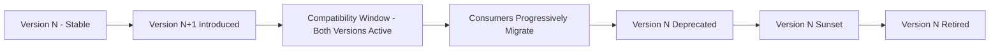
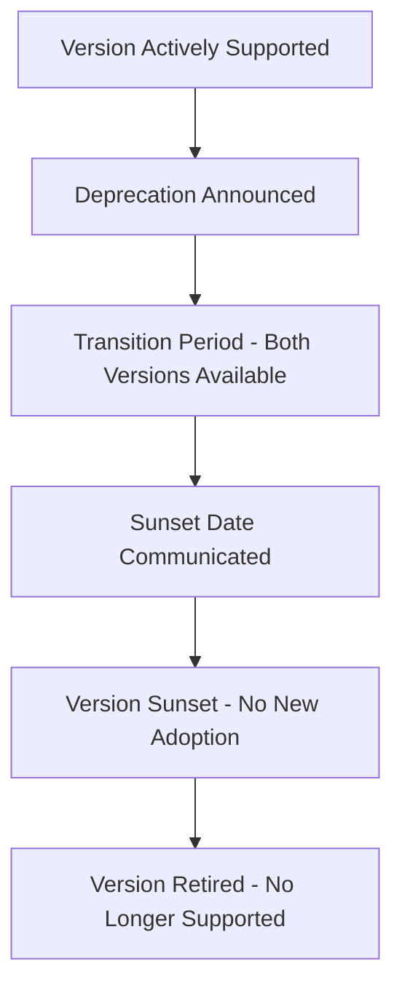
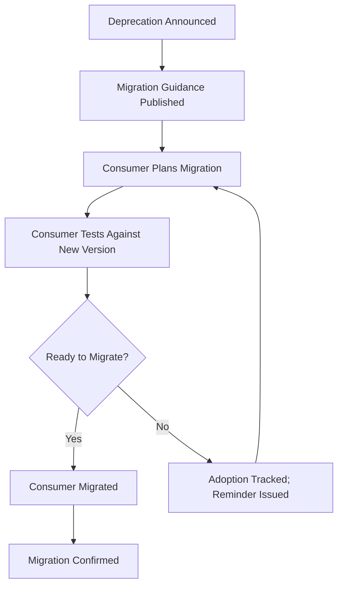
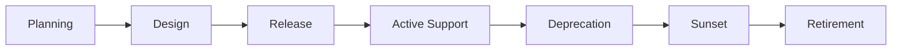
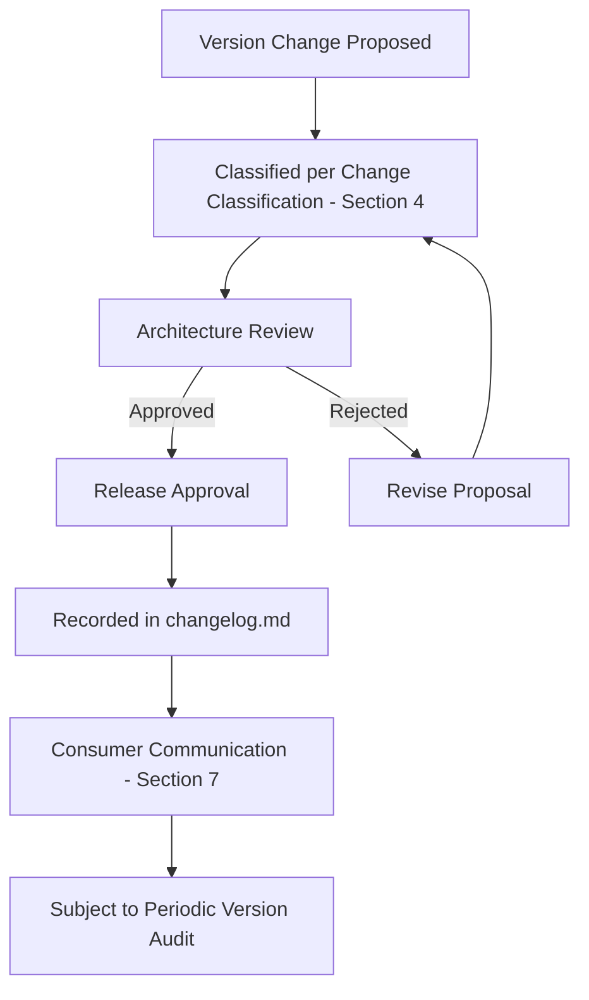

# Enterprise API Versioning Strategy

## 1. Document Purpose

This document establishes the Enterprise API Versioning Strategy for **StackLeo Tech Store**: how the API surface evolves over time without breaking the consumers who depend on it.

- **Purpose of API Versioning** — to allow the API to grow and change deliberately while giving consumers a stable, predictable basis to build against.
- **Relationship with API Lifecycle** — this document defines *how* an API version evolves; `api-lifecycle.md` defines the *broader lifecycle stages* an API capability moves through, of which versioning is one governed mechanism.
- **Relationship with Consumer Stability** — every principle in this document exists to protect the Backward Compatibility commitment established in `api-standards.md` (Section 2) and `api-overview.md` (Section 5).
- **Relationship with Governance** — version changes are subject to the same review and approval discipline defined in `api-governance.md`.
- **Relationship with Long-Term Maintainability** — a disciplined versioning strategy prevents the API surface from accumulating unmanaged, incompatible variations over time.

## 2. Versioning Philosophy

- **Stability First** — a consumer's integration should not break without a deliberate, well-communicated reason.
- **Consumer-Centric Evolution** — versioning decisions are made from the perspective of minimizing consumer disruption, not from what is most convenient to implement.
- **Backward Compatibility** — evolution preserves the functioning of existing consumers wherever business need allows.
- **Predictable Change** — consumers can anticipate how and when the API will change, rather than being surprised by it.
- **Incremental Evolution** — the API surface grows through small, additive steps rather than large, disruptive rewrites.
- **Explicit Version Governance** — every version's introduction, support status, and eventual retirement is a deliberate, recorded decision, never implicit.
- **Minimize Breaking Changes** — breaking change is treated as a last resort, justified only when the business cost of preserving compatibility clearly exceeds the cost of disruption.

## 3. Versioning Models

| Model | Concept | Advantages | Trade-offs | Appropriate Use Cases |
|---|---|---|---|---|
| URI-Based Versioning | The API version is expressed as part of the resource's structural path. | Highly visible and simple for consumers to understand; easy to route at the infrastructure level. | Can imply the entire resource changed even when only part of it did; encourages full-surface version duplication. | Situations where clarity and simplicity for a broad, mixed consumer base matter most. |
| Header-Based Versioning | The API version is conveyed through a request header rather than the resource path. | Keeps resource paths stable and semantically clean; version becomes a cross-cutting concern rather than part of resource identity. | Less visible to casual consumers; requires more disciplined tooling and documentation to avoid confusion. | Situations favoring clean, stable resource identity over version visibility. |
| Media Type Versioning | The API version is conveyed through content negotiation, treating each version as a distinct representation format. | Aligns closely with REST's content negotiation principles; allows fine-grained, resource-level version evolution. | More conceptually sophisticated; less familiar to less experienced consumers. | Situations with a sophisticated consumer base and a need for fine-grained representation evolution. |
| Date-Based Versioning | The API version is expressed as the date a particular contract was established or last changed. | Communicates recency clearly; avoids arbitrary version numbering debates. | Does not by itself communicate the nature or scope of change between dates. | Situations where frequent, small, well-documented changes are the norm. |
| Semantic Versioning Concepts | The API version communicates the nature of change (major, minor, patch) through a structured numbering scheme. | Clearly signals whether a change is breaking, additive, or corrective. | Requires disciplined internal classification (Section 4) to remain meaningful. | Situations where consumers benefit from understanding change significance at a glance. |
| Resource Evolution Without Explicit Versions | The API evolves purely through additive, backward-compatible change, avoiding the need for explicit version markers at all. | Simplifies the consumer experience; avoids version proliferation entirely. | Only sustainable if breaking change is truly never introduced; fragile if that discipline lapses. | Situations with a strong, sustained commitment to purely additive evolution. |

*This comparison is presented objectively; StackLeo's specific model selection is a governed architectural decision recorded through the process in Section 10, not prescribed by this document.*

### Versioning Model Comparison

| Model | Consumer Visibility | Implementation Simplicity | Granularity of Evolution |
|---|---|---|---|
| URI-Based Versioning | High | High | Coarse (whole API surface) |
| Header-Based Versioning | Medium | Medium | Coarse to Medium |
| Media Type Versioning | Medium | Low | Fine (per resource) |
| Date-Based Versioning | High | Medium | Coarse |
| Semantic Versioning Concepts | High | Medium | Coarse, with clear change-type signal |
| Resource Evolution Without Explicit Versions | Low (invisible when successful) | High (once disciplined) | Fine (continuous) |

## 4. Change Classification

| Change Type | Business Impact | Consumer Expectations | Governance Considerations |
|---|---|---|---|
| Non-Breaking Changes | Minimal; existing consumer behavior is unaffected. | Consumers may adopt new capability at their own pace. | Reviewed for genuine backward compatibility before release. |
| Potentially Breaking Changes | Moderate; safe for most consumers but risky for some usage patterns. | Consumers relying on undocumented or edge-case behavior may be affected. | Reviewed carefully; often require explicit consumer communication even without a version bump. |
| Breaking Changes | High; existing consumer integrations will fail without adaptation. | Consumers require advance notice and a migration path. | Require formal approval and a governed deprecation process, per Section 6. |
| Documentation-Only Changes | None to the contract itself. | No consumer action required. | Reviewed for accuracy; does not require version governance. |
| Behavioral Changes | Variable; the contract shape is unchanged but the resulting behavior differs. | Consumers may be affected even without any structural change being visible. | Requires particular scrutiny, as these changes are the easiest to overlook during review. |

### Change Classification Matrix

| Change Type | Requires New Version | Requires Consumer Notification | Example |
|---|---|---|---|
| Non-Breaking Changes | No | Optional | Adding a new optional field to a response. |
| Potentially Breaking Changes | Case-by-case | Recommended | Tightening validation on a previously loosely validated field. |
| Breaking Changes | Yes | Required | Removing or repurposing an existing field. |
| Documentation-Only Changes | No | No | Clarifying an existing field's description. |
| Behavioral Changes | Case-by-case | Recommended | Changing the business logic determining a computed field's value. |

## 5. Compatibility Strategy

- **Backward Compatibility** — a new version or change does not break consumers built against the prior contract.
- **Forward Compatibility** — where practical, a consumer built against an earlier contract can tolerate encountering additive elements introduced by a later one.
- **Compatibility Windows** — a defined period during which both an outgoing and an incoming version remain simultaneously available, giving consumers time to migrate deliberately rather than urgently.
- **Consumer Expectations** — consumers can rely on a published compatibility commitment remaining honored for the duration it was communicated.
- **Graceful Evolution** — capability is introduced additively wherever possible, minimizing the frequency with which compatibility windows are needed at all.
- **Progressive Adoption** — consumers can adopt new capability incrementally, rather than being forced into an all-or-nothing migration.

### Compatibility Strategy Matrix

| Strategy Element | Purpose | Consumer Benefit |
|---|---|---|
| Backward Compatibility | Preserve existing consumer functioning | Reduced integration maintenance burden |
| Forward Compatibility | Tolerate additive change without failure | Reduced fragility to minor API evolution |
| Compatibility Windows | Provide deliberate migration time | Predictable, non-urgent migration planning |
| Graceful Evolution | Minimize need for breaking change | Fewer forced migrations over time |
| Progressive Adoption | Allow incremental capability adoption | Reduced migration risk and effort |

*Diagram: Compatibility Evolution Timeline.*

## 6. Deprecation Strategy

- **Deprecation Lifecycle** — a version's path from full support through eventual retirement is a defined, staged process, not a single abrupt event.
- **Consumer Notifications** — consumers are informed of an upcoming deprecation with sufficient lead time to plan a migration.
- **Transition Periods** — a deprecated version remains functional for a defined period, allowing consumers to migrate on a reasonable timeline.
- **Sunset Planning** — the eventual retirement date of a deprecated version is communicated clearly and held to, avoiding both premature removal and indefinite legacy support.
- **End-of-Life Policies** — once a version reaches end-of-life, it is formally retired, and continued reliance on it is no longer supported.

*Diagram: Deprecation & Sunset Process.*

## 7. Consumer Migration Strategy

- **Migration Planning** — a deprecation is accompanied by clear guidance on what a consumer must change and by when.
- **Parallel Support** — outgoing and incoming versions are supported simultaneously during the compatibility window, allowing consumers to migrate without a forced cutover.
- **Upgrade Guidance** — consumers are given practical, actionable guidance for adapting to a new version, not merely informed that change has occurred.
- **Adoption Tracking** — the platform monitors which consumers remain on a deprecated version, informing both consumer outreach and sunset timing decisions.
- **Communication Strategy** — deprecation, migration guidance, and sunset dates are communicated proactively and repeatedly, not left for consumers to discover independently.

*Diagram: Consumer Migration Workflow.*

## 8. API Lifecycle

| Stage | Description | Governance Responsibility |
|---|---|---|
| Planning | The need for a new API version or capability is identified and evaluated. | API Architect and Product Manager assess business justification. |
| Design | The version's contract is designed in accordance with `api-standards.md` and `resource-model.md`. | API Architect leads design review. |
| Release | The new version becomes available to consumers. | API Architect approves release readiness. |
| Active Support | The version is the recommended, fully supported version for consumers. | Backend Engineering Lead ensures continued conformance. |
| Deprecation | The version is formally marked for eventual retirement, per Section 6. | API Architect approves and communicates deprecation. |
| Sunset | The version is no longer recommended for new or continued use. | API Architect confirms consumer migration status before proceeding. |
| Retirement | The version is fully withdrawn from support. | API Architect confirms no critical consumer dependency remains. |

### API Lifecycle Summary

| Stage | Consumer-Facing Status | Typical Duration Consideration |
|---|---|---|
| Planning | Not yet visible to consumers | Business-need driven |
| Design | Not yet visible to consumers | Design-review driven |
| Release | New, actively promoted | Ongoing until superseded |
| Active Support | Fully supported | Longest stage under normal circumstances |
| Deprecation | Supported but discouraged for new use | Defined transition period, per Section 6 |
| Sunset | Functionally available but unsupported for new adoption | Short, clearly bounded |
| Retirement | Unavailable | Permanent |

*Diagram: API Version Lifecycle.*

## 9. Future Evolution

- **GraphQL** — versioning discipline for a future complementary query approach follows the same additive-evolution philosophy established in this document.
- **Event-Driven APIs** — event contract evolution will follow equivalent compatibility and deprecation principles, adapted to asynchronous interaction.
- **Public APIs** — a future publicly exposed API surface will require the most conservative application of this strategy, given the difficulty of tracking and reaching external consumers.
- **Partner APIs** — partner-facing versioning will honor formally agreed compatibility windows, reflecting the contractual nature of those relationships.
- **Marketplace APIs** — vendor-facing capability introduced under the future Multi-Vendor Marketplace model will follow this same versioning strategy from inception.
- **AI Consumers** — machine-driven consumers are held to the same version awareness expectations as human-facing ones, per `api-standards.md` (Section 12).
- **Multi-region** — versioning remains coherent and uniformly applied as the platform expands beyond Bangladesh into South Asia and global markets.

## 10. Governance

- **Version Ownership** — the API Architect owns the versioning strategy's coherence and approves all version-related decisions.
- **Architecture Reviews** — proposed changes are classified per Section 4 and reviewed against this document's principles before release.
- **Release Approval** — a new version's release requires formal sign-off confirming compatibility and migration readiness.
- **Documentation Standards** — this document follows the enterprise Markdown conventions established across this repository.
- **Change Management** — material versioning decisions are recorded in `00_Project_Overview/changelog.md`.
- **Consumer Communication** — deprecation and sunset decisions are communicated through the process defined in Section 7.
- **Version Audits** — active and deprecated versions are periodically reviewed to confirm they remain deliberately, not accidentally, supported.

### Governance Responsibilities

| Role | Responsibility |
|---|---|
| API Architect | Owns versioning strategy and approves version lifecycle decisions. |
| Product Manager | Validates business justification for new versions or breaking changes. |
| Backend Engineering Lead | Ensures implementation conforms to approved versioning approach. |
| Consumer Relations / Partner Manager | Ensures deprecation and migration communication reaches affected consumers. |
| Technical Writer | Maintains version history and migration documentation. |

*Diagram: Version Governance Lifecycle.*

## 11. Anti-Patterns

| Anti-Pattern | Description | Why It Should Be Avoided |
|---|---|---|
| Frequent Breaking Changes | Introducing breaking change as a routine, rather than exceptional, occurrence. | Erodes consumer trust and directly contradicts Minimize Breaking Changes (Section 2). |
| Hidden Behavioral Changes | Changing behavior without a corresponding contract or version signal. | Consumers cannot anticipate or detect the change, undermining Predictable Change. |
| Endless Version Proliferation | Allowing an ever-growing number of simultaneously supported versions to accumulate. | Increases maintenance burden indefinitely and undermines Explicit Version Governance. |
| No Deprecation Policy | Retiring a version without a formal deprecation and transition process. | Forces abrupt, unplanned consumer disruption, violating Section 6. |
| No Migration Guidance | Deprecating a version without practical guidance for consumers to adapt. | Increases consumer migration cost and support burden, undermining Consumer-Centric Evolution. |
| Inconsistent Versioning Strategy | Applying different versioning models inconsistently across the API surface. | Undermines Predictable Change and increases consumer cognitive load. |
| Premature Versioning | Introducing a new version for a change that could have been made in a backward-compatible way. | Unnecessarily fragments the consumer base and increases maintenance overhead. |
| Unsupported Legacy Versions | Leaving old versions technically available but no longer genuinely maintained or secure. | Creates a false sense of stability for consumers while accumulating hidden risk. |

### Anti-Pattern Summary

| Anti-Pattern | Primary Risk | Mitigating Principle |
|---|---|---|
| Frequent Breaking Changes | Consumer trust erosion | Minimize Breaking Changes |
| Hidden Behavioral Changes | Undetectable consumer impact | Predictable Change |
| Endless Version Proliferation | Unbounded maintenance burden | Explicit Version Governance |
| No Deprecation Policy | Abrupt consumer disruption | Deprecation Strategy |
| No Migration Guidance | High consumer migration cost | Consumer-Centric Evolution |
| Inconsistent Versioning Strategy | Increased cognitive load | Predictable Change |
| Premature Versioning | Unnecessary consumer fragmentation | Incremental Evolution |
| Unsupported Legacy Versions | Hidden security and stability risk | Explicit Version Governance |

## 12. Document Information

| Property | Value |
|----------|-------|
| Document | versioning.md |
| Version | 1.0.0 |
| Status | Active |
| Maintained By | StackLeo |
| Last Updated | 2026-07-17 |

---

© StackLeo. All Rights Reserved.
