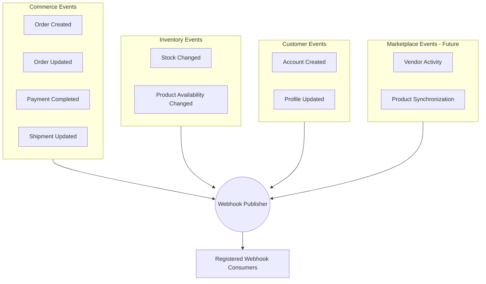
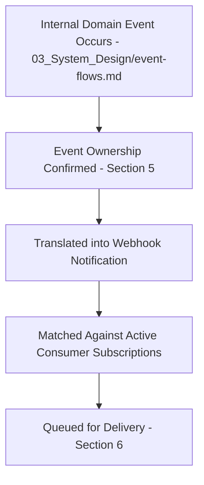
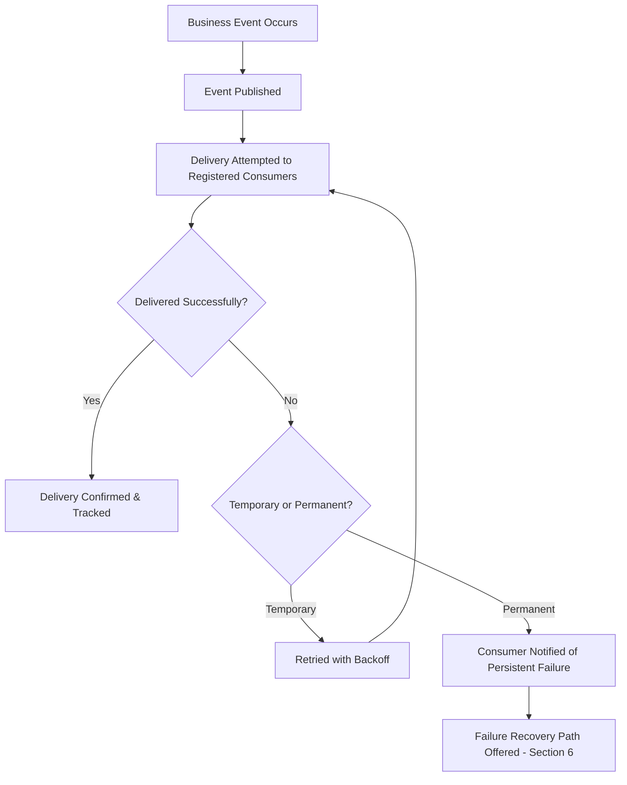
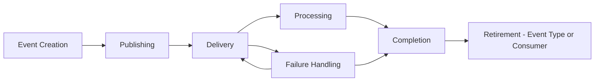
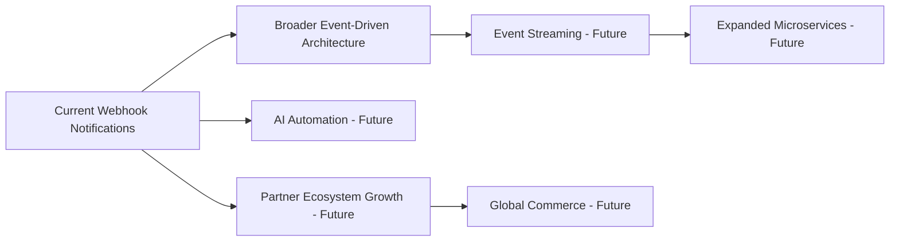
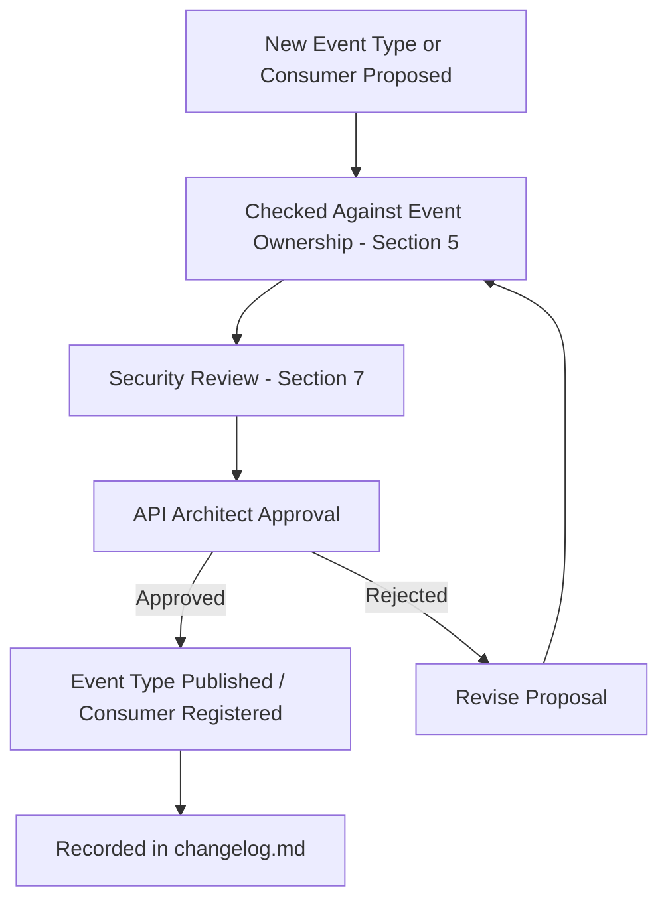

# Enterprise Webhook Architecture and Governance

## 1. Document Purpose

This document establishes the Enterprise Webhook Architecture and Governance for **StackLeo Tech Store**: how the platform notifies external and internal consumers of business events as they happen, without requiring those consumers to continuously ask.

- **Purpose of Webhooks** — to allow interested consumers to learn about significant business events as they occur, without polling the platform repeatedly for changes.
- **Relationship with APIs** — webhooks complement the request/response API surface defined throughout `05_API`; where an API answers "what is the current state," a webhook answers "something just changed."
- **Relationship with Event-Driven Architecture** — webhooks are the external-facing extension of the internal event model defined in `03_System_Design/event-flows.md`, translating internal business events into consumer-facing notifications.
- **Relationship with External Integrations** — webhooks are a primary mechanism for keeping external systems (payment, courier, and future ERP/CRM/marketplace partners) synchronized with StackLeo's business state, per Section 10.
- **Relationship with Real-Time Communication** — webhooks provide near-real-time awareness of business events, supporting timelier integration behavior than periodic polling could achieve.

## 2. Webhook Philosophy

- **Event Notification** — a webhook communicates that something meaningful has happened, not a request for the receiving system to do something specific.
- **Loose Coupling** — a webhook publisher does not need to know what a consumer will do with a notification, and a consumer does not need to know how the event was internally produced.
- **Real-Time Communication** — webhooks are delivered as close to the moment of the underlying event as practically possible.
- **Consumer Independence** — each webhook consumer processes notifications independently, without depending on the presence or behavior of any other consumer.
- **Reliability** — a webhook notification is delivered with a genuine, governed attempt at reliability, per Section 6, not on a best-effort, unaccountable basis.
- **Security** — every webhook notification is verifiable and protected from tampering or spoofing, per Section 7.
- **Scalability** — the webhook architecture accommodates a growing number of event types and consumers without structural rework, consistent with `api-strategy.md` (Section 7).

## 3. Webhook vs API Communication

| Pattern | Communication Pattern | Strengths | Limitations | Appropriate Use Cases |
|---|---|---|---|---|
| Request/Response APIs | Consumer-initiated; a consumer asks and receives an immediate answer. | Simple, predictable, consumer controls timing. | Requires the consumer to know when to ask; inefficient for detecting infrequent changes. | Retrieving current state, such as an Order's current status on demand. |
| Webhooks | Publisher-initiated; the platform notifies a registered consumer as an event occurs. | Timely, efficient; consumer is not required to poll. | Requires the consumer to be reachable and to handle delivery timing outside their own control. | Notifying an external courier integration the moment a shipment is created. |
| Event Streaming | Publisher-initiated, continuous; consumers subscribe to an ongoing flow of events rather than discrete notifications. | Supports high-volume, continuous event consumption and replay. | Requires more sophisticated consumer infrastructure than a simple webhook receiver. | A future analytics platform continuously consuming a high-volume stream of business events. |

### API vs Webhook vs Event Streaming Comparison

| Aspect | Request/Response APIs | Webhooks | Event Streaming |
|---|---|---|---|
| Initiator | Consumer | Publisher (StackLeo) | Publisher (StackLeo), continuous |
| Timing Control | Consumer-controlled | Platform-controlled, event-driven | Platform-controlled, continuous |
| Best Fit | On-demand state retrieval | Discrete event notification | High-volume, continuous consumption |
| Consumer Infrastructure Needs | Minimal | Moderate (reachable receiver) | Higher (stream consumer) |
| Maturity at StackLeo | Current, primary | Near-term future | Longer-term future |

## 4. Webhook Event Categories

### Commerce Events

Examples: Order Created, Order Updated, Order Completed, Payment Completed, Shipment Updated.

- **Business Purpose** — keeps consumers informed of the core transactional lifecycle defined in `resource-model.md` (Section 7), enabling timely downstream action.
- **Consumer Expectations** — consumers expect these events promptly, given their direct connection to fulfillment and financial processes.

### Inventory Events

Examples: Stock Changed, Product Availability Changed.

- **Business Purpose** — keeps consumers, particularly future marketplace vendors and corporate buyers, informed of availability changes without requiring continuous polling of the catalog.
- **Consumer Expectations** — consumers expect timely notification sufficient to avoid acting on stale availability data.

### Customer Events

Examples: Account Created, Profile Updated, Preference Changed.

- **Business Purpose** — supports future integrations such as marketing platforms or CRM systems that need to remain synchronized with customer state.
- **Consumer Expectations** — consumers expect these events to respect the privacy and data governance principles in `04_Database/data-governance.md`.

### Marketplace Events (Future)

Examples: Vendor Activity, Product Synchronization, Partner Updates.

- **Business Purpose** — supports the future Multi-Vendor Marketplace model by keeping vendors and partner systems synchronized with platform-side changes affecting them.
- **Consumer Expectations** — vendors and partners expect events scoped strictly to their own business relationship with the platform.

### Event Category Matrix

| Category | Primary Consumers | Typical Latency Expectation | Business Sensitivity |
|---|---|---|---|
| Commerce Events | Internal services, logistics and payment integrations | Near real-time | High |
| Inventory Events | Internal services, future marketplace vendors, corporate buyers | Near real-time | Medium-High |
| Customer Events | Internal services, future marketing/CRM integrations | Near real-time to short delay acceptable | High (privacy-sensitive) |
| Marketplace Events (Future) | Future marketplace vendors and partners | Near real-time | Medium-High |

*Diagram: Webhook Architecture Overview.*

## 5. Webhook Architecture Principles

- **Event Ownership** — every webhook event is owned by the same domain that owns the underlying resource, per `resource-model.md` (Section 3).
- **Publisher Responsibility** — the platform is responsible for producing accurate, timely, and reliably delivered notifications for every subscribed event.
- **Consumer Responsibility** — a webhook consumer is responsible for processing notifications idempotently and resiliently, per Section 8, since delivery timing and retries are outside its direct control.
- **Event Reliability** — webhook delivery follows a governed retry and tracking discipline, per Section 6, rather than a best-effort, unaccountable approach.
- **Loose Coupling** — publishers and consumers do not depend on each other's internal implementation; only the event's meaning and occurrence are shared.
- **Scalability** — the webhook architecture supports a growing number of event types, consumers, and delivery volume without structural redesign.

*Diagram: Event Publishing Flow.*

## 6. Delivery Strategy

- **Delivery Attempts** — the platform attempts to deliver each webhook notification to every registered, active consumer for that event type.
- **Retry Concepts** — a failed delivery attempt is retried according to a governed schedule, consistent with the Retry Strategy principles in `error-handling.md` (Section 7).
- **Temporary Failures** — failures expected to resolve, such as a momentarily unreachable consumer endpoint, are retried according to Section 6's retry discipline.
- **Permanent Failures** — failures that will not resolve through retry, such as a consumer that has deliberately unregistered, are not retried indefinitely.
- **Delivery Tracking** — every delivery attempt, success, and failure is tracked, supporting both operational visibility and consumer support.
- **Failure Recovery** — a consumer that has missed notifications due to sustained failure has a defined path to recover, such as reviewing delivery history or requesting event replay where supported.

### Delivery Strategy Matrix

| Delivery Consideration | Approach | Business Rationale |
|---|---|---|
| Initial Delivery Attempt | Made as close to the event's occurrence as practical | Supports Real-Time Communication (Section 2) |
| Temporary Failure | Retried with backoff, per `error-handling.md` (Section 7) | Preserves reliable delivery without overwhelming a struggling consumer |
| Permanent Failure | Retries eventually cease; consumer notified of persistent failure | Prevents indefinite, wasted delivery effort |
| Delivery Tracking | Every attempt recorded | Supports Auditability and consumer support, per Section 7 |
| Recovery from Missed Events | Defined path for consumers to recover, where supported | Preserves Consumer Confidence despite transient disruption |

*Diagram: Retry & Failure Recovery Flow.*

## 7. Security Strategy

- **Authentication Relationship** — webhook consumers are verified through a registration process consistent with the identity principles in `authentication.md`, distinct from but aligned with API consumer authentication.
- **Verification Concepts** — every webhook notification carries a means for the receiving consumer to verify it genuinely originated from StackLeo, without this document prescribing a specific verification mechanism.
- **Replay Protection** — webhook delivery is designed so a captured, previously delivered notification cannot be meaningfully reused to deceive a consumer into acting on it again.
- **Trust Boundaries** — webhook consumers are treated as external trust boundaries, consistent with `04_Database/security-model.md`; the platform never assumes a consumer endpoint is inherently trustworthy.
- **Secure Communication** — webhook delivery occurs over a protected communication channel, consistent with the Encryption in Transit principle in `04_Database/security-model.md` (Section 4).
- **Auditability** — every webhook notification and delivery outcome is traceable, consistent with `04_Database/data-governance.md` (Section 3).

### Security Consideration Matrix

| Consideration | Risk If Ignored | Mitigating Practice |
|---|---|---|
| Authentication Relationship | Unregistered or impersonated consumers receiving notifications | Governed consumer registration, per Section 12 |
| Verification Concepts | Consumer unable to distinguish genuine from forged notifications | Verifiable notification origin |
| Replay Protection | Captured notifications reused maliciously | Delivery designed to resist meaningful replay |
| Trust Boundaries | Consumer endpoints treated as inherently trustworthy | Consumers treated as external trust boundaries, per `04_Database/security-model.md` |
| Secure Communication | Notification content exposed in transit | Protected communication channel, per `04_Database/security-model.md` (Section 4) |
| Auditability | Disputed or missed notifications cannot be investigated | Every notification and delivery outcome traced |

## 8. Event Reliability

- **Delivery Guarantees** — the platform provides a clearly stated, governed delivery guarantee (such as "at least once" delivery) so consumers can design their handling logic accordingly.
- **Duplicate Events** — because guaranteed delivery models may occasionally redeliver an already-delivered notification, consumers must be designed to handle duplicates safely.
- **Ordering Challenges** — webhook notifications may not always arrive in the exact order their underlying events occurred; consumers relying on strict ordering must account for this.
- **Consumer Resilience** — consumers are expected to process notifications resiliently, tolerating occasional duplication, reordering, or delay.
- **Idempotent Processing** — webhook consumers apply the same idempotency discipline defined in `idempotency.md` (Section 8) to safely process potentially duplicated notifications.

## 9. Webhook Lifecycle

| Stage | Description |
|---|---|
| Event Creation | A business event occurs within the platform, per `03_System_Design/event-flows.md`. |
| Publishing | The event is translated into a webhook notification and made available for delivery. |
| Delivery | The notification is transmitted to every registered, active consumer, per Section 6. |
| Processing | The receiving consumer processes the notification according to its own business logic. |
| Failure Handling | Delivery failures are retried or escalated, per Section 6. |
| Completion | The notification's delivery lifecycle concludes, successfully or with a recorded permanent failure. |
| Retirement | An event type or a specific consumer registration is formally withdrawn when no longer needed. |

*Diagram: Webhook Delivery Lifecycle.*

## 10. External Integration Strategy

| Integration | Webhook Role |
|---|---|
| Payment Providers | Receiving inbound notification of payment status changes, complementing StackLeo's own outbound Payment Completed events. |
| Courier Services | Receiving StackLeo's Shipment Updated events, and providing inbound delivery status notifications in return. |
| ERP Systems (Future) | Synchronizing order and fulfillment events for Corporate Sales and Wholesale coordination. |
| CRM Systems (Future) | Synchronizing Customer Events to support future relationship management capability. |
| Marketing Platforms (Future) | Consuming Customer Events (with appropriate governance) to support future engagement campaigns. |
| Marketplace Partners (Future) | Consuming Marketplace Events to remain synchronized with vendor and product changes. |
| Analytics Platforms | Consuming a broad range of business events to support near-real-time reporting, complementing the batch-oriented Analytics APIs. |

### Integration Matrix

| Integration | Direction | Criticality | Event Categories Involved |
|---|---|---|---|
| Payment Providers | Inbound and Outbound | Critical | Commerce Events |
| Courier Services | Inbound and Outbound | High | Commerce Events |
| ERP Systems (Future) | Outbound | Medium | Commerce Events |
| CRM Systems (Future) | Outbound | Medium | Customer Events |
| Marketing Platforms (Future) | Outbound | Low-Medium | Customer Events |
| Marketplace Partners (Future) | Outbound | High | Marketplace Events |
| Analytics Platforms | Outbound | Medium | Commerce, Inventory, Customer Events |

## 11. Future Evolution

- **Event-Driven Architecture** — webhooks are the external-facing extension of the platform's broader move toward event-driven internal architecture, per `03_System_Design/event-flows.md`.
- **Event Streaming** — high-volume consumers may eventually transition from discrete webhook notifications to continuous event streaming, per Section 3.
- **Microservices** — as `03_System_Design/service-architecture.md` decomposes further, internal event publishing naturally extends to external webhook notification with minimal additional architecture.
- **AI Automation** — future AI-driven consumers may subscribe to webhook events to trigger automated responses, held to the same reliability and security expectations as any other consumer.
- **Partner Ecosystem** — a growing partner and marketplace vendor ecosystem is accommodated through the same event categories and governance already established in Sections 4 and 12.
- **Global Commerce** — webhook delivery remains reliable and timely as the platform expands operational footprint across South Asia and global markets.

*Diagram supplements the Webhook Architecture Overview (Section 4).*

## 12. Governance

- **Event Ownership** — every webhook event category is owned by the domain that owns its underlying resource, per Section 5.
- **Webhook Approval** — new event types require formal review and approval before being made available for consumer subscription.
- **Consumer Registration** — consumers must formally register to receive webhook notifications, establishing accountability and enabling the security controls in Section 7.
- **Documentation Standards** — this document follows the enterprise Markdown conventions established across this repository.
- **Change Management** — material changes to webhook event structure or delivery guarantees are recorded in `00_Project_Overview/changelog.md`.
- **Versioning** — webhook event contracts follow the same versioning discipline defined in `versioning.md`, ensuring consumers are not broken by unannounced change.

### Governance Responsibilities

| Role | Responsibility |
|---|---|
| API Architect | Owns overall webhook architecture coherence. |
| Domain Owner | Owns the accuracy and business meaning of events within their domain, per Section 4. |
| Security Lead | Reviews webhook security controls, per Section 7. |
| Backend Engineering Lead | Ensures implementations conform to approved webhook architecture. |
| Partner/Integration Manager | Manages consumer registration and communication for external integrations, per Section 10. |

*Diagram: Webhook Governance Lifecycle.*

## 13. Anti-Patterns

| Anti-Pattern | Description | Why It Should Be Avoided |
|---|---|---|
| Unreliable Delivery | Publishing webhook notifications without any delivery tracking or guarantee. | Undermines Reliability (Section 2) and leaves consumers unable to trust the mechanism. |
| No Retry Strategy | Failing to retry delivery after a temporary failure. | Causes silent, avoidable notification loss, conflicting with Section 6. |
| Duplicate Event Handling Failure | Publishing without accounting for the possibility of consumer-side duplicate processing. | Leaves consumers vulnerable to compounding effects from redelivered notifications, per Section 8. |
| Missing Security Verification | Delivering notifications without any means for a consumer to verify authenticity. | Exposes consumers to spoofed or tampered notifications, undermining Section 7. |
| Tight Coupling | Designing events that expose internal implementation detail rather than genuine business meaning. | Undermines Loose Coupling (Section 2) and makes internal changes unnecessarily disruptive to consumers. |
| Poor Documentation | Publishing event types without clear description of their business meaning and expected consumer handling. | Increases consumer integration friction and support burden. |
| Breaking Event Changes | Modifying an existing event's meaning or structure without a governed versioning process. | Directly violates the versioning discipline required by Section 12 and `versioning.md`. |
| Ignoring Consumer Impact | Making event or delivery changes without considering existing subscribed consumers. | Undermines Consumer Independence and damages trust with both internal and external integration partners. |

### Anti-Pattern Summary

| Anti-Pattern | Primary Risk | Mitigating Principle |
|---|---|---|
| Unreliable Delivery | Consumer distrust of the mechanism | Reliability |
| No Retry Strategy | Silent notification loss | Delivery Strategy |
| Duplicate Event Handling Failure | Compounded consumer-side effects | Idempotent Processing |
| Missing Security Verification | Spoofing and tampering risk | Security Strategy |
| Tight Coupling | Unnecessary consumer disruption | Loose Coupling |
| Poor Documentation | Increased integration friction | Documentation Standards |
| Breaking Event Changes | Consumer integration failure | Versioning |
| Ignoring Consumer Impact | Damaged integration trust | Consumer Independence |

## 14. Document Information

| Property | Value |
|----------|-------|
| Document | webhooks.md |
| Version | 1.0.0 |
| Status | Active |
| Maintained By | StackLeo |
| Last Updated | 2026-07-17 |

---

© StackLeo. All Rights Reserved.
