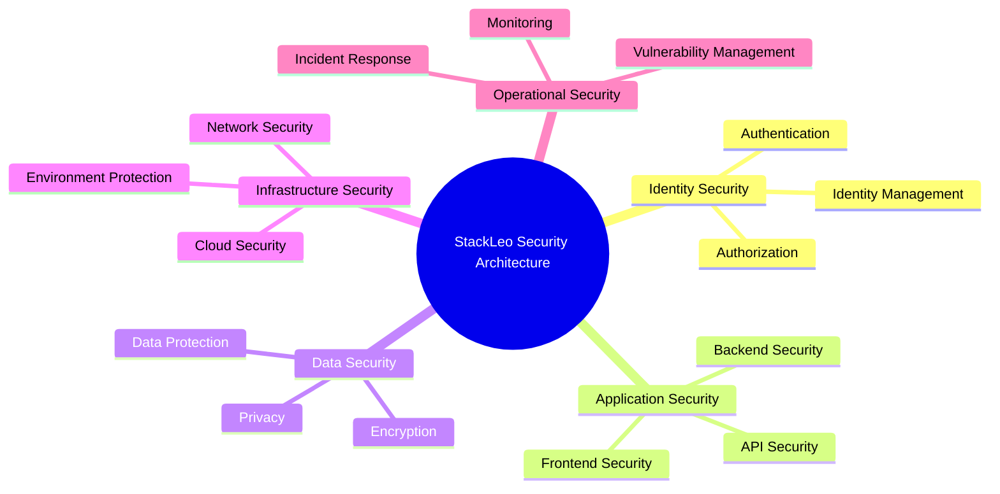
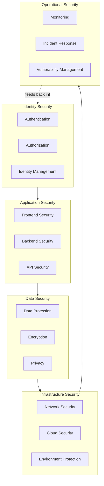
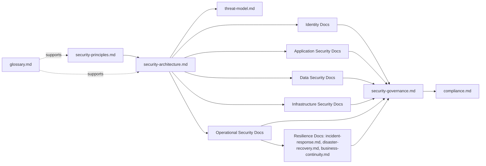
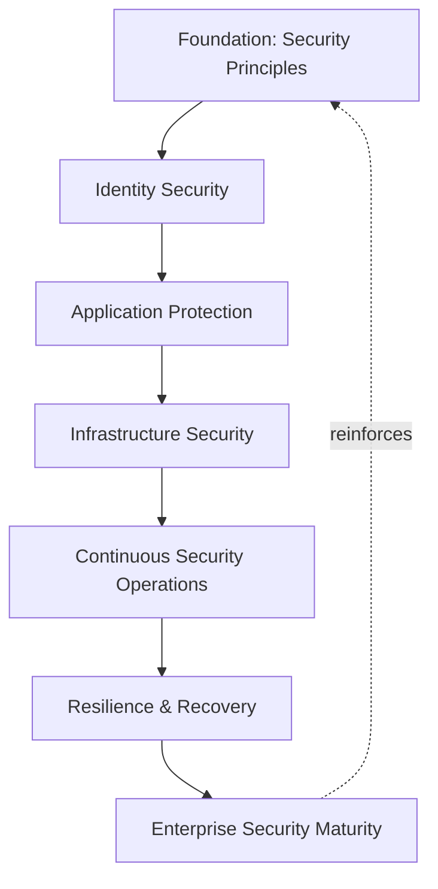
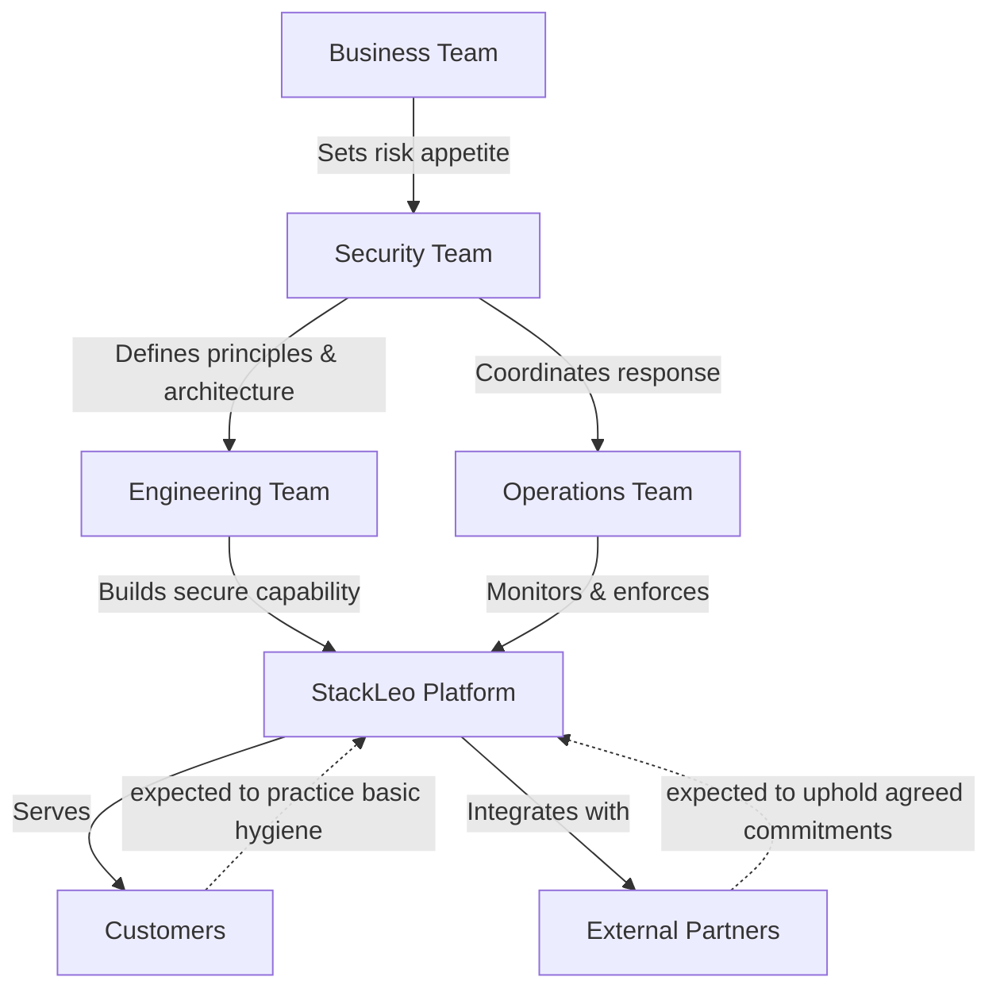

# 06_Security

## 1. Security Documentation Overview

This folder contains the official security architecture documentation for the **StackLeo Tech Store** project. It translates the trust commitments established in `01_Business` and the architectural foundation established in `03_System_Design` into a coherent, technology-agnostic view of how the platform protects its customers, its business, and its partners.

This README describes the contents of this folder only. It is not the project's main README and does not describe the repository as a whole.

- **Purpose of Security Architecture** — to give every reader, regardless of role, a single, authoritative understanding of how StackLeo reasons about security: what it protects, why, and against what class of risk — independent of any specific tool or technology choice made to implement it.
- **Importance of Security-First Design** — StackLeo is a marketplace built on trust: customers share payment relationships, identity, and purchase history; partners and, in time, sellers share business data. Security considered only after a capability is built is materially weaker and costlier than security considered as the capability is conceived, consistent with `03_System_Design/architecture-principles.md` (ARCH-014).
- **Relationship with Enterprise Architecture** — this folder is the security-specific elaboration of the architectural principles defined in `03_System_Design/architecture-principles.md` (Section 7), applied consistently across identity, application, data, infrastructure, and operations.
- **Relationship with Business Trust** — trust is StackLeo's core differentiator, per `01_Business/vision.md`. Every document in this folder exists to protect that trust; a security failure is, without exception, a business failure.
- **Relationship with Customer Protection** — customers extend StackLeo access to sensitive personal and financial context. This folder documents how that access is protected across every stage of the customer relationship and every current and future sales channel.

This documentation is implementation-independent and vendor-neutral. It describes security philosophy, architecture, and governance — not specific products, configurations, or step-by-step implementation procedures.

## 2. Security Vision

StackLeo's security vision rests on six pillars, elaborated fully in `security-principles.md`:

- **Secure by Design** — security is considered at the point a capability is conceived, not layered on afterward.
- **Privacy First** — customer and business data are collected, used, and retained only as far as a legitimate purpose requires.
- **Zero Trust Mindset** — no request, actor, or network location is trusted implicitly; trust is established explicitly and continuously.
- **Defense in Depth** — protection relies on multiple independent layers, so no single control failure results in full compromise.
- **Continuous Improvement** — security posture matures deliberately as the platform, team, and threat landscape evolve.
- **Risk-Based Security** — security investment is proportionate to actual business risk and impact, not applied uniformly regardless of consequence.

## 3. Security Principles

The following principles, fully defined in `security-principles.md`, govern every document in this folder:

- **Least Privilege** — every actor is granted only the access necessary for its defined responsibility.
- **Identity-Centric Security** — identity, not network location, is the primary boundary of trust.
- **Secure Defaults** — the default configuration of any system or account is the most secure reasonable option.
- **Data Protection** — confidentiality, integrity, and availability of data are treated as inseparable, co-equal obligations.
- **Threat Awareness** — realistic adversary behavior and attack paths are actively considered, not assumed away.
- **Continuous Monitoring** — the operational state of the platform is continuously observed so abnormal activity can be recognized early.
- **Resilience** — the platform is designed to detect, contain, and recover from adverse conditions, not merely to prevent them.

### Security Principle Summary

| Principle | Focus | Primary Business Outcome |
|---|---|---|
| Least Privilege | Access scoped to defined responsibility | Limits damage from compromised or misused accounts |
| Identity-Centric Security | Identity as the trust boundary | Consistent protection across Web, future Mobile App, future POS |
| Secure Defaults | Most secure reasonable default state | Reduces risk from oversight or unreviewed configuration |
| Data Protection | Confidentiality, integrity, availability together | Preserves customer and business trust in data handling |
| Threat Awareness | Realistic adversary behavior considered upfront | Reduces exploitable, unanticipated attack paths |
| Continuous Monitoring | Ongoing observation of platform state | Enables early detection rather than after-the-fact discovery |
| Resilience | Detect, contain, and recover from adversity | Preserves business continuity through disruption |

*Diagram 1: Security Architecture Overview.*

## 4. Security Architecture Scope

This folder's documentation is organized into five coverage areas, each addressed by a dedicated set of documents:

### Identity Security

Covers how every human and system actor is identified, verified, and granted access:

- **Authentication** — verifying that an actor is who they claim to be.
- **Authorization** — determining what a verified actor is permitted to do.
- **Identity Management** — the lifecycle of identities from creation through deactivation.

### Application Security

Covers how the platform's software itself resists misuse and attack:

- **Frontend Security** — protection of the customer- and staff-facing experience layer.
- **Backend Security** — protection of business logic and server-side processing.
- **API Security** — protection of the contracts through which channels and external parties interact with the platform.

### Data Security

Covers how information is protected across its lifecycle:

- **Data Protection** — confidentiality, integrity, and availability of business and customer data.
- **Encryption** — protection of data in transit and at rest, conceptually.
- **Privacy** — ensuring data is used only as a customer would reasonably expect.

### Infrastructure Security

Covers how the environment the platform runs in is protected:

- **Network Security** — protection of communication paths between components and with the outside world.
- **Cloud Security** — protection considerations specific to elastic, provider-hosted infrastructure.
- **Environment Protection** — separation and protection of development, staging, and production environments.

### Operational Security

Covers how the platform is protected while running:

- **Monitoring** — continuous observation of security-relevant and operational state.
- **Incident Response** — organized detection, containment, and recovery from security events.
- **Vulnerability Management** — ongoing identification and remediation of weaknesses.

*Diagram 2: Defense in Depth Model — each coverage area forms an independent layer of protection; the operational layer continuously informs and strengthens the layers beneath it.*

## 5. Security Documentation Map

| Document | Purpose |
|---|---|
| `security-principles.md` | Defines the foundational security philosophy, guiding principles, and trust model for the platform. |
| `security-architecture.md` | Describes the conceptual security architecture spanning identity, application, data, infrastructure, and operations. |
| `threat-model.md` | Identifies realistic threat actors, attack surfaces, and business-relevant threat scenarios. |
| `identity-management.md` | Defines the lifecycle of human and system identities across the platform. |
| `authentication.md` | Defines how actor identity is verified before access is considered. |
| `authorization.md` | Defines how verified identities are granted scoped access to capability and data. |
| `data-protection.md` | Defines confidentiality, integrity, availability, and classification principles for platform data. |
| `encryption.md` | Defines the conceptual approach to protecting data in transit and at rest. |
| `secrets-management.md` | Defines principles for protecting credentials, keys, and other sensitive operational material. |
| `application-security.md` | Defines the overarching approach to securing platform software across all layers. |
| `api-security.md` | Defines security principles specific to API contracts and external/internal consumers. |
| `frontend-security.md` | Defines security principles specific to the customer- and staff-facing experience layer. |
| `backend-security.md` | Defines security principles specific to business logic and server-side processing. |
| `infrastructure-security.md` | Defines security principles for the runtime environment underpinning the platform. |
| `network-security.md` | Defines security principles for communication paths within and beyond the platform. |
| `vulnerability-management.md` | Defines the approach to identifying, prioritizing, and remediating weaknesses over time. |
| `security-testing.md` | Defines the philosophy and cadence for verifying security assumptions rather than assuming them. |
| `incident-response.md` | Defines how security incidents are detected, contained, recovered from, and learned from. |
| `disaster-recovery.md` | Defines how critical business capability is recovered after a severely disruptive event. |
| `business-continuity.md` | Defines how the business sustains critical operation through disruption, coordinating recovery with continued customer service. |
| `compliance.md` | Defines how security architecture supports applicable legal and regulatory obligations. |
| `security-governance.md` | Defines ownership, policy management, and review processes for security across the organization. |
| `glossary.md` | Defines security-specific terminology used consistently across this folder. |

*Diagram 3: Security Documentation Map — foundational principles and architecture inform every domain-specific document, converging on governance and compliance.*

## 6. Security Architecture Evolution

Security maturity at StackLeo builds in deliberate layers, each depending on the one before it:

*Diagram 5: Security Maturity Evolution.*

### Security Evolution Roadmap

| Stage | Focus | Representative Documents |
|---|---|---|
| Foundation | Establish guiding philosophy and non-negotiable principles. | `security-principles.md` |
| Identity Security | Establish who every actor is and what they may do. | `identity-management.md`, `authentication.md`, `authorization.md` |
| Application Protection | Secure the software surfaces customers and staff interact with. | `application-security.md`, `frontend-security.md`, `backend-security.md`, `api-security.md` |
| Infrastructure Security | Secure the environment the platform runs in. | `infrastructure-security.md`, `network-security.md` |
| Continuous Security Operations | Sustain protection through monitoring, response, and remediation. | `vulnerability-management.md`, `security-testing.md`, `secrets-management.md` |
| Resilience & Recovery | Sustain business operation through incidents and severe disruption. | `incident-response.md`, `disaster-recovery.md`, `business-continuity.md` |
| Enterprise Security Maturity | Sustain governance, compliance, and continuous improvement at scale. | `security-governance.md`, `compliance.md` |

This progression is deliberate rather than incidental: identity must be trustworthy before application access decisions are meaningful; applications must be secured before the infrastructure they run on can be reasoned about in isolation; and continuous operations and governance are what allow maturity, once reached, to be sustained rather than lost as the platform grows.

## 7. Security Responsibilities

Security at StackLeo is a shared responsibility, not the sole obligation of any one team:

- **Business Team** — sets risk appetite, defines the customer trust commitments security must protect, and ensures security investment is prioritized against genuine business impact.
- **Engineering Team** — applies secure design and coding practice as a normal part of building capability, consistent with `security-principles.md` (Section 8).
- **Security Team** — owns the coherence of security principles and architecture, leads threat modeling and risk assessment, and coordinates response to security events.
- **Operations Team** — maintains continuous monitoring, operational resilience, and day-to-day enforcement of access and configuration discipline.
- **External Partners** — (couriers, payment providers, future marketplace sellers) are expected to uphold security commitments proportionate to the access and data they are granted, per agreements referenced in `03_System_Design/integration-architecture.md`.
- **Customers** — are supported in protecting their own accounts (credential hygiene, awareness of phishing) through platform design that makes secure behavior the easiest behavior.

### Security Responsibility Matrix

| Stakeholder | Primary Responsibility | Accountable For |
|---|---|---|
| Business Team | Risk appetite and prioritization | Aligning security investment with business impact |
| Engineering Team | Secure design and implementation | Applying security principles in day-to-day build decisions |
| Security Team | Architecture, threat modeling, response coordination | Coherence and enforcement of security principles |
| Operations Team | Monitoring and operational enforcement | Day-to-day detection and operational resilience |
| External Partners | Upholding agreed security commitments | Security of their own systems where they touch StackLeo data |
| Customers | Protecting their own account and credentials | Practicing basic account security hygiene |

*Diagram 4: Security Responsibility Model.*

## 8. Future Security Readiness

This folder's documentation is deliberately structured to remain valid as StackLeo's scope grows:

- **Global Expansion** — as StackLeo grows from Bangladesh into South Asia and beyond, security principles and architecture remain jurisdiction-agnostic, allowing region-specific obligations to layer on without redefinition.
- **Public APIs** — as capability is exposed to external consumers per `05_API/api-strategy.md`, `api-security.md` extends identity-centric and Zero Trust principles to every external caller.
- **Marketplace Platform** — the shift to a multi-vendor marketplace introduces sellers as a new external actor class, governed by the same identity, authorization, and data protection principles as internal roles.
- **AI Features** — AI-assisted capability (search, recommendations, fraud detection) is subject to the same least-privilege and data-minimization principles as any other system actor.
- **Partner Ecosystem** — a growing network of couriers, payment providers, and future sellers is onboarded against consistent security expectations rather than ad hoc, per-partner exceptions.
- **Enterprise Customers** — corporate and wholesale customers bring heightened expectations for access governance, auditability, and contractual assurance, which this documentation set is structured to support.
- **Regulatory Requirements** — as StackLeo's markets expand, `compliance.md` provides the structure through which new regulatory obligations are absorbed without disrupting the underlying security philosophy.

## 9. Security Governance

- **Security Ownership** — a designated Security Lead owns the coherence, currency, and enforcement of this folder's documentation, detailed further in `security-governance.md`.
- **Policy Management** — operational security policies are derived from the principles in this folder and maintained as living documents, reviewed on a defined cadence.
- **Security Reviews** — significant architectural, product, and operational decisions are evaluated against this folder's principles before adoption, mirroring the review process in `03_System_Design/architecture-decisions.md`.
- **Risk Assessment** — risk is identified, assessed, and either mitigated or knowingly accepted, following the risk philosophy defined in `security-principles.md` (Section 5).
- **Continuous Improvement** — this folder's documentation, and the practice it describes, is expected to mature over time as the platform, organization, and threat landscape evolve, rather than being fixed at any single point in time.

## 10. Document Information

| Property | Value |
|----------|-------|
| Document | README.md |
| Folder | 06_Security |
| Version | 1.0.0 |
| Status | Active |
| Maintained By | StackLeo |
| Last Updated | 2026-07-17 |

---

© StackLeo. All Rights Reserved.
