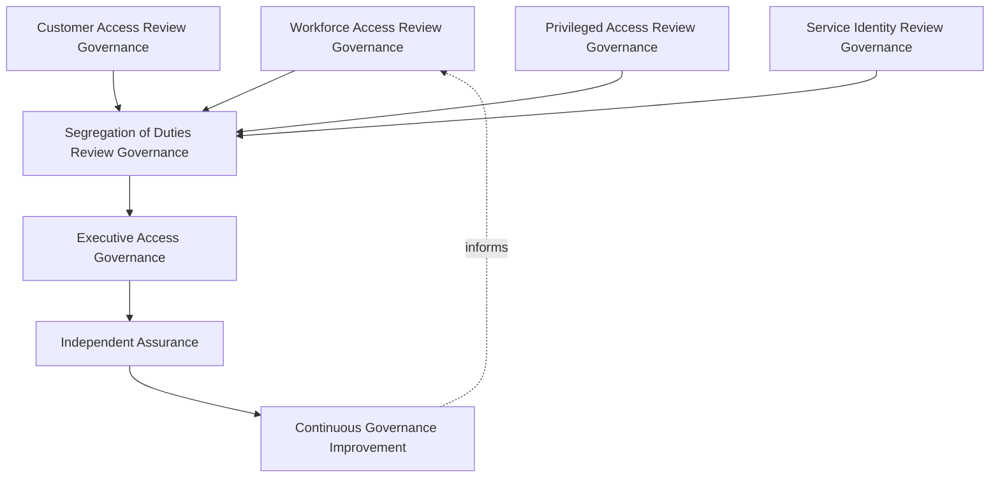
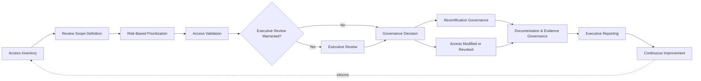
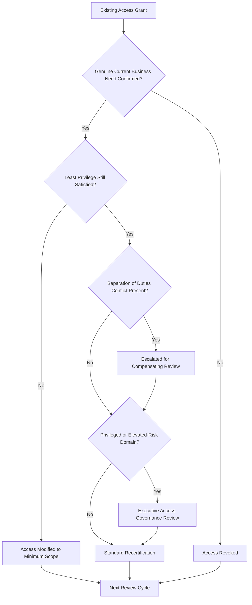
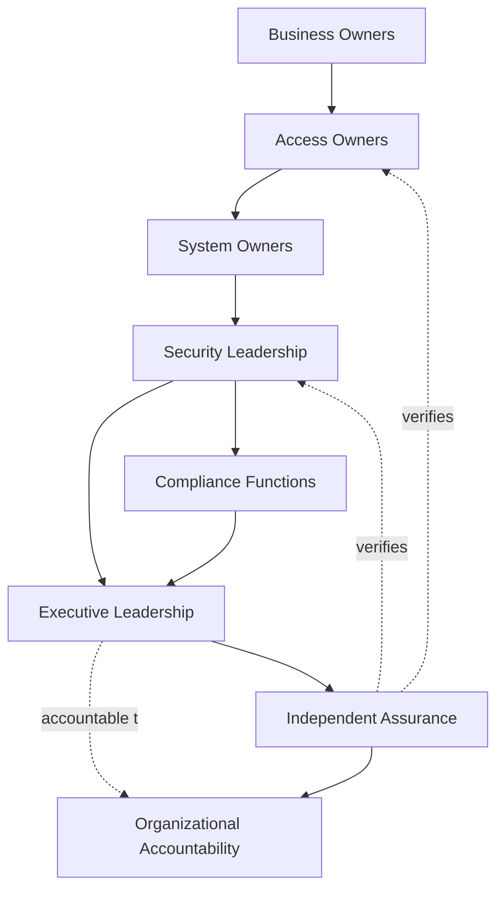
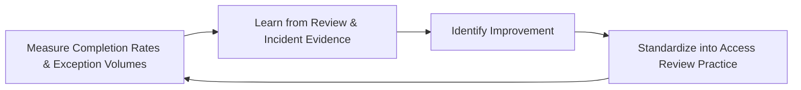
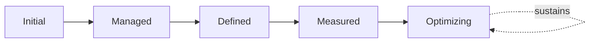

# Enterprise Access Review & Recertification Governance Strategy

## 1. Document Purpose

This document defines the official Enterprise Access Review & Recertification Governance Strategy for **StackLeo Tech Store** — the CISO/CIDO-owned executive charter under which every access grant on the platform is periodically, deliberately, and independently reassessed for continued justification. It establishes access review governance, entitlement recertification governance, privileged access review governance, segregation of duties review governance, organizational accountability, executive oversight, and long-term access governance maturity, consistent with ISO/IEC 27001, the NIST Cybersecurity Framework, Zero Trust principles, and TOGAF enterprise architecture thinking.

Access review is the verification mechanism that makes every other access governance commitment genuinely true over time, not only at the moment of grant. `identity-access-strategy.md` establishes that access must be justified when granted; `authorization-governance.md` (Section 5.7, Periodic Authorization Review) and `privileged-access-management.md` each reference a periodic reassessment obligation; this document exists because that obligation — proving, on a recurring and independent basis, that every grant still deserves to exist — carries enough distinct process, evidentiary, and assurance weight to warrant its own dedicated governance treatment, referenced by every access-governing document in `06_Security` rather than restated within each.

- **Purpose of Access Review Governance** — to ensure that access, once granted, is never assumed to remain justified indefinitely; every entitlement is independently and periodically reassessed against genuine current need, and unjustified access is identified and removed before it becomes a realized risk.
- **Relationship with Identity & Access Management** — this strategy is the review-and-recertification-specific elaboration of `identity-access-strategy.md`; where that strategy governs identity and access as a whole, this document governs specifically how existing access is verified to still be correct.
- **Relationship with Authorization Governance** — `authorization-governance.md` governs how access is granted, scoped, and modified; this strategy governs how that same access is subsequently and independently confirmed to still be justified, closing the loop that authorization governance opens.
- **Relationship with Privileged Access Management** — the review obligation is at its most consequential for the identities `privileged-access-management.md` governs; this strategy applies its highest rigor and shortest cadence expectations to privileged and administrative access.
- **Relationship with Internal Controls** — access review is one of the primary detective controls in StackLeo's control environment; this strategy provides the governance structure `internal-controls.md`'s control assurance depends on for evidence that access-related controls are genuinely operating, not merely documented.
- **Relationship with Compliance Governance** — access review and recertification evidence is among the most frequently requested artifacts in regulatory and contractual audits; this strategy ensures that evidence is reliably and consistently produced, coordinated with `compliance.md`.
- **Relationship with Enterprise Governance** — access review governance is not a separate structure from how StackLeo governs the rest of the business; it is the review-specific application of the same executive accountability, policy discipline, and control assurance applied enterprise-wide in `policy-management.md`, `internal-controls.md`, and `audit-governance.md`.

This document is implementation-independent and vendor-neutral. It defines access review governance philosophy, model, domains, and lifecycle conceptually — not specific IGA vendors, IAM platforms, governance software, cloud providers, consulting firms, security products, review schedules, approval workflows, access certification procedures, entitlement review implementations, infrastructure configurations, deployment architectures, operational processes, or code.

## 2. Access Review Governance Philosophy

Access review governance at StackLeo rests on eight principles. Each exists to produce a specific business outcome — access is periodically reverified because a grant's justification at one moment in time does not guarantee its justification at the next.

### 2.1 Trust Requires Verification

No access, once granted, is trusted to remain correct indefinitely; its continued justification must be periodically and deliberately reconfirmed.

- **Business Value** — ensures the organization's confidence in its access posture rests on genuine, recent verification, not aging assumption.

### 2.2 Continuous Access Assurance

Assurance over the access posture is treated as an ongoing state to be maintained, not a periodic event to be completed and then forgotten until the next cycle.

- **Business Value** — narrows the window during which unjustified access can exist undetected between formal review cycles.

### 2.3 Least Privilege Validation

Review exists specifically to confirm that access remains scoped to genuine current need, validating the Least Privilege commitment made at the point of grant.

- **Business Value** — catches the natural accumulation of excess access that occurs as roles and responsibilities evolve over time.

### 2.4 Accountability

Every access review decision — retain, modify, or revoke — traces to a specific, named, responsible reviewer.

- **Business Value** — ensures every review outcome has someone genuinely responsible for defending its judgment.

### 2.5 Independent Oversight

Review is conducted, or independently verified, by a party distinct from the one who originally granted or who currently holds the access.

- **Business Value** — prevents review from becoming a self-certifying formality that reconfirms its own assumptions.

### 2.6 Governance by Design

Access review governance structures are established deliberately as an access domain is introduced, not retrofitted once unreviewed access has already accumulated.

- **Business Value** — prevents the costly, high-visibility discovery of review gaps only after an incident or audit has already demonstrated their absence.

### 2.7 Business Alignment

Access review governance decisions are made in service of genuine business need, never imposed as friction disconnected from real operational reality.

- **Business Value** — keeps access review genuinely followed rather than resented as a rubber-stamping exercise disconnected from actual work.

### 2.8 Continuous Improvement

Access review governance practice matures over time, informed by real review findings, incidents, and the organization's growth in scale and complexity.

- **Business Value** — keeps access review governance aligned with StackLeo's growth in workforce, customer base, and partner ecosystem.

## 3. Enterprise Access Review Governance Model

Access review governance operates across eight conceptual layers, each holding accountability for a distinct dimension of review and recertification practice.

### 3.1 Workforce Access Review Governance

- **Purpose** — own the coherence of how employee and contractor access is periodically reassessed.
- **Governance Scope** — oversight of Workforce Access review (Section 4.1), coordinated with `identity-lifecycle.md` for role-change events.
- **Business Value** — ensures workforce access reflects actual current role, not historical assignment left unexamined.
- **Executive Expectations** — leadership trusts workforce access review occurs on a predictable, organization-wide cadence.

### 3.2 Customer Access Review Governance

- **Purpose** — own the coherence of how customer access to their own account and data is periodically reassessed.
- **Governance Scope** — oversight of Customer Access review (Section 4.4), coordinated with `privacy.md`.
- **Business Value** — protects the trust relationship every customer transaction depends on.
- **Executive Expectations** — leadership expects customer access review to protect trust without adding friction to genuine shopping.

### 3.3 Privileged Access Review Governance

- **Purpose** — own the elevated review rigor administrative and other high-impact access requires.
- **Governance Scope** — oversight of Administrative and Privileged Access (Sections 4.2–4.3), coordinated with `privileged-access-management.md`.
- **Business Value** — ensures the access with the greatest potential impact receives commensurately greater and more frequent scrutiny.
- **Executive Expectations** — leadership expects privileged access review to occur more frequently than standard access review, without exception.

### 3.4 Service Identity Review Governance

- **Purpose** — own the coherence of how service, machine, and automated identity access is periodically reassessed.
- **Governance Scope** — oversight of Service & Machine, API & Integration, and AI Agent Access (Sections 4.6–4.8), coordinated with `service-identity-governance.md`.
- **Business Value** — prevents non-human access from becoming an ungoverned blind spot, since it is often granted broad access and rarely draws scrutiny.
- **Executive Expectations** — leadership trusts service identity access review occurs with the same rigor as human access review.

### 3.5 Segregation of Duties Review Governance

- **Purpose** — own the coherence of how conflicting or high-risk combinations of access are identified during review, not only at the point of initial grant.
- **Governance Scope** — oversight of separation-of-duties conflicts across every domain in Section 4, complementing the preventive control in `authorization-governance.md` (Section 3.4).
- **Business Value** — catches conflicting access combinations that accumulate gradually across multiple, individually reasonable grants.
- **Executive Expectations** — leadership expects segregation-of-duties conflicts to be identified proactively during review, not discovered after misuse.

### 3.6 Executive Access Governance

- **Purpose** — own executive-level accountability for the access review outcomes carrying the greatest organizational consequence.
- **Governance Scope** — oversight spanning Sections 3.1–3.5 wherever a review finding rises to genuine executive concern.
- **Business Value** — ensures the most consequential review findings are visible at the level accountable for organizational risk.
- **Executive Expectations** — leadership expects to be informed of, not surprised by, the platform's highest-risk review findings.

### 3.7 Independent Assurance

- **Purpose** — own the independent verification that access review is genuinely occurring and genuinely effective, distinct from the operational function performing it.
- **Governance Scope** — oversight of review completeness, quality, and evidentiary sufficiency across every layer of this model.
- **Business Value** — prevents review effectiveness from being assumed on the word of the same function conducting the review.
- **Executive Expectations** — leadership trusts an independent party periodically confirms review is genuinely happening as documented.

### 3.8 Continuous Governance Improvement

- **Purpose** — govern the mechanism by which every other layer in this model matures over time.
- **Governance Scope** — consolidates findings from review outcomes, audits, and incidents across every domain in Section 4.
- **Business Value** — prevents access review governance itself from becoming the next thing that quietly stagnates as the organization scales.
- **Executive Expectations** — leadership expects review maturity to be assessed periodically, not assumed static once established.

### Enterprise Access Review Governance Matrix

| Layer | Purpose | Business Value | Executive Expectations |
|---|---|---|---|
| Workforce Access Review Governance | Own coherence of periodic employee/contractor review | Ensures access reflects actual current role | Trusts review occurs on a predictable, organization-wide cadence |
| Customer Access Review Governance | Own coherence of periodic customer access review | Protects the trust relationship every transaction depends on | Expects protection without added shopping friction |
| Privileged Access Review Governance | Own elevated review rigor for high-impact access | Ensures greatest-impact access gets greatest, most frequent scrutiny | Expects more frequent review than standard access, without exception |
| Service Identity Review Governance | Own coherence of periodic non-human identity review | Prevents non-human access becoming an ungoverned blind spot | Trusts service identity review gets the same rigor as human review |
| Segregation of Duties Review Governance | Own coherence of identifying conflicting access combinations | Catches conflicts accumulated across individually reasonable grants | Expects conflicts identified proactively, not after misuse |
| Executive Access Governance | Own executive accountability for highest-consequence findings | Ensures the most consequential findings are visible to leadership | Expects leadership informed of, not surprised by, top findings |
| Independent Assurance | Own independent verification that review is genuinely effective | Prevents effectiveness being assumed on the reviewer's own word | Trusts an independent party periodically confirms review is real |
| Continuous Governance Improvement | Govern maturation of every other layer | Prevents governance itself from stagnating | Expects maturity to be assessed periodically |

*Diagram 1: Enterprise Access Review Governance Framework — domain-specific review governance across workforce, customer, privileged, and service identities converges on segregation-of-duties review, escalates to executive access governance, and is independently assured before feeding continuous improvement back into the model.*

## 4. Enterprise Access Review Domains

Access review is governed across ten conceptual domains, each requiring a distinct review emphasis and cadence.

### 4.1 Workforce Access

- **Purpose** — periodically reassess access held by StackLeo's own employees and contractors.
- **Governance Considerations** — governed under Workforce Access Review Governance (Section 3.1), coordinated with `identity-lifecycle.md` for role-change events.
- **Business Importance** — protects internal systems and data from access that has outlived its legitimate role basis.
- **Executive Expectations** — leadership expects workforce access review to occur on a predictable, regular cadence.

### 4.2 Administrative Access

- **Purpose** — periodically reassess access held by staff with elevated capability to administer platform, security, or business-critical systems.
- **Governance Considerations** — governed under Privileged Access Review Governance (Section 3.3), coordinated with `privileged-access-management.md`.
- **Business Importance** — protects against one of the highest-consequence categories of unreviewed access.
- **Executive Expectations** — leadership expects administrative access review to be the shortest-cadence review this model performs.

### 4.3 Privileged Access

- **Purpose** — periodically reassess access held by any actor — human or machine — capable of affecting the platform broadly.
- **Governance Considerations** — governed under Privileged Access Review Governance (Section 3.3), receiving StackLeo's highest review scrutiny regardless of the domain the identity otherwise belongs to.
- **Business Importance** — protects against the single highest-consequence category of unreviewed access on the platform.
- **Executive Expectations** — leadership expects privileged status itself, not just administrative title, to trigger elevated review.

### 4.4 Customer Access

- **Purpose** — periodically reassess customer access to their own account and data.
- **Governance Considerations** — governed under Customer Access Review Governance (Section 3.2), coordinated with `privacy.md`.
- **Business Importance** — foundation of the direct-to-consumer relationship and repeat commerce central to the B2C model.
- **Executive Expectations** — leadership expects customer access review to be proportionate and never intrusive to genuine shopping.

### 4.5 Vendor & Partner Access

- **Purpose** — periodically reassess access held by external suppliers, service providers, and future marketplace sellers and B2B relationships.
- **Governance Considerations** — governed under Segregation of Duties Review Governance (Section 3.5) in coordination with `identity-federation.md`, anticipating the multi-vendor marketplace model.
- **Business Importance** — protects the integrations commerce depends on and the trust foundation the marketplace model will depend on.
- **Executive Expectations** — leadership expects vendor and partner access to be reviewed against the current, active relationship, not the original agreement alone.

### 4.6 Service & Machine Access

- **Purpose** — periodically reassess access held by non-human identities interacting with one another.
- **Governance Considerations** — governed under Service Identity Review Governance (Section 3.4), coordinated with `service-identity-governance.md`.
- **Business Importance** — protects against the common failure mode where service and machine access accumulates broad, unreviewed scope over time.
- **Executive Expectations** — leadership expects service and machine access to be reviewed with the same rigor as human access.

### 4.7 API & Integration Access

- **Purpose** — periodically reassess access granted through StackLeo's integration surface.
- **Governance Considerations** — governed under Service Identity Review Governance (Section 3.4), scoped to whether the underlying integration purpose remains current.
- **Business Importance** — protects the integration surface connecting StackLeo to payment, courier, and communication partners.
- **Executive Expectations** — leadership expects API and integration access to be reviewed whenever the integration's purpose or ownership changes.

### 4.8 AI Agent Access

- **Purpose** — periodically reassess access held by autonomous or semi-autonomous AI-driven actors.
- **Governance Considerations** — governed under Service Identity Review Governance (Section 3.4) as a distinct, named category, anticipating growing AI-assisted capability.
- **Business Importance** — protects against a category of identity that can act at scale and speed, making unreviewed access especially consequential.
- **Executive Expectations** — leadership expects AI agent access to be reviewed on the same or greater cadence than human access.

### 4.9 Temporary & External Access

- **Purpose** — periodically reassess access granted for a bounded purpose or duration — contractors, seasonal staff, auditors, or other externally sourced access needs.
- **Governance Considerations** — governed jointly across Workforce and Segregation of Duties Review Governance (Sections 3.1, 3.5), with expiration itself subject to review confirmation.
- **Business Importance** — prevents temporary or externally sourced access from silently becoming a permanent, unreviewed grant.
- **Executive Expectations** — leadership expects every temporary or external grant's continued validity to be confirmed before its expiration, not after.

### 4.10 Federated Access

- **Purpose** — periodically reassess access extended to identities originating from an externally trusted organization.
- **Governance Considerations** — governed under Segregation of Duties Review Governance (Section 3.5) in coordination with `identity-federation.md`.
- **Business Importance** — protects against risk introduced by parties outside StackLeo's direct organizational control, while enabling corporate and B2B relationships.
- **Executive Expectations** — leadership expects federated access to be reviewed on a cadence independent of the federated organization's own review practice.

### Enterprise Access Review Domain Matrix

| Domain | Purpose | Business Importance | Executive Expectations |
|---|---|---|---|
| Workforce Access | Periodically reassess employee/contractor access | Protects systems from access outliving its role basis | Reviewed on a predictable, regular cadence |
| Administrative Access | Periodically reassess elevated administrative access | Protects against a high-consequence unreviewed-access category | Reviewed on the shortest cadence this model performs |
| Privileged Access | Periodically reassess access capable of broad platform impact | Protects against the single highest-consequence risk category | Privileged status itself triggers elevated review |
| Customer Access | Periodically reassess customer account/data access | Foundation of the direct-to-consumer relationship | Proportionate, never intrusive to genuine shopping |
| Vendor & Partner Access | Periodically reassess supplier/provider/marketplace access | Protects integrations and the future marketplace trust foundation | Reviewed against the current, active relationship |
| Service & Machine Access | Periodically reassess non-human, application-level access | Prevents accumulation of broad, unreviewed scope | Reviewed with the same rigor as human access |
| API & Integration Access | Periodically reassess integration-surface access | Protects the integration surface commerce depends on | Reviewed when integration purpose or ownership changes |
| AI Agent Access | Periodically reassess autonomous AI-driven access | Protects against scale-and-speed risk of unreviewed AI access | Reviewed on the same or greater cadence than human access |
| Temporary & External Access | Periodically reassess bounded-purpose or bounded-duration access | Prevents temporary access silently becoming permanent | Continued validity confirmed before expiration, not after |
| Federated Access | Periodically reassess externally trusted identity access | Protects against risk from parties outside organizational control | Reviewed on a cadence independent of the partner's own practice |

## 5. Enterprise Access Review Lifecycle

Access review proceeds through ten conceptual lifecycle stages, applicable across every domain in Section 4.

### 5.1 Access Inventory

- **Purpose** — establish a complete, current record of what access exists, for whom, and why.
- **Governance Objectives** — require the inventory to span every domain in Section 4, never limited to the domains most convenient to enumerate.
- **Business Value** — ensures review begins from a genuinely complete picture, not a partial one that leaves blind spots unexamined.

### 5.2 Review Scope Definition

- **Purpose** — formally determine which access, identities, and domains a given review cycle will cover.
- **Governance Objectives** — require scope to be deliberately defined and documented, never left implicit or assumed.
- **Business Value** — ensures reviewers and stakeholders share a clear, common understanding of what is and is not being examined.

### 5.3 Risk-Based Prioritization

- **Purpose** — direct review attention toward the access carrying the greatest genuine consequence first.
- **Governance Objectives** — require prioritization to reflect genuine risk — privilege level, data sensitivity, business impact — not administrative convenience.
- **Business Value** — ensures limited review capacity is spent where a mistaken retention would cost the business the most.

### 5.4 Access Validation

- **Purpose** — confirm whether each in-scope access grant reflects a genuine, current business need.
- **Governance Objectives** — require validation to be evidence-based, referencing actual current role and responsibility, not assumption.
- **Business Value** — is the point at which unjustified access is actually identified, the core purpose of this entire strategy.

### 5.5 Executive Review

- **Purpose** — escalate findings of genuine organizational consequence to executive attention.
- **Governance Objectives** — require escalation criteria to be defined in advance, consistent with Executive Access Governance (Section 3.6).
- **Business Value** — ensures leadership is engaged specifically where its judgment and authority are genuinely needed.

### 5.6 Governance Decision

- **Purpose** — formally decide, for each validated grant, whether it is retained, modified, or revoked.
- **Governance Objectives** — require every decision to trace to a specific, accountable reviewer, consistent with Accountability (Section 2.4).
- **Business Value** — ensures review produces an actual, actionable outcome rather than a passive observation.

### 5.7 Recertification Governance

- **Purpose** — formally record that a retained grant has been reconfirmed as justified for the current period.
- **Governance Objectives** — require recertification to be an explicit, positive action, never an absence of objection treated as approval.
- **Business Value** — creates a clear, affirmative record that someone accountable genuinely stands behind each retained grant.

### 5.8 Documentation & Evidence Governance

- **Purpose** — govern how review activity and its outcomes are recorded in a form suitable for independent review.
- **Governance Objectives** — require every inventory, decision, and recertification to leave a durable, reviewable record.
- **Business Value** — ensures access review governance can be independently verified, not merely asserted.

### 5.9 Executive Reporting

- **Purpose** — communicate review outcomes, trends, and exceptions to executive leadership.
- **Governance Objectives** — require reporting to occur on a predictable cadence, consistent with Section 8.
- **Business Value** — ensures leadership maintains genuine visibility into the organization's access posture over time.

### 5.10 Continuous Improvement

- **Purpose** — apply lessons from review outcomes to strengthen future review cycles and upstream authorization practice.
- **Governance Objectives** — require findings to be genuinely analyzed for recurring patterns, not treated as isolated, one-off exceptions.
- **Business Value** — turns each review cycle into an input that makes the next cycle, and the authorization practice it examines, genuinely better.

### Access Review Lifecycle Matrix

| Stage | Purpose | Governance Objective | Business Value |
|---|---|---|---|
| Access Inventory | Establish a complete, current record of what access exists | Spans every domain, never limited to convenient ones | Ensures review begins from a genuinely complete picture |
| Review Scope Definition | Determine which access a review cycle will cover | Deliberately defined and documented, never implicit | Ensures a clear, common understanding of what is examined |
| Risk-Based Prioritization | Direct attention toward the greatest genuine consequence | Reflects genuine risk, not administrative convenience | Ensures limited capacity is spent where it matters most |
| Access Validation | Confirm each grant reflects genuine, current need | Evidence-based, referencing actual role and responsibility | The point where unjustified access is actually identified |
| Executive Review | Escalate findings of genuine organizational consequence | Escalation criteria defined in advance | Ensures leadership engaged where judgment is genuinely needed |
| Governance Decision | Decide whether each grant is retained, modified, revoked | Every decision traces to an accountable reviewer | Ensures review produces an actionable outcome |
| Recertification Governance | Record that a retained grant is reconfirmed as justified | An explicit, positive action, never an absence of objection | Creates an affirmative record someone stands behind |
| Documentation & Evidence Governance | Record review activity for independent review | Every inventory, decision, recertification leaves a record | Ensures governance can be independently verified |
| Executive Reporting | Communicate outcomes, trends, exceptions to leadership | Occurs on a predictable cadence | Ensures leadership maintains genuine visibility over time |
| Continuous Improvement | Apply lessons to strengthen future cycles and upstream practice | Findings genuinely analyzed for recurring patterns | Makes each cycle, and the practice it examines, better |

*Diagram 2: Enterprise Access Review Lifecycle — access is inventoried, scoped, prioritized by risk, and validated, escalating to executive review where warranted, before a governance decision produces recertification or revocation, documented, reported, and fed into continuous improvement.*

## 6. Access Review Governance Principles

- **Least Privilege** — review exists to confirm access remains scoped to the minimum genuine need, consistent with Section 2.3.
- **Separation of Duties** — review actively identifies conflicting or high-risk access combinations, not only preventing them at the point of grant.
- **Accountability** — every review decision traces to a specific, named, responsible reviewer.
- **Traceability** — every review outcome can be traced to its evidentiary basis, reviewer, and timing.
- **Auditability** — review activity, decisions, and recertifications can be independently reviewed after the fact, supporting ISO/IEC 27001-aligned assurance.
- **Business Alignment** — review governance decisions are made in service of genuine business need, never imposed as friction disconnected from real work.
- **Risk Awareness** — review governance decisions weigh business impact and likelihood, directing scrutiny and cadence toward the greatest genuine consequence.
- **Continuous Improvement** — governance practice matures over time, informed by real review findings and incidents.

### Access Review Governance Principles Matrix

| Principle | Description | Business Value |
|---|---|---|
| Least Privilege | Review confirms access remains scoped to minimum genuine need | Catches excess access accumulated since the original grant |
| Separation of Duties | Review actively identifies conflicting access combinations | Catches conflicts that preventive controls alone may miss |
| Accountability | Every decision traces to a specific, named, responsible reviewer | Ensures review outcomes have a clear, responsible party |
| Traceability | Outcomes traceable to evidentiary basis, reviewer, timing | Enables defensible, evidence-based review decisions |
| Auditability | Activity, decisions, recertifications independently reviewable | Supports ISO/IEC 27001-aligned assurance and audit confidence |
| Business Alignment | Decisions made in service of genuine business need | Keeps review followed rather than resented as a rubber-stamp |
| Risk Awareness | Decisions weigh business impact and likelihood | Directs scrutiny and cadence toward the greatest genuine consequence |
| Continuous Improvement | Practice matures from real review findings and incidents | Keeps review governance aligned with organizational growth |

*Diagram 4: Enterprise Access Review Decision Flow — an existing grant is checked for genuine need, least privilege, and separation-of-duties conflicts, escalated for executive review where privileged, and resolved into recertification, modification, or revocation ahead of the next review cycle.*

## 7. Ownership & Accountability

Governance authority for access review is distributed deliberately across eight accountable functions, defined here at the governance-objective level, without prescribing specific operational review procedures.

### 7.1 Business Owners

- **Governance Objective** — business functions own the justification review confirms or withdraws for the access their identities hold.
- **Business Value** — keeps review decisions grounded in real business responsibility rather than technical convenience alone.

### 7.2 Access Owners

- **Governance Objective** — each specific permission or role has a single accountable owner responsible for its review outcome.
- **Business Value** — prevents review from stalling on access that no one is available to speak to.

### 7.3 System Owners

- **Governance Objective** — each system or platform component has an accountable owner responsible for the access it exposes being included in review.
- **Business Value** — ensures no system's access surface is left out of review because no one considered it theirs to include.

### 7.4 Security Leadership

- **Governance Objective** — security leadership owns the coherence and enforcement of this strategy across every domain, layer, and stage it defines.
- **Business Value** — provides a single point of accountability for whether access review governance is genuinely functioning as intended.

### 7.5 Compliance Functions

- **Governance Objective** — compliance functions confirm that access review governance satisfies applicable regulatory and contractual obligations, coordinated with `compliance.md`.
- **Business Value** — ensures access review governance protects the business's standing with regulators, partners, and enterprise customers.

### 7.6 Executive Leadership

- **Governance Objective** — executive leadership sets the risk appetite this strategy operates within and holds security leadership accountable for its execution.
- **Business Value** — ensures access review governance decisions reflect genuine organizational priority, not a delegated technical afterthought.

### 7.7 Independent Assurance

- **Governance Objective** — an independent function, separate from those who design and operate access review governance, periodically verifies it is genuinely functioning as documented.
- **Business Value** — prevents review effectiveness from being assumed on the word of the same function responsible for running it.

### 7.8 Organizational Accountability

- **Governance Objective** — accountability for access review is a property of the organization as a whole, distributed deliberately across Sections 7.1–7.7, not concentrated in or delegated entirely to any single role.
- **Business Value** — ensures no single point of failure exists in the organization's ability to answer "who is accountable for confirming this access is still justified."

### Ownership & Accountability Matrix

| Role | Governance Objective | Business Value |
|---|---|---|
| Business Owners | Own the justification review confirms or withdraws | Keeps review grounded in genuine business responsibility |
| Access Owners | Own responsibility for a specific permission or role's review outcome | Prevents review stalling on unspoken-for access |
| System Owners | Ensure the access a system exposes is included in review | Ensures no system's access surface is left out of review |
| Security Leadership | Own coherence and enforcement of this strategy | Provides a single point of accountability for governance function |
| Compliance Functions | Confirm alignment with regulatory/contractual obligations | Protects standing with regulators, partners, enterprise customers |
| Executive Leadership | Set risk appetite and hold security leadership accountable | Ensures decisions reflect genuine organizational priority |
| Independent Assurance | Independently verify governance functions as documented | Prevents self-assessed assumption of effectiveness |
| Organizational Accountability | Distribute accountability across every role, not one | Removes single points of failure in accountability |

*Diagram 3: Access Review Ownership & Accountability Model — accountability flows from business ownership of justification through access and system ownership into security leadership, with compliance and executive leadership converging on independent assurance and shared organizational accountability.*

## 8. Executive Oversight

- **Executive Access Governance Reviews** — the overall coherence of access review governance is formally reviewed on a regular cadence, consistent with `security-governance.md` (Section 6).
- **Access Risk Reporting** — aggregated review health — completion rates, exception volumes, recertification outcomes — is reported to executive leadership.
- **Executive Governance Reviews** — the governance model, domains, and lifecycle defined in this strategy (Sections 3–7) are periodically reassessed for continued fitness.
- **Documentation Governance** — this strategy's relationship to `identity-access-strategy.md`, `authorization-governance.md`, `privileged-access-management.md`, and `service-identity-governance.md` is kept current as those documents evolve.
- **Audit Readiness** — access review decisions, evidence, and outcomes are maintained in a state ready for internal or external audit at any time, coordinated with `audit-governance.md`.
- **Continuous Assurance** — the effectiveness of access review itself, not only the access it examines, is subject to ongoing, independent assurance.

### Executive Oversight Matrix

| Oversight Mechanism | Purpose | Governance Role |
|---|---|---|
| Executive Access Governance Reviews | Confirm overall access review governance coherence | Regular, predictable cadence for the strategy as a whole |
| Access Risk Reporting | Provide leadership a single, coherent access review picture | Reports completion rates, exception volumes, recertification outcomes |
| Executive Governance Reviews | Reassess the governance model itself for continued fitness | Applies to Sections 3–7 of this strategy |
| Documentation Governance | Keep this strategy's subordinate relationships current | Updated as related documents evolve |
| Audit Readiness | Maintain decisions and evidence ready for independent review | Continuous state, coordinated with audit governance |
| Continuous Assurance | Assure the effectiveness of review itself, not only its subject | Independent, ongoing verification of review quality |

### Governance Responsibility Matrix

| Role | Responsibility |
|---|---|
| CISO / CIDO | Owns coherence and enforcement of this strategy, in partnership with Executive Leadership. |
| Access Review Governance Lead | Owns the operational execution of review and recertification across every domain. |
| Security Leadership | Owns Privileged Access Review Governance (Section 3.3), the highest-scrutiny governance layer. |
| Engineering Leads | Own review of Service & Machine, API & Integration, and AI Agent Access (Sections 4.6–4.8) within their domain. |
| Partner / Vendor Manager | Coordinates review of Vendor & Partner and Federated Access (Sections 4.5, 4.10). |
| HR / People Lead | Coordinates role-change triggers relevant to Workforce and Temporary & External Access review (Sections 4.1, 4.9). |
| Executive Leadership | Reviews significant privileged access findings and overall governance health. |
| Independent Assurance / Internal Audit | Independently verifies that access review governance records reflect actual practice. |

## 9. Future Readiness

This strategy is designed to remain valid as StackLeo evolves in scale, geography, and organizational complexity, without requiring redefinition of its underlying philosophy.

- **Continuous Access Intelligence** — Continuous Access Assurance (Section 2.2) and Continuous Improvement (Section 3.8) are structured to absorb increasingly automated, evidence-driven access insight as it becomes available, moving review closer to a continuous state.
- **AI-Assisted Governance** — as review activity increasingly incorporates AI-assisted analysis to surface candidates for validation, it remains governed under Access Validation (Section 5.4) and Independent Assurance (Section 3.7) at the same rigor and explainability standard as any other review method.
- **Autonomous Identity Ecosystems** — AI Agent Access (Section 4.8) and Service Identity Review Governance (Section 3.4) are structured to absorb growing autonomous and machine-driven access review need without requiring this strategy to be rewritten.
- **Global Expansion** — the governance model, domains, and lifecycle (Sections 3–5) are defined independently of jurisdiction, so they extend coherently as StackLeo expands from Bangladesh into South Asia and global markets.
- **Multi-Tenant Platforms** — where future architecture introduces tenant isolation, access review governance extends to explicitly scope review per tenant.
- **Enterprise Scale** — the governance model, domains, and lifecycle defined throughout this strategy are defined independently of organizational size, so they remain coherent as the volume of access under review grows substantially.
- **Zero Trust Evolution** — this strategy's continuous assurance posture is structured to deepen alongside `zero-trust-strategy.md` as continuous, context-aware access re-verification matures across the platform.
- **Future Digital Enterprises** — this strategy's governance discipline is treated as a direct contributor to the digital trust customers, partners, and regulators extend to StackLeo, remaining structured to absorb genuinely new access models as they emerge.

## 10. Access Review Governance Maturity Model

Access review governance maturity is described across five conceptual levels, consistent with established process maturity thinking and NIST Cybersecurity Framework tiers.

- **Initial** — access review governance, where it exists, is informal and inconsistent; access is rarely or never reassessed after initial grant, and ownership is unclear.
- **Managed** — basic review exists for individual access domains, but consistency and cadence across the ten domains in Section 4 varies significantly.
- **Defined** — the governance model, domains, and lifecycle are standardized, documented, and consistently applied across the organization, consistent with the model defined throughout this strategy.
- **Measured** — completion rates, exception volumes, and recertification outcomes are measured systematically, and decisions are grounded in genuine evidence rather than qualitative impression alone.
- **Optimizing** — access review governance is continuously and deliberately improved based on quantitative evidence and organizational learning; improvement itself is a managed, ongoing discipline rather than an occasional initiative.

### Access Review Governance Maturity Model Matrix

| Level | Characteristics | Primary Focus |
|---|---|---|
| Initial | Informal, inconsistent governance; access rarely reassessed after grant | Ad hoc, individually-dependent review practice |
| Managed | Basic review exists per domain; consistency and cadence vary | Domain-level consistency |
| Defined | Standardized governance model, domains, and lifecycle | Organization-wide consistency and clear ownership |
| Measured | Completion rates and exception volumes measured systematically | Evidence-based access review governance decisions |
| Optimizing | Practice continuously and deliberately improved from evidence | Sustained, deliberate improvement as a discipline |

*Diagram 5: Continuous Access Governance Improvement Cycle — review outcomes and audit findings are measured, learned from, improved upon, and standardized back into governed practice, on a continuing basis.*

*Diagram 6: Access Review Governance Maturity Progression Model — maturity advances from informal, rarely-reassessed access practice toward standardized, measured, and continuously optimized access review governance.*

## 11. Anti-Patterns

The following recurring failure patterns are explicitly recognized and avoided, as each one structurally undermines this strategy.

### Anti-Pattern Summary

| Anti-Pattern | Why It's Avoided |
|---|---|
| Never-Reviewed Access | Contradicts Trust Requires Verification (Section 2.1); access granted once and never reassessed is indistinguishable, over time, from access that was never justified at all. |
| Excessive Privileges | Contradicts Least Privilege Validation (Section 2.3); review that fails to catch accumulated excess access defeats its own core purpose. |
| Unknown Access Ownership | Contradicts Access Owners (Section 7.2); access with no accountable owner has no one available to confirm or contest its continued justification. |
| Weak Executive Visibility | Contradicts Access Risk Reporting (Section 8); leadership cannot govern access risk it is never shown. |
| Poor Documentation | Undermines Documentation & Evidence Governance (Section 5.8) and Traceability (Section 6), leaving review outcomes unclear or unverifiable after the fact. |
| Siloed Governance | Contradicts the Enterprise Access Review Governance Model (Section 3); domain-by-domain practice that never converges leaves no coherent, organization-wide picture of access risk. |
| Compliance Without Assurance | Contradicts Independent Assurance (Section 3.7); satisfying a regulatory review checklist without genuine independent verification leaves the organization compliant on paper and exposed in practice. |
| Missing Continuous Improvement | Contradicts Continuous Improvement (Section 2.8) and Continuous Governance Improvement (Section 3.8); without deliberate improvement, review governance stagnates as the organization and access volume grow. |

## 12. Document Information

| Property | Value |
|----------|-------|
| Document | access-review-governance.md |
| Version | 1.0.0 |
| Status | Active |
| Maintained By | StackLeo |
| Last Updated | 2026-07-24 |

---

© StackLeo. All Rights Reserved.
