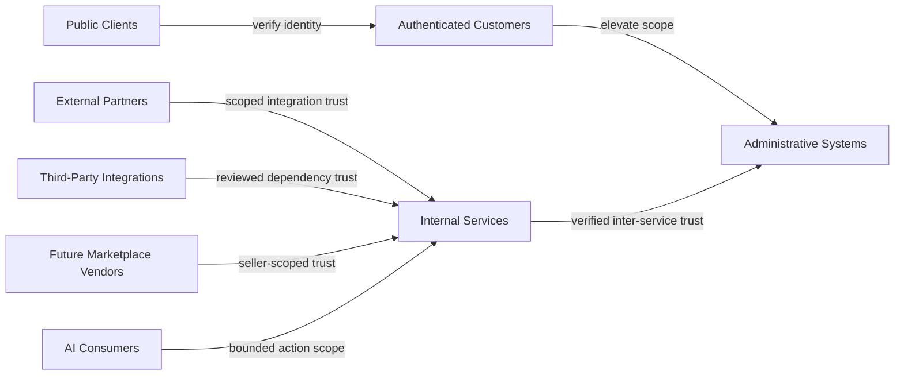
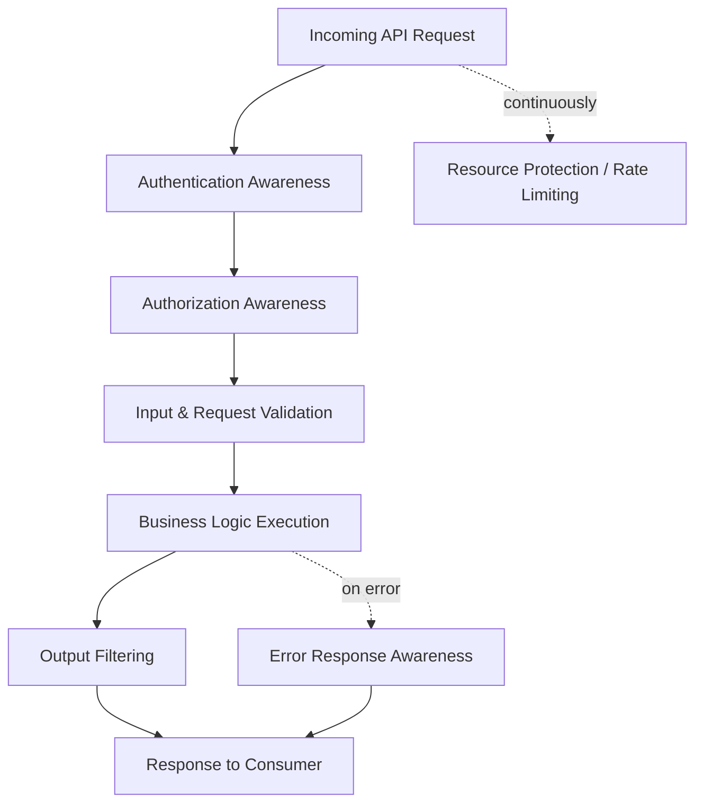
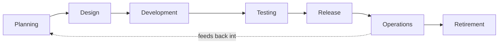
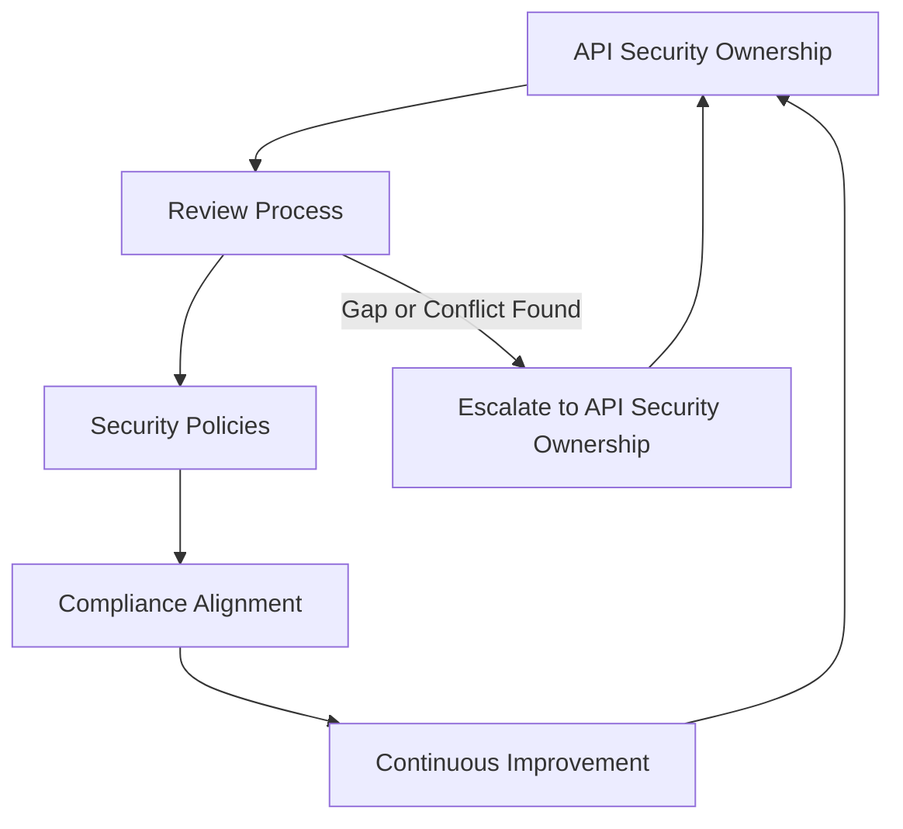
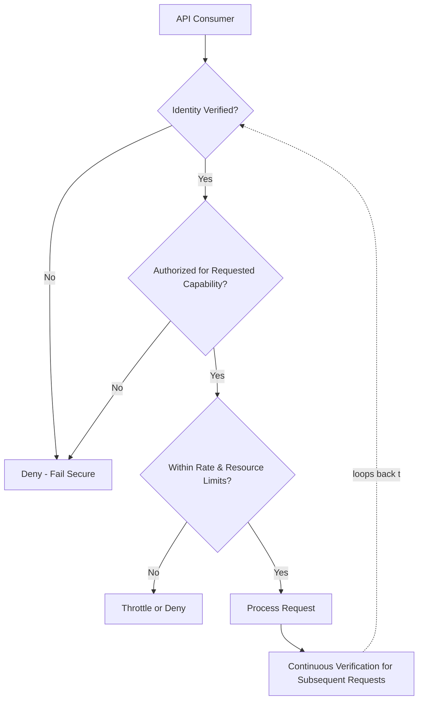

# API Security

## 1. Document Purpose

This document defines the official Enterprise API Security Strategy for **StackLeo Tech Store**. It establishes how the platform protects the contracts through which channels, internal services, and external parties interact with its capability.

- **Purpose of API Security** — to ensure that every API — internal or external, current or future — is treated as an explicit trust boundary requiring deliberate verification, not an implicitly trusted extension of the systems calling it.
- **Relationship with Enterprise Architecture** — this document elaborates API Security, a component of Application Security defined in `security-architecture.md` (Section 3.2), and is closely coordinated with `05_API/api-strategy.md` and `05_API/api-governance.md`.
- **Relationship with Zero Trust** — APIs are among the most frequent points at which the Zero Trust vision in `security-architecture.md` (Section 2) is tested in practice; every request is verified regardless of its apparent origin.
- **Relationship with Customer Trust** — APIs carry the data and actions behind every customer interaction across Web and future Mobile App channels; their protection is inseparable from the trust described in `01_Business/vision.md`.
- **Relationship with Business Resilience** — APIs are a common target for abuse and disruption; this strategy exists to keep the business operating reliably as API surface area grows, complementing `security-principles.md` (Section 9).

This document is implementation-independent and vendor-neutral. It defines API security philosophy, domains, and governance — not specific authentication protocols, authorization implementations, security products, or code.

## 2. API Security Philosophy

- **Zero Trust APIs** — no API request is trusted based on network origin, prior context, or apparent familiarity of the caller; every request is verified on its own merits.
- **Least Privilege** — every API consumer, human or system, is granted only the specific capability and data access its legitimate purpose requires, consistent with `authorization.md`.
- **Secure by Design** — API security is considered when an API is first conceived, not added once it is already exposed, consistent with `security-principles.md` (Section 8).
- **Defense in Depth** — API protection relies on multiple independent layers (Section 6), so no single control's failure results in full compromise.
- **Consumer-Centric Security** — API security is designed with awareness of how legitimate consumers actually behave, balancing protection against unnecessary friction for genuine use.
- **Continuous Verification** — trust extended to an API consumer is re-evaluated across the life of their access, not assumed permanent once initially granted, consistent with `security-principles.md` (Section 3.10).

## 3. API Security Domains

| Domain | Purpose | Business Value | Security Objectives |
|---|---|---|---|
| Identity Verification | Confirm the calling party is who or what it claims to be. | Prevents impersonation of legitimate consumers. | Every request is attributable to a verified identity, per `authentication.md`. |
| Authorization | Determine what a verified caller may access or perform. | Ensures API capability is used only as intended by its owner. | Access is scoped to least privilege, per `authorization.md`. |
| Input Validation | Confirm incoming data matches expected form and business rules. | Prevents malformed or malicious data from being processed as trustworthy. | Requests inconsistent with expected shape or rules are rejected. |
| Output Protection | Confirm outgoing data reveals only what the consumer is entitled to see. | Prevents unintended disclosure through an otherwise legitimate response. | Responses are scoped to the caller's authorized view of the data. |
| Rate Limiting | Constrain the volume of requests a consumer can make in a given period. | Preserves availability and fairness across all consumers. | Excessive request volume from any single consumer is bounded. |
| Abuse Prevention | Detect and constrain patterns of use inconsistent with legitimate purpose. | Protects business logic and resources from being exploited at scale. | Abnormal usage patterns are recognized and constrained. |
| Sensitive Data Protection | Apply data protection principles specifically at the API boundary. | Prevents the API layer from becoming the weak point in an otherwise protected data lifecycle. | Sensitive data crossing an API is handled per `data-protection.md`. |
| Auditability | Record API activity with sufficient context for investigation. | Supports accountability and incident response. | Significant API activity is attributable and recorded, per `security-principles.md` (Section 9). |

### API Security Domain Matrix

| Domain | Primary Risk Addressed | Related Document |
|---|---|---|
| Identity Verification | Impersonation of a legitimate consumer | `authentication.md` |
| Authorization | Use of capability beyond intended scope | `authorization.md` |
| Input Validation | Processing of malformed or malicious data | `application-security.md` |
| Output Protection | Unintended disclosure through a legitimate response | `data-protection.md` |
| Rate Limiting | Resource exhaustion by any single consumer | `05_API/rate-limiting.md` |
| Abuse Prevention | Exploitation of legitimate capability at scale | `threat-model.md` |
| Sensitive Data Protection | Weak protection specifically at the API boundary | `data-protection.md`, `encryption.md` |
| Auditability | Inability to investigate or attribute API activity | `security-principles.md` |

## 4. Trust Boundaries

APIs cross several conceptual trust boundaries, each requiring its own verification:

- **Public Clients** — unauthenticated callers reaching a public-facing endpoint, trusted least until identity is established.
- **Authenticated Customers** — callers acting on behalf of a verified customer identity, trusted to the scope of that customer's own data and actions.
- **Administrative Systems** — callers exercising elevated, business-critical capability, subject to the heightened governance in `identity-management.md` (Section 7).
- **Internal Services** — callers representing another internal service, whose trust must be independently verified rather than assumed from being "inside" the platform.
- **External Partners** — callers representing couriers, payment, or communication providers, trusted only to the scope of their integration purpose.
- **Third-Party Integrations** — broader third-party dependencies beyond core operational partners, trusted narrowly and reviewed per `application-security.md` (Section 7).
- **Future Marketplace Vendors** — sellers requiring scoped access to their own catalog and order data, distinct from both customers and internal staff.
- **AI Consumers** — AI-assisted capability acting as an API consumer, trusted only to its explicitly bounded scope of action, per `identity-management.md` (Section 8).

Trust boundaries are essential to API security because an API is, by definition, an intentional point of external reachability; without an explicit boundary and verification step, an API extends whatever trust its caller carries without ever confirming that trust is warranted.

*Diagram 2: API Trust Boundary Model.*

### Trust Boundary Summary

| Boundary | Trust Basis | Primary Risk If Unverified |
|---|---|---|
| Public Clients | None until identity established | Unrestricted anonymous access |
| Authenticated Customers | Verified customer identity | Access beyond the customer's own data |
| Administrative Systems | Verified, elevated identity | Platform-wide compromise |
| Internal Services | Verified inter-service identity | Lateral movement from a single compromised service |
| External Partners | Scoped integration agreement | Exposure beyond the integration's intended purpose |
| Third-Party Integrations | Reviewed dependency trust | Indirect compromise via a broader dependency |
| Future Marketplace Vendors | Seller-scoped relationship | Cross-vendor data exposure |
| AI Consumers | Bounded, explicit action scope | Unbounded or unattributed autonomous action |

## 5. API Threat Awareness

The architecture conceptually addresses the following classes of API risk, consistent with OWASP API Security concepts, without describing specific attack techniques:

- **Unauthorized Access** — addressed through Identity Verification and Authorization (Section 3), ensuring access requires explicit, verified permission.
- **Excessive Resource Usage** — addressed through Rate Limiting (Section 3), preserving availability and fairness across consumers.
- **Data Exposure** — addressed through Output Protection and Sensitive Data Protection (Section 3), scoping responses to what the caller is entitled to see.
- **Broken Access Control** — addressed through consistent, centrally governed authorization applied uniformly across every endpoint, per `authorization.md`.
- **Abuse of Business Logic** — addressed through Abuse Prevention (Section 3) and Business Logic Security, per `application-security.md` (Section 4).
- **Integration Risks** — addressed through deliberate trust-boundary treatment of External Partners and Third-Party Integrations (Section 4).
- **Automated Abuse** — addressed through behavioral monitoring and Rate Limiting, distinguishing legitimate automated use from abusive patterns.

This document intentionally describes threat categories and their conceptual mitigation only. It does not describe specific exploitation techniques, which fall outside the scope of an implementation-independent architectural document.

## 6. API Protection Principles

- **Authentication Awareness** — every API request is evaluated with awareness of the assurance level appropriate to what it accesses, per `authentication.md` (Section 3).
- **Authorization Awareness** — every API request is evaluated against the least-privilege scope of its verified caller, per `authorization.md`.
- **Input Validation** — incoming request data is validated against expected form and business rules before being processed.
- **Output Filtering** — outgoing response data is scoped to what the caller is authorized to see, never returning more than intended by convenience.
- **Resource Protection** — the computational and business resources an API consumes on behalf of a request are bounded proportionately to legitimate use.
- **Request Validation** — requests are evaluated for structural and business-rule consistency, not merely accepted at face value.
- **Sensitive Data Handling** — data classified as Confidential or Restricted, per `data-protection.md` (Section 4), receives proportionately stronger handling at the API boundary.
- **Error Response Awareness** — error responses provide enough information for legitimate troubleshooting without revealing internal detail useful to an adversary.

### API Protection Principles

| Principle | What It Protects Against |
|---|---|
| Authentication Awareness | Requests processed without appropriate identity assurance |
| Authorization Awareness | Requests exceeding the caller's legitimate scope |
| Input Validation | Malformed or malicious data being processed as trustworthy |
| Output Filtering | Responses revealing more than the caller is entitled to see |
| Resource Protection | Disproportionate resource consumption by a single request or consumer |
| Request Validation | Structurally or logically inconsistent requests being acted upon |
| Sensitive Data Handling | Confidential or Restricted data handled with insufficient rigor at the boundary |
| Error Response Awareness | Internal detail disclosed through overly informative error messages |

*Diagram 4: Defense in Depth for APIs — each stage independently enforces its own principle before a request reaches business logic or a response reaches the consumer.*

## 7. API Lifecycle Security

| Phase | Security Consideration |
|---|---|
| Planning | Identify the trust boundary (Section 4) and consumer categories the API will serve before design begins. |
| Design | Apply threat modeling specific to the API's data and capability, per `threat-model.md`. |
| Development | Apply the protection principles in Section 6 consistently across every endpoint. |
| Testing | Verify authentication, authorization, and validation behavior deliberately, per `security-testing.md`. |
| Release | Confirm the API's actual behavior matches its reviewed design and documented contract, per `05_API/api-governance.md`. |
| Operations | Sustain monitoring for abnormal usage patterns and rate-limit triggers. |
| Retirement | Deliberately deprecate and withdraw access, ensuring no orphaned consumer retains unreviewed access, per `05_API/versioning.md`. |

*Diagram 3: API Security Lifecycle.*

### API Lifecycle Security Matrix

| Phase | Primary Security Activity | Accountable Function |
|---|---|---|
| Planning | Identify trust boundary and consumer categories | Solution Architect, Security Lead |
| Design | Apply API-specific threat modeling | Engineering Leads |
| Development | Apply protection principles consistently | Engineering |
| Testing | Verify security behavior deliberately | QA, Security Lead |
| Release | Confirm behavior matches reviewed design | Engineering Leads, API Governance |
| Operations | Monitor for abnormal usage | Operations Lead |
| Retirement | Deprecate and withdraw access deliberately | Engineering Leads, API Governance |

## 8. Future API Security Readiness

This strategy is deliberately structured to remain valid as StackLeo's API surface grows:

- **Public APIs** — the trust-boundary model (Section 4) already anticipates Public Clients as a distinct category, allowing external exposure to be governed deliberately as `05_API/api-strategy.md` matures.
- **Marketplace APIs** — the Future Marketplace Vendors boundary (Section 4) allows seller-facing API access to be designed ahead of the marketplace's launch.
- **Partner APIs** — External Partner and Third-Party Integration boundaries (Section 4) extend to a growing partner ecosystem under consistent governance.
- **AI APIs** — AI Consumers (Section 4) are treated as a distinct, bounded identity category, consistent with `identity-management.md` (Section 8).
- **Event-Driven APIs** — as interaction moves toward asynchronous events (per `03_System_Design/event-flows.md`), the same trust-boundary and protection principles extend to event producers and consumers.
- **Microservices** — decomposition into independently deployable services increases the number of Internal Service boundaries requiring consistent API-level verification, making this strategy's boundary-first approach more important, not less.
- **Multi-Region APIs** — trust boundaries and protection principles apply consistently regardless of the number or location of regions an API is served from.

## 9. Governance

- **API Security Ownership** — the Security Lead owns the coherence of this API security strategy, coordinated with API Governance ownership defined in `05_API/api-governance.md`.
- **Review Process** — new and materially changed APIs are reviewed against this strategy at the points defined in Section 7.
- **Security Policies** — operational API security policies are derived from this strategy and maintained consistently with `security-governance.md`.
- **Compliance** — API handling of Confidential and Restricted data supports the obligations defined in `compliance.md`.
- **Continuous Improvement** — this strategy is expected to mature as API surface area, consumer categories, and threat context evolve.

*Diagram 5: API Security Governance Framework.*

### Governance Responsibility Matrix

| Role | Responsibility |
|---|---|
| Security Lead | Owns coherence and enforcement of the API security strategy. |
| API Governance Owner | Coordinates API security with broader API lifecycle governance, per `05_API/api-governance.md`. |
| Engineering Leads | Apply protection principles consistently within their API domain. |
| Solution Architect | Ensures API security remains consistent with `security-architecture.md`. |
| Operations Lead | Monitors API usage and rate-limit signals. |
| Internal Audit / Review Function | Independently verifies API security practice matches this strategy. |

*Diagram 1: Zero Trust API Architecture — every request is independently verified, scoped, and rate-checked rather than trusted from a prior request.*

## 10. Anti-Patterns

| Anti-Pattern | Why It's Avoided |
|---|---|
| Implicit Trust | Assumes a caller is legitimate based on origin or prior context, contradicting Zero Trust APIs (Section 2). |
| Missing Authorization | Allows access beyond a caller's legitimate scope, undermining Authorization (Section 3). |
| Weak Input Validation | Allows malformed or malicious data to be processed as trustworthy, contradicting Section 6. |
| Excessive Data Exposure | Returns more data than the caller is entitled to see, undermining Output Protection (Section 3). |
| Poor Error Handling | Reveals internal detail useful to an adversary, contradicting Error Response Awareness (Section 6). |
| No Rate Awareness | Leaves the platform exposed to resource exhaustion and automated abuse, contradicting Section 5. |
| Weak Governance | Allows API security practice to drift from this strategy with no accountable owner or review mechanism (Section 9). |
| Reactive Security | Treats API security as a response to incidents rather than a continuous discipline embedded across the lifecycle (Section 7). |

## 11. Document Information

| Property | Value |
|----------|-------|
| Document | api-security.md |
| Version | 1.0.0 |
| Status | Active |
| Maintained By | StackLeo |
| Last Updated | 2026-07-17 |

---

© StackLeo. All Rights Reserved.
