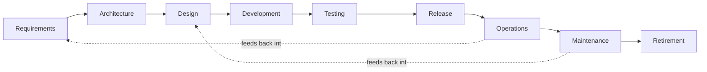
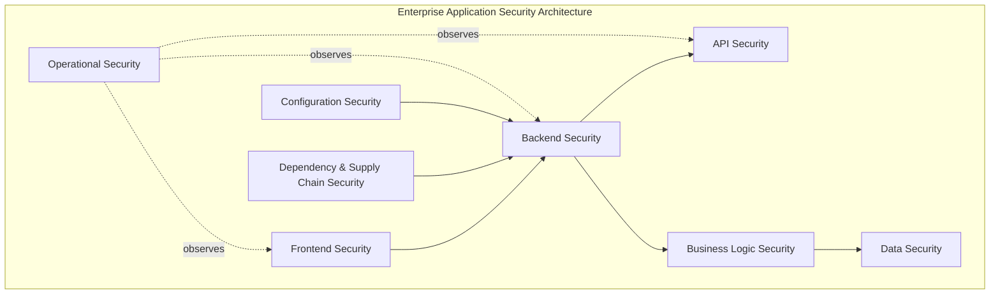
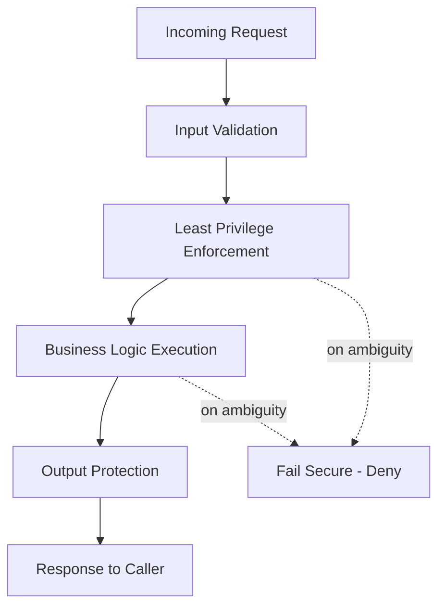
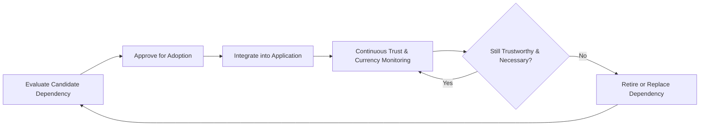
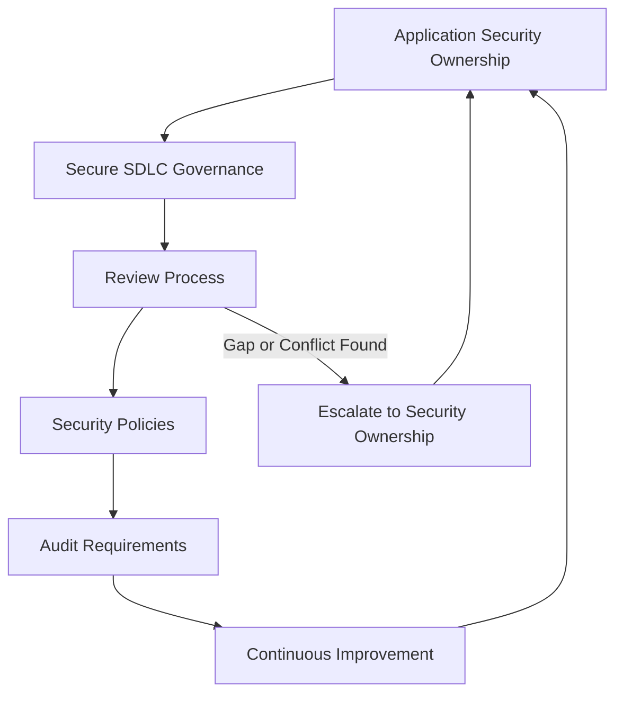

# Application Security

## 1. Document Purpose

This document defines the official Enterprise Application Security Strategy for **StackLeo Tech Store**. It establishes the security principles, governance, secure development practices, and long-term architecture guiding every software product across the platform.

- **Purpose of Application Security** — to ensure that the software StackLeo builds — the customer-facing experience, the business logic behind it, and the interfaces connecting it all — resists misuse and attack as a structural property, not an afterthought.
- **Relationship with Enterprise Architecture** — this document elaborates Application Security, one of the five domains defined in `security-architecture.md` (Section 3.2), applying its principles specifically to how software is designed, built, and operated.
- **Relationship with Secure SDLC** — this document defines the security activities embedded throughout the software development lifecycle (Section 3), ensuring security is a continuous discipline across every phase, not a single gate.
- **Relationship with Business Resilience** — application-layer weaknesses are among the most common paths to business disruption; this strategy exists to keep the software layer resilient, complementing `security-principles.md` (Section 9).
- **Relationship with Customer Trust** — the catalog, cart, checkout, and account experience are where customers directly encounter StackLeo; a compromised or unreliable application is a direct failure of the trust described in `01_Business/vision.md`.

This document is implementation-independent and vendor-neutral. It defines application security philosophy, lifecycle activities, and governance — not specific security products, exploitation techniques, vulnerability details, code, or implementation procedures.

## 2. Application Security Philosophy

- **Secure by Design** — security requirements are considered from the first design conversation, consistent with `security-principles.md` (Section 8).
- **Security by Default** — an application's default behavior is its most secure reasonable configuration, requiring deliberate action to relax rather than deliberate action to secure, consistent with `security-principles.md` (Section 3.3).
- **Defense in Depth** — application protection relies on multiple independent layers (Section 4), so no single control's failure results in full compromise, consistent with `security-architecture.md` (Section 5).
- **Least Privilege** — every component, service, and integration within an application is granted only the access necessary for its function, consistent with `authorization.md`.
- **Zero Trust** — no request or component is trusted based on origin or prior context alone; verification occurs at each meaningful boundary within and around the application, consistent with `security-architecture.md` (Section 2).
- **Continuous Security Improvement** — application security posture matures deliberately over time as the codebase, team, and threat landscape evolve, rather than being fixed at initial release.

## 3. Secure Software Development Lifecycle (Secure SDLC)

Security is embedded across every phase of building and operating software, not concentrated at a single review gate:

| Phase | Security Objectives | Business Value |
|---|---|---|
| Requirements | Identify security and privacy requirements alongside functional requirements. | Prevents costly late-stage rework and ensures security is budgeted for from the outset. |
| Architecture | Evaluate structural decisions against `security-architecture.md` before commitment. | Ensures the system's foundation supports, rather than resists, later security needs. |
| Design | Apply threat modeling (`threat-model.md`) to the specific capability being designed. | Identifies realistic risk before implementation effort is invested. |
| Development | Apply secure coding mindset and consistent design principles (Section 5). | Reduces the introduction of avoidable weaknesses during implementation. |
| Testing | Verify security assumptions rather than merely trusting them, per `security-testing.md`. | Provides evidence-based confidence before release, not assumed correctness. |
| Release | Confirm the built capability matches its intended, reviewed design before reaching production. | Prevents undocumented drift between design and what actually ships. |
| Operations | Sustain monitoring and detection for the capability once live, per `security-architecture.md` (Section 8). | Enables timely detection and response to real-world conditions. |
| Maintenance | Reassess security posture as the capability evolves or its dependencies change. | Prevents security relevance from decaying silently as software ages. |
| Retirement | Ensure a decommissioned capability's data and access are fully and deliberately withdrawn. | Prevents orphaned capability from becoming an unmonitored, forgotten risk. |

*Diagram 1: Secure SDLC Lifecycle — security activity continues through operations and maintenance, feeding back into future design rather than ending at release.*

### Secure SDLC Activities

| Phase | Primary Security Activity |
|---|---|
| Requirements | Define security and privacy requirements alongside functional scope |
| Architecture | Evaluate structural decisions against `security-architecture.md` |
| Design | Apply threat modeling to the specific capability |
| Development | Apply secure coding mindset and design principles |
| Testing | Verify security assumptions through deliberate testing |
| Release | Confirm built capability matches reviewed design |
| Operations | Sustain monitoring and detection |
| Maintenance | Reassess posture as capability and dependencies evolve |
| Retirement | Deliberately withdraw data and access |

## 4. Application Security Domains

### Frontend Security

- **Scope** — the customer- and staff-facing experience layer across Web and future Mobile App channels.
- **Responsibilities** — protecting the integrity of what is presented to users and resisting manipulation of client-side behavior, detailed further in `frontend-security.md`.
- **Protection Goals** — preventing the experience layer from becoming a vector for compromising the customer session or misrepresenting business logic.

### Backend Security

- **Scope** — business logic and server-side processing underlying the platform's capability.
- **Responsibilities** — enforcing business rules consistently and resisting unauthorized manipulation of server-side processing, detailed further in `backend-security.md`.
- **Protection Goals** — ensuring business logic executes only as intended, regardless of what a client requests.

### API Security

- **Scope** — the contracts through which channels, internal services, and external parties interact with the platform.
- **Responsibilities** — protecting API contracts against misuse, unauthorized access, and abuse, detailed further in `api-security.md`.
- **Protection Goals** — ensuring only legitimate, authorized, and well-formed requests are acted upon.

### Business Logic Security

- **Scope** — the rules governing commerce (pricing, discounts, order integrity, inventory allocation).
- **Responsibilities** — ensuring business rules cannot be circumvented through unexpected sequences or inputs.
- **Protection Goals** — preserving the integrity of the commercial transaction itself, not merely the technical request that carries it.

### Data Security

- **Scope** — data handled by application components as it moves through business processes.
- **Responsibilities** — applying the protections defined in `data-protection.md` at every point data passes through the application layer.
- **Protection Goals** — ensuring the application never becomes the weak point in an otherwise well-protected data lifecycle.

### Dependency & Supply Chain Security

- **Scope** — third-party components and libraries the application relies upon.
- **Responsibilities** — evaluating and governing dependencies deliberately, detailed further in Section 7.
- **Protection Goals** — preventing an externally introduced weakness from becoming an internally exploitable one.

### Configuration Security

- **Scope** — the settings governing how application components behave in each environment.
- **Responsibilities** — ensuring configuration defaults to the most secure reasonable state, consistent with Security by Default (Section 2).
- **Protection Goals** — preventing misconfiguration from undermining otherwise sound application design.

### Operational Security

- **Scope** — the application's behavior and protection while running in production.
- **Responsibilities** — sustaining monitoring, logging, and incident readiness for live application capability, per `security-architecture.md` (Section 8).
- **Protection Goals** — ensuring deviation from expected application behavior is detected and acted upon promptly.

### Application Security Domain Matrix

| Domain | Primary Concern | Key Related Document |
|---|---|---|
| Frontend Security | Integrity of the customer- and staff-facing experience | `frontend-security.md` |
| Backend Security | Consistent enforcement of business logic server-side | `backend-security.md` |
| API Security | Protection of contracts consumed by channels and parties | `api-security.md` |
| Business Logic Security | Integrity of commercial rules and processes | `application-security.md` (this document) |
| Data Security | Protection of data as it moves through the application | `data-protection.md` |
| Dependency & Supply Chain Security | Trustworthiness of third-party components | Section 7 (this document) |
| Configuration Security | Secure-by-default behavior across environments | `infrastructure-security.md` |
| Operational Security | Detection and response during live operation | `security-architecture.md` (Section 8) |

*Diagram 2: Enterprise Application Security Architecture — Operational Security continuously observes every other domain rather than acting only after the fact.*

## 5. Security Design Principles

- **Secure Defaults** — components behave in their most secure reasonable manner without requiring deliberate configuration to achieve it.
- **Input Validation** — data entering the application from any source is treated as untrusted until validated against expected form and business rules.
- **Output Protection** — data leaving the application toward a user or another system is presented in a manner that prevents unintended interpretation or execution.
- **Least Privilege** — every component operates with only the access its function requires, consistent with `authorization.md`.
- **Fail Secure** — when a component cannot make a confident decision, the default outcome is denial, never silent permission, consistent with `security-principles.md` (Section 3.5).
- **Separation of Duties** — no single component or role can both perform and approve the same high-impact business action.
- **Defense in Depth** — no single design principle is relied upon exclusively; principles reinforce one another (Section 4).
- **Minimize Attack Surface** — the application exposes only the capability genuinely required to serve its purpose, consistent with `security-principles.md` (Section 3.6).

### Security Design Principles

| Principle | What It Protects Against |
|---|---|
| Secure Defaults | Risk introduced by oversight or unreviewed configuration |
| Input Validation | Malformed or malicious data being treated as trustworthy |
| Output Protection | Unintended interpretation or execution of outbound data |
| Least Privilege | Broad access exceeding a component's actual function |
| Fail Secure | Ambiguous conditions resulting in unintended access |
| Separation of Duties | Unilateral high-impact action by a single component or role |
| Defense in Depth | Total compromise from a single design principle's failure |
| Minimize Attack Surface | Unnecessary exposure as the application grows in complexity |

*Diagram 3: Defense in Depth for Applications — each stage independently enforces its own principle rather than relying on a single upstream check.*

## 6. Application Risk Management

- **Threat Awareness** — application teams maintain an active understanding of realistic threats to their capability, informed by `threat-model.md`.
- **Risk Assessment** — identified application risks are evaluated for likelihood and business impact, consistent with the Risk Classification in `threat-model.md` (Section 7).
- **Security Reviews** — significant application design and implementation decisions receive deliberate security scrutiny proportionate to their risk, consistent with the Secure SDLC (Section 3).
- **Continuous Validation** — security assumptions about an application are periodically re-verified rather than assumed to remain true indefinitely, per `security-testing.md`.
- **Residual Risk Awareness** — risk remaining after reasonable mitigation is knowingly and explicitly accepted by an accountable owner, never left unaddressed by omission, consistent with `security-principles.md` (Section 5).

### Risk Management Matrix

| Risk Source | Assessment Approach | Governance Expectation |
|---|---|---|
| New capability or significant change | Threat modeling at design time (Section 3) | Review before implementation begins |
| Existing capability, unchanged | Periodic reassessment (`threat-model.md`, Section 9) | Scheduled review cadence |
| Dependency-introduced risk | Supply chain evaluation (Section 7) | Continuous monitoring of dependency posture |
| Operational anomaly | Detection via Operational Security (Section 4) | Immediate triage and response |
| Accepted residual risk | Documented rationale and accountable owner | Scheduled reassessment date |

## 7. Supply Chain Security

- **Third-Party Components** — every dependency introduced into the application is a deliberate decision, evaluated for necessity before adoption, consistent with `03_System_Design/architecture-principles.md` (ARCH-032).
- **Dependency Governance** — the population of dependencies in active use is tracked and governed, not left to accumulate without oversight.
- **Software Integrity** — the application's build and delivery process maintains confidence that what is deployed matches what was reviewed and approved.
- **Trust Evaluation** — a dependency's trustworthiness (maintenance activity, reputation, scope of access it requires) is evaluated before and periodically after adoption.
- **Lifecycle Awareness** — dependencies are kept current and retired deliberately when no longer maintained or necessary, avoiding indefinite reliance on unmaintained components.

*Diagram 4: Supply Chain Security Lifecycle.*

## 8. Future Application Security Readiness

This strategy is deliberately structured to remain valid as StackLeo's platform grows:

- **AI Features** — AI-assisted capability is developed under the same Secure SDLC (Section 3) and design principles (Section 5) as any other application component.
- **Marketplace Platform** — seller-facing application capability will be designed with the same domain coverage (Section 4) applied to internal and customer-facing capability today.
- **Public APIs** — API Security (Section 4) extends naturally to external consumers as public APIs are introduced per `05_API/api-strategy.md`.
- **Enterprise Customers** — corporate and wholesale customer capability is held to the same application security rigor as the core B2C experience.
- **Multi-Tenant Applications** — as marketplace and corporate business models mature, application design ensures one tenant's data and capability remain inaccessible to another's, consistent with `authorization.md` (Section 8).
- **Event-Driven Systems** — as interaction moves toward asynchronous events (per `03_System_Design/event-flows.md`), the same design principles (Section 5) apply to event producers and consumers.
- **Microservices** — decomposition into independently deployable services increases the number of components requiring consistent application security treatment, making this strategy's domain-based structure (Section 4) more valuable, not less.
- **Global Expansion** — application security principles remain jurisdiction-agnostic, allowing region-specific requirements to layer on as StackLeo expands from Bangladesh into South Asia and beyond.

## 9. Governance

- **Security Ownership** — the Security Lead owns the coherence of this application security strategy, working alongside Engineering leads accountable for its application within their domain.
- **Secure SDLC Governance** — adherence to the Secure SDLC (Section 3) is a normal part of how capability is planned and delivered, not a separate compliance exercise.
- **Review Process** — application security reviews occur at the points defined in Section 3 and whenever significant change or new risk emerges.
- **Security Policies** — operational application security policies are derived from this strategy and maintained consistently with `security-governance.md`.
- **Audit Requirements** — significant application security decisions and reviews are recorded consistently with `security-principles.md` (Section 9).
- **Continuous Improvement** — this strategy is expected to mature as the codebase, team, and threat landscape evolve.

*Diagram 5: Application Security Governance Framework.*

### Governance Responsibility Matrix

| Role | Responsibility |
|---|---|
| Security Lead | Owns coherence and enforcement of the application security strategy. |
| Engineering Leads | Apply Secure SDLC activities and design principles within their domain. |
| Solution Architect | Ensures application security remains consistent with `security-architecture.md`. |
| QA Lead | Ensures security testing (`security-testing.md`) is embedded in the testing culture. |
| Product Manager | Ensures new capability is evaluated against application security domains before commitment. |
| Internal Audit / Review Function | Independently verifies application security practice matches this strategy. |

## 10. Anti-Patterns

| Anti-Pattern | Why It's Avoided |
|---|---|
| Security Added Late | Contradicts Secure by Design (Section 2); retrofitted security is consistently costlier and structurally weaker. |
| Blind Trust of Input | Violates Input Validation (Section 5); treats untrusted data as though it were already safe. |
| Weak Business Logic Protection | Allows commercial rules (pricing, discounts, order integrity) to be circumvented despite technically valid requests. |
| Poor Dependency Governance | Leaves Supply Chain Security (Section 7) unmanaged, allowing untrusted or unmaintained components to persist. |
| Weak Configuration Management | Contradicts Security by Default (Section 2); leaves secure behavior dependent on manual, error-prone setup. |
| No Security Reviews | Removes the Secure SDLC's review points (Section 3), allowing risk to reach production unexamined. |
| Poor Documentation | Prevents application security decisions from being understood, audited, or maintained consistently over time. |
| Reactive Security | Treats security as a response to incidents rather than a continuous discipline, contradicting Section 2. |

## 11. Document Information

| Property | Value |
|----------|-------|
| Document | application-security.md |
| Version | 1.0.0 |
| Status | Active |
| Maintained By | StackLeo |
| Last Updated | 2026-07-17 |

---

© StackLeo. All Rights Reserved.
