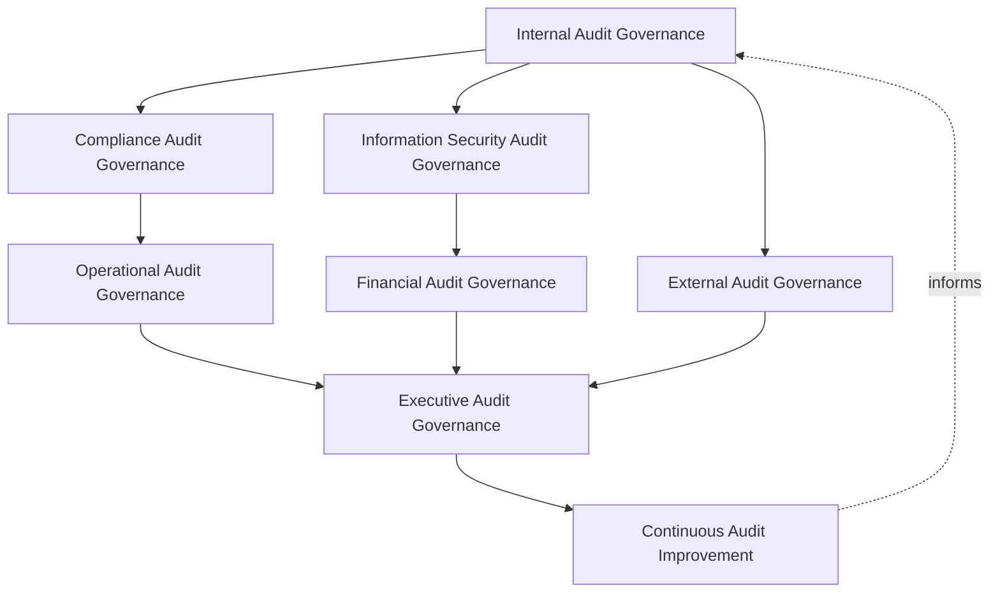
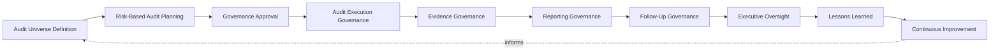
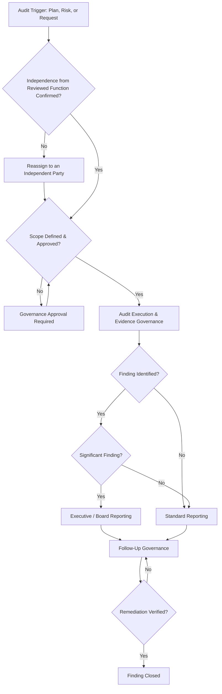
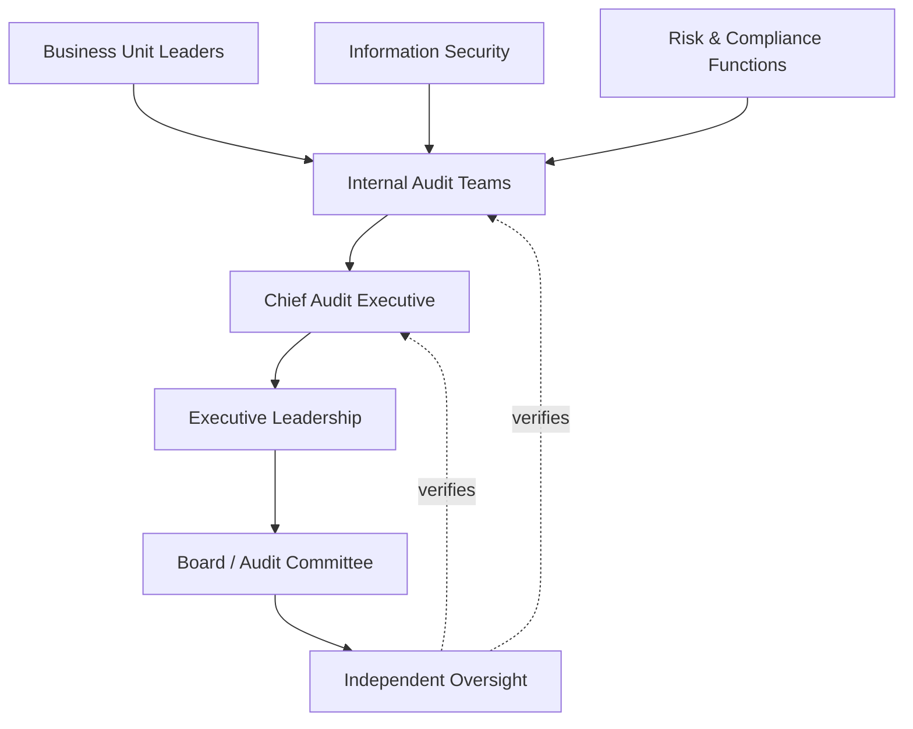
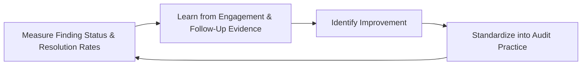
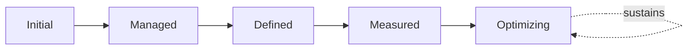

# Enterprise Audit Governance Strategy

## 1. Document Purpose

This document defines the official Enterprise Audit Governance Strategy for **StackLeo Tech Store** — the CAE/CRO/CCO-owned governance framework under which independent assurance is planned, executed, evidenced, and reported across every category of business activity. It establishes governance for internal audit, external audit, audit independence, audit oversight, audit evidence governance, organizational accountability, executive oversight, and long-term audit maturity, consistent with the IIA Global Internal Audit Standards, ISO 19011, ISO/IEC 27001 Lead Auditor principles, and TOGAF enterprise architecture thinking.

Audit is the mechanism through which every other governance commitment in `06_Security` is genuinely, not merely nominally, verified. `enterprise-risk-management-strategy.md`, `compliance-governance.md`, and `internal-control-framework.md` each depend on this strategy for the independent assurance that confirms their governance is actually functioning as documented, not only as designed.

- **Purpose of Audit Governance** — to ensure StackLeo obtains genuine, independent assurance that its controls, obligations, and objectives are being met, rather than relying on self-assessment or assumption alone.
- **Relationship with Enterprise Risk Management** — audit priorities are informed directly by the risk visibility established in `enterprise-risk-management-strategy.md`, ensuring audit attention is directed at the organization's most significant exposure rather than distributed arbitrarily.
- **Relationship with Compliance Governance** — `compliance-governance.md` (Section 5.8, Independent Assurance) establishes that compliance depends on independent verification; this strategy is the dedicated governance framework — independence, planning, domains, and lifecycle — that verification is conducted under.
- **Relationship with Internal Control Governance** — audit is the primary mechanism through which the effectiveness of controls defined in `internal-control-framework.md` is independently verified, rather than assumed from documentation alone.
- **Relationship with Corporate Governance** — audit governance provides the Board and executive leadership with independent assurance that the organization's governance structures are functioning as intended, a core function of corporate governance itself.
- **Relationship with Information Security** — security-specific audit activity is coordinated with `security-governance.md` and `security-controls-framework.md`, with this strategy establishing the enterprise-wide audit governance those activities are conducted under.
- **Relationship with Executive Decision-Making** — this strategy exists to give executive leadership genuine, independently verified confidence in the organization's own operation, a confidence every significant decision implicitly depends on.

This document is implementation-independent and vendor-neutral. It defines audit governance philosophy, model, domains, and lifecycle conceptually — not specific audit software, GRC platforms, cloud providers, consulting firms, evidence management systems, security products, audit schedules, audit programs, audit checklists, audit sampling methods, evidence collection procedures, infrastructure configurations, deployment architectures, operational audit workflows, or code.

## 2. Audit Governance Philosophy

Audit governance at StackLeo rests on eight principles. Each exists to produce a specific business outcome — audit is governed deliberately because assurance that has not been independently verified is not genuine assurance at all.

### 2.1 Independent Assurance Builds Trust

Audit activity operates independently of the functions it reviews, producing conclusions the organization can genuinely trust rather than a self-assessment dressed as verification.

- **Business Value** — ensures leadership's confidence in the organization rests on genuinely independent evidence, not the word of the function being evaluated.

### 2.2 Governance Before Audit Activities

The governance structure — who decides, who owns, who is accountable for audit itself — is established before specific audit engagements are planned.

- **Business Value** — ensures audit activity occurs within a deliberate, accountable structure, not as an ad hoc reaction to a specific concern.

### 2.3 Risk-Based Audit Thinking

Audit attention is directed according to genuine risk significance, established under `enterprise-risk-management-strategy.md`, rather than applied uniformly regardless of consequence.

- **Business Value** — ensures limited audit capacity is spent where a genuine gap would cost the business the most.

### 2.4 Accountability

Every audit finding and every audit governance decision traces to a specific, named, responsible party.

- **Business Value** — ensures identified gaps have someone genuinely responsible for their resolution, not merely a record of the finding.

### 2.5 Transparency

Audit findings, status, and methodology are documented and visible to the stakeholders who genuinely depend on them.

- **Business Value** — builds confidence in the organization's own self-awareness, rather than leaving audit outcomes opaque.

### 2.6 Objectivity

Audit findings are based on genuine evidence, free from bias or undue influence from the function being reviewed.

- **Business Value** — protects the credibility of every conclusion audit reaches, ensuring findings can be relied upon.

### 2.7 Business Alignment

Audit governance exists to give the business genuine confidence in its own operation, never to obstruct legitimate activity with disproportionate friction.

- **Business Value** — keeps audit genuinely valued rather than resented as a compliance formality disconnected from real work.

### 2.8 Continuous Improvement

Audit governance practice matures over time, informed by real findings, incidents, and the organization's growth in scale and complexity.

- **Business Value** — keeps audit governance aligned with StackLeo's growth in scale, market reach, and business model complexity.

## 3. Enterprise Audit Governance Model

Audit governance operates across eight conceptual layers, each holding accountability for a distinct category of assurance activity.

### 3.1 Internal Audit Governance

- **Purpose** — own the coherence of the organization's own independent review of its controls and practice.
- **Governance Scope** — oversight of internal review activity, structurally independent of the functions being reviewed.
- **Business Value** — surfaces gaps proactively, on the organization's own terms, before an external party discovers them.
- **Executive Expectations** — leadership trusts internal audit operates with genuine, structural independence.

### 3.2 External Audit Governance

- **Purpose** — own the coherence of how external assessment by partners, customers, or regulators is supported.
- **Governance Scope** — oversight of evidence and cooperation provided to external assessors across every domain in Section 4.
- **Business Value** — avoids reactive, last-minute evidence assembly when an external audit request arrives.
- **Executive Expectations** — leadership expects external audit requests to be met promptly and credibly.

### 3.3 Compliance Audit Governance

- **Purpose** — own the coherence of audit activity specific to regulatory and contractual obligation.
- **Governance Scope** — oversight of Regulatory & Compliance Audits (Section 4.10), coordinated with `compliance-governance.md`.
- **Business Value** — provides independent verification that tracked obligations are genuinely satisfied, not merely documented.
- **Executive Expectations** — leadership expects compliance audit findings to feed directly into obligation tracking.

### 3.4 Information Security Audit Governance

- **Purpose** — own the coherence of audit activity specific to security controls and practice.
- **Governance Scope** — oversight of Information Security Audits (Section 4.3), coordinated with `security-controls-framework.md`.
- **Business Value** — provides independent verification that security control effectiveness is genuine, not assumed.
- **Executive Expectations** — leadership expects security audit findings to be represented in enterprise-wide reporting.

### 3.5 Operational Audit Governance

- **Purpose** — own the coherence of audit activity specific to day-to-day business operation.
- **Governance Scope** — oversight of Operational Audits (Section 4.5), spanning fulfillment, logistics, and customer service.
- **Business Value** — confirms operational reliability is genuine, not merely assumed from the absence of complaint.
- **Executive Expectations** — leadership trusts operational audit findings are reported through a routine, predictable cadence.

### 3.6 Financial Audit Governance

- **Purpose** — own the coherence of audit activity verifying financial reporting and transaction integrity.
- **Governance Scope** — oversight of Financial Audits (Section 4.2), receiving the highest rigor in this model.
- **Business Value** — directly protects financial credibility and stakeholder trust.
- **Executive Expectations** — leadership expects financial audits to receive the strictest governance rigor this framework provides.

### 3.7 Executive Audit Governance

- **Purpose** — own executive-level accountability for the audit findings carrying the greatest organizational consequence.
- **Governance Scope** — oversight spanning Sections 3.1–3.6 wherever a finding rises to genuine executive or Board concern.
- **Business Value** — ensures the most consequential findings are visible at the level accountable for the organization as a whole.
- **Executive Expectations** — leadership expects to be informed of, not surprised by, the organization's most significant audit findings.

### 3.8 Continuous Audit Improvement

- **Purpose** — govern the mechanism by which every other layer in this model matures over time.
- **Governance Scope** — consolidates findings and lessons across every domain in Section 4.
- **Business Value** — prevents audit governance itself from becoming the next thing that quietly stagnates as the organization scales.
- **Executive Expectations** — leadership expects audit maturity to be assessed periodically, not assumed static once established.

### Enterprise Audit Governance Matrix

| Layer | Purpose | Business Value | Executive Expectations |
|---|---|---|---|
| Internal Audit Governance | Own coherence of the organization's own independent review | Surfaces gaps proactively, on the organization's own terms | Trusts internal audit operates with genuine, structural independence |
| External Audit Governance | Own coherence of supporting external assessment | Avoids reactive, last-minute evidence assembly | Expects external requests met promptly and credibly |
| Compliance Audit Governance | Own coherence of audit activity for regulatory obligation | Provides independent verification obligations are genuinely satisfied | Expects findings to feed directly into obligation tracking |
| Information Security Audit Governance | Own coherence of audit activity for security controls | Provides independent verification of genuine control effectiveness | Expects findings represented in enterprise-wide reporting |
| Operational Audit Governance | Own coherence of audit activity for day-to-day operation | Confirms operational reliability is genuine, not assumed | Trusts findings reported through a routine, predictable cadence |
| Financial Audit Governance | Own coherence of financial reporting/transaction verification | Directly protects financial credibility and stakeholder trust | Expects the strictest governance rigor this framework provides |
| Executive Audit Governance | Own executive accountability for highest-consequence findings | Ensures the most consequential findings are visible to leadership | Expects leadership informed of, not surprised by, top findings |
| Continuous Audit Improvement | Govern maturation of every other layer | Prevents governance itself from stagnating | Expects maturity to be assessed periodically |

*Diagram 1: Enterprise Audit Governance Framework — internal audit governance establishes the foundation, external, compliance, and security audit governance extend it across specialized domains, operational and financial audit governance apply it to core business activity, and executive oversight converges on continuous improvement that feeds back into the model.*

## 4. Enterprise Audit Domains

Audit is governed across ten conceptual domains, each requiring a distinct assurance emphasis.

### 4.1 Corporate Governance Audits

- **Purpose** — verify that the organization's governance structures are functioning as intended.
- **Governance Considerations** — governed under Executive Audit Governance (Section 3.7), reporting directly to the Board.
- **Business Importance** — provides assurance at the foundation every other audit domain depends on.
- **Executive Expectations** — leadership expects corporate governance audit findings to be reported directly to the Board.

### 4.2 Financial Audits

- **Purpose** — verify the integrity and accuracy of financial records and reporting.
- **Governance Considerations** — governed under Financial Audit Governance (Section 3.6), the highest-rigor domain in this model.
- **Business Importance** — directly affects financial credibility and stakeholder trust.
- **Executive Expectations** — leadership expects financial audits to receive the highest governance rigor.

### 4.3 Information Security Audits

- **Purpose** — verify the effectiveness of security controls and practice.
- **Governance Considerations** — governed under Information Security Audit Governance (Section 3.4), coordinated with `security-controls-framework.md`.
- **Business Importance** — confirms the platform's protective posture is genuine, not merely documented.
- **Executive Expectations** — leadership expects security audit findings to be tracked to resolution.

### 4.4 Privacy & Data Protection Audits

- **Purpose** — verify that personal data handling is consistent with StackLeo's privacy commitments.
- **Governance Considerations** — governed under Compliance Audit Governance (Section 3.3), coordinated with `privacy-governance.md`.
- **Business Importance** — protects customer and workforce trust and regulatory standing.
- **Executive Expectations** — leadership expects privacy audits to be conducted proactively, not only in response to a complaint.

### 4.5 Operational Audits

- **Purpose** — verify that day-to-day operations function as intended.
- **Governance Considerations** — governed under Operational Audit Governance (Section 3.5).
- **Business Importance** — confirms operational reliability is genuine, not assumed.
- **Executive Expectations** — leadership expects operational audit findings reported through a routine cadence.

### 4.6 Technology Audits

- **Purpose** — verify that the platform's technical foundation supports control and compliance expectations.
- **Governance Considerations** — governed under Information Security Audit Governance (Section 3.4), coordinated with `03_System_Design/architecture-principles.md`.
- **Business Importance** — confirms the structural foundation every other domain depends on is sound.
- **Executive Expectations** — leadership expects technology audits to evolve alongside architecture.

### 4.7 Third-Party Audits

- **Purpose** — verify that external parties meet the assurance expectations placed on them.
- **Governance Considerations** — governed under External Audit Governance (Section 3.2), coordinated with `third-party-risk-governance.md`.
- **Business Importance** — ensures the trust extended to external parties is genuinely warranted.
- **Executive Expectations** — leadership expects third-party audit scrutiny to be proportionate to the access each party is granted.

### 4.8 Marketplace Audits

- **Purpose** — verify the integrity of future multi-vendor marketplace seller onboarding and transactions.
- **Governance Considerations** — governed under Operational Audit Governance (Section 3.5), structured ahead of the marketplace model's launch.
- **Business Importance** — protects marketplace trust and credibility as it scales.
- **Executive Expectations** — leadership expects marketplace audit governance to be designed before, not retrofitted after, launch.

### 4.9 AI & Emerging Technology Audits

- **Purpose** — verify that AI-assisted capability operates within its intended assurance boundaries.
- **Governance Considerations** — governed under Continuous Audit Improvement (Section 3.8) as a distinct, explicitly monitored category.
- **Business Importance** — becomes increasingly significant as AI capability grows within the business.
- **Executive Expectations** — leadership expects proactive governance attention to this domain, not retroactive correction.

### 4.10 Regulatory & Compliance Audits

- **Purpose** — verify that regulatory obligations tracked in `compliance-governance.md` are genuinely satisfied.
- **Governance Considerations** — governed under Compliance Audit Governance (Section 3.3), coordinated with `compliance.md`.
- **Business Importance** — protects the organization's license to operate in current and future markets.
- **Executive Expectations** — leadership expects regulatory audit findings to feed directly into obligation tracking.

### Enterprise Audit Domain Matrix

| Domain | Purpose | Business Importance | Executive Expectations |
|---|---|---|---|
| Corporate Governance Audits | Verify governance structures function as intended | Provides assurance every other domain depends on | Reported directly to the Board |
| Financial Audits | Verify integrity and accuracy of financial records | Directly affects financial credibility and stakeholder trust | Receive the highest governance rigor |
| Information Security Audits | Verify effectiveness of security controls and practice | Confirms protective posture is genuine, not documented | Findings tracked to resolution |
| Privacy & Data Protection Audits | Verify personal data handling consistent with commitments | Protects customer/workforce trust and regulatory standing | Conducted proactively, not only on complaint |
| Operational Audits | Verify day-to-day operations function as intended | Confirms operational reliability is genuine, not assumed | Findings reported through a routine cadence |
| Technology Audits | Verify technical foundation supports control/compliance | Confirms the structural foundation other domains depend on | Evolve alongside architecture |
| Third-Party Audits | Verify external parties meet assurance expectations | Ensures trust extended externally is genuinely warranted | Scrutiny proportionate to access granted |
| Marketplace Audits | Verify integrity of marketplace onboarding and transactions | Protects marketplace trust and credibility as it scales | Designed before, not retrofitted after, launch |
| AI & Emerging Technology Audits | Verify AI capability operates within intended boundaries | Increasingly significant as AI capability grows | Proactive attention, not retroactive correction |
| Regulatory & Compliance Audits | Verify tracked regulatory obligations are genuinely satisfied | Protects the license to operate in current/future markets | Findings feed directly into obligation tracking |

## 5. Enterprise Audit Lifecycle

Audit is governed across ten conceptual lifecycle stages, applicable across every domain in Section 4.

### 5.1 Audit Universe Definition

- **Purpose** — establish the complete population of auditable areas across the organization.
- **Governance Objectives** — require the universe to span every domain in Section 4, never limited to the areas most convenient to enumerate.
- **Business Value** — ensures audit planning begins from a genuinely complete picture, not a partial one that leaves blind spots unexamined.

### 5.2 Risk-Based Audit Planning

- **Purpose** — determine which areas of the audit universe will be audited and when.
- **Governance Objectives** — require planning to be grounded in the risk visibility established in `enterprise-risk-management-strategy.md`, consistent with Section 2.3.
- **Business Value** — ensures limited audit capacity is spent where genuine consequence is greatest.

### 5.3 Governance Approval

- **Purpose** — formally approve the audit plan and the scope of a specific engagement.
- **Governance Objectives** — require approval to trace to a specific, accountable party, distinct from the area being audited.
- **Business Value** — ensures every audit engagement proceeds with deliberate authority behind it.

### 5.4 Audit Execution Governance

- **Purpose** — govern how an approved audit engagement is actually conducted.
- **Governance Objectives** — require execution to remain independent and objective throughout, consistent with Sections 2.1, 2.6.
- **Business Value** — protects the credibility of the engagement's eventual conclusions.

### 5.5 Evidence Governance

- **Purpose** — govern how supporting evidence is gathered, retained, and organized during an engagement.
- **Governance Objectives** — require evidence to be sufficient to support audit conclusions, never assumed adequate without genuine review.
- **Business Value** — makes audit findings demonstrable and defensible, not merely asserted.

### 5.6 Reporting Governance

- **Purpose** — communicate audit findings and conclusions to the appropriate governance level.
- **Governance Objectives** — require reporting to reach a level proportionate to a finding's genuine significance.
- **Business Value** — ensures decision-makers are informed of genuine audit outcomes, not a filtered or diluted summary.

### 5.7 Follow-Up Governance

- **Purpose** — confirm that corrective action for a finding was genuinely completed and effective.
- **Governance Objectives** — require follow-up to verify remediation itself, not merely its claimed completion.
- **Business Value** — closes the loop between a finding and its genuine resolution.

### 5.8 Executive Oversight

- **Purpose** — sustain executive and Board-level visibility into audit findings and overall assurance status.
- **Governance Objectives** — require oversight to occur continuously, consistent with Section 8.
- **Business Value** — ensures leadership maintains genuine confidence in the organization's assurance posture over time.

### 5.9 Lessons Learned

- **Purpose** — formally capture what an audit engagement reveals about the organization's governance and control practice itself.
- **Governance Objectives** — require lessons to be documented and attributed to specific governance implications.
- **Business Value** — ensures the organization genuinely learns from each engagement, not only resolves its individual findings.

### 5.10 Continuous Improvement

- **Purpose** — apply accumulated lessons to strengthen future audit planning and execution.
- **Governance Objectives** — require findings to be genuinely analyzed for recurring patterns, not treated as isolated exceptions.
- **Business Value** — turns each audit cycle into an input that makes future audit governance genuinely better.

### Enterprise Audit Lifecycle Matrix

| Stage | Purpose | Governance Objective | Business Value |
|---|---|---|---|
| Audit Universe Definition | Establish the complete population of auditable areas | Spans every domain, never limited to convenient ones | Ensures planning begins from a genuinely complete picture |
| Risk-Based Audit Planning | Determine which areas will be audited and when | Grounded in enterprise risk visibility | Ensures capacity is spent where consequence is greatest |
| Governance Approval | Formally approve the plan and engagement scope | Traces to an accountable party distinct from the area audited | Ensures every engagement proceeds with deliberate authority |
| Audit Execution Governance | Govern how an approved engagement is conducted | Remains independent and objective throughout | Protects the credibility of eventual conclusions |
| Evidence Governance | Govern gathering, retention, organization of evidence | Sufficient to support conclusions, never assumed adequate | Makes findings demonstrable and defensible |
| Reporting Governance | Communicate findings to the appropriate governance level | Reaches a level proportionate to genuine significance | Ensures decision-makers informed of genuine outcomes |
| Follow-Up Governance | Confirm corrective action was genuinely completed | Verifies remediation itself, not claimed completion | Closes the loop between finding and genuine resolution |
| Executive Oversight | Sustain leadership visibility into findings and status | Occurs continuously | Ensures leadership maintains genuine confidence over time |
| Lessons Learned | Capture what engagements reveal about governance itself | Documented and attributed to specific implications | Ensures genuine learning, not only individual resolution |
| Continuous Improvement | Apply lessons to strengthen future practice | Findings genuinely analyzed for recurring patterns | Makes future audit governance genuinely better |

*Diagram 2: Enterprise Audit Lifecycle — the audit universe informs risk-based planning and approval, execution and evidence governance produce reported findings, and follow-up and executive oversight feed lessons learned and continuous improvement back into the cycle.*

## 6. Audit Governance Principles

- **Independence** — audit activity is structurally separated from the functions it reviews, consistent with Section 2.1.
- **Objectivity** — audit findings are based on genuine evidence, free from bias or undue influence, consistent with Section 2.6.
- **Accountability** — every audit finding traces to a specific, named, accountable owner for resolution.
- **Transparency** — audit findings and status are visible to the stakeholders who depend on them.
- **Evidence-Based Assurance** — every audit conclusion rests on sufficient, genuine evidence, never assumption or impression.
- **Risk Alignment** — audit priority and rigor are proportionate to genuine risk significance, consistent with Section 2.3.
- **Professional Judgment** — auditors apply genuine professional judgment in evaluating evidence and significance, not a mechanical checklist alone.
- **Continuous Improvement** — audit governance practice is periodically reassessed and refined.

### Audit Governance Principles Matrix

| Principle | Description | Business Value |
|---|---|---|
| Independence | Audit activity structurally separated from the functions it reviews | Ensures conclusions the organization can genuinely trust |
| Objectivity | Findings based on genuine evidence, free from bias | Protects the credibility of every conclusion reached |
| Accountability | Every finding traces to a specific, accountable owner | Ensures identified gaps are genuinely resolved |
| Transparency | Findings and status visible to stakeholders who depend on them | Builds confidence in the organization's self-awareness |
| Evidence-Based Assurance | Conclusions rest on sufficient, genuine evidence | Makes findings demonstrable and defensible |
| Risk Alignment | Priority and rigor proportionate to genuine risk significance | Directs capacity toward the greatest genuine consequence |
| Professional Judgment | Genuine judgment applied, not a mechanical checklist alone | Ensures significance is assessed with genuine expertise |
| Continuous Improvement | Practice periodically reassessed and refined | Keeps audit governance aligned with organizational growth |

*Diagram 4: Enterprise Audit Governance Decision Flow — a trigger is checked for independence and approved scope, executed with evidence governance, escalated to executive reporting where significant, and resolved into verified follow-up before a finding is genuinely closed.*

## 7. Ownership & Accountability

Governance authority for audit is distributed deliberately across eight accountable functions, defined here at the governance-objective level, without prescribing specific operational audit responsibilities.

### 7.1 Board / Audit Committee

- **Governance Objective** — the Board or its Audit Committee holds ultimate accountability for audit governance and maintains direct visibility into significant findings.
- **Business Value** — establishes audit as a genuine governance-level priority, not a delegated operational afterthought.

### 7.2 Chief Audit Executive

- **Governance Objective** — the Chief Audit Executive owns the coherence, independence, and quality of the enterprise audit function.
- **Business Value** — provides a single point of specialist accountability for whether audit governance is genuinely functioning as intended.

### 7.3 Executive Leadership

- **Governance Objective** — executive leadership resources the audit function adequately and acts genuinely on its findings.
- **Business Value** — connects audit accountability to genuine organizational authority, not a symbolic gesture.

### 7.4 Business Unit Leaders

- **Governance Objective** — business unit leaders cooperate with audit engagements and act on findings relevant to their function.
- **Business Value** — embeds audit responsiveness into how the business actually operates, not only into the audit function itself.

### 7.5 Risk & Compliance Functions

- **Governance Objective** — risk and compliance functions ensure audit priorities remain aligned with enterprise risk visibility and obligation tracking.
- **Business Value** — keeps audit effort connected to genuine risk significance and regulatory obligation.

### 7.6 Information Security

- **Governance Objective** — information security supports Information Security and Technology Audits (Sections 4.3, 4.6), coordinated with `security-controls-framework.md`.
- **Business Value** — ensures security-specific audit findings are integrated into enterprise-wide reporting.

### 7.7 Internal Audit Teams

- **Governance Objective** — internal audit teams execute audit engagements with genuine independence and objectivity.
- **Business Value** — provides the organization with credible, trustworthy assurance conclusions.

### 7.8 Independent Oversight

- **Governance Objective** — an independent function, separate from the audit function itself, periodically verifies the overall effectiveness of audit governance.
- **Business Value** — prevents audit governance from being assumed effective on the word of the same function responsible for running it.

### Ownership & Accountability Matrix

| Role | Governance Objective | Business Value |
|---|---|---|
| Board / Audit Committee | Hold ultimate accountability and maintain direct finding visibility | Establishes audit as a genuine governance-level priority |
| Chief Audit Executive | Own coherence, independence, and quality of the audit function | Provides a single point of specialist accountability |
| Executive Leadership | Resource the audit function and act genuinely on findings | Connects accountability to genuine organizational authority |
| Business Unit Leaders | Cooperate with engagements and act on relevant findings | Embeds audit responsiveness into how the business operates |
| Risk & Compliance Functions | Align audit priorities with risk visibility and obligation tracking | Keeps audit effort connected to genuine significance |
| Information Security | Support security and technology audit domains | Ensures security findings integrated into enterprise reporting |
| Internal Audit Teams | Execute engagements with genuine independence and objectivity | Provides credible, trustworthy assurance conclusions |
| Independent Oversight | Independently verify overall audit governance effectiveness | Prevents self-assessed assumption of effectiveness |

*Diagram 3: Audit Ownership & Accountability Model — accountability flows from business, security, and risk/compliance input through internal audit execution into the Chief Audit Executive, converging on executive leadership and Board oversight verified by independent oversight.*

## 8. Executive Oversight

- **Executive Audit Reviews** — the overall coherence of audit governance is formally reviewed on a regular cadence, consistent with `security-governance.md` (Section 6).
- **Audit Reporting** — aggregated audit health — finding status, resolution rates, engagement coverage — is reported to executive leadership and the Board.
- **Governance Reviews** — the governance model, domains, and lifecycle defined in this strategy (Sections 3–7) are periodically reassessed for continued fitness.
- **Audit Committee Oversight** — the Board's Audit Committee, where established, maintains direct oversight of audit independence and significant findings.
- **Documentation Governance** — this strategy's relationship to `enterprise-risk-management-strategy.md`, `compliance-governance.md`, and `internal-control-framework.md` is kept current as those documents evolve.
- **Audit Readiness** — the organization is maintained in a state prepared to support internal and external audit activity at any time.

### Executive Oversight Matrix

| Oversight Mechanism | Purpose | Governance Role |
|---|---|---|
| Executive Audit Reviews | Confirm overall audit governance coherence | Regular, predictable cadence for the strategy as a whole |
| Audit Reporting | Provide leadership a single, coherent audit picture | Reports finding status, resolution rates, engagement coverage |
| Governance Reviews | Reassess the governance model itself for continued fitness | Applies to Sections 3–7 of this strategy |
| Audit Committee Oversight | Maintain direct oversight of independence and significant findings | Board-level Audit Committee visibility |
| Documentation Governance | Keep this strategy's subordinate relationships current | Updated as related documents evolve |
| Audit Readiness | Maintain the organization prepared to support audit activity | Continuous state, never preparation-triggered |

### Governance Responsibility Matrix

| Role | Responsibility |
|---|---|
| Board / Audit Committee | Owns ultimate audit oversight and maintains visibility into significant findings. |
| Chief Audit Executive | Owns coherence, independence, and quality of the enterprise audit function. |
| Executive Leadership | Resources the audit function and acts on its findings. |
| Risk & Compliance Functions | Coordinate audit prioritization with `enterprise-risk-management-strategy.md` and `compliance-governance.md`. |
| Business Unit Leaders | Cooperate with engagements and act on findings relevant to their area. |
| Internal Audit Teams | Execute engagements with genuine independence and objectivity. |
| Information Security | Supports security and technology audit domains. |
| Independent Oversight | Independently verifies the overall effectiveness of audit governance. |

## 9. Future Readiness

This strategy is designed to remain valid as StackLeo evolves in scale, geography, and organizational complexity, without requiring redefinition of its underlying philosophy.

- **AI-Assisted Auditing** — AI & Emerging Technology Audits (Section 4.9) treats AI-assisted capability as both a new audit domain and a potential aid to audit execution itself, governed under Audit Execution Governance (Section 5.4) at the same rigor as any other method.
- **Continuous Auditing (conceptual only)** — Executive Oversight (Section 5.8) is structured to move audit assurance progressively closer to a continuous state as tooling and practice mature, without displacing the independence this strategy establishes.
- **Enterprise Scale** — the governance model, domains, and lifecycle defined throughout this strategy are defined independently of organizational size, so they remain coherent as StackLeo's audit universe grows substantially.
- **Global Expansion** — Compliance and Regulatory Audits (Section 4.10) extend to cover new markets as StackLeo expands from Bangladesh into South Asia and global markets.
- **Multi-Tenant Platforms** — Marketplace and Third-Party Audits (Sections 4.8, 4.7) extend to cover cross-tenant assurance as the marketplace model scales.
- **Digital Assurance** — this strategy's governance discipline is treated as a direct contributor to the digital trust customers, partners, and regulators extend to StackLeo, remaining structured to absorb increasingly digital audit evidence and practice.
- **Regulatory Evolution** — Continuous Audit Improvement (Section 3.8) ensures the framework adapts as new regulatory audit expectations emerge.
- **Future Governance Ecosystems** — this strategy's governance model is defined independently of any specific business model configuration, so it extends coherently as StackLeo evolves from B2C toward corporate sales, wholesale, and the multi-vendor marketplace.

## 10. Audit Governance Maturity Model

Audit governance maturity is described across five conceptual levels, consistent with the IIA Global Internal Audit Standards and established process maturity thinking.

- **Initial** — audit activity, where it exists, is ad hoc, reactive, and largely undocumented, occurring only in response to an external request.
- **Managed** — core audit domains have identified ownership and basic planning practice, though governance remains largely reactive.
- **Defined** — the governance model, domains, and lifecycle are standardized, documented, and consistently applied across the organization, consistent with the model defined throughout this strategy.
- **Measured** — finding status, resolution rates, and engagement coverage are measured systematically, and decisions are grounded in genuine evidence rather than qualitative impression alone.
- **Optimizing** — audit governance is continuously and deliberately improved based on quantitative evidence and organizational learning; improvement itself is a managed, ongoing discipline rather than an occasional initiative.

### Audit Governance Maturity Model Matrix

| Level | Characteristics | Primary Focus |
|---|---|---|
| Initial | Ad hoc, reactive, largely undocumented audit activity | Occurs only in response to external request |
| Managed | Core domains have identified ownership and basic planning | Domain-level consistency, still largely reactive |
| Defined | Standardized governance model, domains, and lifecycle | Organization-wide consistency and clear ownership |
| Measured | Finding status and resolution rates measured systematically | Evidence-based audit governance decisions |
| Optimizing | Practice continuously and deliberately improved from evidence | Sustained, deliberate improvement as a discipline |

*Diagram 5: Continuous Audit Improvement Cycle — engagement and follow-up outcomes are measured, learned from, improved upon, and standardized back into governed practice, on a continuing basis.*

*Diagram 6: Audit Governance Maturity Progression Model — maturity advances from ad hoc, reactive audit activity toward standardized, measured, and continuously optimized audit governance.*

## 11. Anti-Patterns

The following recurring failure patterns are explicitly recognized and avoided, as each one structurally undermines this strategy.

### Anti-Pattern Summary

| Anti-Pattern | Why It's Avoided |
|---|---|
| Audit Without Independence | Contradicts Independence (Section 2.1, Section 6); audit conducted by the same function it reviews cannot produce credible, trustworthy conclusions. |
| Weak Audit Evidence | Contradicts Evidence Governance (Section 5.5); insufficient evidence undermines the defensibility of every conclusion reached. |
| Unknown Audit Ownership | Contradicts Accountability (Section 6); a finding with no clearly accountable owner risks never being genuinely resolved. |
| Weak Executive Visibility | Contradicts Audit Reporting (Section 8); leadership cannot govern assurance risk it is never shown. |
| Poor Documentation | Undermines Documentation Governance (Section 8) and Transparency (Section 6), leaving audit scope, findings, and rationale unclear or unverifiable. |
| Compliance Without Independent Assurance | Contradicts Independent Assurance in `compliance-governance.md` (Section 3.7); treating a documented control as equivalent to a genuinely audited one produces a false sense of protection. |
| Siloed Audit Functions | Contradicts the Enterprise Audit Governance Model (Section 3); domain-by-domain practice that never converges leaves no coherent, organization-wide picture of assurance. |
| Missing Continuous Improvement | Contradicts Continuous Improvement (Section 2.8) and Continuous Audit Improvement (Section 3.8); a static audit framework falls out of alignment with a growing, evolving business and risk landscape. |

## 12. Document Information

| Property | Value |
|----------|-------|
| Document | audit-governance.md |
| Version | 1.0.0 |
| Status | Active |
| Maintained By | StackLeo |
| Last Updated | 2026-07-24 |

---

© StackLeo. All Rights Reserved.
