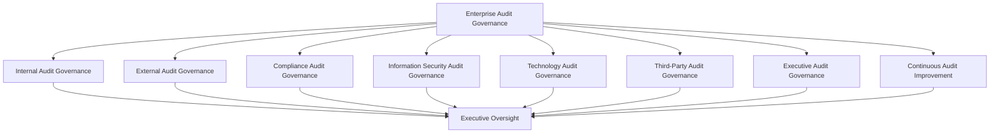
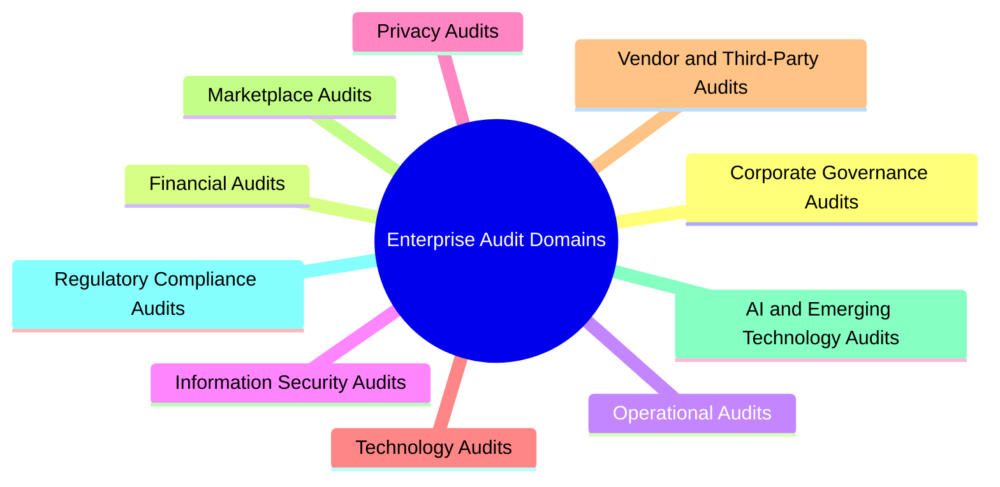
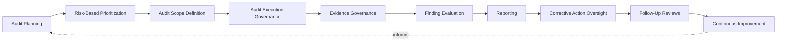
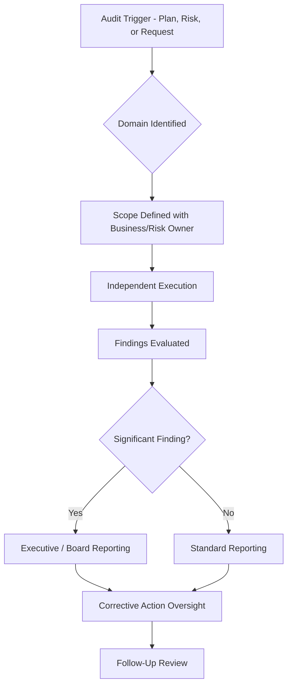
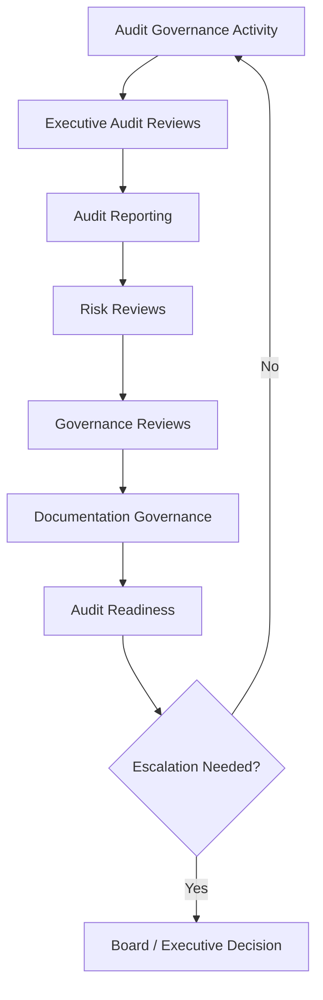
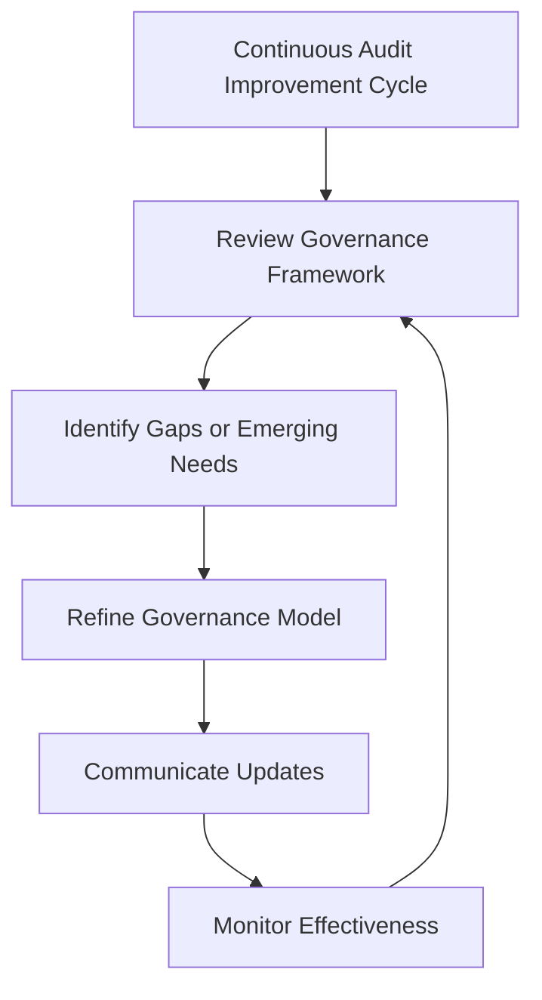

# Enterprise Audit Governance Strategy

## 1. Document Purpose

This document establishes the enterprise-wide audit governance strategy for StackLeo Tech Store, consistent with ISO 19011 auditing principles. It defines how independent assurance is planned, executed, evidenced, and reported across every category of business activity, providing the governance layer the brief audit and assurance practice in `compliance.md` (Section 10) operates within.

- **Purpose of Audit Governance** — to ensure StackLeo obtains genuine, independent assurance that its controls, obligations, and objectives are being met, rather than relying on self-assessment or assumption alone.
- **Relationship with Compliance Governance** — `compliance.md` (Section 10) establishes the operational audit and assurance practice supporting compliance obligation tracking; this document establishes the enterprise-wide governance framework — independence, planning, domains, and lifecycle — that practice operates within.
- **Relationship with Enterprise Risk Management** — audit priorities are informed directly by the risk visibility established in `risk-management.md`, ensuring audit attention is directed at the organization's most significant exposure.
- **Relationship with Internal Controls** — audit is the primary mechanism through which the effectiveness of controls defined in `internal-controls.md` is independently verified, rather than assumed from documentation alone.
- **Relationship with Corporate Governance** — audit governance provides the board and executive leadership with independent assurance that the organization's governance structures are functioning as intended.
- **Relationship with Information Security** — security-specific audit activity is coordinated with `security-governance.md` and `security-controls-framework.md`, with this document establishing the enterprise-wide audit governance those activities are conducted under.
- **Relationship with Business Operations** — audit exists to give the business confidence in its own operation, not to obstruct it; well-governed audit is what allows leadership to trust that operations are functioning as believed.

This document is implementation-independent and vendor-neutral. It defines audit philosophy, governance model, domains, and lifecycle conceptually — not specific audit software, GRC platforms, testing methodologies, sampling techniques, or evidence collection procedures.

## 2. Audit Governance Philosophy

| Principle | Business Value |
|---|---|
| **Independent Assurance** | Ensuring audit activity operates independently of the functions it reviews produces assurance the organization can genuinely trust. |
| **Risk-Based Auditing** | Directing audit attention according to genuine risk significance, rather than uniformly, ensures the most consequential areas receive the most scrutiny. |
| **Objectivity** | Requiring audit findings to be free from bias or undue influence protects the credibility of every conclusion audit reaches. |
| **Accountability** | Assigning clear ownership for audit findings and corrective action ensures identified gaps are genuinely resolved. |
| **Transparency** | Making audit findings and status visible to appropriate stakeholders builds confidence in the organization's self-awareness. |
| **Governance by Design** | Building audit governance into how new processes and controls are introduced, rather than retrofitting it, keeps the organization consistently auditable. |
| **Continuous Assurance** | Sustaining confidence in control effectiveness on an ongoing basis, not only at formal audit intervals, reduces the risk of an unpleasant surprise. |
| **Continuous Improvement** | Treating audit governance as an evolving discipline keeps it aligned with a growing business and evolving risk landscape. |

## 3. Enterprise Audit Governance Model

### Enterprise Audit Governance Matrix

| Governance Layer | Purpose | Governance Scope | Business Value | Executive Expectations |
|---|---|---|---|---|
| **Internal Audit Governance** | Governs the organization's own independent review of its controls and practice. | Internal review activity, independent of the functions being reviewed. | Surfaces gaps proactively, on the organization's own terms. | Expect internal audit to operate with genuine independence. |
| **External Audit Governance** | Governs how external assessment by partners, customers, or regulators is supported. | Evidence and cooperation provided to external assessors. | Avoids reactive, last-minute evidence assembly. | Expect external audit requests to be met promptly and credibly. |
| **Compliance Audit Governance** | Governs audit activity specific to regulatory and contractual obligations. | Coordinated with `compliance.md`. | Provides independent verification that tracked obligations are genuinely satisfied. | Expect compliance audit findings to feed directly into obligation tracking. |
| **Information Security Audit Governance** | Governs audit activity specific to security controls and practice. | Coordinated with `security-governance.md` and `security-controls-framework.md`. | Provides independent verification of security control effectiveness. | Expect security audit findings to be represented in enterprise reporting. |
| **Technology Audit Governance** | Governs audit activity specific to the platform's technical foundation. | Coordinated with `security-architecture.md`. | Verifies that technology decisions genuinely support control and compliance expectations. | Expect technology audit to keep pace with architectural evolution. |
| **Third-Party Audit Governance** | Governs audit activity specific to vendors, partners, and marketplace participants. | External party reliance and the controls governing it. | Verifies that trust extended to external parties is genuinely warranted. | Expect third-party audit scrutiny proportionate to access granted. |
| **Executive Audit Governance** | Governs the executive-level accountability and reporting structure for audit. | Executive and board reporting, review cadence, and ultimate accountability. | Keeps audit a visible, actively managed board- and executive-level concern. | Expect regular, substantive audit reporting at the executive level. |
| **Continuous Audit Improvement** | Governs how the audit governance framework itself evolves over time. | Governance review cadence, lessons learned, and framework refinement. | Keeps audit governance relevant as the business and risk landscape evolve. | Expect periodic evidence that the framework itself is being actively improved. |

*Diagram 1: Enterprise Audit Governance Framework.*

## 4. Enterprise Audit Domains

### Enterprise Audit Domain Matrix

| Domain | Purpose | Governance Scope | Business Importance | Executive Expectations |
|---|---|---|---|---|
| **Corporate Governance Audits** | Verify that governance structures are functioning as intended. | Board- and executive-level governance practice. | Provides assurance at the foundation every other domain depends on. | Expect corporate governance audit findings reported directly to the board. |
| **Financial Audits** | Verify the integrity and accuracy of financial records and reporting. | Financial transactions, reconciliation, and reporting. | Directly affects financial credibility and stakeholder trust. | Expect financial audits to receive the highest governance rigor. |
| **Operational Audits** | Verify that day-to-day operations function as intended. | Ordinary business operation across functions. | Confirms operational reliability is genuine, not assumed. | Expect operational audit findings reported through routine cadence. |
| **Information Security Audits** | Verify the effectiveness of security controls and practice. | Coordinated with `security-controls-framework.md`. | Confirms the platform's protective posture is genuine, not merely documented. | Expect security audit findings tracked to resolution. |
| **Privacy Audits** | Verify that personal data handling is consistent with privacy commitments. | Coordinated with `privacy.md`. | Protects customer and workforce trust and regulatory standing. | Expect privacy audits conducted proactively, not only on complaint. |
| **Technology Audits** | Verify that the platform's technical foundation supports control and compliance expectations. | Coordinated with `security-architecture.md`. | Confirms the structural foundation other domains depend on is sound. | Expect technology audits to evolve alongside architecture. |
| **Vendor & Third-Party Audits** | Verify that external parties meet the assurance expectations placed on them. | Vendor, partner, and service provider reliance. | Ensures trust extended externally is genuinely warranted. | Expect third-party audit scrutiny proportionate to access granted. |
| **Marketplace Audits** | Verify the integrity of marketplace seller onboarding and transactions. | Multi-vendor marketplace operations. | Protects marketplace trust and credibility as it scales. | Expect marketplace audits addressed proactively as the marketplace launches. |
| **AI & Emerging Technology Audits** | Verify that AI-assisted capability operates within intended assurance boundaries. | Automated and AI-assisted decision-making. | Increasingly significant as AI capability grows within the business. | Expect proactive governance attention to this domain rather than retroactive correction. |
| **Regulatory Compliance Audits** | Verify that regulatory obligations tracked in `compliance.md` are genuinely satisfied. | Jurisdiction-specific regulatory obligations. | Protects the organization's license to operate in current and future markets. | Expect regulatory audit findings to feed directly into obligation tracking. |

*Diagram: Enterprise Audit Domain Overview.*

## 5. Enterprise Audit Lifecycle

### Enterprise Audit Lifecycle Matrix

| Stage | Purpose | Governance Objectives | Business Value |
|---|---|---|---|
| **Audit Planning** | Establishes which areas will be audited and when. | Ground planning in genuine business and risk relevance. | Ensures audit effort is directed deliberately, not arbitrarily. |
| **Risk-Based Prioritization** | Determines audit priority according to risk significance. | Coordinate with `risk-management.md` to prioritize highest-consequence areas. | Focuses limited audit capacity where it matters most. |
| **Audit Scope Definition** | Defines the specific boundaries of a given audit engagement. | Ensure scope is clear and agreed before execution begins. | Prevents ambiguity about what an audit does and does not cover. |
| **Audit Execution Governance** | Governs how an audit engagement is conducted. | Ensure execution remains independent and objective throughout. | Protects the credibility of the audit's eventual conclusions. |
| **Evidence Governance** | Governs how supporting evidence is gathered, retained, and organized. | Ensure evidence is sufficient to support audit conclusions. | Makes audit findings demonstrable and defensible. |
| **Finding Evaluation** | Assesses the significance of issues identified during an audit. | Evaluate findings by genuine business and risk consequence. | Distinguishes critical gaps from minor observations. |
| **Reporting** | Communicates audit findings and conclusions to relevant stakeholders. | Ensure reporting reaches the appropriate governance level for the finding's significance. | Keeps decision-makers informed of genuine audit outcomes. |
| **Corrective Action Oversight** | Governs how identified findings are tracked toward resolution. | Ensure every finding has an accountable owner and target resolution. | Prevents identified gaps from persisting indefinitely. |
| **Follow-Up Reviews** | Confirms that corrective action was genuinely completed and effective. | Verify remediation, not merely its claimed completion. | Closes the loop between finding and genuine resolution. |
| **Continuous Improvement** | Feeds lessons learned back into the audit function itself. | Track improvement actions to completion. | Ensures audit effectiveness compounds over time. |

*Diagram 2: Enterprise Audit Lifecycle.*

## 6. Audit Governance Principles

### Audit Governance Principles Matrix

| Principle | Explanation |
|---|---|
| **Independence** | Audit activity is structurally separated from the functions it reviews. |
| **Objectivity** | Audit findings are based on evidence, free from bias or undue influence. |
| **Accountability** | Every audit finding has a specific, named accountable owner for resolution. |
| **Traceability** | Every finding traces back to the evidence and scope that produced it. |
| **Auditability** | Audit conclusions themselves can be independently reviewed and defended. |
| **Transparency** | Audit findings and status are visible to stakeholders who depend on them. |
| **Risk Alignment** | Audit priority and rigor are proportionate to genuine risk significance. |
| **Continuous Improvement** | Audit governance practice is periodically reassessed and refined. |

## 7. Audit Accountability & Assurance

### Audit Accountability & Assurance Matrix

| Accountability Layer | Governance Objective | Business Value |
|---|---|---|
| **Board Oversight** | Ensure the board maintains ultimate visibility into audit findings and organizational assurance. | Establishes audit as a genuine governance-level priority. |
| **Executive Leadership** | Ensure executive leadership resources audit and acts on its findings. | Connects audit accountability to genuine organizational authority. |
| **Audit Leadership** | Own the coherence, independence, and quality of the audit function. | Provides a clear, dedicated point of accountability for audit governance. |
| **Business Owners** | Ensure business areas cooperate with and act on audit findings relevant to them. | Embeds audit responsiveness into how the business actually operates. |
| **Risk Functions** | Ensure audit priorities remain aligned with the organization's risk visibility. | Keeps audit effort connected to genuine risk significance. |
| **Compliance Functions** | Ensure compliance-related audit findings feed directly into obligation tracking. | Provides the evidence base for demonstrating regulatory compliance. |
| **Independent Assurance** | Ensure audit itself operates with genuine independence from the areas it reviews. | Protects the credibility of every audit conclusion reached. |
| **External Stakeholders** | Ensure external parties with a legitimate interest receive appropriate audit assurance. | Builds the confidence enterprise customers and partners require. |

This section addresses audit accountability and assurance from a governance-objective perspective; specific audit techniques and procedures remain a matter for the audit function's own operational practice.

*Diagram 3: Audit Accountability & Assurance Model.*

## 8. Executive Oversight

### Executive Oversight Matrix

| Oversight Activity | Purpose |
|---|---|
| **Executive Audit Reviews** | Confirm the overall audit governance framework remains coherent and effective. |
| **Audit Reporting** | Provide leadership with visibility into the state of enterprise audit findings and resolution. |
| **Risk Reviews** | Confirm audit prioritization remains aligned with current enterprise risk visibility. |
| **Governance Reviews** | Confirm audit governance remains aligned with the broader enterprise governance model. |
| **Documentation Governance** | Confirm audit governance documentation remains current and accurate. |
| **Audit Readiness** | Confirm the organization is prepared to support internal and external audit activity at any time. |

*Diagram 4: Enterprise Audit Governance Decision Flow.*

## 9. Future Readiness

| Future Direction | Readiness Consideration |
|---|---|
| **AI-Assisted Audit Governance** | Anticipates AI-assisted capability as both a new audit domain and a potential aid to audit practice itself. |
| **Continuous Assurance** | Positions the audit function to evolve toward sustained, ongoing assurance rather than solely periodic engagement. |
| **Digital Audits** | Recognizes that increasingly digital operations require audit practice to evolve alongside them. |
| **Global Expansion** | Compliance and Regulatory Audit domains extend to cover new markets as StackLeo expands regionally and globally. |
| **Multi-Tenant Platforms** | Marketplace and Third-Party Audit domains extend to cover cross-tenant assurance as the marketplace scales. |
| **Enterprise Scale** | Ensures the governance framework remains coherent as audit scope and volume grow substantially. |
| **Emerging Regulatory Expectations** | Continuous Audit Improvement ensures the framework adapts as new regulatory audit expectations emerge. |
| **Governance Evolution** | Treats the framework itself as subject to ongoing refinement rather than a static, one-time definition. |

## 10. Audit Governance Maturity Model

### Audit Governance Maturity Model Matrix

| Level | Characteristics |
|---|---|
| **Initial** | Audit activity is ad hoc, reactive, and largely undocumented, occurring only in response to external request. |
| **Managed** | Core audit domains have identified ownership and basic planning practice, though governance is still largely reactive. |
| **Defined** | A documented, organization-wide audit governance framework exists and is consistently applied across domains. |
| **Measured** | Audit governance effectiveness is actively monitored, with visibility into finding status, resolution rates, and review cadence. |
| **Optimizing** | Audit governance is continuously refined based on organizational learning, evolving risk, and business growth. |

*Diagram 6: Audit Governance Maturity Progression Model.*

## 11. Anti-Patterns

### Anti-Pattern Summary

| Anti-Pattern | Why It Is Avoided |
|---|---|
| **Audits Without Independence** | Audit activity conducted by the same function it reviews cannot produce credible, trustworthy conclusions. |
| **Reactive Auditing** | Conducting audits only when externally requested contradicts the continuous assurance this framework is designed to sustain. |
| **Weak Evidence Governance** | Insufficient evidence undermines the defensibility of every audit conclusion reached. |
| **Unknown Accountability** | Findings without a clearly accountable owner risk never being genuinely resolved. |
| **Poor Documentation** | Undocumented audit scope, findings, or rationale cannot be defended, reviewed, or consistently applied. |
| **Weak Executive Visibility** | Without executive oversight, audit governance drifts from a strategic discipline into an unmonitored operational afterthought. |
| **Compliance Without Assurance** | Treating a documented control as equivalent to a genuinely audited one produces a false sense of protection. |
| **Missing Continuous Improvement** | A static audit framework falls out of alignment with a growing, evolving business and risk landscape. |

## 12. Document Information

| Property | Value |
|----------|-------|
| Document | audit-governance.md |
| Version | 1.0.0 |
| Status | Active |
| Maintained By | StackLeo |
| Last Updated | 2026-07-27 |

---

### Governance Responsibility Matrix

| Role | Responsibility |
|---|---|
| Board / Executive Leadership | Owns ultimate audit oversight and acts on significant findings. |
| Chief Audit Executive function | Owns coherence, independence, and quality of the enterprise audit governance framework. |
| Compliance & Risk Functions | Coordinate Compliance and Regulatory Audit domains with `compliance.md` and `risk-management.md`. |
| Business / Domain Owners | Cooperate with audit engagements and act on findings relevant to their area. |
| Internal Audit / Independent Assurance | Executes audit engagements with genuine independence and objectivity. |
| External Auditors / Assessors | Provide external assurance where required by partners, customers, or regulators. |

*Diagram 5: Continuous Audit Improvement Cycle.*

© StackLeo. All Rights Reserved.
