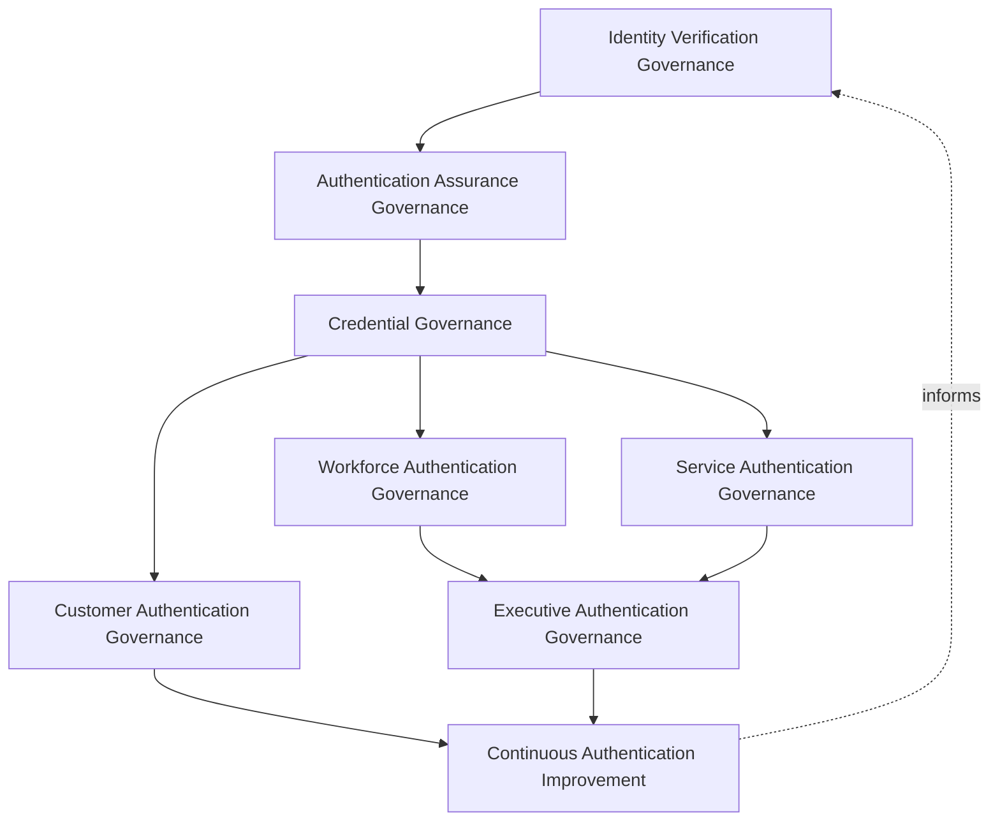
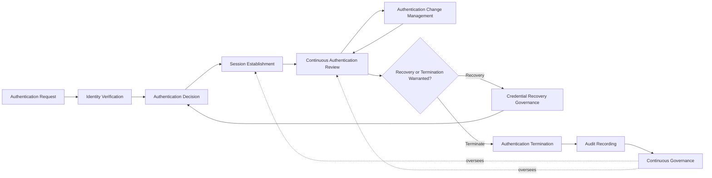
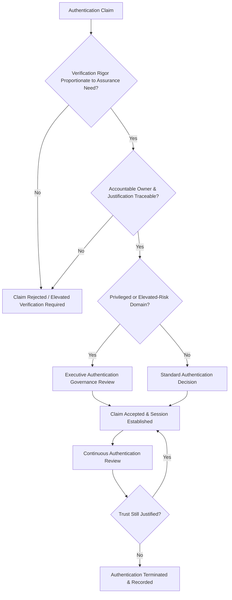
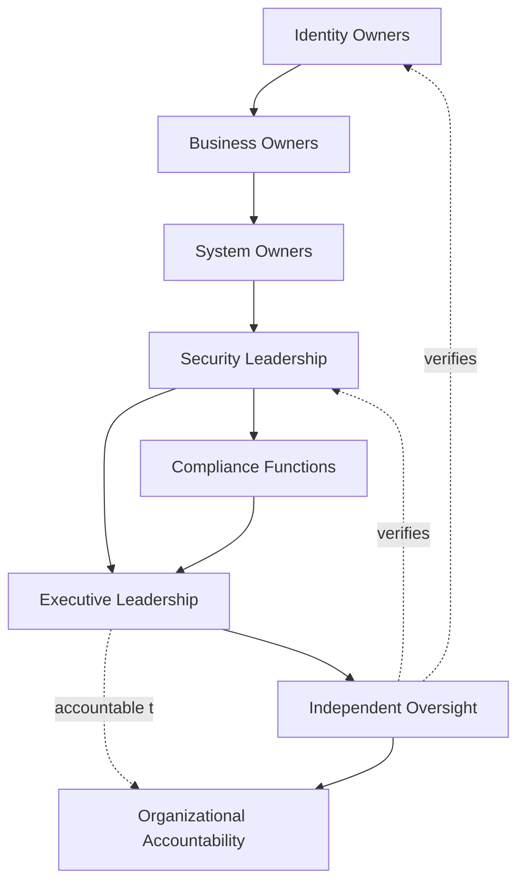
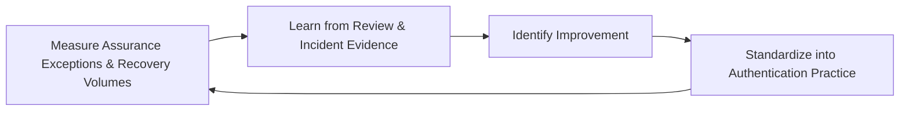
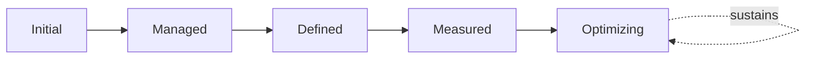

# Enterprise Authentication Governance Strategy

## 1. Document Purpose

This document defines the official Enterprise Authentication Governance Strategy for **StackLeo Tech Store** — the CISO/CIDO-owned executive charter under which every mechanism for establishing confidence in a claimed identity is governed across the platform. It establishes authentication governance, identity verification governance, authentication assurance governance, credential governance, organizational accountability, executive oversight, and long-term authentication maturity, consistent with ISO/IEC 27001, the NIST Cybersecurity Framework, NIST SP 800-63 digital identity concepts, Zero Trust principles, and TOGAF enterprise architecture thinking.

`authentication-strategy.md` remains the operational governance framework for authentication practice — the document that elaborates in full operational depth how verification, credentials, and assurance are governed for every domain. This document sits above it as executive mandate, consistent with how `identity-access-strategy.md` charters `identity-access-management.md` and `identity-lifecycle.md` charters `identity-lifecycle-management.md`: it does not restate operational detail, it establishes the philosophy, accountability structure, and executive expectations that give that operational practice authority and continuity.

- **Purpose of Authentication Governance** — to ensure that sufficient, risk-proportionate confidence in a claimed identity is established deliberately, by accountable people, against a consistent set of principles, before any access decision proceeds — never left to accumulate as ad hoc, per-team practice.
- **Relationship with Identity & Access Management** — this strategy is the authentication-specific elaboration of `identity-access-strategy.md`; where that strategy governs identity and access as a whole, this document governs specifically how confidence in each identity domain's claim is established and sustained.
- **Relationship with Identity Lifecycle Governance** — an identity must exist in an active, genuinely current lifecycle state, governed under `identity-lifecycle.md`, before authentication governance can meaningfully apply to it; a deactivated or archived identity has no legitimate claim to verify.
- **Relationship with Zero Trust** — this strategy operationalizes `zero-trust-strategy.md`'s "never trust, always verify" posture into standing executive accountability: who owns verification standards, who reviews authentication risk, and who is accountable when trust is extended based on a verified claim.
- **Relationship with Information Security** — authentication is the point at which trust is first extended into every other information security domain; this strategy protects the posture established in `security-governance.md` by ensuring that trust is never extended casually.
- **Relationship with Compliance Governance** — authentication assurance records — evidence of verification rigor, credential governance, and review — are frequently the specific artifact regulators and auditors request; this strategy ensures those records are reliably produced, coordinated with `compliance.md`.
- **Relationship with Enterprise Governance** — authentication governance is not a separate structure from how StackLeo governs the rest of the business; it is the authentication-specific application of the same executive accountability, policy discipline, and control assurance applied enterprise-wide in `policy-management.md`, `internal-controls.md`, and `audit-governance.md`.

This document is implementation-independent and vendor-neutral. It defines authentication governance philosophy, model, domains, and lifecycle conceptually — not specific identity providers, authentication vendors, MFA solutions, password managers, cloud providers, biometric products, security vendors, authentication protocols, MFA implementation methods, password policies, token formats, biometric implementations, federation technologies, infrastructure configurations, deployment architectures, implementation workflows, or code.

## 2. Authentication Governance Philosophy

Authentication governance at StackLeo rests on eight principles. Each exists to produce a specific business outcome — authentication is governed deliberately because it is the point at which trust is first extended, not as a technical formality.

### 2.1 Verify Before Trust

No access proceeds on the basis of assumed identity; a claim is treated as unverified until authentication confirms it.

- **Business Value** — ensures every downstream access and authorization decision rests on a genuinely confirmed foundation, not convenient assumption.

### 2.2 Continuous Identity Assurance

Confidence in an identity is never treated as permanently established at the point of login; it is re-evaluated across the session and at meaningful subsequent points of use.

- **Business Value** — limits how far a single moment of compromised trust can extend before it is caught and re-evaluated.

### 2.3 Identity-Centric Security

Every access decision across the platform begins with a verified identity, never with network origin or convenience alone.

- **Business Value** — ensures access decisions are always grounded in a genuine, accountable identity, not an assumption of trust based on circumstance.

### 2.4 Least Necessary Authentication Exposure

Authentication mechanisms collect and retain only the verification data genuinely necessary to establish the required assurance level, never more.

- **Business Value** — limits the consequence of any single compromise of authentication data to the minimum genuinely unavoidable exposure.

### 2.5 Accountability

Every authentication decision, credential governance action, and assurance exception traces to a specific, named, responsible party.

- **Business Value** — ensures every authentication-related decision has someone genuinely responsible for defending its continued justification.

### 2.6 Privacy Awareness

Authentication and credential data is itself sensitive personal data, governed under the same protective discipline as any other sensitive information StackLeo holds.

- **Business Value** — protects individuals' verification data from becoming a secondary point of exposure beyond its authentication purpose.

### 2.7 Governance by Design

Authentication governance structures are established deliberately as an authentication domain is introduced, not retrofitted once weak verification practice has already emerged.

- **Business Value** — prevents the costly, high-visibility discovery of authentication governance gaps only after an incident has already demonstrated their absence.

### 2.8 Continuous Improvement

Authentication governance practice matures over time, informed by real review findings, incidents, and the organization's growth in scale and complexity.

- **Business Value** — keeps authentication governance aligned with StackLeo's growth in workforce, customer base, and partner ecosystem.

## 3. Enterprise Authentication Governance Model

Authentication governance operates across eight conceptual layers, each holding accountability for a distinct dimension of authentication practice. Every layer here is elaborated in full operational depth in `authentication-strategy.md`.

### 3.1 Identity Verification Governance

- **Purpose** — own the coherence of how a claimed identity's genuineness is confirmed before any access decision proceeds.
- **Governance Scope** — oversight of verification rigor across every domain in Section 4, coordinated with `identity-lifecycle.md` (Section 5.2, Identity Validation).
- **Business Value** — ensures the identity behind every access decision is genuinely who or what it claims to be.
- **Executive Expectations** — leadership trusts verification rigor is proportionate to what is being protected, never uniformly weak.

### 3.2 Authentication Assurance Governance

- **Purpose** — own the coherence of how much confidence a given verification outcome genuinely provides.
- **Governance Scope** — oversight of assurance-level determination across every domain, proportionate to the consequence of a mistaken trust decision.
- **Business Value** — avoids both under-verifying high-consequence actions and over-verifying low-consequence ones, keeping friction proportionate to genuine risk.
- **Executive Expectations** — leadership trusts assurance decisions are grounded in genuine risk assessment, not convenience or habit.

### 3.3 Credential Governance

- **Purpose** — own the coherence of how the artifacts and factors used to authenticate are issued, maintained, and retired.
- **Governance Scope** — oversight of credential issuance, rotation, and revocation across every domain, applied without prescribing specific credential mechanisms.
- **Business Value** — ensures the material a claim rests on is itself trustworthy and never allowed to persist beyond its legitimate use.
- **Executive Expectations** — leadership trusts credentials are never left valid beyond genuine need.

### 3.4 Customer Authentication Governance

- **Purpose** — own the governance of how StackLeo's customers are verified.
- **Governance Scope** — oversight of Customer Authentication (Section 4.2), coordinated with `privacy.md` given the sensitivity of customer data.
- **Business Value** — protects the trust relationship every customer transaction depends on.
- **Executive Expectations** — leadership expects customer authentication governance to protect trust without adding friction to genuine shopping.

### 3.5 Workforce Authentication Governance

- **Purpose** — own the governance of how StackLeo's own employees and contractors are verified.
- **Governance Scope** — oversight of Workforce Authentication (Section 4.1) across the employment lifecycle, coordinated with `identity-lifecycle.md`.
- **Business Value** — ensures workforce verification reflects actual role and access sensitivity, not uniform treatment regardless of consequence.
- **Executive Expectations** — leadership trusts workforce authentication rigor scales with the sensitivity of what is being accessed.

### 3.6 Service Authentication Governance

- **Purpose** — own the governance of how non-human actors — service, machine, API, and AI agent identities — are verified.
- **Governance Scope** — oversight of Service & Machine, API, and AI Agent Authentication (Sections 4.6–4.8), coordinated with `service-accounts-management.md`.
- **Business Value** — prevents non-human authentication from becoming an ungoverned blind spot, since it is often granted broad, standing trust by default.
- **Executive Expectations** — leadership trusts machine and AI authentication receives the same governance rigor as human authentication, not less.

### 3.7 Executive Authentication Governance

- **Purpose** — own the elevated governance rigor Administrative and Privileged Authentication (Sections 4.3–4.4) require.
- **Governance Scope** — oversight of authentication for identities capable of affecting the platform broadly, coordinated with `privileged-access-management.md`.
- **Business Value** — ensures the identities with the greatest potential impact receive commensurately greater verification scrutiny.
- **Executive Expectations** — leadership expects privileged and administrative authentication to be reviewed with the highest priority in this model.

### 3.8 Continuous Authentication Improvement

- **Purpose** — govern the mechanism by which every other layer in this model matures over time.
- **Governance Scope** — consolidates findings from authentication reviews, audits, and incidents across every domain in Section 4.
- **Business Value** — prevents authentication governance itself from becoming the next thing that quietly stagnates as the organization scales.
- **Executive Expectations** — leadership expects authentication maturity to be assessed periodically, not assumed static once established.

### Enterprise Authentication Governance Matrix

| Layer | Purpose | Business Value | Executive Expectations |
|---|---|---|---|
| Identity Verification Governance | Own coherence of how claimed identity is confirmed | Ensures the identity behind a decision is genuine | Trusts rigor is proportionate to what is being protected |
| Authentication Assurance Governance | Own coherence of how much confidence verification provides | Avoids both under- and over-verifying relative to risk | Trusts assurance decisions are grounded in genuine risk |
| Credential Governance | Own coherence of credential issuance, maintenance, retirement | Ensures credentials never persist beyond legitimate use | Trusts credentials are never left valid beyond genuine need |
| Customer Authentication Governance | Own governance of customer verification | Protects the trust relationship every transaction depends on | Expects protection without added shopping friction |
| Workforce Authentication Governance | Own governance of employee/contractor verification | Ensures rigor reflects role and access sensitivity | Trusts rigor scales with sensitivity of what is accessed |
| Service Authentication Governance | Own governance of non-human and AI verification | Prevents machine authentication becoming an ungoverned blind spot | Trusts machine/AI authentication gets the same rigor |
| Executive Authentication Governance | Own elevated rigor for administrative/privileged identities | Ensures greatest-impact identities get greatest scrutiny | Expects privileged authentication reviewed with highest priority |
| Continuous Authentication Improvement | Govern maturation of every other layer | Prevents governance itself from stagnating | Expects maturity to be assessed periodically |

*Diagram 1: Enterprise Authentication Governance Framework — verification, assurance, and credential governance establish the foundation, domain-specific governance applies it, and executive-level oversight of privileged authentication converges on continuous improvement that feeds back into the model.*

## 4. Enterprise Authentication Domains

Authentication is governed across ten conceptual domains, each requiring a distinct verification and assurance emphasis.

### 4.1 Workforce Authentication

- **Purpose** — verify the identity of StackLeo's own employees and contractors.
- **Governance Considerations** — governed under Workforce Authentication Governance (Section 3.5), with rigor proportionate to the sensitivity of systems accessed.
- **Business Importance** — protects internal systems and data from access granted on an insufficiently verified claim.
- **Executive Expectations** — leadership expects workforce authentication rigor to scale with role sensitivity, not remain uniform.

### 4.2 Customer Authentication

- **Purpose** — verify the identity of individual shoppers accessing their StackLeo account.
- **Governance Considerations** — governed under Customer Authentication Governance (Section 3.4), coordinated with `privacy.md`.
- **Business Importance** — foundation of the direct-to-consumer relationship and repeat commerce central to the B2C model.
- **Executive Expectations** — leadership expects customer authentication to protect trust without adding friction to genuine shopping.

### 4.3 Administrative Authentication

- **Purpose** — verify the identity of staff with elevated capability to administer platform, security, or business-critical systems.
- **Governance Considerations** — governed under Executive Authentication Governance (Section 3.7), coordinated with `privileged-access-management.md`.
- **Business Importance** — protects against one of the highest-consequence categories of authentication compromise.
- **Executive Expectations** — leadership expects administrative authentication to require the highest assurance this model provides.

### 4.4 Privileged Authentication

- **Purpose** — verify the identity of any actor — human or machine — capable of affecting the platform broadly.
- **Governance Considerations** — governed under Executive Authentication Governance (Section 3.7), receiving StackLeo's highest verification scrutiny regardless of the domain the identity otherwise belongs to.
- **Business Importance** — protects against the single highest-consequence category of authentication risk on the platform.
- **Executive Expectations** — leadership expects privileged status itself, not just administrative title, to trigger elevated verification.

### 4.5 Vendor & Partner Authentication

- **Purpose** — verify the identity of external suppliers, service providers, and future marketplace sellers and B2B relationships.
- **Governance Considerations** — governed under Credential Governance (Section 3.3) in coordination with `identity-federation.md`, anticipating the multi-vendor marketplace model.
- **Business Importance** — protects the integrations commerce depends on and the trust foundation the marketplace model will depend on.
- **Executive Expectations** — leadership expects vendor and partner authentication to be scoped and reviewed ahead of, not after, marketplace launch.

### 4.6 Service & Machine Authentication

- **Purpose** — verify non-human identities used by application components and infrastructure to interact with one another.
- **Governance Considerations** — governed under Service Authentication Governance (Section 3.6), elaborated in `service-accounts-management.md`.
- **Business Importance** — protects against the common failure mode where service and machine authentication is granted broad, standing trust by default.
- **Executive Expectations** — leadership expects service and machine authentication to be inventoried and reviewed with the same rigor as human authentication.

### 4.7 API Authentication

- **Purpose** — verify identities exchanging data and capability through StackLeo's integration surface.
- **Governance Considerations** — governed under Service Authentication Governance (Section 3.6), scoped strictly to the specific integration purpose.
- **Business Importance** — protects the integration surface connecting StackLeo to payment, courier, and communication partners.
- **Executive Expectations** — leadership expects API authentication to be reviewed whenever an integration's purpose or ownership changes.

### 4.8 AI Agent Authentication

- **Purpose** — verify autonomous or semi-autonomous AI-driven actors performing actions on the platform.
- **Governance Considerations** — governed under Service Authentication Governance (Section 3.6) as a distinct, named category, anticipating growing AI-assisted capability.
- **Business Importance** — protects against a category of identity that can act at scale and speed, making an unverified or under-verified claim especially consequential.
- **Executive Expectations** — leadership expects AI agent authentication to be explicitly governed, never an informal extension of the human identity that configured it.

### 4.9 Federated Authentication

- **Purpose** — verify identities originating from an external organization StackLeo has extended a bounded degree of trust to.
- **Governance Considerations** — governed under Credential Governance (Section 3.3) in coordination with `identity-federation.md`, the full dedicated elaboration of federated trust governance.
- **Business Importance** — enables corporate and B2B relationships while protecting against risk introduced by parties outside StackLeo's direct control.
- **Executive Expectations** — leadership expects federated authentication trust to be reviewed and bounded before extension, never assumed equivalent to internal verification.

### 4.10 Temporary & External Authentication

- **Purpose** — verify identities granted for a bounded purpose or duration — contractors, seasonal staff, auditors, or other externally sourced access needs.
- **Governance Considerations** — governed jointly across Workforce and Credential Governance (Sections 3.5, 3.3), with mandatory expiration as a defining characteristic.
- **Business Importance** — prevents temporary or externally sourced authentication trust from becoming a permanent, unreviewed grant.
- **Executive Expectations** — leadership expects every temporary or external authentication grant to carry an explicit expiration, never open-ended by default.

### Enterprise Authentication Domain Matrix

| Domain | Purpose | Business Importance | Executive Expectations |
|---|---|---|---|
| Workforce Authentication | Verify employees and contractors | Protects internal systems from insufficiently verified access | Rigor scales with role sensitivity, not uniform |
| Customer Authentication | Verify individual shoppers | Foundation of the direct-to-consumer relationship | Protects trust without adding shopping friction |
| Administrative Authentication | Verify staff with elevated system capability | Protects against a high-consequence compromise category | Requires the highest assurance this model provides |
| Privileged Authentication | Verify any actor capable of broad platform impact | Protects against the single highest-consequence risk category | Privileged status itself triggers elevated verification |
| Vendor & Partner Authentication | Verify suppliers, providers, marketplace/B2B relationships | Protects integrations and the future marketplace trust foundation | Scoped and reviewed ahead of marketplace launch |
| Service & Machine Authentication | Verify non-human, application-level and infrastructure actors | Prevents default standing trust for machine authentication | Inventoried and reviewed with the same rigor as human authentication |
| API Authentication | Verify system-to-system exchange actors | Protects the integration surface commerce depends on | Reviewed when integration purpose or ownership changes |
| AI Agent Authentication | Verify autonomous or semi-autonomous AI-driven actors | Protects against scale-and-speed risk of under-verified AI actors | Explicitly governed, never an informal human extension |
| Federated Authentication | Verify identities from externally trusted organizations | Enables corporate/B2B relationships while bounding external risk | Trust reviewed and bounded before extension |
| Temporary & External Authentication | Verify bounded-purpose or bounded-duration access | Prevents temporary trust becoming a permanent grant | Every grant carries an explicit expiration |

## 5. Enterprise Authentication Lifecycle

Authentication is governed across ten conceptual lifecycle stages, applicable across every domain in Section 4.

### 5.1 Authentication Request

- **Purpose** — formally initiate an attempt to establish confidence in a claimed identity.
- **Governance Objectives** — require every request to be attributable to a specific claimed identity and domain.
- **Business Value** — ensures authentication activity is always traceable to a specific, stated claim.

### 5.2 Identity Verification

- **Purpose** — confirm the claimed identity genuinely represents who or what it claims to be, governed under Identity Verification Governance (Section 3.1).
- **Governance Objectives** — require verification rigor proportionate to the identity's domain and intended access.
- **Business Value** — ensures the identity behind the request is genuine before any decision proceeds.

### 5.3 Authentication Decision

- **Purpose** — formally decide, based on verification outcome and required assurance level, whether the claim is accepted.
- **Governance Objectives** — require the decision to reflect Authentication Assurance Governance (Section 3.2), never a default acceptance.
- **Business Value** — ensures trust is extended only when genuine assurance requirements are met.

### 5.4 Session Establishment

- **Purpose** — formally establish the bounded period during which the accepted claim is treated as trusted.
- **Governance Objectives** — require the trust extended by a session to be scoped and time-bound, never open-ended.
- **Business Value** — limits how long a single authentication decision is relied upon before re-evaluation.

### 5.5 Continuous Authentication Review

- **Purpose** — re-evaluate established trust across the active session, consistent with Continuous Identity Assurance (Section 2.2).
- **Governance Objectives** — require re-evaluation to occur at meaningful points, not only once at initial login.
- **Business Value** — limits how far a single moment of compromised trust can extend before it is caught.

### 5.6 Authentication Change Management

- **Purpose** — govern deliberate changes to how an identity is verified as circumstances genuinely change.
- **Governance Objectives** — require every change to assurance requirements or verification approach to be justified and recorded.
- **Business Value** — prevents verification requirements from silently weakening or drifting out of proportion to risk.

### 5.7 Credential Recovery Governance

- **Purpose** — govern the process by which an identity regains the ability to authenticate after losing its credential.
- **Governance Objectives** — require recovery to itself be governed with assurance proportionate to the access it restores, never treated as a lesser-scrutiny bypass.
- **Business Value** — closes one of the most commonly exploited gaps in authentication practice: recovery paths weaker than the authentication they restore.

### 5.8 Authentication Termination

- **Purpose** — formally end the trust extended by a session or credential once its legitimate purpose has ended.
- **Governance Objectives** — require termination to be triggered promptly by the relevant event — logout, timeout, or lifecycle deactivation under `identity-lifecycle.md`.
- **Business Value** — prevents extended trust from silently outliving the circumstance that justified it.

### 5.9 Audit Recording

- **Purpose** — record authentication events in a form suitable for independent review.
- **Governance Objectives** — require every authentication decision, exception, and termination to leave a durable, reviewable record.
- **Business Value** — ensures authentication governance can be independently verified, not merely asserted.

### 5.10 Continuous Governance

- **Purpose** — sustain oversight of authentication practice across every stage, rather than treating governance as a one-time gate.
- **Governance Objectives** — require periodic reassessment of assurance requirements and practice to run continuously.
- **Business Value** — catches weakening or drifting authentication practice before it becomes a genuine risk.

### Authentication Lifecycle Matrix

| Stage | Purpose | Governance Objective | Business Value |
|---|---|---|---|
| Authentication Request | Formally initiate an attempt to establish confidence | Attributable to a specific claimed identity and domain | Ensures activity is traceable to a specific claim |
| Identity Verification | Confirm the identity genuinely represents its claim | Rigor proportionate to domain and intended access | Ensures genuineness before any decision proceeds |
| Authentication Decision | Decide whether the claim is accepted | Reflects required assurance level, never default acceptance | Ensures trust extended only when assurance is met |
| Session Establishment | Establish the bounded trusted period | Scoped and time-bound, never open-ended | Limits reliance on a single decision over time |
| Continuous Authentication Review | Re-evaluate trust across the active session | Re-evaluation at meaningful points, not only at login | Limits how far compromised trust can extend |
| Authentication Change Management | Govern changes to verification as circumstances change | Every change justified and recorded | Prevents requirements silently weakening or drifting |
| Credential Recovery Governance | Govern regaining authentication ability after loss | Assurance proportionate to the access restored | Closes a commonly exploited authentication gap |
| Authentication Termination | End trust once its legitimate purpose has ended | Triggered promptly by the relevant event | Prevents trust silently outliving its justification |
| Audit Recording | Record events for independent review | Every decision, exception, termination leaves a record | Ensures governance can be independently verified |
| Continuous Governance | Sustain oversight across every stage | Reassessment runs continuously | Catches drifting practice before it becomes risk |

*Diagram 2: Enterprise Authentication Lifecycle — a claim proceeds from request through verification and decision into a bounded, continuously reviewed session, with recovery, termination, and audit recording handling its exceptions and wind-down under continuous governance.*

## 6. Authentication Governance Principles

- **Identity Assurance** — verification rigor is proportionate to the assurance level genuinely required, never uniform regardless of consequence.
- **Accountability** — every authentication decision traces to a specific, named, responsible party, consistent with Section 2.5.
- **Traceability** — every authentication decision can be traced to its justification, method, and timing.
- **Auditability** — authentication events, exceptions, and reviews can be independently reviewed after the fact, supporting ISO/IEC 27001-aligned assurance.
- **Privacy Awareness** — authentication and credential data is governed with the same protective discipline applied to any other sensitive personal data.
- **Business Alignment** — authentication governance decisions are made in service of genuine business need, never imposed as friction disconnected from business purpose.
- **Risk Awareness** — authentication governance decisions weigh business impact and likelihood, directing attention toward the domains carrying the greatest genuine consequence.
- **Continuous Improvement** — governance practice matures over time, informed by real review findings and incidents.

### Authentication Governance Principles Matrix

| Principle | Description | Business Value |
|---|---|---|
| Identity Assurance | Verification rigor proportionate to assurance genuinely required | Avoids both under- and over-verifying relative to consequence |
| Accountability | Every decision traces to a specific, named, responsible party | Ensures authentication decisions have a clear owner |
| Traceability | Decisions traceable to justification, method, timing | Enables defensible, evidence-based authentication decisions |
| Auditability | Events, exceptions, reviews independently reviewable | Supports ISO/IEC 27001-aligned assurance and audit confidence |
| Privacy Awareness | Authentication data governed under the same protective discipline | Protects individuals' verification data from secondary exposure |
| Business Alignment | Decisions made in service of genuine business need | Keeps governance followed rather than resented as friction |
| Risk Awareness | Decisions weigh business impact and likelihood | Directs attention toward the greatest genuine consequence |
| Continuous Improvement | Practice matures from real review findings and incidents | Keeps governance aligned with organizational growth |

*Diagram 4: Enterprise Authentication Decision Flow — a claim is checked for proportionate assurance and traceable accountability, escalated for elevated review where privileged, accepted into a session, and continuously reassessed until reconfirmed or terminated.*

## 7. Authentication Assurance & Accountability

Governance authority for authentication assurance is distributed deliberately across eight accountable functions, defined here at the governance-objective level, without prescribing specific authentication mechanisms.

### 7.1 Identity Owners

- **Governance Objective** — each identity's owner, established under `identity-lifecycle.md` (Section 7.1), is accountable for confirming its authentication requirements remain current.
- **Business Value** — prevents authentication requirements from becoming stale alongside an identity's own state.

### 7.2 Security Leadership

- **Governance Objective** — security leadership owns the coherence and enforcement of this strategy across every domain, layer, and stage it defines.
- **Business Value** — provides a single point of accountability for whether authentication governance is genuinely functioning as intended.

### 7.3 Business Owners

- **Governance Objective** — business functions own the justification for the assurance level a given authentication domain genuinely requires.
- **Business Value** — keeps assurance decisions grounded in real business consequence rather than technical convenience alone.

### 7.4 System Owners

- **Governance Objective** — each system or platform component has an accountable owner responsible for the authentication it requires and enforces.
- **Business Value** — ensures no system's authentication posture is left ungoverned because no one considered it theirs to own.

### 7.5 Compliance Functions

- **Governance Objective** — compliance functions confirm that authentication governance satisfies applicable regulatory and contractual obligations, coordinated with `compliance.md`.
- **Business Value** — ensures authentication governance protects the business's standing with regulators, partners, and enterprise customers.

### 7.6 Executive Leadership

- **Governance Objective** — executive leadership sets the risk appetite this strategy operates within and holds security leadership accountable for its execution.
- **Business Value** — ensures authentication governance decisions reflect genuine organizational priority, not a delegated technical afterthought.

### 7.7 Independent Oversight

- **Governance Objective** — an independent function, separate from those who design and operate authentication governance, periodically verifies it is genuinely functioning as documented.
- **Business Value** — prevents governance from being assumed effective on the word of the same function responsible for running it.

### 7.8 Organizational Accountability

- **Governance Objective** — accountability for authentication is a property of the organization as a whole, distributed deliberately across Sections 7.1–7.7, not concentrated in or delegated entirely to any single role.
- **Business Value** — ensures no single point of failure exists in the organization's ability to answer "who is accountable for this authentication decision."

### Authentication Assurance & Accountability Matrix

| Role | Governance Objective | Business Value |
|---|---|---|
| Identity Owners | Confirm authentication requirements remain current for owned identities | Prevents requirements becoming stale alongside identity state |
| Security Leadership | Own coherence and enforcement of this strategy | Provides a single point of accountability for governance function |
| Business Owners | Own the justification for required assurance levels | Keeps assurance decisions grounded in genuine business consequence |
| System Owners | Own the authentication posture a system requires and enforces | Ensures no system's authentication posture goes ungoverned |
| Compliance Functions | Confirm alignment with regulatory/contractual obligations | Protects standing with regulators, partners, enterprise customers |
| Executive Leadership | Set risk appetite and hold security leadership accountable | Ensures decisions reflect genuine organizational priority |
| Independent Oversight | Independently verify governance functions as documented | Prevents self-assessed assumption of effectiveness |
| Organizational Accountability | Distribute accountability across every role, not one | Removes single points of failure in accountability |

*Diagram 3: Authentication Assurance Operating Model — accountability flows from individual identity ownership through business and system ownership into security leadership, with compliance and executive leadership converging on independent oversight and shared organizational accountability.*

## 8. Executive Oversight

- **Authentication Governance Reviews** — the overall coherence of authentication governance is formally reviewed on a regular cadence, consistent with `security-governance.md` (Section 6).
- **Executive Reporting** — aggregated authentication health — assurance exceptions, recovery volumes, review completion — is reported to executive leadership.
- **Authentication Risk Reviews** — authentication-related risk from `risk-management.md` and `security-risk-management.md` is reviewed alongside broader enterprise and security risk, never in isolation.
- **Governance Reviews** — the governance model, domains, and lifecycle defined in this strategy (Sections 3–7) are periodically reassessed for continued fitness.
- **Documentation Governance** — this strategy's relationship to `identity-access-strategy.md`, `identity-lifecycle.md`, and `authentication-strategy.md` is kept current as those documents evolve.
- **Audit Readiness** — authentication governance decisions, reviews, and their outcomes are maintained in a state ready for internal or external audit at any time, coordinated with `audit-governance.md`.

### Executive Oversight Matrix

| Oversight Mechanism | Purpose | Governance Role |
|---|---|---|
| Authentication Governance Reviews | Confirm overall authentication governance coherence | Regular, predictable cadence for the strategy as a whole |
| Executive Reporting | Provide leadership a single, coherent authentication picture | Reports assurance exceptions, recovery volumes, review completion |
| Authentication Risk Reviews | Review authentication risk alongside broader risk visibility | Not conducted in isolation from enterprise or security risk |
| Governance Reviews | Reassess the governance model itself for continued fitness | Applies to Sections 3–7 of this strategy |
| Documentation Governance | Keep this strategy's subordinate relationships current | Updated as related documents evolve |
| Audit Readiness | Maintain decisions and reviews ready for independent review | Continuous state, coordinated with audit governance |

### Governance Responsibility Matrix

| Role | Responsibility |
|---|---|
| CISO / CIDO | Owns coherence and enforcement of this strategy, in partnership with Executive Leadership. |
| Authentication Governance Lead | Owns the operational governance model in `authentication-strategy.md` for every domain. |
| Security Leadership | Owns Executive Authentication Governance (Section 3.7), the highest-scrutiny governance layer. |
| Engineering Leads | Own Service Authentication Governance (Section 3.6) for machine, API, and AI agent authentication within their domain. |
| Partner / Vendor Manager | Coordinates governance of Vendor & Partner and Federated Authentication (Sections 4.5, 4.9). |
| HR / People Lead | Coordinates lifecycle-linked authentication changes for Workforce and Temporary & External Authentication (Sections 4.1, 4.10). |
| Executive Leadership | Reviews significant authentication risk exceptions and overall governance health. |
| Independent Oversight / Internal Audit | Independently verifies that authentication governance records reflect actual practice. |

## 9. Future Readiness

This strategy is designed to remain valid as StackLeo evolves in scale, geography, and organizational complexity, without requiring redefinition of its underlying philosophy.

- **Passwordless Futures** — Credential Governance (Section 3.3) is defined independently of any specific credential type, so it applies unchanged as verification approaches evolve away from shared secrets.
- **AI Identity Verification** — as verification approaches increasingly incorporate AI-assisted analysis, they remain governed under Identity Verification Governance (Section 3.1) and Authentication Assurance Governance (Section 3.2) at the same rigor as any other verification method.
- **Decentralized Identity Ecosystems** — Federated Authentication (Section 4.9) is structured to absorb emerging models of externally issued, self-managed identity credentials without requiring this strategy to be rewritten.
- **Global Expansion** — the governance model, domains, and lifecycle (Sections 3–5) are defined independently of jurisdiction, so they extend coherently as StackLeo expands from Bangladesh into South Asia and global markets.
- **Multi-Tenant Platforms** — where future architecture introduces tenant isolation, authentication governance extends to explicitly scope assurance requirements per tenant.
- **Enterprise Scale** — the governance model, domains, and lifecycle defined throughout this strategy are defined independently of organizational size, so they remain coherent as authentication volume grows substantially.
- **Continuous Authentication Intelligence** — Continuous Authentication Review (Section 5.5) and Continuous Authentication Improvement (Section 3.8) are structured to absorb increasingly automated, evidence-driven risk signal as it becomes available.
- **Emerging Digital Trust Models** — this strategy's governance discipline is treated as a direct contributor to the digital trust customers, partners, and regulators extend to StackLeo, remaining structured to absorb genuinely new trust models as they emerge.

## 10. Authentication Governance Maturity Model

Authentication governance maturity is described across five conceptual levels, consistent with established process maturity thinking and NIST Cybersecurity Framework tiers.

- **Initial** — authentication governance, where it exists, is informal and inconsistent; verification rigor varies unpredictably, and ownership is unclear.
- **Managed** — basic governance exists for individual authentication domains, but consistency across the ten domains in Section 4 varies significantly.
- **Defined** — the governance model, domains, and lifecycle are standardized, documented, and consistently applied across the organization, consistent with the model defined throughout this strategy.
- **Measured** — assurance exceptions, recovery volumes, and review completion are measured systematically, and decisions are grounded in genuine evidence rather than qualitative impression alone.
- **Optimizing** — authentication governance is continuously and deliberately improved based on quantitative evidence and organizational learning; improvement itself is a managed, ongoing discipline rather than an occasional initiative.

### Authentication Governance Maturity Model Matrix

| Level | Characteristics | Primary Focus |
|---|---|---|
| Initial | Informal, inconsistent governance; verification rigor varies unpredictably | Ad hoc, individually-dependent authentication practice |
| Managed | Basic governance exists per domain; consistency varies | Domain-level consistency |
| Defined | Standardized governance model, domains, and lifecycle | Organization-wide consistency and clear ownership |
| Measured | Assurance exceptions and recovery volumes measured systematically | Evidence-based authentication governance decisions |
| Optimizing | Practice continuously and deliberately improved from evidence | Sustained, deliberate improvement as a discipline |

*Diagram 5: Continuous Authentication Improvement Cycle — authentication review and audit outcomes are measured, learned from, improved upon, and standardized back into governed practice, on a continuing basis.*

*Diagram 6: Authentication Governance Maturity Progression Model — maturity advances from informal, unreviewed authentication practice toward standardized, measured, and continuously optimized authentication governance.*

## 11. Anti-Patterns

The following recurring failure patterns are explicitly recognized and avoided, as each one structurally undermines this strategy.

### Anti-Pattern Summary

| Anti-Pattern | Why It's Avoided |
|---|---|
| Trust Without Verification | Contradicts Verify Before Trust (Section 2.1); access granted on an assumed rather than confirmed identity undermines every downstream decision built on it. |
| Weak Identity Assurance | Contradicts Identity Assurance (Section 6); verification rigor disproportionately weak relative to consequence leaves high-impact access under-protected. |
| Shared Credentials | Contradicts Accountability (Section 2.5, Section 6); shared credentials destroy individual accountability for any action taken. |
| Weak Executive Visibility | Contradicts Executive Reporting (Section 8); leadership cannot govern authentication risk it is never shown. |
| Poor Documentation | Undermines Documentation Governance (Section 8) and Traceability (Section 6), leaving authentication decisions unclear or unverifiable after the fact. |
| Siloed Authentication Governance | Contradicts the Enterprise Authentication Governance Model (Section 3); domain-by-domain practice that never converges leaves no coherent, organization-wide picture of authentication risk. |
| Compliance Without Governance | Contradicts Compliance Functions (Section 7.5); satisfying a regulatory checklist without genuine underlying governance leaves the organization compliant on paper and exposed in practice. |
| Missing Continuous Improvement | Contradicts Continuous Improvement (Section 2.8) and Continuous Authentication Improvement (Section 3.8); without deliberate improvement, governance stagnates as the organization and authentication volume grow. |

## 12. Document Information

| Property | Value |
|----------|-------|
| Document | authentication-governance.md |
| Version | 1.0.0 |
| Status | Active |
| Maintained By | StackLeo |
| Last Updated | 2026-07-24 |

---

© StackLeo. All Rights Reserved.
