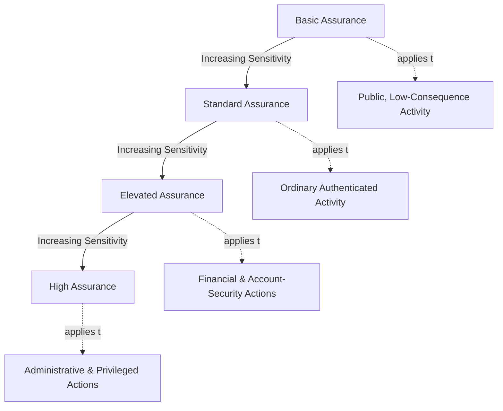
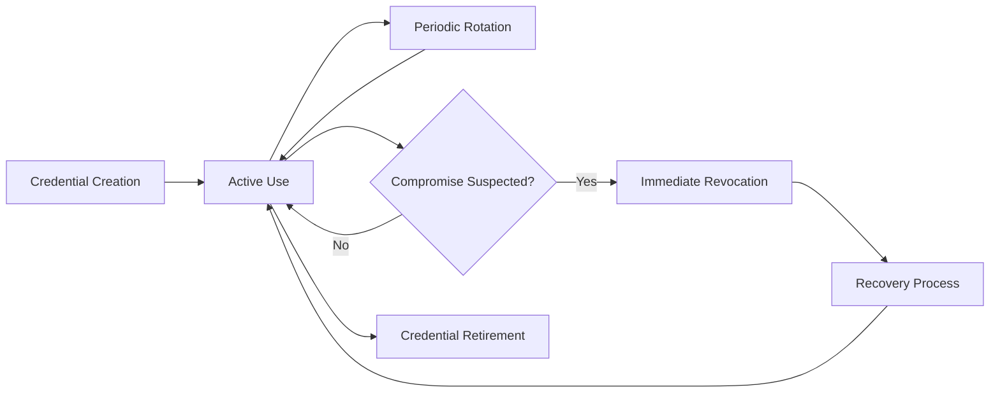
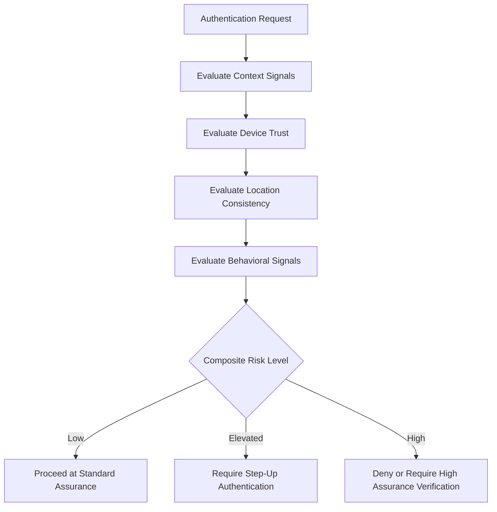
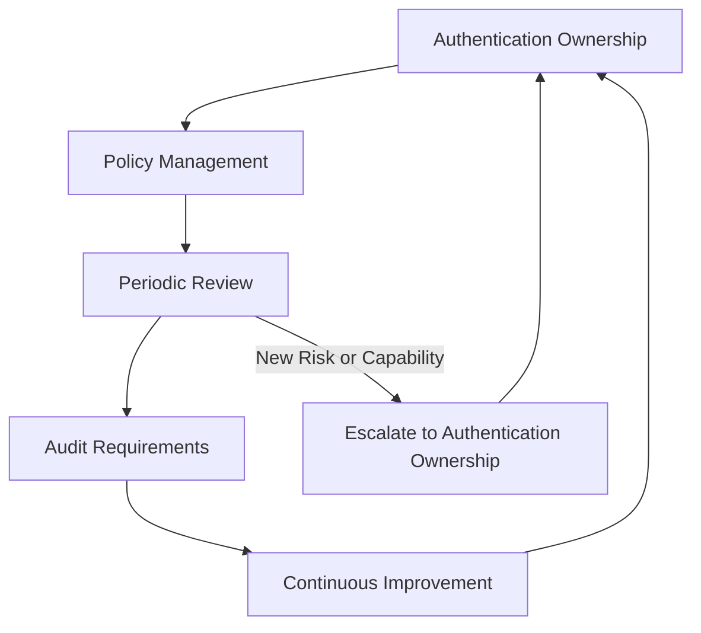
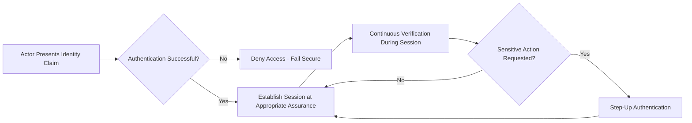

# Authentication

## 1. Document Purpose

This document defines the official Enterprise Authentication Strategy for **StackLeo Tech Store**. It establishes how the platform verifies that an actor is who they claim to be, balancing security, usability, scalability, and future evolution.

- **Purpose of Authentication** — to establish, at the point of access, sufficient confidence that an actor's claimed identity is genuine before any further access decision is considered.
- **Relationship with Identity Management** — authentication verifies the claim of an identity whose existence and governance are defined in `identity-management.md`; a well-managed identity is the prerequisite this process depends upon.
- **Relationship with Authorization** — authentication answers *who is this actor*; `authorization.md` answers *what may this verified actor do*. Authentication is a strict prerequisite to authorization, never a substitute for it.
- **Relationship with Zero Trust** — authentication is the first and most frequent verification point in the Zero Trust vision defined in `security-architecture.md` (Section 2); "never trust, always verify" begins with verifying identity itself.
- **Relationship with Business Trust** — every customer, employee, and partner interaction with StackLeo depends on the platform correctly distinguishing legitimate actors from illegitimate ones; authentication failure is a direct failure of the trust described in `01_Business/vision.md`.

This document is implementation-independent and vendor-neutral. It defines authentication philosophy, assurance levels, and governance — not specific authentication protocols, session token formats, or code.

## 2. Authentication Philosophy

- **Verify Before Trust** — no access is granted on the basis of assumed identity; a claim is treated as unverified until authentication confirms it.
- **Continuous Verification** — authentication confidence is not treated as permanent once established at login; it is re-evaluated across a session and at points of elevated risk, consistent with `security-principles.md` (Section 3.10).
- **User-Centric Security** — authentication is designed around the realistic behavior of customers and staff, not an idealized user who behaves perfectly.
- **Adaptive Security** — the strength of verification required scales with the risk and sensitivity of what is being accessed, rather than applying uniformly regardless of consequence (Section 7).
- **Privacy Awareness** — authentication data (credentials, verification signals) is itself sensitive and handled under the same minimization and protection principles as any other customer data, per `security-principles.md` (Section 6).
- **Security Without Friction** — strong authentication and a usable customer experience are treated as compatible goals, not a forced trade-off; unnecessary friction is a design failure, not an unavoidable cost of security.

## 3. Authentication Assurance Levels

Not every action requires the same confidence in an actor's identity. StackLeo recognizes four conceptual assurance levels:

| Level | Business Context | Appropriate Usage | Risk Considerations |
|---|---|---|---|
| Basic Assurance | Low-consequence, easily reversible actions. | Browsing the catalog, viewing public content. | Minimal risk if the underlying identity claim is later found incorrect. |
| Standard Assurance | Ordinary authenticated customer or staff activity. | Placing an order, viewing order history, routine staff tasks. | Moderate risk; incorrect identity could affect an individual account or transaction. |
| Elevated Assurance | Actions with meaningful financial or account-security consequence. | Changing account credentials, modifying payment details, high-value orders. | Higher risk; incorrect identity could enable fraud or account takeover. |
| High Assurance | Actions with organization-wide or highly sensitive consequence. | Administrative configuration, privileged operations, sensitive data export. | Highest risk; incorrect identity could compromise the platform or many customers at once. |

### Authentication Assurance Levels

| Level | Typical Actor | Verification Expectation |
|---|---|---|
| Basic Assurance | Anonymous or lightly verified visitor | Minimal or no verification required |
| Standard Assurance | Registered customer, ordinary staff role | Single verified factor, sustained by session trust |
| Elevated Assurance | Customer or staff performing sensitive action | Reauthentication or additional factor, per Step-Up Authentication (Section 7) |
| High Assurance | Administrator or privileged identity | Strongest available verification, consistent with Privileged Identity Management (`identity-management.md`, Section 7) |

*Diagram 2: Authentication Assurance Model — required assurance scales with the consequence of the action being performed.*

## 4. Authentication Methods

StackLeo's authentication approach draws on several conceptual categories of verification, without prescribing a specific technical protocol:

- **Knowledge-Based Authentication** — verification based on something the actor knows.
  - *Purpose* — establish a baseline, familiar form of verification for most actors.
  - *Benefits* — broadly understood and simple to use across a wide customer base.
  - *Trade-offs* — vulnerable to guessing, reuse across services, and disclosure if not paired with other safeguards.
- **Possession-Based Authentication** — verification based on something the actor possesses.
  - *Purpose* — add a factor that cannot be satisfied by knowledge alone.
  - *Benefits* — significantly raises the difficulty of impersonation compared to knowledge alone.
  - *Trade-offs* — depends on the actor retaining and having access to the possessed item at the point of use.
- **Inherence-Based Authentication** — verification based on something inherent to the actor.
  - *Purpose* — provide a factor closely bound to the individual actor.
  - *Benefits* — difficult to share or transfer, supporting strong individual accountability.
  - *Trade-offs* — requires careful, privacy-conscious handling given its sensitive and immutable nature.
- **Multi-Factor Authentication** — combining two or more of the above categories for a single verification event.
  - *Purpose* — ensure that compromise of a single factor is insufficient to establish trust.
  - *Benefits* — materially raises assurance for Elevated and High Assurance contexts (Section 3).
  - *Trade-offs* — introduces additional steps that must be balanced against Security Without Friction (Section 2).
- **Passwordless Authentication (Future)** — verification approaches that reduce or remove reliance on a memorized knowledge factor.
  - *Purpose* — reduce the risk and friction historically associated with knowledge-based credentials.
  - *Benefits* — can improve both security posture and customer experience simultaneously.
  - *Trade-offs* — requires careful design of recovery and account-binding to avoid introducing new gaps.
- **Federated Authentication (Future)** — accepting verification performed by a trusted external identity provider.
  - *Purpose* — support Enterprise SSO and future partner or corporate identity relationships.
  - *Benefits* — reduces duplicate verification burden for identities already trusted elsewhere.
  - *Trade-offs* — extends trust to the federation partner's own verification rigor, requiring deliberate boundary treatment consistent with `security-architecture.md` (Section 4).

### Authentication Method Comparison

| Method | Primary Strength | Primary Limitation | Best Suited To |
|---|---|---|---|
| Knowledge-Based | Familiar, broadly usable | Vulnerable to guessing or reuse | Baseline Standard Assurance |
| Possession-Based | Raises difficulty of impersonation | Depends on actor retaining possession | Multi-Factor combinations, Elevated Assurance |
| Inherence-Based | Difficult to share or transfer | Requires careful, privacy-conscious handling | High-assurance individual verification |
| Multi-Factor | Compromise of one factor is insufficient | Added verification steps | Elevated and High Assurance |
| Passwordless (Future) | Reduces reliance on memorized secrets | Requires careful recovery design | Improving both security and experience together |
| Federated (Future) | Reduces duplicate verification burden | Extends trust to an external party | Enterprise SSO, future partner identity |

## 5. Session Trust Concepts

- **Session Establishment** — a session begins once authentication succeeds, representing a bounded period of ongoing trust rather than a one-time event.
- **Session Continuity** — a session remains valid only as long as the conditions under which it was established remain consistent with expected behavior.
- **Session Expiration** — every session has a bounded lifetime, after which continued trust requires renewed verification.
- **Reauthentication** — sensitive actions or elapsed time may require an actor to re-establish their identity even within an otherwise valid session, consistent with Elevated and High Assurance (Section 3).
- **Session Revocation** — a session can be deliberately ended before its natural expiration, in response to a detected risk signal or an explicit actor request (such as logging out elsewhere).
- **Device Awareness** — the device associated with a session is a meaningful input to how much trust that session continues to warrant, distinct from the identity itself.

## 6. Credential Management Principles

- **Credential Lifecycle** — credentials are created, used, and eventually retired following a lifecycle consistent with the identity lifecycle in `identity-management.md` (Section 4).
- **Credential Protection** — credentials are protected as sensitive data throughout their lifecycle, never handled or stored more loosely than their sensitivity warrants.
- **Rotation Awareness** — credentials are expected to be changed periodically or in response to a suspected compromise, rather than persisting unchanged indefinitely.
- **Recovery Considerations** — the process for recovering access after a lost or forgotten credential is treated as a security-sensitive process in its own right, not an informal exception path.
- **Revocation** — a credential can be invalidated immediately when it is known or suspected to be compromised, independent of its normal lifecycle stage.
- **User Responsibility** — actors share responsibility for protecting their own credentials; the platform's role is to make secure behavior the easiest behavior, consistent with Security Without Friction (Section 2).

*Diagram 3: Credential Lifecycle.*

### Credential Lifecycle Summary

| Stage | Description | Primary Concern |
|---|---|---|
| Creation | Credential is established alongside or after identity verification. | Ensuring the credential is bound to the correct, verified identity. |
| Active Use | Credential is used to authenticate ongoing activity. | Detecting unusual use inconsistent with the legitimate actor. |
| Rotation | Credential is periodically or proactively changed. | Limiting the useful lifespan of a credential if unknowingly exposed. |
| Revocation | Credential is invalidated in response to suspected compromise. | Ensuring revocation takes effect immediately and completely. |
| Recovery | Access is restored through a deliberate, verified process. | Preventing recovery itself from becoming an exploitable weakness. |
| Retirement | Credential is permanently retired at the end of its purpose. | Ensuring no residual access remains attached to a retired credential. |

## 7. Adaptive Authentication

- **Context Awareness** — the circumstances surrounding a request (time, pattern of activity) inform how much additional verification, if any, is warranted.
- **Device Awareness** — a request from a previously unrecognized or untrusted device is treated as warranting more scrutiny than one from a consistently recognized device.
- **Location Awareness** — a request originating from an unexpected or inconsistent location is treated as a meaningful risk signal.
- **Behavioral Signals** — patterns of behavior significantly inconsistent with an actor's established norm inform risk-based decisions.
- **Risk-Based Authentication** — the combination of the signals above determines the level of assurance required for a given request, rather than applying a single fixed requirement to everyone.
- **Step-Up Authentication** — when risk or action sensitivity increases mid-session, the platform can require renewed or stronger verification before proceeding, without necessarily ending the underlying session entirely.

*Diagram 4: Adaptive Authentication Decision Flow.*

### Adaptive Authentication Signals

| Signal | What It Evaluates | Risk Implication if Inconsistent |
|---|---|---|
| Context | Timing and pattern of the request | May indicate automated or unusual activity |
| Device | Whether the device is previously recognized and trusted | May indicate use from a compromised or unfamiliar device |
| Location | Consistency with the actor's expected location pattern | May indicate credential compromise or account sharing |
| Behavior | Consistency with the actor's established behavioral pattern | May indicate an actor other than the legitimate identity holder |

## 8. Authentication Across Domains

Authentication needs differ meaningfully across the actors and channels StackLeo serves:

- **Customer Portal** — optimized for broad usability at Standard Assurance, with Elevated Assurance applied to sensitive account and payment actions.
- **Admin Portal** — defaults to Elevated or High Assurance given the business-critical capability administrative identities can access, per `identity-management.md` (Section 7).
- **Corporate Customers (Future)** — may require organization-level authentication considerations, anticipating future Federated Authentication.
- **Internal Operations** — staff authentication is scoped to role-appropriate assurance, avoiding uniform High Assurance where it would introduce unnecessary friction for low-risk tasks.
- **API Consumers** — authenticated as distinct service or partner identities, per `identity-management.md` (Section 8), with assurance proportionate to the sensitivity of the API being consumed, per `api-security.md`.
- **Service Identities** — authenticate through mechanisms appropriate to unattended, machine-to-machine operation rather than interactive verification.
- **Future Marketplace Vendors** — will require authentication scoped to their seller relationship, distinct from both customers and internal staff.
- **AI Agents (Future)** — authenticate as a distinct, bounded system identity, consistent with `identity-management.md` (Section 8), so their actions remain attributable and governable.

## 9. Future Authentication Readiness

This strategy is deliberately structured to remain valid as StackLeo's platform evolves:

- **Enterprise SSO** — Federated Authentication readiness (Section 4) allows future enterprise customers to authenticate through their own trusted identity relationship.
- **Passwordless Experiences** — the assurance-level model (Section 3) is method-agnostic, allowing passwordless approaches to be adopted without redefining what assurance a given action requires.
- **Federated Identity** — authentication architecture anticipates recognizing externally verified identities, consistent with `identity-management.md` (Section 6).
- **Public APIs** — API Consumer authentication (Section 8) extends naturally to external, third-party consumers as public APIs are introduced per `05_API/api-strategy.md`.
- **Marketplace Ecosystem** — Future Marketplace Vendor authentication needs are already anticipated, allowing seller authentication to be designed ahead of launch.
- **Global Expansion** — assurance levels and adaptive signals remain valid across markets; region-specific verification expectations can be layered on without redefining the underlying model.
- **AI-Assisted Authentication** — adaptive authentication (Section 7) may itself be informed by AI-assisted risk signals in the future, provided the AI Agent Identity acting in that role remains governed per `identity-management.md` (Section 8).

## 10. Governance

- **Authentication Ownership** — the Security Lead owns the coherence of this authentication strategy, consistent with the ownership model in `security-architecture.md` (Section 10).
- **Policy Management** — operational authentication policies derived from this strategy are maintained consistently with it and with `security-governance.md`.
- **Periodic Review** — assurance level assignments (Section 3) and adaptive authentication signals (Section 7) are reviewed periodically and whenever new capability or risk context emerges.
- **Audit Requirements** — authentication events, especially failures and step-up triggers, are recorded consistently with `security-principles.md` (Section 9).
- **Continuous Improvement** — this strategy is expected to mature as authentication methods, threat context, and business needs evolve, rather than remaining fixed at its initial definition.

*Diagram 5: Authentication Governance Lifecycle.*

### Governance Responsibility Matrix

| Role | Responsibility |
|---|---|
| Security Lead | Owns coherence and enforcement of the authentication strategy. |
| Engineering Leads | Apply assurance-level and adaptive authentication principles within their domain. |
| Product Manager | Balances assurance requirements against customer experience goals. |
| Operations Lead | Monitors authentication signals and responds to anomalies. |
| Data Protection Owner | Ensures credential and authentication data handling aligns with `security-principles.md` (Section 6). |
| Internal Audit / Review Function | Independently verifies authentication practice matches this strategy. |

*Diagram 1: Authentication Trust Flow — trust is established at authentication and continuously revisited for the life of the session.*

## 11. Anti-Patterns

| Anti-Pattern | Why It's Avoided |
|---|---|
| Weak Verification | Undermines every downstream access decision, since authentication is the prerequisite to authorization (Section 1). |
| Shared Credentials | Removes individual accountability and undermines the identity-centric model in `identity-management.md`. |
| Static Trust | Assumes a session established once remains equally trustworthy indefinitely, contradicting Continuous Verification (Section 2). |
| No Reauthentication | Leaves sensitive actions (Section 3) protected by no more than the original login, regardless of elapsed time or risk. |
| Poor Recovery Design | Turns the credential recovery path into the weakest link in the entire authentication process (Section 6). |
| Excessive User Friction | Drives customers toward insecure workarounds and damages the experience the business depends on, contradicting Section 2. |
| Ignoring Risk Context | Applies uniform verification regardless of signal, missing the value of Adaptive Authentication (Section 7). |
| No Governance | Allows authentication practice to drift from this strategy with no accountable owner or review process (Section 10). |

## 12. Document Information

| Property | Value |
|----------|-------|
| Document | authentication.md |
| Version | 1.0.0 |
| Status | Active |
| Maintained By | StackLeo |
| Last Updated | 2026-07-17 |

---

© StackLeo. All Rights Reserved.
