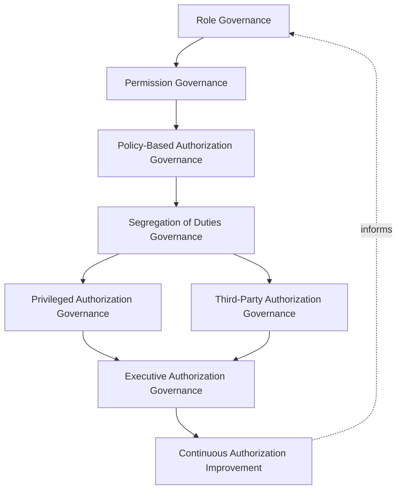
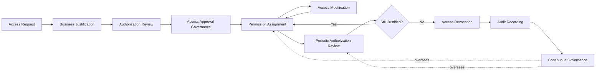
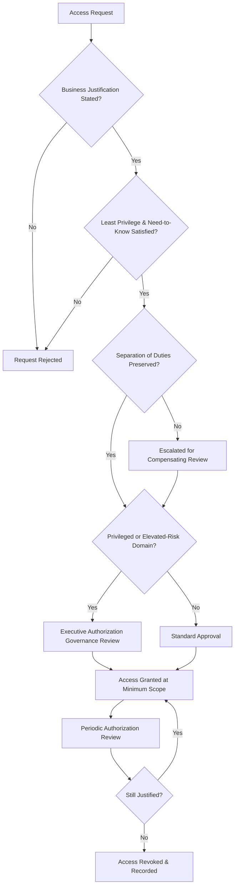
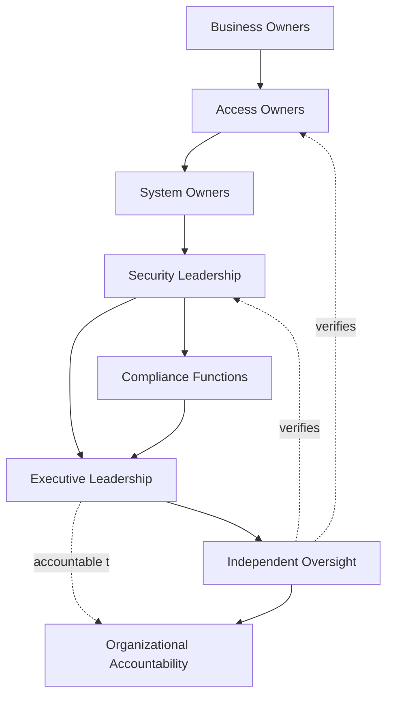
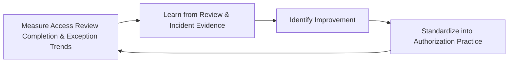
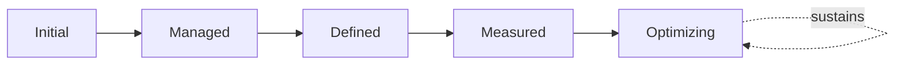

# Enterprise Authorization Governance Strategy

## 1. Document Purpose

This document defines the official Enterprise Authorization Governance Strategy for **StackLeo Tech Store** — the CISO/CIDO-owned executive charter under which every access decision — who may do what, to which resource, under what circumstance — is governed across the platform. It establishes authorization governance, permission governance, least privilege governance, role governance, segregation of duties governance, policy-based access governance, organizational accountability, executive oversight, and long-term authorization maturity, consistent with ISO/IEC 27001, the NIST Cybersecurity Framework, NIST SP 800-63 digital identity concepts, Zero Trust principles, and TOGAF enterprise architecture thinking.

`authorization-model.md` remains the operational governance framework for authorization practice — the document that elaborates in full operational depth how roles, permissions, and access decisions are governed for every domain. This document sits above it as executive mandate, consistent with how `identity-access-strategy.md` charters `identity-access-management.md`, `identity-lifecycle.md` charters `identity-lifecycle-management.md`, and `authentication-governance.md` charters `authentication-strategy.md`: it does not restate operational detail, it establishes the philosophy, accountability structure, and executive expectations that give that operational practice authority and continuity.

- **Purpose of Authorization Governance** — to ensure every access decision is made deliberately, against consistent policy, by accountable people, and remains governed and reviewable throughout its life — never granted once and forgotten.
- **Relationship with Identity & Access Management** — this strategy is the authorization-specific elaboration of `identity-access-strategy.md`; where that strategy governs identity and access as a whole, this document governs specifically what a verified identity is permitted to do.
- **Relationship with Authentication Governance** — `authentication-governance.md` governs how confidence in a claimed identity is established; this document governs what that verified identity may then do. Authorization decisions are never made in place of authentication, only after it.
- **Relationship with Identity Lifecycle Governance** — an identity must exist in an active, genuinely current lifecycle state, governed under `identity-lifecycle.md`, before any authorization it holds remains meaningful; deprovisioning under that strategy is what makes prior authorization grants moot, regardless of whether they were separately revoked.
- **Relationship with Zero Trust** — authorization is re-evaluated at each meaningful access point, consistent with `zero-trust-strategy.md`; this strategy governs the accountability behind that re-evaluation — who owns policy, who reviews access, and who is accountable when a permission is granted.
- **Relationship with Information Security** — access granted beyond genuine need is one of the most common sources of unauthorized exposure; this strategy protects the posture established in `security-governance.md` by ensuring access is never extended without deliberate justification.
- **Relationship with Enterprise Governance** — authorization governance is not a separate structure from how StackLeo governs the rest of the business; it is the authorization-specific application of the same executive accountability, policy discipline, and control assurance applied enterprise-wide in `policy-management.md`, `internal-controls.md`, and `audit-governance.md`.

This document is implementation-independent and vendor-neutral. It defines authorization governance philosophy, model, domains, and lifecycle conceptually — not specific IAM vendors, authorization platforms, policy engines, directory services, cloud providers, security products, RBAC, ABAC, ReBAC, ACL, policy engine implementations, permission schemas, access control configurations, infrastructure configurations, deployment architectures, implementation workflows, or code.

## 2. Authorization Governance Philosophy

Authorization governance at StackLeo rests on eight principles. Each exists to produce a specific business outcome — access is governed deliberately because it is the mechanism by which every business resource is protected, not as administrative overhead.

### 2.1 Least Privilege

Every identity, regardless of domain (Section 4), is granted only the access its defined responsibility genuinely requires.

- **Business Value** — limits the blast radius of any single compromised or misused identity, reducing the consequence of an inevitable eventual failure.

### 2.2 Need-to-Know

Access to information is granted based on legitimate operational need, not organizational seniority or convenience.

- **Business Value** — protects sensitive information from unnecessary exposure even to identities that otherwise hold legitimate system access.

### 2.3 Business-Driven Access

Every access grant traces to a stated, genuine business need, never granted merely because it was easy or convenient to include.

- **Business Value** — ensures access decisions serve a real operational purpose rather than accumulating as administrative habit.

### 2.4 Separation of Duties

No single identity holds unchecked authority over a complete, sensitive business process end to end, where genuine risk warrants division of responsibility.

- **Business Value** — prevents a single compromised or malicious identity from unilaterally causing significant harm, whether through error or intent.

### 2.5 Accountability

Every access grant, modification, and revocation traces to a specific, named, responsible party.

- **Business Value** — ensures every access decision has someone genuinely responsible for defending its continued justification.

### 2.6 Governance by Design

Authorization governance structures are established deliberately as an access domain is introduced, not retrofitted once excessive privilege has already accumulated.

- **Business Value** — prevents the costly, high-visibility discovery of authorization governance gaps only after an incident has already demonstrated their absence.

### 2.7 Risk-Aware Authorization

Authorization governance decisions weigh business impact and likelihood, directing scrutiny toward the access domains carrying the greatest genuine consequence.

- **Business Value** — ensures governance attention is proportionate to what a given access grant could actually cost the business if misused.

### 2.8 Continuous Improvement

Authorization governance practice matures over time, informed by real access review findings, incidents, and the organization's growth in scale and complexity.

- **Business Value** — keeps authorization governance aligned with StackLeo's growth in workforce, customer base, and partner ecosystem.

## 3. Enterprise Authorization Governance Model

Authorization governance operates across eight conceptual layers, each holding accountability for a distinct dimension of access practice. Every layer here is elaborated in full operational depth in `authorization-model.md`.

### 3.1 Role Governance

- **Purpose** — own the coherence of how business roles are defined and mapped to identity domains.
- **Governance Scope** — oversight of role definitions across every domain in Section 4, kept aligned with genuine business responsibility.
- **Business Value** — ensures access reflects an identity's genuine current role, not a historical accumulation of grants from prior responsibilities.
- **Executive Expectations** — leadership trusts roles are reviewed as business structure genuinely changes, not left static indefinitely.

### 3.2 Permission Governance

- **Purpose** — own the coherence of how specific permissions are defined, granted, and retired.
- **Governance Scope** — oversight of permission grants across every domain, consistent with Least Privilege (Section 2.1).
- **Business Value** — ensures the smallest unit of access is itself deliberately governed, not left to accumulate through role sprawl.
- **Executive Expectations** — leadership trusts permissions map traceably to genuine, current need.

### 3.3 Policy-Based Authorization Governance

- **Purpose** — own the coherence of how contextual conditions — beyond role alone — inform an access decision.
- **Governance Scope** — oversight of policy-driven access considerations across every domain, applied without prescribing a specific policy model.
- **Business Value** — allows access decisions to reflect genuine business context, not role assignment alone.
- **Executive Expectations** — leadership trusts policy-based decisions remain explainable and traceable, never an opaque automated outcome.

### 3.4 Segregation of Duties Governance

- **Purpose** — own the coherence of how conflicting or high-risk combinations of access are identified and prevented.
- **Governance Scope** — oversight of Separation of Duties (Section 2.4) across every sensitive business process.
- **Business Value** — prevents a single identity from holding unchecked authority over a complete, sensitive process.
- **Executive Expectations** — leadership trusts conflicting access combinations are identified proactively, not discovered after misuse.

### 3.5 Privileged Authorization Governance

- **Purpose** — own the elevated governance rigor administrative and other high-impact access requires.
- **Governance Scope** — oversight of Administrative and Privileged Authorization (Sections 4.3–4.4), coordinated with `privileged-access-management.md`.
- **Business Value** — ensures the access with the greatest potential impact receives commensurately greater scrutiny.
- **Executive Expectations** — leadership expects privileged access to be rare, justified, time-bound where feasible, and closely reviewed.

### 3.6 Third-Party Authorization Governance

- **Purpose** — own the governance of access extended to vendors, partners, and federated external identities.
- **Governance Scope** — oversight of Vendor & Partner and Federated Authorization (Sections 4.5, 4.9), coordinated with `identity-federation.md`.
- **Business Value** — ensures external access is deliberately scoped, never assumed equivalent to internal access.
- **Executive Expectations** — leadership expects third-party access to be reviewed before extension, not discovered informally.

### 3.7 Executive Authorization Governance

- **Purpose** — own executive-level accountability for the access decisions carrying the greatest organizational consequence.
- **Governance Scope** — oversight spanning Sections 3.4–3.6 wherever access risk rises to genuine executive concern.
- **Business Value** — ensures the most consequential access decisions are visible at the level accountable for organizational risk.
- **Executive Expectations** — leadership expects to be informed of, not surprised by, the platform's highest-risk access decisions.

### 3.8 Continuous Authorization Improvement

- **Purpose** — govern the mechanism by which every other layer in this model matures over time.
- **Governance Scope** — consolidates findings from access reviews, audits, and incidents across every domain in Section 4.
- **Business Value** — prevents authorization governance itself from becoming the next thing that quietly stagnates as the organization scales.
- **Executive Expectations** — leadership expects authorization maturity to be assessed periodically, not assumed static once established.

### Enterprise Authorization Governance Matrix

| Layer | Purpose | Business Value | Executive Expectations |
|---|---|---|---|
| Role Governance | Own coherence of business role definition and mapping | Ensures access reflects genuine current role | Trusts roles are reviewed as business structure changes |
| Permission Governance | Own coherence of permission grant and retirement | Ensures the smallest unit of access is deliberately governed | Trusts permissions map traceably to genuine, current need |
| Policy-Based Authorization Governance | Own coherence of contextual access conditions | Allows decisions to reflect genuine business context | Trusts decisions remain explainable and traceable |
| Segregation of Duties Governance | Own coherence of preventing conflicting access combinations | Prevents unchecked authority over a complete process | Trusts conflicts are identified proactively, not after misuse |
| Privileged Authorization Governance | Own elevated rigor for administrative/high-impact access | Ensures greatest-impact access gets greatest scrutiny | Expects privileged access to be rare, justified, closely reviewed |
| Third-Party Authorization Governance | Own governance of vendor/partner/federated access | Ensures external access is deliberately scoped | Expects third-party access reviewed before extension |
| Executive Authorization Governance | Own executive accountability for highest-consequence access | Ensures the most consequential access is visible to leadership | Expects leadership informed of, not surprised by, top risk |
| Continuous Authorization Improvement | Govern maturation of every other layer | Prevents governance itself from stagnating | Expects maturity to be assessed periodically |

*Diagram 1: Enterprise Authorization Governance Framework — role and permission governance establish the foundation, policy and segregation-of-duties governance shape decisions, privileged and third-party governance escalate to executive oversight, and continuous improvement feeds back into the model.*

## 4. Enterprise Authorization Domains

Authorization is governed across ten conceptual domains, each requiring a distinct access-scoping emphasis.

### 4.1 Workforce Authorization

- **Purpose** — govern the access StackLeo's own employees and contractors hold.
- **Authorization Considerations** — governed under Role Governance (Section 3.1), coordinated with `identity-lifecycle.md` for role-change events.
- **Business Importance** — protects internal systems and data from access that has outlived its legitimate role basis.
- **Executive Expectations** — leadership expects workforce access to be promptly adjusted as roles and responsibilities change.

### 4.2 Customer Authorization

- **Purpose** — govern the access individual shoppers hold over their own account and data.
- **Authorization Considerations** — governed under Permission Governance (Section 3.2), coordinated with `privacy.md`.
- **Business Importance** — foundation of the direct-to-consumer relationship and repeat commerce central to the B2C model.
- **Executive Expectations** — leadership expects customer authorization to protect trust without adding friction to genuine shopping.

### 4.3 Administrative Authorization

- **Purpose** — govern the access of staff with elevated capability to administer platform, security, or business-critical systems.
- **Authorization Considerations** — governed under Privileged Authorization Governance (Section 3.5), coordinated with `privileged-access-management.md`.
- **Business Importance** — protects against one of the highest-consequence categories of access compromise.
- **Executive Expectations** — leadership expects administrative authorization to require explicit, documented justification.

### 4.4 Privileged Authorization

- **Purpose** — govern access held by any actor — human or machine — capable of affecting the platform broadly.
- **Authorization Considerations** — governed under Privileged Authorization Governance (Section 3.5), receiving StackLeo's highest scrutiny regardless of the domain the identity otherwise belongs to.
- **Business Importance** — protects against the single highest-consequence category of authorization risk on the platform.
- **Executive Expectations** — leadership expects privileged status itself, not just administrative title, to trigger elevated governance.

### 4.5 Vendor & Partner Authorization

- **Purpose** — govern the access of external suppliers, service providers, and future marketplace sellers and B2B relationships.
- **Authorization Considerations** — governed under Third-Party Authorization Governance (Section 3.6), anticipating the multi-vendor marketplace model.
- **Business Importance** — protects the integrations commerce depends on and the trust foundation the marketplace model will depend on.
- **Executive Expectations** — leadership expects vendor and partner access to be scoped narrowly and reviewed ahead of, not after, marketplace launch.

### 4.6 Service & Machine Authorization

- **Purpose** — govern the access non-human identities hold to interact with one another.
- **Authorization Considerations** — governed under Permission Governance (Section 3.2), coordinated with `service-accounts-management.md`.
- **Business Importance** — protects against the common failure mode where service and machine access accumulates broad, unreviewed scope over time.
- **Executive Expectations** — leadership expects service and machine access to be inventoried and reviewed with the same rigor as human access.

### 4.7 API Authorization

- **Purpose** — govern the access granted through StackLeo's integration surface.
- **Authorization Considerations** — governed under Permission Governance (Section 3.2), scoped strictly to the specific integration purpose.
- **Business Importance** — protects the integration surface connecting StackLeo to payment, courier, and communication partners.
- **Executive Expectations** — leadership expects API access to be reviewed whenever an integration's purpose or ownership changes.

### 4.8 AI Agent Authorization

- **Purpose** — govern the access autonomous or semi-autonomous AI-driven actors hold to act on the platform.
- **Authorization Considerations** — governed under Policy-Based Authorization Governance (Section 3.3) as a distinct, named category, anticipating growing AI-assisted capability.
- **Business Importance** — protects against a category of identity that can act at scale and speed, making excessive access especially consequential.
- **Executive Expectations** — leadership expects AI agent access to be explicitly scoped and reviewed, never an informal extension of the human identity that configured it.

### 4.9 Federated Authorization

- **Purpose** — govern the access extended to identities originating from an externally trusted organization.
- **Authorization Considerations** — governed under Third-Party Authorization Governance (Section 3.6), coordinated with `identity-federation.md`.
- **Business Importance** — enables corporate and B2B relationships while protecting against risk introduced by parties outside StackLeo's direct control.
- **Executive Expectations** — leadership expects federated access to be reviewed and bounded before extension, never assumed equivalent to internal grants.

### 4.10 Temporary & External Authorization

- **Purpose** — govern access granted for a bounded purpose or duration — contractors, seasonal staff, auditors, or other externally sourced access needs.
- **Authorization Considerations** — governed jointly across Role and Permission Governance (Sections 3.1–3.2), with mandatory expiration as a defining characteristic.
- **Business Importance** — prevents temporary or externally sourced access from becoming a permanent, unreviewed grant.
- **Executive Expectations** — leadership expects every temporary or external grant to carry an explicit expiration, never open-ended by default.

### Enterprise Authorization Domain Matrix

| Domain | Purpose | Business Importance | Executive Expectations |
|---|---|---|---|
| Workforce Authorization | Govern employee and contractor access | Protects systems from access outliving its role basis | Promptly adjusted as roles and responsibilities change |
| Customer Authorization | Govern shoppers' access to their own account and data | Foundation of the direct-to-consumer relationship | Protects trust without adding shopping friction |
| Administrative Authorization | Govern elevated administrative system access | Protects against a high-consequence compromise category | Requires explicit, documented justification |
| Privileged Authorization | Govern access capable of broad platform impact | Protects against the single highest-consequence risk category | Privileged status itself triggers elevated governance |
| Vendor & Partner Authorization | Govern supplier, provider, marketplace/B2B access | Protects integrations and the future marketplace trust foundation | Scoped narrowly, reviewed ahead of marketplace launch |
| Service & Machine Authorization | Govern non-human, application-level and infrastructure access | Prevents accumulation of broad, unreviewed scope | Inventoried and reviewed with the same rigor as human access |
| API Authorization | Govern system-to-system exchange access | Protects the integration surface commerce depends on | Reviewed when integration purpose or ownership changes |
| AI Agent Authorization | Govern autonomous or semi-autonomous AI-driven access | Protects against scale-and-speed risk of excessive AI access | Explicitly scoped, never an informal human extension |
| Federated Authorization | Govern access for externally trusted identities | Enables corporate/B2B relationships while bounding external risk | Trust reviewed and bounded before extension |
| Temporary & External Authorization | Govern bounded-purpose or bounded-duration access | Prevents temporary access becoming a permanent grant | Every grant carries an explicit expiration |

## 5. Enterprise Authorization Lifecycle

Access is governed across ten conceptual lifecycle stages, applicable across every domain in Section 4.

### 5.1 Access Request

- **Purpose** — formally initiate a request for a specific access grant.
- **Governance Objectives** — require every request to state the specific access sought and the domain (Section 4) it belongs to.
- **Business Value** — ensures access creation is deliberate, not an incidental byproduct of onboarding or role change.

### 5.2 Business Justification

- **Purpose** — establish the genuine business need the requested access serves, consistent with Business-Driven Access (Section 2.3).
- **Governance Objectives** — require justification to be specific and traceable, never a generic assertion of need.
- **Business Value** — ensures every access grant traces to a real operational purpose from the outset.

### 5.3 Authorization Review

- **Purpose** — assess the request against Least Privilege, Need-to-Know, and Separation of Duties (Sections 2.1, 2.2, 2.4).
- **Governance Objectives** — require review to occur before approval, never bypassed for convenience.
- **Business Value** — catches excessive or conflicting access before it is granted, not after.

### 5.4 Access Approval Governance

- **Purpose** — formally decide whether the reviewed request is granted.
- **Governance Objectives** — require the approval decision to trace to a specific, accountable approver, distinct from the requester.
- **Business Value** — ensures access decisions have a clear, responsible party who is not approving their own request.

### 5.5 Permission Assignment

- **Purpose** — formally apply the approved access at the minimum scope the justification supports.
- **Governance Objectives** — require assignment to reflect Least Privilege (Section 2.1) precisely, never rounded up for convenience.
- **Business Value** — ensures the access actually granted matches what was genuinely justified and approved.

### 5.6 Access Modification

- **Purpose** — adjust an identity's access as role, responsibility, or need genuinely changes.
- **Governance Objectives** — require modification to be justified and recorded, consistent with Section 3.1–3.2.
- **Business Value** — prevents access from silently accumulating beyond current, genuine need.

### 5.7 Periodic Authorization Review

- **Purpose** — formally reassess whether previously granted access remains genuinely justified.
- **Governance Objectives** — require review to occur on a predictable, regular cadence, proportionate to the domain's privilege level.
- **Business Value** — catches unjustified access before it becomes a genuine risk, rather than relying on individual initiative to report it.

### 5.8 Access Revocation

- **Purpose** — formally remove access once its legitimate purpose has genuinely ended.
- **Governance Objectives** — require revocation to be triggered promptly by the relevant event, including deprovisioning under `identity-lifecycle.md`.
- **Business Value** — prevents the single most common source of authorization risk: access that outlives its legitimate purpose.

### 5.9 Audit Recording

- **Purpose** — record every authorization event in a form suitable for independent review.
- **Governance Objectives** — require every request, approval, modification, and revocation to leave a durable, reviewable record.
- **Business Value** — ensures authorization governance can be independently verified, not merely asserted.

### 5.10 Continuous Governance

- **Purpose** — sustain oversight of access across every stage, rather than treating governance as a one-time gate.
- **Governance Objectives** — require reassessment to run continuously alongside, not only at, discrete lifecycle events.
- **Business Value** — catches unjustified access before it becomes a genuine risk, rather than relying on the next scheduled review to surface it.

### Authorization Lifecycle Matrix

| Stage | Purpose | Governance Objective | Business Value |
|---|---|---|---|
| Access Request | Formally initiate a request for specific access | States the specific access sought and its domain | Ensures creation is deliberate, not incidental |
| Business Justification | Establish the genuine business need for access | Specific and traceable, never generic | Ensures every grant traces to a real operational purpose |
| Authorization Review | Assess against least privilege and separation of duties | Occurs before approval, never bypassed | Catches excessive or conflicting access before granting |
| Access Approval Governance | Formally decide whether access is granted | Traces to an accountable approver, distinct from requester | Ensures a clear, responsible party for the decision |
| Permission Assignment | Apply approved access at minimum scope | Reflects least privilege precisely | Ensures access granted matches what was justified |
| Access Modification | Adjust access as role or need genuinely changes | Justified and recorded | Prevents access silently accumulating beyond need |
| Periodic Authorization Review | Reassess whether access remains justified | Predictable cadence, proportionate to privilege level | Catches unjustified access before it becomes risk |
| Access Revocation | Formally remove access once purpose has ended | Triggered promptly by the relevant event | Prevents the most common source of authorization risk |
| Audit Recording | Record events for independent review | Every stage leaves a durable, reviewable record | Ensures governance can be independently verified |
| Continuous Governance | Sustain oversight across every stage | Reassessment runs continuously | Catches unjustified access before it becomes risk |

*Diagram 2: Enterprise Authorization Lifecycle — a request proceeds through justification, review, and approval into assignment and ongoing modification, with periodic review, revocation, and audit recording handling its eventual wind-down under continuous governance.*

## 6. Authorization Governance Principles

- **Least Privilege** — access is scoped to the minimum necessary for the stated need, consistent with Section 2.1.
- **Separation of Duties** — no single identity holds unchecked authority over a complete, sensitive process end to end, consistent with Section 2.4.
- **Accountability** — every access grant traces to a specific approver and a specific, identifiable recipient.
- **Traceability** — every access decision can be traced to its business justification, approver, and timing.
- **Auditability** — access grants, modifications, and reviews can be independently reviewed after the fact, supporting ISO/IEC 27001-aligned assurance.
- **Business Alignment** — authorization governance decisions are made in service of genuine business need, never imposed as friction disconnected from business purpose.
- **Risk Awareness** — authorization governance decisions weigh business impact and likelihood, directing scrutiny toward the greatest genuine consequence.
- **Continuous Improvement** — governance practice matures over time, informed by real review findings and incidents.

### Authorization Governance Principles Matrix

| Principle | Description | Business Value |
|---|---|---|
| Least Privilege | Access scoped to the minimum necessary | Limits blast radius of any single compromised identity |
| Separation of Duties | No single identity holds unchecked end-to-end authority | Prevents a single compromised or malicious identity causing significant harm |
| Accountability | Every grant traces to a specific approver and recipient | Ensures access decisions have a clear, responsible party |
| Traceability | Decisions traceable to justification, approver, timing | Enables defensible, evidence-based access decisions |
| Auditability | Grants, modifications, reviews independently reviewable | Supports ISO/IEC 27001-aligned assurance and audit confidence |
| Business Alignment | Decisions made in service of genuine business need | Keeps governance followed rather than resented as friction |
| Risk Awareness | Decisions weigh business impact and likelihood | Directs scrutiny toward the greatest genuine consequence |
| Continuous Improvement | Practice matures from real review findings and incidents | Keeps authorization governance aligned with organizational growth |

*Diagram 4: Enterprise Authorization Decision Flow — a request is justified, checked against least privilege and separation of duties, escalated for executive review where privileged, granted at minimum scope, and periodically reassessed until reconfirmed or revoked.*

## 7. Authorization Ownership & Accountability

Governance authority for authorization is distributed deliberately across eight accountable functions, defined here at the governance-objective level, without prescribing specific operational approval processes.

### 7.1 Business Owners

- **Governance Objective** — business functions own the justification for the access their identities require, translating genuine operational need into governed access decisions.
- **Business Value** — keeps access decisions grounded in real business responsibility rather than technical convenience alone.

### 7.2 Access Owners

- **Governance Objective** — each specific permission or role has a single accountable owner responsible for defending its continued justification.
- **Business Value** — prevents permissions and roles from persisting without anyone specifically responsible for confirming they still should.

### 7.3 System Owners

- **Governance Objective** — each system or platform component has an accountable owner responsible for the access it exposes.
- **Business Value** — ensures no system's access surface is left ungoverned because no one considered it theirs to own.

### 7.4 Security Leadership

- **Governance Objective** — security leadership owns the coherence and enforcement of this strategy across every domain, layer, and stage it defines.
- **Business Value** — provides a single point of accountability for whether authorization governance is genuinely functioning as intended.

### 7.5 Compliance Functions

- **Governance Objective** — compliance functions confirm that authorization governance satisfies applicable regulatory and contractual obligations, coordinated with `compliance.md`.
- **Business Value** — ensures authorization governance protects the business's standing with regulators, partners, and enterprise customers.

### 7.6 Executive Leadership

- **Governance Objective** — executive leadership sets the risk appetite this strategy operates within and holds security leadership accountable for its execution.
- **Business Value** — ensures authorization governance decisions reflect genuine organizational priority, not a delegated technical afterthought.

### 7.7 Independent Oversight

- **Governance Objective** — an independent function, separate from those who design and operate authorization governance, periodically verifies it is genuinely functioning as documented.
- **Business Value** — prevents governance from being assumed effective on the word of the same function responsible for running it.

### 7.8 Organizational Accountability

- **Governance Objective** — accountability for authorization is a property of the organization as a whole, distributed deliberately across Sections 7.1–7.7, not concentrated in or delegated entirely to any single role.
- **Business Value** — ensures no single point of failure exists in the organization's ability to answer "who is accountable for this access grant."

### Authorization Ownership & Accountability Matrix

| Role | Governance Objective | Business Value |
|---|---|---|
| Business Owners | Own the business justification for required access | Keeps access grounded in genuine operational need |
| Access Owners | Defend the continued justification of a specific permission or role | Prevents access persisting without a specifically responsible party |
| System Owners | Own the access surface a system exposes | Ensures no system's access surface goes ungoverned |
| Security Leadership | Own coherence and enforcement of this strategy | Provides a single point of accountability for governance function |
| Compliance Functions | Confirm alignment with regulatory/contractual obligations | Protects standing with regulators, partners, enterprise customers |
| Executive Leadership | Set risk appetite and hold security leadership accountable | Ensures decisions reflect genuine organizational priority |
| Independent Oversight | Independently verify governance functions as documented | Prevents self-assessed assumption of effectiveness |
| Organizational Accountability | Distribute accountability across every role, not one | Removes single points of failure in accountability |

*Diagram 3: Authorization Ownership & Accountability Model — accountability flows from business ownership of justification through access and system ownership into security leadership, with compliance and executive leadership converging on independent oversight and shared organizational accountability.*

## 8. Executive Oversight

- **Authorization Governance Reviews** — the overall coherence of authorization governance is formally reviewed on a regular cadence, consistent with `security-governance.md` (Section 6).
- **Executive Reporting** — aggregated authorization health — access review completion, privileged access counts, exception trends — is reported to executive leadership.
- **Access Risk Reviews** — authorization-related risk from `risk-management.md` and `security-risk-management.md` is reviewed alongside broader enterprise and security risk, never in isolation.
- **Governance Reviews** — the governance model, domains, and lifecycle defined in this strategy (Sections 3–7) are periodically reassessed for continued fitness.
- **Documentation Governance** — this strategy's relationship to `identity-access-strategy.md`, `identity-lifecycle.md`, `authentication-governance.md`, and `authorization-model.md` is kept current as those documents evolve.
- **Audit Readiness** — authorization governance decisions, reviews, and their outcomes are maintained in a state ready for internal or external audit at any time, coordinated with `audit-governance.md`.

### Executive Oversight Matrix

| Oversight Mechanism | Purpose | Governance Role |
|---|---|---|
| Authorization Governance Reviews | Confirm overall authorization governance coherence | Regular, predictable cadence for the strategy as a whole |
| Executive Reporting | Provide leadership a single, coherent authorization picture | Reports access review completion, privileged counts, exception trends |
| Access Risk Reviews | Review authorization risk alongside broader risk visibility | Not conducted in isolation from enterprise or security risk |
| Governance Reviews | Reassess the governance model itself for continued fitness | Applies to Sections 3–7 of this strategy |
| Documentation Governance | Keep this strategy's subordinate relationships current | Updated as related documents evolve |
| Audit Readiness | Maintain decisions and reviews ready for independent review | Continuous state, coordinated with audit governance |

### Governance Responsibility Matrix

| Role | Responsibility |
|---|---|
| CISO / CIDO | Owns coherence and enforcement of this strategy, in partnership with Executive Leadership. |
| Authorization Governance Lead | Owns the operational governance model in `authorization-model.md` for every domain. |
| Security Leadership | Owns Privileged and Executive Authorization Governance (Sections 3.5, 3.7), the highest-scrutiny layers. |
| Engineering Leads | Own governance of Service & Machine, API, and AI Agent Authorization (Sections 4.6–4.8) within their domain. |
| Partner / Vendor Manager | Coordinates governance of Vendor & Partner and Federated Authorization (Sections 4.5, 4.9). |
| HR / People Lead | Coordinates role-change events for Workforce and Temporary & External Authorization (Sections 4.1, 4.10). |
| Executive Leadership | Reviews significant privileged access decisions and overall authorization governance health. |
| Independent Oversight / Internal Audit | Independently verifies that authorization governance records reflect actual practice. |

## 9. Future Readiness

This strategy is designed to remain valid as StackLeo evolves in scale, geography, and organizational complexity, without requiring redefinition of its underlying philosophy.

- **Adaptive Authorization** — Policy-Based Authorization Governance (Section 3.3) is defined independently of any specific policy model, so it applies unchanged as access decisions increasingly incorporate contextual signal.
- **AI-Driven Access Decisions** — as access decisioning increasingly incorporates AI-assisted analysis, it remains governed under Policy-Based Authorization Governance (Section 3.3) at the same rigor and explainability standard as any other decision method.
- **Zero Trust Evolution** — this strategy's re-evaluation posture is structured to deepen alongside `zero-trust-strategy.md` as continuous, context-aware access re-verification matures across the platform.
- **Global Expansion** — the governance model, domains, and lifecycle (Sections 3–5) are defined independently of jurisdiction, so they extend coherently as StackLeo expands from Bangladesh into South Asia and global markets.
- **Multi-Tenant Platforms** — where future architecture introduces tenant isolation, authorization governance extends to explicitly scope access per tenant.
- **Enterprise Scale** — the governance model, domains, and lifecycle defined throughout this strategy are defined independently of organizational size, so they remain coherent as access volume grows substantially.
- **Continuous Authorization Intelligence** — Periodic Authorization Review (Section 5.7) and Continuous Authorization Improvement (Section 3.8) are structured to absorb increasingly automated, evidence-driven access insight as it becomes available.
- **Emerging Digital Trust Models** — this strategy's governance discipline is treated as a direct contributor to the digital trust customers, partners, and regulators extend to StackLeo, remaining structured to absorb genuinely new trust and access models as they emerge.

## 10. Authorization Governance Maturity Model

Authorization governance maturity is described across five conceptual levels, consistent with established process maturity thinking and NIST Cybersecurity Framework tiers.

- **Initial** — authorization governance, where it exists, is informal and inconsistent; access accumulates without regular review, and ownership is unclear.
- **Managed** — basic governance exists for individual access domains, but consistency across the ten domains in Section 4 varies significantly.
- **Defined** — the governance model, domains, and lifecycle are standardized, documented, and consistently applied across the organization, consistent with the model defined throughout this strategy.
- **Measured** — access review completion, privileged access counts, and exception trends are measured systematically, and decisions are grounded in genuine evidence rather than qualitative impression alone.
- **Optimizing** — authorization governance is continuously and deliberately improved based on quantitative evidence and organizational learning; improvement itself is a managed, ongoing discipline rather than an occasional initiative.

### Authorization Governance Maturity Model Matrix

| Level | Characteristics | Primary Focus |
|---|---|---|
| Initial | Informal, inconsistent governance; access accumulates without review | Ad hoc, individually-dependent authorization practice |
| Managed | Basic governance exists per domain; consistency varies | Domain-level consistency |
| Defined | Standardized governance model, domains, and lifecycle | Organization-wide consistency and clear ownership |
| Measured | Review completion and access trends measured systematically | Evidence-based authorization governance decisions |
| Optimizing | Practice continuously and deliberately improved from evidence | Sustained, deliberate improvement as a discipline |

*Diagram 5: Continuous Authorization Improvement Cycle — access review and audit outcomes are measured, learned from, improved upon, and standardized back into governed practice, on a continuing basis.*

*Diagram 6: Authorization Governance Maturity Progression Model — maturity advances from informal, unreviewed access practice toward standardized, measured, and continuously optimized authorization governance.*

## 11. Anti-Patterns

The following recurring failure patterns are explicitly recognized and avoided, as each one structurally undermines this strategy.

### Anti-Pattern Summary

| Anti-Pattern | Why It's Avoided |
|---|---|
| Excessive Permissions | Contradicts Least Privilege (Section 2.1); access broader than genuine need increases the consequence of any single compromised identity. |
| Unknown Access Ownership | Contradicts Access Owners (Section 7.2); a permission or role with no accountable owner has no one specifically responsible for its continued justification. |
| Missing Separation of Duties | Contradicts Separation of Duties (Section 2.4, Section 3.4); unchecked end-to-end authority allows a single compromised or malicious identity to cause significant harm. |
| Weak Executive Visibility | Contradicts Executive Reporting (Section 8); leadership cannot govern authorization risk it is never shown. |
| Poor Documentation | Undermines Documentation Governance (Section 8) and Traceability (Section 6), leaving access decisions unclear or unverifiable after the fact. |
| Siloed Authorization Governance | Contradicts the Enterprise Authorization Governance Model (Section 3); domain-by-domain practice that never converges leaves no coherent, organization-wide picture of access risk. |
| Compliance Without Governance | Contradicts Compliance Functions (Section 7.5); satisfying a regulatory checklist without genuine underlying governance leaves the organization compliant on paper and exposed in practice. |
| Missing Continuous Improvement | Contradicts Continuous Improvement (Section 2.8) and Continuous Authorization Improvement (Section 3.8); without deliberate improvement, governance stagnates as the organization and access volume grow. |

## 12. Document Information

| Property | Value |
|----------|-------|
| Document | authorization-governance.md |
| Version | 1.0.0 |
| Status | Active |
| Maintained By | StackLeo |
| Last Updated | 2026-07-24 |

---

© StackLeo. All Rights Reserved.
