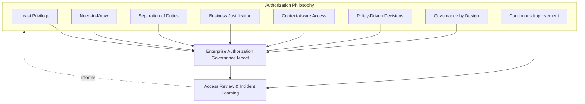
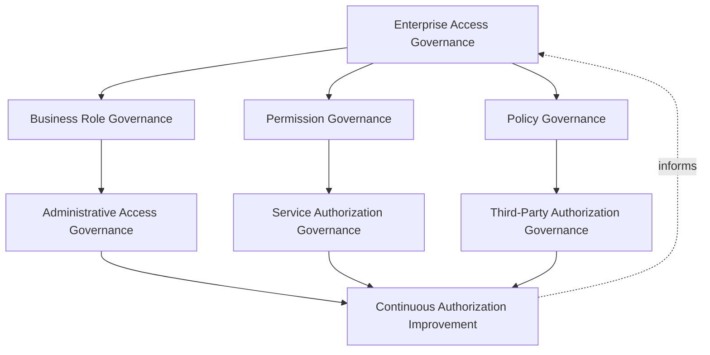
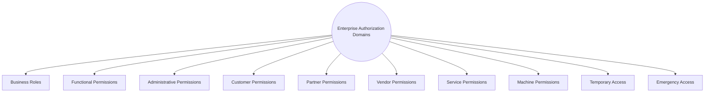
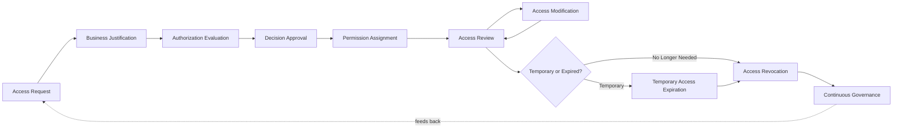
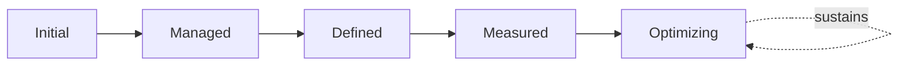
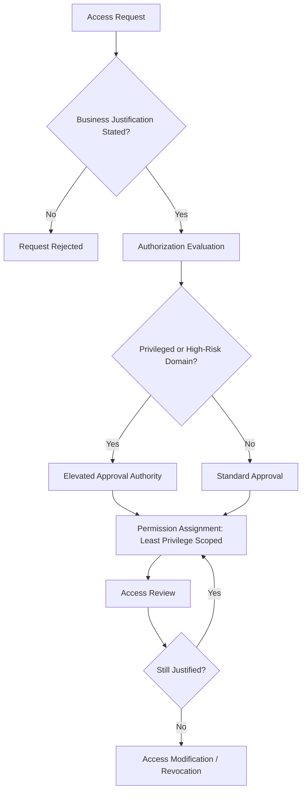
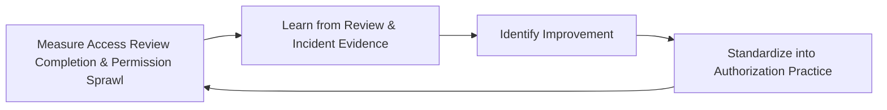

# Enterprise Authorization & Access Decision Governance

## 1. Document Purpose

This document defines the official Enterprise Authorization & Access Decision Governance framework for **StackLeo Tech Store**. It establishes how access decisions are governed consistently across every business role, permission, and identity domain — independent of any specific authorization engine, policy engine, IAM vendor, or security product.

`authorization.md` remains authoritative for authorization philosophy and the conceptual access control models StackLeo draws on. This document is that foundation's governance elaboration: it defines how permission decisions are governed consistently across every domain, how roles and permissions are governed across their full lifecycle, and how executive oversight of authorization risk is sustained, consistent with the broader IAM governance model established in `identity-access-management.md`.

- **Purpose of Authorization** — to ensure every access decision — who may do what, to which resource, under what circumstance — is made deliberately, against consistent policy, and remains governed and reviewable throughout its life, not granted once and forgotten.
- **Relationship with Authentication** — `authentication-strategy.md` governs how identity is verified; this document governs what a verified identity may then do. Authorization decisions are never made in place of authentication, only after it.
- **Relationship with Identity & Access Management** — this document is the authorization-specific elaboration of `identity-access-management.md` (Section 3.2, Access Governance); it governs specifically how each identity domain defined there receives and retains permission.
- **Relationship with Zero Trust** — authorization is re-evaluated at each meaningful access point, consistent with `zero-trust-strategy.md`; this document governs the accountability behind that re-evaluation — who owns policy, who reviews access, and who is accountable when a permission is granted.
- **Relationship with Enterprise Security Governance** — this document operates within the broader governance model and executive accountability established in `security-governance.md`, applying it specifically to authorization practice.
- **Relationship with Risk Management** — authorization-related risk — excessive permission, permission sprawl, weak separation of duties — is tracked as a distinct category within `security-risk-management.md` (Section 4), governed here at the domain-specific level.
- **Relationship with Business Operations** — permission structures trace directly to the business roles and responsibilities defined in `02_Product/user-roles.md`; authorization governance exists to keep access aligned with genuine, current business responsibility as the organization grows.

This document is implementation-independent and vendor-neutral. It defines authorization governance philosophy, model, domains, and lifecycle conceptually — not specific authorization engines, policy engines, IAM vendors, cloud providers, security products, RBAC/ABAC/PBAC/ReBAC implementation details, access rule syntax, policy languages, infrastructure configurations, or deployment architectures.

## 2. Authorization Philosophy

Authorization governance at StackLeo is built on eight principles. Each exists to produce a specific business outcome — access is governed deliberately because it is the mechanism by which every business resource is protected, not as administrative overhead.

### 2.1 Least Privilege

Every identity, regardless of domain (Section 4), is granted only the access its defined responsibility genuinely requires, consistent with `authorization.md` (Section 2).

- **Business Value** — limits the blast radius of any single compromised or misused identity, reducing the consequence of an inevitable eventual failure.

### 2.2 Need-to-Know

Access to information is granted based on legitimate operational need, not organizational seniority or convenience, consistent with `authorization.md` (Section 2).

- **Business Value** — protects sensitive information from unnecessary exposure even to identities that otherwise hold legitimate system access.

### 2.3 Separation of Duties

No single identity holds unchecked authority over a complete, sensitive business process end to end, where genuine risk warrants division of responsibility.

- **Business Value** — prevents a single compromised or malicious identity from unilaterally causing significant harm, whether through error or intent.

### 2.4 Business Justification

Every permission traces to a legitimate, current business responsibility, consistent with Business-Aligned Security in `authorization.md` (Section 2) and `02_Product/user-roles.md`.

- **Business Value** — ensures access decisions protect what the business genuinely depends on, not an accumulation of historically convenient grants.

### 2.5 Context-Aware Access

Access decisions consider the circumstances of a request — not only who is asking, but what is being requested, and under what conditions — consistent with Continuous Authorization in `authorization.md` (Section 2).

- **Business Value** — allows access to adapt to genuine risk context rather than being fixed permanently at the point a permission was first granted.

### 2.6 Policy-Driven Decisions

Access decisions are made by evaluating identity, resource, and context against defined policy, consistent with Policy-Based Access in `authorization.md` (Section 2), rather than through ad hoc, case-by-case judgment.

- **Business Value** — produces predictable, defensible access outcomes as the organization scales beyond what any single person can personally oversee.

### 2.7 Governance by Design

Authorization governance structures are established deliberately as permission structures are built, not retrofitted once permission sprawl or excessive access has already emerged.

- **Business Value** — prevents the costly, high-visibility discovery of authorization governance gaps only after an incident has already demonstrated their absence.

### 2.8 Continuous Improvement

Authorization governance practice matures over time, informed by real access review findings, incidents, and the organization's growth in scale and complexity.

- **Business Value** — keeps authorization governance aligned with StackLeo's growth in workforce, customer base, and partner ecosystem.

*Diagram: Authorization Philosophy Overview — the eight principles shape the enterprise authorization governance model, and access review and incident learning feed back into the philosophy itself.*

## 3. Enterprise Authorization Governance Model

Authorization governance operates across eight conceptual layers, each holding accountability for a distinct dimension of access decision practice.

### 3.1 Enterprise Access Governance

- **Purpose** — own the overarching coherence of access decisions across the entire platform.
- **Governance Scope** — sits above every other layer in this model, consistent with Access Governance in `identity-access-management.md` (Section 3.2).
- **Business Value** — provides the single, coherent foundation every domain-specific access decision traces back to.
- **Executive Expectations** — leadership treats this layer as the non-negotiable baseline every permission must remain consistent with.

### 3.2 Business Role Governance

- **Purpose** — own the coherence of business roles and the permission sets associated with them.
- **Governance Scope** — coordinated with `02_Product/user-roles.md`, ensuring roles remain an accurate reflection of genuine business function.
- **Business Value** — keeps permission structures organized around real business responsibility, not ad hoc, individual grants.
- **Executive Expectations** — leadership expects roles to be reviewed as business structure evolves, not fixed indefinitely.

### 3.3 Permission Governance

- **Purpose** — own the coherence of individual permissions and how they compose into roles.
- **Governance Scope** — oversight of Functional and Administrative Permissions (Sections 4.2–4.3).
- **Business Value** — ensures permissions are granular and well-understood enough to support genuine Least Privilege (Section 2.1).
- **Executive Expectations** — leadership expects permission definitions to be precise, not broad grants of convenience.

### 3.4 Administrative Access Governance

- **Purpose** — own the elevated governance rigor administrative and other high-impact permissions require.
- **Governance Scope** — coordinated with Privileged Identity Governance in `identity-access-management.md` (Section 3.3); the full dedicated lifecycle and governance for privileged access as a whole are elaborated in `privileged-access-management.md`.
- **Business Value** — ensures the permissions with the greatest potential impact receive commensurately greater scrutiny.
- **Executive Expectations** — leadership expects administrative access to be rare, justified, and closely reviewed.

### 3.5 Service Authorization Governance

- **Purpose** — own the governance of permissions held by service accounts and machine identities.
- **Governance Scope** — coordinated with Service Identity Governance in `identity-access-management.md` (Section 3.6); the full dedicated governance model for every non-human identity is elaborated in `service-accounts-management.md`.
- **Business Value** — prevents non-human permissions from becoming an ungoverned blind spot, since they are often granted broadly by default.
- **Executive Expectations** — leadership trusts service and machine permissions receive the same governance rigor as human ones.

### 3.6 Third-Party Authorization Governance

- **Purpose** — own the governance of permissions extended to partners, vendors, and other external parties.
- **Governance Scope** — coordinated with Federation Governance in `identity-access-management.md` (Section 3.7), anticipating the multi-vendor marketplace model; the full dedicated trust governance model is elaborated in `identity-federation.md`.
- **Business Value** — ensures external access is deliberately scoped, never assumed equivalent to internal permission.
- **Executive Expectations** — leadership expects third-party permissions to be reviewed before extension, not discovered informally.

### 3.7 Policy Governance

- **Purpose** — own the coherence of the policies that drive access decisions, consistent with Policy-Driven Decisions (Section 2.6).
- **Governance Scope** — coordinated with `security-policies.md` and `security-standards.md` for the broader policy and standards hierarchy.
- **Business Value** — ensures access policy remains consistent, current, and traceable to genuine governance intent.
- **Executive Expectations** — leadership expects access policy to be reviewed on the same cadence as other security policy.

### 3.8 Continuous Authorization Improvement

- **Purpose** — govern the mechanism by which every other layer in this model matures over time.
- **Governance Scope** — consolidates findings from Access Review (Section 5.6) and executive oversight (Section 7) across every domain.
- **Business Value** — prevents authorization governance itself from becoming the next thing that quietly stagnates as the organization scales.
- **Executive Expectations** — leadership expects authorization maturity to be assessed periodically, not assumed static once established.

### Authorization Governance Model Matrix

| Layer | Purpose | Business Value | Executive Expectations |
|---|---|---|---|
| Enterprise Access Governance | Own overarching coherence of access decisions | Single, coherent foundation for every domain | Non-negotiable baseline every permission must be consistent with |
| Business Role Governance | Own coherence of roles and their permission sets | Keeps permission structures organized around real responsibility | Roles reviewed as business structure evolves |
| Permission Governance | Own coherence of individual permissions | Ensures permissions are granular enough for genuine least privilege | Permission definitions precise, not broad convenience grants |
| Administrative Access Governance | Own elevated rigor for high-impact permissions | Ensures greatest-impact permissions get greatest scrutiny | Access is rare, justified, closely reviewed |
| Service Authorization Governance | Own governance of service/machine permissions | Prevents non-human permissions becoming an ungoverned blind spot | Same rigor as human permissions |
| Third-Party Authorization Governance | Own governance of external party permissions | Ensures external access is deliberately scoped, never assumed | Reviewed before extension, never discovered informally |
| Policy Governance | Own coherence of the policies driving access decisions | Ensures policy remains consistent and traceable | Reviewed on the same cadence as other security policy |
| Continuous Authorization Improvement | Govern maturation of every other layer | Prevents governance itself from stagnating | Maturity assessed periodically |

*Diagram 1: Enterprise Authorization Governance Framework — Enterprise Access Governance anchors role, permission, and policy governance, which feed domain-specific oversight, converging on continuous improvement that informs the model in turn.*

## 4. Enterprise Authorization Domains

Authorization is organized across ten conceptual domains, each requiring a somewhat different governance emphasis.

### 4.1 Business Roles

- **Purpose** — represent the organizational roles permission structures are built around, per `02_Product/user-roles.md`.
- **Governance Scope** — governed under Business Role Governance (Section 3.2).
- **Business Importance** — provides the primary, business-aligned unit permission is organized around.
- **Executive Expectations** — leadership expects roles to reflect genuine, current organizational structure.

### 4.2 Functional Permissions

- **Purpose** — represent the specific actions and resource access a role or identity may exercise.
- **Governance Scope** — governed under Permission Governance (Section 3.3).
- **Business Importance** — the granular unit that composes into roles and ultimately determines what any identity can actually do.
- **Executive Expectations** — leadership expects functional permissions to be precisely scoped, not broadly convenient.

### 4.3 Administrative Permissions

- **Purpose** — represent elevated capability to administer platform, security, or business-critical systems.
- **Governance Scope** — governed under Administrative Access Governance (Section 3.4), the highest-scrutiny domain in this framework.
- **Business Importance** — protects against the single highest-consequence category of permission misuse or compromise.
- **Executive Expectations** — leadership expects administrative permission grants to require explicit, documented justification.

### 4.4 Customer Permissions

- **Purpose** — represent what a customer identity may do with their own account and data.
- **Governance Scope** — governed under Enterprise Access Governance (Section 3.1), coordinated with Customer Identity Governance in `identity-access-management.md` (Section 3.5).
- **Business Importance** — protects customers from accessing beyond their own account scope while enabling genuine self-service.
- **Executive Expectations** — leadership expects customer permission boundaries to be clear and consistently enforced.

### 4.5 Partner Permissions

- **Purpose** — represent what future marketplace sellers and B2B partners may do within the platform.
- **Governance Scope** — governed under Third-Party Authorization Governance (Section 3.6), anticipating the multi-vendor marketplace model.
- **Business Importance** — will become foundational to safely enabling sellers to manage their own listings and orders.
- **Executive Expectations** — leadership expects partner permission boundaries to be designed ahead of, not after, marketplace launch.

### 4.6 Vendor Permissions

- **Purpose** — represent what external suppliers and service providers may access through their integrations.
- **Governance Scope** — governed under Third-Party Authorization Governance (Section 3.6).
- **Business Importance** — protects the integrations the commerce experience directly depends on from excessive external access.
- **Executive Expectations** — leadership expects vendor permissions to be scoped narrowly to the specific integration purpose.

### 4.7 Service Permissions

- **Purpose** — represent what application-level service accounts may do when interacting with one another.
- **Governance Scope** — governed under Service Authorization Governance (Section 3.5).
- **Business Importance** — protects against the common failure mode where service accounts accumulate broad, unreviewed permission over time.
- **Executive Expectations** — leadership expects service permissions to be inventoried and reviewed with the same rigor as human ones.

### 4.8 Machine Permissions

- **Purpose** — represent what devices, workloads, and automated processes may do.
- **Governance Scope** — governed under Service Authorization Governance (Section 3.5), distinct from service permissions in representing infrastructure-level actors.
- **Business Importance** — protects the infrastructure layer from unauthorized machine-level action.
- **Executive Expectations** — leadership expects machine permission growth to be anticipated as infrastructure scales.

### 4.9 Temporary Access

- **Purpose** — represent permission granted for a bounded purpose or duration.
- **Governance Scope** — governed jointly across Enterprise Access and Business Role Governance (Sections 3.1–3.2), with mandatory expiration as a defining characteristic.
- **Business Importance** — prevents temporary access needs from becoming permanent, unreviewed grants.
- **Executive Expectations** — leadership expects every temporary access grant to carry an explicit expiration, never open-ended by default.

### 4.10 Emergency Access

- **Purpose** — represent permission granted urgently to resolve or prevent significant, active harm, typically arising from incident response.
- **Governance Scope** — governed under Administrative Access Governance (Section 3.4), coordinated with Emergency Changes in `09_OPERATIONS/change-management.md` (Section 4.8).
- **Business Importance** — allows the organization to respond quickly to genuine urgency without abandoning authorization discipline.
- **Executive Expectations** — leadership expects emergency access to still require accountable authorization and be formally reviewed after the fact.

### Authorization Domain Matrix

| Domain | Purpose | Business Importance | Executive Expectations |
|---|---|---|---|
| Business Roles | Represent organizational roles permission is built around | Primary, business-aligned unit permission is organized around | Roles reflect genuine, current organizational structure |
| Functional Permissions | Represent specific actions and resource access | Granular unit determining what any identity can actually do | Precisely scoped, not broadly convenient |
| Administrative Permissions | Represent elevated, platform-affecting capability | Protects against the highest-consequence misuse category | Grants require explicit, documented justification |
| Customer Permissions | Represent what a customer may do with their own account | Protects customers from access beyond their own scope | Clear and consistently enforced boundaries |
| Partner Permissions | Represent what marketplace sellers/B2B partners may do | Foundational to safely enabling seller self-service | Designed ahead of, not after, marketplace launch |
| Vendor Permissions | Represent what external suppliers may access | Protects integrations commerce directly depends on | Scoped narrowly to specific integration purpose |
| Service Permissions | Represent what service accounts may do with each other | Prevents accumulation of broad, unreviewed permission | Inventoried and reviewed with the same rigor as human ones |
| Machine Permissions | Represent what devices/workloads/processes may do | Protects the infrastructure layer from unauthorized action | Growth anticipated as infrastructure scales |
| Temporary Access | Represent bounded-purpose or bounded-duration permission | Prevents temporary needs becoming permanent grants | Every grant carries an explicit expiration |
| Emergency Access | Represent permission granted urgently for active harm | Allows rapid response without abandoning discipline | Still requires authorization and after-the-fact review |

*Diagram 3: Access Decision Governance Model (domain view) — ten domains, each requiring a governance emphasis proportionate to its trust level and business role.*

## 5. Authorization Decision Lifecycle

Authorization is governed across ten conceptual lifecycle stages, applicable across every domain in Section 4.

### 5.1 Access Request

- **Purpose** — formally initiate a request for a specific permission or role assignment.
- **Governance Objectives** — require every request to identify the specific permission sought and the requesting identity's domain (Section 4).
- **Business Value** — ensures access grants are deliberately initiated, not an incidental byproduct of another process.

### 5.2 Business Justification

- **Purpose** — state the genuine business need the requested access would fulfill, consistent with Business Justification (Section 2.4).
- **Governance Objectives** — require justification to reference the requester's actual, current business responsibility.
- **Business Value** — ensures access decisions protect what the business genuinely depends on, not convenience.

### 5.3 Authorization Evaluation

- **Purpose** — assess the request against defined policy, the requester's role, and genuine risk.
- **Governance Objectives** — require evaluation to be consistent with Policy-Driven Decisions (Section 2.6), not ad hoc judgment.
- **Business Value** — produces a defensible, consistent basis for the subsequent approval decision.

### 5.4 Decision Approval

- **Purpose** — render a deliberate, accountable decision on whether to grant the requested access.
- **Governance Objectives** — require approval authority proportionate to the requested permission's domain and risk significance (Section 4).
- **Business Value** — converts access grant into a governed decision point, not a default outcome of the request being made.

### 5.5 Permission Assignment

- **Purpose** — formally establish the approved permission for the requesting identity.
- **Governance Objectives** — require assignment to be scoped precisely to what was approved, never broader.
- **Business Value** — ensures the granted access matches the deliberate decision that approved it.

### 5.6 Access Review

- **Purpose** — formally reassess whether an identity's existing access remains genuinely justified.
- **Governance Objectives** — require review to occur on a predictable, regular cadence, proportionate to the permission's domain and privilege level.
- **Business Value** — catches unjustified access before it becomes a genuine risk, rather than relying on individual initiative to report it.

### 5.7 Access Modification

- **Purpose** — adjust an identity's permission as role, responsibility, or need genuinely changes.
- **Governance Objectives** — require modification to be justified and recorded, consistent with Section 5.2.
- **Business Value** — prevents access from silently accumulating beyond current, genuine need.

### 5.8 Temporary Access Expiration

- **Purpose** — ensure permission granted for a bounded purpose or duration lapses automatically when that bound is reached.
- **Governance Objectives** — require every Temporary Access grant (Section 4.9) to carry an explicit, enforced expiration.
- **Business Value** — prevents temporary access from silently becoming a permanent, unreviewed grant.

### 5.9 Access Revocation

- **Purpose** — deliberately and promptly remove access once its legitimate purpose has genuinely ended.
- **Governance Objectives** — require revocation to be triggered promptly by the relevant change event (role change, termination, contract end).
- **Business Value** — prevents the single most common source of authorization risk: access that outlives its legitimate purpose.

### 5.10 Continuous Governance

- **Purpose** — act on access review and revocation findings to deliberately improve authorization governance practice itself.
- **Governance Objectives** — require improvement actions to be documented and tracked to completion, feeding Continuous Authorization Improvement (Section 3.8).
- **Business Value** — ensures authorization governance effectiveness compounds over time rather than remaining static.

### Authorization Decision Lifecycle Matrix

| Stage | Purpose | Governance Objective | Business Value |
|---|---|---|---|
| Access Request | Formally initiate a request for permission | Identifies specific permission and requester's domain | Ensures grants are deliberately initiated, not incidental |
| Business Justification | State the genuine business need for the access | References actual, current business responsibility | Ensures decisions protect genuine business dependency |
| Authorization Evaluation | Assess the request against policy, role, risk | Consistent with policy-driven decision making | Produces a defensible, consistent basis for approval |
| Decision Approval | Render a deliberate, accountable decision | Authority proportionate to domain and risk | Converts grant into a governed decision point |
| Permission Assignment | Formally establish the approved permission | Scoped precisely to what was approved | Ensures granted access matches the deliberate decision |
| Access Review | Reassess whether existing access remains justified | Predictable cadence, proportionate to privilege level | Catches unjustified access before it becomes risk |
| Access Modification | Adjust permission as role or need genuinely changes | Justified and recorded | Prevents access silently accumulating beyond need |
| Temporary Access Expiration | Ensure bounded permission lapses automatically | Every grant carries explicit, enforced expiration | Prevents temporary access becoming a permanent grant |
| Access Revocation | Promptly remove access once purpose has ended | Triggered promptly by the relevant change event | Prevents the most common source of authorization risk |
| Continuous Governance | Improve authorization governance from findings | Improvement actions documented and tracked | Effectiveness compounds over time |

*Diagram 2: Authorization Decision Lifecycle — a request proceeds through justification, evaluation, and approval into assignment and ongoing review, with expiration and revocation handling access wind-down, feeding continuous governance improvement.*

## 6. Authorization Governance Principles

- **Least Privilege** — access is scoped to the minimum necessary for the stated need, consistent with Section 2.1.
- **Accountability** — every permission grant traces to a specific approver and a specific, identifiable recipient.
- **Separation of Duties** — sensitive, complete business processes are divided across multiple identities where genuine risk warrants it, consistent with Section 2.3.
- **Traceability** — every access decision can be traced to its business justification, approver, and timing.
- **Auditability** — access grants, modifications, and reviews can be independently reviewed after the fact, supporting ISO/IEC 27001-aligned assurance.
- **Risk Awareness** — authorization decisions are made with explicit awareness of the risk a given permission represents.
- **Business Alignment** — permission structures reflect genuine, current business responsibility, consistent with `02_Product/user-roles.md`.
- **Continuous Improvement** — authorization governance practice matures over time, informed by real review findings and incidents.

### Authorization Governance Principles Matrix

| Principle | Description | Business Value |
|---|---|---|
| Least Privilege | Access scoped to the minimum necessary | Limits blast radius of any single compromised identity |
| Accountability | Every grant traces to a specific approver and recipient | Ensures access decisions have a clear, responsible party |
| Separation of Duties | Sensitive processes divided where risk warrants | Prevents unilateral harm from a single compromised identity |
| Traceability | Decisions traceable to justification, approver, timing | Enables defensible, evidence-based access decisions |
| Auditability | Grants, modifications, reviews independently reviewable | Supports ISO/IEC 27001-aligned assurance and audit confidence |
| Risk Awareness | Decisions made with awareness of permission-level risk | Enables deliberate, informed governance prioritization |
| Business Alignment | Permission structures reflect genuine business responsibility | Keeps access aligned with what the business actually needs |
| Continuous Improvement | Governance matures from real review findings | Keeps authorization governance aligned with organizational growth |

## 7. Executive Oversight

- **Authorization Governance Reviews** — the overall coherence of authorization governance across every domain (Section 4) is formally reviewed on a regular cadence, consistent with `identity-access-management.md` (Section 7).
- **Executive Reporting** — aggregated authorization health — access review completion, privileged permission counts, exception trends — is reported to executive leadership, coordinated with `09_OPERATIONS/operations-metrics-kpis.md`.
- **Risk Reviews** — authorization-related risk from `security-risk-management.md` (Section 4) is reviewed alongside broader identity and security risk, not in isolation.
- **Compliance Reviews** — authorization practice is reviewed against applicable regulatory and contractual obligations, coordinated with `compliance.md`.
- **Documentation Governance** — this framework's relationship to `authorization.md` and `identity-access-management.md` is kept current as those documents evolve.
- **Audit Readiness** — authorization governance decisions, reviews, and their outcomes are maintained in a state ready for internal or external audit at any time.

### Executive Oversight Matrix

| Oversight Mechanism | Purpose | Governance Role |
|---|---|---|
| Authorization Governance Reviews | Confirm overall governance coherence across domains | Regular, predictable cadence for the framework as a whole |
| Executive Reporting | Provide leadership a single, coherent authorization picture | Coordinated with enterprise operational KPI reporting |
| Risk Reviews | Review authorization risk alongside broader identity risk | Not conducted in isolation from enterprise risk visibility |
| Compliance Reviews | Confirm alignment with regulatory/contractual obligations | Reviewed jointly with `compliance.md` |
| Documentation Governance | Keep this framework's subordinate relationships current | Updated as authorization and IAM governance docs evolve |
| Audit Readiness | Maintain decisions and reviews ready for independent review | Continuous state, not preparation-triggered |

### Governance Responsibility Matrix

| Role | Responsibility |
|---|---|
| CISO | Owns coherence and enforcement of this authorization framework, in partnership with Security and Executive leadership. |
| Authorization Governance Lead | Owns the governance model (Section 3) and lifecycle (Section 5) across every domain. |
| Security Leadership | Owns Administrative Access Governance (Section 3.4), the highest-scrutiny governance layer. |
| Product Manager | Coordinates Business Role Governance (Section 3.2) with `02_Product/user-roles.md`. |
| Engineering Leads | Own Service Authorization Governance (Section 3.5) within their domain. |
| Partner / Vendor Manager | Owns Third-Party Authorization Governance (Section 3.6) coordination. |
| Executive Leadership | Reviews significant authorization risk and Administrative Access decisions. |
| Internal Audit / Review Function | Independently verifies that authorization governance records reflect actual practice. |

## 8. Future Readiness

This framework is designed to remain valid as StackLeo evolves in scale and organizational complexity, without requiring redefinition of its underlying philosophy.

- **Zero Trust Architecture** — this framework's Context-Aware Access principle (Section 2.5) is structured to deepen as `zero-trust-strategy.md` matures, without requiring the underlying governance model to be redesigned.
- **Cloud-Native Platforms** — governance layers (Section 3) are defined independently of any specific runtime or authorization engine, so they apply unchanged as infrastructure evolves.
- **AI-Assisted Authorization** — where AI-assisted techniques support Authorization Evaluation (Section 5.3), they operate within the same Policy-Driven Decisions and Risk Awareness principles (Sections 2.6, 6) as any other evaluation practice, never adopted as an unreviewed shortcut around governance.
- **Marketplace Platform** — Partner Permissions (Section 4.5) and Third-Party Authorization Governance (Section 3.6) are structured to absorb the multi-vendor marketplace model as it launches.
- **Multi-Tenant Architecture** — where future architecture introduces tenant isolation, Authorization Evaluation (Section 5.3) extends to explicitly account for cross-tenant access context.
- **Global Expansion** — Business Role and Permission Governance (Sections 3.2–3.3) extend to accommodate region-specific roles and permissions as StackLeo expands into new markets.
- **Enterprise Scale** — the governance model, domains, and lifecycle defined in Sections 3–5 are defined independently of organizational size or structure, so they remain coherent as the permission population grows substantially.
- **Evolving Authorization Risks** — Continuous Authorization Improvement (Section 3.8) and Access Review (Section 5.6) are structured to absorb genuinely new categories of authorization risk as they emerge.

## 9. Authorization Maturity Model

Authorization governance maturity is described across five conceptual levels, adapted from established process maturity thinking and consistent with NIST Cybersecurity Framework tiers.

- **Initial** — authorization governance, where it exists, is informal and inconsistent; permissions accumulate without regular review, and roles do not clearly reflect genuine business responsibility.
- **Managed** — basic governance exists for individual authorization domains, but consistency across the ten domains in Section 4 varies significantly.
- **Defined** — the governance model, domains, and lifecycle are standardized, documented, and consistently applied across the organization, consistent with the model defined throughout this document; ownership is clear organization-wide.
- **Measured** — access review completion, permission sprawl, and exception trends are measured systematically, and decisions are grounded in genuine evidence rather than qualitative impression alone.
- **Optimizing** — authorization governance is continuously and deliberately improved based on quantitative evidence and organizational learning; improvement itself is a managed, ongoing discipline rather than an occasional initiative.

### Authorization Maturity Model Matrix

| Level | Characteristics | Primary Focus |
|---|---|---|
| Initial | Informal, inconsistent governance; permissions accumulate without review | Ad hoc, individually-dependent authorization practice |
| Managed | Basic governance exists per domain; consistency varies | Domain-level consistency |
| Defined | Standardized governance model, domains, and lifecycle | Organization-wide consistency and clear ownership |
| Measured | Review completion and sprawl trends measured systematically | Evidence-based authorization governance decisions |
| Optimizing | Practice continuously and deliberately improved from evidence | Sustained, deliberate improvement as a discipline |

*Diagram 6: Authorization Maturity Progression Model — maturity advances from informal, unreviewed permission practice toward standardized, measured, and continuously optimized authorization governance.*

*Diagram 4: Authorization Governance & Approval Flow — a request is justified, evaluated, escalated for elevated approval where privileged, assigned at minimum scope, and periodically reassessed until reconfirmed or revoked.*

*Diagram 5: Continuous Authorization Improvement Cycle — access review outcomes are measured, learned from, improved upon, and standardized back into practice, on a continuing basis.*

## 10. Anti-Patterns

The following recurring failure patterns are explicitly recognized and avoided, as each one structurally undermines this framework.

| Anti-Pattern | Why It's Avoided |
|---|---|
| Excessive Permissions | Contradicts Least Privilege (Section 2.1); access broader than genuine need increases the consequence of any single compromised identity. |
| Permanent Temporary Access | Contradicts Temporary Access Expiration (Section 5.8); a temporary grant never enforced to expire becomes an unreviewed, permanent permission by default. |
| Weak Role Governance | Contradicts Business Role Governance (Section 3.2); roles that no longer reflect genuine organizational structure produce permission grants disconnected from real responsibility. |
| Permission Sprawl | Contradicts Permission Governance (Section 3.3); permissions that accumulate without deliberate governance become impossible to reason about consistently. |
| Weak Separation of Duties | Contradicts Separation of Duties (Section 2.3); a single identity holding unchecked authority over a sensitive process risks significant, unilateral harm. |
| Poor Documentation | Undermines Documentation Governance (Section 7) and Traceability (Section 6), leaving authorization decisions unclear or unverifiable after the fact. |
| Weak Governance | Undermines Section 3; without clear ownership and review across every domain, authorization practice drifts into inconsistency as the organization scales. |
| Missing Continuous Improvement | Contradicts Continuous Improvement (Section 2.8, Section 3.8); without deliberate improvement, authorization governance stagnates as the organization and threat landscape evolve. |

## 11. Document Information

| Property | Value |
|----------|-------|
| Document | authorization-model.md |
| Version | 1.0.0 |
| Status | Active |
| Maintained By | StackLeo |
| Last Updated | 2026-07-24 |

---

© StackLeo. All Rights Reserved.
