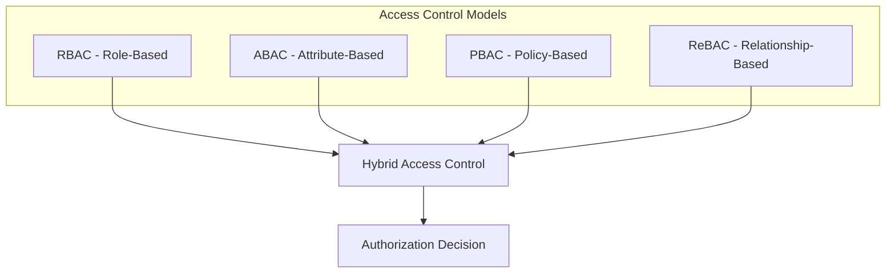
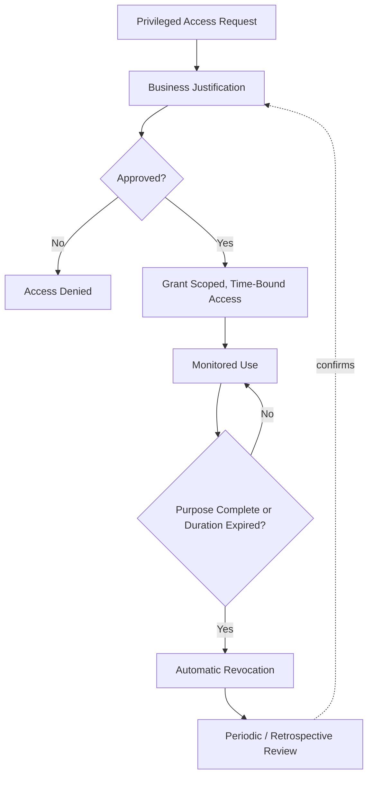
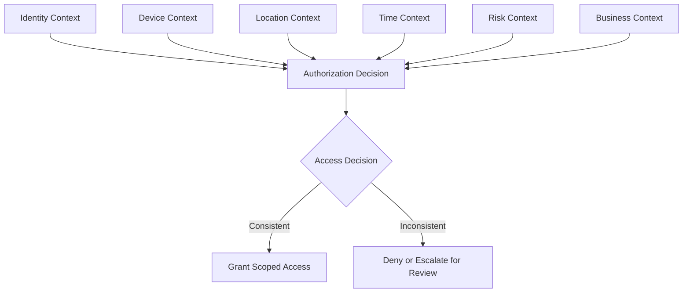
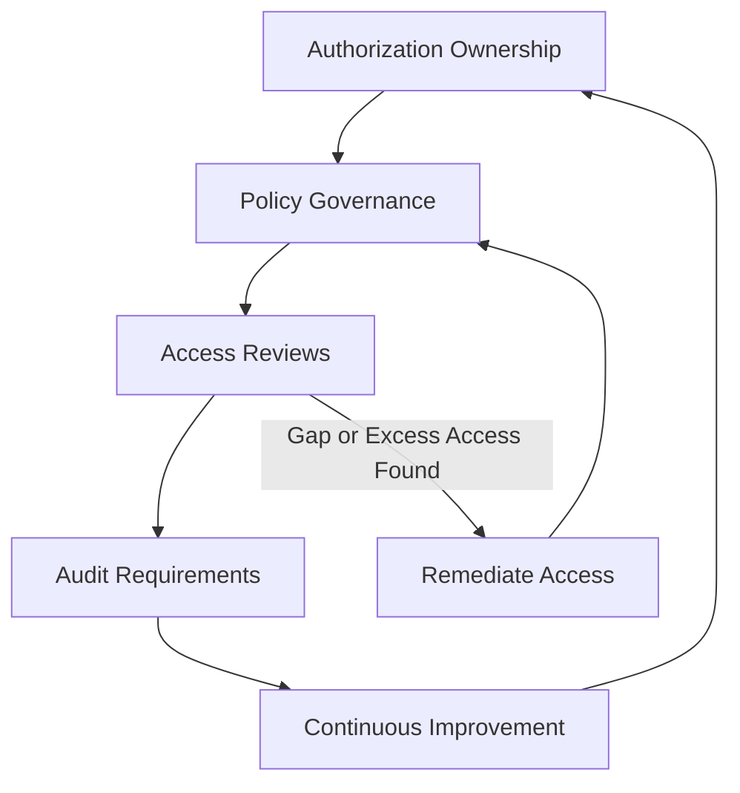
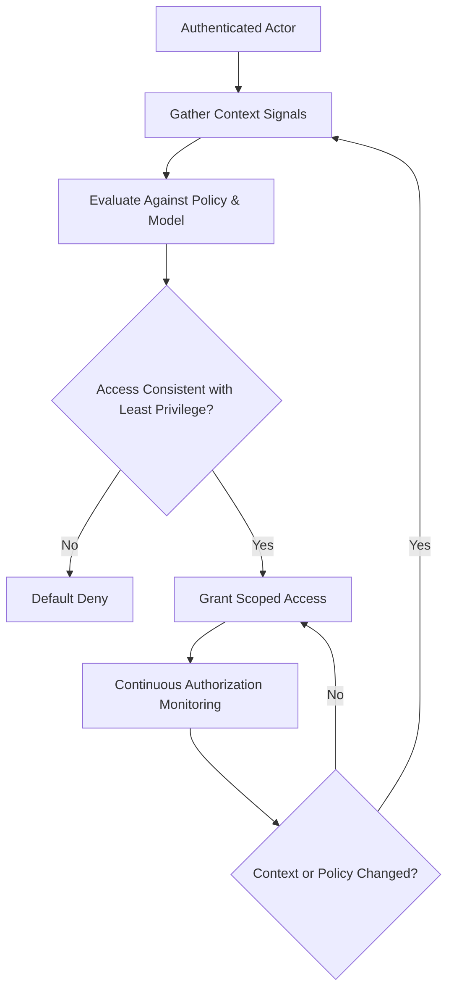

# Authorization

## 1. Document Purpose

This document defines the official Enterprise Authorization and Access Control Strategy for **StackLeo Tech Store**. It establishes how the platform controls access to business resources once an actor's identity has been verified.

- **Purpose of Authorization** — to ensure that a verified identity is granted access only to the specific resources and actions consistent with its defined business responsibility, and no more.
- **Relationship with Authentication** — authentication (`authentication.md`) establishes *who* an actor is; authorization determines *what* that verified actor may do. A successfully authenticated actor may still be authorized for nothing beyond their assigned scope.
- **Relationship with Identity Management** — authorization decisions are made against the identity categories, lifecycle state, and trust level defined in `identity-management.md`; a suspended or deactivated identity carries no authorization regardless of its historical permissions.
- **Relationship with Zero Trust** — authorization is re-evaluated at each meaningful access point, consistent with the Zero Trust vision in `security-architecture.md` (Section 2); a prior authorization decision is never assumed to remain valid indefinitely.
- **Relationship with Enterprise Security** — this document elaborates the authorization dimension of Identity Security, one of the five domains defined in `security-architecture.md` (Section 3.1), and is a direct application of Least Privilege from `security-principles.md` (Section 3.1).

This document is implementation-independent and vendor-neutral. It defines authorization philosophy, models, and governance conceptually — not specific authorization frameworks, protocols, permission schemas, or code.

## 2. Authorization Philosophy

- **Least Privilege** — every identity is granted only the access necessary for its defined responsibility, consistent with `security-principles.md` (Section 3.1).
- **Need-to-Know** — access to information is granted based on legitimate operational need, not organizational seniority or convenience, consistent with `security-principles.md` (Section 3.2).
- **Explicit Access Decisions** — access is granted only through a deliberate, recorded decision; absence of an explicit grant is treated as denial, never as implicit permission.
- **Continuous Authorization** — a granted permission is re-evaluated against current policy and context over time, not fixed permanently at the point it was first granted.
- **Policy-Based Access** — access decisions are made by evaluating identity, resource, and context against defined policy, rather than through ad hoc, case-by-case judgment.
- **Business-Aligned Security** — every permission granted must be traceable to a legitimate, current business responsibility, consistent with `02_Product/user-roles.md` (Section 3).

## 3. Access Control Models

StackLeo's authorization approach draws on several conceptual access control models, applied where each is best suited, without prescribing a specific technical framework:

- **Role-Based Access Control (RBAC)**
  - *Purpose* — grant access based on an actor's assigned organizational role.
  - *Business Use Cases* — internal staff roles (Operations Manager, Customer Support, Warehouse Staff) as defined in `02_Product/user-roles.md`.
  - *Advantages* — simple to reason about, administer, and audit at moderate organizational scale.
  - *Trade-offs* — can become coarse-grained as the number of distinct business scenarios grows.
- **Attribute-Based Access Control (ABAC)**
  - *Purpose* — grant access based on attributes of the identity, resource, or environment.
  - *Business Use Cases* — scoping a Warehouse Staff role's access to a specific warehouse location, or a Regional Manager's access to a specific territory, per `02_Product/user-roles.md` (Section 3).
  - *Advantages* — supports fine-grained, context-sensitive decisions without multiplying the number of distinct roles.
  - *Trade-offs* — requires more sophisticated policy definition and is harder to reason about at a glance than role membership alone.
- **Policy-Based Access Control (PBAC)**
  - *Purpose* — express access decisions as centrally governed policy rather than embedding them throughout the system.
  - *Business Use Cases* — enterprise-wide rules that must apply consistently regardless of role, such as Separation of Duties constraints.
  - *Advantages* — centralizes governance and makes policy change auditable and consistent.
  - *Trade-offs* — requires disciplined policy lifecycle management to avoid policy sprawl over time.
- **Relationship-Based Access Control (ReBAC)**
  - *Purpose* — grant access based on a relationship between the actor and the resource.
  - *Business Use Cases* — a Corporate Customer's delegated buyer accessing only their own organization's orders; a future Marketplace Vendor accessing only their own catalog and sales data.
  - *Advantages* — naturally models ownership and delegation relationships central to multi-tenant business models.
  - *Trade-offs* — can be more complex to evaluate efficiently as relationship graphs grow large.
- **Hybrid Access Control**
  - *Purpose* — combine the models above where a single model does not adequately express real business need.
  - *Business Use Cases* — a Marketplace Vendor (ReBAC-scoped to their own resources) whose staff hold internal roles (RBAC) further constrained by organization-wide policy (PBAC).
  - *Advantages* — reflects the layered, multi-model reality of the business as it grows in complexity.
  - *Trade-offs* — requires deliberate governance to keep the combination coherent rather than contradictory.

### Access Control Model Comparison

| Model | Best Suited To | Key Advantage | Key Trade-off |
|---|---|---|---|
| RBAC | Internal staff roles at organizational scale | Simple to administer and audit | Can become coarse-grained over time |
| ABAC | Location- or attribute-scoped access | Fine-grained without role proliferation | Requires more sophisticated policy definition |
| PBAC | Enterprise-wide, centrally governed rules | Centralized, auditable governance | Requires disciplined policy lifecycle management |
| ReBAC | Ownership and delegation relationships | Naturally models multi-tenant scenarios | More complex evaluation as relationships grow |
| Hybrid | Complex, multi-model business scenarios | Reflects real business complexity accurately | Requires deliberate governance to remain coherent |

*Diagram 2: Enterprise Access Control Model — StackLeo combines models rather than relying on a single approach, matched to the shape of each business scenario.*

## 4. Authorization Principles

- **Default Deny** — access is denied unless an explicit, current grant exists; the absence of a decision is treated as denial, never as permission.
- **Least Privilege** — every grant is scoped to the minimum access required for its purpose (Section 2).
- **Separation of Duties** — no single identity can both perform and approve the same high-impact action, consistent with `security-principles.md` (Section 3.8) and `02_Product/user-roles.md` (Section 11).
- **Just Enough Access** — access is scoped as narrowly as the legitimate business task allows, rather than granted at the broadest convenient level.
- **Time-Bound Access** — access tied to a temporary need expires when that need ends, rather than persisting indefinitely by default.
- **Context-Aware Decisions** — authorization considers the context of a request (Section 7), not only the identity's static role or attributes.
- **Continuous Verification** — a previously granted authorization is re-evaluated against current policy and identity state, not trusted indefinitely once granted, consistent with `security-principles.md` (Section 3.10).

### Authorization Principle Summary

| Principle | What It Prevents |
|---|---|
| Default Deny | Unintended access through an undefined or missing decision |
| Least Privilege | Broad access exceeding actual business need |
| Separation of Duties | Unilateral high-impact action by a single actor |
| Just Enough Access | Convenience-driven over-provisioning |
| Time-Bound Access | Indefinite persistence of access tied to a temporary need |
| Context-Aware Decisions | Authorization based solely on static role, ignoring risk signals |
| Continuous Verification | Reliance on a stale, previously granted decision |

## 5. Resource Protection

Authorization is applied consistently across StackLeo's business resources, scoped to each resource's sensitivity:

| Resource | Protection Goals | Business Sensitivity | Access Considerations |
|---|---|---|---|
| Customer Accounts | Prevent access by anyone other than the account owner and narrowly scoped support staff. | High — directly tied to individual customer trust. | Owner-based access, with support access logged and purpose-limited. |
| Product Catalog | Protect against unauthorized modification while keeping content broadly viewable. | Moderate — public visibility is intended, integrity is not. | Read access broad; write access limited to Product/Content roles. |
| Shopping Cart | Prevent access or modification by anyone other than the owning session/identity. | Moderate — directly precedes a financial transaction. | Strictly scoped to the owning customer identity. |
| Orders | Protect against unauthorized viewing or modification of commitments and fulfillment data. | High — represents financial and contractual commitment. | Owner and role-scoped access (Customer Support, Operations) only. |
| Payments | Protect against unauthorized access to financial transaction data. | Critical — highest financial and regulatory sensitivity. | Narrowest possible access, strong Separation of Duties. |
| Inventory | Protect against unauthorized modification affecting fulfillment accuracy. | High — inaccuracy directly affects customer promises. | Role-scoped to Inventory/Warehouse functions, per location where applicable (ABAC). |
| Administrative Functions | Protect platform-wide configuration and business rules. | Critical — compromise can affect every other resource. | Privileged Access Management applies (Section 6). |
| Reports | Protect against unauthorized access to operational detail. | Moderate to High, depending on report scope. | Role-scoped, proportionate to report sensitivity. |
| Business Analytics | Protect strategic and competitive business information. | High — informs strategic decision-making. | Limited to roles with a defined analytical or leadership responsibility. |
| Future Marketplace Resources | Protect vendor-owned catalog, order, and performance data from cross-vendor exposure. | High (Future) — introduces multi-tenant sensitivity. | ReBAC-scoped strictly to the owning vendor relationship. |

### Protected Resource Classification

| Sensitivity | Resources |
|---|---|
| Critical | Payments, Administrative Functions |
| High | Customer Accounts, Orders, Inventory, Business Analytics, Future Marketplace Resources |
| Moderate | Product Catalog, Shopping Cart, Reports |

## 6. Privileged Access Management

- **Administrative Access** — access capable of configuring the platform or affecting many customers or resources at once receives the strongest authorization scrutiny of any category.
- **Operational Privileges** — day-to-day elevated capability (such as issuing a refund) is scoped narrowly to its specific operational function rather than bundled with broader administrative access.
- **Temporary Elevation** — access granted for a specific, time-bound need expires automatically when that need ends, rather than persisting as standing privilege.
- **Emergency Access** — a narrowly defined, heavily monitored path exists for genuinely urgent situations, used only when normal authorization channels cannot act quickly enough, and always followed by retrospective review.
- **Accountability** — every privileged action is attributable to a specific identity and recorded, consistent with `security-principles.md` (Section 9).
- **Review Requirements** — privileged access is reviewed on a defined cadence to confirm it remains justified by current business need.

*Diagram 3: Privileged Access Lifecycle.*

## 7. Context-Aware Authorization

Authorization decisions are strengthened by considering context alongside static role or attribute:

- **Identity Context** — the requesting identity's category, trust level, and current lifecycle state, per `identity-management.md`.
- **Device Context** — whether the device associated with the request is previously recognized and trusted.
- **Location Context** — whether the request's origin is consistent with the actor's expected pattern.
- **Time Context** — whether the timing of the request is consistent with expected activity for that identity or role.
- **Risk Context** — signals from adaptive authentication (`authentication.md`, Section 7) that indicate elevated risk warranting more conservative authorization.
- **Business Context** — the specific business situation surrounding a request (such as an active promotion, a known operational incident, or a flagged account) that may warrant a different authorization outcome than the default.

*Diagram 4: Context-Aware Authorization Framework.*

### Context-Aware Authorization Matrix

| Context Signal | What It Adds Beyond Static Role |
|---|---|
| Identity Context | Current trust and lifecycle state, not just role membership |
| Device Context | Whether the request originates from a trusted device |
| Location Context | Whether the request origin matches expected patterns |
| Time Context | Whether request timing matches expected activity |
| Risk Context | Signals from authentication risk evaluation |
| Business Context | Situational business factors outside standard policy |

## 8. Future Authorization Readiness

This strategy is deliberately structured to remain valid as StackLeo's platform evolves:

- **Fine-Grained Authorization** — the ABAC and ReBAC models (Section 3) already support scoping beyond coarse role membership as business scenarios grow more specific.
- **Enterprise Customers** — ReBAC naturally models a corporate customer's delegated buyers accessing only their own organization's resources.
- **Marketplace Vendors** — Future Marketplace Resources (Section 5) are already anticipated as a ReBAC-scoped, multi-tenant category.
- **Public APIs** — authorization for external API consumers, per `api-security.md`, applies the same context-aware and least-privilege principles as internal actors.
- **Partner Ecosystem** — a growing set of couriers, service centers, and future vendors are authorized under consistent model choices rather than ad hoc, per-partner exceptions.
- **AI Agents** — AI Agent identities, per `identity-management.md` (Section 8), are authorized under the same Default Deny and Least Privilege principles as any other system actor, with explicitly bounded action scope.
- **Multi-Tenant Authorization** — as marketplace and corporate business models mature, ReBAC and Hybrid models (Section 3) prevent one tenant's resources from being reachable by another's identities.

## 9. Governance

- **Authorization Ownership** — the Security Lead owns the coherence of this authorization strategy, consistent with the ownership model in `security-architecture.md` (Section 10).
- **Policy Governance** — access control policies are centrally defined and reviewed, avoiding fragmented, inconsistent authorization logic across the platform.
- **Access Reviews** — granted access is periodically reviewed against current business need, consistent with `identity-management.md` (Section 5) and `02_Product/user-roles.md`.
- **Audit Requirements** — authorization decisions affecting sensitive resources (Section 5) are recorded consistently with `security-principles.md` (Section 9).
- **Continuous Improvement** — this strategy is expected to mature as new access control scenarios, business models, and resource categories emerge.

*Diagram 5: Authorization Governance Lifecycle.*

### Governance Responsibility Matrix

| Role | Responsibility |
|---|---|
| Security Lead | Owns coherence and enforcement of the authorization strategy. |
| Solution Architect | Ensures authorization models remain consistent with `security-architecture.md`. |
| Engineering Leads | Apply access control models correctly within their domain. |
| Product Manager | Ensures resource protection reflects current business sensitivity. |
| Operations Lead | Executes periodic access reviews for operational roles. |
| Internal Audit / Review Function | Independently verifies authorization practice matches this strategy. |

*Diagram 1: Authorization Decision Flow.*

## 10. Anti-Patterns

| Anti-Pattern | Why It's Avoided |
|---|---|
| Implicit Allow | Contradicts Default Deny (Section 4); grants access through absence of an explicit decision. |
| Excessive Privileges | Violates Least Privilege (Section 2); expands the impact of any single compromised identity. |
| Shared Administrative Accounts | Removes individual accountability for privileged action, undermining Section 6. |
| Permanent Elevated Access | Contradicts Time-Bound Access (Section 4); leaves standing, unreviewed exposure. |
| Missing Access Reviews | Allows granted access to drift away from legitimate current need over time (Section 9). |
| Hard-Coded Permissions | Prevents centralized policy governance (Section 9) and makes access decisions inconsistent and hard to audit. |
| Weak Governance | Leaves authorization practice without an accountable owner or review mechanism. |
| No Separation of Duties | Allows a single actor to both perform and approve the same high-impact action, contradicting Section 4. |

## 11. Document Information

| Property | Value |
|----------|-------|
| Document | authorization.md |
| Version | 1.0.0 |
| Status | Active |
| Maintained By | StackLeo |
| Last Updated | 2026-07-17 |

---

© StackLeo. All Rights Reserved.
