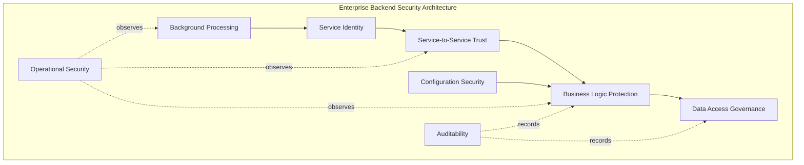
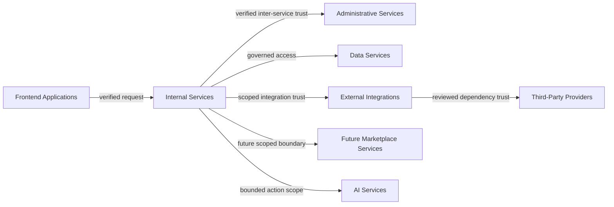
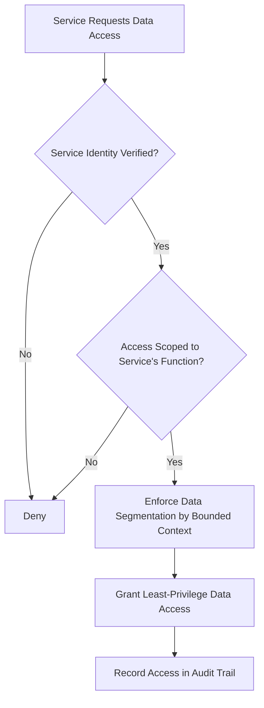
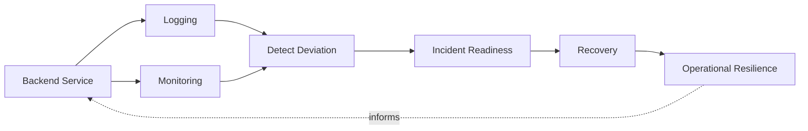
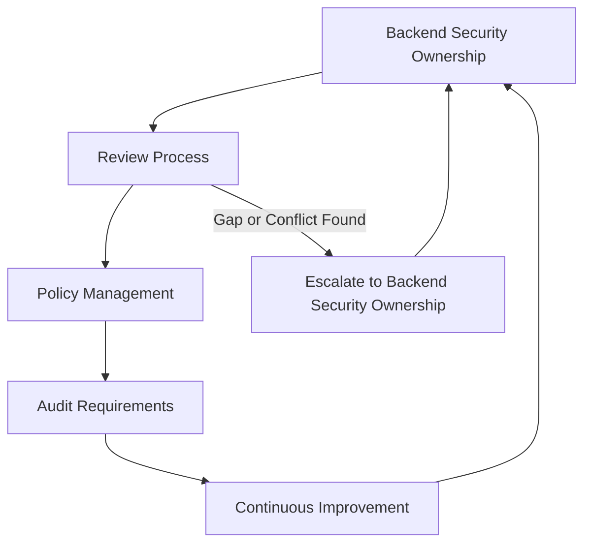

# Backend Security

## 1. Document Purpose

This document defines the official Enterprise Backend Security Strategy for **StackLeo Tech Store**. It establishes how the platform protects its business logic and server-side processing — the layer that enforces the rules customers and staff ultimately depend on.

- **Purpose of Backend Security** — to ensure that business logic executes only as intended, regardless of what a client requests, and that server-side components trust one another only to the extent explicitly warranted.
- **Relationship with Application Security** — this document elaborates Backend Security, one of the domains defined in `application-security.md` (Section 4), applying that strategy's philosophy specifically to server-side processing.
- **Relationship with API Security** — the backend is what API contracts ultimately invoke; this document assumes and depends on `api-security.md` to protect the boundary, while itself protecting what happens once a request crosses it.
- **Relationship with Enterprise Architecture** — this document is closely coordinated with `03_System_Design/service-architecture.md` and `03_System_Design/bounded-contexts.md`, applying security discipline consistently with how the backend is structurally organized.
- **Relationship with Business Resilience** — the backend enforces the business rules — pricing, order integrity, inventory allocation — that the business depends on; its protection is inseparable from operational continuity described in `security-principles.md` (Section 9).

This document is implementation-independent and vendor-neutral. It defines backend security philosophy, domains, and governance — not specific products, attack techniques, code, or implementation procedures.

## 2. Backend Security Philosophy

- **Zero Trust Services** — no internal service trusts another based on network location or being "inside" the platform; every service-to-service interaction is verified, consistent with `security-architecture.md` (Section 2).
- **Secure by Design** — backend security is considered from the point a service or capability is first designed, not retrofitted afterward, consistent with `security-principles.md` (Section 8).
- **Defense in Depth** — backend protection relies on multiple independent layers (Section 3), so no single control's failure results in full compromise.
- **Least Privilege** — every service is granted only the data access and capability its defined responsibility requires, consistent with `authorization.md`.
- **Separation of Duties** — no single service or role can both perform and approve the same high-impact business action, consistent with `security-principles.md` (Section 3.8).
- **Continuous Verification** — trust extended to a service or request is re-evaluated over the life of an interaction, never assumed to persist indefinitely once initially granted.

## 3. Backend Security Domains

### Business Logic Protection

- **Purpose** — ensure the rules governing commerce (pricing, discounts, order integrity, inventory allocation) execute exactly as intended regardless of the sequence or form of incoming requests.
- **Business Value** — protects revenue integrity and the fairness of the customer experience.
- **Protection Objectives** — business rules are enforced consistently server-side, never relying on client-side representation, consistent with `application-security.md` (Section 4).

### Service Identity

- **Purpose** — ensure every backend service operates under its own distinct, verifiable identity.
- **Business Value** — enables attributable, accountable inter-service action as the backend grows in complexity.
- **Protection Objectives** — every service is represented by a Service Identity, per `identity-management.md` (Section 8), never a shared or implicit identity.

### Service-to-Service Trust

- **Purpose** — ensure that trust between backend services is established explicitly rather than assumed from network proximity.
- **Business Value** — prevents a single compromised service from gaining unchecked access to every other service it can reach.
- **Protection Objectives** — every inter-service call is independently verified and authorized (Section 4).

### Data Access Governance

- **Purpose** — ensure backend services access only the data their function legitimately requires.
- **Business Value** — limits the exposure of customer and business data to the smallest necessary set of services.
- **Protection Objectives** — data access is scoped, governed, and auditable (Section 6).

### Configuration Security

- **Purpose** — ensure backend service configuration defaults to its most secure reasonable state.
- **Business Value** — reduces risk introduced by oversight or unreviewed environment-specific settings.
- **Protection Objectives** — configuration is externalized and governed consistently, per `03_System_Design/architecture-principles.md` (ARCH-030).

### Operational Security

- **Purpose** — sustain protection and detect deviation from expected behavior while backend services are running.
- **Business Value** — determines how quickly the business can detect and respond to a real-world issue.
- **Protection Objectives** — backend services are continuously monitored and logged (Section 7).

### Background Processing

- **Purpose** — ensure asynchronous and scheduled processing is subject to the same security discipline as interactive requests.
- **Business Value** — prevents automated processes from becoming an overlooked path to unauthorized action.
- **Protection Objectives** — background processes operate under scoped Machine Identities, per `identity-management.md` (Section 8).

### Auditability

- **Purpose** — ensure significant backend actions are attributable and recorded.
- **Business Value** — supports investigation, accountability, and trust restoration after an incident.
- **Protection Objectives** — security-relevant and business-critical backend actions are logged immutably, consistent with `security-principles.md` (Section 9).

### Backend Security Domain Matrix

| Domain | Primary Risk Addressed | Related Document |
|---|---|---|
| Business Logic Protection | Circumvention of commercial rules via unexpected requests | `application-security.md` |
| Service Identity | Unattributable or shared service action | `identity-management.md` |
| Service-to-Service Trust | Lateral movement from a single compromised service | `security-architecture.md` |
| Data Access Governance | Broader data access than a service's function requires | `authorization.md` |
| Configuration Security | Risk from unreviewed or default-insecure settings | `infrastructure-security.md` |
| Operational Security | Undetected deviation from expected backend behavior | `security-architecture.md` |
| Background Processing | Automated action bypassing normal security discipline | `identity-management.md` |
| Auditability | Inability to investigate or attribute backend action | `security-principles.md` |

*Diagram 1: Enterprise Backend Security Architecture.*

## 4. Service Trust Boundaries

Backend components interact across several conceptual trust boundaries, each requiring independent verification:

- **Frontend Applications** — the boundary at which customer- and staff-facing requests enter backend processing; never assumed genuine merely because they arrive through the expected channel, per `frontend-security.md` (Section 3).
- **Internal Services** — the boundary between one backend service and another, where trust must be verified explicitly rather than assumed from being on the same internal network.
- **Administrative Services** — the boundary protecting elevated, business-critical capability from routine service-to-service traffic.
- **Data Services** — the boundary between business logic services and the data stores they depend on, governed by Data Access Governance (Section 3).
- **External Integrations** — the boundary at which trust is extended to payment, courier, or communication providers, per `security-architecture.md` (Section 4).
- **Third-Party Providers** — a broader category of external dependency beyond core operational integrations, reviewed per `application-security.md` (Section 7).
- **Future Marketplace Services** — the boundary anticipated for services supporting third-party seller capability, requiring the same rigor as internal services today.
- **AI Services** — the boundary at which AI-assisted capability, per `identity-management.md` (Section 8), interacts with core backend services under an explicitly bounded scope.

Backend components should never implicitly trust each other because internal network location is not a meaningful security boundary: a compromised service that is implicitly trusted by its neighbors can move laterally across the entire backend, turning a single point of failure into a platform-wide compromise — precisely what Zero Trust Services (Section 2) exists to prevent.

*Diagram 2: Service Trust Boundary Model.*

### Service Trust Boundary Summary

| Boundary | Trust Basis | Primary Risk If Assumed |
|---|---|---|
| Frontend Applications | Independent server-side verification | Requests trusted merely because of their apparent origin |
| Internal Services | Explicit, verified inter-service identity | Lateral movement from one compromised service to others |
| Administrative Services | Heightened, privileged verification | Routine traffic gaining elevated capability |
| Data Services | Scoped, governed data access | Broader data reach than a service's function requires |
| External Integrations | Scoped integration agreement | Exposure beyond the integration's intended purpose |
| Third-Party Providers | Reviewed dependency trust | Indirect compromise via a broader dependency |
| Future Marketplace Services | Seller-scoped service boundary | Cross-vendor interference between marketplace services |
| AI Services | Bounded, explicit action scope | Unbounded or unattributed autonomous backend action |

## 5. Business Logic Security

- **Authorization Awareness** — every business logic operation verifies that the calling identity is authorized for that specific operation, per `authorization.md`, rather than assuming prior checks suffice.
- **Data Validation Awareness** — data entering business logic is validated against expected form and business rules before being acted upon, consistent with `application-security.md` (Section 5).
- **Workflow Integrity** — multi-step business processes (checkout, fulfillment, refunds) are protected against being entered out of sequence or left in an inconsistent intermediate state.
- **Sensitive Operations** — operations with significant financial or account-security consequence receive proportionately stronger verification, consistent with the Assurance Levels in `authentication.md` (Section 3).
- **Transaction Integrity** — operations affecting financial or inventory state complete fully and consistently, or not at all, avoiding partial, inconsistent outcomes.
- **Business Rule Protection** — the rules defined in `01_Business/business-rules.md` are enforced identically regardless of which channel or client initiated the request.

### Business Logic Protection Matrix

| Concern | Protection Approach |
|---|---|
| Authorization Awareness | Every operation independently verifies caller authorization |
| Data Validation Awareness | Untrusted data validated before being acted upon |
| Workflow Integrity | Multi-step processes protected against out-of-sequence execution |
| Sensitive Operations | Assurance level scaled to operation consequence |
| Transaction Integrity | Operations complete fully and consistently or not at all |
| Business Rule Protection | Rules enforced identically across every channel |

## 6. Data Access Security

- **Data Ownership** — every data category accessed by backend services has a designated accountable owner, consistent with `data-protection.md` (Section 8).
- **Access Governance** — service access to data is governed by the principles in `authorization.md`, reviewed periodically to confirm continued legitimacy.
- **Least Privilege** — each service accesses only the specific data its function requires, never a broader scope for convenience.
- **Data Segmentation** — data belonging to distinct bounded contexts, per `03_System_Design/bounded-contexts.md`, remains accessible only to the services that own it.
- **Auditability** — access to Confidential and Restricted data, per `data-protection.md` (Section 4), is recorded consistently with `security-principles.md` (Section 9).
- **Privacy Awareness** — backend data access respects the purpose limitation principles in `data-protection.md` (Section 6), never using data beyond its collected purpose.

*Diagram 3: Backend Data Access Flow.*

### Data Access Governance Matrix

| Principle | What It Ensures |
|---|---|
| Data Ownership | Every data category has an accountable owner |
| Access Governance | Access reflects current, legitimate business need |
| Least Privilege | Services access only what their function requires |
| Data Segmentation | Bounded-context data remains inaccessible to unrelated services |
| Auditability | Confidential and Restricted data access is recorded |
| Privacy Awareness | Data is used only within its collected purpose |

## 7. Operational Security

- **Logging** — security-relevant and business-critical backend actions are recorded with sufficient context to support investigation, consistent with `security-principles.md` (Section 9).
- **Monitoring** — backend service behavior is continuously observed so deviation from expected patterns can be recognized early.
- **Incident Readiness** — backend teams maintain a clear, practiced understanding of how to detect, contain, and recover from a backend-originating security event.
- **Service Reliability** — backend services are designed to tolerate and recover from failure gracefully, consistent with `03_System_Design/resilience-strategy.md`.
- **Operational Resilience** — the backend is expected to withstand and recover from adverse operational conditions as a normal part of how it runs.
- **Recovery Awareness** — every backend service maintains an explicit answer to how it recovers from failure, not merely how it behaves when everything succeeds, consistent with `03_System_Design/architecture-principles.md` (ARCH-045).

*Diagram 4: Secure Service Communication Framework — operational security continuously observes and strengthens the service layer it protects.*

## 8. Future Backend Readiness

This strategy is deliberately structured to remain valid as StackLeo's backend architecture evolves:

- **Modular Monolith** — Business Logic Protection and Data Access Governance (Sections 5–6) apply cleanly within a modular monolith's internal module boundaries.
- **Event-Driven Systems** — as interaction moves toward asynchronous events (per `03_System_Design/event-flows.md`), the same trust-boundary and business logic protection principles extend to event producers and consumers.
- **Microservices** — decomposition into independently deployable services (per `03_System_Design/architecture-principles.md`, ARCH-041) increases the number of Service Trust Boundaries (Section 4), making this strategy's boundary-first approach more valuable, not less.
- **Marketplace Platform** — Future Marketplace Services (Section 4) are already anticipated, allowing seller-supporting backend capability to be governed deliberately ahead of launch.
- **AI Services** — AI Services (Section 4) are treated as a distinct, bounded trust boundary, consistent with `identity-management.md` (Section 8).
- **Multi-Tenant Systems** — as marketplace and corporate business models mature, Data Segmentation (Section 6) ensures one tenant's data remains inaccessible to another's services.
- **Global Expansion** — backend security principles remain jurisdiction-agnostic, allowing region-specific obligations to layer on as StackLeo expands from Bangladesh into South Asia and beyond.

## 9. Governance

- **Backend Security Ownership** — the Security Lead owns the coherence of this backend security strategy, working alongside the Solution Architect who owns `03_System_Design/service-architecture.md`.
- **Review Process** — significant backend design and service decisions are reviewed against this strategy, consistent with the Secure SDLC in `application-security.md` (Section 3).
- **Policy Management** — operational backend security policies are derived from this strategy and maintained consistently with `security-governance.md`.
- **Audit Requirements** — significant backend security decisions and access to sensitive data are recorded consistently with `security-principles.md` (Section 9).
- **Continuous Improvement** — this strategy is expected to mature as backend architecture, scale, and threat context evolve.

*Diagram 5: Backend Security Governance Lifecycle.*

### Governance Responsibility Matrix

| Role | Responsibility |
|---|---|
| Security Lead | Owns coherence and enforcement of the backend security strategy. |
| Solution Architect | Ensures backend security remains consistent with `03_System_Design/service-architecture.md`. |
| Engineering Leads | Apply backend security domains within their service or module. |
| Operations Lead | Monitors backend operational health and security signals. |
| Data Protection Owner | Ensures backend data access aligns with `data-protection.md`. |
| Internal Audit / Review Function | Independently verifies backend security practice matches this strategy. |

## 10. Anti-Patterns

| Anti-Pattern | Why It's Avoided |
|---|---|
| Blind Trust Between Services | Contradicts Zero Trust Services (Section 2); allows lateral movement from a single compromised service. |
| Weak Business Logic Protection | Allows commercial rules to be circumvented despite technically valid requests, contradicting Section 5. |
| Excessive Service Privileges | Violates Least Privilege (Section 2); expands the impact of any single compromised service. |
| Poor Configuration Governance | Leaves Configuration Security (Section 3) dependent on manual, error-prone setup rather than secure defaults. |
| Missing Auditability | Prevents investigation and attribution of backend action, undermining Section 3. |
| Weak Data Governance | Allows services to access data beyond their legitimate function, contradicting Section 6. |
| No Operational Monitoring | Removes the ability to detect deviation from expected backend behavior, undermining Section 7. |
| Reactive Security | Treats backend security as a response to incidents rather than a continuous discipline embedded in design. |

## 11. Document Information

| Property | Value |
|----------|-------|
| Document | backend-security.md |
| Version | 1.0.0 |
| Status | Active |
| Maintained By | StackLeo |
| Last Updated | 2026-07-17 |

---

© StackLeo. All Rights Reserved.
