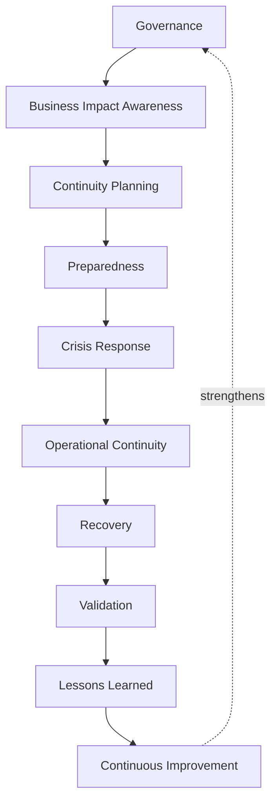
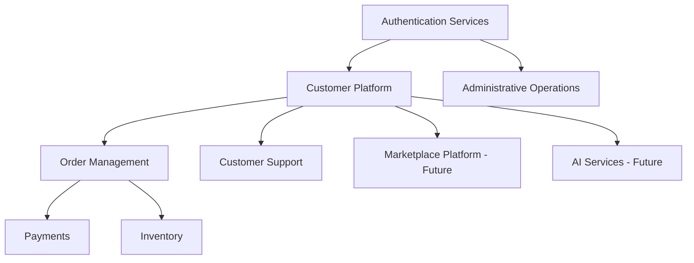
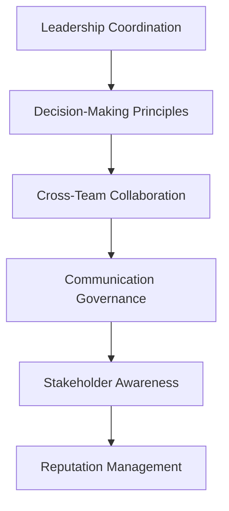
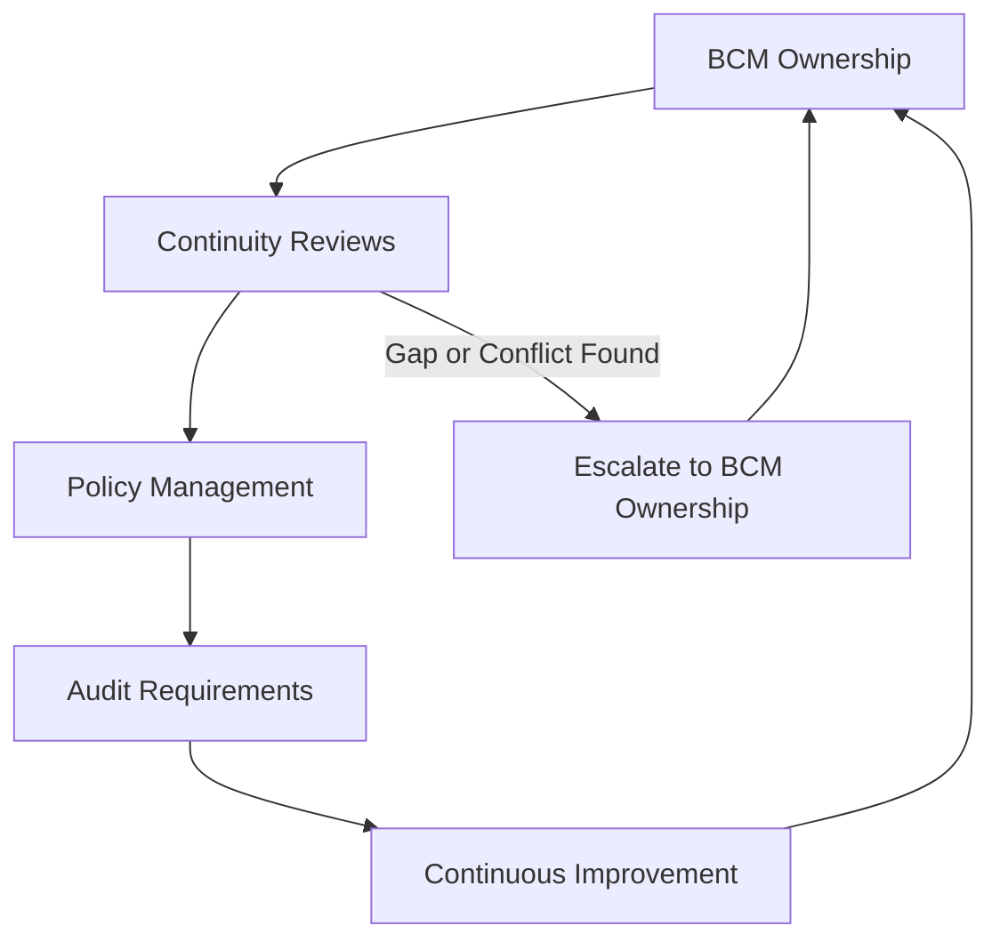
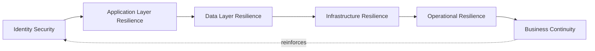

# Business Continuity

## 1. Document Purpose

This document defines the official Enterprise Business Continuity Strategy for **StackLeo Tech Store**. It establishes how the organization sustains its ability to serve customers and operate the business through disruption, at every scale from a minor operational hiccup to a significant crisis.

- **Purpose of Business Continuity** — to ensure the business itself — not merely its technical systems — continues to function through disruption, keeping commerce, customer support, and critical operations running in some meaningful form.
- **Relationship with Enterprise Resilience** — this document operationalizes Business Resilience from `security-principles.md` (Section 2, 9) at the whole-organization level, extending resilience thinking beyond technology into people, process, and business decision-making.
- **Relationship with Disaster Recovery** — `disaster-recovery.md` answers *how systems and infrastructure are restored*; this document answers *how the business as a whole continues operating* while that restoration occurs, and afterward. The two are coordinated but distinct: disaster recovery is a critical input to business continuity, not a replacement for it.
- **Relationship with Incident Response** — a security incident, per `incident-response.md`, may trigger business continuity activation when its impact extends beyond a contained technical event into broader business disruption.
- **Relationship with Customer Trust** — customers judge StackLeo not only by whether disruption occurs, but by whether the business continues to serve them reliably through it; sustained continuity is itself part of the trust described in `01_Business/vision.md`.

This document is implementation-independent and vendor-neutral. It defines business continuity philosophy, lifecycle, and governance — not specific BCM software, organization-specific recovery timelines, emergency operating procedures, or code.

## 2. Business Continuity Philosophy

- **Resilience by Design** — continuity capability is planned into how the business operates from the outset, not assembled reactively once disruption has already begun, consistent with `security-architecture.md` (Section 2).
- **Business First** — continuity planning is driven by business consequence — what customers experience, what revenue is at risk, what obligations remain — not solely by technical restoration convenience.
- **Operational Sustainability** — continuity plans account for the realistic capacity of the people and processes that must execute them, not only an idealized technical sequence.
- **Continuous Improvement** — continuity capability matures through deliberate review and testing awareness, never assumed adequate simply because it was once planned.
- **Risk-Based Planning** — continuity investment is proportionate to the business consequence of each function's disruption, consistent with `security-principles.md` (Section 5).
- **Customer-Centric Continuity** — continuity planning explicitly considers what customers experience during disruption, not only what remains true internally.

## 3. Business Continuity Lifecycle

| Phase | Objectives | Business Value |
|---|---|---|
| Governance | Establish clear ownership and accountability for continuity planning before disruption occurs. | Ensures continuity is a standing organizational responsibility, not an afterthought. |
| Business Impact Awareness | Understand which business functions matter most and why (Section 5). | Focuses continuity investment where business consequence is greatest. |
| Continuity Planning | Develop the organization's approach to sustaining critical functions through disruption. | Converts business impact awareness into an actionable plan. |
| Preparedness | Build practiced readiness — roles, communication paths, decision authority — ahead of any actual event. | Reduces confusion and delay when disruption occurs. |
| Crisis Response | Activate coordinated response once disruption reaches crisis scale. | Ensures a decisive, organized shift from routine operation to crisis mode. |
| Operational Continuity | Sustain critical business functions, even in a reduced or alternate form, throughout the disruption. | Preserves the business's ability to serve customers while full recovery proceeds. |
| Recovery | Return affected functions to normal operation, coordinated with `disaster-recovery.md`. | Restores steady-state business operation. |
| Validation | Confirm recovered functions are genuinely operating correctly before declaring continuity restored. | Prevents a premature return to normal that later fails again. |
| Lessons Learned | Review how continuity performed and what should improve. | Converts a costly disruption into durable organizational improvement. |
| Continuous Improvement | Apply lessons learned to future planning and preparedness. | Ensures continuity capability compounds over time rather than resetting after each event. |

*Diagram 1: Business Continuity Lifecycle.*

### Business Continuity Lifecycle Matrix

| Phase | Trigger | Primary Concern |
|---|---|---|
| Governance | Ongoing, before any disruption | Ensuring accountable ownership exists |
| Business Impact Awareness | Ongoing planning activity | Understanding which functions matter most |
| Continuity Planning | Business impact is understood | Converting understanding into an actionable plan |
| Preparedness | Plan exists | Building practiced readiness to execute it |
| Crisis Response | Disruption reaches crisis scale | Activating coordinated response decisively |
| Operational Continuity | Crisis response is active | Sustaining critical functions through disruption |
| Recovery | Disruption is being addressed | Returning affected functions to normal operation |
| Validation | Recovery appears complete | Confirming genuine, correct function before closure |
| Lessons Learned | Continuity is restored | Extracting durable improvement from the event |
| Continuous Improvement | Lessons are captured | Applying them to future planning |

## 4. Business Critical Functions

| Function | Business Importance | Operational Dependency | Continuity Priority |
|---|---|---|---|
| Customer Platform | Direct point of customer interaction and revenue generation. | Depends on Authentication, Order Management, and Infrastructure. | Critical |
| Authentication Services | Gatekeeper for every customer and staff interaction. | Depends on Identity Services and Databases, per `disaster-recovery.md` (Section 4). | Critical |
| Order Management | Represents committed revenue and fulfillment obligations. | Depends on Customer Platform, Inventory, and Payments. | Critical |
| Payments | Directly financial; highest fraud and regulatory sensitivity. | Depends on Authentication and external payment integrations. | Critical |
| Inventory | Determines fulfillment accuracy and customer promise reliability. | Depends on Order Management and Databases. | High |
| Customer Support | Sustains customer confidence and issue resolution during disruption. | Depends on Customer Platform and internal tooling availability. | High |
| Administrative Operations | Enables business configuration, oversight, and decision-making. | Depends on Authentication and Identity Services. | High |
| Marketplace Platform (Future) | Will support third-party seller commerce and revenue. | Will depend on Customer Platform, Authentication, and Order Management. | High (Future) |
| AI Services (Future) | Supports enhanced customer experience (search, recommendations). | Depends on Customer Platform and Data Services. | Moderate |

### Critical Business Function Matrix

| Function | Continuity Priority | Degrades Gracefully? |
|---|---|---|
| Customer Platform | Critical | No — core to the business |
| Authentication Services | Critical | No — required by nearly everything else |
| Order Management | Critical | No — represents direct revenue |
| Payments | Critical | No — financial and regulatory exposure |
| Inventory | High | Partially — brief staleness may be tolerable |
| Customer Support | High | Partially — reduced capacity is tolerable briefly |
| Administrative Operations | High | Partially — some functions can be deferred temporarily |
| Marketplace Platform (Future) | High (Future) | Partially, once launched |
| AI Services (Future) | Moderate | Yes — can be temporarily disabled without halting commerce |

*Diagram 3: Critical Business Dependency Model.*

## 5. Business Impact Awareness

- **Critical Processes** — the specific business processes (checkout, order fulfillment, customer inquiry resolution) that must continue in some form for the business to remain viable during disruption.
- **Supporting Services** — the services and capability that critical processes depend upon, per the dependency relationships in Section 4.
- **Business Dependencies** — internal and external dependencies (staff availability, partner services, infrastructure) that critical processes rely upon.
- **Operational Priorities** — the order in which functions are addressed during disruption, reflecting their criticality and dependency chain, not arbitrary convenience.
- **Customer Impact** — the specific ways customers experience disruption to each function, informing both prioritization and communication planning (Section 6).
- **Financial Considerations** — the general categories of financial consequence (lost revenue, regulatory exposure, remediation cost) that inform why certain functions receive continuity priority, without prescribing specific calculated figures here.

This document intentionally describes business impact awareness conceptually. Specific impact calculations, financial thresholds, and quantified analysis are maintained through dedicated business impact analysis exercises outside this architectural document.

### Business Impact Summary

| Impact Dimension | What It Captures |
|---|---|
| Critical Processes | Which business activities must continue in some form |
| Supporting Services | What those processes depend upon operationally |
| Business Dependencies | Internal and external reliance affecting continuity |
| Operational Priorities | Sequence in which functions are addressed during disruption |
| Customer Impact | How customers experience disruption to each function |
| Financial Considerations | General categories of financial consequence informing priority |

## 6. Crisis Management

- **Leadership Coordination** — executive leadership provides clear decision authority during a crisis, avoiding ambiguity about who is empowered to make consequential calls.
- **Communication Governance** — communication during a crisis, internal and external, is coordinated through a single accountable voice, consistent with `incident-response.md` (Section 6).
- **Stakeholder Awareness** — customers, partners, employees, and — where relevant — regulators are kept appropriately informed, proportionate to how the crisis affects them.
- **Decision-Making Principles** — decisions during a crisis prioritize customer safety and trust, business viability, and legal obligation, in that order of consideration, rather than technical convenience alone.
- **Cross-Team Collaboration** — crisis response spans Engineering, Operations, Customer Support, Business, and Executive functions, requiring coordination beyond any single team's normal scope.
- **Reputation Management** — how the business is perceived during and after a crisis is treated as a deliberate consideration, not an incidental byproduct of technical response.

*Diagram 4: Crisis Management Flow.*

### Crisis Management Responsibility Matrix

| Stakeholder | Role During Crisis |
|---|---|
| Executive Leadership | Provides clear decision authority and final accountability. |
| Security Lead | Coordinates technical crisis response, per `incident-response.md`. |
| Operations Lead | Sustains critical function continuity during the crisis. |
| Customer Support Lead | Manages customer-facing communication and issue resolution. |
| Communication Owner | Delivers coordinated, accurate messaging through a single voice. |
| Legal & Compliance | Advises on regulatory and contractual obligations arising from the crisis. |

## 7. Operational Resilience

- **Service Continuity** — critical business functions (Section 4) remain available in some meaningful form throughout disruption, even if in a reduced capacity.
- **Workforce Readiness** — staff understand their role during disruption and are prepared to execute it, consistent with Operational Sustainability (Section 2).
- **Technology Resilience** — technical systems support continuity through the resilience principles in `03_System_Design/resilience-strategy.md` and `disaster-recovery.md`.
- **Supplier Awareness** — dependency on external partners (payment, courier, communication providers) is understood, and their own continuity posture is a relevant consideration in overall planning.
- **Customer Confidence** — continuity is judged not only by whether functions technically remain available but by whether customers continue to trust and use the platform through disruption.
- **Continuous Operations** — the business aims to keep operating in some form throughout disruption, rather than treating any interruption as an all-or-nothing stoppage.

## 8. Future Readiness

This strategy is deliberately structured to remain valid as StackLeo's platform and organization evolve:

- **Cloud-Native Platforms** — the critical function structure in Section 4 applies consistently regardless of the specific cloud-native services adopted.
- **Global Expansion** — business impact awareness and critical function prioritization remain jurisdiction-agnostic, allowing region-specific continuity obligations to layer on as StackLeo expands from Bangladesh into South Asia and beyond.
- **Multi-Region Operations** — continuity planning extends naturally to a multi-region operating model, coordinated with `disaster-recovery.md` (Section 8).
- **Marketplace Platform** — Marketplace Platform (Section 4) is already anticipated as a critical function category, allowing seller-facing continuity to be planned ahead of launch.
- **Enterprise Customers** — corporate and wholesale customers bring heightened expectations for continuity assurance, which this strategy's business impact and crisis management structure is designed to satisfy.
- **AI Services** — AI Services (Section 4) are treated as gracefully degradable, ensuring core commerce continuity does not depend on AI capability remaining available.
- **Multi-Tenant Platforms** — as marketplace and corporate business models mature, continuity planning accounts for one tenant's disruption not automatically affecting another's.

## 9. Governance

- **BCM Ownership** — the Security Lead, in coordination with Executive Leadership, owns the coherence of this business continuity strategy.
- **Continuity Reviews** — continuity plans and business impact awareness (Section 5) are reviewed periodically and whenever significant business or organizational change occurs.
- **Policy Management** — operational continuity policies are derived from this strategy and maintained consistently with `security-governance.md`.
- **Audit Requirements** — continuity planning activity and crisis response outcomes are recorded consistently with `security-principles.md` (Section 9).
- **Continuous Improvement** — this strategy is expected to mature as the organization's scale, business model, and disruption history evolve.

*Diagram 5: Business Continuity Governance Framework.*

*Diagram 2: Enterprise Resilience Framework — business continuity sits atop, and is reinforced by, every underlying security and resilience layer.*

### BCM Governance Matrix

| Role | Responsibility |
|---|---|
| Security Lead | Owns coherence and enforcement of the business continuity strategy. |
| Executive Leadership | Sets continuity priorities and risk tolerance at the business level. |
| Operations Lead | Executes continuity planning and coordinates crisis response. |
| Customer Support Lead | Ensures customer-facing continuity and communication readiness. |
| Solution Architect | Ensures technical resilience aligns with `disaster-recovery.md` and `03_System_Design/resilience-strategy.md`. |
| Internal Audit / Review Function | Independently verifies business continuity practice matches this strategy. |

## 10. Anti-Patterns

| Anti-Pattern | Why It's Avoided |
|---|---|
| No Continuity Planning | Contradicts Resilience by Design (Section 2); leaves the business without a defined path through disruption. |
| Weak Crisis Coordination | Leaves crisis response fragmented across teams without clear roles, contradicting Section 6. |
| Missing Business Priorities | Leaves recovery and continuity effort unfocused, without the business impact awareness defined in Section 5. |
| Poor Documentation | Prevents continuity plans from being executed consistently or reviewed for improvement. |
| Weak Communication | Damages customer and stakeholder trust independent of the disruption's actual severity, contradicting Section 6. |
| No Testing Awareness | Assumes continuity plans work without ever validating them, undermining Continuous Improvement (Section 2). |
| Reactive Continuity | Treats business continuity as something improvised during disruption rather than a prepared, practiced discipline. |
| Weak Governance | Allows continuity practice to drift from this strategy with no accountable owner or review mechanism (Section 9). |

## 11. Document Information

| Property | Value |
|----------|-------|
| Document | business-continuity.md |
| Version | 1.0.0 |
| Status | Active |
| Maintained By | StackLeo |
| Last Updated | 2026-07-17 |

---

© StackLeo. All Rights Reserved.
