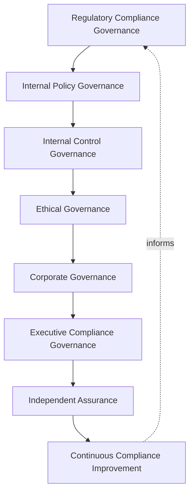
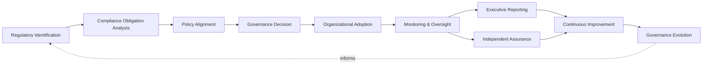
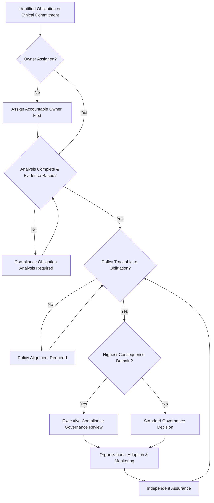
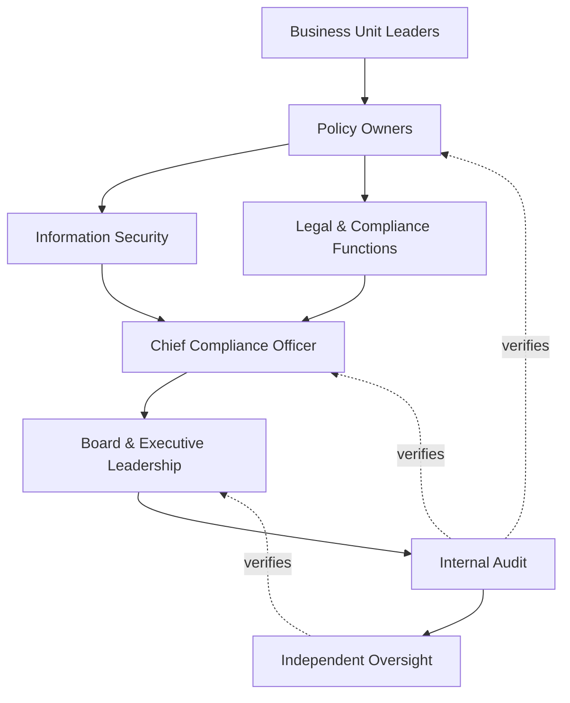
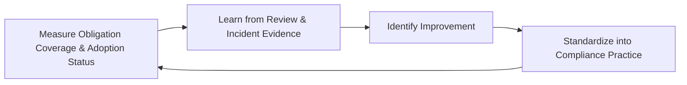
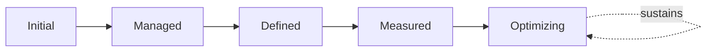

# Enterprise Compliance Governance Strategy

## 1. Document Purpose

This document defines the official Enterprise Compliance Governance Strategy for **StackLeo Tech Store** — the CCO/CRO/CISO-owned executive charter under which the organization's obligations to regulators, partners, and its own stated ethical commitments are governed as a deliberate, accountable discipline. It establishes enterprise compliance governance, regulatory governance, policy governance, control governance, organizational accountability, executive oversight, ethical governance, and long-term compliance maturity, consistent with ISO/IEC 37301, ISO/IEC 27001, COSO governance thinking, and TOGAF enterprise architecture thinking.

`compliance.md` remains the operational governance framework for compliance practice — the document that elaborates in full operational depth how specific regulatory obligations are identified, tracked, mapped to internal practice, and satisfied. This document sits above it as the highest-level executive mandate, consistent with the executive-charter relationship `enterprise-risk-management-strategy.md` holds over `risk-management.md`: it does not restate operational obligation tracking, it establishes the philosophy, organizational ownership, and ethical foundation that give compliance practice its authority and continuity at the level of the Board and executive leadership.

- **Purpose of Compliance Governance** — to ensure StackLeo's obligations — legal, regulatory, contractual, and ethical — are met deliberately by accountable people, as an expression of genuine organizational integrity, never merely as a defensive posture assumed adequate by default.
- **Relationship with Enterprise Risk Management** — compliance risk is treated as a category of business risk within `enterprise-risk-management-strategy.md` (Section 3.5), assessed using the same risk philosophy defined there, not as a separate, parallel discipline.
- **Relationship with Corporate Governance** — compliance governance is a specialized expression of StackLeo's broader corporate governance posture; it does not replace corporate governance but ensures regulatory and ethical obligations are consistently reflected in how the business is directed and controlled.
- **Relationship with Information Security** — this strategy does not redefine security governance; `security-governance.md` governs how internal security decisions are made and by whom, while this strategy governs how external obligations are identified, tracked, and evidenced. The two are complementary, not overlapping.
- **Relationship with Internal Controls** — `internal-controls.md` establishes the enterprise-wide COSO-aligned control framework; this strategy ensures the controls that framework produces are traceable to the specific obligations, tracked in `compliance.md`, they exist to satisfy.
- **Relationship with Audit Governance** — this strategy establishes the accountability structure through which the independent assurance practice defined in `audit-governance.md` verifies that compliance is genuinely, not merely nominally, achieved.
- **Relationship with Executive Decision-Making** — this strategy exists to make compliance and ethical consequence a deliberate, visible input to every significant executive decision, never a factor considered only after a decision has already been made.

This document is implementation-independent and vendor-neutral. It defines compliance governance philosophy, model, domains, and lifecycle conceptually — not specific GRC platforms, compliance software, legal technology vendors, cloud providers, consulting firms, security products, compliance checklists, implementation roadmaps, regulatory filing procedures, control testing procedures, infrastructure configurations, deployment architectures, operational workflows, or code.

## 2. Compliance Governance Philosophy

Compliance governance at StackLeo rests on eight principles. Each exists to produce a specific business outcome — compliance is governed deliberately because obligation, when genuinely met, protects the same trust the business exists to earn.

### 2.1 Compliance as Business Enablement

Compliance governance exists to let the business pursue growth — corporate sales, wholesale, the multi-vendor marketplace, international expansion — with confidence that its obligations are genuinely met, not to obstruct that growth.

- **Business Value** — keeps compliance governance genuinely followed rather than resented as an obstacle to legitimate ambition.

### 2.2 Governance Before Compliance

The accountability structure — who decides, who owns, who is accountable — is established before specific compliance activity is undertaken.

- **Business Value** — ensures compliance activity exists because a genuine, governed decision called for it, not as an ad hoc reaction to a regulatory concern.

### 2.3 Ethical Decision-Making

Compliance governance extends beyond the letter of legal obligation to the organization's own stated ethical commitments, per `01_Business/vision.md`.

- **Business Value** — protects the business from the reputational harm of practices that are technically permitted but genuinely inconsistent with its own values.

### 2.4 Accountability

Every compliance governance decision traces to a specific, named, responsible party.

- **Business Value** — ensures every obligation and every ethical commitment has someone genuinely responsible for defending its satisfaction.

### 2.5 Transparency

Compliance obligations, decisions, and status are documented and visible to those who need them, never hidden or informally understood.

- **Business Value** — allows compliance posture to be scrutinized and defended, not merely assumed adequate.

### 2.6 Regulatory Awareness

Compliance governance actively monitors the regulatory landscape relevant to StackLeo's current and future markets, never assuming a static obligation set.

- **Business Value** — protects the business from being caught unprepared by regulatory change it should reasonably have anticipated.

### 2.7 Business Alignment

Compliance governance decisions are made in service of genuine business need, never imposed as friction disconnected from real operational purpose.

- **Business Value** — keeps compliance governance genuinely integrated with, not parallel to, how the business actually operates.

### 2.8 Continuous Improvement

Compliance governance practice matures over time, informed by real findings, incidents, and the organization's growth in scale and regulatory reach.

- **Business Value** — keeps compliance governance aligned with StackLeo's growth in market reach and regulatory exposure.

## 3. Enterprise Compliance Governance Model

Compliance governance operates across eight conceptual layers, each holding accountability for a distinct dimension of compliance and ethical practice. Every layer here is elaborated in full operational depth in `compliance.md`.

### 3.1 Regulatory Compliance Governance

- **Purpose** — own the coherence of how applicable regulatory obligations are identified, interpreted, and tracked.
- **Governance Scope** — oversight of Regulatory Identification and Obligation Analysis (Sections 5.1–5.2), elaborated in `compliance.md`.
- **Business Value** — ensures regulatory obligation is actively monitored, never assumed satisfied by default.
- **Executive Expectations** — leadership trusts applicable regulation is tracked deliberately, not discovered reactively.

### 3.2 Internal Policy Governance

- **Purpose** — own the coherence of how obligations translate into concrete internal policy.
- **Governance Scope** — oversight of Policy Alignment (Section 5.3), coordinated with `policy-management.md` and `security-policies.md`.
- **Business Value** — ensures obligations become actionable practice, not merely acknowledged text.
- **Executive Expectations** — leadership trusts every policy traces back to a specific tracked obligation or ethical commitment.

### 3.3 Internal Control Governance

- **Purpose** — own the coherence of how the controls satisfying compliance obligations are designed and assured.
- **Governance Scope** — oversight of control traceability to obligation, coordinated with `internal-controls.md` and `security-controls-framework.md`.
- **Business Value** — ensures obligations are backed by genuine, verifiable controls, not assumed satisfied by policy language alone.
- **Executive Expectations** — leadership trusts controls are demonstrably functioning, not merely documented as existing.

### 3.4 Ethical Governance

- **Purpose** — own the coherence of how the organization's own stated ethical commitments are upheld, beyond strict legal obligation.
- **Governance Scope** — oversight of ethical decision-making across every domain in Section 4, consistent with Section 2.3.
- **Business Value** — protects the organization's integrity as a distinct value from mere legal compliance.
- **Executive Expectations** — leadership expects ethical consequence to be weighed explicitly, not assumed covered by legal compliance alone.

### 3.5 Corporate Governance

- **Purpose** — own the coherence of how compliance and ethical governance integrate with StackLeo's broader corporate governance structure.
- **Governance Scope** — oversight of the Board and executive-level accountability structure this strategy operates within.
- **Business Value** — ensures compliance is genuinely a Board-level concern, not delegated entirely to a specialist function.
- **Executive Expectations** — leadership expects compliance governance to be integrated with, not separate from, overall corporate governance practice.

### 3.6 Executive Compliance Governance

- **Purpose** — own executive-level accountability for the compliance and ethical decisions carrying the greatest organizational consequence.
- **Governance Scope** — oversight spanning Sections 3.1–3.5 wherever a compliance matter rises to genuine executive or Board concern.
- **Business Value** — ensures the most consequential compliance decisions are visible at the level accountable for the organization as a whole.
- **Executive Expectations** — leadership expects to be informed of, not surprised by, the organization's most significant compliance exposure.

### 3.7 Independent Assurance

- **Purpose** — own the independent verification that compliance governance is genuinely functioning, not merely documented.
- **Governance Scope** — oversight of compliance evidence quality and completeness, coordinated with `audit-governance.md`.
- **Business Value** — prevents compliance effectiveness from being assumed on the word of the same function responsible for achieving it.
- **Executive Expectations** — leadership trusts an independent party periodically confirms compliance is genuinely achieved, not merely claimed.

### 3.8 Continuous Compliance Improvement

- **Purpose** — govern the mechanism by which every other layer in this model matures over time.
- **Governance Scope** — consolidates findings from compliance reviews, audits, and incidents across every domain in Section 4.
- **Business Value** — prevents compliance governance itself from becoming the next thing that quietly stagnates as the organization scales.
- **Executive Expectations** — leadership expects compliance maturity to be assessed periodically, not assumed static once established.

### Enterprise Compliance Governance Matrix

| Layer | Purpose | Business Value | Executive Expectations |
|---|---|---|---|
| Regulatory Compliance Governance | Own coherence of how obligations are identified and tracked | Ensures regulation is actively monitored, never assumed satisfied | Trusts applicable regulation is tracked deliberately |
| Internal Policy Governance | Own coherence of translating obligation into policy | Ensures obligations become actionable practice | Trusts every policy traces to a tracked obligation or commitment |
| Internal Control Governance | Own coherence of controls satisfying obligations | Ensures obligations are backed by verifiable controls | Trusts controls are demonstrably functioning, not just documented |
| Ethical Governance | Own coherence of upholding stated ethical commitments | Protects integrity as distinct from mere legal compliance | Expects ethical consequence weighed explicitly |
| Corporate Governance | Own coherence of integration with broader corporate governance | Ensures compliance is genuinely a Board-level concern | Expects integration with, not separation from, corporate governance |
| Executive Compliance Governance | Own executive accountability for highest-consequence decisions | Ensures the most consequential decisions are visible to leadership | Expects leadership informed of, not surprised by, top exposure |
| Independent Assurance | Own independent verification that compliance is genuine | Prevents effectiveness being assumed on the achiever's own word | Trusts an independent party confirms compliance is genuine |
| Continuous Compliance Improvement | Govern maturation of every other layer | Prevents governance itself from stagnating | Expects maturity to be assessed periodically |

*Diagram 1: Enterprise Compliance Governance Framework — regulatory, policy, and control governance establish the foundation, ethical and corporate governance situate it within organizational integrity, and executive oversight, independently assured, converges on continuous improvement that feeds back into the model.*

## 4. Enterprise Compliance Domains

Compliance is governed across ten conceptual domains, each requiring a distinct governance emphasis.

### 4.1 Corporate Compliance

- **Purpose** — represent obligations relating to StackLeo's own corporate structure and governance.
- **Governance Considerations** — governed under Corporate Governance (Section 3.5), coordinated with the Board's own governance practice.
- **Business Importance** — protects the organization's fundamental legal standing and governance legitimacy.
- **Executive Expectations** — leadership expects corporate compliance to be foundational, never an afterthought to other domains.

### 4.2 Information Security Compliance

- **Purpose** — represent obligations relating to how the platform protects data and systems.
- **Governance Considerations** — governed under Internal Control Governance (Section 3.3), coordinated with `security-governance.md` and `security-standards.md`.
- **Business Importance** — protects the trust customers place in the platform with their data and transactions.
- **Executive Expectations** — leadership expects security compliance to be a design input, not a retrofit.

### 4.3 Privacy & Data Protection Compliance

- **Purpose** — represent obligations relating to personal data collection, use, and protection.
- **Governance Considerations** — governed under Regulatory Compliance Governance (Section 3.1), coordinated with `privacy-governance.md`.
- **Business Importance** — protects individuals' data and the trust relationship it represents.
- **Executive Expectations** — leadership expects privacy compliance to be reviewed as obligations and business practice evolve together.

### 4.4 Financial Compliance

- **Purpose** — represent obligations relating to financial transactions, reporting, and reconciliation.
- **Governance Considerations** — governed under the highest rigor within Internal Control Governance (Section 3.3), given regulatory and audit sensitivity.
- **Business Importance** — protects the business's financial integrity and its standing with regulators and payment partners.
- **Executive Expectations** — leadership expects financial compliance to meet the strictest control-traceability standard in this model.

### 4.5 Employment & HR Compliance

- **Purpose** — represent obligations relating to StackLeo's own workforce.
- **Governance Considerations** — governed under Ethical Governance (Section 3.4), coordinated with `identity-lifecycle.md` and `privacy-governance.md`.
- **Business Importance** — protects the organization's obligations to its own current and former people.
- **Executive Expectations** — leadership expects employment compliance to meet both legal obligation and the organization's own ethical standard.

### 4.6 Consumer Protection Compliance

- **Purpose** — represent obligations relating to fair, transparent treatment of customers.
- **Governance Considerations** — governed under Ethical Governance (Section 3.4), directly relevant to the direct-to-consumer B2C business model.
- **Business Importance** — protects the trust relationship every customer transaction depends on.
- **Executive Expectations** — leadership expects consumer protection compliance to be treated as core to the business, not a peripheral legal concern.

### 4.7 Third-Party Compliance

- **Purpose** — represent obligations relating to vendors, partners, and future marketplace sellers.
- **Governance Considerations** — governed under Regulatory Compliance Governance (Section 3.1), coordinated with `identity-federation.md`.
- **Business Importance** — protects the business from compliance exposure introduced by parties it does not directly control.
- **Executive Expectations** — leadership expects third-party compliance expectations to be proportionate to the access and data each party is granted.

### 4.8 Marketplace Compliance

- **Purpose** — represent obligations specific to the future multi-vendor marketplace business model.
- **Governance Considerations** — governed under Regulatory Compliance Governance (Section 3.1), structured ahead of the marketplace model's launch.
- **Business Importance** — will become foundational to the multi-vendor marketplace business model as it launches.
- **Executive Expectations** — leadership expects marketplace compliance governance to be designed before, not retrofitted after, launch.

### 4.9 AI & Emerging Technology Compliance

- **Purpose** — represent obligations relating to AI-assisted capability and other genuinely new technology.
- **Governance Considerations** — governed under Continuous Compliance Improvement (Section 3.8) as a distinct, explicitly monitored category.
- **Business Importance** — protects against compliance exposure from categories of obligation not yet fully established in regulatory practice.
- **Executive Expectations** — leadership expects AI and emerging technology compliance to be actively scanned for, not discovered reactively.

### 4.10 International Regulatory Compliance

- **Purpose** — represent obligations that apply as StackLeo expands across jurisdictional boundaries.
- **Governance Considerations** — governed under Regulatory Compliance Governance (Section 3.1), anticipating South Asia and global expansion.
- **Business Importance** — protects the business's ability to expand internationally without outpacing its own compliance capability.
- **Executive Expectations** — leadership expects international compliance governance to be designed before, not retrofitted after, each new market entry.

### Enterprise Compliance Domain Matrix

| Domain | Purpose | Business Importance | Executive Expectations |
|---|---|---|---|
| Corporate Compliance | Represent obligations relating to corporate structure and governance | Protects fundamental legal standing and governance legitimacy | Foundational, never an afterthought to other domains |
| Information Security Compliance | Represent obligations relating to data and system protection | Protects customer trust in data and transactions | A design input, not a retrofit |
| Privacy & Data Protection Compliance | Represent obligations relating to personal data | Protects individuals' data and the trust it represents | Reviewed as obligations and practice evolve together |
| Financial Compliance | Represent obligations relating to financial transactions | Protects financial integrity and regulator/partner standing | Meets the strictest control-traceability standard |
| Employment & HR Compliance | Represent obligations relating to StackLeo's own workforce | Protects obligations to current and former employees | Meets both legal obligation and organizational ethical standard |
| Consumer Protection Compliance | Represent obligations relating to fair customer treatment | Protects the trust every transaction depends on | Treated as core to the business, not a peripheral concern |
| Third-Party Compliance | Represent obligations relating to vendors and partners | Protects against exposure from parties not directly controlled | Expectations proportionate to access and data granted |
| Marketplace Compliance | Represent obligations specific to the future marketplace model | Will become foundational to the marketplace business model | Designed before, not retrofitted after, launch |
| AI & Emerging Technology Compliance | Represent obligations relating to AI and new technology | Protects against exposure not yet established in regulation | Actively scanned for, not discovered reactively |
| International Regulatory Compliance | Represent obligations across jurisdictional boundaries | Protects international expansion from outpacing capability | Designed before, not retrofitted after, market entry |

## 5. Enterprise Compliance Lifecycle

Compliance is governed across ten conceptual lifecycle stages, applicable across every domain in Section 4.

### 5.1 Regulatory Identification

- **Purpose** — recognize that a new or changed regulatory, contractual, or ethical obligation applies to StackLeo.
- **Governance Objectives** — require identification to draw from active regulatory monitoring, never wait for an obligation to be discovered incidentally.
- **Business Value** — ensures obligations are surfaced deliberately, before they become an unaddressed exposure.

### 5.2 Compliance Obligation Analysis

- **Purpose** — understand what a newly identified obligation genuinely requires of the business.
- **Governance Objectives** — require analysis to be evidence-based and specific to StackLeo's actual operations.
- **Business Value** — ensures the organization understands precisely what it must do, not a generic interpretation.

### 5.3 Policy Alignment

- **Purpose** — translate an analyzed obligation into concrete internal policy.
- **Governance Objectives** — require every policy to trace explicitly to the obligation or ethical commitment that justifies it, coordinated with `policy-management.md`.
- **Business Value** — ensures obligations become actionable practice, not merely acknowledged text.

### 5.4 Governance Decision

- **Purpose** — formally decide how the organization will satisfy a given obligation.
- **Governance Objectives** — require the decision to trace to a specific, accountable owner, consistent with Accountability (Section 2.4).
- **Business Value** — ensures every obligation has an explicit, deliberate decision behind its satisfaction.

### 5.5 Organizational Adoption

- **Purpose** — ensure the governance decision is genuinely adopted across the parts of the organization it affects.
- **Governance Objectives** — require adoption to be confirmed, never assumed automatic once a policy is written.
- **Business Value** — ensures obligations are satisfied in actual practice, not only in documented intent.

### 5.6 Monitoring & Oversight

- **Purpose** — sustain awareness of whether an adopted compliance practice remains genuinely effective.
- **Governance Objectives** — require monitoring to be a continuous, standing activity, not confined to periodic review alone.
- **Business Value** — catches a compliance gap before it becomes a genuine exposure.

### 5.7 Executive Reporting

- **Purpose** — communicate compliance status, trends, and significant findings to executive leadership and the Board.
- **Governance Objectives** — require reporting to occur on a predictable cadence, consistent with Section 8.
- **Business Value** — ensures leadership maintains genuine visibility into the organization's compliance posture over time.

### 5.8 Independent Assurance

- **Purpose** — formally, independently verify that compliance is genuinely achieved.
- **Governance Objectives** — require assurance to be conducted by a party distinct from the function responsible for achieving compliance, coordinated with `audit-governance.md`.
- **Business Value** — prevents compliance effectiveness from being assumed on self-assessment alone.

### 5.9 Continuous Improvement

- **Purpose** — apply lessons from compliance findings to strengthen future identification, policy, and monitoring practice.
- **Governance Objectives** — require findings to be genuinely analyzed for recurring patterns, not treated as isolated, one-off exceptions.
- **Business Value** — turns each compliance cycle into an input that makes the next cycle genuinely better.

### 5.10 Governance Evolution

- **Purpose** — formally evolve this strategy's model, domains, and lifecycle based on accumulated organizational learning.
- **Governance Objectives** — require evolution to be a deliberate, periodic decision, consistent with Governance Reviews (Section 8).
- **Business Value** — keeps compliance governance itself from becoming the next thing that silently drifts out of relevance.

### Enterprise Compliance Lifecycle Matrix

| Stage | Purpose | Governance Objective | Business Value |
|---|---|---|---|
| Regulatory Identification | Recognize a new or changed obligation applies | Draws from active monitoring, never incidental discovery | Ensures obligations surfaced before they become exposure |
| Compliance Obligation Analysis | Understand what an obligation genuinely requires | Evidence-based and specific to actual operations | Ensures the organization understands precisely what's required |
| Policy Alignment | Translate an obligation into concrete internal policy | Every policy traces explicitly to its justifying obligation | Ensures obligations become actionable practice |
| Governance Decision | Decide how the organization will satisfy an obligation | Traces to a specific, accountable owner | Ensures every obligation has a deliberate decision behind it |
| Organizational Adoption | Ensure the decision is genuinely adopted | Adoption confirmed, never assumed automatic | Ensures obligations satisfied in actual practice |
| Monitoring & Oversight | Sustain awareness of continued effectiveness | A continuous, standing activity | Catches a compliance gap before it becomes exposure |
| Executive Reporting | Communicate status, trends, findings to leadership | Occurs on a predictable cadence | Ensures leadership maintains genuine visibility over time |
| Independent Assurance | Formally, independently verify genuine compliance | Conducted by a party distinct from the achieving function | Prevents effectiveness being assumed on self-assessment |
| Continuous Improvement | Apply lessons to strengthen future practice | Findings genuinely analyzed for recurring patterns | Makes each compliance cycle genuinely better |
| Governance Evolution | Evolve the strategy based on accumulated learning | A deliberate, periodic decision | Prevents governance itself from drifting out of relevance |

*Diagram 2: Enterprise Compliance Lifecycle — an obligation is identified, analyzed, and aligned to policy, decided upon, and adopted, with ongoing monitoring, executive reporting, and independent assurance feeding continuous improvement and governance evolution back into the cycle.*

## 6. Compliance Governance Principles

- **Accountability** — every compliance governance decision traces to a specific, named, responsible party.
- **Transparency** — obligations, decisions, and status are documented and visible to those who need them.
- **Ethical Conduct** — compliance decisions reflect the organization's own stated ethical commitments, not legal minimums alone.
- **Regulatory Awareness** — compliance governance actively monitors the regulatory landscape, never assuming a static obligation set.
- **Business Alignment** — compliance governance decisions are made in service of genuine business need, never imposed as disconnected friction.
- **Traceability** — every compliance decision can be traced to its evidentiary basis, owner, and timing.
- **Independent Oversight** — compliance effectiveness is independently verified, never assumed from self-assessment alone.
- **Continuous Improvement** — governance practice matures over time, informed by real findings and incidents.

### Compliance Governance Principles Matrix

| Principle | Description | Business Value |
|---|---|---|
| Accountability | Every decision traces to a specific, named, responsible party | Ensures compliance decisions have a clear owner |
| Transparency | Obligations, decisions, status documented and visible | Allows compliance posture to be scrutinized and defended |
| Ethical Conduct | Decisions reflect stated ethical commitments, not legal minimums | Protects organizational integrity as distinct from mere legality |
| Regulatory Awareness | Governance actively monitors the regulatory landscape | Protects against being caught unprepared by regulatory change |
| Business Alignment | Decisions made in service of genuine business need | Keeps governance integrated with, not parallel to, the business |
| Traceability | Decisions traceable to evidentiary basis, owner, timing | Enables defensible, evidence-based compliance governance |
| Independent Oversight | Effectiveness independently verified, not self-assessed | Prevents compliance being assumed on the achiever's own word |
| Continuous Improvement | Practice matures from real findings and incidents | Keeps compliance governance aligned with organizational growth |

*Diagram 4: Enterprise Compliance Governance Decision Flow — an obligation is checked for ownership, evidence-based analysis, and traceable policy, escalated for executive review where highest-consequence, and resolved into adoption and monitoring, subject to independent assurance.*

## 7. Ownership & Accountability

Governance authority for compliance is distributed deliberately across eight accountable functions, defined here at the governance-objective level, without prescribing specific operational compliance activities.

### 7.1 Board & Executive Leadership

- **Governance Objective** — the Board and executive leadership hold ultimate accountability for compliance governance and set the tone for organizational ethical conduct.
- **Business Value** — provides a single point of ultimate accountability for whether compliance governance is genuinely functioning as intended.

### 7.2 Chief Compliance Officer

- **Governance Objective** — the Chief Compliance Officer owns the coherence and enforcement of this strategy across every domain, layer, and stage it defines.
- **Business Value** — provides a single point of specialist accountability for whether compliance governance is genuinely functioning as intended.

### 7.3 Business Unit Leaders

- **Governance Objective** — business unit leaders own compliance adoption within their function, consistent with Organizational Adoption (Section 5.5).
- **Business Value** — ensures compliance is achieved by the people genuinely closest to where an obligation actually applies.

### 7.4 Policy Owners

- **Governance Objective** — each policy has a specific, named owner accountable for its continued alignment to the obligation it traces to.
- **Business Value** — ensures no policy persists without someone genuinely responsible for confirming it remains accurate and current.

### 7.5 Information Security

- **Governance Objective** — information security owns Information Security Compliance (Section 4.2) and ensures it is reliably reflected in enterprise compliance visibility.
- **Business Value** — ensures security-related obligations are neither siloed from, nor lost within, broader compliance governance.

### 7.6 Legal & Compliance Functions

- **Governance Objective** — legal and compliance functions own regulatory identification, obligation analysis, and obligation tracking across every domain.
- **Business Value** — ensures obligations are interpreted with genuine legal and regulatory expertise.

### 7.7 Internal Audit

- **Governance Objective** — internal audit independently verifies that compliance governance records reflect actual organizational practice.
- **Business Value** — provides the Board with independent assurance that compliance is genuinely, not merely nominally, achieved.

### 7.8 Independent Oversight

- **Governance Objective** — an independent function, separate from those who design and operate compliance governance, periodically verifies its overall effectiveness.
- **Business Value** — prevents governance from being assumed effective on the word of the same function responsible for running it.

### Ownership & Accountability Matrix

| Role | Governance Objective | Business Value |
|---|---|---|
| Board & Executive Leadership | Hold ultimate accountability and set the ethical tone | Provides a single point of ultimate accountability |
| Chief Compliance Officer | Own coherence and enforcement of this strategy | Provides a single point of specialist accountability |
| Business Unit Leaders | Own compliance adoption within their function | Ensures compliance achieved closest to where obligation applies |
| Policy Owners | Own continued alignment of a specific policy | Ensures no policy persists without a responsible party |
| Information Security | Own information security compliance within enterprise visibility | Ensures security obligations are neither siloed nor lost |
| Legal & Compliance Functions | Own identification, analysis, and tracking of obligations | Ensures obligations interpreted with genuine expertise |
| Internal Audit | Independently verify records reflect actual practice | Provides the Board independent assurance |
| Independent Oversight | Independently verify overall governance effectiveness | Prevents self-assessed assumption of effectiveness |

*Diagram 3: Compliance Ownership & Accountability Model — accountability flows from business unit and policy ownership through security and legal/compliance functions into the Chief Compliance Officer, converging on Board oversight verified by internal audit and independent oversight.*

## 8. Executive Oversight

- **Executive Compliance Reviews** — the overall coherence of compliance governance is formally reviewed on a regular cadence, consistent with `security-governance.md` (Section 6).
- **Compliance Reporting** — aggregated compliance health — obligation coverage, adoption status, finding trends — is reported to executive leadership and the Board.
- **Governance Reviews** — the governance model, domains, and lifecycle defined in this strategy (Sections 3–7) are periodically reassessed for continued fitness.
- **Regulatory Readiness** — the organization's preparedness for anticipated regulatory change is reviewed directly with executive leadership, consistent with Regulatory Awareness (Section 2.6).
- **Documentation Governance** — this strategy's relationship to `compliance.md`, `internal-controls.md`, and `audit-governance.md` is kept current as those documents evolve.
- **Audit Readiness** — compliance decisions, evidence, and outcomes are maintained in a state ready for internal or external audit at any time, coordinated with `audit-governance.md`.

### Executive Oversight Matrix

| Oversight Mechanism | Purpose | Governance Role |
|---|---|---|
| Executive Compliance Reviews | Confirm overall compliance governance coherence | Regular, predictable cadence for the strategy as a whole |
| Compliance Reporting | Provide leadership a single, coherent compliance picture | Reports obligation coverage, adoption status, finding trends |
| Governance Reviews | Reassess the governance model itself for continued fitness | Applies to Sections 3–7 of this strategy |
| Regulatory Readiness | Review preparedness for anticipated regulatory change | Direct executive-level review of the regulatory landscape |
| Documentation Governance | Keep this strategy's subordinate relationships current | Updated as related documents evolve |
| Audit Readiness | Maintain decisions and evidence ready for independent review | Continuous state, coordinated with audit governance |

### Governance Responsibility Matrix

| Role | Responsibility |
|---|---|
| Board & Executive Leadership | Owns ultimate accountability for compliance governance and organizational ethical conduct. |
| Chief Compliance Officer | Owns coherence and enforcement of this strategy, in partnership with the Board. |
| Compliance Governance Lead | Owns the operational obligation tracking within `compliance.md`. |
| Business Unit Leaders | Own compliance adoption within their assigned domain. |
| Information Security | Owns Information Security Compliance Governance in coordination with `security-governance.md`. |
| Legal & Compliance Functions | Own regulatory identification, obligation analysis, and tracking. |
| Internal Audit | Independently verifies that compliance governance records reflect actual practice. |
| Independent Oversight | Independently verifies the overall effectiveness of compliance governance. |

## 9. Future Readiness

This strategy is designed to remain valid as StackLeo evolves in scale, geography, and organizational complexity, without requiring redefinition of its underlying philosophy.

- **AI Governance & Regulatory Evolution** — AI & Emerging Technology Compliance (Section 4.9) is structured to absorb genuinely new AI-specific regulatory obligation as it emerges, without requiring this strategy to be rewritten.
- **Global Expansion** — International Regulatory Compliance (Section 4.10) is defined independently of any single jurisdiction, so it extends coherently as StackLeo expands from Bangladesh into South Asia and global markets.
- **Cross-Border Compliance** — Regulatory Compliance Governance (Section 3.1) is structured to absorb the coordination genuinely cross-border obligation requires as StackLeo's international footprint grows.
- **Enterprise Scale** — the governance model, domains, and lifecycle defined throughout this strategy are defined independently of organizational size, so they remain coherent as StackLeo's obligation set grows substantially.
- **Digital Business Transformation** — this strategy's governance model is defined independently of any specific business model configuration, so it extends coherently as StackLeo evolves from B2C toward corporate sales, wholesale, and the multi-vendor marketplace.
- **ESG & Sustainability Governance** — Ethical Governance (Section 3.4) is structured to absorb formal environmental, social, and governance obligations as they become genuinely relevant to StackLeo's scale and market presence.
- **Continuous Compliance Intelligence** — Monitoring & Oversight (Section 5.6) and Continuous Compliance Improvement (Section 3.8) are structured to absorb increasingly automated, evidence-driven compliance insight as it becomes available.
- **Future Regulatory Ecosystems** — Marketplace and Third-Party Compliance (Sections 4.8, 4.7) are structured to absorb genuinely new categories of regulatory ecosystem as StackLeo's business model and partner network expand.

## 10. Compliance Governance Maturity Model

Compliance governance maturity is described across five conceptual levels, consistent with ISO/IEC 37301 and established process maturity thinking.

- **Initial** — compliance governance, where it exists, is informal and inconsistent; obligations are addressed reactively, and ownership is unclear.
- **Managed** — basic compliance governance exists for individual domains, but consistency across the ten domains in Section 4 varies significantly.
- **Defined** — the governance model, domains, and lifecycle are standardized, documented, and consistently applied across the organization, consistent with the model defined throughout this strategy.
- **Measured** — obligation coverage, adoption status, and finding trends are measured systematically, and decisions are grounded in genuine evidence rather than qualitative impression alone.
- **Optimizing** — compliance governance is continuously and deliberately improved based on quantitative evidence and organizational learning; improvement itself is a managed, ongoing discipline rather than an occasional initiative.

### Compliance Governance Maturity Model Matrix

| Level | Characteristics | Primary Focus |
|---|---|---|
| Initial | Informal, inconsistent governance; obligations addressed reactively | Ad hoc, individually-dependent compliance practice |
| Managed | Basic governance exists per domain; consistency varies | Domain-level consistency |
| Defined | Standardized governance model, domains, and lifecycle | Organization-wide consistency and clear ownership |
| Measured | Obligation coverage and adoption status measured systematically | Evidence-based compliance governance decisions |
| Optimizing | Practice continuously and deliberately improved from evidence | Sustained, deliberate improvement as a discipline |

*Diagram 5: Continuous Compliance Improvement Cycle — compliance review and audit outcomes are measured, learned from, improved upon, and standardized back into governed practice, on a continuing basis.*

*Diagram 6: Compliance Governance Maturity Progression Model — maturity advances from informal, reactively-addressed compliance practice toward standardized, measured, and continuously optimized compliance governance.*

## 11. Anti-Patterns

The following recurring failure patterns are explicitly recognized and avoided, as each one structurally undermines this strategy.

### Anti-Pattern Summary

| Anti-Pattern | Why It's Avoided |
|---|---|
| Compliance Without Governance | Contradicts Governance Before Compliance (Section 2.2); compliance activity undertaken without genuine accountable governance leaves the organization exposed despite the appearance of diligence. |
| Reactive Regulatory Response | Contradicts Regulatory Awareness (Section 2.6); addressing obligations only after they are discovered leaves the organization perpetually behind. |
| Unknown Policy Ownership | Contradicts Policy Owners (Section 7.4); a policy with no accountable owner has no one genuinely responsible for confirming it remains accurate and current. |
| Weak Executive Visibility | Contradicts Compliance Reporting (Section 8); leadership cannot govern compliance risk it is never shown. |
| Poor Documentation | Undermines Documentation Governance (Section 8) and Transparency (Section 6), leaving compliance decisions unclear or unverifiable after the fact. |
| Siloed Compliance Programs | Contradicts the Enterprise Compliance Governance Model (Section 3); domain-by-domain practice that never converges leaves no coherent, organization-wide picture of compliance posture. |
| Ethics Ignored | Contradicts Ethical Decision-Making (Section 2.3) and Ethical Governance (Section 3.4); treating legal minimums as sufficient abandons the organization's own stated ethical commitments. |
| Missing Continuous Improvement | Contradicts Continuous Improvement (Section 2.8) and Continuous Compliance Improvement (Section 3.8); without deliberate improvement, compliance governance stagnates as the organization and its obligations grow. |

## 12. Document Information

| Property | Value |
|----------|-------|
| Document | compliance-governance.md |
| Version | 1.0.0 |
| Status | Active |
| Maintained By | StackLeo |
| Last Updated | 2026-07-24 |

---

© StackLeo. All Rights Reserved.
