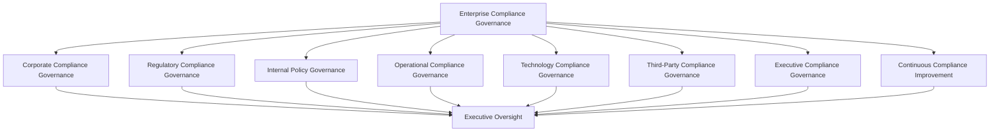
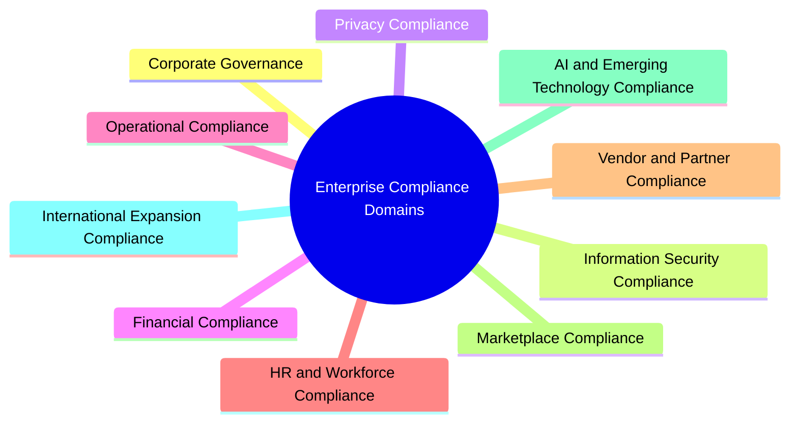
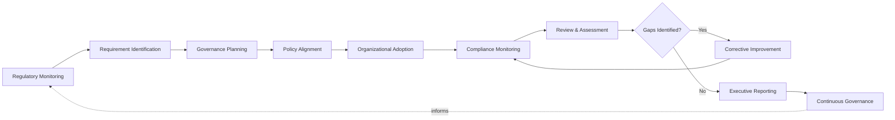
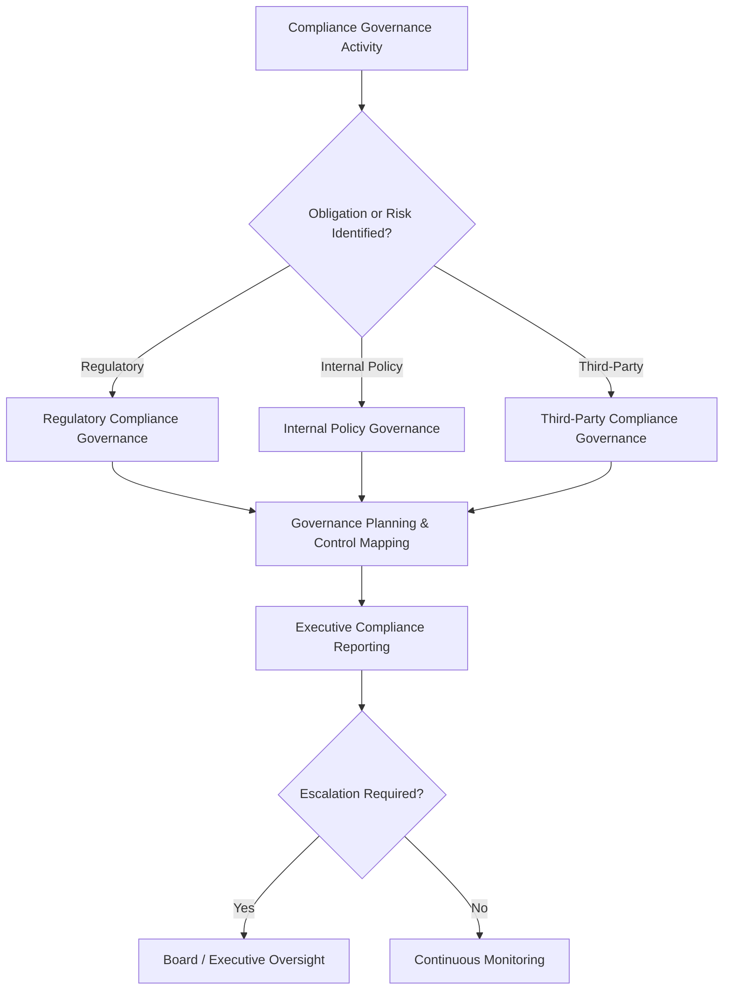
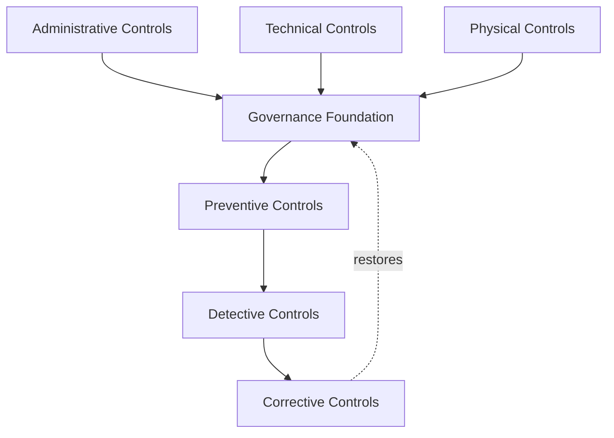
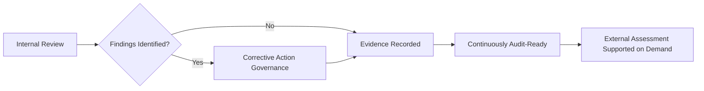
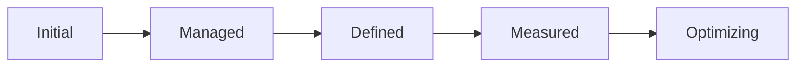
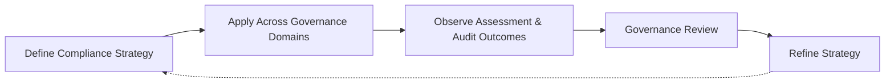
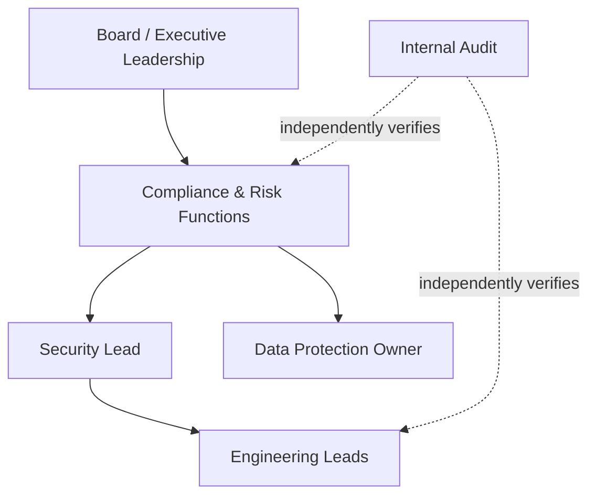

# Compliance & Enterprise Compliance Governance Strategy

## 1. Document Purpose

This document defines the official Enterprise Compliance & Compliance Governance Strategy for **StackLeo Tech Store**. It is the document referenced throughout `06_Security` — including `security-governance.md` (Section 7), `privacy.md` (Section 6), `encryption.md` (Section 8), and `threat-model.md` (Section 10) — as the place applicable legal, regulatory, and contractual obligations are identified, tracked, and mapped to internal practice, and as the enterprise governance layer through which compliance accountability, executive oversight, and compliance culture are established.

- **Purpose of Compliance Governance** — to ensure that StackLeo's obligations to regulators, partners, and enterprise customers are tracked deliberately and mapped to concrete internal practice, and that compliance is governed as a deliberate organizational discipline rather than assumed to be satisfied by good security practice alone.
- **Relationship with Corporate Governance** — compliance governance is a specialized expression of StackLeo's broader corporate governance posture; it does not replace corporate governance but ensures regulatory and ethical obligations are consistently reflected in how the business is directed and controlled.
- **Relationship with Enterprise Risk Management** — compliance risk is treated as a category of business risk, assessed using the same risk philosophy defined in `security-principles.md` (Section 5) and `security-risk-management.md`, not as a separate, parallel risk discipline.
- **Relationship with Information Security** — this document does not redefine security governance; `security-governance.md` governs *how internal security decisions are made and by whom*, while this document governs *how external obligations are identified, tracked, and evidenced*. The two are complementary, not overlapping.
- **Relationship with Internal Controls** — this document categorizes controls conceptually (Section 5) and tracks obligations to them, but the design and operation of specific controls remains owned by the domain document each control belongs to.
- **Relationship with Audit** — this document establishes the audit and assurance governance (Section 6) through which internal and external review of StackLeo's compliance posture is conducted and evidenced.
- **Relationship with Privacy Governance** — this document tracks the specific legal obligations that `privacy.md` deliberately declines to prescribe, keeping privacy philosophy jurisdiction-agnostic while this document absorbs jurisdiction-specific detail.
- **Relationship with Business Strategy** — compliance exists to let StackLeo pursue growth — corporate sales, wholesale, the multi-vendor marketplace, and geographic expansion — with confidence that new obligations are absorbed deliberately rather than discovered after the fact.
- **Relationship with Customer Trust** — a demonstrable, well-governed compliance posture is a trust signal, particularly to enterprise, wholesale, and corporate customers, who bring materially higher due-diligence expectations than individual consumers.

This document is implementation-independent and vendor-neutral. It defines compliance philosophy, governance model, control framework alignment, and audit governance — not specific GRC platforms, audit software, consulting engagements, regulatory filing procedures, or a mandatory list of jurisdiction-specific regulatory obligations, which are identified and tracked operationally under the structure this document defines.

## 2. Compliance Governance Philosophy

| Principle | Business Value |
|---|---|
| **Compliance as Business Enablement** | Compliance exists to let the business grow responsibly — not to obstruct it. A well-governed compliance function is what allows expansion into new markets and business models to proceed with confidence rather than hesitation. |
| **Governance Before Compliance** | Compliance is treated as an extension of the governance discipline defined in `security-governance.md`, not a separate function operating on its own authority. This prevents compliance from becoming disconnected paperwork detached from how the business actually operates. |
| **Accountability** | Every tracked obligation has a specific, named accountable owner, preventing obligations from being satisfied by no one because everyone assumed someone else was responsible. |
| **Ethical Business Conduct** | Compliance is anchored in genuine ethical conduct, not merely the minimum defensible reading of a regulation, building durable trust with customers, partners, and regulators alike. |
| **Risk-Aware Decision Making** | Compliance effort is proportionate to the genuine business and legal consequence of a given obligation, directing limited compliance capacity toward what matters most as the obligation landscape grows. |
| **Governance by Design** | Compliance considerations are built into how policy, controls, and business decisions are made from the outset, rather than checked for after the fact. |
| **Transparency** | Compliance posture is visible to those who need to understand it, including executive leadership and, where appropriate, enterprise customers and partners, building the confidence necessary to close corporate and wholesale relationships that depend on demonstrable compliance maturity. |
| **Continuous Improvement** | This strategy and the obligations it tracks are expected to mature as StackLeo's markets, business model, and regulatory environment evolve, keeping compliance posture current rather than reflecting an earlier, smaller version of the business. |

## 3. Enterprise Compliance Governance Model

### Enterprise Compliance Governance Matrix

| Governance Layer | Purpose | Governance Scope | Business Value | Executive Expectations |
|---|---|---|---|---|
| **Corporate Compliance Governance** | Establishes the overarching accountability structure for compliance across the enterprise. | Enterprise-wide compliance posture, coordinated with corporate governance practice. | Provides a single, coherent compliance umbrella rather than fragmented, function-by-function practice. | Expect a clearly articulated compliance governance framework with named accountability. |
| **Regulatory Compliance Governance** | Governs how applicable regulatory obligations are identified, interpreted, and tracked. | Jurisdiction-specific regulatory obligations relevant to StackLeo's current and future markets. | Reduces regulatory exposure through deliberate obligation tracking. | Expect confidence that applicable regulation is actively monitored, not assumed satisfied. |
| **Internal Policy Governance** | Governs how obligations translate into concrete internal policy. | Policy development and alignment, coordinated with `security-governance.md`. | Ensures obligations become actionable practice, not merely acknowledged text. | Expect policy to visibly trace back to a specific tracked obligation or business rationale. |
| **Operational Compliance Governance** | Governs obligations satisfied through sustained day-to-day operation. | Ongoing operational practice coordinated with `security-monitoring.md` and `incident-response.md`. | Ensures obligations requiring continuous discipline are not treated as one-time checklist items. | Expect operational compliance to be sustained, not merely demonstrated at audit time. |
| **Technology Compliance Governance** | Governs obligations relating to how technology and platform capability satisfy compliance requirements. | Technical and preventive controls across `06_Security` domain documents. | Ensures technology decisions consider compliance consequence from the outset. | Expect technology compliance to be a design input, not a retrofit. |
| **Third-Party Compliance Governance** | Governs obligations relating to vendors, partners, and marketplace participants. | Trust boundaries defined in `threat-model.md` and `security-architecture.md`. | Ensures StackLeo's compliance posture is not undermined by the weakest party it extends trust to. | Expect third-party compliance expectations proportionate to the access and data each party is granted. |
| **Executive Compliance Governance** | Governs the executive-level accountability and reporting structure for compliance. | Executive reporting, review cadence, and ultimate accountability. | Keeps compliance a visible, actively managed board- and executive-level concern. | Expect regular, substantive compliance reporting at the executive level. |
| **Continuous Compliance Improvement** | Governs how the compliance governance framework itself evolves over time. | Governance review cadence, lessons learned, and framework refinement. | Keeps compliance governance relevant as the business, markets, and regulatory landscape grow. | Expect periodic evidence that the framework itself is being actively improved. |

*Diagram 1: Enterprise Compliance Governance Framework.*

## 4. Enterprise Compliance Domains

### Enterprise Compliance Domain Matrix

| Domain | Purpose | Governance Scope | Business Importance | Executive Expectations |
|---|---|---|---|---|
| **Corporate Governance** | Ensures compliance obligations are reflected in how the business is directed and controlled. | Board- and executive-level governance structures. | Establishes the foundation all other compliance domains build on. | Expect corporate governance and compliance governance to be visibly connected. |
| **Information Security Compliance** | Tracks obligations relating to security policy, controls, and practice. | `security-governance.md` and the broader `06_Security` domain set. | Enterprise customers increasingly expect demonstrable, documented security governance. | Expect security compliance to be evidenced, not merely asserted. |
| **Privacy Compliance** | Tracks jurisdiction-specific privacy and data protection obligations. | Obligations layered beneath the jurisdiction-agnostic philosophy in `privacy.md`. | Protects StackLeo from reputational and regulatory consequences of privacy non-compliance. | Expect privacy compliance to be coordinated directly with `privacy.md`. |
| **Financial Compliance** | Tracks obligations relating to payments, taxation, and financial reporting. | Financial recordkeeping and transaction-handling obligations. | Directly affects financial integrity and stakeholder trust. | Expect financial compliance to receive the highest governance rigor. |
| **Operational Compliance** | Tracks obligations relating to how the platform is operated day to day. | Operational security practice defined in `security-monitoring.md` and `incident-response.md`. | Many obligations are satisfied only through sustained, ongoing operational discipline. | Expect operational compliance to be continuously demonstrated. |
| **HR & Workforce Compliance** | Tracks obligations relating to employment and workforce practice. | Workforce-related obligations coordinated with People leadership. | Supports fair, legally sound workforce management. | Expect workforce compliance to be proactively, not reactively, managed. |
| **Vendor & Partner Compliance** | Tracks obligations relating to vendors, partners, and service providers. | Third-party trust boundaries defined in `threat-model.md`. | StackLeo's compliance posture is only as strong as its weakest external party. | Expect vendor and partner compliance expectations to scale with access granted. |
| **Marketplace Compliance** | Tracks obligations specific to the multi-vendor marketplace model. | Seller-specific obligations layered onto the existing Third-Party Governance structure. | Supports trustworthy marketplace growth as sellers onboard. | Expect marketplace compliance to be addressed proactively as the marketplace launches. |
| **AI & Emerging Technology Compliance** | Tracks obligations relating to AI-assisted capability and emerging technology adoption. | Obligations applicable to automated and AI-assisted decision-making. | Increasingly scrutinized area as AI capability grows in the business. | Expect proactive governance attention to this domain rather than retroactive correction. |
| **International Expansion Compliance** | Tracks obligations arising as StackLeo expands into new markets. | Region-specific obligations identified as each market activates. | Enables sustainable regional and global growth. | Expect a defined process for identifying new obligations as each market activates. |

*Diagram: Enterprise Compliance Domain Overview.*

## 5. Enterprise Compliance Lifecycle

### Compliance Lifecycle Matrix

| Stage | Purpose | Governance Objectives | Business Value |
|---|---|---|---|
| **Regulatory Monitoring** | Maintains ongoing awareness of the regulatory landscape relevant to StackLeo's markets. | Ensure new or changing obligations are identified proactively. | Prevents obligations from being discovered only after non-compliance occurs. |
| **Requirement Identification** | Determines which obligations are genuinely applicable to current or near-term business activity. | Connect obligation scope directly to the business model and markets defined in `01_Business`. | Directs compliance effort at genuinely applicable obligations. |
| **Governance Planning** | Determines how an applicable obligation will be governed and by whom. | Assign clear accountability before implementation begins. | Prevents obligations from being addressed ad hoc. |
| **Policy Alignment** | Translates an obligation into concrete internal policy. | Ensure every new policy follows the Governance Lifecycle defined in `security-governance.md`. | Ensures obligations become actionable practice, not merely acknowledged text. |
| **Organizational Adoption** | Ensures policy and practice are genuinely adopted across the organization. | Confirm adoption, not merely documentation. | Closes the gap between a policy existing and a policy being followed. |
| **Compliance Monitoring** | Sustains ongoing awareness of whether practice continues to satisfy tracked obligations. | Coordinate with domain-specific monitoring practice in `security-monitoring.md`. | Reduces the risk of a compliance gap emerging unnoticed. |
| **Review & Assessment** | Formally evaluates whether current practice genuinely satisfies tracked obligations. | Assess on a defined cadence and whenever a relevant obligation or business activity changes. | Surfaces gaps proactively, before external discovery. |
| **Corrective Improvement** | Addresses gaps identified through monitoring, review, or audit. | Track corrective actions to completion through an owned process. | Prevents identified gaps from persisting indefinitely. |
| **Executive Reporting** | Communicates compliance posture to executive leadership. | Provide regular, substantive reporting consistent with Section 8. | Keeps compliance a visible, actively managed concern. |
| **Continuous Governance** | Reassesses the coherence and effectiveness of this compliance strategy itself. | Feed lessons learned back into the strategy. | Prevents the compliance function from becoming stale relative to a changing landscape. |

*Diagram 2: Enterprise Compliance Lifecycle.*

## 6. Compliance Governance Principles

### Compliance Governance Principles Matrix

| Principle | Explanation |
|---|---|
| **Accountability** | Every tracked obligation and control has a specific, named accountable owner. |
| **Transparency** | Compliance posture is visible to those who genuinely need to understand it. |
| **Ethical Conduct** | Compliance decisions are grounded in genuine ethical conduct, not the minimum defensible reading of an obligation. |
| **Traceability** | Compliance decisions can be traced back to the obligation and rationale that informed them. |
| **Auditability** | The organization can demonstrate, on request, how a given obligation is tracked and satisfied. |
| **Regulatory Awareness** | Compliance governance remains actively aware of the regulatory landscape relevant to StackLeo's markets. |
| **Business Alignment** | Compliance effort remains connected to genuine business activity and risk, not applied as a generic, undifferentiated exercise. |
| **Continuous Improvement** | Compliance governance practice is periodically reassessed and refined. |

## 7. Compliance Accountability

### Compliance Accountability Matrix

| Accountability Layer | Governance Objective | Business Value |
|---|---|---|
| **Board Oversight** | Ensure ultimate compliance accountability is recognized at the highest governance level. | Establishes compliance as a genuine governance priority, not a delegated afterthought. |
| **Executive Leadership** | Ensure executive leadership resources compliance and accepts residual compliance risk. | Connects compliance accountability to genuine organizational authority. |
| **Business Units** | Ensure business units understand and apply compliance obligations relevant to their activity. | Embeds compliance into how the business actually operates, not a separate overlay. |
| **Risk Functions** | Ensure compliance risk is assessed consistently with the organization's broader risk practice. | Prevents compliance risk from being treated as a separate, disconnected risk category. |
| **Compliance Functions** | Own the coherence and currency of tracked obligations and this governance framework. | Provides a clear, dedicated point of accountability for compliance posture. |
| **Technology Leadership** | Ensure technology decisions account for compliance consequence. | Prevents compliance gaps introduced through unreviewed technical decisions. |
| **Employees** | Ensure the broader workforce understands and follows adopted compliance policy. | Compliance ultimately depends on consistent day-to-day behavior, not policy alone. |
| **Independent Assurance** | Ensure an independent function verifies that tracked obligations and controls reflect actual practice. | Provides credible, unbiased confirmation of compliance posture. |

This section addresses compliance accountability from a governance-objective perspective; specific organizational structures and reporting lines remain a matter of internal organizational design.

## 8. Executive Oversight

### Executive Oversight Matrix

| Oversight Activity | Purpose |
|---|---|
| **Executive Compliance Reviews** | Confirm the overall compliance governance framework remains coherent and effective. |
| **Compliance Reporting** | Provide leadership with visibility into the state of enterprise compliance posture. |
| **Regulatory Reviews** | Assess emerging or changing regulatory obligations relevant to StackLeo's markets. |
| **Governance Reviews** | Confirm compliance governance remains aligned with the broader enterprise governance model. |
| **Documentation Governance** | Confirm compliance governance documentation remains current and accurate. |
| **Audit Readiness** | Confirm the organization is prepared to demonstrate its compliance governance on request. |

*Diagram 3: Compliance Governance Decision Model.*

## 9. Control Framework Alignment

Controls are described conceptually, categorized by nature, without prescribing a specific control catalog or implementation method.

- **Administrative Controls** — policies, roles, and decision processes that govern human behavior, exemplified by the governance structure in `security-governance.md` (Section 4). *Purpose:* ensure people, not only systems, act consistently with obligations. *Governance expectations:* owned jointly by Security and People leadership.
- **Technical Controls** — mechanisms enforced through the platform itself, exemplified by the encryption and access principles in `encryption.md` and `authorization.md`. *Purpose:* enforce obligations automatically and consistently, independent of individual diligence. *Governance expectations:* owned by Engineering, verified by Security.
- **Physical Controls** — protections governing physical access to facilities and equipment, relevant as StackLeo's future physical store and POS channels introduce a physical dimension. *Purpose:* protect against threats that exist outside the digital boundary alone. *Governance expectations:* owned jointly with Operations as physical channels are introduced.
- **Detective Controls** — mechanisms that surface when something has gone wrong, exemplified by `security-monitoring.md`. *Purpose:* ensure control failures are discovered promptly, not silently. *Governance expectations:* owned by Security Operations.
- **Preventive Controls** — mechanisms that reduce the likelihood a threat or violation occurs in the first place, exemplified by the design principles in `application-security.md` (Section 5). *Purpose:* stop avoidable violations before they happen. *Governance expectations:* owned by Engineering and Security jointly.
- **Corrective Controls** — mechanisms that restore compliant, secure state once a deviation is detected, exemplified by `incident-response.md`. *Purpose:* limit the duration and impact of a control failure once discovered. *Governance expectations:* owned by the domain accountable for the affected control.

*Diagram: Governance & Control Framework.*

### Control Framework Matrix

| Control Type | Purpose | Governance Expectation |
|---|---|---|
| Administrative Controls | Govern consistent human behavior | Owned jointly by Security and People leadership |
| Technical Controls | Enforce obligations automatically via the platform | Owned by Engineering, verified by Security |
| Physical Controls | Protect physical facilities and equipment | Owned jointly with Operations as physical channels launch |
| Detective Controls | Surface control failures promptly | Owned by Security Operations |
| Preventive Controls | Reduce likelihood of violation occurring | Owned by Engineering and Security jointly |
| Corrective Controls | Restore compliant state after deviation | Owned by the domain accountable for the affected control |

## 10. Audit & Assurance Governance

This section addresses the audit and assurance practice directly supporting compliance obligation tracking. `audit-governance.md` establishes the enterprise-wide audit governance framework — independence, planning, domains, and lifecycle — this practice operates within.

- **Internal Reviews** — StackLeo periodically reviews its own compliance posture against tracked obligations, independent of any external request.
- **External Assessments** — where a partner, customer, or regulator requires external assessment, it is supported by the evidence and documentation this framework maintains continuously, not assembled reactively.
- **Evidence Management** — records supporting compliance claims — control implementation, review outcomes, corrective actions — are retained and organized consistently with `security-principles.md` (Section 9) and `data-retention.md`.
- **Documentation Alignment** — this document remains consistent with `security-governance.md`, `privacy.md`, `data-protection.md`, and every domain document it references, updated as those evolve.
- **Corrective Action Governance** — findings from any review or assessment are tracked to resolution through a defined, owned process, not left open indefinitely.
- **Continuous Assurance** — confidence in compliance posture is sustained through the ongoing lifecycle in Section 5, not re-established only when an assessment is imminent.

*Diagram: Audit and Assurance Process.*

### Audit & Assurance Matrix

| Practice | Focus | Business Value |
|---|---|---|
| Internal Reviews | Periodic self-assessment independent of external request | Surfaces gaps proactively, on StackLeo's own terms |
| External Assessments | Support for partner, customer, or regulator review | Avoids reactive, last-minute evidence assembly |
| Evidence Management | Consistent retention of supporting records | Makes compliance claims demonstrable, not assumed |
| Documentation Alignment | Consistency with related governance documents | Prevents contradictory or stale guidance |
| Corrective Action Governance | Findings tracked to resolution through an owned process | Prevents identified gaps from persisting indefinitely |
| Continuous Assurance | Confidence sustained continuously, not only pre-audit | Reduces risk of surprise during an actual assessment |

## 11. Future Readiness

| Future Direction | Readiness Consideration |
|---|---|
| **AI Governance** | AI-assisted capability is subject to the same control mapping and assessment practice as any other system component, with no reduced scrutiny on the basis of automation. |
| **Digital Regulations** | Regulatory Monitoring (Section 5) is the deliberate mechanism through which emerging digital-economy regulation is identified as it becomes relevant. |
| **Cross-Border Compliance** | This framework remains jurisdiction-agnostic; specific regulatory regimes are layered on as applicable obligations rather than baked into the framework's structure. |
| **Multi-Tenant Platforms** | Control framework alignment extends to enforce and evidence tenant isolation as the marketplace introduces multiple independent seller contexts. |
| **Global Expansion** | Governance Planning (Section 5) is the deliberate mechanism through which region-specific obligations are identified as StackLeo expands. |
| **ESG & Sustainability Expectations** | The governance model (Section 3) is structured to absorb ESG-related obligations as an additional compliance domain without requiring redesign. |
| **Enterprise Scale** | Ensures the governance framework remains coherent as obligation volume and diversity grow substantially. |
| **Evolving Regulatory Landscape** | Continuous Compliance Improvement (Section 3) ensures the framework itself adapts as the regulatory landscape evolves. |

## 12. Compliance Governance Maturity Model

### Compliance Governance Maturity Model Matrix

| Level | Characteristics |
|---|---|
| **Initial** | Compliance activity is ad hoc, reactive, and largely undocumented, with obligations addressed only as they surface. |
| **Managed** | Core obligations have identified owners and basic tracking practice, though governance is still largely reactive. |
| **Defined** | A documented, organization-wide compliance governance framework exists and is consistently applied across domains. |
| **Measured** | Compliance governance effectiveness is actively monitored, with visibility into obligation status, findings, and review cadence. |
| **Optimizing** | Compliance governance is continuously refined based on organizational learning, regulatory evolution, and business growth. |

*Diagram 6: Compliance Governance Maturity Progression Model.*

## 13. Governance

- **Ownership** — Compliance & Risk Functions, referenced in `security-governance.md` (Section 4), own the coherence and currency of this document, coordinated with the Security Lead.
- **Review Process** — this strategy and its tracked obligations are reviewed on a defined cadence and whenever new markets, business models, or significant regulatory change occur.
- **Compliance Policies** — operational compliance policies are derived from this framework and maintained consistently with `security-governance.md`.
- **Audit Readiness** — this framework's own effectiveness, not only the obligations it tracks, is subject to periodic internal review.
- **Continuous Improvement** — this strategy is expected to mature as StackLeo's markets, business model, and regulatory environment evolve.

*Diagram 5: Continuous Compliance Improvement Cycle.*

### Governance Responsibility Matrix

| Role | Responsibility |
|---|---|
| Board / Executive Leadership | Accountable for resourcing compliance and accepting residual compliance risk at the highest level. |
| Compliance & Risk Functions | Own coherence and currency of this framework; track applicable obligations. |
| Security Lead | Ensures this framework remains consistent with `security-governance.md` and the broader `06_Security` strategy set. |
| Data Protection Owner | Ensures data and privacy obligations tracked here remain consistent with `data-protection.md` and `privacy.md`. |
| Engineering Leads | Implement and maintain technical and preventive controls mapped to tracked obligations. |
| Internal Audit / Independent Assurance | Independently verifies tracked obligations and controls match actual practice. |

*Diagram 4: Enterprise Compliance Operating Model.*

## 14. Anti-Patterns

### Anti-Pattern Summary

| Anti-Pattern | Why It Must Be Avoided |
|---|---|
| **Compliance Without Governance** | Treating compliance as a checklist of regulatory requirements, disconnected from the governance structure in `security-governance.md`, leaves gaps wherever regulation is silent or ambiguous. |
| **Reactive Compliance** | Preparing for external assessment only once one is imminent contradicts the continuously audit-ready posture this framework is designed to sustain. |
| **Unknown Accountability** | Leaving tracked obligations without a clearly accountable owner causes obligations to go unsatisfied because everyone assumed someone else was responsible. |
| **Policy Without Adoption** | Publishing policy that is never genuinely adopted across the organization closes no real compliance gap. |
| **Weak Documentation** | Allowing obligation tracking or control mapping to go undocumented makes compliance posture impossible to demonstrate consistently. |
| **Poor Executive Visibility** | Without executive oversight, compliance governance drifts from a strategic discipline into an unmonitored operational afterthought. |
| **Siloed Compliance** | Allowing compliance to operate disconnected from the security governance structure produces duplicated, potentially contradictory decision-making. |
| **Missing Continuous Improvement** | Treating the current obligation list as permanently complete guarantees the framework falls behind as StackLeo's markets and business model expand. |

## 15. Document Information

| Property | Value |
|----------|-------|
| Document | compliance.md |
| Version | 1.1.0 |
| Status | Active |
| Maintained By | StackLeo |
| Last Updated | 2026-07-27 |

---

© StackLeo. All Rights Reserved.
