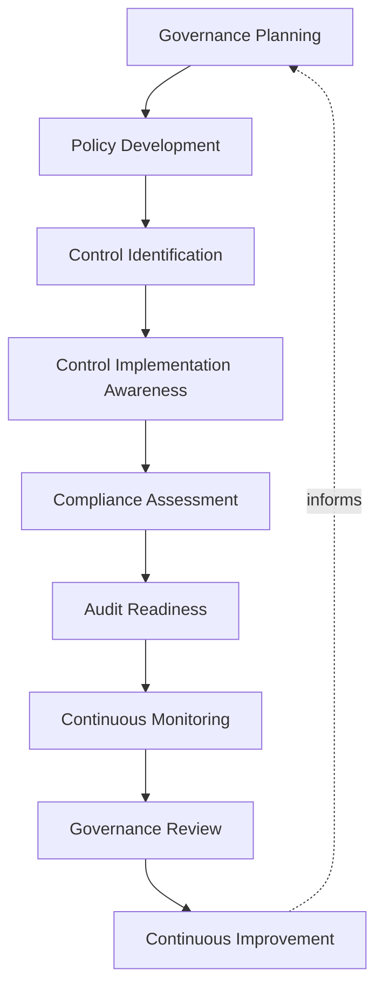
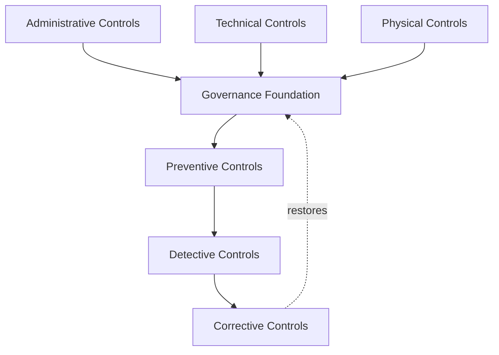
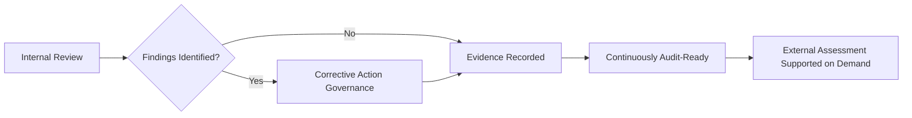
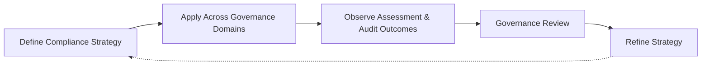
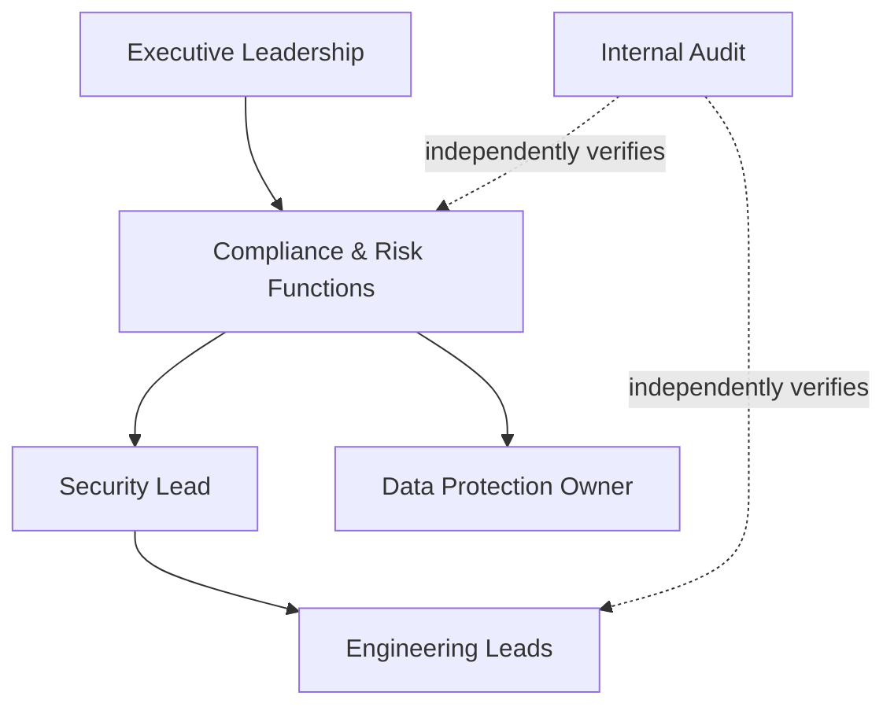

# Compliance

## 1. Document Purpose

This document defines the official Enterprise Compliance & Control Framework Strategy for **StackLeo Tech Store**. It is the document referenced throughout `06_Security` — including `security-governance.md` (Section 7), `privacy.md` (Section 6), `encryption.md` (Section 8), and `threat-model.md` (Section 10) — as the place applicable legal, regulatory, and contractual obligations are identified, tracked, and mapped to internal practice.

- **Purpose of Compliance Governance** — to ensure that StackLeo's obligations to regulators, partners, and enterprise customers are tracked deliberately and mapped to concrete internal practice, rather than assumed to be satisfied by good security practice alone.
- **Relationship with Enterprise Security** — this document does not redefine security governance; `security-governance.md` governs *how internal security decisions are made and by whom*, while this document governs *how external obligations are identified, tracked, and evidenced*. The two are complementary, not overlapping.
- **Relationship with Risk Management** — compliance risk is treated as a category of business risk, assessed using the same risk philosophy defined in `security-principles.md` (Section 5), not as a separate, parallel risk discipline.
- **Relationship with Privacy Governance** — this document tracks the specific legal obligations that `privacy.md` deliberately declines to prescribe, keeping privacy philosophy jurisdiction-agnostic while this document absorbs jurisdiction-specific detail.
- **Relationship with Business Strategy** — compliance exists to let StackLeo pursue growth — corporate sales, wholesale, the multi-vendor marketplace, and geographic expansion — with confidence that new obligations are absorbed deliberately rather than discovered after the fact.
- **Relationship with Customer Trust** — a demonstrable, well-governed compliance posture is a trust signal, particularly to enterprise, wholesale, and corporate customers, who bring materially higher due-diligence expectations than individual consumers.

This document is implementation-independent and vendor-neutral. It defines compliance philosophy, control framework alignment, and audit governance — not specific GRC platforms, audit software, consulting engagements, or a mandatory list of jurisdiction-specific regulatory obligations, which are identified and tracked operationally under the structure this document defines.

## 2. Compliance Governance Philosophy

- **Governance First** — compliance is treated as an extension of the governance discipline defined in `security-governance.md`, not a separate function operating on its own authority. *Business value:* prevents compliance from becoming disconnected paperwork detached from how the business actually operates.
- **Accountability** — every tracked obligation has a specific, named accountable owner. *Business value:* prevents obligations from being satisfied by no one because everyone assumed someone else was responsible.
- **Transparency** — compliance posture is visible to those who need to understand it, including executive leadership and, where appropriate, enterprise customers and partners. *Business value:* builds the confidence necessary to close corporate and wholesale relationships that depend on demonstrable compliance maturity.
- **Risk-Based Compliance** — compliance effort is proportionate to the genuine business and legal consequence of a given obligation, not applied uniformly regardless of stakes. *Business value:* directs limited compliance capacity toward what matters most as the obligation landscape grows.
- **Continuous Assurance** — confidence that controls are functioning as intended is sustained through ongoing verification, not established once at audit time and assumed to persist. *Business value:* reduces the likelihood of an unpleasant surprise during an actual external assessment.
- **Continuous Improvement** — this strategy and the obligations it tracks are expected to mature as StackLeo's markets, business model, and regulatory environment evolve. *Business value:* keeps compliance posture current rather than reflecting an earlier, smaller version of the business.
- **Business Enablement** — compliance exists to let the business grow responsibly, not to obstruct it; a well-governed compliance function is what allows expansion into new markets and business models to proceed with confidence rather than hesitation.

## 3. Compliance Governance Lifecycle

### Governance Planning

- **Purpose** — determine the scope of compliance obligations relevant to StackLeo's current and near-term business activity.
- **Business Value** — ensures compliance effort is directed at genuinely applicable obligations, not a generic, undifferentiated list.
- **Governance Objectives** — connect obligation scope directly to the business model and markets defined in `01_Business`.

### Policy Development

- **Purpose** — translate an applicable obligation into concrete internal policy, coordinated with the relevant domain document in `06_Security`.
- **Business Value** — ensures obligations become actionable practice, not merely acknowledged text.
- **Governance Objectives** — every new policy follows the Governance Lifecycle defined in `security-governance.md` (Section 9).

### Control Identification

- **Purpose** — determine which internal controls, existing or new, address a given obligation.
- **Business Value** — avoids duplicating control effort that already exists elsewhere in `06_Security`.
- **Governance Objectives** — map every tracked obligation to one or more controls defined in Section 5.

### Control Implementation Awareness

- **Purpose** — confirm that identified controls are genuinely in place and operating, not merely documented as intended.
- **Business Value** — closes the gap between a control existing on paper and a control genuinely protecting the business.
- **Governance Objectives** — coordinate implementation confirmation with the domain owner accountable for the control.

### Compliance Assessment

- **Purpose** — evaluate whether current practice genuinely satisfies a tracked obligation.
- **Business Value** — surfaces gaps proactively, before they are discovered by a regulator, partner, or auditor.
- **Governance Objectives** — assessment occurs on a defined cadence and whenever a relevant obligation or business activity changes.

### Audit Readiness

- **Purpose** — maintain evidence and documentation in a state that supports internal or external review at any time.
- **Business Value** — avoids the cost and disruption of reactive, last-minute evidence assembly.
- **Governance Objectives** — connect audit readiness directly to the Evidence Management practice in Section 6.

### Continuous Monitoring

- **Purpose** — sustain ongoing awareness of whether controls remain effective between formal assessments.
- **Business Value** — reduces the risk of a control silently degrading unnoticed between review points.
- **Governance Objectives** — coordinated with the domain-specific monitoring practice defined in `security-monitoring.md`.

### Governance Review

- **Purpose** — periodically reassess the coherence and effectiveness of this compliance strategy itself.
- **Business Value** — prevents the compliance function from becoming stale relative to a changing obligation landscape.
- **Governance Objectives** — reviewed on the cadence defined in `security-governance.md` (Section 9).

### Continuous Improvement

- **Purpose** — feed findings from assessment, audit, and monitoring back into policy and control design.
- **Business Value** — turns every review and audit into a source of genuine improvement, not merely a pass/fail event.
- **Governance Objectives** — improvement actions are tracked to completion, consistent with Corrective Action Governance in Section 6.

*Diagram 1: Enterprise Compliance Governance Lifecycle — obligation scope is planned and translated into policy and controls, confirmed as implemented, assessed, kept audit-ready, and continuously monitored, with governance review driving continuous improvement.*

### Compliance Governance Lifecycle Matrix

| Stage | Purpose | Business Value |
|---|---|---|
| Governance Planning | Determine scope of applicable obligations | Directs effort at genuinely applicable obligations |
| Policy Development | Translate obligations into concrete internal policy | Ensures obligations become actionable practice |
| Control Identification | Map obligations to existing or new controls | Avoids duplicating control effort |
| Control Implementation Awareness | Confirm controls are genuinely operating | Closes gap between documented and genuine protection |
| Compliance Assessment | Evaluate whether practice satisfies obligations | Surfaces gaps before external discovery |
| Audit Readiness | Maintain evidence supporting review at any time | Avoids reactive, last-minute evidence assembly |
| Continuous Monitoring | Sustain awareness between formal assessments | Reduces risk of silently degrading controls |
| Governance Review | Reassess this strategy's own coherence | Prevents the compliance function from becoming stale |
| Continuous Improvement | Feed findings back into policy and control design | Turns reviews and audits into genuine improvement |

## 4. Governance Domains

### Security Policy Governance

- **Purpose** — track obligations relating to how security policy itself is governed.
- **Scope** — the governance structure and decision-making framework defined in `security-governance.md`.
- **Governance Expectations** — this document tracks obligations; `security-governance.md` remains authoritative for how policy is governed internally.
- **Business Importance** — enterprise customers and partners increasingly expect demonstrable, documented security governance as a condition of doing business.

### Risk Governance

- **Purpose** — track obligations relating to how business and security risk is identified and managed.
- **Scope** — the risk philosophy defined in `security-principles.md` (Section 5).
- **Governance Expectations** — obligation-driven risk considerations are absorbed into existing risk assessment practice, not tracked separately.
- **Business Importance** — demonstrates that compliance risk is managed with the same rigor as any other business risk.

### Privacy Governance

- **Purpose** — track the specific legal and regulatory privacy obligations applicable to StackLeo's markets.
- **Scope** — jurisdiction-specific detail beneath the jurisdiction-agnostic philosophy in `privacy.md`.
- **Governance Expectations** — coordinated directly with `privacy.md`, which remains authoritative for privacy philosophy and lifecycle.
- **Business Importance** — protects StackLeo from the reputational and regulatory consequence of privacy non-compliance.

### Data Governance

- **Purpose** — track obligations relating to data classification, protection, and residency.
- **Scope** — obligations layered beneath `data-protection.md` and `encryption.md`.
- **Governance Expectations** — coordinated with the Data Protection Owner referenced in `data-protection.md`.
- **Business Importance** — data-handling obligations are among the most consequential and closely scrutinized by enterprise customers.

### Third-Party Governance

- **Purpose** — track obligations relating to vendors, partners, and future marketplace sellers.
- **Scope** — the trust boundaries defined in `threat-model.md` (Section 6) and `security-architecture.md` (Section 4).
- **Governance Expectations** — third-party compliance expectations are proportionate to the access and data a given party is granted.
- **Business Importance** — StackLeo's compliance posture is only as strong as the weakest party it extends trust to.

### Operational Governance

- **Purpose** — track obligations relating to how the platform is operated day to day.
- **Scope** — operational security practice defined in `security-monitoring.md` and `incident-response.md`.
- **Governance Expectations** — coordinated with Operations Teams, consistent with `security-governance.md` (Section 4).
- **Business Importance** — many obligations are satisfied only through sustained, ongoing operational discipline, not a one-time control.

### Audit Governance

- **Purpose** — track obligations relating to internal and external review of StackLeo's compliance posture.
- **Scope** — the audit and assurance practice defined in Section 6.
- **Governance Expectations** — audit governance is a distinct, deliberately resourced discipline, not an afterthought performed only when requested.
- **Business Importance** — audit readiness directly determines how quickly StackLeo can respond to a customer's or regulator's due-diligence request.

### Documentation Governance

- **Purpose** — track obligations relating to what must be documented, retained, and made available for review.
- **Scope** — documentation standards across every domain in `06_Security`.
- **Governance Expectations** — documentation obligations are satisfied as a natural byproduct of following existing governance practice, not a separate paperwork exercise.
- **Business Importance** — undocumented compliance is, in practice, indistinguishable from no compliance during an actual review.

### Governance Domain Matrix

| Domain | Purpose | Primary Related Document |
|---|---|---|
| Security Policy Governance | Track obligations for how policy itself is governed | `security-governance.md` |
| Risk Governance | Track obligations for risk identification and management | `security-principles.md` |
| Privacy Governance | Track jurisdiction-specific privacy obligations | `privacy.md` |
| Data Governance | Track data classification, protection, and residency obligations | `data-protection.md`, `encryption.md` |
| Third-Party Governance | Track obligations relating to vendors and partners | `threat-model.md`, `security-architecture.md` |
| Operational Governance | Track obligations satisfied through ongoing operation | `security-monitoring.md`, `incident-response.md` |
| Audit Governance | Track obligations relating to review of compliance posture | Section 6 (this document) |
| Documentation Governance | Track what must be documented and retained | All `06_Security` documents |

## 5. Control Framework Alignment

Controls are described conceptually, categorized by nature, without prescribing a specific control catalog or implementation method.

- **Administrative Controls** — policies, roles, and decision processes that govern human behavior, exemplified by the governance structure in `security-governance.md` (Section 4). *Purpose:* ensure people, not only systems, act consistently with obligations. *Governance expectations:* owned jointly by Security and People leadership.
- **Technical Controls** — mechanisms enforced through the platform itself, exemplified by the encryption and access principles in `encryption.md` and `authorization.md`. *Purpose:* enforce obligations automatically and consistently, independent of individual diligence. *Governance expectations:* owned by Engineering, verified by Security.
- **Physical Controls** — protections governing physical access to facilities and equipment, relevant as StackLeo's future physical store and POS channels introduce a physical dimension. *Purpose:* protect against threats that exist outside the digital boundary alone. *Governance expectations:* owned jointly with Operations as physical channels are introduced.
- **Detective Controls** — mechanisms that surface when something has gone wrong, exemplified by `security-monitoring.md`. *Purpose:* ensure control failures are discovered promptly, not silently. *Governance expectations:* owned by Security Operations.
- **Preventive Controls** — mechanisms that reduce the likelihood a threat or violation occurs in the first place, exemplified by the design principles in `application-security.md` (Section 5). *Purpose:* stop avoidable violations before they happen. *Governance expectations:* owned by Engineering and Security jointly.
- **Corrective Controls** — mechanisms that restore compliant, secure state once a deviation is detected, exemplified by `incident-response.md`. *Purpose:* limit the duration and impact of a control failure once discovered. *Governance expectations:* owned by the domain accountable for the affected control.

*Diagram 2: Governance & Control Framework — administrative, technical, and physical controls form the governance foundation that preventive controls build on, with detective controls surfacing deviation and corrective controls restoring compliant state.*

### Control Framework Matrix

| Control Type | Purpose | Governance Expectation |
|---|---|---|
| Administrative Controls | Govern consistent human behavior | Owned jointly by Security and People leadership |
| Technical Controls | Enforce obligations automatically via the platform | Owned by Engineering, verified by Security |
| Physical Controls | Protect physical facilities and equipment | Owned jointly with Operations as physical channels launch |
| Detective Controls | Surface control failures promptly | Owned by Security Operations |
| Preventive Controls | Reduce likelihood of violation occurring | Owned by Engineering and Security jointly |
| Corrective Controls | Restore compliant state after deviation | Owned by the domain accountable for the affected control |

## 6. Audit & Assurance Governance

- **Internal Reviews** — StackLeo periodically reviews its own compliance posture against tracked obligations, independent of any external request.
- **External Assessments** — where a partner, customer, or regulator requires external assessment, it is supported by the evidence and documentation this framework maintains continuously, not assembled reactively.
- **Evidence Management** — records supporting compliance claims — control implementation, review outcomes, corrective actions — are retained and organized consistently with `security-principles.md` (Section 9).
- **Documentation Alignment** — this document remains consistent with `security-governance.md`, `privacy.md`, `data-protection.md`, and every domain document it references, updated as those evolve.
- **Corrective Action Governance** — findings from any review or assessment are tracked to resolution through a defined, owned process, not left open indefinitely.
- **Continuous Assurance** — confidence in compliance posture is sustained through the ongoing lifecycle in Section 3, not re-established only when an assessment is imminent.

*Diagram 3: Audit and Assurance Process — internal review identifies findings that are tracked to resolution, with evidence recorded continuously so external assessment can be supported on demand rather than assembled reactively.*

### Audit & Assurance Matrix

| Practice | Focus | Business Value |
|---|---|---|
| Internal Reviews | Periodic self-assessment independent of external request | Surfaces gaps proactively, on StackLeo's own terms |
| External Assessments | Support for partner, customer, or regulator review | Avoids reactive, last-minute evidence assembly |
| Evidence Management | Consistent retention of supporting records | Makes compliance claims demonstrable, not assumed |
| Documentation Alignment | Consistency with related governance documents | Prevents contradictory or stale guidance |
| Corrective Action Governance | Findings tracked to resolution through an owned process | Prevents identified gaps from persisting indefinitely |
| Continuous Assurance | Confidence sustained continuously, not only pre-audit | Reduces risk of surprise during an actual assessment |

## 7. Future Readiness

- **Cloud-Native Platforms** — control framework alignment (Section 5) is defined independent of any specific provider, allowing adoption of elastic, provider-hosted infrastructure without redefining this strategy.
- **AI Systems** — AI-assisted capability is subject to the same control mapping and assessment practice as any other system component, with no reduced scrutiny on the basis of automation.
- **Marketplace Platform** — Third-Party Governance (Section 4) is already structured to absorb seller-specific obligations as the marketplace launches, without redefining the underlying framework.
- **Multi-Tenant Architecture** — control framework alignment extends to enforce and evidence tenant isolation as the marketplace introduces multiple independent seller contexts.
- **Multi-Region Operations** — Governance Planning (Section 3) is the deliberate mechanism through which region-specific obligations are identified as StackLeo expands, without requiring this framework itself to change.
- **Global Compliance Programs** — this framework remains jurisdiction-agnostic; specific regulatory regimes are layered on as applicable obligations rather than baked into the framework's structure.
- **Global Engineering Teams** — compliance governance remains independent of contributor or operator location, supporting distributed teams working under a consistent obligation-tracking structure.

## 8. Governance

- **Ownership** — Compliance & Risk Functions, referenced in `security-governance.md` (Section 4), own the coherence and currency of this document, coordinated with the Security Lead.
- **Review Process** — this strategy and its tracked obligations are reviewed on a defined cadence and whenever new markets, business models, or significant regulatory change occur.
- **Compliance Policies** — operational compliance policies are derived from this framework and maintained consistently with `security-governance.md`.
- **Audit Readiness** — this framework's own effectiveness, not only the obligations it tracks, is subject to periodic internal review.
- **Continuous Improvement** — this strategy is expected to mature as StackLeo's markets, business model, and regulatory environment evolve.

*Diagram 5: Continuous Compliance Improvement Cycle — strategy is applied across every governance domain, its assessment and audit outcomes observed, reviewed by governance, and refined, with refinements feeding directly back into the strategy.*

### Governance Responsibility Matrix

| Role | Responsibility |
|---|---|
| Compliance & Risk Functions | Own coherence and currency of this framework; track applicable obligations. |
| Security Lead | Ensures this framework remains consistent with `security-governance.md` and the broader `06_Security` strategy set. |
| Data Protection Owner | Ensures data and privacy obligations tracked here remain consistent with `data-protection.md` and `privacy.md`. |
| Engineering Leads | Implement and maintain technical and preventive controls mapped to tracked obligations. |
| Executive Leadership | Accountable for resourcing compliance and accepting residual compliance risk at the highest level. |
| Internal Audit / Review Function | Independently verifies tracked obligations and controls match actual practice. |

*Diagram 4: Enterprise Governance Operating Model — executive leadership sponsors compliance, which coordinates with security and data protection ownership to direct engineering implementation, independently verified by internal audit.*

## 9. Anti-Patterns

- **Compliance as a One-Time Activity** — treating compliance as satisfied once an initial assessment passes, rather than sustained continuously. This contradicts Continuous Assurance (Section 2) and leaves posture stale relative to a changing obligation landscape.
- **Weak Policy Governance** — allowing obligation-driven policy to be created without following the governance lifecycle in `security-governance.md`. This produces policy disconnected from how decisions are actually governed.
- **Poor Evidence Management** — failing to retain and organize records supporting compliance claims. This forces costly, reactive evidence reconstruction when an assessment is requested.
- **Reactive Audits** — preparing for external assessment only once one is imminent. This contradicts the continuously audit-ready posture this framework is designed to sustain.
- **Weak Ownership** — leaving tracked obligations without a clearly accountable owner. This causes obligations to go unsatisfied because everyone assumed someone else was responsible.
- **Siloed Governance** — allowing compliance to operate disconnected from the security governance structure in `security-governance.md`. This produces duplicated, potentially contradictory decision-making.
- **Poor Documentation** — allowing obligation tracking or control mapping to go undocumented. This makes compliance posture impossible to demonstrate consistently.
- **Missing Continuous Improvement** — treating the current obligation list as permanently complete. This guarantees the framework falls behind as StackLeo's markets and business model expand.

### Anti-Pattern Summary

| Anti-Pattern | Why It Must Be Avoided |
|---|---|
| Compliance as a One-Time Activity | Posture becomes stale relative to a changing obligation landscape |
| Weak Policy Governance | Produces policy disconnected from actual decision governance |
| Poor Evidence Management | Forces costly, reactive evidence reconstruction |
| Reactive Audits | Contradicts the continuously audit-ready posture this framework requires |
| Weak Ownership | Obligations go unsatisfied because no one is clearly accountable |
| Siloed Governance | Produces duplicated, potentially contradictory decision-making |
| Poor Documentation | Makes compliance posture impossible to demonstrate consistently |
| Missing Continuous Improvement | Framework falls behind as markets and business model expand |

## 10. Document Information

| Property | Value |
|----------|-------|
| Document | compliance.md |
| Version | 1.0.0 |
| Status | Active |
| Maintained By | StackLeo |
| Last Updated | 2026-07-24 |

---

© StackLeo. All Rights Reserved.
