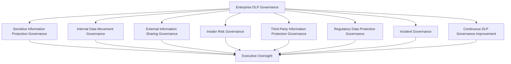
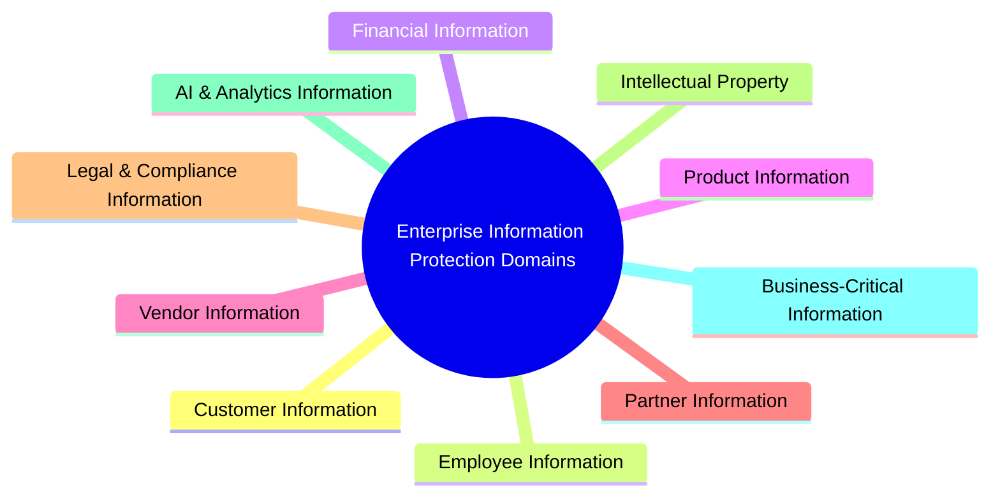
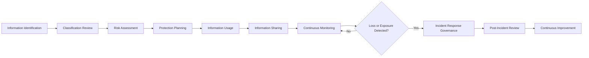
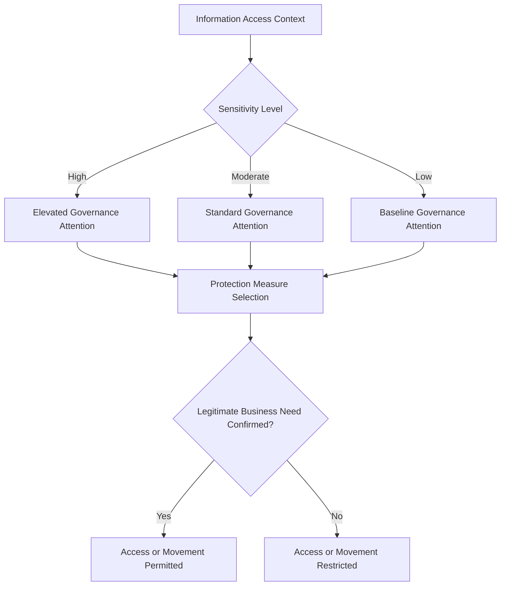
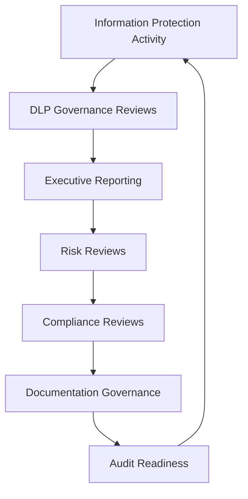
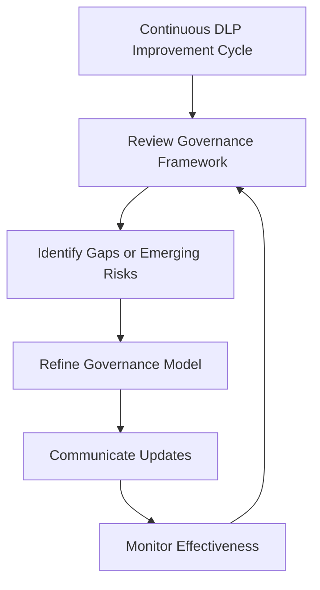

# Enterprise Data Loss Prevention Governance Strategy

## 1. Document Purpose

This document establishes the enterprise governance strategy for preventing unauthorized disclosure, accidental exposure, and inappropriate movement of sensitive information across StackLeo Tech Store. It defines the accountability structures, governance layers, and executive oversight that make information protection a deliberate, proactive discipline rather than a reactive response to incidents.

- **Purpose of Data Loss Prevention** — to reduce the likelihood and impact of sensitive information being disclosed, exposed, or moved outside its intended boundary, whether through accident, error, or misuse.
- **Relationship with Data Protection Strategy** — `data-protection.md` establishes how information is classified and protected at rest and in use; this document establishes the governance layer focused specifically on preventing its unauthorized loss, exposure, or movement.
- **Relationship with Data Classification** — classification (established in `data-protection.md`) is the foundation this document builds on: protection intensity and governance attention scale with the sensitivity a record has already been assigned.
- **Relationship with Privacy Governance** — `privacy.md` establishes personal data rights and protections; this document ensures loss prevention governance extends those protections into the specific risk of unauthorized disclosure or exposure.
- **Relationship with Information Security** — this document is a specialized governance layer within the broader security program defined in `security-governance.md`, focused specifically on information loss and exposure risk rather than the full security control landscape.
- **Relationship with Enterprise Risk Management** — information loss is treated as a distinct, actively governed risk category within `security-risk-management.md`, rather than an implicit assumption.
- **Relationship with Enterprise Governance** — data loss prevention governance is one expression of the broader enterprise governance model defined in `security-governance.md`, extending governance discipline into the specific domain of information protection.

This document is implementation-independent. It does not prescribe monitoring rules, detection signatures, content inspection methods, or specific technologies used to identify or prevent information loss.

## 2. Data Loss Prevention Philosophy

| Principle | Business Value |
|---|---|
| **Data Protection as Business Protection** | Framing information protection as protection of the business itself, not a compliance exercise, keeps investment and attention proportionate to genuine business risk. |
| **Prevent Before Respond** | Prioritizing prevention over reaction reduces both the likelihood and the eventual cost of information loss incidents. |
| **Defense in Depth** | Layering governance attention across multiple points in the information lifecycle ensures no single gap results in unchecked exposure. |
| **Least Necessary Exposure** | Limiting who and what can access sensitive information to genuine need reduces the surface area available for loss or misuse. |
| **Accountability** | Assigning clear ownership for information protection ensures every sensitive domain has a responsible party. |
| **Privacy-Aware Monitoring** | Ensuring any monitoring activity itself respects privacy expectations prevents protection efforts from becoming a source of trust erosion. |
| **Governance by Design** | Building protection governance into how information is classified and handled from the outset, rather than retrofitting it, keeps the organization consistently in control. |
| **Continuous Improvement** | Treating loss prevention governance as an evolving discipline keeps it aligned with a growing business and an evolving threat landscape. |

## 3. Enterprise DLP Governance Model

### Enterprise DLP Governance Matrix

| Governance Layer | Purpose | Governance Scope | Business Value | Executive Expectations |
|---|---|---|---|---|
| **Sensitive Information Protection Governance** | Establishes the overarching framework for protecting information based on its classified sensitivity. | All information categories carrying elevated sensitivity, per `data-protection.md`. | Ensures protection effort is proportionate to genuine sensitivity rather than applied uniformly or arbitrarily. | Expect a clear, classification-driven protection framework. |
| **Internal Data Movement Governance** | Governs how sensitive information moves within the organization. | Internal transfers, copies, and access across teams and systems. | Reduces unnecessary internal exposure without obstructing legitimate collaboration. | Expect visibility into how sensitive information moves internally. |
| **External Information Sharing Governance** | Governs how sensitive information moves outside the organization. | External transfers, aligned with `data-sharing.md`. | Ensures loss prevention and sharing governance operate as a coordinated whole rather than in isolation. | Expect assurance that external exposure is deliberate, not accidental. |
| **Insider Risk Governance** | Governs the organizational risk that legitimate access is misused, whether accidentally or deliberately. | Workforce, privileged users, contractors, and other legitimate access holders. | Addresses one of the hardest-to-detect categories of information loss. | Expect a defensible, proportionate insider risk governance posture. |
| **Third-Party Information Protection Governance** | Governs the protection expectations placed on external parties handling StackLeo information. | Vendors, partners, and service providers with access to sensitive information. | Extends protection discipline beyond the organization's own boundary. | Expect confidence that third parties are held to consistent protection expectations. |
| **Regulatory Data Protection Governance** | Governs alignment with regulatory expectations around information protection. | Information categories with an identified regulatory protection dimension. | Reduces regulatory exposure from inadequate information protection. | Expect a defensible position on regulatory information protection obligations. |
| **Incident Governance** | Governs the organizational response when information loss or exposure occurs. | Detection, escalation, and resolution of information loss events, coordinated with `incident-response.md`. | Limits the impact and duration of any actual loss event. | Expect a clear, tested governance path from detection to resolution. |
| **Continuous DLP Governance Improvement** | Governs how the loss prevention governance framework itself evolves over time. | Governance review cadence, lessons learned, and framework refinement. | Keeps loss prevention governance relevant as the business and threat landscape evolve. | Expect periodic evidence that the framework itself is being actively improved. |

*Diagram 1: Enterprise DLP Governance Framework.*

## 4. Enterprise Information Protection Domains

### Information Protection Domain Matrix

| Domain | Purpose | Protection Considerations | Business Importance | Executive Expectations |
|---|---|---|---|---|
| **Customer Information** | Protects the personal and transactional information underlying the customer relationship. | Highest sensitivity; broadest potential exposure surface given transaction volume. | Central to customer trust and regulatory standing. | Expect customer information to receive the organization's strongest protection attention. |
| **Employee Information** | Protects personal and employment-related workforce information. | Sensitive from both a privacy and an internal-trust perspective. | Supports fair treatment and legal defensibility of workforce practice. | Expect employee information to be protected with the same rigor as customer information. |
| **Financial Information** | Protects transactional, payment, and accounting information. | Carries acute impact if exposed, given its direct financial consequence. | Directly affects financial integrity and stakeholder trust. | Expect financial information to receive the highest protection priority. |
| **Product Information** | Protects catalog, pricing, and product strategy information. | Lower individual sensitivity but competitively significant in aggregate. | Protects competitive positioning. | Expect proportionate, not excessive, protection attention. |
| **Vendor Information** | Protects sourcing, pricing, and vendor relationship information. | Commercially sensitive, particularly in aggregate or comparative form. | Protects negotiating position and vendor trust. | Expect vendor information to be protected consistent with its commercial sensitivity. |
| **Partner Information** | Protects strategic and marketplace partnership information. | Sensitivity varies by partnership type and cross-tenant exposure risk. | Protects trust in a growing partner ecosystem. | Expect partner information protection to scale with ecosystem complexity. |
| **Legal & Compliance Information** | Protects legal, audit, and compliance-related information. | Often carries confidentiality or privilege considerations. | Protects the organization's legal and compliance position. | Expect the highest protection discipline for this domain. |
| **Intellectual Property** | Protects proprietary business processes, strategies, and innovations. | Loss can directly erode competitive advantage. | Protects long-term business differentiation. | Expect deliberate protection attention even though this domain is less regulated than personal data. |
| **AI & Analytics Information** | Protects information used in or generated by AI-assisted and analytics capability. | An emerging domain requiring proactive governance attention as scale grows. | Increasingly central to future capability and competitiveness. | Expect proactive attention to this domain rather than retroactive correction. |
| **Business-Critical Information** | Protects information whose loss would materially disrupt core business operation. | Defined by operational impact rather than a single content type. | Protects operational continuity and resilience. | Expect business-critical information to be explicitly identified and protected, not assumed covered by default. |

*Diagram: Enterprise Information Protection Domain Overview.*

## 5. Information Protection Lifecycle

### Information Protection Lifecycle Matrix

| Stage | Purpose | Governance Objectives | Business Value |
|---|---|---|---|
| **Information Identification** | Recognizes which information within a domain warrants dedicated protection attention. | Ensure sensitive information is identified rather than assumed obvious. | Prevents protection gaps from unrecognized sensitive information. |
| **Classification Review** | Confirms the information's classification is current and accurate. | Ensure protection intensity is grounded in an accurate classification. | Keeps protection effort proportionate and consistent with `data-protection.md`. |
| **Risk Assessment** | Evaluates the likelihood and impact of potential loss or exposure for the information. | Ensure protection priority reflects genuine risk. | Focuses limited governance attention where it matters most. |
| **Protection Planning** | Determines the governance measures appropriate to the assessed risk. | Ensure protection measures are deliberately chosen, not assumed. | Provides a defensible basis for the organization's protection posture. |
| **Information Usage** | Recognizes the period during which information is actively used in business processes. | Confirm usage remains consistent with the information's intended purpose and protection plan. | Ensures ongoing use does not silently erode protection intent. |
| **Information Sharing** | Recognizes when information moves beyond its original custodian, internally or externally. | Ensure sharing is governed consistently with `data-sharing.md`. | Prevents loss prevention and sharing governance from operating at cross purposes. |
| **Continuous Monitoring** | Recognizes the organization's ongoing awareness of how sensitive information is being handled. | Confirm protection measures remain effective over time. | Provides early visibility into emerging exposure risk. |
| **Incident Response Governance** | Governs the organizational response when a loss or exposure event is identified. | Ensure response is prompt, coordinated, and consistent with `incident-response.md`. | Limits the impact and duration of any actual loss event. |
| **Post-Incident Review** | Formally reviews the causes and governance lessons of an information loss event. | Ensure the organization learns from every event rather than merely resolving it. | Converts individual incidents into lasting governance improvement. |
| **Continuous Improvement** | Recognizes that the lifecycle itself is subject to ongoing governance oversight. | Ensure the lifecycle model remains fit for purpose over time. | Keeps loss prevention governance relevant as the organization evolves. |

*Diagram 2: Information Protection Lifecycle.*

## 6. DLP Governance Principles

### DLP Governance Principles Matrix

| Principle | Explanation |
|---|---|
| **Business Justification** | Protection measures are grounded in a demonstrable business or regulatory rationale. |
| **Least Necessary Exposure** | Access to and movement of sensitive information is limited to what is genuinely required. |
| **Accountability** | Every information protection domain has a named owner responsible for its protection posture. |
| **Traceability** | Protection decisions can be traced back to the risk assessment and rationale that informed them. |
| **Auditability** | The organization can demonstrate, on request, how a given information domain is protected and why. |
| **Privacy Awareness** | Protection measures, including any monitoring activity, are designed consistent with commitments in `privacy.md`. |
| **Regulatory Alignment** | Protection governance remains aware of and responsive to applicable regulatory expectations. |
| **Continuous Improvement** | Protection governance practice is periodically reassessed and refined. |

## 7. Insider Risk Governance

### Insider Risk Governance Matrix

| Insider Category | Governance Objective | Business Value |
|---|---|---|
| **Workforce Risks** | Address the possibility that ordinary employees may accidentally or deliberately mishandle sensitive information. | Reduces the organization's largest and most persistent category of insider exposure. |
| **Privileged Users** | Address the elevated risk carried by users with broad or administrative access. | Focuses governance attention where potential impact is greatest, consistent with `privileged-access-management.md`. |
| **Contractors** | Address the risk carried by non-permanent personnel with legitimate access. | Ensures temporary engagement does not translate into reduced governance rigor. |
| **Third-Party Personnel** | Address the risk carried by personnel from vendors or service providers with access to StackLeo information. | Extends insider risk discipline beyond the organization's own workforce. |
| **Temporary Personnel** | Address the risk carried by short-term or seasonal staff. | Ensures onboarding speed does not come at the expense of governance discipline. |
| **Business Partners** | Address the risk carried by personnel from strategic or marketplace partners with access to shared information. | Protects trust in collaborative business relationships. |
| **Organizational Accountability** | Ensure a named function owns the overall insider risk governance posture. | Provides clear ownership for a historically under-governed risk category. |
| **Executive Oversight** | Ensure insider risk governance receives regular executive attention. | Keeps insider risk a visible, actively managed concern rather than an assumed non-issue. |

This section addresses insider risk from a governance-objective perspective; specific surveillance or monitoring techniques are intentionally outside this document's scope.

*Diagram 3: Information Protection Decision Model.*

## 8. Executive Oversight

### Executive Oversight Matrix

| Oversight Activity | Purpose |
|---|---|
| **DLP Governance Reviews** | Confirm the overall data loss prevention governance framework remains coherent and effective. |
| **Executive Reporting** | Provide leadership with visibility into the state of enterprise information protection. |
| **Risk Reviews** | Assess loss-prevention-related risk, including insider risk, third-party exposure, and emerging threats. |
| **Compliance Reviews** | Confirm regulatory expectations around information protection are being appropriately addressed. |
| **Documentation Governance** | Confirm loss prevention governance documentation remains current and accurate. |
| **Audit Readiness** | Confirm the organization is prepared to demonstrate its information protection governance on request. |

*Diagram 4: Enterprise Information Protection Governance Flow.*

## 9. Future Readiness

| Future Direction | Readiness Consideration |
|---|---|
| **AI-Assisted Information Protection** | Anticipates AI-assisted capability as both a new information domain requiring protection and a potential aid to governance itself. |
| **Multi-Tenant Platforms** | Anticipates that a multi-vendor marketplace model introduces cross-tenant information exposure risk requiring dedicated governance attention. |
| **Cloud-Native Operations** | Recognizes that distributed, cloud-native operation introduces additional information movement pathways requiring governance visibility. |
| **Global Expansion** | Recognizes that expansion into new markets introduces additional protection expectations addressed through dedicated review as each market activates. |
| **Cross-Border Information Protection** | Prepares for the governance complexity of protecting information that moves across jurisdictions as the business grows regionally and globally. |
| **Enterprise Scale** | Ensures the governance framework remains coherent as information volume and diversity grow substantially. |
| **Emerging Threat Landscape** | Maintains the organizational capacity to adapt as new categories of information loss risk emerge. |
| **Continuous Governance Evolution** | Treats the framework itself as subject to ongoing refinement rather than a static, one-time definition. |

## 10. Data Loss Prevention Maturity Model

### DLP Maturity Model Matrix

| Level | Characteristics |
|---|---|
| **Initial** | Information protection is reactive, addressed only after an incident occurs, and largely undocumented. |
| **Managed** | Core information domains have identified owners and basic protection practices, though governance is still largely reactive. |
| **Defined** | A documented, organization-wide DLP governance framework exists and is consistently applied across domains and insider categories. |
| **Measured** | DLP governance effectiveness is actively monitored, with visibility into risk posture, incidents, and review cadence. |
| **Optimizing** | DLP governance is continuously refined based on organizational learning, evolving threats, and business growth. |

*Diagram 6: Data Loss Prevention Maturity Progression Model.*

## 11. Anti-Patterns

### Anti-Pattern Summary

| Anti-Pattern | Why It Is Avoided |
|---|---|
| **Reactive Information Protection** | Addressing protection only after a loss event occurs allows preventable exposure to happen in the first place. |
| **Missing Data Classification** | Without a reliable classification foundation, protection effort cannot be proportionate or consistent. |
| **Oversharing Sensitive Information** | Sharing beyond genuine business need increases exposure without corresponding benefit. |
| **Weak Insider Risk Governance** | Ignoring the risk of legitimate access being misused leaves one of the hardest-to-detect loss categories ungoverned. |
| **Poor Documentation** | Undocumented protection rationale cannot be defended, audited, or consistently applied. |
| **Weak Executive Visibility** | Without executive oversight, loss prevention governance drifts from a strategic discipline into an unmonitored afterthought. |
| **Compliance Without Governance** | Treating protection as a checklist of regulatory requirements, rather than a governed discipline, leaves gaps wherever regulation is silent. |
| **Missing Continuous Improvement** | A static protection framework falls out of alignment with a growing business and an evolving threat landscape. |

## 12. Document Information

| Property | Value |
|----------|-------|
| Document | data-loss-prevention.md |
| Version | 1.0.0 |
| Status | Active |
| Maintained By | StackLeo |
| Last Updated | 2026-07-27 |

---

### Governance Responsibility Matrix

| Role | Responsibility |
|---|---|
| Chief Information Security Officer (CISO) | Owns the overall enterprise DLP governance framework and its alignment with `security-governance.md`. |
| Chief Data Officer (CDO) | Ensures information protection governance remains aligned with classification and data governance practice. |
| Legal/Compliance Function | Advises on regulatory data protection obligations, outside this document's scope. |
| Domain/Information Owners | Own the protection posture and risk assessment for information within their domain. |
| Executive Leadership | Provides oversight, reviews governance reporting, and is accountable for the organization's overall information protection posture. |

*Diagram 5: Continuous DLP Improvement Cycle.*

© StackLeo. All Rights Reserved.
