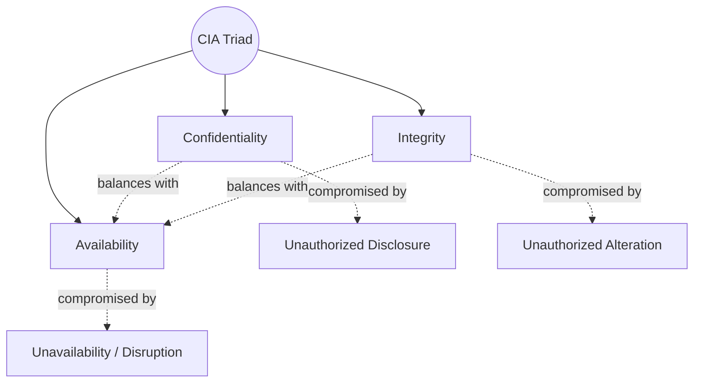
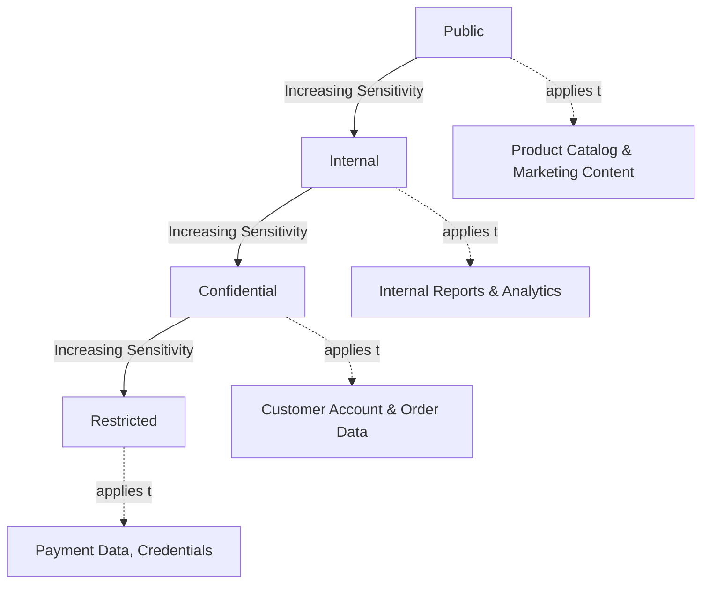
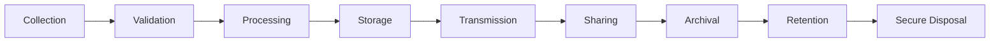
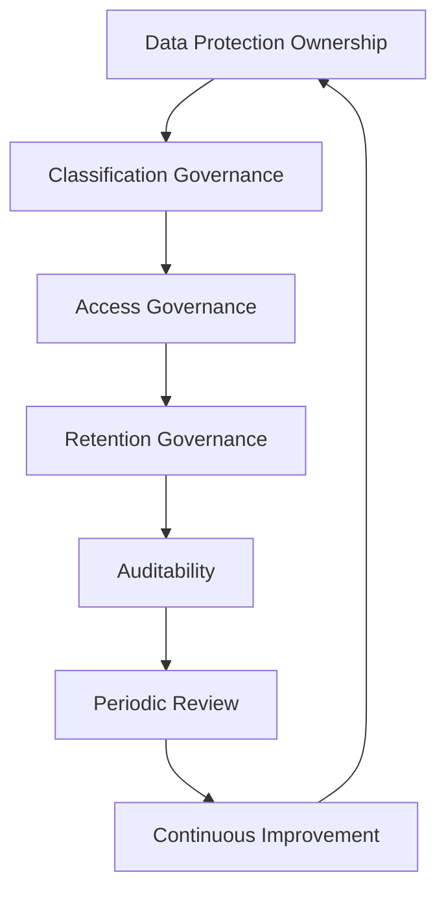
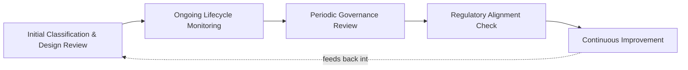

# Data Protection

## 1. Document Purpose

This document defines the official Enterprise Data Protection Strategy for **StackLeo Tech Store**. It establishes how business and customer data is protected throughout its lifecycle, ensuring confidentiality, integrity, availability, privacy, and governance as the platform grows.

- **Purpose of Data Protection** — to ensure that data — the asset most directly tied to both commerce and customer trust — is collected, used, stored, and eventually disposed of in a manner proportionate to its sensitivity, at every stage of its existence.
- **Relationship with Enterprise Security** — this document elaborates Data Security, one of the five domains defined in `security-architecture.md` (Section 3.3), and applies the Data Protection Principles from `security-principles.md` (Section 6) in structural depth.
- **Relationship with Customer Trust** — customers extend StackLeo their identity, payment relationship, and purchase history; trust in that extension is the business's core differentiator, per `01_Business/vision.md`, and data protection is how that trust is honored in practice.
- **Relationship with Privacy** — data protection defines the safeguards applied to data; privacy defines the principles governing how that data may legitimately be used (Section 6). The two are complementary, not interchangeable.
- **Relationship with Compliance** — this document is the structural foundation supporting the compliance obligations defined in `01_Business/business-rules.md` (Section 17) and elaborated in `compliance.md`, and elaborates the security-layer application of `04_Database/data-governance.md`.

This document is implementation-independent and vendor-neutral. It defines data protection philosophy, classification, and governance — not specific encryption algorithms, security products, or implementation procedures.

## 2. Data Protection Philosophy

- **Security by Design** — data protection is considered from the moment a new type of data collection is conceived, not retrofitted once data already exists, consistent with `security-principles.md` (Section 8).
- **Privacy by Design** — data handling defaults to the minimum necessary collection and use, consistent with `01_Business/business-rules.md` (BR-128).
- **Data Minimization** — only data genuinely necessary for a defined, legitimate purpose is collected or retained.
- **Need-to-Know** — access to data is scoped to legitimate operational need, not organizational convenience, consistent with `security-principles.md` (Section 3.2).
- **Least Privilege** — every identity accessing data is granted only the access its defined responsibility requires, consistent with `authorization.md`.
- **Business Resilience** — data protection is designed to preserve the business's ability to operate and serve customers through disruption, not solely to prevent unauthorized access.

## 3. CIA Triad

| Property | Definition | Business Value | Protection Objectives |
|---|---|---|---|
| Confidentiality | Data is disclosed only to actors with a legitimate, verified need to access it. | Preserves customer trust and protects competitively sensitive business information. | Prevent unauthorized disclosure at every stage of the data lifecycle (Section 5). |
| Integrity | Data remains accurate and unaltered except through authorized, intentional action. | Preserves the reliability of orders, pricing, inventory, and every decision made from data. | Detect and prevent unauthorized or accidental modification. |
| Availability | Data and the capability it supports remain accessible to legitimate users when genuinely needed. | Supports continuity of commerce and customer trust during disruption. | Ensure legitimate access is not unduly interrupted, consistent with `04_Database/backup-recovery.md`. |

*Diagram 3: CIA Triad Relationship — the three properties are co-equal and interdependent; strengthening one must not be pursued at the unconsidered expense of another.*

### CIA Triad Summary

| Property | Primary Risk if Absent | Representative Safeguard Category |
|---|---|---|
| Confidentiality | Sensitive data disclosed to unauthorized parties | Access control, classification-proportionate protection |
| Integrity | Data altered without authorization or detection | Change control, validation, auditability |
| Availability | Legitimate access disrupted when genuinely needed | Resilience, backup and recovery readiness |

## 4. Data Classification

StackLeo classifies data into four conceptual sensitivity levels, applied consistently across every business data category in Section 7:

| Classification | Business Sensitivity | Typical Examples | Protection Expectations |
|---|---|---|---|
| Public | No meaningful harm if disclosed broadly. | Product catalog listings, marketing content, published pricing. | Integrity protected; confidentiality not a primary concern. |
| Internal | Not intended for external disclosure, but limited harm if exposed internally. | Internal reports, operational procedures, non-sensitive analytics. | Access limited to employees; no special external safeguards required. |
| Confidential | Meaningful harm to the business or individuals if disclosed. | Customer account details, order history, supplier terms. | Access limited to a defined need-to-know population; disclosure requires justification. |
| Restricted | Severe harm if disclosed; highest sensitivity category. | Payment data, authentication credentials, privileged access records. | Narrowest possible access, strongest available safeguards, heightened audit. |

*Diagram 2: Data Classification Model — protection intensity increases proportionately with sensitivity, consistent with `04_Database/data-governance.md`.*

### Data Classification Matrix

| Classification | Confidentiality Requirement | Integrity Requirement | Availability Requirement |
|---|---|---|---|
| Public | Low | Moderate — protects brand and accuracy | Moderate |
| Internal | Moderate | Moderate | Moderate |
| Confidential | High | High | High |
| Restricted | Highest | Highest | High — but never at the expense of confidentiality |

## 5. Data Lifecycle Protection

Data protection is applied consistently across the full lifecycle of information:

- **Collection** — data is gathered only for a legitimate, defined purpose, consistent with Data Minimization (Section 2).
- **Validation** — data is checked for accuracy and legitimacy at the point of collection, reducing downstream integrity risk.
- **Processing** — data is acted upon only by identities and services authorized for that specific purpose, consistent with `authorization.md`.
- **Storage** — data at rest is protected proportionately to its classification (Section 4).
- **Transmission** — data moving between components, layers, or to third parties is protected against interception or tampering while in transit.
- **Sharing** — data shared with third parties (payment, courier, communication providers) is limited to what the specific integration purpose requires, consistent with the trust-boundary treatment in `security-architecture.md` (Section 4).
- **Archival** — data retained beyond active use is protected to the same standard as active data.
- **Retention** — data is retained only as long as a legitimate business or legal purpose requires, consistent with `04_Database/data-retention.md`.
- **Secure Disposal** — data is removed in a manner consistent with its classification once retention purpose has ended, treating indefinite retention as a liability rather than a convenience.

*Diagram 1: Enterprise Data Lifecycle.*

### Data Lifecycle Protection Matrix

| Stage | Primary Protection Concern |
|---|---|
| Collection | Limiting gathering to legitimate, defined purpose |
| Validation | Ensuring accuracy before data enters the system |
| Processing | Restricting action to authorized, purpose-specific identities |
| Storage | Proportionate protection based on classification |
| Transmission | Protecting data in motion against interception or tampering |
| Sharing | Limiting third-party exposure to integration-specific need |
| Archival | Sustaining protection standards for inactive data |
| Retention | Ensuring data is kept only as long as legitimately required |
| Secure Disposal | Ensuring complete, classification-appropriate removal |

## 6. Privacy Principles

- **Purpose Limitation** — data is used only for the purpose it was collected for, or a purpose the customer would reasonably expect.
- **Data Minimization** — only data necessary for a defined purpose is collected, consistent with Section 2.
- **Transparency** — customers can reasonably understand what data is collected about them and why, consistent with the trust commitments in `01_Business/vision.md`.
- **Accountability** — responsibility for data handling decisions is traceable to a specific, accountable owner (Section 8), not diffused across the organization.
- **User Rights Awareness** — the platform's data handling is designed with awareness that customers may reasonably expect to access, correct, or request removal of their own data.
- **Responsible Processing** — data processing decisions consider the customer's reasonable expectations, not only what is technically or commercially possible.

## 7. Business Data Categories

| Category | Business Importance | Protection Priority | Privacy Considerations |
|---|---|---|---|
| Customer Data | Represents the direct customer relationship and trust. | Critical | Highest privacy sensitivity; subject to purpose limitation and minimization. |
| Employee Data | Enables workforce management and accountability. | High | Subject to the same privacy expectations as customer data, proportionate to role. |
| Product Information | Core of the marketplace's commerce proposition. | Moderate | Primarily an integrity, not confidentiality, concern. |
| Orders | Represents committed revenue and fulfillment obligations. | Critical | Contains customer identity and purchase behavior; Confidential classification. |
| Payments | Directly financial; highest regulatory and fraud sensitivity. | Critical | Restricted classification; narrowest possible access. |
| Inventory | Determines fulfillment accuracy and operational planning. | High | Primarily internal; limited privacy exposure. |
| Business Analytics | Informs strategic and operational decision-making. | Moderate–High | May aggregate customer behavior; requires care to avoid re-identification risk. |
| Audit Records | The record of accountability for significant platform action. | High | Contains identity and action history; access itself must be tightly governed. |
| Future Marketplace Data | Will represent third-party seller business and performance data. | High (Future) | Introduces new cross-tenant privacy and confidentiality boundaries. |

### Business Data Category Matrix

| Category | Typical Classification (Section 4) | Primary Protection Concern |
|---|---|---|
| Customer Data | Confidential–Restricted | Unauthorized disclosure or misuse of personal data |
| Employee Data | Confidential | Unauthorized disclosure within or beyond the organization |
| Product Information | Public–Internal | Integrity of published information |
| Orders | Confidential | Unauthorized access to transaction and identity data |
| Payments | Restricted | Financial fraud and regulatory exposure |
| Inventory | Internal | Operational accuracy, limited confidentiality concern |
| Business Analytics | Internal–Confidential | Re-identification risk in aggregated data |
| Audit Records | Confidential–Restricted | Tampering or unauthorized access undermines accountability itself |
| Future Marketplace Data | Confidential (Future) | Cross-tenant exposure between competing sellers |

## 8. Data Governance

- **Data Ownership** — every business data category (Section 7) has a designated accountable owner responsible for its protection and appropriate use.
- **Data Stewardship** — day-to-day custodianship of data quality, classification accuracy, and access hygiene is delegated to stewards within each owning function.
- **Classification Governance** — data is classified consistently against the model in Section 4, with classification reviewed as new data categories are introduced.
- **Retention Governance** — retention periods are defined deliberately per data category and enforced consistently, per `04_Database/data-retention.md`.
- **Access Governance** — access to data is governed by the principles in `authorization.md`, reviewed periodically to confirm continued legitimacy.
- **Auditability** — access to and modification of Confidential and Restricted data is recorded immutably, consistent with `security-principles.md` (Section 9).

## 9. Future Data Protection Readiness

This strategy is deliberately structured to remain valid as StackLeo's platform and markets grow:

- **AI Data** — data used by AI-assisted capability (search, recommendations, fraud detection) remains subject to the same classification, minimization, and purpose limitation principles as any other use, per `security-principles.md` (Section 10).
- **Marketplace Data** — the Future Marketplace Data category (Section 7) is already anticipated, allowing cross-tenant protection to be designed before the marketplace launches.
- **Cross-Border Operations** — classification and lifecycle protection (Sections 4–5) remain jurisdiction-agnostic, allowing region-specific obligations to layer on as StackLeo expands from Bangladesh into South Asia and beyond.
- **Enterprise Customers** — corporate and wholesale customers bring heightened expectations for data handling assurance, which this classification and governance model is structured to satisfy.
- **Multi-Region Systems** — data protection principles apply consistently regardless of the number or location of regions data is processed or stored in.
- **Public APIs** — data exposed through public APIs, per `05_API/api-strategy.md`, remains subject to the same classification-proportionate protection as internally consumed data.
- **Regulatory Evolution** — this strategy's classification-based, principle-driven structure allows new regulatory obligations to be absorbed via `compliance.md` without requiring the underlying philosophy to be redefined.

## 10. Governance

- **Ownership** — the Security Lead, in coordination with the Data Protection Owner referenced in `security-principles.md` (Section 11), owns the coherence of this data protection strategy.
- **Review Process** — this strategy and its classification model are reviewed on a defined cadence and whenever a new data category or business model is introduced.
- **Policy Management** — operational data handling policies derived from this strategy are maintained consistently with it and with `security-governance.md`.
- **Compliance Oversight** — alignment with applicable legal and regulatory obligations is reviewed continuously, coordinated with `compliance.md`.
- **Continuous Improvement** — this strategy is expected to mature as data categories, business models, and regulatory context evolve.

*Diagram 4: Data Governance Framework.*

### Governance Responsibility Matrix

| Role | Responsibility |
|---|---|
| Security Lead | Owns coherence and enforcement of the data protection strategy. |
| Data Protection Owner | Owns data classification accuracy and privacy alignment. |
| Data Stewards (per category) | Maintain day-to-day data quality, classification, and access hygiene. |
| Engineering Leads | Apply lifecycle protection (Section 5) within their domain. |
| Product Manager | Ensures new features account for data protection from inception. |
| Internal Audit / Review Function | Independently verifies data protection practice matches this strategy. |

*Diagram 5: Data Protection Review Lifecycle.*

## 11. Anti-Patterns

| Anti-Pattern | Why It's Avoided |
|---|---|
| Collecting Excessive Data | Violates Data Minimization (Section 2); increases exposure without a legitimate corresponding purpose. |
| Poor Classification | Leaves protection effort misallocated, over-protecting low-sensitivity data while under-protecting Restricted data (Section 4). |
| Unlimited Retention | Treats indefinite retention as a convenience rather than a liability, contradicting Section 5 and `04_Database/data-retention.md`. |
| Weak Access Controls | Undermines Confidentiality (Section 3) regardless of how well data is otherwise protected. |
| Ignoring Privacy | Damages customer trust even absent a technical security failure, contradicting Section 6. |
| No Ownership | Leaves data categories without an accountable party, guaranteeing inconsistent protection over time (Section 8). |
| Poor Disposal Practices | Leaves classification-inappropriate residual data recoverable after its retention purpose has ended. |
| Missing Audits | Prevents detection of unauthorized access or modification, undermining Integrity and Accountability. |

## 12. Document Information

| Property | Value |
|----------|-------|
| Document | data-protection.md |
| Version | 1.0.0 |
| Status | Active |
| Maintained By | StackLeo |
| Last Updated | 2026-07-17 |

---

© StackLeo. All Rights Reserved.
