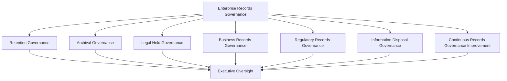
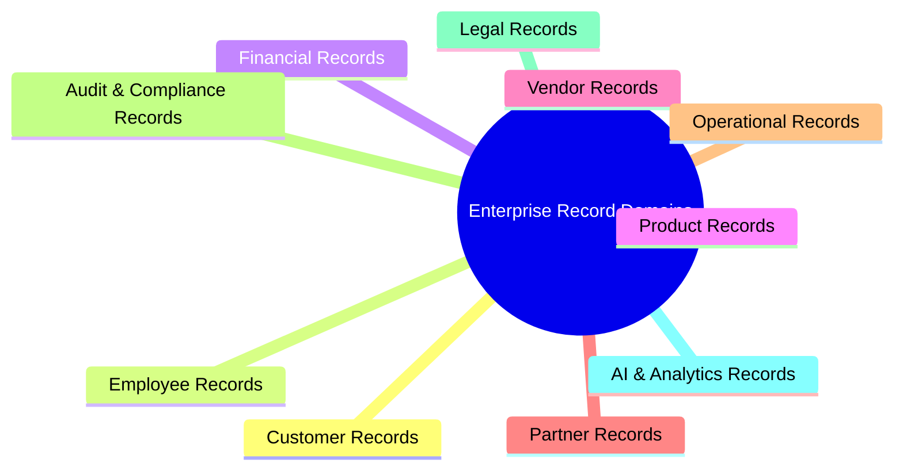
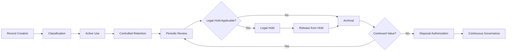
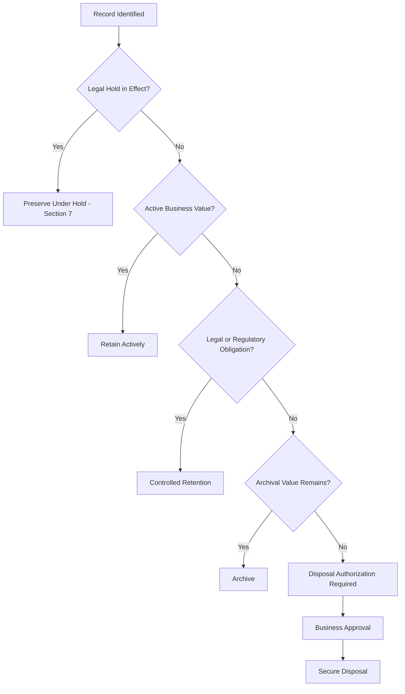
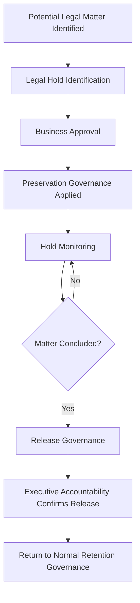
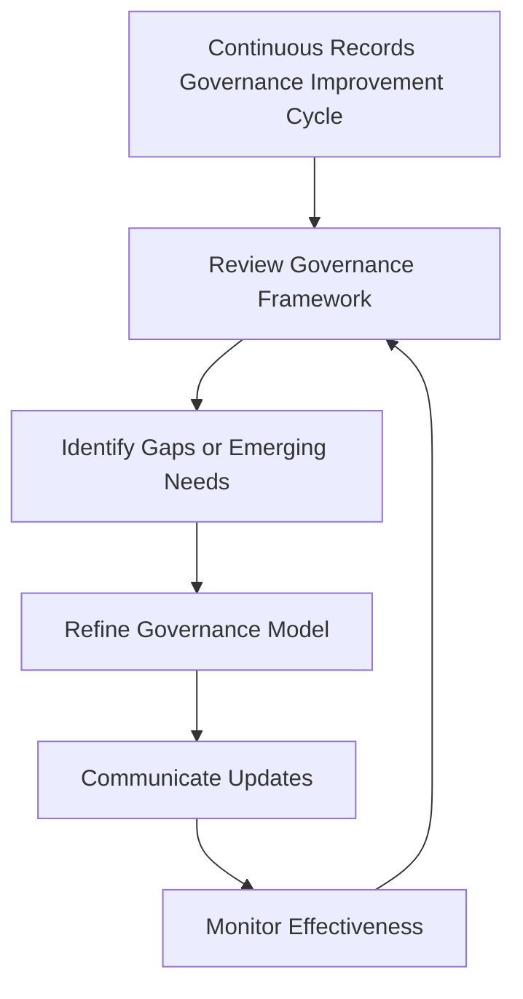

# Enterprise Data Retention & Records Lifecycle Governance Strategy

## 1. Document Purpose

This document establishes the enterprise governance strategy for how StackLeo Tech Store retains, preserves, holds, archives, and disposes of records across their organizational lifecycle. It defines the governance layer that sits above day-to-day data engineering practice, providing the executive, legal, and cross-functional accountability structures within which retention decisions are made.

- **Purpose of Data Retention** — to ensure every category of record is kept for as long as it holds genuine business, legal, or regulatory value, and is disposed of responsibly once that value has passed, so retention is a deliberate governance decision rather than an accidental default.
- **Relationship with Data Protection** — this document governs *how long* a record exists; `data-protection.md` governs how that record is protected, classified, and secured while it exists. Retention duration and protection intensity are complementary but distinct governance decisions.
- **Relationship with Privacy Governance** — `privacy.md` establishes personal data rights and lifecycle expectations from the data subject's perspective; this document establishes the organizational retention and disposal governance that makes those commitments operationally enforceable across all record types, not personal data alone.
- **Relationship with Information Lifecycle Management** — `04_Database/data-retention.md` governs the technical, database-level lifecycle of data (classification, archival tiering, deletion mechanics, anonymization). This document governs the enterprise records layer above it: organizational accountability, legal hold, cross-functional record domains, and executive oversight. The two are complementary — this document does not restate database-level lifecycle mechanics, and the database-level document does not restate legal hold or executive governance.
- **Relationship with Business Continuity** — retained records, particularly financial, legal, and operational records, are a component of organizational resilience; this document ensures their retention governance is coordinated with, not contradictory to, business continuity expectations.
- **Relationship with Regulatory Compliance** — this document establishes the governance structures through which regulatory recordkeeping obligations are identified, interpreted, and satisfied; it does not itself enumerate specific legal retention periods, which remain a matter for dedicated legal and compliance review.
- **Relationship with Enterprise Governance** — records governance is one expression of the broader enterprise governance model defined in `security-governance.md`, extending governance discipline into the specific domain of organizational recordkeeping.

This document is implementation-independent. It does not prescribe retention durations, archive mechanisms, storage technologies, or specific legal timelines.

## 2. Data Retention Philosophy

| Principle | Business Value |
|---|---|
| **Information Has a Lifecycle** | Recognizing that every record moves from creation through eventual disposal prevents the false assumption that data, once created, must be kept indefinitely by default. |
| **Retain Only What Is Needed** | Limiting retention to records with genuine ongoing value reduces unnecessary risk, cost, and complexity without sacrificing anything the business actually relies on. |
| **Business Value–Driven Retention** | Anchoring retention decisions to demonstrable business value keeps the organization from retaining records out of habit or convenience rather than purpose. |
| **Legal & Regulatory Awareness** | Treating legal and regulatory obligations as a first-class input to retention decisions protects the organization from both premature disposal and unnecessary over-retention. |
| **Accountability** | Assigning clear ownership for retention decisions ensures every record category has a responsible party who can explain why it is retained and for how long. |
| **Governance by Design** | Building retention governance into how records are created and classified, rather than applying it retroactively, keeps the organization consistently in control of its recordkeeping posture. |
| **Responsible Disposal Readiness** | Maintaining the organizational capability to dispose of records responsibly, when appropriate, prevents indefinite accumulation from becoming the default outcome. |
| **Continuous Improvement** | Treating retention governance as an evolving discipline keeps it aligned with a growing business, expanding markets, and an evolving regulatory landscape. |

## 3. Enterprise Records Governance Model

### Enterprise Records Governance Matrix

| Governance Layer | Purpose | Governance Scope | Business Value | Executive Expectations |
|---|---|---|---|---|
| **Records Governance** | Establishes the overarching framework for how records are recognized, owned, and governed across the enterprise. | All record categories, regardless of format or originating function. | Provides a single, coherent governance umbrella instead of fragmented, function-by-function practice. | Expect a clearly articulated records governance framework with named accountability. |
| **Retention Governance** | Governs the business rationale and decision process for how long records are kept. | Retention rationale, review cadence, and category-level accountability. | Keeps retention deliberate and defensible rather than accidental. | Expect periodic confirmation that retention rationale remains valid. |
| **Archival Governance** | Governs the organizational decision to move records from active use into a preserved, lower-activity state. | Archival eligibility criteria and archival accountability, at the governance rather than technical level. | Balances continued availability of historically valuable records against unbounded active-tier growth. | Expect visibility into which record categories are archived and why. |
| **Legal Hold Governance** | Governs how retention obligations are suspended when a record becomes subject to legal or investigative preservation. | Hold identification, preservation, monitoring, and release, at the organizational governance level. | Protects the organization from the severe consequences of inadvertent disposal during a legal matter. | Expect assurance that legal hold obligations reliably override routine retention and disposal. |
| **Business Records Governance** | Governs recordkeeping for records that primarily serve internal operational and decision-making purposes. | Records generated by ordinary business operation across functions. | Ensures operational records remain trustworthy and available to support business decisions. | Expect confidence that operational recordkeeping is neither neglected nor excessive. |
| **Regulatory Records Governance** | Governs recordkeeping for records subject to external regulatory or statutory obligation. | Records with an identified regulatory or statutory recordkeeping dimension. | Reduces regulatory exposure by ensuring obligated records receive appropriate governance attention. | Expect a defensible position that regulatory recordkeeping obligations are actively managed. |
| **Information Disposal Governance** | Governs the organizational decision and approval process by which records are authorized for disposal. | Disposal authorization, accountability, and traceability, independent of the technical disposal mechanism. | Prevents both indefinite retention and unauthorized or careless disposal. | Expect disposal to always be a deliberate, approved, and traceable organizational act. |
| **Continuous Records Governance Improvement** | Governs how the records governance framework itself evolves over time. | Governance review cadence, lessons learned, and framework refinement. | Keeps records governance relevant as the business, regulatory landscape, and data volume grow. | Expect periodic evidence that the governance framework itself is being actively improved. |

*Diagram 1: Enterprise Records Governance Framework.*

## 4. Enterprise Record Domains

### Enterprise Record Domain Matrix

| Record Domain | Purpose | Retention Considerations | Business Importance | Executive Expectations |
|---|---|---|---|---|
| **Customer Records** | Support the customer relationship, transaction history, and service continuity. | Balance ongoing service value against the customer's own privacy expectations and rights. | Central to trust, service quality, and dispute resolution. | Expect customer recordkeeping to be governed consistently with privacy commitments. |
| **Employee Records** | Support the employment relationship, performance history, and workforce administration. | Balance operational and legal workforce obligations against employee privacy expectations. | Essential to fair, consistent, and legally sound people management. | Expect employee recordkeeping to meet both operational and legal expectations. |
| **Financial Records** | Support accounting, taxation, financial reporting, and audit. | Typically carry the strongest external regulatory and audit expectations of any record domain. | Directly underpins financial integrity and stakeholder trust. | Expect financial recordkeeping to be treated as a high-assurance governance priority. |
| **Product Records** | Support the catalog, product history, and product-related decision-making. | Retain reference value even after a product is discontinued. | Preserves institutional knowledge about the product portfolio over time. | Expect product history to remain available for reference even as the catalog evolves. |
| **Vendor Records** | Support sourcing, procurement, and vendor relationship management. | Balance ongoing commercial relevance against the natural conclusion of vendor relationships. | Supports informed sourcing decisions and vendor accountability. | Expect vendor recordkeeping to remain current and defensible. |
| **Partner Records** | Support strategic, marketplace, and integration partnerships. | Reflect the evolving and sometimes multi-party nature of partnership arrangements. | Underpins trust and accountability in an expanding partner ecosystem. | Expect partner recordkeeping to scale sensibly as partnerships grow in number and complexity. |
| **Operational Records** | Support day-to-day business operation and internal decision-making. | Often have a shorter natural relevance window than other domains. | Provides the operational memory the business relies on. | Expect operational recordkeeping to avoid both premature loss and unnecessary accumulation. |
| **Audit & Compliance Records** | Provide evidence of governance, control, and compliance activity. | Generally warrant longer, more conservative retention given their accountability purpose. | Directly supports the organization's ability to demonstrate good governance. | Expect audit and compliance records to be treated as especially protected from premature disposal. |
| **Legal Records** | Support the organization's legal position, obligations, and history. | Subject to legal hold governance (Section 7) whenever an active legal matter applies. | Protects the organization's legal interests and institutional memory. | Expect legal records to receive the highest level of retention discipline. |
| **AI & Analytics Records** | Support AI-assisted capability, analytics, and business intelligence. | An emerging domain requiring governance attention as its scale and use grow. | Increasingly central to data-driven decision-making and future capability. | Expect proactive governance attention to this domain as it matures, rather than retroactive correction. |

*Diagram: Enterprise Record Domain Overview.*

## 5. Records Lifecycle

### Records Lifecycle Matrix

| Stage | Purpose | Governance Objectives | Business Value |
|---|---|---|---|
| **Record Creation** | Recognizes the point at which a record comes into existence and enters governance scope. | Ensure every record is recognized as governable from the moment it is created. | Prevents ungoverned records from accumulating unnoticed. |
| **Classification** | Assigns the record to its appropriate domain and governance category. | Ensure every record has a clear governance identity. | Enables consistent, category-appropriate retention treatment. |
| **Active Use** | Recognizes the period during which a record directly supports ongoing business activity. | Confirm the record continues to serve its originating purpose. | Ensures records remain available while genuinely needed. |
| **Controlled Retention** | Governs the deliberate continuation of a record's retention once active use has concluded. | Confirm continued retention remains justified by business, legal, or regulatory need. | Keeps retention a conscious decision rather than a passive default. |
| **Periodic Review** | Reassesses whether continued retention remains appropriate. | Catch categories whose justification for retention has lapsed. | Keeps the overall records estate aligned with genuine ongoing value. |
| **Legal Hold** | Suspends normal retention and disposal when a record becomes subject to legal or investigative preservation. | Ensure preservation obligations reliably override routine governance. | Protects the organization during legal or investigative matters. |
| **Archival** | Moves a record into a preserved, lower-activity state once active relevance has passed but retained value remains. | Confirm archival eligibility and preserve continued accessibility where warranted. | Balances long-term value against active-tier efficiency. |
| **Release from Hold** | Formally lifts a legal hold once its underlying basis concludes. | Ensure holds are released deliberately, not left in place indefinitely by default. | Restores normal retention governance once appropriate. |
| **Disposal Authorization** | Formally approves a record for disposal once no further value or obligation remains. | Ensure disposal is always a deliberate, approved organizational act. | Prevents both unauthorized disposal and unjustified indefinite retention. |
| **Continuous Governance** | Recognizes that the lifecycle itself is subject to ongoing governance oversight and improvement. | Ensure the lifecycle model remains fit for purpose over time. | Keeps records governance relevant as the organization evolves. |

*Diagram 2: Records Lifecycle.*

## 6. Retention Governance Principles

### Retention Governance Principles Matrix

| Principle | Explanation |
|---|---|
| **Accountability** | Every record category has a named owner responsible for the reasonableness of its retention posture. |
| **Business Justification** | Retention is grounded in a demonstrable business, legal, or regulatory rationale rather than convenience or habit. |
| **Traceability** | Retention and disposal decisions can be traced back to the rationale and approval that authorized them. |
| **Auditability** | The organization can demonstrate, on request, how and why a given record category's retention posture was determined. |
| **Regulatory Alignment** | Retention governance remains aware of and responsive to applicable regulatory recordkeeping expectations. |
| **Privacy Awareness** | Retention decisions for personal data are made consistent with privacy commitments defined in `privacy.md`. |
| **Disposal Readiness** | The organization maintains the governance capability to authorize disposal responsibly when appropriate. |
| **Continuous Improvement** | Retention governance practice is periodically reassessed and refined. |

### Enterprise Retention Decision Flow

*Diagram 4: Enterprise Retention Decision Flow.*

## 7. Legal Hold Governance

### Legal Hold Governance Matrix

| Governance Element | Governance Objective | Business Value |
|---|---|---|
| **Legal Hold Identification** | Ensure records relevant to a legal or investigative matter are promptly recognized as subject to preservation. | Reduces the risk of inadvertent loss of records material to a legal matter. |
| **Business Approval** | Ensure a hold is formally authorized rather than applied informally or inconsistently. | Provides a clear, defensible basis for the preservation obligation. |
| **Preservation Governance** | Ensure records under hold are protected from routine retention and disposal processes for the duration of the hold. | Protects the organization's legal position and credibility. |
| **Hold Monitoring** | Ensure active holds remain visible and are not inadvertently overlooked. | Prevents holds from lapsing unintentionally. |
| **Release Governance** | Ensure a hold is formally lifted once its underlying basis has concluded. | Restores normal retention governance promptly and deliberately once appropriate. |
| **Executive Accountability** | Ensure ultimate accountability for legal hold governance rests with a named executive function. | Provides clear ownership for one of the organization's highest-risk governance obligations. |

This section addresses legal hold from a governance-objective perspective; specific legal procedures and determinations remain the responsibility of the organization's legal function.

*Diagram 3: Legal Hold Governance Model.*

## 8. Executive Oversight

### Executive Oversight Matrix

| Oversight Activity | Purpose |
|---|---|
| **Records Governance Reviews** | Confirm the overall records governance framework remains coherent and effective. |
| **Executive Reporting** | Provide leadership with visibility into the state of enterprise recordkeeping. |
| **Risk Reviews** | Assess retention-related risk, including over-retention, premature disposal, and legal hold exposure. |
| **Compliance Reviews** | Confirm regulatory recordkeeping obligations are being appropriately addressed. |
| **Documentation Governance** | Confirm records governance documentation remains current and accurate. |
| **Audit Readiness** | Confirm the organization is prepared to demonstrate its recordkeeping governance on request. |

### Governance Responsibility Matrix

| Role | Responsibility |
|---|---|
| Chief Data Officer (CDO) | Owns the overall enterprise records governance framework and its alignment with broader data governance. |
| Chief Information Security Officer (CISO) | Ensures disposal and preservation practices meet security expectations, consistent with `security-governance.md`. |
| Legal/Compliance Function | Determines legal hold obligations and specific regulatory retention requirements, outside this document's scope. |
| Data/Records Stewards | Own retention classification and lifecycle status for assigned record domains. |
| Executive Leadership | Provides oversight, reviews governance reporting, and approves disposal of significant record categories. |
| Database Architect | Owns the technical lifecycle implementation described in `04_Database/data-retention.md`, distinct from this document's governance layer. |

## 9. Future Readiness

| Future Direction | Readiness Consideration |
|---|---|
| **AI-Generated Records** | Extends records governance to records created or influenced by AI-assisted capability, treating them as a governed record domain rather than an ungoverned by-product. |
| **Multi-Tenant Platforms** | Anticipates that a multi-vendor marketplace model introduces records belonging to multiple distinct parties, requiring governance clarity about ownership and retention responsibility. |
| **Global Expansion** | Recognizes that expansion into new markets introduces additional regulatory recordkeeping considerations to be addressed through dedicated legal review as each market activates. |
| **Cross-Border Records Governance** | Prepares for the governance complexity of records that span multiple jurisdictions as the business grows regionally and globally. |
| **Digital Records Evolution** | Anticipates continued evolution in how records are created, represented, and preserved as digital practice matures. |
| **Enterprise Scale** | Ensures the governance framework remains coherent as record volume and diversity grow substantially. |
| **Emerging Regulations** | Maintains the organizational capacity to adapt as new regulatory recordkeeping expectations emerge. |
| **Continuous Governance Evolution** | Treats the framework itself as subject to ongoing refinement rather than a static, one-time definition. |

## 10. Data Retention Maturity Model

### Data Retention Maturity Model Matrix

| Level | Characteristics |
|---|---|
| **Initial** | Retention practice is ad hoc, inconsistent across record domains, and largely undocumented. |
| **Managed** | Core record domains have identified owners and basic retention practices, though governance is still largely reactive. |
| **Defined** | A documented, organization-wide records governance framework exists and is consistently applied across record domains. |
| **Measured** | Retention governance effectiveness is actively monitored, with visibility into legal hold status, disposal authorization, and review cadence. |
| **Optimizing** | Records governance is continuously refined based on organizational learning, regulatory evolution, and business growth. |

*Diagram 6: Data Retention Maturity Progression Model.*

## 11. Anti-Patterns

### Anti-Pattern Summary

| Anti-Pattern | Why It Is Avoided |
|---|---|
| **Keeping Everything Forever** | Indefinite retention without justification accumulates unnecessary risk, cost, and complexity across the organization. |
| **Premature Disposal** | Disposing of records before their business, legal, or regulatory value has passed creates avoidable operational and legal exposure. |
| **Missing Legal Hold Governance** | The absence of a reliable legal hold mechanism risks inadvertent loss of records material to a legal matter, with serious consequences. |
| **Unknown Record Ownership** | Record domains without a clear owner have no one accountable for ensuring their retention posture remains justified. |
| **Weak Documentation** | Undocumented retention rationale cannot be defended, audited, or consistently applied. |
| **Weak Executive Visibility** | Without executive oversight, retention governance drifts from a strategic discipline into an unmonitored operational afterthought. |
| **Compliance Without Governance** | Treating retention as a checklist of regulatory requirements, rather than a governed discipline, leaves gaps wherever regulation is silent or ambiguous. |
| **Missing Continuous Improvement** | A static retention framework falls out of alignment with a growing, evolving business and regulatory landscape. |

## 12. Document Information

| Property | Value |
|----------|-------|
| Document | data-retention.md |
| Version | 1.0.0 |
| Status | Active |
| Maintained By | StackLeo |
| Last Updated | 2026-07-27 |

---

*Diagram 5: Continuous Records Governance Improvement Cycle.*

© StackLeo. All Rights Reserved.
