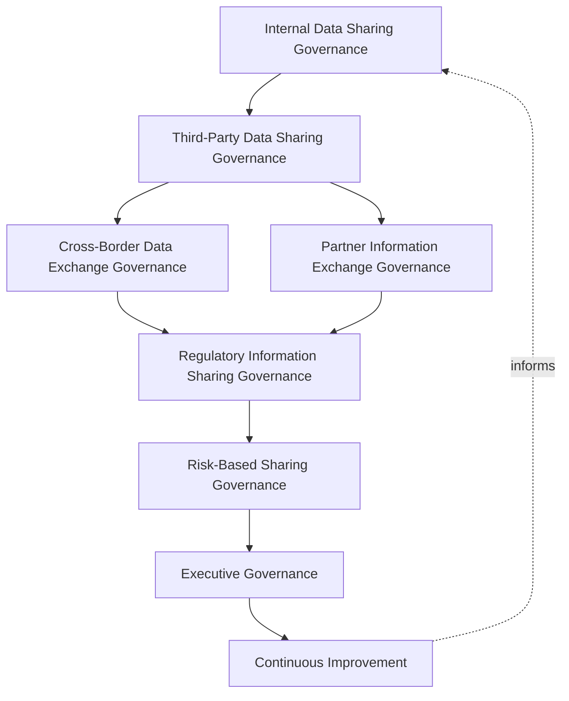
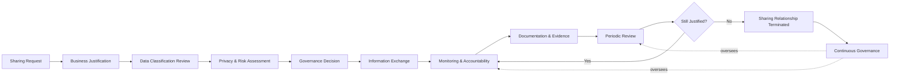
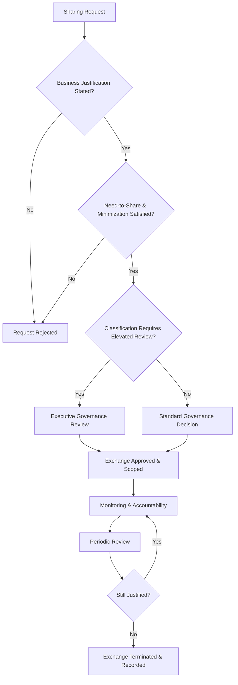
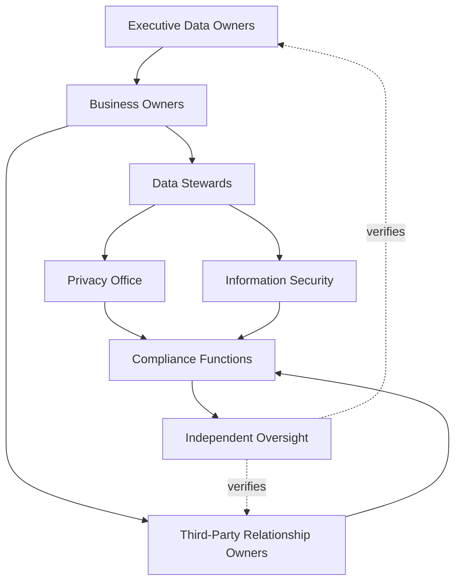
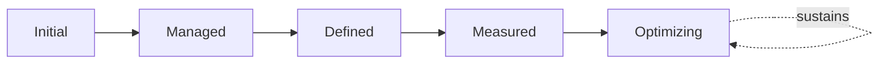

# Enterprise Data Sharing Governance Strategy

## 1. Document Purpose

This document defines the official Enterprise Data Sharing & Information Exchange Governance Strategy for **StackLeo Tech Store** — the CDO/CPO/CISO-owned executive charter under which every exchange of information, internal or external, is deliberately governed. It establishes governance for internal data sharing, external information exchange, third-party data sharing, cross-border data exchange, organizational accountability, executive oversight, and long-term data sharing maturity, consistent with DAMA-DMBOK, ISO/IEC 27001, ISO/IEC 27701, and TOGAF enterprise architecture thinking.

`data-sharing.md` remains the operational governance framework for information exchange practice — the document that elaborates in full operational depth StackLeo's sharing model, domains, lifecycle, and third-party information governance. This document sits above it as executive mandate, consistent with the executive-charter relationship `data-governance-strategy.md` holds over `data-governance.md`: it does not restate operational detail, it establishes the philosophy, accountability structure, and executive expectations that give that operational practice authority and continuity, coordinated with `data-classification.md` and `privacy-governance.md`.

- **Purpose of Data Sharing Governance** — to ensure every exchange of information — internal or external, routine or exceptional — is deliberate, justified, and proportionate to its purpose, never assumed permissible simply because it is technically possible.
- **Relationship with Enterprise Data Governance** — this strategy is the sharing-specific elaboration of `04_Database/data-governance-strategy.md`; where that strategy governs data as a whole, this document governs specifically what happens when data moves beyond its original custodian.
- **Relationship with Data Classification** — a data category's classification, governed under `04_Database/data-classification.md`, directly determines the rigor a proposed sharing relationship requires; higher-sensitivity data warrants more deliberate review before exchange.
- **Relationship with Privacy Governance** — personal data sharing is governed under this strategy in direct coordination with `privacy-governance.md` (Section 5.5, Sharing Governance), ensuring individuals' data is never shared beyond its lawful, justified purpose.
- **Relationship with Information Security** — shared information carries the security posture of its most exposed point of transit; this strategy ensures sharing decisions are made with security consequence in view, while `security-governance.md` governs the technical protection applied to the exchange itself.
- **Relationship with Compliance Governance** — cross-border and regulatory information exchange frequently trace directly to specific legal or contractual obligation; this strategy ensures those obligations, tracked in `compliance.md`, are reliably reflected in how information is actually shared.
- **Relationship with Enterprise Governance** — data sharing governance is not a separate structure from how StackLeo governs the rest of the business; it is the sharing-specific application of the same executive accountability, policy discipline, and control assurance applied enterprise-wide in `policy-management.md` and `internal-controls.md`.

This document is implementation-independent and vendor-neutral. It defines data sharing governance philosophy, model, domains, and lifecycle conceptually — not specific API gateways, integration platforms, cloud providers, messaging systems, file transfer technologies, data exchange vendors, consulting firms, security products, API implementations, file transfer procedures, integration workflows, synchronization mechanisms, infrastructure configurations, deployment architectures, operational processes, or code.

## 2. Data Sharing Governance Philosophy

Data sharing governance at StackLeo rests on eight principles. Each exists to produce a specific business outcome — information exchange is governed deliberately because every point at which data leaves its original custodian is a point at which the organization's control over it genuinely weakens.

### 2.1 Share Data Responsibly

Information is shared only when a genuine purpose justifies it, and only to the extent that purpose requires, never as an unreflective default.

- **Business Value** — limits the exposure created by every sharing relationship to what its genuine purpose actually requires.

### 2.2 Business Value Through Trusted Information Exchange

Deliberate, well-governed sharing enables the collaboration StackLeo's business model genuinely depends on — internally across functions, and externally with partners, vendors, and future marketplace participants.

- **Business Value** — ensures governance enables confident collaboration rather than becoming an obstacle that pushes sharing into informal, ungoverned channels.

### 2.3 Need-to-Share with Appropriate Governance

Information is shared based on a genuine, defined operational need, with governance rigor proportionate to what is being shared and with whom.

- **Business Value** — ensures governance effort is concentrated where genuine risk justifies it, not spread uniformly regardless of stakes.

### 2.4 Accountability

Every sharing decision traces to a specific, named, responsible party.

- **Business Value** — ensures every information exchange has someone genuinely responsible for defending its justification.

### 2.5 Transparency

What information is shared, with whom, and for what purpose is documented and discoverable, never hidden or informally arranged.

- **Business Value** — ensures sharing relationships can be reviewed and defended, not merely assumed to be reasonable.

### 2.6 Privacy Awareness

Personal data sharing receives the additional scrutiny its sensitivity demands, coordinated directly with `privacy-governance.md`.

- **Business Value** — protects individuals' data from exposure beyond the purpose that justified its original collection.

### 2.7 Governance by Design

Sharing governance structures are established deliberately as a new integration or partnership is introduced, not retrofitted once ungoverned exchange has already occurred.

- **Business Value** — prevents the costly, high-visibility discovery of sharing governance gaps only after an incident has already demonstrated their absence.

### 2.8 Continuous Improvement

Data sharing governance practice matures over time, informed by real review findings, incidents, and the organization's growth in scale and partner ecosystem.

- **Business Value** — keeps sharing governance aligned with StackLeo's growth in integrations, partnerships, and market reach.

## 3. Enterprise Data Sharing Governance Model

Data sharing governance operates across eight conceptual layers, each holding accountability for a distinct dimension of information exchange. Every layer here is elaborated in full operational depth in `data-sharing.md`.

### 3.1 Internal Data Sharing Governance

- **Purpose** — own the coherence of how information moves between StackLeo's own functions and systems.
- **Governance Scope** — oversight of internal exchange across every domain in Section 4, distinct from but no less deliberate than external sharing.
- **Business Value** — ensures internal sharing remains purposeful, not assumed automatically appropriate simply because it stays within the organization.
- **Executive Expectations** — leadership trusts internal sharing is governed with the same deliberateness as external sharing, proportionate to sensitivity.

### 3.2 Third-Party Data Sharing Governance

- **Purpose** — own the coherence of how information is shared with external vendors, service providers, and business partners.
- **Governance Scope** — oversight of Vendor & Supplier Data Sharing (Section 4.5), coordinated with `identity-federation.md`.
- **Business Value** — ensures external sharing relationships are deliberately scoped, never assumed equivalent to internal sharing.
- **Executive Expectations** — leadership expects third-party sharing to be reviewed and bounded before it begins.

### 3.3 Cross-Border Data Exchange Governance

- **Purpose** — own the coherence of how information is governed when it moves across jurisdictional boundaries.
- **Governance Scope** — oversight of cross-border exchange across every domain, anticipating StackLeo's expansion from Bangladesh into South Asia and global markets, coordinated with `privacy-governance.md` (Section 3.5).
- **Business Value** — ensures international growth does not outpace the organization's ability to govern cross-border exchange responsibly.
- **Executive Expectations** — leadership expects cross-border exchange governance to be designed ahead of, not after, market expansion.

### 3.4 Partner Information Exchange Governance

- **Purpose** — own the coherence of how information is exchanged with corporate customers and future marketplace participants.
- **Governance Scope** — oversight of Marketplace Information Sharing (Section 4.7), structured ahead of the marketplace model's launch.
- **Business Value** — protects the trust foundation the future marketplace and B2B business model will depend on.
- **Executive Expectations** — leadership expects partner exchange governance to be designed before, not retrofitted after, launch.

### 3.5 Regulatory Information Sharing Governance

- **Purpose** — own the coherence of how information is shared with regulators and other legally empowered bodies.
- **Governance Scope** — oversight of Regulatory Information Exchange (Section 4.10), coordinated with `compliance.md`.
- **Business Value** — ensures regulatory information requests are met deliberately and completely, protecting the business's standing.
- **Executive Expectations** — leadership expects regulatory sharing to be handled with dedicated rigor, never treated as routine exchange.

### 3.6 Executive Governance

- **Purpose** — own executive-level accountability for the sharing decisions carrying the greatest organizational consequence.
- **Governance Scope** — oversight spanning Sections 3.1–3.5 wherever a sharing matter rises to genuine executive concern.
- **Business Value** — ensures the most consequential sharing decisions are visible at the level accountable for organizational risk.
- **Executive Expectations** — leadership expects to be informed of, not surprised by, the platform's highest-risk sharing relationships.

### 3.7 Risk-Based Sharing Governance

- **Purpose** — own the coherence of how sharing governance rigor scales with the genuine risk a given exchange represents.
- **Governance Scope** — oversight of risk-proportionate review across every layer, coordinated with `risk-management.md` and `security-risk-management.md`.
- **Business Value** — directs governance effort toward the sharing relationships carrying the greatest genuine consequence, not uniformly across all exchange.
- **Executive Expectations** — leadership trusts higher-risk sharing relationships receive commensurately deeper scrutiny.

### 3.8 Continuous Improvement

- **Purpose** — govern the mechanism by which every other layer in this model matures over time.
- **Governance Scope** — consolidates findings from sharing reviews, audits, and incidents across every domain in Section 4.
- **Business Value** — prevents sharing governance itself from becoming the next thing that quietly stagnates as the organization scales.
- **Executive Expectations** — leadership expects sharing governance maturity to be assessed periodically, not assumed static once established.

### Enterprise Data Sharing Governance Matrix

| Layer | Purpose | Business Value | Executive Expectations |
|---|---|---|---|
| Internal Data Sharing Governance | Own coherence of how information moves within StackLeo | Ensures internal sharing remains purposeful, not assumed appropriate | Trusts internal sharing governed as deliberately as external |
| Third-Party Data Sharing Governance | Own coherence of sharing with external vendors and partners | Ensures external sharing is deliberately scoped | Expects third-party sharing reviewed and bounded before it begins |
| Cross-Border Data Exchange Governance | Own coherence of exchange across jurisdictional boundaries | Ensures growth doesn't outpace responsible governance | Expects governance designed ahead of market expansion |
| Partner Information Exchange Governance | Own coherence of exchange with corporate/marketplace partners | Protects the trust foundation the marketplace model depends on | Expects governance designed before, not after, launch |
| Regulatory Information Sharing Governance | Own coherence of sharing with regulators and legal bodies | Ensures regulatory requests are met deliberately and completely | Expects dedicated rigor, never treated as routine exchange |
| Executive Governance | Own executive accountability for highest-consequence decisions | Ensures the most consequential decisions are visible to leadership | Expects leadership informed of, not surprised by, top relationships |
| Risk-Based Sharing Governance | Own coherence of rigor scaling with genuine risk | Directs effort toward the relationships carrying greatest consequence | Trusts higher-risk relationships receive deeper scrutiny |
| Continuous Improvement | Govern maturation of every other layer | Prevents governance itself from stagnating | Expects maturity to be assessed periodically |

*Diagram 1: Enterprise Data Sharing Governance Framework — internal governance establishes the foundation, third-party, cross-border, and partner governance extend it beyond organizational boundaries, regulatory and risk-based governance apply proportionate scrutiny, and executive oversight converges on continuous improvement that feeds back into the model.*

## 4. Enterprise Data Sharing Domains

Data sharing is governed across ten conceptual domains, each requiring a distinct sharing emphasis.

### 4.1 Customer Data Exchange

- **Purpose** — govern how customer information is exchanged between internal systems and, where genuinely necessary, external service providers.
- **Sharing Considerations** — governed under Internal and Third-Party Data Sharing Governance (Sections 3.1–3.2), coordinated with `privacy-governance.md`.
- **Business Importance** — foundation of the direct-to-consumer relationship and repeat commerce.
- **Executive Expectations** — leadership expects customer data exchange to remain scoped to genuine service delivery need.

### 4.2 Product Information Sharing

- **Purpose** — govern how catalog, category, and brand information is shared across internal systems and future external channels.
- **Sharing Considerations** — governed under Internal Data Sharing Governance (Section 3.1), extending to Partner Information Exchange Governance (Section 3.4) as marketplace channels launch.
- **Business Importance** — directly shapes the consistency of the shopping experience across every channel.
- **Executive Expectations** — leadership expects product information to remain consistent across every system and future channel it is shared to.

### 4.3 Order & Transaction Information

- **Purpose** — govern how order and fulfillment information is shared with couriers, payment processors, and internal operational functions.
- **Sharing Considerations** — governed under Third-Party Data Sharing Governance (Section 3.2), scoped strictly to fulfillment necessity.
- **Business Importance** — protects the integrity of the fulfillment process the commerce experience depends on.
- **Executive Expectations** — leadership expects order information sharing to be scoped narrowly to each specific fulfillment partner's role.

### 4.4 Financial Information Exchange

- **Purpose** — govern how payment, refund, and reconciliation information is exchanged with financial partners and regulators.
- **Sharing Considerations** — governed under the highest rigor within Risk-Based Sharing Governance (Section 3.7), given regulatory and reputational sensitivity.
- **Business Importance** — protects the business's financial integrity and its standing with payment partners and regulators.
- **Executive Expectations** — leadership expects financial information exchange to meet the strictest scrutiny in this model.

### 4.5 Vendor & Supplier Data Sharing

- **Purpose** — govern how information is exchanged with external suppliers and service providers.
- **Sharing Considerations** — governed under Third-Party Data Sharing Governance (Section 3.2), coordinated with `identity-federation.md`.
- **Business Importance** — protects the integrations and relationships the commerce experience depends on.
- **Executive Expectations** — leadership expects vendor data sharing to be scoped narrowly to the specific integration purpose.

### 4.6 Employee Information Exchange

- **Purpose** — govern how workforce information is shared internally and with external service providers supporting HR functions.
- **Sharing Considerations** — governed under Internal Data Sharing Governance (Section 3.1), coordinated with `privacy-governance.md`.
- **Business Importance** — protects the organization's obligations to its own people.
- **Executive Expectations** — leadership expects employee information exchange to meet the same rigor as customer data exchange.

### 4.7 Marketplace Information Sharing

- **Purpose** — govern how information is exchanged with future multi-vendor marketplace sellers.
- **Sharing Considerations** — governed under Partner Information Exchange Governance (Section 3.4), structured ahead of the marketplace model's launch.
- **Business Importance** — will become foundational to the multi-vendor marketplace business model as it launches.
- **Executive Expectations** — leadership expects marketplace information sharing governance to be designed before, not retrofitted after, launch.

### 4.8 Analytics & Reporting Data Exchange

- **Purpose** — govern how aggregated and derived data is shared for business decision-making, internally and with future business intelligence capability.
- **Sharing Considerations** — governed under Internal Data Sharing Governance (Section 3.1), with lineage maintained back to its authoritative source.
- **Business Importance** — directly informs the leadership decisions described in `01_Business/business-model.md`.
- **Executive Expectations** — leadership expects analytics sharing to remain traceable to its underlying source data.

### 4.9 AI & Machine Learning Data Sharing

- **Purpose** — govern how training, feature, and inference data is shared between platform components and with future AI capability.
- **Sharing Considerations** — governed under Risk-Based Sharing Governance (Section 3.7) as a distinct, explicitly inventoried category, given the potential for derived data to inherit sensitivity from its source.
- **Business Importance** — protects against a category of data whose sharing risk is easy to overlook precisely because it is once removed from its original source.
- **Executive Expectations** — leadership expects AI and machine learning data sharing to be governed with the same rigor as any other high-impact domain.

### 4.10 Regulatory Information Exchange

- **Purpose** — govern how information is shared with regulators and other legally empowered bodies.
- **Sharing Considerations** — governed under Regulatory Information Sharing Governance (Section 3.5), coordinated with `compliance.md` and `audit-governance.md`.
- **Business Importance** — protects the business's ability to meet regulatory information requests deliberately and completely.
- **Executive Expectations** — leadership expects regulatory information requests to be met through a defined, accountable process.

### Enterprise Data Sharing Domain Matrix

| Domain | Purpose | Business Importance | Executive Expectations |
|---|---|---|---|
| Customer Data Exchange | Govern customer information exchange internally and externally | Foundation of the direct-to-consumer relationship | Remains scoped to genuine service delivery need |
| Product Information Sharing | Govern catalog/category/brand sharing across systems and channels | Shapes the consistency of the shopping experience | Remains consistent across every system and future channel |
| Order & Transaction Information | Govern order/fulfillment sharing with couriers and processors | Protects the integrity of the fulfillment process | Scoped narrowly to each specific fulfillment partner's role |
| Financial Information Exchange | Govern payment/refund/reconciliation exchange | Protects financial integrity and regulator/partner standing | Meets the strictest scrutiny in this model |
| Vendor & Supplier Data Sharing | Govern exchange with external suppliers and providers | Protects integrations commerce directly depends on | Scoped narrowly to specific integration purpose |
| Employee Information Exchange | Govern workforce information sharing internally and externally | Protects the organization's obligations to its own people | Meets the same rigor as customer data exchange |
| Marketplace Information Sharing | Govern exchange with future multi-vendor marketplace sellers | Will become foundational to the marketplace business model | Designed before, not retrofitted after, launch |
| Analytics & Reporting Data Exchange | Govern sharing of aggregated, derived decision-support data | Directly informs leadership business decisions | Remains traceable to underlying source data |
| AI & Machine Learning Data Sharing | Govern sharing of training, feature, and inference data | Protects easily-overlooked derived-data sharing risk | Governed with the same rigor as any high-impact domain |
| Regulatory Information Exchange | Govern sharing with regulators and legal bodies | Protects the ability to meet regulatory requests completely | Met through a defined, accountable process |

## 5. Enterprise Data Sharing Lifecycle

Information exchange is governed across ten conceptual lifecycle stages, applicable across every domain in Section 4.

### 5.1 Sharing Request

- **Purpose** — formally initiate a proposed exchange of information.
- **Governance Objectives** — require every request to state the specific information, recipient, and purpose.
- **Business Value** — ensures sharing begins as a deliberate proposal, not an incidental byproduct of other activity.

### 5.2 Business Justification

- **Purpose** — establish the genuine business need the proposed exchange serves.
- **Governance Objectives** — require justification to be specific and traceable, never a generic assertion of collaboration value.
- **Business Value** — ensures every sharing relationship traces to a real operational purpose from the outset.

### 5.3 Data Classification Review

- **Purpose** — confirm the classification of the data proposed for sharing, coordinated with `04_Database/data-classification.md`.
- **Governance Objectives** — require review to occur before approval, ensuring handling expectations are known in advance.
- **Business Value** — ensures the sensitivity of what is being shared is understood before, not after, the exchange occurs.

### 5.4 Privacy & Risk Assessment

- **Purpose** — assess the proposed exchange for privacy and broader risk consequence.
- **Governance Objectives** — require assessment rigor to be proportionate to the data's classification and the recipient's trust level, consistent with Risk-Based Sharing Governance (Section 3.7).
- **Business Value** — catches privacy and risk concerns before an exchange begins, not after.

### 5.5 Governance Decision

- **Purpose** — formally decide whether the proposed exchange is approved.
- **Governance Objectives** — require the decision to trace to a specific, accountable approver, consistent with Accountability (Section 2.4).
- **Business Value** — ensures sharing decisions have a clear, responsible party who has genuinely weighed the request.

### 5.6 Information Exchange

- **Purpose** — carry out the approved exchange consistent with its approved scope and purpose.
- **Governance Objectives** — require the actual exchange to match precisely what was approved, never expanded informally.
- **Business Value** — ensures the exchange that actually occurs matches what was genuinely justified and approved.

### 5.7 Monitoring & Accountability

- **Purpose** — sustain awareness of an ongoing sharing relationship's continued appropriateness.
- **Governance Objectives** — require monitoring to be a continuous, standing activity for ongoing relationships, not confined to the initial approval alone.
- **Business Value** — catches a sharing relationship that has drifted beyond its original scope before it becomes a genuine risk.

### 5.8 Documentation & Evidence

- **Purpose** — record sharing decisions and activity in a form suitable for independent review.
- **Governance Objectives** — require every request, justification, assessment, and decision to leave a durable, reviewable record.
- **Business Value** — ensures sharing governance can be independently verified, not merely asserted.

### 5.9 Periodic Review

- **Purpose** — formally reassess whether an ongoing sharing relationship remains genuinely justified.
- **Governance Objectives** — require review to occur on a predictable, regular cadence, proportionate to the relationship's risk level.
- **Business Value** — catches unjustified continued sharing before it becomes a genuine risk, rather than relying on individual initiative to report it.

### 5.10 Continuous Governance

- **Purpose** — sustain oversight of sharing relationships across every stage, rather than treating governance as a one-time gate.
- **Governance Objectives** — require reassessment to run continuously alongside, not only at, discrete lifecycle events.
- **Business Value** — catches unjustified or drifted sharing before it becomes a genuine risk.

### Enterprise Data Sharing Lifecycle Matrix

| Stage | Purpose | Governance Objective | Business Value |
|---|---|---|---|
| Sharing Request | Formally initiate a proposed exchange | States specific information, recipient, and purpose | Ensures sharing begins as a deliberate proposal |
| Business Justification | Establish the genuine business need | Specific and traceable, never generic | Ensures every relationship traces to a real purpose |
| Data Classification Review | Confirm classification of data proposed for sharing | Occurs before approval | Ensures sensitivity is understood before the exchange occurs |
| Privacy & Risk Assessment | Assess the exchange for privacy and risk consequence | Rigor proportionate to classification and recipient trust | Catches concerns before an exchange begins |
| Governance Decision | Formally decide whether the exchange is approved | Traces to a specific, accountable approver | Ensures decisions have a clear, responsible party |
| Information Exchange | Carry out the approved exchange | Matches precisely what was approved | Ensures the exchange matches what was justified |
| Monitoring & Accountability | Sustain awareness of ongoing appropriateness | A continuous, standing activity for ongoing relationships | Catches drift beyond original scope before it becomes risk |
| Documentation & Evidence | Record decisions and activity for independent review | Every stage leaves a durable, reviewable record | Ensures governance can be independently verified |
| Periodic Review | Reassess whether the relationship remains justified | Predictable cadence, proportionate to risk level | Catches unjustified continued sharing before it becomes risk |
| Continuous Governance | Sustain oversight across every stage | Reassessment runs continuously | Catches unjustified or drifted sharing before it becomes risk |

*Diagram 2: Enterprise Data Sharing Lifecycle — a proposed exchange is justified, reviewed for classification and risk, decided, and carried out, with ongoing monitoring, documentation, and periodic review governing its continuation or termination under continuous governance.*

## 6. Data Sharing Governance Principles

- **Accountability** — every sharing decision traces to a specific, named, responsible party, consistent with Section 2.4.
- **Transparency** — what is shared, with whom, and for what purpose is documented and discoverable, consistent with Section 2.5.
- **Need-to-Share** — information is shared based on genuine, defined operational need, never by default or convenience.
- **Data Minimization** — only the information genuinely necessary for the stated purpose is shared, never more.
- **Traceability** — every sharing decision can be traced to its justification, approver, and timing.
- **Regulatory Awareness** — sharing decisions reflect applicable regulatory and contractual obligation where relevant.
- **Business Alignment** — sharing governance decisions are made in service of genuine business need, never imposed as friction disconnected from purpose.
- **Continuous Improvement** — governance practice matures over time, informed by real review findings and incidents.

### Data Sharing Governance Principles Matrix

| Principle | Description | Business Value |
|---|---|---|
| Accountability | Every decision traces to a specific, named, responsible party | Ensures sharing decisions have a clear owner |
| Transparency | What, with whom, and why is documented and discoverable | Ensures relationships can be reviewed and defended |
| Need-to-Share | Information shared based on genuine, defined operational need | Prevents sharing by default or convenience |
| Data Minimization | Only genuinely necessary information is shared | Limits exposure created by any given exchange |
| Traceability | Decisions traceable to justification, approver, timing | Enables defensible, evidence-based sharing decisions |
| Regulatory Awareness | Decisions reflect applicable regulatory/contractual obligation | Ensures obligated exchanges are never under-governed |
| Business Alignment | Decisions made in service of genuine business need | Keeps governance followed rather than resented as friction |
| Continuous Improvement | Practice matures from real review findings and incidents | Keeps sharing governance aligned with organizational growth |

*Diagram 4: Enterprise Data Sharing Decision Flow — a request is justified, checked against need-to-share and minimization, escalated for executive review where classification warrants, approved and scoped, then monitored and periodically reassessed until reconfirmed or terminated.*

## 7. Ownership & Accountability

Governance authority for data sharing is distributed deliberately across eight accountable functions, defined here at the governance-objective level, without prescribing specific operational sharing procedures.

### 7.1 Executive Data Owners

- **Governance Objective** — executive data owners hold ultimate accountability for the data sharing governance strategy and its enforcement across the organization.
- **Business Value** — provides a single point of executive accountability for whether sharing governance is genuinely functioning as intended.

### 7.2 Business Owners

- **Governance Objective** — business functions own the justification for why a proposed exchange genuinely serves a business need.
- **Business Value** — keeps sharing decisions grounded in real business responsibility rather than technical convenience.

### 7.3 Data Stewards

- **Governance Objective** — data stewards monitor ongoing sharing relationships for their assigned data category on the owner's behalf.
- **Business Value** — ensures sharing relationships are actively monitored as an ongoing practice, not assumed correct once approved.

### 7.4 Privacy Office

- **Governance Objective** — the privacy office confirms personal data sharing satisfies applicable privacy obligations, coordinated with `privacy-governance.md`.
- **Business Value** — ensures sharing governance protects individuals' data from exposure beyond its lawful purpose.

### 7.5 Information Security

- **Governance Objective** — information security ensures shared information receives protection proportionate to its classification throughout the exchange, coordinated with `security-governance.md`.
- **Business Value** — ensures sharing decisions are matched by genuine technical protection at the point of exchange.

### 7.6 Compliance Functions

- **Governance Objective** — compliance functions confirm that sharing governance, particularly Regulatory Information Exchange (Section 4.10), satisfies applicable regulatory and contractual obligations.
- **Business Value** — ensures sharing governance protects the business's standing with regulators, partners, and enterprise customers.

### 7.7 Third-Party Relationship Owners

- **Governance Objective** — each third-party sharing relationship has an accountable owner responsible for its continued justification.
- **Business Value** — prevents external sharing relationships from persisting without anyone specifically responsible for confirming they still should.

### 7.8 Independent Oversight

- **Governance Objective** — an independent function, separate from those who design and operate sharing governance, periodically verifies it is genuinely functioning as documented.
- **Business Value** — prevents governance from being assumed effective on the word of the same function responsible for running it.

### Ownership & Accountability Matrix

| Role | Governance Objective | Business Value |
|---|---|---|
| Executive Data Owners | Hold ultimate accountability for the strategy and its enforcement | Provides a single point of executive accountability |
| Business Owners | Own the justification for a proposed exchange | Keeps sharing decisions grounded in genuine business need |
| Data Stewards | Monitor ongoing sharing relationships on the owner's behalf | Ensures relationships are actively monitored, not assumed correct |
| Privacy Office | Confirm personal data sharing satisfies privacy obligations | Protects individuals' data from exposure beyond lawful purpose |
| Information Security | Ensure protection matches classification during exchange | Matches decisions with genuine technical protection |
| Compliance Functions | Confirm alignment with regulatory/contractual obligations | Protects standing with regulators, partners, enterprise customers |
| Third-Party Relationship Owners | Own the continued justification of a sharing relationship | Prevents relationships persisting without a responsible party |
| Independent Oversight | Independently verify governance functions as documented | Prevents self-assessed assumption of effectiveness |

*Diagram 3: Data Sharing Ownership & Accountability Model — accountability flows from executive data ownership through business ownership into stewardship and third-party relationship ownership, with privacy and security functions converging on compliance and independent oversight.*

## 8. Executive Oversight

- **Executive Data Sharing Reviews** — the overall coherence of data sharing governance is formally reviewed on a regular cadence, consistent with `security-governance.md` (Section 6).
- **Information Exchange Reporting** — aggregated sharing health — active relationships, review completion, exception trends — is reported to executive leadership.
- **Governance Reviews** — the governance model, domains, and lifecycle defined in this strategy (Sections 3–7) are periodically reassessed for continued fitness.
- **Risk Reviews** — data sharing risk from `risk-management.md` and `security-risk-management.md` is reviewed alongside broader enterprise and security risk, never in isolation.
- **Documentation Governance** — this strategy's relationship to `data-sharing.md`, `04_Database/data-classification.md`, and `privacy-governance.md` is kept current as those documents evolve.
- **Audit Readiness** — sharing decisions, reviews, and their outcomes are maintained in a state ready for internal or external audit at any time, coordinated with `audit-governance.md`.

### Executive Oversight Matrix

| Oversight Mechanism | Purpose | Governance Role |
|---|---|---|
| Executive Data Sharing Reviews | Confirm overall data sharing governance coherence | Regular, predictable cadence for the strategy as a whole |
| Information Exchange Reporting | Provide leadership a single, coherent sharing picture | Reports active relationships, review completion, exception trends |
| Governance Reviews | Reassess the governance model itself for continued fitness | Applies to Sections 3–7 of this strategy |
| Risk Reviews | Review sharing risk alongside broader risk visibility | Not conducted in isolation from enterprise or security risk |
| Documentation Governance | Keep this strategy's subordinate relationships current | Updated as related documents evolve |
| Audit Readiness | Maintain decisions and reviews ready for independent review | Continuous state, coordinated with audit governance |

### Governance Responsibility Matrix

| Role | Responsibility |
|---|---|
| CDO / CPO / CISO | Owns coherence and enforcement of this strategy, in partnership with Executive Leadership. |
| Data Sharing Governance Lead | Owns the operational governance model within `data-sharing.md` for every domain. |
| Business Owners | Own justification for exchanges within their assigned domain. |
| Data Stewards | Monitor ongoing sharing relationships on behalf of their assigned owner. |
| Privacy Office | Owns personal data sharing governance in coordination with `privacy-governance.md`. |
| Information Security | Owns technical protection commensurate with classification during exchange. |
| Partner / Vendor Manager | Owns Third-Party Relationship (Section 7.7) coordination for external sharing. |
| Independent Oversight / Internal Audit | Independently verifies that sharing governance records reflect actual practice. |

## 9. Future Readiness

This strategy is designed to remain valid as StackLeo evolves in scale, geography, and organizational complexity, without requiring redefinition of its underlying philosophy.

- **AI-to-AI Information Exchange** — as AI-assisted capability increasingly exchanges information directly with other AI systems, it remains governed under AI & Machine Learning Data Sharing (Section 4.9) at the same rigor as any human-initiated exchange.
- **Intelligent Data Sharing Governance** — as sharing review activity increasingly incorporates AI-assisted risk assessment, it remains governed under Privacy & Risk Assessment (Section 5.4) at the same rigor and explainability standard as any other assessment method.
- **Global Regulatory Expansion** — Cross-Border Data Exchange Governance (Section 3.3) is defined independently of any single jurisdiction, so it extends coherently as StackLeo expands from Bangladesh into South Asia and global markets with new regulatory obligations.
- **Multi-Tenant Platforms** — where future architecture introduces tenant isolation, sharing governance extends to explicitly scope exchange per tenant.
- **Enterprise Scale** — the governance model, domains, and lifecycle defined throughout this strategy are defined independently of organizational size, so they remain coherent as the volume of sharing relationships grows substantially.
- **Digital Trust Networks** — this strategy's governance discipline is treated as a direct contributor to the digital trust customers, partners, and regulators extend to StackLeo, remaining structured to absorb formal trust network participation as it emerges.
- **Federated Data Ecosystems** — Partner Information Exchange Governance (Section 3.4) is structured to absorb genuinely new categories of federated data relationship as StackLeo's marketplace and partner ecosystem grows.
- **Future Digital Enterprises** — Marketplace and Regulatory Information Exchange (Sections 4.7, 4.10) are structured to absorb genuinely new categories of exchange relationship as StackLeo's business model and market reach expand.

## 10. Data Sharing Governance Maturity Model

Data sharing governance maturity is described across five conceptual levels, consistent with DAMA-DMBOK and established process maturity thinking.

- **Initial** — sharing governance, where it exists, is informal and inconsistent; information moves between parties without a consistently confirmed justification.
- **Managed** — basic sharing governance exists for individual domains, but consistency across the ten domains in Section 4 varies significantly.
- **Defined** — the governance model, domains, and lifecycle are standardized, documented, and consistently applied across the organization, consistent with the model defined throughout this strategy.
- **Measured** — active relationships, review completion, and exception trends are measured systematically, and decisions are grounded in genuine evidence rather than qualitative impression alone.
- **Optimizing** — data sharing governance is continuously and deliberately improved based on quantitative evidence and organizational learning; improvement itself is a managed, ongoing discipline rather than an occasional initiative.

### Data Sharing Governance Maturity Model Matrix

| Level | Characteristics | Primary Focus |
|---|---|---|
| Initial | Informal, inconsistent governance; sharing occurs without confirmed justification | Ad hoc, individually-dependent sharing practice |
| Managed | Basic governance exists per domain; consistency varies | Domain-level consistency |
| Defined | Standardized governance model, domains, and lifecycle | Organization-wide consistency and clear ownership |
| Measured | Active relationships and review completion measured systematically | Evidence-based data sharing governance decisions |
| Optimizing | Practice continuously and deliberately improved from evidence | Sustained, deliberate improvement as a discipline |

*Diagram 5: Continuous Data Sharing Improvement Cycle — sharing review and audit outcomes are measured, learned from, improved upon, and standardized back into governed practice, on a continuing basis.*

*Diagram 6: Data Sharing Governance Maturity Progression Model — maturity advances from informal, unjustified information exchange toward standardized, measured, and continuously optimized data sharing governance.*

## 11. Anti-Patterns

The following recurring failure patterns are explicitly recognized and avoided, as each one structurally undermines this strategy.

### Anti-Pattern Summary

| Anti-Pattern | Why It's Avoided |
|---|---|
| Uncontrolled Data Sharing | Contradicts Share Data Responsibly (Section 2.1); exchange without deliberate justification undermines the entire purpose of this strategy. |
| Oversharing Sensitive Information | Contradicts Data Minimization (Section 6); sharing more than a stated purpose requires increases exposure without corresponding benefit. |
| Unknown Data Ownership | Contradicts Business Owners (Section 7.2); a proposed exchange with no accountable owner has no one genuinely positioned to justify it. |
| Weak Executive Visibility | Contradicts Information Exchange Reporting (Section 8); leadership cannot govern sharing risk it is never shown. |
| Poor Documentation | Undermines Documentation & Evidence (Section 5.8) and Traceability (Section 6), leaving sharing decisions unclear or unverifiable after the fact. |
| Third-Party Sharing Without Governance | Contradicts Third-Party Data Sharing Governance (Section 3.2); external exchange without deliberate review is the highest-consequence version of this failure. |
| Compliance Without Governance | Contradicts Compliance Functions (Section 7.6); satisfying a regulatory checklist without genuine underlying governance leaves the organization compliant on paper and exposed in practice. |
| Missing Continuous Improvement | Contradicts Continuous Improvement (Section 2.8) and Continuous Improvement (Section 3.8); without deliberate improvement, sharing governance stagnates as the organization and partner ecosystem grow. |

## 12. Document Information

| Property | Value |
|----------|-------|
| Document | data-sharing-governance.md |
| Version | 1.0.0 |
| Status | Active |
| Maintained By | StackLeo |
| Last Updated | 2026-07-24 |

---

© StackLeo. All Rights Reserved.
