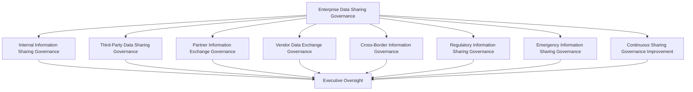
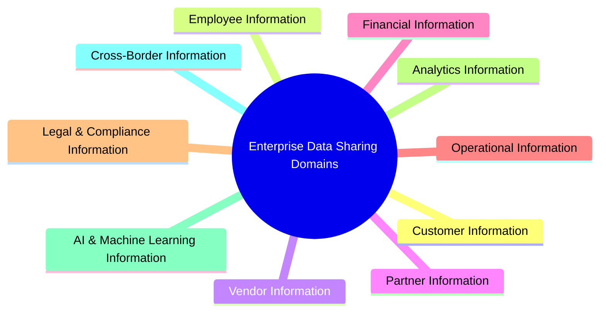
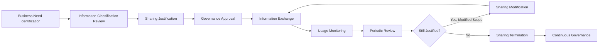
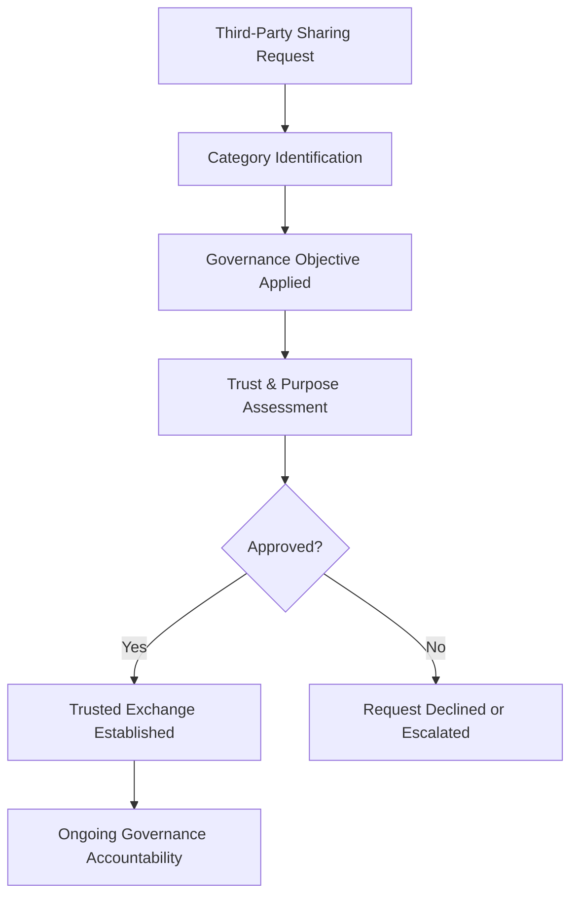
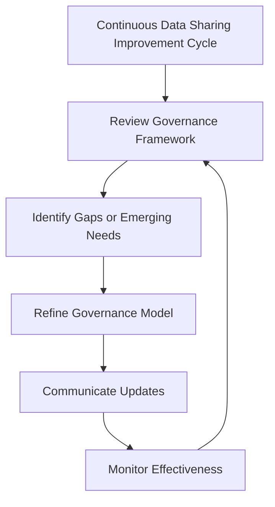

# Enterprise Data Sharing & Information Exchange Governance Strategy

## 1. Document Purpose

This document establishes the enterprise governance strategy for how StackLeo Tech Store shares information internally across functions and externally with partners, vendors, corporate customers, marketplace participants, and regulatory bodies. It defines the accountability structures, decision governance, and executive oversight that make information exchange deliberate, justified, and trustworthy.

- **Purpose of Data Sharing** — to enable the business collaboration StackLeo genuinely needs — internally and with external parties — while ensuring every exchange of information is deliberate, justified, and proportionate to its purpose.
- **Relationship with Data Protection** — `data-protection.md` governs how information is classified and protected; this document governs the additional governance layer applied at the moment information moves beyond its original custodian, whether internally or externally.
- **Relationship with Privacy Governance** — `privacy.md` establishes personal data rights and briefly acknowledges that sharing with third parties is limited to purpose-specific need; this document expands that acknowledgment into a full governance framework covering all information domains, not personal data alone, and all sharing contexts, not third parties alone.
- **Relationship with Information Security** — shared information carries the security posture of its most exposed transit point; this document ensures sharing decisions are made with security consequences in view, consistent with `security-governance.md`, without prescribing the technical security controls that protect the exchange itself.
- **Relationship with Business Collaboration** — this document exists to enable, not obstruct, the legitimate collaboration a growing multi-vendor marketplace and expanding partner ecosystem require; governance is the mechanism that makes confident collaboration possible.
- **Relationship with Regulatory Compliance** — this document establishes the governance structures through which regulatory expectations around information exchange and cross-border transfer are identified and addressed; it does not itself enumerate specific legal transfer mechanisms or jurisdictional requirements.
- **Relationship with Enterprise Governance** — data sharing governance is one expression of the broader enterprise governance model defined in `security-governance.md`, extending governance discipline into the specific domain of information exchange.

This document is implementation-independent. It does not prescribe APIs, file formats, encryption methods, transfer mechanisms, or specific technologies used to exchange information.

## 2. Data Sharing Philosophy

| Principle | Business Value |
|---|---|
| **Data Sharing as Business Enablement** | Recognizing sharing as a legitimate enabler of collaboration, rather than a risk to be minimized at all costs, keeps governance focused on enabling the business responsibly rather than obstructing it. |
| **Need-to-Know Principle** | Limiting each recipient's access to what their specific purpose requires reduces unnecessary exposure without limiting genuine collaboration. |
| **Data Minimization** | Sharing only the information genuinely necessary for a stated purpose reduces risk on both sides of every exchange. |
| **Accountability** | Assigning clear ownership for every sharing arrangement ensures someone can always explain why an exchange exists and continues. |
| **Privacy by Design** | Considering privacy implications before an exchange is established, rather than after, prevents privacy risk from becoming an afterthought. |
| **Trusted Collaboration** | Establishing sharing arrangements only with parties whose trustworthiness has been considered protects the organization's own credibility. |
| **Governance by Design** | Building governance into how sharing arrangements are proposed and approved, rather than applying it retroactively, keeps the organization consistently in control. |
| **Continuous Improvement** | Treating sharing governance as an evolving discipline keeps it aligned with a growing business, expanding partner ecosystem, and evolving regulatory landscape. |

## 3. Enterprise Data Sharing Governance Model

### Enterprise Data Sharing Governance Matrix

| Governance Layer | Purpose | Governance Scope | Business Value | Executive Expectations |
|---|---|---|---|---|
| **Internal Information Sharing Governance** | Governs how information moves between internal functions and teams. | Cross-functional information exchange within the organization. | Ensures internal collaboration remains need-to-know rather than unrestricted by default. | Expect confidence that internal information flow is neither siloed nor uncontrolled. |
| **Third-Party Data Sharing Governance** | Governs how information is shared with external organizations generally. | All external sharing arrangements not otherwise addressed by a more specific layer below. | Provides a consistent baseline for evaluating any external exchange. | Expect a defensible position on every active third-party sharing arrangement. |
| **Partner Information Exchange Governance** | Governs information exchange with strategic and marketplace partners. | Partner-specific exchange arrangements, including marketplace participants. | Supports a growing partner ecosystem without sacrificing governance discipline. | Expect partner exchange to scale sensibly as the ecosystem grows. |
| **Vendor Data Exchange Governance** | Governs information exchange with vendors and service providers. | Vendor-specific exchange arrangements tied to sourcing and operations. | Keeps vendor collaboration efficient while containing exposure. | Expect vendor exchange arrangements to be reviewed, not assumed indefinite. |
| **Cross-Border Information Governance** | Governs information exchange that crosses national or regional boundaries. | Exchanges implicating multiple jurisdictions. | Prepares the organization for the governance complexity of regional and global expansion. | Expect proactive attention to cross-border exchange as new markets activate. |
| **Regulatory Information Sharing Governance** | Governs information exchange requested or required by regulatory or government bodies. | Exchanges with a regulatory or statutory dimension. | Reduces regulatory exposure by ensuring these exchanges receive appropriate governance attention. | Expect a defensible, well-documented position on regulatory information requests. |
| **Emergency Information Sharing Governance** | Governs information exchange required under urgent or exceptional circumstances. | Time-sensitive exchanges that cannot follow the standard approval cadence. | Ensures urgent business or safety needs can be met without abandoning governance discipline entirely. | Expect even emergency exchanges to be documented and reviewed after the fact. |
| **Continuous Sharing Governance Improvement** | Governs how the data sharing governance framework itself evolves over time. | Governance review cadence, lessons learned, and framework refinement. | Keeps sharing governance relevant as the business, ecosystem, and regulatory landscape grow. | Expect periodic evidence that the governance framework itself is actively improving. |

*Diagram 1: Enterprise Data Sharing Governance Framework.*

## 4. Enterprise Data Sharing Domains

### Information Sharing Domain Matrix

| Domain | Purpose | Sharing Considerations | Business Importance | Executive Expectations |
|---|---|---|---|---|
| **Customer Information** | Enables service delivery, fulfillment, and support that require sharing with fulfillment, payment, or support partners. | Limited strictly to what each integration or service purpose requires. | Central to service quality and customer trust. | Expect customer information exchange to remain consistent with privacy commitments. |
| **Employee Information** | Enables workforce administration functions requiring information exchange, such as benefits or payroll coordination. | Balances operational necessity against employee privacy expectations. | Supports fair and efficient people operations. | Expect employee information sharing to be tightly scoped and justified. |
| **Vendor Information** | Enables sourcing, procurement, and vendor relationship coordination. | Limited to information relevant to the specific commercial relationship. | Supports effective sourcing and accountability. | Expect vendor information exchange to reflect the current, active relationship only. |
| **Partner Information** | Enables strategic and marketplace partnership coordination. | Reflects the multi-party, sometimes cross-tenant nature of partnership arrangements. | Underpins trust in a growing partner ecosystem. | Expect partner information governance to scale with ecosystem complexity. |
| **Financial Information** | Enables payment processing, reconciliation, and financial reporting exchange. | Warrants particularly conservative sharing scrutiny given its sensitivity. | Directly affects financial integrity and stakeholder trust. | Expect financial information sharing to receive the highest governance rigor. |
| **Operational Information** | Enables day-to-day operational coordination across teams and, where relevant, external providers. | Naturally broader internally, more constrained externally. | Supports efficient business operation. | Expect operational information sharing to avoid unnecessary external exposure. |
| **Legal & Compliance Information** | Enables coordination with legal counsel, auditors, and regulators. | Often subject to confidentiality and privilege considerations. | Protects the organization's legal and compliance position. | Expect legal and compliance information sharing to be tightly controlled and documented. |
| **Analytics Information** | Enables business intelligence and performance analysis, sometimes involving external analytics collaboration. | Favors aggregated or de-identified forms wherever individual identification is not required. | Supports data-driven decision-making. | Expect analytics sharing to favor minimized, de-identified information where possible. |
| **AI & Machine Learning Information** | Enables AI-assisted capability that may involve information exchange with model or platform providers. | An emerging domain requiring proactive governance attention as its scale grows. | Increasingly central to future capability and competitiveness. | Expect proactive governance attention to this domain rather than retroactive correction. |
| **Cross-Border Information** | Enables operation across multiple jurisdictions as the business expands regionally and globally. | Introduces jurisdiction-specific governance complexity beyond domestic sharing. | Enables sustainable international growth. | Expect cross-border sharing arrangements to receive dedicated governance attention as each market activates. |

*Diagram: Enterprise Data Sharing Domain Overview.*

## 5. Information Sharing Lifecycle

### Information Sharing Lifecycle Matrix

| Stage | Purpose | Governance Objectives | Business Value |
|---|---|---|---|
| **Business Need Identification** | Recognizes that a genuine business purpose exists for sharing information. | Ensure sharing begins with a real, articulable need rather than convenience. | Prevents sharing arrangements from forming without justification. |
| **Information Classification Review** | Confirms the sensitivity and classification of the information proposed for sharing. | Ensure sharing decisions account for the information's existing classification. | Keeps sharing decisions consistent with `data-protection.md`. |
| **Sharing Justification** | Documents the specific business rationale for the proposed exchange. | Ensure the rationale is explicit and defensible before approval. | Provides a clear basis for later review and audit. |
| **Governance Approval** | Formally authorizes the sharing arrangement. | Ensure sharing is never established without deliberate governance sign-off. | Prevents unauthorized or informal sharing arrangements. |
| **Information Exchange** | Recognizes the period during which the approved exchange is active. | Confirm the exchange remains consistent with its approved scope. | Ensures ongoing exchanges do not silently expand beyond their original justification. |
| **Usage Monitoring** | Observes how shared information is actually being used by the recipient. | Detect use that diverges from the original sharing justification. | Protects the organization from downstream misuse it did not anticipate. |
| **Periodic Review** | Reassesses whether the sharing arrangement remains justified. | Catch arrangements whose original justification has lapsed. | Keeps the overall sharing landscape aligned with genuine ongoing need. |
| **Sharing Modification** | Formally adjusts the scope of an existing sharing arrangement. | Ensure changes in scope go through the same governance rigor as the original approval. | Prevents scope creep from bypassing governance. |
| **Sharing Termination** | Formally concludes a sharing arrangement once its purpose no longer applies. | Ensure termination is a deliberate, documented act. | Prevents indefinite continuation of arrangements that no longer serve a purpose. |
| **Continuous Governance** | Recognizes that the lifecycle itself is subject to ongoing governance oversight. | Ensure the lifecycle model remains fit for purpose over time. | Keeps sharing governance relevant as the organization evolves. |

*Diagram 2: Information Sharing Lifecycle.*

## 6. Data Sharing Governance Principles

### Data Sharing Governance Principles Matrix

| Principle | Explanation |
|---|---|
| **Business Justification** | Every sharing arrangement is grounded in a demonstrable, stated business purpose. |
| **Data Minimization** | Only the information genuinely necessary for the stated purpose is shared. |
| **Accountability** | Every sharing arrangement has a named owner responsible for its continued justification. |
| **Traceability** | Sharing decisions can be traced back to the rationale and approval that authorized them. |
| **Auditability** | The organization can demonstrate, on request, why a given sharing arrangement exists and how it is scoped. |
| **Privacy Awareness** | Sharing decisions involving personal data are made consistent with commitments defined in `privacy.md`. |
| **Regulatory Alignment** | Sharing governance remains aware of and responsive to applicable regulatory expectations around information exchange. |
| **Continuous Improvement** | Sharing governance practice is periodically reassessed and refined. |

## 7. Third-Party Information Governance

### Third-Party Information Governance Matrix

| Third-Party Category | Governance Objective | Business Value |
|---|---|---|
| **Partner Organizations** | Ensure strategic partnership exchanges are scoped to the specific collaboration purpose. | Enables confident, well-bounded strategic collaboration. |
| **Vendors** | Ensure vendor exchanges reflect the current, active commercial relationship. | Supports efficient sourcing without unnecessary exposure. |
| **Service Providers** | Ensure exchanges with operational service providers are scoped to the service being delivered. | Enables reliance on external services without ceding governance control. |
| **Corporate Customers** | Ensure B2B and corporate sales exchanges are scoped to the commercial relationship. | Supports corporate and wholesale business growth on a governed basis. |
| **Marketplace Participants** | Ensure exchanges with marketplace sellers respect cross-tenant boundaries. | Enables a trustworthy multi-vendor marketplace as it scales. |
| **Government & Regulatory Bodies** | Ensure exchanges triggered by regulatory or government request are handled through defined governance channels. | Reduces regulatory and reputational risk. |
| **Cross-Border Organizations** | Ensure exchanges spanning jurisdictions receive dedicated governance attention. | Supports sustainable regional and global expansion. |
| **Governance Accountability** | Ensure ultimate accountability for third-party information governance rests with a named executive function. | Provides clear ownership for one of the organization's higher-risk governance domains. |

This section addresses third-party information governance from a governance-objective perspective; specific contractual and technical safeguarding procedures remain the responsibility of the organization's legal and technical functions.

*Diagram 3: Trusted Information Exchange Model.*

## 8. Executive Oversight

### Executive Oversight Matrix

| Oversight Activity | Purpose |
|---|---|
| **Data Sharing Reviews** | Confirm the overall data sharing governance framework remains coherent and effective. |
| **Executive Reporting** | Provide leadership with visibility into the state of enterprise information exchange. |
| **Risk Reviews** | Assess sharing-related risk, including oversharing, unauthorized exchange, and third-party exposure. |
| **Compliance Reviews** | Confirm regulatory expectations around information exchange are being appropriately addressed. |
| **Documentation Governance** | Confirm sharing governance documentation remains current and accurate. |
| **Audit Readiness** | Confirm the organization is prepared to demonstrate its information sharing governance on request. |

## 9. Future Readiness

| Future Direction | Readiness Consideration |
|---|---|
| **AI Collaboration** | Extends sharing governance to exchanges involving AI-assisted capability, treating them as a governed sharing domain rather than an ungoverned by-product. |
| **Global Business Expansion** | Recognizes that expansion into new markets introduces additional cross-border sharing considerations addressed through dedicated review as each market activates. |
| **Multi-Tenant Platforms** | Anticipates that a multi-vendor marketplace model introduces sharing arrangements among multiple distinct parties, requiring clear boundary governance. |
| **Cross-Border Operations** | Prepares for the governance complexity of exchanges spanning multiple jurisdictions as the business grows regionally and globally. |
| **Data Ecosystems** | Anticipates a growing web of partner, vendor, and platform relationships, each requiring its own governed sharing posture. |
| **Enterprise Scale** | Ensures the governance framework remains coherent as the volume and diversity of sharing arrangements grow substantially. |
| **Emerging Regulations** | Maintains the organizational capacity to adapt as new regulatory expectations around information exchange emerge. |
| **Trusted Digital Collaboration** | Positions sharing governance as an enabler of confident digital collaboration rather than a barrier to it. |

## 10. Data Sharing Maturity Model

### Data Sharing Maturity Model Matrix

| Level | Characteristics |
|---|---|
| **Initial** | Sharing practice is ad hoc, inconsistently justified, and largely undocumented. |
| **Managed** | Core sharing arrangements have identified owners and basic approval practices, though governance is still largely reactive. |
| **Defined** | A documented, organization-wide data sharing governance framework exists and is consistently applied across domains and third-party categories. |
| **Measured** | Sharing governance effectiveness is actively monitored, with visibility into active arrangements, usage patterns, and review cadence. |
| **Optimizing** | Sharing governance is continuously refined based on organizational learning, ecosystem growth, and regulatory evolution. |

*Diagram 6: Data Sharing Maturity Progression Model.*

## 11. Anti-Patterns

### Anti-Pattern Summary

| Anti-Pattern | Why It Is Avoided |
|---|---|
| **Oversharing** | Sharing more information than a stated purpose requires increases exposure without corresponding business benefit. |
| **Unjustified Sharing** | Arrangements without a clear business rationale cannot be defended, reviewed, or meaningfully governed. |
| **Unknown Information Ownership** | Sharing arrangements without a clear owner have no one accountable for their continued justification. |
| **Weak Third-Party Governance** | Insufficient scrutiny of external recipients exposes the organization to risk it did not knowingly accept. |
| **Poor Documentation** | Undocumented sharing rationale cannot be defended, audited, or consistently applied. |
| **Weak Executive Visibility** | Without executive oversight, sharing governance drifts from a strategic discipline into an unmonitored operational afterthought. |
| **Compliance Without Governance** | Treating sharing as a checklist of regulatory requirements, rather than a governed discipline, leaves gaps wherever regulation is silent or ambiguous. |
| **Missing Continuous Improvement** | A static sharing framework falls out of alignment with a growing, evolving business and partner ecosystem. |

## 12. Document Information

| Property | Value |
|----------|-------|
| Document | data-sharing.md |
| Version | 1.0.0 |
| Status | Active |
| Maintained By | StackLeo |
| Last Updated | 2026-07-27 |

---

### Governance Responsibility Matrix

| Role | Responsibility |
|---|---|
| Chief Data Officer (CDO) | Owns the overall enterprise data sharing governance framework and its alignment with broader data governance. |
| Chief Information Security Officer (CISO) | Ensures sharing arrangements meet security expectations, consistent with `security-governance.md`. |
| Legal/Compliance Function | Advises on contractual, regulatory, and cross-border sharing considerations, outside this document's scope. |
| Business/Domain Owners | Own the business justification and continued necessity of sharing arrangements within their domain. |
| Executive Leadership | Provides oversight, reviews governance reporting, and approves higher-risk sharing arrangements. |

*Diagram 5: Continuous Data Sharing Improvement Cycle.*

© StackLeo. All Rights Reserved.
