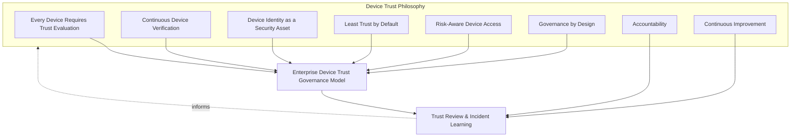
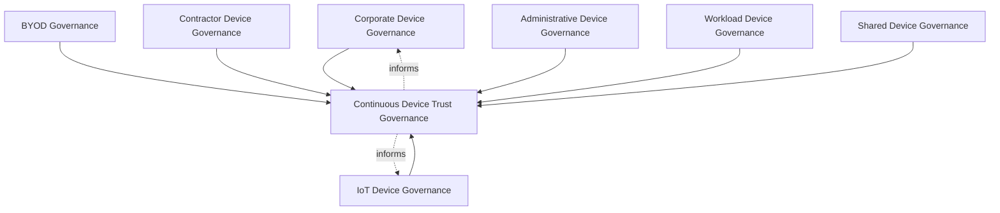
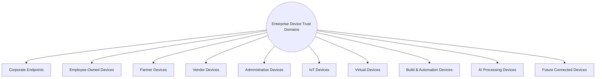
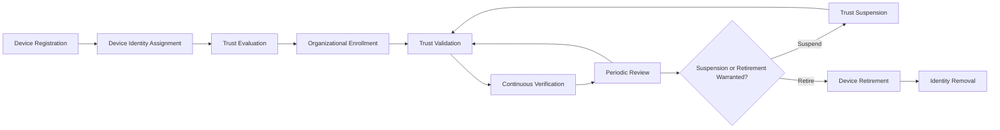
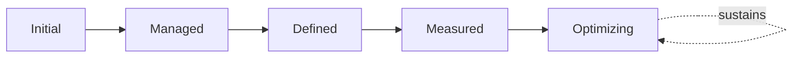
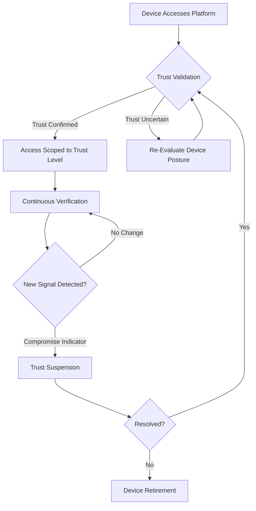
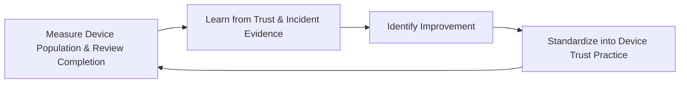

# Enterprise Device Trust Governance Strategy

## 1. Document Purpose

This document defines the official Enterprise Device Trust Governance Strategy for **StackLeo Tech Store**. It establishes dedicated governance for every device through which a request reaches the platform — corporate endpoints, employee-owned devices, partner and vendor devices, administrative devices, IoT, and future connected devices — independent of any specific MDM, EDR, endpoint security product, device management platform, cloud provider, or operating system.

Device Trust Governance is referenced in `zero-trust-strategy.md` (Section 3.2) as one of eight governance layers in the broader Zero Trust model; this document is that layer's full, dedicated elaboration. Device trust warrants this depth of treatment because a device is evaluated independently of the identity operating through it — a legitimate, well-verified identity accessing the platform from a compromised or unmanaged device still represents genuine, distinct risk that identity verification alone cannot address.

- **Purpose of Device Trust** — to ensure the device through which any request is made receives its own deliberate trust evaluation, never assumed trustworthy simply because the identity using it has been verified.
- **Relationship with Zero Trust** — this document is the dedicated elaboration of Device Trust Governance in `zero-trust-strategy.md` (Section 3.2); every principle in that framework applies here, adapted to the specific characteristics of device-level trust.
- **Relationship with Identity & Access Management** — device trust and identity trust are evaluated independently, consistent with `identity-access-management.md`; a verified identity on an untrusted device is a materially different risk than the same identity on a trusted one.
- **Relationship with Authentication** — device posture is one of the contextual signals `authentication-strategy.md` and the broader Trust Decision Lifecycle in `zero-trust-strategy.md` (Section 5.3, Context Evaluation) draw upon; this document governs how that signal is established and sustained.
- **Relationship with Authorization** — device trust level can inform the scope of what `authorization-model.md` permits a given session to do, consistent with Context-Aware Access (`authorization-model.md`, Section 2.5).
- **Relationship with Enterprise Security Governance** — this document operates within the broader governance model and executive accountability established in `security-governance.md`, applying it to a category of risk that grows as StackLeo's channels diversify beyond Web.
- **Relationship with Enterprise Risk Management** — device-related risk — unmanaged endpoints, unknown ownership, persistent trust — is tracked as a distinct category within `security-risk-management.md` (Section 4), governed here at the domain-specific level.

This document is implementation-independent and vendor-neutral. It defines device trust governance philosophy, model, domains, and lifecycle conceptually — not specific MDM, EDR, endpoint security products, device management platforms, cloud providers, operating systems, endpoint configurations, compliance rules, posture checks, certificate implementations, network controls, infrastructure settings, or deployment procedures.

## 2. Device Trust Philosophy

Device trust governance at StackLeo is built on eight principles. Each exists to produce a specific business outcome — devices are governed deliberately because they are a distinct, independent source of risk that identity trust alone cannot address.

### 2.1 Every Device Requires Trust Evaluation

No device is exempt from trust evaluation, regardless of ownership, familiarity, or how routinely it has previously accessed the platform.

- **Business Value** — closes the gap a device assumed trustworthy through habit or convenience would otherwise leave open.

### 2.2 Continuous Device Verification

Device trust, once established, is never treated as permanent; it is re-evaluated as device conditions change, consistent with Continuous Verification in `zero-trust-strategy.md` (Section 2.2).

- **Business Value** — detects a device becoming compromised after its initial trust was established, rather than relying on a single, stale assessment.

### 2.3 Device Identity as a Security Asset

Every device is treated as a deliberately managed identity in its own right, not merely an incidental extension of the human or system identity operating through it.

- **Business Value** — ensures device-specific risk is tracked and governed explicitly, rather than being invisibly absorbed into identity trust alone.

### 2.4 Least Trust by Default

A device's default trust level is the minimum reasonable for its category, never elevated by assumption or convenience.

- **Business Value** — limits the consequence of a compromised device by ensuring it never held more trust than its genuine category warranted.

### 2.5 Risk-Aware Device Access

The scope of access permitted from a given device scales with the device's genuine trust level and the sensitivity of the action requested, consistent with ISO 31000 thinking.

- **Business Value** — allows lower-trust devices (unmanaged personal devices) to still support lower-risk activity, without extending them access to the platform's most sensitive functions.

### 2.6 Governance by Design

Device trust governance structures are established deliberately as new device categories and channels are introduced, not retrofitted once ungoverned devices have already accumulated.

- **Business Value** — prevents the costly, high-visibility discovery of device trust gaps only after a compromised device has already caused harm.

### 2.7 Accountability

Every device traces to a specific, identifiable owner or custodian, never left ambiguous or anonymous.

- **Business Value** — ensures the organization can always determine who is responsible for a given device's condition and behavior.

### 2.8 Continuous Improvement

Device trust governance practice matures over time, informed by real trust review findings, incidents, and the organization's growth in channels and device diversity.

- **Business Value** — keeps device trust governance aligned with StackLeo's growth from Web toward future Mobile App, Physical Store, and POS channels.

*Diagram: Device Trust Philosophy Overview — the eight principles shape the enterprise device trust governance model, and trust review and incident learning feed back into the philosophy itself.*

## 3. Enterprise Device Trust Governance Model

Device trust governance operates across eight conceptual layers, each holding accountability for a distinct category of device.

### 3.1 Corporate Device Governance

- **Purpose** — own the trust governance of devices StackLeo directly owns and issues to employees.
- **Governance Scope** — the highest-trust-potential device category, given direct organizational ownership and control.
- **Business Value** — provides the most reliable foundation for high-trust device access to sensitive internal systems.
- **Executive Expectations** — leadership expects corporate devices to be inventoried and their trust status genuinely current.

### 3.2 BYOD Governance

- **Purpose** — own the trust governance of employee-owned devices used to access StackLeo systems.
- **Governance Scope** — coordinated with Employee-Owned Devices (Section 4.2), applying Least Trust by Default (Section 2.4) given reduced organizational control.
- **Business Value** — enables workforce flexibility without extending unmanaged devices unwarranted trust.
- **Executive Expectations** — leadership expects BYOD access to be deliberately scoped, never equivalent to corporate device trust.

### 3.3 Contractor Device Governance

- **Purpose** — own the trust governance of devices used by contracted or outsourced staff.
- **Governance Scope** — coordinated with Workforce Federation Governance in `identity-federation.md` (Section 3.1).
- **Business Value** — extends necessary access to contracted staff without assuming their devices meet corporate standards by default.
- **Executive Expectations** — leadership expects contractor device trust to be time-bound, aligned with the underlying engagement.

### 3.4 Administrative Device Governance

- **Purpose** — own the elevated trust governance rigor devices used for privileged, administrative access require.
- **Governance Scope** — coordinated with `privileged-access-management.md`, the highest-scrutiny device category in this framework.
- **Business Value** — ensures the devices capable of the greatest platform impact receive commensurately greater trust scrutiny.
- **Executive Expectations** — leadership expects administrative devices to be identifiable, dedicated, and closely monitored.

### 3.5 Workload Device Governance

- **Purpose** — own the trust governance of the infrastructure and virtual devices workloads run on.
- **Governance Scope** — coordinated with Workload Trust Governance in `zero-trust-strategy.md` (Section 3.4) and `service-accounts-management.md`.
- **Business Value** — extends device trust discipline to non-human, infrastructure-level actors, not only human-operated endpoints.
- **Executive Expectations** — leadership expects workload device trust to scale consistently as infrastructure grows.

### 3.6 IoT Device Governance

- **Purpose** — own the trust governance of connected devices with limited management capability, anticipating future POS and Physical Store channels.
- **Governance Scope** — oversight of IoT Devices (Section 4.6), acknowledging their typically constrained security posture relative to general-purpose endpoints.
- **Business Value** — prepares deliberate governance ahead of physical channel launch rather than retrofitting it afterward.
- **Executive Expectations** — leadership expects IoT device trust governance to be designed before, not after, physical channel deployment.

### 3.7 Shared Device Governance

- **Purpose** — own the trust governance of devices used by more than one individual, recognized specifically to govern their deliberate minimization.
- **Governance Scope** — treated as an exception requiring explicit justification and heightened trust scrutiny, consistent with the anti-pattern in Section 10.
- **Business Value** — protects individual accountability, since a shared device's trust cannot be tied to any single person's behavior alone.
- **Executive Expectations** — leadership expects shared devices to be actively minimized, not passively tolerated.

### 3.8 Continuous Device Trust Governance

- **Purpose** — govern the mechanism by which every other layer in this model matures over time.
- **Governance Scope** — consolidates findings from Periodic Review (Section 5.7) and executive oversight (Section 7).
- **Business Value** — prevents device trust governance itself from becoming the next thing that quietly stagnates as device diversity grows.
- **Executive Expectations** — leadership expects device trust maturity to be assessed periodically, not assumed static once established.

### Enterprise Device Trust Governance Matrix

| Layer | Purpose | Business Value | Executive Expectations |
|---|---|---|---|
| Corporate Device Governance | Own trust governance of StackLeo-owned devices | Reliable foundation for high-trust internal access | Inventoried, trust status genuinely current |
| BYOD Governance | Own trust governance of employee-owned devices | Enables flexibility without unwarranted trust | Deliberately scoped, never equivalent to corporate trust |
| Contractor Device Governance | Own trust governance of contracted staff devices | Extends access without assuming corporate standards | Time-bound, aligned with the underlying engagement |
| Administrative Device Governance | Own elevated rigor for privileged access devices | Ensures greatest-impact devices get greatest scrutiny | Identifiable, dedicated, closely monitored |
| Workload Device Governance | Own trust governance of infrastructure/virtual devices | Extends discipline to non-human, infrastructure actors | Scales consistently as infrastructure grows |
| IoT Device Governance | Own trust governance of limited-management connected devices | Prepares governance ahead of physical channel launch | Designed before, not after, physical deployment |
| Shared Device Governance | Own trust governance of multi-user devices | Protects individual accountability for device behavior | Actively minimized, not passively tolerated |
| Continuous Device Trust Governance | Govern maturation of every other layer | Prevents governance itself from stagnating | Maturity assessed periodically |

*Diagram 1: Enterprise Device Trust Governance Framework — seven domain-specific governance layers feed continuous device trust governance, which in turn informs the ongoing practice of every domain.*

## 4. Enterprise Device Trust Domains

Device trust is organized across ten conceptual domains, each requiring a somewhat different governance emphasis.

### 4.1 Corporate Endpoints

- **Purpose** — represent devices StackLeo directly owns and issues to employees, per Section 3.1.
- **Governance Scope** — the baseline reference point every other domain's relative trust level is measured against.
- **Business Importance** — provides the most reliable foundation for accessing sensitive internal systems.
- **Executive Expectations** — leadership expects a complete, current inventory of every corporate endpoint.

### 4.2 Employee-Owned Devices

- **Purpose** — represent personal devices employees use to access StackLeo systems, per Section 3.2.
- **Governance Scope** — governed with reduced default trust relative to corporate endpoints, per Least Trust by Default (Section 2.4).
- **Business Importance** — enables workforce flexibility while acknowledging genuinely reduced organizational control.
- **Executive Expectations** — leadership expects BYOD scope to be deliberately limited to lower-sensitivity access.

### 4.3 Partner Devices

- **Purpose** — represent devices used by future marketplace sellers and B2B partners.
- **Governance Scope** — coordinated with `identity-federation.md` (Section 3.3, Partner Federation Governance).
- **Business Importance** — will become foundational to safely enabling seller device access as the marketplace launches.
- **Executive Expectations** — leadership expects partner device trust governance to be designed ahead of marketplace launch.

### 4.4 Vendor Devices

- **Purpose** — represent devices used by external suppliers and service providers.
- **Governance Scope** — coordinated with `identity-federation.md` (Section 3.4, Vendor Federation Governance).
- **Business Importance** — protects the integrations the commerce experience directly depends on from untrusted vendor endpoints.
- **Executive Expectations** — leadership expects vendor device trust to be scoped narrowly to the specific integration purpose.

### 4.5 Administrative Devices

- **Purpose** — represent devices used for privileged, platform-affecting administrative access, per Section 3.4.
- **Governance Scope** — the highest-scrutiny domain in this framework.
- **Business Importance** — protects against the single highest-consequence category of device compromise.
- **Executive Expectations** — leadership expects administrative devices to be dedicated and never used for general-purpose activity.

### 4.6 IoT Devices

- **Purpose** — represent connected devices with limited management capability, anticipating future POS and Physical Store channels, per Section 3.6.
- **Governance Scope** — acknowledges typically constrained security posture relative to general-purpose endpoints.
- **Business Importance** — protects against a growing category of device risk as StackLeo's physical channels launch.
- **Executive Expectations** — leadership expects IoT device governance to be proactively designed, not retrofitted.

### 4.7 Virtual Devices

- **Purpose** — represent virtualized or containerized environments acting as a device from the platform's perspective.
- **Governance Scope** — coordinated with Workload Device Governance (Section 3.5).
- **Business Importance** — protects against virtual device trust being assumed simply because the underlying infrastructure is trusted.
- **Executive Expectations** — leadership expects virtual device trust to be evaluated independently of the host infrastructure's own trust.

### 4.8 Build & Automation Devices

- **Purpose** — represent the devices and systems participating in the software delivery pipeline.
- **Governance Scope** — coordinated with `07_DEVOPS/ci-cd-strategy.md`, treating pipeline infrastructure as a governed device category.
- **Business Importance** — protects the software supply chain from an untrusted build environment introducing compromised change.
- **Executive Expectations** — leadership expects build and automation devices to receive dedicated, elevated trust scrutiny.

### 4.9 AI Processing Devices

- **Purpose** — represent devices or compute environments performing AI-assisted processing on the platform's behalf.
- **Governance Scope** — governed under the same principles as any other device category, without prescribing any specific AI infrastructure.
- **Business Importance** — protects against the emerging risk of AI processing occurring on a device with unverified trust standing.
- **Executive Expectations** — leadership expects AI processing device governance to be established before, not after, AI capability is deployed.

### 4.10 Future Connected Devices

- **Purpose** — represent device categories not yet defined but anticipated as StackLeo's channels and business model evolve.
- **Governance Scope** — cross-cutting; ensures this framework's governance model (Section 3) can absorb genuinely new device categories.
- **Business Importance** — protects the organization's ability to adopt new channels and technologies without a governance redesign each time.
- **Executive Expectations** — leadership expects this framework to be revisited, not replaced, as new device categories emerge.

### Device Trust Domain Matrix

| Domain | Purpose | Business Importance | Executive Expectations |
|---|---|---|---|
| Corporate Endpoints | Represent StackLeo-owned, issued devices | Foundation for accessing sensitive internal systems | Complete, current inventory of every endpoint |
| Employee-Owned Devices | Represent personal devices accessing systems | Enables flexibility while acknowledging reduced control | Scope deliberately limited to lower-sensitivity access |
| Partner Devices | Represent future marketplace/B2B partner devices | Foundational to safely enabling seller device access | Designed ahead of marketplace launch |
| Vendor Devices | Represent external supplier/provider devices | Protects integrations from untrusted vendor endpoints | Scoped narrowly to specific integration purpose |
| Administrative Devices | Represent devices for privileged, platform-affecting access | Protects against the highest-consequence compromise | Dedicated, never used for general-purpose activity |
| IoT Devices | Represent limited-management connected devices | Protects against growing risk as physical channels launch | Proactively designed, not retrofitted |
| Virtual Devices | Represent virtualized/containerized environments | Protects against trust assumed from host infrastructure alone | Evaluated independently of host infrastructure trust |
| Build & Automation Devices | Represent software delivery pipeline participants | Protects the software supply chain from compromise | Dedicated, elevated trust scrutiny |
| AI Processing Devices | Represent AI-assisted processing compute environments | Protects against unverified AI processing device trust | Governance established before AI deployment |
| Future Connected Devices | Represent not-yet-defined future device categories | Protects ability to adopt new channels without redesign | Framework revisited, not replaced, as categories emerge |

*Diagram 3: Device Identity & Trust Evaluation Model (domain view) — ten domains, each requiring a governance emphasis proportionate to its trust level and business role.*

## 5. Device Trust Lifecycle

Device trust is governed across ten conceptual lifecycle stages.

### 5.1 Device Registration

- **Purpose** — formally record a device's existence before it is granted any platform access.
- **Governance Objectives** — require every device to be registered within its correct domain (Section 4) before subsequent stages proceed.
- **Business Value** — ensures device trust management begins from a complete, accurate inventory.

### 5.2 Device Identity Assignment

- **Purpose** — establish a distinct, trackable identity for the device itself, consistent with Device Identity as a Security Asset (Section 2.3).
- **Governance Objectives** — require the device identity to be distinguishable from the human or system identity operating through it.
- **Business Value** — enables device-specific risk to be tracked and governed independently of user identity.

### 5.3 Trust Evaluation

- **Purpose** — assess the device's genuine trust level based on its domain, ownership, and known posture signals.
- **Governance Objectives** — require evaluation to be documented and to directly inform Organizational Enrollment (Section 5.4).
- **Business Value** — ensures device trust is established deliberately, never assumed by default.

### 5.4 Organizational Enrollment

- **Purpose** — formally bring the evaluated device under StackLeo's governance, per its assigned trust level.
- **Governance Objectives** — require enrollment to record the device's owner and accountable custodian, consistent with Accountability (Section 2.7).
- **Business Value** — converts a trust evaluation into a genuinely governed, ongoing relationship.

### 5.5 Trust Validation

- **Purpose** — confirm the device's actual trust level matches what enrollment established, at the point of each meaningful access attempt.
- **Governance Objectives** — require validation to occur consistently, not only at initial enrollment.
- **Business Value** — ensures the trust level relied upon at access time is genuinely current, not merely historical.

### 5.6 Continuous Verification

- **Purpose** — observe and re-evaluate device trust throughout its ongoing use, consistent with Continuous Device Verification (Section 2.2).
- **Governance Objectives** — connect to `09_OPERATIONS/monitoring-observability.md` for evidentiary grounding.
- **Business Value** — detects a device becoming compromised or non-compliant after its trust was initially established.

### 5.7 Periodic Review

- **Purpose** — formally reassess whether a device's continued enrollment and trust level remain genuinely justified.
- **Governance Objectives** — require review to occur on a predictable, regular cadence, proportionate to the device's domain and trust level.
- **Business Value** — catches stale or unjustified device trust before it becomes a genuine risk.

### 5.8 Trust Suspension

- **Purpose** — deliberately and reversibly reduce or disable a device's trust without fully removing its registration, where circumstance warrants.
- **Governance Objectives** — require suspension to be a distinct, recorded state, never conflated with full retirement.
- **Business Value** — provides a proportionate response to circumstances (investigation, temporary non-compliance) that do not yet warrant full removal.

### 5.9 Device Retirement

- **Purpose** — formally remove a device's active trust and access once it is no longer legitimately in use.
- **Governance Objectives** — require retirement to be triggered promptly by the relevant event (device replacement, employee offboarding, contract end).
- **Business Value** — prevents the single most common source of device risk: a device that outlives its legitimate purpose.

### 5.10 Identity Removal

- **Purpose** — formally and finally remove the retired device's identity records once no longer needed.
- **Governance Objectives** — coordinate with `privacy.md` data minimization principles where the device is associated with personal data.
- **Business Value** — prevents indefinite accumulation of device identity records no longer serving any genuine purpose.

### Device Trust Lifecycle Matrix

| Stage | Purpose | Governance Objective | Business Value |
|---|---|---|---|
| Device Registration | Formally record a device's existence | Registered within its correct domain before access | Ensures management begins from a complete, accurate inventory |
| Device Identity Assignment | Establish a distinct, trackable device identity | Distinguishable from the operating user identity | Enables device-specific risk tracked independently |
| Trust Evaluation | Assess genuine trust level based on domain/posture | Documented, directly informs enrollment | Ensures trust is established deliberately, never assumed |
| Organizational Enrollment | Bring the device under governance per its trust level | Records owner and accountable custodian | Converts evaluation into a genuinely governed relationship |
| Trust Validation | Confirm trust level at each meaningful access attempt | Occurs consistently, not only at enrollment | Ensures trust relied upon is genuinely current |
| Continuous Verification | Observe and re-evaluate trust throughout use | Connected to observability practice | Detects a device becoming compromised after initial trust |
| Periodic Review | Reassess whether continued enrollment is justified | Predictable cadence, proportionate to domain/trust level | Catches stale or unjustified trust before it becomes risk |
| Trust Suspension | Deliberately, reversibly reduce/disable trust | A distinct, recorded state | Provides proportionate response short of full retirement |
| Device Retirement | Remove active trust once no longer in legitimate use | Triggered promptly by the relevant event | Prevents device outliving its legitimate purpose |
| Identity Removal | Finally remove records once no longer needed | Coordinated with privacy data minimization | Prevents indefinite accumulation of unneeded records |

*Diagram 2: Device Trust Lifecycle — a device proceeds from registration and identity assignment through evaluation and enrollment into ongoing validation and review, with suspension, retirement, and identity removal handling its eventual, deliberate wind-down.*

## 6. Device Trust Governance Principles

- **Explicit Trust** — no device trust exists implicitly; every device's trust level is deliberately evaluated and assigned, consistent with Section 2.1.
- **Accountability** — every device traces to a specific, identifiable owner or custodian, consistent with Section 2.7.
- **Device Ownership** — organizational, employee-owned, and external device categories are governed with trust levels proportionate to genuine organizational control.
- **Traceability** — every device's trust history — evaluation, enrollment, suspension, retirement — can be reconstructed after the fact.
- **Auditability** — device trust governance decisions and their outcomes can be independently reviewed, supporting ISO/IEC 27001-aligned assurance.
- **Risk Awareness** — device trust decisions are made with explicit awareness of the risk a given device category represents.
- **Business Alignment** — device trust policy enables genuine business need (workforce flexibility, partner access) without extending trust beyond what is warranted.
- **Continuous Improvement** — device trust governance practice matures over time, informed by real review findings and incidents.

### Device Trust Governance Principles Matrix

| Principle | Description | Business Value |
|---|---|---|
| Explicit Trust | No device trust exists implicitly | Prevents trust from accumulating without genuine evaluation |
| Accountability | Every device traces to a specific owner or custodian | Ensures someone is responsible for device condition and behavior |
| Device Ownership | Trust levels proportionate to genuine organizational control | Keeps trust assumptions honest about actual control |
| Traceability | Trust history can be reconstructed after the fact | Enables defensible, evidence-based governance decisions |
| Auditability | Decisions and outcomes independently reviewable | Supports ISO/IEC 27001-aligned assurance and audit confidence |
| Risk Awareness | Decisions made with awareness of category-specific risk | Enables deliberate, informed governance prioritization |
| Business Alignment | Policy enables genuine need without excess trust | Balances flexibility against genuine risk exposure |
| Continuous Improvement | Governance matures from real review findings | Keeps device trust governance aligned with organizational growth |

## 7. Executive Oversight

- **Device Trust Reviews** — the overall coherence of device trust governance across every domain (Section 4) is formally reviewed on a regular cadence, consistent with `zero-trust-strategy.md` (Section 7).
- **Executive Reporting** — aggregated device trust health — registered device counts, trust review completion, retirement timeliness — is reported to executive leadership, coordinated with `09_OPERATIONS/operations-metrics-kpis.md`.
- **Risk Reviews** — device-related risk from `security-risk-management.md` (Section 4) is reviewed alongside broader identity and Zero Trust risk.
- **Compliance Reviews** — device trust practice is reviewed against applicable regulatory and contractual obligations, coordinated with `compliance.md`.
- **Documentation Governance** — this framework's relationship to `zero-trust-strategy.md`, `identity-access-management.md`, and `privileged-access-management.md` is kept current as those documents evolve.
- **Audit Readiness** — device trust governance decisions, reviews, and their outcomes are maintained in a state ready for internal or external audit at any time.

### Executive Oversight Matrix

| Oversight Mechanism | Purpose | Governance Role |
|---|---|---|
| Device Trust Reviews | Confirm overall governance coherence across domains | Regular, predictable cadence for the framework as a whole |
| Executive Reporting | Provide leadership a single, coherent device trust picture | Coordinated with enterprise operational KPI reporting |
| Risk Reviews | Review device risk alongside broader identity/Zero Trust risk | Not conducted in isolation from enterprise risk visibility |
| Compliance Reviews | Confirm alignment with regulatory/contractual obligations | Reviewed jointly with `compliance.md` |
| Documentation Governance | Keep this framework's subordinate relationships current | Updated as Zero Trust and IAM docs evolve |
| Audit Readiness | Maintain decisions and reviews ready for independent review | Continuous state, not preparation-triggered |

### Governance Responsibility Matrix

| Role | Responsibility |
|---|---|
| CISO | Owns coherence and enforcement of this device trust strategy, in partnership with Security and Executive leadership. |
| Device Trust Governance Lead | Owns the governance model (Section 3) and lifecycle (Section 5) across every device domain. |
| IT / Infrastructure Lead | Owns Corporate and Administrative Device Governance (Sections 3.1, 3.4). |
| HR / People Lead | Coordinates BYOD and Contractor Device Governance (Sections 3.2–3.3) with onboarding and offboarding events. |
| Engineering Leads | Own Workload and Build & Automation Device Governance (Sections 3.5, 4.8). |
| Partner / Vendor Manager | Owns Partner and Vendor Device Governance coordination with `identity-federation.md`. |
| Executive Leadership | Reviews significant device trust risk findings and overall governance health. |
| Internal Audit / Review Function | Independently verifies that device trust governance records reflect actual practice. |

## 8. Future Readiness

This framework is designed to remain valid as StackLeo evolves in scale and architectural complexity, without requiring redefinition of its underlying philosophy.

- **AI Devices** — AI Processing Devices (Section 4.9) are governed under the same Explicit Trust and Risk-Aware Access principles (Sections 2.1, 2.5) as any other device category, established ahead of AI capability deployment.
- **Edge Computing** — this framework's governance model (Section 3) is defined independently of where compute physically occurs, so it extends naturally to edge-deployed capability without requiring redesign.
- **Cloud-Native Platforms** — Virtual and Workload Device Governance (Sections 4.7, 3.5) are defined independently of any specific cloud provider, so they apply unchanged as infrastructure evolves.
- **IoT Expansion** — IoT Device Governance (Section 3.6) is structured to absorb a growing population of connected devices as future POS and Physical Store channels launch.
- **Multi-Tenant Platforms** — where future architecture introduces tenant isolation, Partner and Vendor Device Governance extend to explicitly address per-tenant device trust boundaries.
- **Global Operations** — device trust governance remains independent of device or user location, supporting distributed operations as StackLeo expands from Bangladesh into South Asia and beyond.
- **Enterprise Scale** — the governance model, domains, and lifecycle defined in Sections 3–5 are defined independently of organizational size or device population, so they remain coherent as the device inventory grows substantially.
- **Evolving Device Threats** — Continuous Device Trust Governance (Section 3.8) and Periodic Review (Section 5.7) are structured to absorb genuinely new categories of device-level threat as they emerge.

## 9. Device Trust Maturity Model

Device trust maturity is described across five conceptual levels, adapted from established process maturity thinking and consistent with NIST Cybersecurity Framework tiers.

- **Initial** — device trust, where evaluated at all, is informal and inconsistent; devices are often trusted by default, and ownership is frequently unknown.
- **Managed** — basic device trust governance exists for individual domains, but consistency across the ten domains in Section 4 varies significantly.
- **Defined** — the governance model, domains, and lifecycle are standardized, documented, and consistently applied across the organization, consistent with the model defined throughout this document; ownership is clear organization-wide.
- **Measured** — device population, trust review completion, and retirement timeliness are measured systematically, and decisions are grounded in genuine evidence rather than qualitative impression alone.
- **Optimizing** — device trust governance is continuously and deliberately improved based on quantitative evidence and organizational learning; improvement itself is a managed, ongoing discipline rather than an occasional initiative.

### Device Trust Maturity Model Matrix

| Level | Characteristics | Primary Focus |
|---|---|---|
| Initial | Informal, inconsistent trust; devices trusted by default, ownership unknown | Ad hoc, individually-dependent device practice |
| Managed | Basic governance exists per domain; consistency varies | Domain-level consistency |
| Defined | Standardized governance model, domains, and lifecycle | Organization-wide consistency and clear ownership |
| Measured | Population, review completion, retirement timeliness measured | Evidence-based device trust governance decisions |
| Optimizing | Practice continuously and deliberately improved from evidence | Sustained, deliberate improvement as a discipline |

*Diagram 6: Device Trust Maturity Progression Model — maturity advances from informal, default-trust practice toward standardized, measured, and continuously optimized device trust governance.*

*Diagram 4: Continuous Device Verification Flow — a device's trust is validated before access is scoped accordingly, continuously monitored thereafter, and immediately suspended upon any compromise indicator pending investigation or retirement.*

*Diagram 5: Continuous Device Trust Improvement Cycle — device population health and review outcomes are measured, learned from, improved upon, and standardized back into practice, on a continuing basis.*

## 10. Anti-Patterns

The following recurring failure patterns are explicitly recognized and avoided, as each one structurally undermines this strategy.

| Anti-Pattern | Why It's Avoided |
|---|---|
| Blind Device Trust | Contradicts Every Device Requires Trust Evaluation (Section 2.1); trusting a device without genuine evaluation leaves a compromised or unmanaged endpoint indistinguishable from a trustworthy one. |
| Unknown Device Ownership | Contradicts Accountability (Section 2.7); a device with no identifiable owner has no one responsible for its condition or behavior. |
| Unmanaged BYOD | Contradicts Least Trust by Default (Section 2.4); personal devices granted trust equivalent to corporate endpoints extend organizational access to devices genuinely outside organizational control. |
| Persistent Device Trust | Contradicts Continuous Device Verification (Section 2.2); a device trusted once and never re-evaluated may have become compromised long after that initial trust was established. |
| Weak Lifecycle Governance | Undermines the Device Trust Lifecycle (Section 5); skipping stages, particularly Retirement, leaves device access outliving its legitimate purpose. |
| Poor Documentation | Undermines Documentation Governance (Section 7) and Traceability (Section 6), leaving device trust decisions unclear or unverifiable after the fact. |
| Weak Executive Visibility | Undermines Executive Reporting (Section 7); without genuine visibility, leadership cannot make informed decisions about the organization's device-related risk exposure. |
| Missing Continuous Improvement | Contradicts Continuous Improvement (Section 2.8, Section 3.8); without deliberate improvement, device trust governance stagnates as device diversity and channels grow. |

## 11. Document Information

| Property | Value |
|----------|-------|
| Document | device-trust.md |
| Version | 1.0.0 |
| Status | Active |
| Maintained By | StackLeo |
| Last Updated | 2026-07-24 |

---

© StackLeo. All Rights Reserved.
