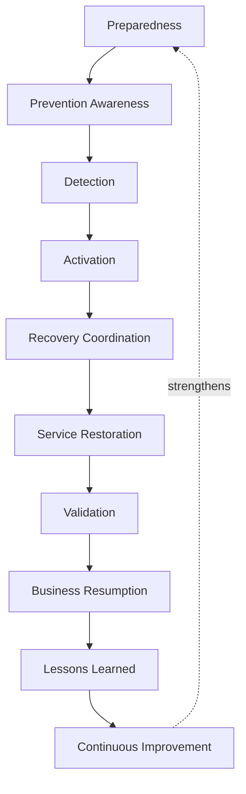
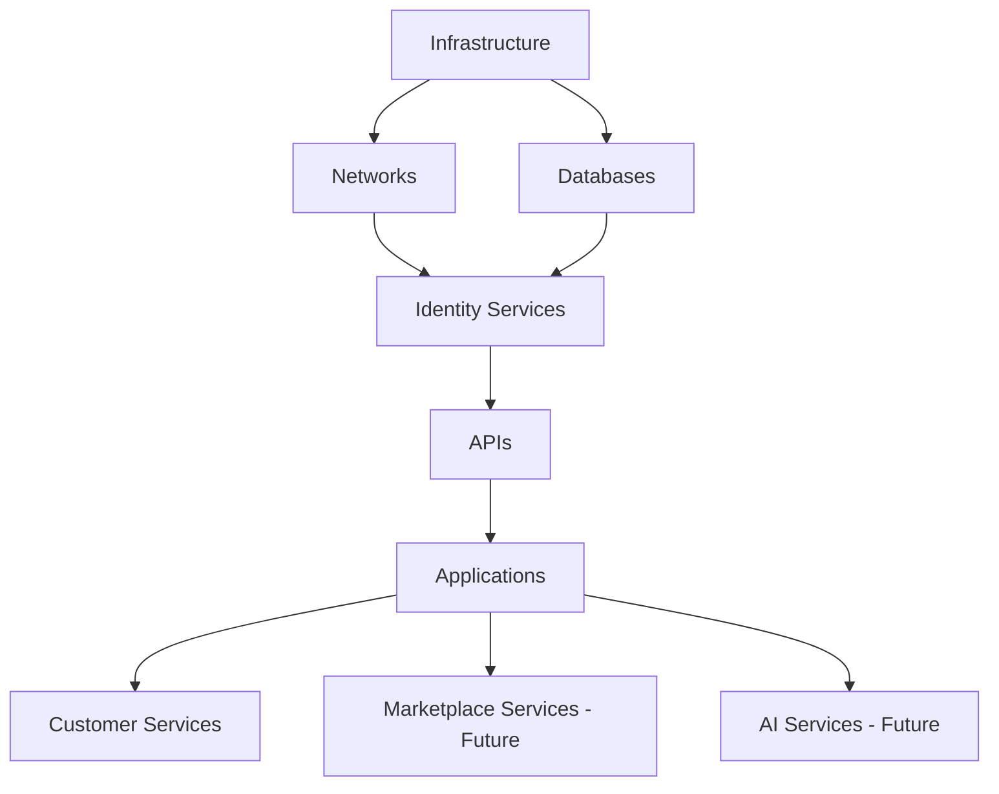
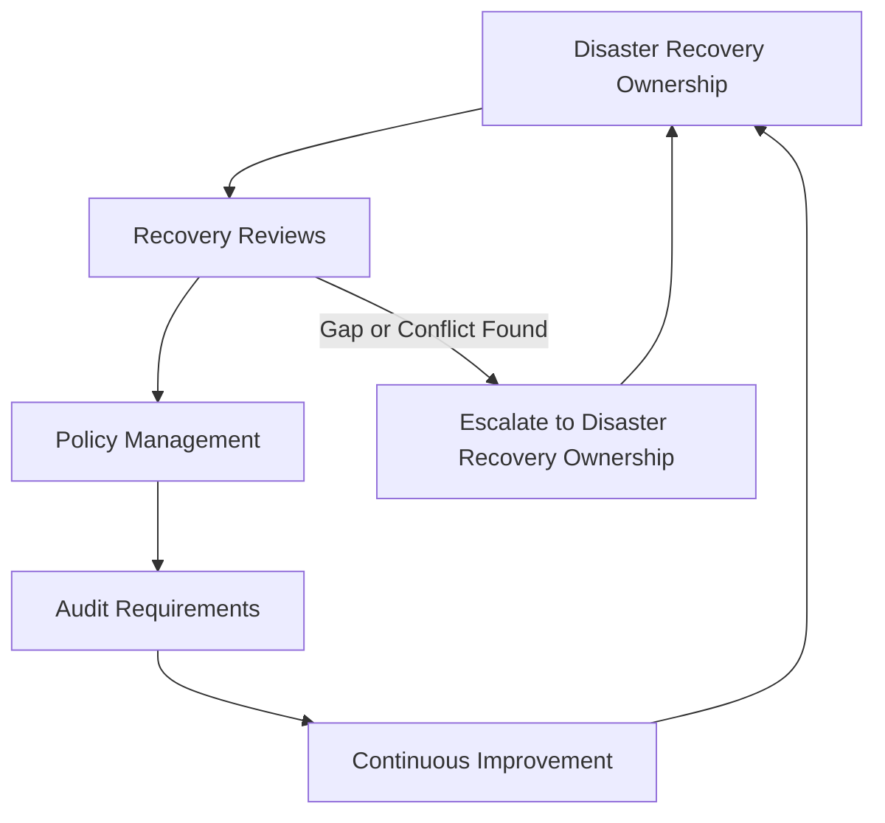
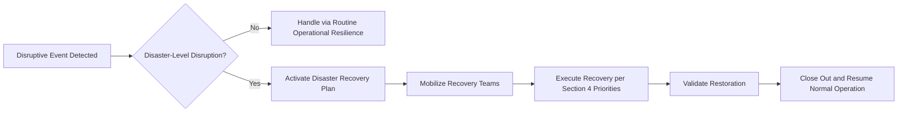

# Disaster Recovery

## 1. Document Purpose

This document defines the official Enterprise Disaster Recovery Strategy for **StackLeo Tech Store**. It establishes how the organization recovers critical business capability after a disruptive event significant enough to threaten normal operation.

- **Purpose of Disaster Recovery** — to ensure that when a disruption exceeds what routine operational resilience can absorb, the organization has a clear, practiced path back to serving customers, rather than an improvised one.
- **Relationship with Business Continuity** — disaster recovery is the technical and operational restoration discipline that business continuity depends upon; it answers *how systems come back*, while continuity planning answers *how the business keeps functioning* through the disruption.
- **Relationship with Incident Response** — a security incident, per `incident-response.md`, may escalate into a disaster requiring this strategy's recovery lifecycle; the two disciplines are coordinated, with incident response managing the security event and disaster recovery managing restoration of affected capability.
- **Relationship with Enterprise Resilience** — this document operationalizes Resilience by Design and Business Resilience from `security-principles.md` (Sections 2, 9) specifically for severe, disruptive events.
- **Relationship with Customer Trust** — how quickly and confidently StackLeo recovers from disruption is directly visible to customers; a well-executed recovery preserves the trust described in `01_Business/vision.md`, while a prolonged or chaotic one erodes it.

This document is implementation-independent and vendor-neutral. It defines disaster recovery philosophy, lifecycle, and governance — not specific backup products, cloud-provider recovery configurations, recovery scripts, or code.

## 2. Disaster Recovery Philosophy

- **Resilience by Design** — recovery capability is designed into the platform's architecture from the outset, not assembled reactively after a disruptive event, consistent with `security-architecture.md` (Section 2).
- **Recovery Readiness** — the organization maintains a clear, practiced understanding of how it will recover before a disaster occurs, mirroring Preparedness First in `incident-response.md` (Section 2).
- **Business Continuity Alignment** — recovery priorities are set by business impact, not merely technical convenience, coordinated with `03_System_Design/resilience-strategy.md`.
- **Risk-Based Planning** — recovery investment is proportionate to the business consequence of each capability's unavailability, consistent with `security-principles.md` (Section 5).
- **Continuous Improvement** — recovery capability matures through deliberate testing and lessons learned, never assumed adequate simply because it was once designed.
- **Operational Sustainability** — recovery plans account for the realistic capacity of the people who must execute them, not only the technical steps involved.

## 3. Disaster Recovery Lifecycle

| Phase | Objectives | Business Value |
|---|---|---|
| Preparedness | Establish recovery plans, priorities, and practiced readiness before a disaster occurs. | Reduces confusion and delay when a disruptive event actually happens. |
| Prevention Awareness | Maintain awareness of conditions that could lead to a disaster, informing proactive risk reduction. | Reduces the likelihood some disruptions materialize at all. |
| Detection | Recognize that a disruption has occurred or is occurring at a scale requiring disaster recovery activation. | Enables recovery to begin as early as possible. |
| Activation | Formally invoke the disaster recovery plan and mobilize the necessary teams. | Ensures a clear, decisive transition from routine operation to recovery mode. |
| Recovery Coordination | Coordinate the specific technical and operational steps required to restore affected capability. | Ensures recovery proceeds in a structured, prioritized sequence rather than ad hoc. |
| Service Restoration | Bring affected capability back into operation. | Directly restores the business's ability to serve customers. |
| Validation | Confirm restored capability is genuinely functioning correctly and securely before declaring recovery complete. | Prevents a premature return to normal operation that later fails again. |
| Business Resumption | Return fully to normal business operation, including any deferred business processes. | Completes the return to steady-state, not merely technical uptime. |
| Lessons Learned | Review what happened, how recovery performed, and what should improve. | Converts a costly event into durable improvement in future readiness. |
| Continuous Improvement | Apply lessons learned to future preparedness, plans, and testing. | Ensures recovery capability compounds over time rather than resetting after each event. |

*Diagram 1: Disaster Recovery Lifecycle.*

### Disaster Recovery Lifecycle Matrix

| Phase | Trigger | Primary Concern |
|---|---|---|
| Preparedness | Ongoing, before any disaster | Ensuring plans and priorities are defined and practiced |
| Prevention Awareness | Ongoing risk monitoring | Reducing likelihood of disruption where feasible |
| Detection | A significant disruption signal appears | Recognizing the scale requires disaster recovery activation |
| Activation | Detection confirms disaster-level disruption | Formally mobilizing recovery teams and process |
| Recovery Coordination | Plan is activated | Sequencing restoration according to priority (Section 4) |
| Service Restoration | Coordination is underway | Bringing affected capability back into operation |
| Validation | Capability appears restored | Confirming genuine, correct, and secure function before closure |
| Business Resumption | Validation confirms restoration | Returning fully to normal business operation |
| Lessons Learned | Business resumption is complete | Extracting durable improvement from the event |
| Continuous Improvement | Lessons are captured | Applying them to future plans and testing |

## 4. Recovery Scope

| Capability | Business Importance | Recovery Priority | Operational Considerations |
|---|---|---|---|
| Applications | Directly delivers the customer- and staff-facing commerce experience. | Critical | Restoration order coordinated with dependent APIs and data services. |
| APIs | Carries the contracts through which channels and partners interact with the platform. | Critical | Must be restored in coordination with the services they front. |
| Databases | Holds the authoritative state of every business process. | Critical | Recovery must preserve data integrity, per Section 6. |
| Infrastructure | Provides the runtime environment for every other capability. | Critical | Underlying foundation; other capability cannot recover without it. |
| Networks | Provides communication paths between components and to customers. | Critical | Must be restored before dependent services can be reached. |
| Identity Services | Verifies who is acting across every other capability. | Critical | Without identity services, no other capability can be safely accessed. |
| Customer Services | Supports customer inquiries and issue resolution during disruption. | High | Sustains customer confidence while technical recovery proceeds. |
| Marketplace Services (Future) | Will support third-party seller operations. | High (Future) | Recovery must account for seller-facing continuity once launched. |
| AI Services (Future) | Supports AI-assisted capability (search, recommendations, fraud detection). | Moderate | Degradable gracefully; core commerce can often continue without it temporarily. |

### Recovery Scope Matrix

| Capability | Dependency Relationship |
|---|---|
| Applications | Depend on APIs, Identity Services, and Infrastructure |
| APIs | Depend on Databases, Identity Services, and Networks |
| Databases | Depend on Infrastructure and Storage-layer recovery |
| Infrastructure | Foundational; no dependency on other listed capability |
| Networks | Foundational; required for all other capability to be reachable |
| Identity Services | Depend on Databases and Infrastructure; required by all other capability |
| Customer Services | Depend on Applications and Identity Services being at least partially restored |
| Marketplace Services (Future) | Will depend on Applications, APIs, and Identity Services |
| AI Services (Future) | Depend on Applications and Data Services; gracefully degradable |

*Diagram 3: Enterprise Recovery Architecture — foundational layers must be restored before the capability depending on them can recover.*

## 5. Recovery Objectives

- **Recovery Time Objective (RTO)** — the maximum acceptable duration of disruption before a given capability must be restored, set according to its business criticality rather than technical convenience.
- **Recovery Point Objective (RPO)** — the maximum acceptable amount of data loss, measured in time, that the business can tolerate for a given capability.
- **Recovery Prioritization** — capabilities are restored in an order reflecting their dependency relationships (Section 4) and business criticality, not restored arbitrarily or in the order most convenient technically.
- **Critical Business Services** — the smallest set of capability required to resume serving customers in some meaningful form is identified explicitly, so recovery has a clear initial target rather than an all-or-nothing goal.
- **Service Dependencies** — recovery objectives account for the dependency chain in Section 4, since a capability cannot genuinely recover faster than the foundation it depends upon.

This document intentionally does not define specific RTO or RPO target values, which are business-sensitive figures determined through dedicated business impact analysis and maintained outside this architectural document.

### Recovery Objective Summary

| Concept | What It Determines |
|---|---|
| Recovery Time Objective (RTO) | Maximum acceptable duration of disruption per capability |
| Recovery Point Objective (RPO) | Maximum acceptable data loss per capability |
| Recovery Prioritization | Sequence in which capability is restored |
| Critical Business Services | Minimum capability required to resume meaningful customer service |
| Service Dependencies | How the restoration sequence is constrained by underlying dependencies |

## 6. Backup & Recovery Awareness

- **Backup Governance** — backups are created, protected, and retained under clear ownership, coordinated with `04_Database/backup-recovery.md`.
- **Data Integrity** — restored data is verified to be accurate and complete, not merely present, before recovery is considered successful.
- **Recovery Validation** — the recovery process itself is validated to confirm it genuinely restores capability to a correct, trustworthy state.
- **Retention Awareness** — backup retention aligns with the retention principles in `04_Database/data-retention.md` and `data-protection.md` (Section 5), avoiding both premature loss and unnecessary indefinite retention.
- **Recovery Testing Awareness** — recovery capability is periodically tested rather than assumed to work when first designed, consistent with Continuous Improvement (Section 2).
- **Secure Recovery Principles** — recovery does not bypass the security principles (identity, authorization, data protection) that apply during normal operation; a disaster is never treated as justification for relaxing security discipline.

### Backup Governance Matrix

| Concern | Governance Expectation |
|---|---|
| Backup Governance | Backups have a clear, accountable owner |
| Data Integrity | Restored data is verified accurate and complete |
| Recovery Validation | The recovery process itself is confirmed to work correctly |
| Retention Awareness | Backup retention aligns with data protection and retention principles |
| Recovery Testing Awareness | Recovery capability is periodically tested, not assumed |
| Secure Recovery Principles | Security discipline is maintained throughout recovery, not relaxed |

## 7. Operational Resilience

- **Crisis Coordination** — a disaster is managed through clear, predefined coordination roles, mirroring `incident-response.md` (Section 6) but scaled to the broader operational impact a disaster represents.
- **Operational Continuity** — recovery prioritizes restoring the business's ability to operate, coordinated with `03_System_Design/resilience-strategy.md`.
- **Customer Communication Awareness** — customers affected by a disaster receive accurate, timely communication, coordinated through a single accountable voice, consistent with `incident-response.md` (Section 6).
- **Cross-Team Coordination** — recovery spans Engineering, Operations, Customer Support, and business stakeholders, requiring coordination beyond any single team's normal scope.
- **Service Confidence** — recovery is judged not only by technical restoration but by whether customer and stakeholder confidence in the platform is genuinely restored.
- **Improvement Planning** — recovery concludes with a concrete, tracked plan for the improvements identified during Lessons Learned (Section 3).

*Diagram 4: Operational Resilience Framework.*

## 8. Future Readiness

This strategy is deliberately structured to remain valid as StackLeo's platform and organization evolve:

- **Cloud-Native Platforms** — the recovery scope and objectives in Sections 4–5 apply consistently regardless of the specific cloud-native services adopted.
- **Multi-Region Deployments** — recovery planning extends naturally to failover between regions as StackLeo's infrastructure footprint grows internationally.
- **Multi-Cloud** — disaster recovery principles remain independent of any specific provider, supporting the multi-cloud posture referenced in `security-principles.md` (Section 10).
- **Microservices** — as decomposition into more services increases the number of independently recoverable components, this strategy's dependency-aware prioritization (Section 4) becomes more valuable, not less.
- **Marketplace Platform** — Marketplace Services (Section 4) are already anticipated as a recovery scope category, allowing seller-facing continuity to be planned ahead of launch.
- **AI Infrastructure** — AI Services (Section 4) are treated as gracefully degradable, allowing core commerce recovery to proceed without waiting on AI capability restoration.
- **Enterprise Customers** — corporate and wholesale customers bring heightened expectations for recovery assurance and communication, which this strategy's coordination principles (Section 7) are structured to satisfy.
- **Global Expansion** — recovery scope and objectives remain jurisdiction-agnostic, allowing region-specific continuity obligations to layer on as StackLeo expands from Bangladesh into South Asia and beyond.

## 9. Governance

- **Disaster Recovery Ownership** — the Security Lead, in coordination with Operations and Infrastructure Engineering leads, owns the coherence of this disaster recovery strategy.
- **Recovery Reviews** — recovery plans and their underlying assumptions are reviewed periodically and whenever significant architectural or business change occurs.
- **Policy Management** — operational disaster recovery policies are derived from this strategy and maintained consistently with `security-governance.md`.
- **Audit Requirements** — recovery testing outcomes and actual recovery events are recorded consistently with `security-principles.md` (Section 9).
- **Continuous Improvement** — this strategy is expected to mature as the platform's architecture, scale, and disaster history evolve.

*Diagram 5: Disaster Recovery Governance Model.*

*Diagram 2: Recovery Activation Flow.*

### Governance Responsibility Matrix

| Role | Responsibility |
|---|---|
| Security Lead | Owns coherence and enforcement of the disaster recovery strategy. |
| Operations Lead | Executes recovery testing and coordinates activation. |
| Infrastructure Engineering Leads | Own recovery of infrastructure, network, and platform capability. |
| Solution Architect | Ensures recovery scope reflects `03_System_Design/deployment-architecture.md`. |
| Executive Leadership | Accountable for setting recovery priorities and risk tolerance. |
| Internal Audit / Review Function | Independently verifies disaster recovery practice matches this strategy. |

## 10. Anti-Patterns

| Anti-Pattern | Why It's Avoided |
|---|---|
| No Recovery Planning | Contradicts Recovery Readiness (Section 2); forces recovery design to happen during the disaster itself. |
| Untested Recovery Process | Assumes a recovery plan works without verifying it, contradicting Recovery Testing Awareness (Section 6). |
| Weak Backup Governance | Leaves Backup Governance (Section 6) unmanaged, threatening the very foundation recovery depends upon. |
| Poor Documentation | Prevents recovery plans from being executed consistently or reviewed for improvement. |
| Missing Ownership | Leaves recovery planning without an accountable party, guaranteeing inconsistent readiness over time (Section 9). |
| Weak Cross-Team Coordination | Leaves recovery fragmented across teams without clear roles, contradicting Section 7. |
| Reactive Recovery | Treats disaster recovery as something improvised in the moment rather than a prepared, practiced discipline. |
| No Continuous Improvement | Allows the same recovery weaknesses to persist across multiple events, contradicting Section 2. |

## 11. Document Information

| Property | Value |
|----------|-------|
| Document | disaster-recovery.md |
| Version | 1.0.0 |
| Status | Active |
| Maintained By | StackLeo |
| Last Updated | 2026-07-17 |

---

© StackLeo. All Rights Reserved.
