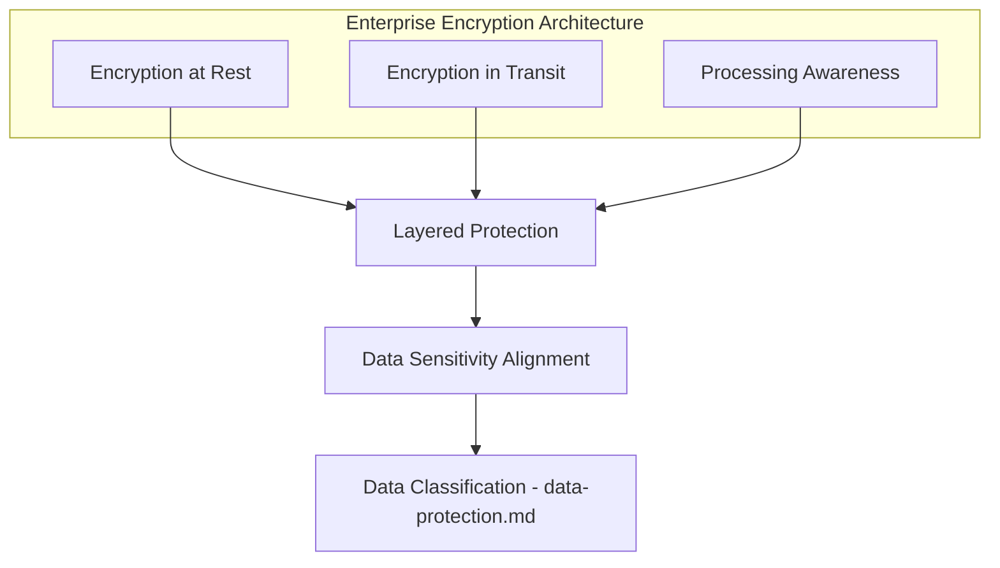
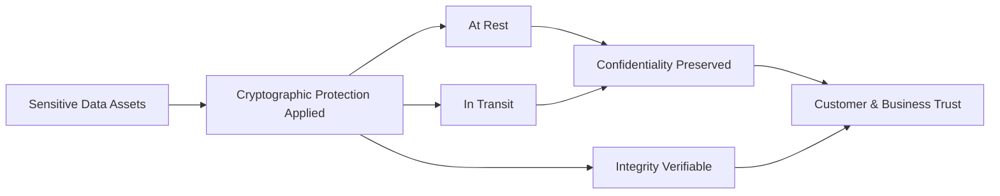
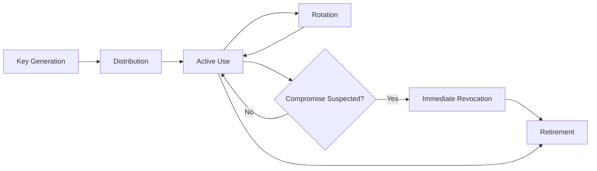
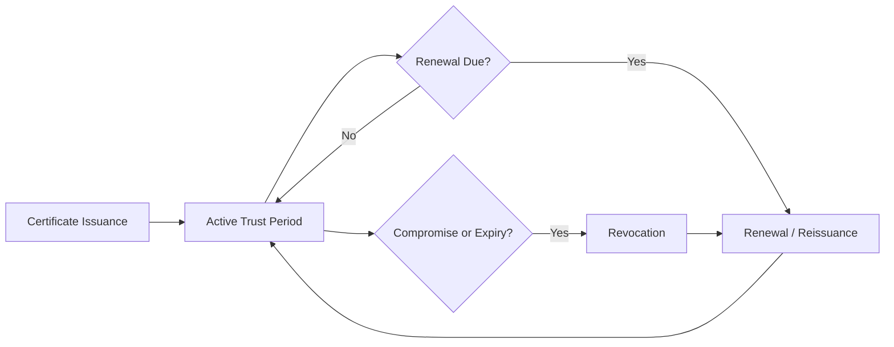
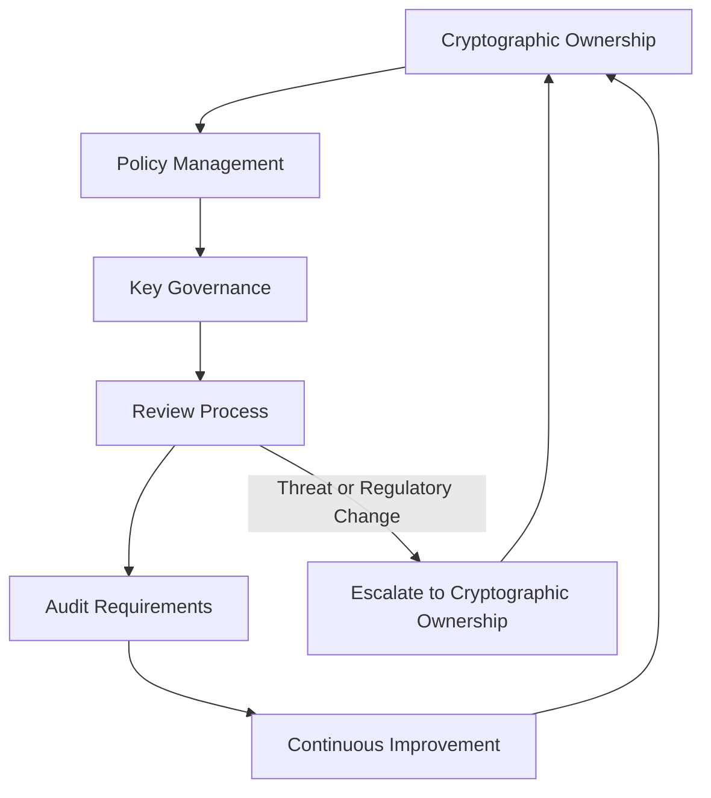

# Encryption

## 1. Document Purpose

This document defines the official Enterprise Cryptography and Encryption Strategy for **StackLeo Tech Store**. It establishes the principles governing how cryptographic controls protect sensitive information across the platform, while remaining adaptable to future technological evolution.

- **Purpose of Encryption** — to ensure that sensitive data remains protected even if another safeguard fails or is bypassed, providing a layer of protection intrinsic to the data itself rather than dependent solely on perimeter or access controls.
- **Relationship with Data Protection** — encryption is one of the safeguards through which `data-protection.md` achieves Confidentiality and Integrity (Section 3 of that document); this document elaborates the cryptographic dimension of that broader strategy.
- **Relationship with Privacy** — encryption is a technical means of honoring the privacy commitments described in `data-protection.md` (Section 6); protecting data cryptographically is part of using it responsibly.
- **Relationship with Customer Trust** — customers extend StackLeo their payment relationship and personal data; cryptographic protection is a structural way of making that trust well-founded, consistent with `01_Business/vision.md`.
- **Relationship with Compliance** — this strategy supports the compliance obligations defined in `01_Business/business-rules.md` (Section 17) and elaborated in `compliance.md`, many of which presume cryptographic protection of sensitive categories of data.

This document is implementation-independent and vendor-neutral. It defines cryptographic philosophy, principles, and governance — not specific algorithms, key sizes, products, or implementation procedures.

## 2. Cryptography Philosophy

- **Confidentiality** — cryptographic protection ensures that data remains unintelligible to any party without legitimate access, regardless of how it is otherwise exposed.
- **Integrity** — cryptographic techniques allow unauthorized modification of data to be detected, not merely discouraged.
- **Authenticity** — cryptographic techniques allow the origin of data or a communication to be verified, distinguishing legitimate sources from impersonation.
- **Non-Repudiation** — cryptographic evidence can establish that a specific action or communication genuinely originated from a specific party, supporting accountability.
- **Cryptographic Agility** — the platform's cryptographic approach is designed to be replaceable and upgradable over time, since no cryptographic method remains appropriate indefinitely.
- **Long-Term Protection** — data with a long useful or sensitive life is protected with awareness that cryptographic strength must remain adequate for the full duration that protection matters, not only at the point of initial protection.

## 3. Encryption Principles

- **Encryption at Rest**
  - *Purpose* — protect stored data from unauthorized access if storage itself is compromised or improperly accessed.
  - *Business Value* — limits the consequence of a storage-layer compromise to unintelligible data rather than a direct exposure.
  - *Protection Goals* — Confidentiality and Integrity of data while stored, proportionate to its classification per `data-protection.md` (Section 4).
- **Encryption in Transit**
  - *Purpose* — protect data as it moves between components, layers, channels, or third parties.
  - *Business Value* — prevents interception or tampering while data is in motion across a network path that may not be fully trusted end-to-end.
  - *Protection Goals* — Confidentiality and Integrity of data during transmission, consistent with `data-protection.md` (Section 5).
- **Encryption During Processing (Conceptual Awareness)**
  - *Purpose* — recognize that data being actively processed may be exposed in a way that at-rest and in-transit protection alone does not address.
  - *Business Value* — informs architectural awareness of processing-time exposure as a distinct consideration, particularly for the most sensitive data categories.
  - *Protection Goals* — minimizing the window and scope of data exposure during active computation.
- **Layered Protection**
  - *Purpose* — treat encryption as one layer among several, consistent with Defense in Depth (`security-architecture.md`, Section 5), never as a sole safeguard.
  - *Business Value* — ensures that a weakness in one cryptographic control does not become the sole point of failure.
  - *Protection Goals* — resilience of overall data protection even if a single cryptographic safeguard is compromised.
- **Data Sensitivity Alignment**
  - *Purpose* — apply cryptographic protection intensity proportionate to data classification, per `data-protection.md` (Section 4).
  - *Business Value* — focuses cryptographic investment where business consequence is greatest, rather than uniformly.
  - *Protection Goals* — Restricted and Confidential data receive the strongest, most rigorously governed protection.

### Encryption Principle Summary

| Principle | Primary Concern | Business Outcome |
|---|---|---|
| Encryption at Rest | Protecting stored data from storage-layer compromise | Limits consequence of unauthorized storage access |
| Encryption in Transit | Protecting data while moving across networks | Prevents interception or tampering in motion |
| Encryption During Processing | Awareness of exposure during active computation | Informs architecture for the most sensitive processing |
| Layered Protection | Avoiding reliance on a single cryptographic safeguard | Preserves protection despite a single control's failure |
| Data Sensitivity Alignment | Matching protection intensity to classification | Focuses investment on highest-consequence data |

*Diagram 1: Enterprise Encryption Architecture — encryption principles combine into a layered protection posture aligned with data classification.*

## 4. Cryptographic Asset Categories

| Category | Sensitivity | Protection Priority | Business Importance |
|---|---|---|---|
| Customer Data | High | Critical | Directly tied to the customer trust relationship described in `01_Business/vision.md`. |
| Authentication Information | Highest | Critical | Compromise undermines every downstream access decision (`authentication.md`). |
| Payment Information | Highest | Critical | Directly financial; highest fraud and regulatory sensitivity. |
| Business Records | Moderate–High | High | Reflects core commercial operation and decision-making. |
| Audit Logs | High | High | The record of accountability; must resist tampering to remain trustworthy. |
| Configuration Secrets | Highest | Critical | Compromise can affect the security of every dependent system, per `secrets-management.md`. |
| Backup Data | High | High | Must be protected to the same standard as primary data; often overlooked. |
| Future Marketplace Data | High (Future) | High | Introduces cross-tenant seller data requiring the same rigor as customer data. |

### Cryptographic Asset Classification

| Sensitivity Tier | Assets |
|---|---|
| Highest | Authentication Information, Payment Information, Configuration Secrets |
| High | Customer Data, Audit Logs, Backup Data, Future Marketplace Data |
| Moderate–High | Business Records |

*Diagram 5: Data Protection Through Encryption — cryptographic protection of sensitive assets translates directly into preserved trust.*

## 5. Key Management Principles

- **Key Lifecycle** — cryptographic keys move through a defined lifecycle from creation through retirement, mirroring the discipline applied to identities in `identity-management.md` (Section 4).
- **Key Generation Awareness** — keys are generated in a manner appropriate to their sensitivity and intended use, with awareness that weak generation undermines every protection built upon the key.
- **Distribution Principles** — keys are made available only to the specific systems or identities with a legitimate need to use them, consistent with Least Privilege.
- **Rotation Awareness** — keys are expected to be replaced periodically or in response to suspected compromise, limiting the useful lifespan of any single key.
- **Revocation** — a key can be invalidated immediately when known or suspected to be compromised, independent of its normal rotation schedule.
- **Retirement** — retired keys are handled in a manner that ensures data previously protected by them remains appropriately protected or is re-protected under a current key.
- **Separation of Duties** — no single individual holds unilateral control over the full key lifecycle for the most sensitive cryptographic assets, consistent with `security-principles.md` (Section 3.8).

*Diagram 2: Key Lifecycle.*

### Key Lifecycle Overview

| Stage | Description | Primary Concern |
|---|---|---|
| Generation | Key is created for a specific, defined purpose. | Ensuring generation is appropriate to the key's sensitivity. |
| Distribution | Key is made available to systems or identities with legitimate need. | Preventing unnecessary exposure during distribution. |
| Active Use | Key is used to protect or verify data. | Sustained, least-privilege access to the key. |
| Rotation | Key is periodically or proactively replaced. | Limiting the useful lifespan of any single key. |
| Revocation | Key is invalidated in response to suspected compromise. | Ensuring revocation takes effect immediately and completely. |
| Retirement | Key is permanently retired at the end of its purpose. | Ensuring data previously protected remains appropriately protected. |

## 6. Certificate & Trust Concepts

- **Digital Certificates** — provide a verifiable way to associate an identity with a cryptographic key, underpinning trusted communication between parties.
- **Trust Relationships** — certificates are trusted only to the extent the issuing authority and validation process are themselves trustworthy, consistent with the trust-boundary treatment in `security-architecture.md` (Section 4).
- **Certificate Lifecycle** — certificates move through issuance, active use, renewal, and revocation, mirroring the key lifecycle in Section 5.
- **Identity Validation** — certificates support verifying that a communicating party is genuinely who it claims to be, complementing the identity verification described in `authentication.md`.
- **Secure Communications** — certificates underpin the establishment of protected communication channels between customers, the platform, and third parties, consistent with Encryption in Transit (Section 3).

*Diagram 3: Certificate Trust Lifecycle.*

### Certificate Lifecycle Summary

| Stage | Description | Primary Concern |
|---|---|---|
| Issuance | Certificate is issued binding identity to a cryptographic key. | Ensuring the issuing process itself is trustworthy. |
| Active Trust Period | Certificate is relied upon for identity validation and secure communication. | Sustaining confidence that the certificate remains valid and uncompromised. |
| Renewal | Certificate is replaced before its trust period lapses. | Avoiding a gap in protected communication capability. |
| Revocation | Certificate is invalidated due to compromise or no longer being warranted. | Ensuring revoked certificates are no longer relied upon anywhere. |

## 7. Digital Integrity Concepts

- **Digital Signatures** — provide a means of associating an action or piece of data with a specific, verifiable origin, supporting Non-Repudiation (Section 2).
- **Data Integrity** — cryptographic techniques allow any unauthorized modification of protected data to be detected, reinforcing the Integrity property of the CIA Triad described in `data-protection.md` (Section 3).
- **Authenticity Verification** — recipients of data or communication can confirm it genuinely originated from the claimed source, reducing the risk of impersonation-based threats described in `threat-model.md` (Section 5).
- **Tamper Detection** — modification of protected data becomes evident rather than silent, supporting timely response consistent with `security-principles.md` (Section 9).

These concepts provide significant business value — protecting order integrity, financial record accuracy, and audit trail trustworthiness — without requiring any specific mechanism to be prescribed here.

## 8. Future Cryptographic Readiness

This strategy is deliberately structured to remain valid as StackLeo's platform and the broader cryptographic landscape evolve:

- **Cryptographic Agility** — the platform's approach favors replaceable cryptographic building blocks, consistent with the philosophy in Section 2, allowing methods to be upgraded without a ground-up redesign.
- **Quantum Computing Awareness** — StackLeo maintains organizational awareness that advances in quantum computing may eventually weaken cryptographic methods considered strong today, informing forward-looking planning rather than reactive response.
- **Post-Quantum Transition Planning** — cryptographic agility (above) is the structural precondition for an eventual, deliberate transition to post-quantum-appropriate methods when warranted.
- **Global Expansion** — cryptographic principles remain jurisdiction-agnostic, allowing region-specific cryptographic or key-residency obligations to layer on as StackLeo expands from Bangladesh into South Asia and beyond.
- **Public APIs** — data exchanged with external API consumers, per `05_API/api-strategy.md`, is protected under the same encryption-in-transit principles as internal traffic.
- **Marketplace Platform** — Future Marketplace Data (Section 4) is already anticipated as requiring the same cryptographic rigor as customer data.
- **AI Systems** — data used by AI-assisted capability remains subject to the same classification-proportionate cryptographic protection as any other use, consistent with `security-principles.md` (Section 10).

## 9. Governance

- **Cryptographic Ownership** — the Security Lead owns the coherence of this cryptography strategy, consistent with the ownership model in `security-architecture.md` (Section 10).
- **Policy Management** — operational cryptographic policies derived from this strategy are maintained consistently with it and with `security-governance.md`.
- **Key Governance** — key lifecycle events (Section 5), especially generation, rotation, and revocation, are governed by an accountable owner distinct from routine key use, consistent with Separation of Duties.
- **Review Process** — cryptographic practice is reviewed periodically and whenever a material change occurs in the threat landscape (including the awareness described in Section 8) or applicable regulation.
- **Audit Requirements** — key and certificate lifecycle events are recorded consistently with `security-principles.md` (Section 9).
- **Continuous Improvement** — this strategy is expected to mature as cryptographic best practice, business scale, and regulatory context evolve.

*Diagram 4: Cryptographic Governance Framework.*

### Governance Responsibility Matrix

| Role | Responsibility |
|---|---|
| Security Lead | Owns coherence and enforcement of the cryptography strategy. |
| Key Governance Owner | Owns key lifecycle oversight, distinct from routine key use (Separation of Duties). |
| Engineering Leads | Apply encryption principles consistently within their domain. |
| Data Protection Owner | Ensures cryptographic protection aligns with data classification in `data-protection.md`. |
| Internal Audit / Review Function | Independently verifies cryptographic practice matches this strategy. |
| Executive Leadership | Accountable for long-term cryptographic risk, including post-quantum transition timing. |

## 10. Anti-Patterns

| Anti-Pattern | Why It's Avoided |
|---|---|
| No Encryption Strategy | Leaves protection of sensitive data dependent entirely on other, non-cryptographic safeguards, contradicting Layered Protection (Section 3). |
| Weak Protection of Sensitive Data | Fails to align protection intensity with sensitivity, contradicting Data Sensitivity Alignment (Section 3) and the classification in `data-protection.md`. |
| Poor Key Governance | Leaves the safeguard protecting all encrypted data itself inadequately protected or accounted for (Section 5). |
| Static Cryptographic Practices | Contradicts Cryptographic Agility (Section 2); leaves the platform unable to respond as cryptographic best practice evolves. |
| Ignoring Certificate Lifecycle | Allows trust relationships to lapse or persist beyond their legitimate validity, undermining Secure Communications (Section 6). |
| No Key Rotation Awareness | Extends the useful lifespan of a potentially compromised key indefinitely, contradicting Section 5. |
| Poor Documentation | Prevents cryptographic practice from being consistently applied, audited, or improved over time. |
| No Governance | Leaves cryptographic practice without an accountable owner or review mechanism (Section 9). |

## 11. Document Information

| Property | Value |
|----------|-------|
| Document | encryption.md |
| Version | 1.0.0 |
| Status | Active |
| Maintained By | StackLeo |
| Last Updated | 2026-07-17 |

---

© StackLeo. All Rights Reserved.
