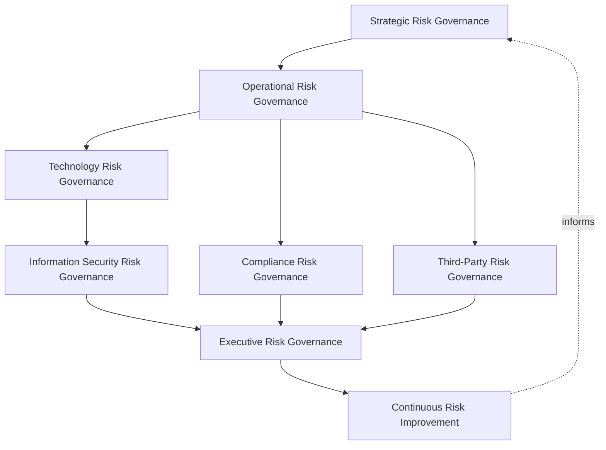
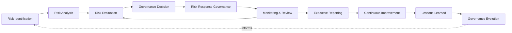
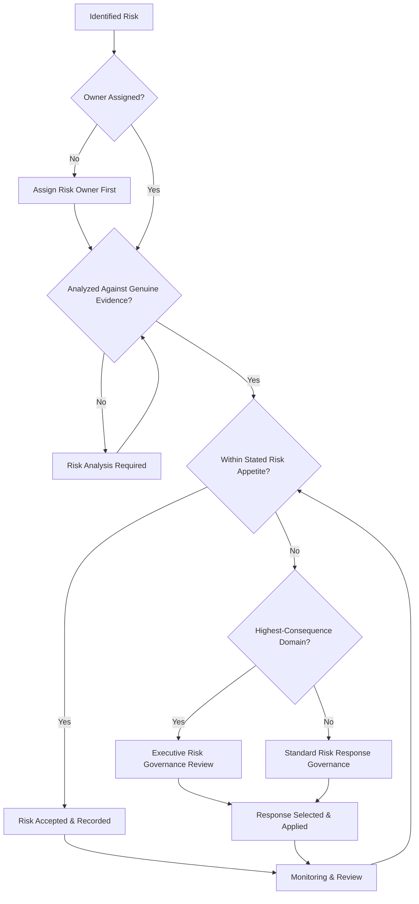
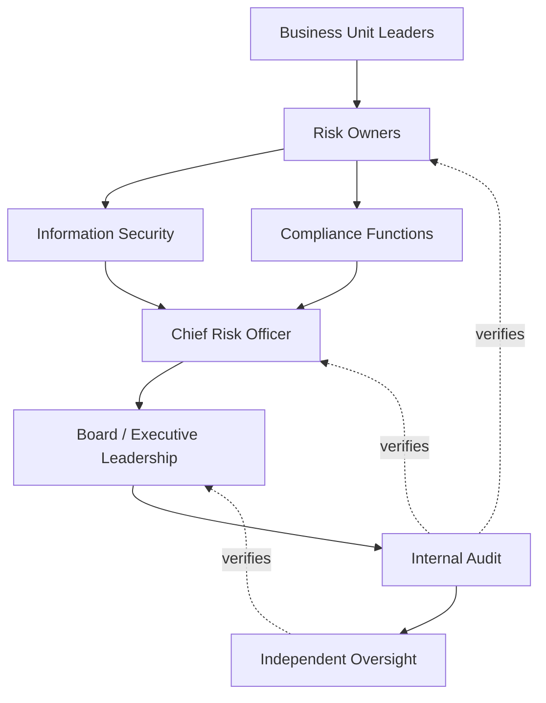
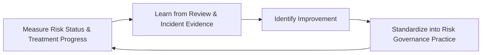
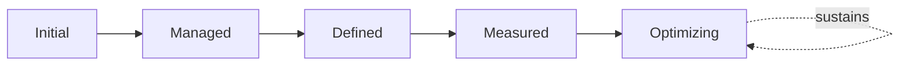

# Enterprise Risk Management Strategy

## 1. Document Purpose

This document defines the official Enterprise Risk Management (ERM) Strategy for **StackLeo Tech Store** — the Board/CRO-owned executive charter under which every category of business risk StackLeo carries is governed as a deliberate, accountable organizational discipline. It establishes enterprise risk governance, organizational risk ownership, risk culture, strategic risk governance, executive oversight, risk-informed decision-making, and long-term enterprise risk maturity, consistent with ISO 31000, COSO Enterprise Risk Management, ISO/IEC 27001, and TOGAF enterprise architecture thinking.

`risk-management.md` remains the operational governance framework for enterprise risk practice — the document that elaborates in full operational depth the governance model, domains, lifecycle, and risk appetite framework every specialized risk discipline in `06_Security` rolls up into. This document sits above it as the highest-level executive mandate: it does not restate operational detail, it establishes the philosophy, organizational ownership, and executive expectations that give risk governance its authority and continuity at the level of the Board and executive leadership.

- **Purpose of Enterprise Risk Management** — to ensure every category of risk StackLeo carries — strategic, operational, financial, technological, and beyond — is understood and decided upon deliberately by accountable people, weighed consistently against the business's stated risk appetite, and never left as an implicit, unexamined assumption embedded in day-to-day decisions.
- **Relationship with Corporate Governance** — enterprise risk management is a core function of corporate governance, providing the risk visibility the organization's governance structures depend on to direct and control the business responsibly.
- **Relationship with Information Security** — `security-risk-management.md` is the ISO 31000/27005-aligned elaboration of this strategy's principles specifically for security and cyber risk; this document does not restate that lifecycle, it establishes the enterprise-wide appetite, governance layers, and domains that security risk, alongside every other risk discipline, rolls up into.
- **Relationship with Compliance Governance** — `compliance.md` governs how regulatory and contractual obligations are tracked and satisfied; this strategy ensures compliance risk is weighed within the same enterprise risk visibility as every other risk category, rather than assessed in isolation.
- **Relationship with Business Strategy** — risk treatment decisions are made in direct service of `01_Business/business-model.md` and `01_Business/vision.md`, ensuring the business can pursue growth — corporate sales, wholesale, the multi-vendor marketplace — with risk knowingly and deliberately managed, not blindly accepted or reflexively avoided.
- **Relationship with Enterprise Architecture** — this strategy provides the risk visibility architectural decisions in `03_System_Design/architecture-principles.md` are made against, ensuring architecture and risk appetite remain consistent with one another.
- **Relationship with Executive Decision-Making** — this strategy exists to make risk one of the deliberate, visible inputs to every significant executive decision, not a factor considered only after a decision has already been made.

This document is implementation-independent and vendor-neutral. It defines enterprise risk governance philosophy, model, domains, and lifecycle conceptually — not specific GRC platforms, risk management software, cloud providers, consulting firms, insurance products, security vendors, compliance tools, risk registers, assessment methodologies, scoring formulas, infrastructure configurations, deployment architectures, mitigation workflows, operational procedures, or code.

## 2. Enterprise Risk Management Philosophy

Enterprise risk management at StackLeo rests on eight principles. Each exists to produce a specific business outcome — risk is governed deliberately because every business decision carries risk implicitly, whether or not that risk is ever made explicit.

### 2.1 Risk as a Business Consideration

Risk is treated as a normal, expected dimension of every business decision, never a specialized concern confined to a single function.

- **Business Value** — ensures risk is weighed wherever decisions are actually made, not only within a risk function disconnected from the business.

### 2.2 Risk-Informed Decision Making

Significant decisions are made with genuine visibility into their risk implications, consistent with the risk appetite this strategy establishes.

- **Business Value** — ensures leadership decisions are made with eyes open to their consequences, not in avoidable ignorance of them.

### 2.3 Governance Before Control

Risk governance — who decides, who owns, who is accountable — is established before the specific controls that treat a given risk are selected.

- **Business Value** — ensures controls exist because a genuine, governed risk decision called for them, not as an ad hoc technical response.

### 2.4 Shared Accountability

Risk is not the sole responsibility of any single function; every part of the organization that creates or bears risk shares accountability for its governance.

- **Business Value** — prevents risk from being treated as someone else's problem by the very functions best positioned to manage it.

### 2.5 Risk Ownership

Every identified risk has a specific, named, accountable owner responsible for its continued treatment and status.

- **Business Value** — ensures no risk exists without someone genuinely responsible for deciding what happens to it.

### 2.6 Business Enablement

Risk management exists to let the business pursue growth — from single-seller B2C toward corporate sales, wholesale, and the multi-vendor marketplace — with risk knowingly managed, not to obstruct legitimate ambition.

- **Business Value** — keeps risk governance genuinely followed rather than resented as an obstacle to growth.

### 2.7 Organizational Resilience

Risk governance exists in part to ensure the organization can withstand and recover from adverse events, not only to avoid them.

- **Business Value** — protects business continuity even when a genuine risk StackLeo accepted or could not fully avoid eventually materializes.

### 2.8 Continuous Improvement

Risk management practice matures over time, informed by real risk events, incidents, and the organization's growth in scale and complexity.

- **Business Value** — keeps enterprise risk management aligned with StackLeo's growth in scale, market reach, and business model complexity.

## 3. Enterprise Risk Governance Model

Enterprise risk governance operates across eight conceptual layers, each holding accountability for a distinct category of business risk. Every layer here is elaborated in full operational depth in `risk-management.md`.

### 3.1 Strategic Risk Governance

- **Purpose** — own the coherence of how risk to StackLeo's business strategy and growth ambitions is identified and governed.
- **Governance Scope** — oversight of Strategic Risk (Section 4.1), coordinated with `01_Business/business-model.md`.
- **Business Value** — ensures the business's growth ambitions are pursued with genuine awareness of what could derail them.
- **Executive Expectations** — leadership trusts strategic risk is discussed alongside, not separately from, strategic opportunity.

### 3.2 Operational Risk Governance

- **Purpose** — own the coherence of how risk to day-to-day business operation is identified and governed.
- **Governance Scope** — oversight of Operational Risk (Section 4.2), spanning fulfillment, logistics, and customer service.
- **Business Value** — protects the operational reliability customers directly experience.
- **Executive Expectations** — leadership trusts operational risk is monitored continuously, not only after a disruption occurs.

### 3.3 Technology Risk Governance

- **Purpose** — own the coherence of how risk arising from the platform's technology and architecture is identified and governed.
- **Governance Scope** — oversight of Technology Risk (Section 4.4), coordinated with `03_System_Design/architecture-principles.md`.
- **Business Value** — ensures technology decisions are made with genuine risk visibility, not purely technical preference.
- **Executive Expectations** — leadership trusts technology risk is weighed before, not after, significant architectural decisions.

### 3.4 Information Security Risk Governance

- **Purpose** — own the coherence of how cyber and information security risk rolls up into enterprise risk visibility.
- **Governance Scope** — oversight of Cybersecurity Risk (Section 4.5), elaborated in full in `security-risk-management.md`.
- **Business Value** — ensures security risk is weighed alongside every other category of business risk, not siloed as a purely technical concern.
- **Executive Expectations** — leadership trusts security risk receives the same executive visibility as any other significant risk category.

### 3.5 Compliance Risk Governance

- **Purpose** — own the coherence of how regulatory and contractual compliance risk is identified and governed.
- **Governance Scope** — oversight of Compliance Risk (Section 4.6), coordinated with `compliance.md`.
- **Business Value** — protects the business's standing with regulators, partners, and enterprise customers.
- **Executive Expectations** — leadership trusts compliance risk is assessed proactively, not discovered through a regulatory finding.

### 3.6 Third-Party Risk Governance

- **Purpose** — own the coherence of how risk introduced by external vendors, partners, and future marketplace sellers is identified and governed.
- **Governance Scope** — oversight of Third-Party and Supply Chain Risk (Sections 4.7–4.8), coordinated with `identity-federation.md`.
- **Business Value** — ensures external relationships are entered into with genuine awareness of the risk they introduce.
- **Executive Expectations** — leadership expects third-party risk to be assessed before, not after, a relationship is established.

### 3.7 Executive Risk Governance

- **Purpose** — own executive-level accountability for the risk decisions carrying the greatest organizational consequence.
- **Governance Scope** — oversight spanning Sections 3.1–3.6 wherever a risk matter rises to genuine executive or Board concern.
- **Business Value** — ensures the most consequential risk decisions are visible at the level accountable for the organization as a whole.
- **Executive Expectations** — leadership expects to be informed of, not surprised by, the organization's most significant risks.

### 3.8 Continuous Risk Improvement

- **Purpose** — govern the mechanism by which every other layer in this model matures over time.
- **Governance Scope** — consolidates findings from risk reviews, incidents, and audits across every domain in Section 4.
- **Business Value** — prevents risk governance itself from becoming the next thing that quietly stagnates as the organization scales.
- **Executive Expectations** — leadership expects risk management maturity to be assessed periodically, not assumed static once established.

### Enterprise Risk Governance Matrix

| Layer | Purpose | Business Value | Executive Expectations |
|---|---|---|---|
| Strategic Risk Governance | Own coherence of risk to business strategy and growth | Ensures ambitions pursued with awareness of what could derail them | Trusts strategic risk discussed alongside strategic opportunity |
| Operational Risk Governance | Own coherence of risk to day-to-day operation | Protects operational reliability customers directly experience | Trusts risk monitored continuously, not only after disruption |
| Technology Risk Governance | Own coherence of risk from platform technology and architecture | Ensures decisions made with genuine risk visibility | Trusts risk weighed before significant architectural decisions |
| Information Security Risk Governance | Own coherence of how cyber risk rolls into enterprise visibility | Ensures security risk weighed alongside every other category | Trusts security risk gets the same visibility as other risk |
| Compliance Risk Governance | Own coherence of regulatory and contractual risk | Protects standing with regulators, partners, enterprise customers | Trusts risk assessed proactively, not discovered via finding |
| Third-Party Risk Governance | Own coherence of risk from external relationships | Ensures relationships entered into with genuine risk awareness | Expects risk assessed before a relationship is established |
| Executive Risk Governance | Own executive accountability for highest-consequence decisions | Ensures the most consequential decisions are visible to leadership | Expects leadership informed of, not surprised by, top risks |
| Continuous Risk Improvement | Govern maturation of every other layer | Prevents governance itself from stagnating | Expects maturity to be assessed periodically |

*Diagram 1: Enterprise Risk Governance Framework — strategic and operational risk governance establish the foundation, technology, security, compliance, and third-party governance apply it across specialized domains, and executive oversight converges on continuous improvement that feeds back into the model.*

## 4. Enterprise Risk Domains

Enterprise risk is governed across ten conceptual domains, each requiring a distinct governance emphasis.

### 4.1 Strategic Risk

- **Purpose** — represent risk to StackLeo's core business strategy and growth ambitions.
- **Governance Considerations** — governed under Strategic Risk Governance (Section 3.1), coordinated with `01_Business/business-model.md`.
- **Business Importance** — protects the ambitions — corporate sales, wholesale, the multi-vendor marketplace — the business is actively pursuing.
- **Executive Expectations** — leadership expects strategic risk to be discussed at the same table as strategic opportunity.

### 4.2 Operational Risk

- **Purpose** — represent risk to day-to-day operation — fulfillment, logistics, customer service.
- **Governance Considerations** — governed under Operational Risk Governance (Section 3.2).
- **Business Importance** — protects the operational reliability customers directly experience.
- **Executive Expectations** — leadership expects operational risk indicators to be monitored continuously.

### 4.3 Financial Risk

- **Purpose** — represent risk to StackLeo's financial position and integrity.
- **Governance Considerations** — governed under Executive Risk Governance (Section 3.7), given its direct relevance to Board-level oversight.
- **Business Importance** — protects the business's financial sustainability and its standing with financial partners.
- **Executive Expectations** — leadership expects financial risk to be reviewed with the same rigor as strategic risk.

### 4.4 Technology Risk

- **Purpose** — represent risk arising from the platform's technology, architecture, and technical dependencies.
- **Governance Considerations** — governed under Technology Risk Governance (Section 3.3), coordinated with `03_System_Design/architecture-principles.md`.
- **Business Importance** — protects the platform's ability to reliably serve customers across every current and future channel.
- **Executive Expectations** — leadership expects technology risk to inform, not merely follow, significant architectural decisions.

### 4.5 Cybersecurity Risk

- **Purpose** — represent risk to the confidentiality, integrity, and availability of the platform and its data.
- **Governance Considerations** — governed under Information Security Risk Governance (Section 3.4), elaborated fully in `security-risk-management.md`.
- **Business Importance** — protects the trust customers place in the platform with their data and transactions.
- **Executive Expectations** — leadership expects cybersecurity risk to be reported alongside every other significant enterprise risk category.

### 4.6 Compliance Risk

- **Purpose** — represent risk of failing to meet regulatory or contractual obligation.
- **Governance Considerations** — governed under Compliance Risk Governance (Section 3.5), coordinated with `compliance.md`.
- **Business Importance** — protects the business's standing with regulators, partners, and enterprise customers.
- **Executive Expectations** — leadership expects compliance risk to be assessed proactively as obligations evolve.

### 4.7 Third-Party Risk

- **Purpose** — represent risk introduced by external vendors, service providers, and partners.
- **Governance Considerations** — governed under Third-Party Risk Governance (Section 3.6), coordinated with `identity-federation.md`.
- **Business Importance** — protects the business from risk it does not directly control but is nonetheless exposed to.
- **Executive Expectations** — leadership expects third-party risk to be assessed before, not after, a relationship begins.

### 4.8 Supply Chain Risk

- **Purpose** — represent risk to the suppliers and logistics relationships the commerce experience depends on.
- **Governance Considerations** — governed under Third-Party Risk Governance (Section 3.6), anticipating growth in supplier and wholesale relationships.
- **Business Importance** — protects the business's ability to reliably source and deliver the products it sells.
- **Executive Expectations** — leadership expects supply chain risk to be reviewed as sourcing relationships evolve.

### 4.9 Reputational Risk

- **Purpose** — represent risk to the trust and public standing central to StackLeo's brand.
- **Governance Considerations** — governed under Executive Risk Governance (Section 3.7), given its inherently cross-cutting nature.
- **Business Importance** — protects the trust relationship every customer transaction and business partnership depends on.
- **Executive Expectations** — leadership expects reputational risk to be weighed explicitly, not treated as a secondary consequence of other risk.

### 4.10 Emerging & AI Risk

- **Purpose** — represent risk from AI-assisted capability and other genuinely new categories of risk as they emerge.
- **Governance Considerations** — governed under Continuous Risk Improvement (Section 3.8) as a distinct, explicitly monitored category.
- **Business Importance** — protects against risk categories that established governance may not yet have anticipated.
- **Executive Expectations** — leadership expects emerging risk to be actively scanned for, not discovered only once it has already materialized.

### Enterprise Risk Domain Matrix

| Domain | Purpose | Business Importance | Executive Expectations |
|---|---|---|---|
| Strategic Risk | Represent risk to core business strategy and growth ambitions | Protects the ambitions the business is actively pursuing | Discussed at the same table as strategic opportunity |
| Operational Risk | Represent risk to day-to-day fulfillment and operation | Protects the operational reliability customers experience | Indicators monitored continuously |
| Financial Risk | Represent risk to financial position and integrity | Protects financial sustainability and partner standing | Reviewed with the same rigor as strategic risk |
| Technology Risk | Represent risk from technology, architecture, dependencies | Protects the platform's ability to reliably serve customers | Informs, not merely follows, architectural decisions |
| Cybersecurity Risk | Represent risk to confidentiality, integrity, availability | Protects customer trust in data and transactions | Reported alongside every other significant risk category |
| Compliance Risk | Represent risk of failing regulatory/contractual obligation | Protects standing with regulators, partners, enterprise customers | Assessed proactively as obligations evolve |
| Third-Party Risk | Represent risk from external vendors and partners | Protects against risk the business doesn't directly control | Assessed before, not after, a relationship begins |
| Supply Chain Risk | Represent risk to suppliers and logistics relationships | Protects the ability to reliably source and deliver products | Reviewed as sourcing relationships evolve |
| Reputational Risk | Represent risk to trust and public standing | Protects the trust every transaction and partnership depends on | Weighed explicitly, not as a secondary consequence |
| Emerging & AI Risk | Represent risk from AI and other genuinely new categories | Protects against risk not yet anticipated by established governance | Actively scanned for, not discovered after materializing |

## 5. Enterprise Risk Lifecycle

Risk is governed across ten conceptual lifecycle stages, applicable across every domain in Section 4.

### 5.1 Risk Identification

- **Purpose** — recognize that a genuine risk exists and requires governance.
- **Governance Objectives** — require identification to draw from multiple sources — strategic planning, operational experience, incidents, audits — never a single narrow channel.
- **Business Value** — ensures risk is surfaced deliberately, not only after it has already caused harm.

### 5.2 Risk Analysis

- **Purpose** — understand a risk's genuine causes, consequences, and likelihood.
- **Governance Objectives** — require analysis to be evidence-based, never assumed from intuition alone.
- **Business Value** — ensures decisions about a risk are grounded in genuine understanding, not surface-level impression.

### 5.3 Risk Evaluation

- **Purpose** — determine whether a risk's significance warrants treatment, and with what priority.
- **Governance Objectives** — require evaluation to be weighed against the organization's stated risk appetite.
- **Business Value** — ensures treatment effort is directed toward the risks that genuinely matter most.

### 5.4 Governance Decision

- **Purpose** — formally decide how a given risk will be handled.
- **Governance Objectives** — require the decision to trace to a specific, accountable owner, consistent with Risk Ownership (Section 2.5).
- **Business Value** — ensures every risk has an explicit, deliberate decision behind its treatment, never an implicit default.

### 5.5 Risk Response Governance

- **Purpose** — govern how the chosen response to a risk — accept, treat, transfer, or avoid — is carried out.
- **Governance Objectives** — require the response to genuinely match the governance decision, never diverge in practice from what was decided.
- **Business Value** — ensures decisions about risk actually translate into the treatment that was genuinely intended.

### 5.6 Monitoring & Review

- **Purpose** — sustain awareness of a risk's status after its initial treatment decision.
- **Governance Objectives** — require monitoring to occur on a cadence proportionate to the risk's significance.
- **Business Value** — catches a risk whose status has genuinely changed before its treatment becomes outdated.

### 5.7 Executive Reporting

- **Purpose** — communicate risk status, trends, and significant findings to executive leadership and the Board.
- **Governance Objectives** — require reporting to occur on a predictable cadence, consistent with Section 8.
- **Business Value** — ensures leadership maintains genuine visibility into the organization's risk posture over time.

### 5.8 Continuous Improvement

- **Purpose** — apply lessons from risk outcomes to strengthen future identification, analysis, and treatment.
- **Governance Objectives** — require findings to be genuinely analyzed for recurring patterns, not treated as isolated, one-off exceptions.
- **Business Value** — turns each risk cycle into an input that makes the next cycle, and the organization's risk maturity, genuinely better.

### 5.9 Lessons Learned

- **Purpose** — formally capture what a realized risk event or near-miss reveals about the organization's risk governance itself.
- **Governance Objectives** — require lessons to be documented and attributed to specific governance implications, not left as informal institutional memory.
- **Business Value** — ensures the organization genuinely learns from experience rather than repeating the same governance gaps.

### 5.10 Governance Evolution

- **Purpose** — formally evolve this strategy's model, domains, and lifecycle based on accumulated organizational learning.
- **Governance Objectives** — require evolution to be a deliberate, periodic decision, consistent with Governance Reviews (Section 8).
- **Business Value** — keeps risk governance itself from becoming the next thing that silently drifts out of relevance.

### Enterprise Risk Lifecycle Matrix

| Stage | Purpose | Governance Objective | Business Value |
|---|---|---|---|
| Risk Identification | Recognize a genuine risk exists and requires governance | Draws from multiple sources, never a single narrow channel | Ensures risk is surfaced deliberately, not after harm |
| Risk Analysis | Understand a risk's causes, consequences, and likelihood | Evidence-based, never assumed from intuition alone | Ensures decisions grounded in genuine understanding |
| Risk Evaluation | Determine whether significance warrants treatment | Weighed against the organization's stated risk appetite | Directs treatment effort toward what genuinely matters most |
| Governance Decision | Formally decide how a risk will be handled | Traces to a specific, accountable owner | Ensures every risk has an explicit, deliberate decision |
| Risk Response Governance | Govern how the chosen response is carried out | Response genuinely matches the governance decision | Ensures decisions actually translate into intended treatment |
| Monitoring & Review | Sustain awareness of status after treatment decision | Cadence proportionate to the risk's significance | Catches changed status before treatment becomes outdated |
| Executive Reporting | Communicate status, trends, findings to leadership | Occurs on a predictable cadence | Ensures leadership maintains genuine visibility over time |
| Continuous Improvement | Apply lessons to strengthen future practice | Findings genuinely analyzed for recurring patterns | Makes each cycle, and organizational maturity, better |
| Lessons Learned | Capture what events reveal about governance itself | Documented and attributed to specific governance implications | Ensures genuine learning rather than repeated gaps |
| Governance Evolution | Evolve the strategy based on accumulated learning | A deliberate, periodic decision | Prevents governance itself from drifting out of relevance |

*Diagram 2: Enterprise Risk Lifecycle — a risk proceeds from identification through analysis and evaluation into a governed decision and response, with ongoing monitoring and executive reporting feeding continuous improvement, lessons learned, and governance evolution back into the cycle.*

## 6. Enterprise Risk Governance Principles

- **Accountability** — every risk decision traces to a specific, named, responsible party.
- **Transparency** — risk status, decisions, and rationale are documented and visible to those who need them, never hidden or informally understood.
- **Risk Ownership** — every identified risk has a single accountable owner, consistent with Section 2.5.
- **Business Alignment** — risk governance decisions are made in service of genuine business need, never imposed as friction disconnected from purpose.
- **Risk Awareness** — decisions across the organization are made with genuine visibility into their risk implications.
- **Traceability** — every risk decision can be traced to its evidentiary basis, owner, and timing.
- **Resilience** — risk governance considers not only avoidance but the organization's ability to withstand and recover from a risk that materializes.
- **Continuous Improvement** — governance practice matures over time, informed by real risk events and incidents.

### Enterprise Risk Governance Principles Matrix

| Principle | Description | Business Value |
|---|---|---|
| Accountability | Every decision traces to a specific, named, responsible party | Ensures risk decisions have a clear owner |
| Transparency | Status, decisions, rationale documented and visible | Prevents governance from being hidden or informally understood |
| Risk Ownership | Every identified risk has a single accountable owner | Ensures no risk exists without genuine responsibility |
| Business Alignment | Decisions made in service of genuine business need | Keeps governance followed rather than resented as friction |
| Risk Awareness | Decisions made with genuine visibility into risk implications | Ensures decisions are made with eyes open, not in avoidable ignorance |
| Traceability | Decisions traceable to evidentiary basis, owner, timing | Enables defensible, evidence-based risk governance |
| Resilience | Governance considers recovery, not only avoidance | Protects continuity when an accepted risk eventually materializes |
| Continuous Improvement | Practice matures from real risk events and incidents | Keeps risk governance aligned with organizational growth |

*Diagram 4: Enterprise Risk Governance Decision Flow — an identified risk is checked for ownership and genuine analysis, evaluated against risk appetite, escalated for executive review where highest-consequence, and resolved into acceptance or a governed response, subject to ongoing monitoring.*

## 7. Ownership & Accountability

Governance authority for enterprise risk is distributed deliberately across eight accountable functions, defined here at the governance-objective level, without prescribing specific operational responsibilities.

### 7.1 Board / Executive Leadership

- **Governance Objective** — the Board and executive leadership set the organization's risk appetite and hold ultimate accountability for enterprise risk governance.
- **Business Value** — provides a single point of ultimate accountability for whether risk governance is genuinely functioning as intended.

### 7.2 Chief Risk Officer

- **Governance Objective** — the Chief Risk Officer owns the coherence and enforcement of this strategy across every domain, layer, and stage it defines.
- **Business Value** — provides a single point of specialist accountability for whether enterprise risk management is genuinely functioning as intended.

### 7.3 Business Unit Leaders

- **Governance Objective** — business unit leaders own the risk their functions create or bear, consistent with Shared Accountability (Section 2.4).
- **Business Value** — ensures risk is managed by the people genuinely closest to where it actually originates.

### 7.4 Risk Owners

- **Governance Objective** — each identified risk has a specific, named risk owner accountable for its continued treatment and status.
- **Business Value** — ensures no risk persists without someone genuinely responsible for deciding what happens to it.

### 7.5 Information Security

- **Governance Objective** — information security owns Cybersecurity Risk (Section 4.5) and ensures it is reliably reflected in enterprise risk visibility, coordinated with `security-risk-management.md`.
- **Business Value** — ensures cyber risk is neither siloed from, nor lost within, broader enterprise risk governance.

### 7.6 Compliance Functions

- **Governance Objective** — compliance functions own Compliance Risk (Section 4.6) and confirm it is reliably reflected in enterprise risk visibility.
- **Business Value** — ensures regulatory and contractual risk receives the same governed treatment as any other enterprise risk.

### 7.7 Internal Audit

- **Governance Objective** — internal audit independently verifies that risk governance records reflect actual organizational practice.
- **Business Value** — provides the Board with independent assurance that risk governance is genuinely functioning as documented.

### 7.8 Independent Oversight

- **Governance Objective** — an independent function, separate from those who design and operate risk governance, periodically verifies its overall effectiveness.
- **Business Value** — prevents governance from being assumed effective on the word of the same function responsible for running it.

### Ownership & Accountability Matrix

| Role | Governance Objective | Business Value |
|---|---|---|
| Board / Executive Leadership | Set risk appetite and hold ultimate accountability | Provides a single point of ultimate accountability |
| Chief Risk Officer | Own coherence and enforcement of this strategy | Provides a single point of specialist accountability |
| Business Unit Leaders | Own the risk their functions create or bear | Ensures risk is managed closest to where it originates |
| Risk Owners | Own continued treatment and status of a specific risk | Ensures no risk persists without genuine responsibility |
| Information Security | Own cybersecurity risk within enterprise visibility | Ensures cyber risk is neither siloed nor lost |
| Compliance Functions | Own compliance risk within enterprise visibility | Ensures regulatory risk gets the same governed treatment |
| Internal Audit | Independently verify records reflect actual practice | Provides the Board independent assurance |
| Independent Oversight | Independently verify overall governance effectiveness | Prevents self-assessed assumption of effectiveness |

*Diagram 3: Enterprise Risk Ownership Model — accountability flows from business unit and risk ownership through security and compliance functions into the Chief Risk Officer, converging on Board oversight verified by internal audit and independent oversight.*

## 8. Executive Oversight

- **Enterprise Risk Reviews** — the overall coherence of enterprise risk governance is formally reviewed on a regular cadence, consistent with `security-governance.md` (Section 6).
- **Executive Risk Reporting** — aggregated risk health — significant risk status, treatment progress, emerging risk trends — is reported to executive leadership and the Board.
- **Governance Reviews** — the governance model, domains, and lifecycle defined in this strategy (Sections 3–7) are periodically reassessed for continued fitness.
- **Strategic Risk Discussions** — significant strategic risk is discussed directly alongside strategic opportunity in executive and Board-level forums, consistent with Section 2.1.
- **Documentation Governance** — this strategy's relationship to `risk-management.md` and `security-risk-management.md` is kept current as those documents evolve.
- **Audit Readiness** — risk governance decisions, reviews, and their outcomes are maintained in a state ready for internal or external audit at any time, coordinated with `audit-governance.md`.

### Executive Oversight Matrix

| Oversight Mechanism | Purpose | Governance Role |
|---|---|---|
| Enterprise Risk Reviews | Confirm overall risk governance coherence | Regular, predictable cadence for the strategy as a whole |
| Executive Risk Reporting | Provide leadership a single, coherent risk picture | Reports significant risk status, treatment progress, emerging trends |
| Governance Reviews | Reassess the governance model itself for continued fitness | Applies to Sections 3–7 of this strategy |
| Strategic Risk Discussions | Discuss significant strategic risk alongside opportunity | Direct executive and Board-level forum participation |
| Documentation Governance | Keep this strategy's subordinate relationships current | Updated as related documents evolve |
| Audit Readiness | Maintain decisions and reviews ready for independent review | Continuous state, coordinated with audit governance |

### Governance Responsibility Matrix

| Role | Responsibility |
|---|---|
| Board / Executive Leadership | Owns ultimate accountability for enterprise risk governance and sets organizational risk appetite. |
| Chief Risk Officer | Owns coherence and enforcement of this strategy, in partnership with the Board. |
| Enterprise Risk Governance Lead | Owns the operational governance model within `risk-management.md` for every domain. |
| Business Unit Leaders | Own the risk their functions create or bear within their assigned domain. |
| Information Security | Owns Cybersecurity Risk Governance in coordination with `security-risk-management.md`. |
| Compliance Function | Owns Compliance Risk Governance in coordination with `compliance.md`. |
| Internal Audit | Independently verifies that risk governance records reflect actual practice. |
| Independent Oversight | Independently verifies the overall effectiveness of risk governance. |

## 9. Future Readiness

This strategy is designed to remain valid as StackLeo evolves in scale, geography, and organizational complexity, without requiring redefinition of its underlying philosophy.

- **AI-Driven Risk Intelligence** — as risk identification and analysis increasingly incorporate AI-assisted signal detection, it remains governed under Risk Identification and Analysis (Sections 5.1–5.2) at the same rigor and explainability standard as any other method.
- **Enterprise Scale** — the governance model, domains, and lifecycle defined throughout this strategy are defined independently of organizational size, so they remain coherent as StackLeo's risk profile grows substantially.
- **Global Expansion** — Strategic and Third-Party Risk Governance (Sections 3.1, 3.6) are defined independently of jurisdiction, so they extend coherently as StackLeo expands from Bangladesh into South Asia and global markets.
- **Multi-Tenant Platforms** — where future architecture introduces tenant isolation, Technology Risk Governance (Section 3.3) extends to explicitly scope risk per tenant.
- **Digital Business Transformation** — this strategy's governance model is defined independently of any specific business model configuration, so it extends coherently as StackLeo evolves from B2C toward corporate sales, wholesale, and the multi-vendor marketplace.
- **Regulatory Evolution** — Compliance Risk Governance (Section 3.5) is structured to absorb genuinely new regulatory obligations as StackLeo's market presence and applicable jurisdictions grow.
- **Enterprise Resilience** — Organizational Resilience (Section 2.7) extends to encompass increasingly sophisticated business continuity and recovery capability as the organization matures.
- **Emerging Risk Landscapes** — Emerging & AI Risk (Section 4.10) and Continuous Risk Improvement (Section 3.8) are structured to absorb genuinely new categories of risk as they emerge, without requiring this strategy to be rewritten.

## 10. Enterprise Risk Management Maturity Model

Enterprise risk management maturity is described across five conceptual levels, consistent with COSO ERM and established process maturity thinking.

- **Initial** — risk management, where it exists, is informal and inconsistent; risk is identified reactively, and ownership is unclear.
- **Managed** — basic risk governance exists for individual domains, but consistency across the ten domains in Section 4 varies significantly.
- **Defined** — the governance model, domains, and lifecycle are standardized, documented, and consistently applied across the organization, consistent with the model defined throughout this strategy.
- **Measured** — risk status, treatment progress, and emerging trends are measured systematically, and decisions are grounded in genuine evidence rather than qualitative impression alone.
- **Optimizing** — enterprise risk management is continuously and deliberately improved based on quantitative evidence and organizational learning; improvement itself is a managed, ongoing discipline rather than an occasional initiative.

### Enterprise Risk Maturity Model Matrix

| Level | Characteristics | Primary Focus |
|---|---|---|
| Initial | Informal, inconsistent governance; risk identified reactively | Ad hoc, individually-dependent risk practice |
| Managed | Basic governance exists per domain; consistency varies | Domain-level consistency |
| Defined | Standardized governance model, domains, and lifecycle | Organization-wide consistency and clear ownership |
| Measured | Risk status and treatment progress measured systematically | Evidence-based risk governance decisions |
| Optimizing | Practice continuously and deliberately improved from evidence | Sustained, deliberate improvement as a discipline |

*Diagram 5: Continuous Risk Improvement Cycle — risk review and incident outcomes are measured, learned from, improved upon, and standardized back into governed practice, on a continuing basis.*

*Diagram 6: Enterprise Risk Maturity Progression Model — maturity advances from informal, reactively-discovered risk practice toward standardized, measured, and continuously optimized enterprise risk management.*

## 11. Anti-Patterns

The following recurring failure patterns are explicitly recognized and avoided, as each one structurally undermines this strategy.

### Anti-Pattern Summary

| Anti-Pattern | Why It's Avoided |
|---|---|
| Risk Without Ownership | Contradicts Risk Ownership (Section 2.5); a risk with no accountable owner has no one genuinely responsible for its continued treatment. |
| Siloed Risk Management | Contradicts the Enterprise Risk Governance Model (Section 3); domain-by-domain practice that never converges leaves no coherent, organization-wide picture of risk. |
| Reactive Decision-Making | Contradicts Risk-Informed Decision Making (Section 2.2); decisions made without risk visibility discover consequences only after they materialize. |
| Weak Executive Visibility | Contradicts Executive Risk Reporting (Section 8); leadership cannot govern risk it is never shown. |
| Poor Documentation | Undermines Documentation Governance (Section 8) and Traceability (Section 6), leaving risk decisions unclear or unverifiable after the fact. |
| Compliance Without Risk Governance | Contradicts Compliance Risk Governance (Section 3.5); treating compliance as a checklist separate from genuine risk governance leaves the organization compliant on paper and exposed in practice. |
| Technology-Only Risk Thinking | Contradicts Risk as a Business Consideration (Section 2.1); treating risk as purely a technical concern misses strategic, operational, financial, and reputational consequence. |
| Missing Continuous Improvement | Contradicts Continuous Improvement (Section 2.8) and Continuous Risk Improvement (Section 3.8); without deliberate improvement, risk governance stagnates as the organization and its risk profile grow. |

## 12. Document Information

| Property | Value |
|----------|-------|
| Document | enterprise-risk-management-strategy.md |
| Version | 1.0.0 |
| Status | Active |
| Maintained By | StackLeo |
| Last Updated | 2026-07-24 |

---

© StackLeo. All Rights Reserved.
