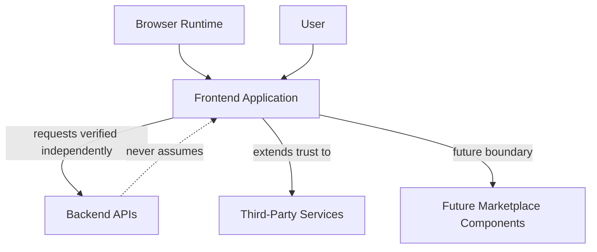
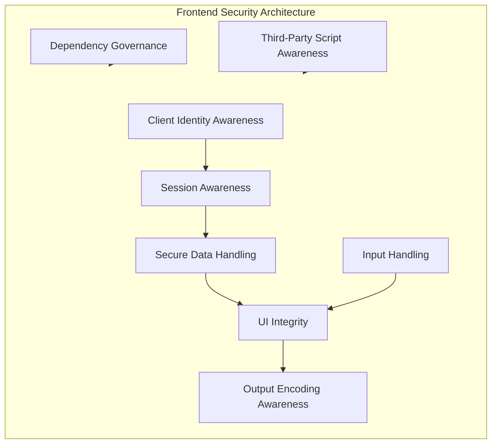
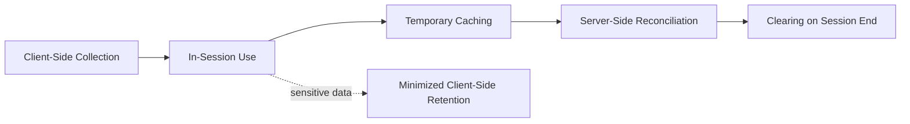
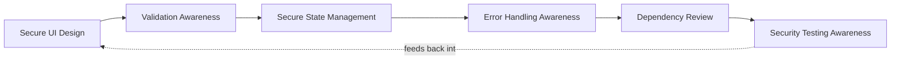
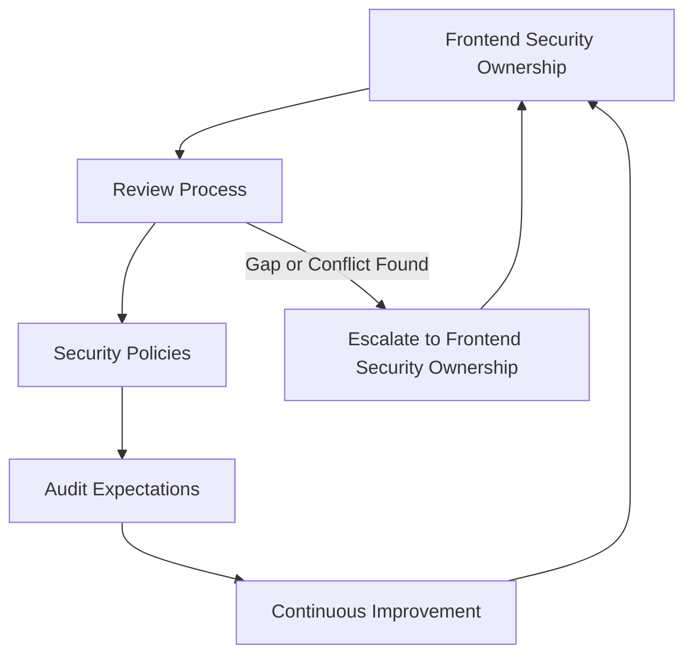

# Frontend Security

## 1. Document Purpose

This document defines the official Enterprise Frontend Security Strategy for **StackLeo Tech Store**. It establishes how the platform protects the customer- and staff-facing experience layer running in the browser and, in time, future client environments.

- **Purpose of Frontend Security** — to ensure that the layer customers and staff directly interact with cannot be manipulated to misrepresent the platform, leak sensitive data, or bypass the protections enforced elsewhere.
- **Relationship with Application Security** — this document elaborates Frontend Security, one of the domains defined in `application-security.md` (Section 4), applying that strategy's philosophy specifically to the client-side experience.
- **Relationship with API Security** — the frontend is a consumer of the platform's APIs; this document assumes and depends on `api-security.md` to protect what the frontend calls, while itself protecting how the frontend behaves before and after those calls.
- **Relationship with Customer Trust** — the catalog, cart, checkout, and account pages are where customers directly experience StackLeo; a compromised or misleading interface is a direct, visible failure of the trust described in `01_Business/vision.md`.
- **Relationship with Privacy** — the frontend is often where customer data is first collected and last displayed; this document applies the privacy principles from `data-protection.md` (Section 6) specifically to client-side handling.

This document is implementation-independent, vendor-neutral, and framework-independent. It defines frontend security philosophy, trust boundaries, and governance — not specific frameworks, vulnerability exploitation details, or code.

## 2. Frontend Security Philosophy

- **Secure by Design** — frontend security is considered from the first interface design conversation, not layered on after the experience is built, consistent with `security-principles.md` (Section 8).
- **Zero Trust Client** — the client environment (browser, device) is never fully trusted, regardless of how the interface itself was built; every consequential decision is re-verified server-side, consistent with `security-architecture.md` (Section 2).
- **Privacy by Design** — client-side handling of customer data defaults to the minimum necessary collection, display, and retention, consistent with `data-protection.md` (Section 2).
- **Defense in Depth** — frontend protections are one layer among several (Section 4), never treated as sufficient on their own for any security-critical decision.
- **Least Privilege** — the frontend is given access only to the data and capability required to render the current experience, not a broader scope for convenience.
- **Secure User Experience** — security and usability are treated as compatible goals; friction introduced in the name of security is justified by genuine risk reduction, not applied reflexively.

## 3. Browser Trust Model

The frontend operates within a client environment that StackLeo does not fully control, and several conceptual trust boundaries apply:

- **Browser** — the runtime environment executing the frontend application; its integrity is assumed to be outside StackLeo's direct control.
- **User** — the human interacting with the browser, whose actions the frontend must faithfully represent without assuming they are always the account owner acting with full knowledge.
- **Frontend Application** — the interface code itself, which can be inspected, modified, or bypassed by anyone with access to the browser it runs in.
- **Backend APIs** — the authoritative source of business logic and data, which must never assume a request genuinely originated from the intended, unmodified frontend.
- **Third-Party Services** — external scripts, embeds, or services loaded into the frontend experience, extending trust beyond StackLeo's own code.
- **Future Marketplace Components** — interface elements contributed by or representing third-party sellers, introducing a new category of client-side trust boundary.

The client environment should never be fully trusted because it executes on infrastructure StackLeo does not own or control: a user (or any party with access to their device) can inspect, alter, or replay anything the frontend sends, which means every security-relevant decision must ultimately be verified again at the backend boundary, consistent with `api-security.md` (Section 2).

*Diagram 1: Browser Trust Boundary Model — the backend independently verifies every request rather than trusting that it genuinely originated from an unmodified frontend.*

### Browser Trust Boundary Summary

| Boundary | Trust Basis | Primary Risk If Assumed Trustworthy |
|---|---|---|
| Browser | None — entirely outside StackLeo's control | Client-side logic or data can be inspected or altered |
| User | Authenticated identity, not implicit good faith | Actions taken may not reflect the account owner's genuine intent |
| Frontend Application | Server-side re-verification of every consequential action | Client-side checks alone can be bypassed |
| Backend APIs | Independent verification, per `api-security.md` | Frontend requests assumed genuine without verification |
| Third-Party Services | Scoped to the specific purpose of inclusion | Broader access or behavior than the integration warrants |
| Future Marketplace Components | Seller-scoped, reviewed inclusion | Cross-vendor interference within a shared interface |

## 4. Frontend Security Domains

| Domain | Purpose | Business Value | Security Objectives |
|---|---|---|---|
| Client Identity Awareness | Reflect the authenticated identity's state accurately in the interface. | Prevents customer confusion about which account is active. | Interface state is derived from verified session data, not assumed. |
| Session Awareness | Reflect session validity and expiration accurately to the user. | Reduces confusion and support burden from unexpected session behavior. | Interface responds appropriately to session state changes, per `authentication.md` (Section 5). |
| Secure Data Handling | Handle customer and business data client-side proportionately to its sensitivity. | Preserves customer trust in how their data is treated visibly. | Data displayed or stored client-side follows `data-protection.md` classification. |
| UI Integrity | Ensure the interface presented is the one StackLeo intended. | Prevents misrepresentation of business logic (pricing, promotions) to the customer. | Critical interface state is verified against backend authority, not assumed from client state alone. |
| Input Handling | Handle user-provided input carefully before it is displayed or sent onward. | Reduces risk of the interface becoming a vector for downstream issues. | Input is treated as untrusted until validated, consistent with `application-security.md` (Section 5). |
| Output Encoding Awareness | Ensure data rendered in the interface cannot be misinterpreted as executable content. | Protects customers from a compromised or malicious data source affecting their browsing session. | Rendered content is presented safely regardless of its origin. |
| Dependency Governance | Manage the third-party libraries the frontend relies upon. | Prevents an external dependency from becoming an internal weakness. | Frontend dependencies are evaluated and governed consistently with `application-security.md` (Section 7). |
| Third-Party Script Awareness | Manage externally loaded scripts and embeds deliberately. | Limits the scope of trust extended to external parties within the customer experience. | Third-party inclusion is deliberate, reviewed, and scoped to its specific purpose. |

### Frontend Security Domain Matrix

| Domain | Primary Risk Addressed | Related Document |
|---|---|---|
| Client Identity Awareness | Interface misrepresenting authenticated state | `authentication.md` |
| Session Awareness | Confusing or inconsistent session behavior | `authentication.md` |
| Secure Data Handling | Client-side data handled inconsistently with its sensitivity | `data-protection.md` |
| UI Integrity | Misrepresentation of business logic to the customer | `application-security.md` |
| Input Handling | Untrusted input processed as trustworthy | `application-security.md` |
| Output Encoding Awareness | Rendered content misinterpreted as executable | `application-security.md` |
| Dependency Governance | Untrusted or unmaintained third-party library | `application-security.md` |
| Third-Party Script Awareness | Excessive trust extended to an external script or embed | `security-architecture.md` |

*Diagram 2: Frontend Security Architecture.*

## 5. Client Data Protection

- **Customer Information** — displayed only to the extent needed for the current interaction, consistent with Need-to-Know in `security-principles.md` (Section 3.2).
- **Shopping Cart** — treated as sensitive to the owning session; client-side representation is reconciled against server-side authority before checkout completes.
- **Session State** — client-side awareness of session validity is treated as informational; the backend remains the authority on whether a session is genuinely still valid.
- **User Preferences** — stored client-side only where the sensitivity is low and the convenience benefit is clear, consistent with Data Minimization.
- **Cached Data** — cached client-side content is treated as having a limited, deliberate lifetime, not retained indefinitely by default.
- **Temporary Data** — data held only for the duration of a specific interaction is cleared once that interaction concludes.
- **Offline Data (Future)** — as offline-capable experiences are considered, any locally persisted data will be scoped and protected proportionately to its classification before being enabled.

*Diagram 3: Client Data Protection Lifecycle.*

### Client Data Classification

| Data Type | Client-Side Sensitivity | Handling Expectation |
|---|---|---|
| Customer Information | High | Displayed only as needed; never cached beyond the active session unnecessarily |
| Shopping Cart | Moderate | Reconciled against server-side authority before checkout |
| Session State | Moderate | Treated as informational; backend remains authoritative |
| User Preferences | Low | May be retained client-side where genuinely low-sensitivity |
| Cached Data | Varies by content | Given a deliberate, limited lifetime |
| Temporary Data | Varies by content | Cleared at the end of its specific interaction |
| Offline Data (Future) | To be assessed per use case | Protected proportionately to classification before enablement |

## 6. Frontend Threat Awareness

The architecture conceptually addresses the following classes of client-side risk, without describing specific attack techniques:

- **Malicious Client Manipulation** — addressed through Zero Trust Client (Section 2), ensuring the backend never assumes client-reported state is genuine.
- **Unauthorized UI Actions** — addressed through UI Integrity and server-side re-verification (Section 4), preventing interface manipulation from translating into unauthorized backend action.
- **Data Exposure** — addressed through Secure Data Handling and Client Data Protection (Sections 4–5), scoping what is displayed or cached to genuine need.
- **Third-Party Script Risks** — addressed through Third-Party Script Awareness (Section 4), limiting and reviewing the trust extended to external inclusions.
- **Dependency Risks** — addressed through Dependency Governance (Section 4), consistent with `application-security.md` (Section 7).
- **Browser Environment Risks** — addressed through the Zero Trust Client philosophy (Section 2), acknowledging that the browser environment itself is outside StackLeo's direct control.

## 7. Secure Frontend Development

- **Secure UI Design** — interface design considers security implications (what is displayed, cached, or assumed) as part of ordinary design practice, not a separate review.
- **Validation Awareness** — client-side validation improves user experience but is never relied upon as the sole safeguard; server-side validation remains authoritative, per `application-security.md` (Section 5).
- **Secure State Management** — client-side application state is managed with awareness of what is sensitive and what should not persist beyond its legitimate purpose.
- **Error Handling Awareness** — errors surfaced to the user provide enough information to be helpful without revealing internal detail useful to an adversary.
- **Dependency Review** — third-party libraries and scripts are evaluated before adoption and periodically thereafter, consistent with Section 4.
- **Security Testing Awareness** — frontend behavior is included in the security testing culture described in `security-testing.md`, not assumed safe by virtue of being "just the UI."

*Diagram 4: Secure Frontend Development Flow.*

### Secure Development Principle Matrix

| Principle | What It Protects Against |
|---|---|
| Secure UI Design | Security implications considered only after the interface is built |
| Validation Awareness | Reliance on client-side validation alone |
| Secure State Management | Sensitive state persisting beyond its legitimate purpose |
| Error Handling Awareness | Internal detail disclosed through overly informative errors |
| Dependency Review | Untrusted or unmaintained third-party code entering the frontend |
| Security Testing Awareness | Frontend behavior left unverified as part of the security testing culture |

## 8. Future Frontend Readiness

This strategy is deliberately structured to remain valid as StackLeo's frontend surface evolves:

- **Progressive Web Apps** — the browser trust model (Section 3) and client data protection principles (Section 5) extend naturally to PWA capability such as offline access and local storage.
- **Native Mobile Applications** — as the future Mobile App channel is introduced, the same Zero Trust Client philosophy (Section 2) applies to the mobile client environment.
- **Marketplace UI** — Future Marketplace Components (Section 3) are already anticipated, allowing seller-contributed interface elements to be governed deliberately.
- **AI-Powered Interfaces** — AI-assisted interface capability (recommendations, conversational features) is subject to the same data handling and UI integrity principles as any other frontend feature.
- **Multi-Tenant Frontends** — as marketplace and corporate business models mature, frontend design ensures one tenant's interface context remains isolated from another's.
- **Global Delivery** — frontend security principles remain jurisdiction-agnostic, supporting delivery across Bangladesh, South Asia, and future global markets without redefinition.

## 9. Governance

- **Frontend Security Ownership** — the Security Lead owns the coherence of this frontend security strategy, working alongside Frontend Engineering leads accountable for its application in practice.
- **Review Process** — significant frontend design and dependency decisions are reviewed against this strategy, consistent with the Secure SDLC in `application-security.md` (Section 3).
- **Security Policies** — operational frontend security policies are derived from this strategy and maintained consistently with `security-governance.md`.
- **Audit Expectations** — significant frontend security decisions, particularly around third-party inclusion and dependency adoption, are recorded and reviewable.
- **Continuous Improvement** — this strategy is expected to mature as frontend technology, customer expectations, and threat context evolve.

*Diagram 5: Frontend Security Governance Framework.*

### Governance Responsibility Matrix

| Role | Responsibility |
|---|---|
| Security Lead | Owns coherence and enforcement of the frontend security strategy. |
| Frontend Engineering Leads | Apply frontend security domains and development principles within their codebase. |
| Solution Architect | Ensures frontend security remains consistent with `application-security.md`. |
| Product Manager | Balances security posture against customer experience goals. |
| QA Lead | Ensures frontend behavior is included in the security testing culture. |
| Internal Audit / Review Function | Independently verifies frontend security practice matches this strategy. |

## 10. Anti-Patterns

| Anti-Pattern | Why It's Avoided |
|---|---|
| Trusting Client Input | Contradicts Zero Trust Client (Section 2); assumes client-reported state or data is genuine without verification. |
| Excessive Client Storage | Violates Data Minimization; retains more customer data client-side than the interaction genuinely requires (Section 5). |
| Weak Dependency Governance | Leaves Dependency Governance (Section 4) unmanaged, allowing untrusted or unmaintained libraries to persist. |
| Sensitive Data Exposure | Displays or caches data beyond what the current interaction legitimately needs, contradicting Section 5. |
| Poor Error Disclosure | Reveals internal detail useful to an adversary through overly informative client-facing errors. |
| Blind Third-Party Trust | Includes external scripts or embeds without deliberate review, contradicting Third-Party Script Awareness (Section 4). |
| Weak UI Validation | Relies on client-side validation as though it were sufficient on its own, contradicting Section 7. |
| Reactive Security | Treats frontend security as a response to incidents rather than a continuous discipline embedded in design (Section 7). |

## 11. Document Information

| Property | Value |
|----------|-------|
| Document | frontend-security.md |
| Version | 1.0.0 |
| Status | Active |
| Maintained By | StackLeo |
| Last Updated | 2026-07-17 |

---

© StackLeo. All Rights Reserved.
