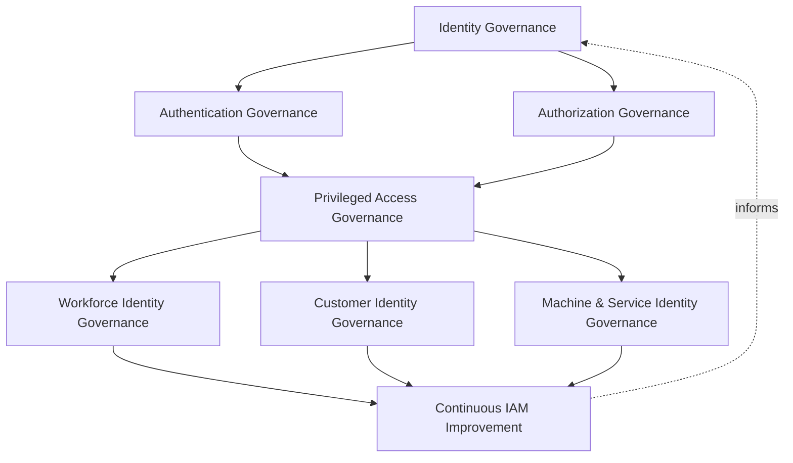
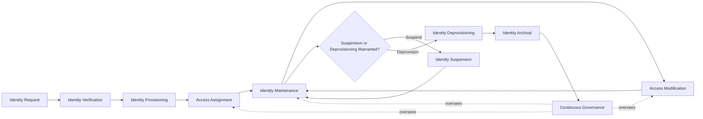
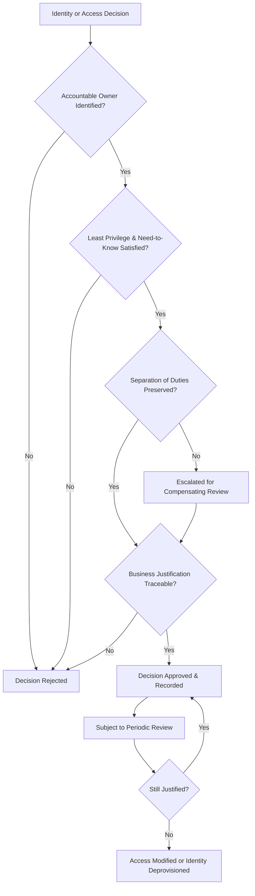
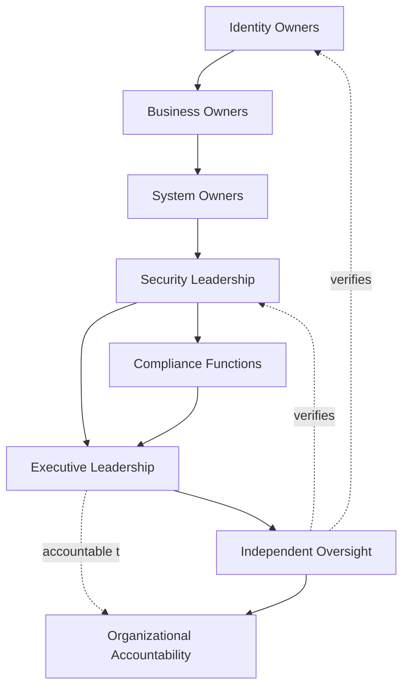
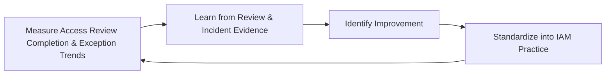
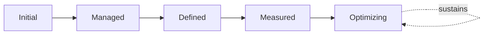

# Enterprise Identity & Access Strategy

## 1. Document Purpose

This document defines the official Enterprise Identity & Access (IAM) Strategy for **StackLeo Tech Store** — the CISO/CIDO-owned executive charter under which every identity and access governance document in `06_Security` operates. It establishes enterprise identity governance, authentication governance, authorization governance, privileged access governance, identity lifecycle governance, organizational accountability, and executive oversight at the strategic level, consistent with ISO/IEC 27001, the NIST Cybersecurity Framework, NIST SP 800-63 digital identity concepts, Zero Trust principles, and TOGAF enterprise architecture thinking.

`identity-access-management.md` remains the master operational governance framework holding identity, authentication, authorization, and Zero Trust practice together, and its family of dedicated elaborations — `authentication-strategy.md`, `authorization-model.md`, `privileged-access-management.md`, `identity-lifecycle-management.md`, `identity-federation.md`, and `service-accounts-management.md` — govern each domain in operational depth. This document sits above that family as its executive mandate: it does not restate their operational detail, it establishes the philosophy, accountability structure, and executive expectations that give their governance authority and continuity.

- **Purpose of Identity & Access Management** — to ensure that every identity interacting with StackLeo — human, organizational, or machine — and every access decision made on its behalf, exists and persists only because an accountable person deliberately decided it should, across the full life of that identity, not because it was convenient to grant and never revisited.
- **Relationship with Information Security** — this strategy is the identity-specific executive elaboration of `security-governance.md`; identity is treated as the foundation every other information security domain — data protection, application security, infrastructure security — ultimately depends on to know who is acting.
- **Relationship with Zero Trust** — this strategy operationalizes `zero-trust-strategy.md`'s "never trust, always verify" posture into standing executive accountability: who owns verification standards, who is accountable for trust extended, and how that accountability is sustained as the platform grows.
- **Relationship with Privacy Governance** — identity data is itself sensitive personal data; this strategy's governance is coordinated with `privacy.md` so that identity information is collected, used, and retired under the same protective discipline as any other personal data StackLeo holds.
- **Relationship with Enterprise Risk Management** — identity-related risk — excessive privilege, orphaned identities, weak verification, ungoverned federation — is a distinct, tracked category within `risk-management.md` and `security-risk-management.md`, governed here at the identity-specific strategic level.
- **Relationship with Compliance Governance** — this strategy provides the governance structure through which regulatory and contractual obligations concerning identity, access, and privileged accountability tracked in `compliance.md` are reliably satisfied in practice, not merely acknowledged in policy language.
- **Relationship with Enterprise Governance** — identity and access governance is not a separate structure from how StackLeo governs the rest of the business; it is the identity-specific application of the same executive accountability, policy discipline, and control assurance applied enterprise-wide in `policy-management.md`, `internal-controls.md`, and `audit-governance.md`.

This document is implementation-independent and vendor-neutral. It defines IAM governance philosophy, model, domains, lifecycle, ownership, and executive oversight conceptually — not specific IAM vendors, Identity Providers, authentication platforms, PAM solutions, cloud providers, directory services, security products, authentication protocols, MFA implementations, federation technologies, infrastructure configurations, deployment architectures, implementation workflows, or code.

## 2. IAM Governance Philosophy

Enterprise IAM governance at StackLeo rests on eight principles. Each exists to produce a specific business outcome — identity is governed deliberately because it is the foundation every other governance discipline depends on, not as administrative overhead layered on top of the business.

### 2.1 Identity as the New Security Perimeter

As StackLeo operates across Web today and future Mobile App, Physical Store, and POS channels, no fixed network boundary can serve as a meaningful perimeter; identity itself becomes the durable boundary of trust.

- **Business Value** — protects the business consistently across every current and future sales channel, rather than depending on a network boundary that channel diversity makes unreliable.

### 2.2 Least Privilege

Every identity, regardless of domain (Section 4), is granted only the access its defined purpose genuinely requires, and nothing more.

- **Business Value** — limits the blast radius of any single compromised or misused identity, reducing the consequence of an inevitable eventual failure.

### 2.3 Need-to-Know

Access to information is granted only where a genuine, defined need exists, distinct from but complementary to Least Privilege's focus on functional capability.

- **Business Value** — protects sensitive business and customer information from unnecessary exposure, even to identities that otherwise hold legitimate system access.

### 2.4 Zero Trust Mindset

No request, identity, device, or prior authentication event is trusted implicitly anywhere on the platform; trust is evaluated continuously, never assumed from location or history alone, consistent with `zero-trust-strategy.md`.

- **Business Value** — ensures a compromise in one place cannot silently extend into trust everywhere else on the platform.

### 2.5 Accountability

Every identity, every access grant, and every governance decision traces to a specific, named, responsible party — never to an ambiguous team or an unowned process.

- **Business Value** — ensures every identity and access decision has someone genuinely responsible for defending its continued justification.

### 2.6 Identity by Design

Identity governance structures are established deliberately as identity capability is built, not retrofitted once identity sprawl or excessive privilege has already emerged.

- **Business Value** — prevents the costly, high-visibility discovery of governance gaps only after an incident has already demonstrated their absence.

### 2.7 Business Enablement

IAM governance exists to let the business operate and grow safely — from single-seller B2C toward corporate sales, wholesale, and the multi-vendor marketplace — not to obstruct legitimate activity with disproportionate friction.

- **Business Value** — keeps IAM governance genuinely followed rather than resented and quietly bypassed as an obstacle to real work.

### 2.8 Continuous Improvement

IAM governance practice matures over time, informed by real access review findings, incidents, audits, and the organization's growth in scale and complexity.

- **Business Value** — keeps identity governance aligned with StackLeo's growth in workforce, customer base, and partner ecosystem, rather than fixed to assumptions made at an earlier stage.

## 3. Enterprise IAM Governance Model

IAM governance operates across eight conceptual layers, each holding executive accountability for a distinct dimension of identity and access practice. Every layer here is elaborated in full operational depth in its corresponding dedicated document.

### 3.1 Identity Governance

- **Purpose** — own the coherence of identity existence, categorization, and lifecycle state across the platform, elaborated in `identity-access-management.md` (Section 3.1) and `identity-lifecycle-management.md`.
- **Governance Scope** — oversight of how identities are created, maintained, and retired across every domain in Section 4.
- **Business Value** — ensures every identity's existence and state can be reasoned about consistently as the organization grows.
- **Executive Expectations** — leadership trusts that no identity exists outside this framework's visibility.

### 3.2 Authentication Governance

- **Purpose** — own the coherence of identity verification practice, elaborated in `authentication-strategy.md`.
- **Governance Scope** — oversight of how confidence in a claimed identity is established, proportionate to risk, across every domain.
- **Business Value** — ensures every downstream access decision rests on a genuinely verified foundation, not convenient assumption.
- **Executive Expectations** — leadership trusts that verification rigor is proportionate to what is being protected, never uniformly weak or uniformly excessive.

### 3.3 Authorization Governance

- **Purpose** — own the coherence of access-scoping and permission decisions, elaborated in `authorization-model.md`.
- **Governance Scope** — oversight of how access is granted, reviewed, and revoked across every identity domain.
- **Business Value** — ensures access decisions consistently reflect Least Privilege (Section 2.2) rather than individual team judgment.
- **Executive Expectations** — leadership trusts that access, once granted, does not silently persist beyond genuine need.

### 3.4 Privileged Access Governance

- **Purpose** — own the elevated governance rigor administrative and other high-impact identities require, elaborated in `privileged-access-management.md`.
- **Governance Scope** — oversight of Administrative and Privileged Identities (Sections 4.4–4.5) and any identity capable of affecting the platform broadly.
- **Business Value** — ensures the identities with the greatest potential impact receive commensurately greater scrutiny.
- **Executive Expectations** — leadership expects privileged access to be rare, justified, time-bound where feasible, and closely reviewed.

### 3.5 Workforce Identity Governance

- **Purpose** — own the governance of identities representing StackLeo's own employees and contractors.
- **Governance Scope** — oversight of Workforce Identities (Section 4.1) across their employment lifecycle.
- **Business Value** — ensures workforce access reflects actual role and employment status, not historical assignment.
- **Executive Expectations** — leadership trusts workforce access is promptly adjusted as roles and employment status change.

### 3.6 Customer Identity Governance

- **Purpose** — own the governance of identities representing StackLeo's customers.
- **Governance Scope** — oversight of Customer Identities (Section 4.2), coordinated with `privacy.md` given the sensitivity of customer data.
- **Business Value** — protects the trust relationship every customer transaction depends on.
- **Executive Expectations** — leadership expects customer identity governance to scale smoothly as the customer base grows.

### 3.7 Machine & Service Identity Governance

- **Purpose** — own the governance of non-human identities — service accounts, machine identities, API actors, and AI agents.
- **Governance Scope** — oversight of Service & Machine, API & Integration, and AI Agent Identities (Sections 4.6–4.9), elaborated fully in `service-accounts-management.md`.
- **Business Value** — prevents non-human identities from becoming an ungoverned blind spot, since they are often granted broad access by default and rarely draw scrutiny.
- **Executive Expectations** — leadership trusts that machine and AI identities receive the same governance rigor as human ones, not less.

### 3.8 Continuous IAM Improvement

- **Purpose** — govern the mechanism by which every other layer in this model matures over time.
- **Governance Scope** — consolidates findings from access reviews, audits, and incidents across every domain in Section 4.
- **Business Value** — prevents IAM governance itself from becoming the next thing that quietly stagnates as the organization scales.
- **Executive Expectations** — leadership expects IAM maturity to be assessed periodically, not assumed static once established.

### Enterprise IAM Governance Matrix

| Layer | Purpose | Business Value | Executive Expectations |
|---|---|---|---|
| Identity Governance | Own coherence of identity existence and lifecycle state | Ensures every identity is reasoned about consistently | Trusts no identity exists outside this framework's visibility |
| Authentication Governance | Own coherence of identity verification practice | Ensures decisions rest on a genuinely verified foundation | Trusts verification rigor is proportionate to risk |
| Authorization Governance | Own coherence of access-scoping and permission decisions | Ensures access reflects Least Privilege consistently | Trusts access doesn't silently persist beyond genuine need |
| Privileged Access Governance | Own elevated rigor for administrative/high-impact identities | Ensures greatest-impact identities receive greatest scrutiny | Expects privileged access to be rare, justified, closely reviewed |
| Workforce Identity Governance | Own governance of employee/contractor identities | Ensures access reflects actual role and status | Trusts access is promptly adjusted as roles change |
| Customer Identity Governance | Own governance of customer identities | Protects the trust relationship every transaction depends on | Expects governance to scale smoothly with customer growth |
| Machine & Service Identity Governance | Own governance of non-human and AI identities | Prevents machine identities becoming an ungoverned blind spot | Trusts machine and AI identities get the same rigor as human ones |
| Continuous IAM Improvement | Govern maturation of every other layer | Prevents governance itself from stagnating | Expects maturity to be assessed periodically |

*Diagram 1: Enterprise IAM Governance Framework — foundational identity, authentication, and authorization governance converge through privileged access oversight into domain-specific governance, feeding a continuous improvement cycle that informs the model itself.*

## 4. Enterprise Identity Domains

Identity is organized across ten conceptual domains, each requiring a distinct governance emphasis proportionate to its trust level and business role.

### 4.1 Workforce Identities

- **Purpose** — represent StackLeo's own employees and contractors across their employment lifecycle.
- **Governance Considerations** — governed under Workforce Identity Governance (Section 3.5), coordinated with HR processes for onboarding and offboarding events.
- **Business Importance** — protects internal systems and data from access that has outlived its legitimate employment basis.
- **Executive Expectations** — leadership expects workforce identity changes to be triggered promptly by employment status change.

### 4.2 Customer Identities

- **Purpose** — represent individual shoppers' accounts and their relationship with StackLeo.
- **Governance Considerations** — governed under Customer Identity Governance (Section 3.6), coordinated with `privacy.md`.
- **Business Importance** — foundation of the direct-to-consumer relationship and repeat commerce central to the B2C model.
- **Executive Expectations** — leadership expects customer identity governance to protect trust without adding friction to genuine shopping.

### 4.3 Vendor & Partner Identities

- **Purpose** — represent external suppliers, service providers, and future marketplace sellers and B2B business relationships.
- **Governance Considerations** — governed under Authorization Governance (Section 3.3) in coordination with `identity-federation.md`, anticipating the multi-vendor marketplace model.
- **Business Importance** — protects both the integrations commerce depends on today and the trust foundation the marketplace business model will depend on.
- **Executive Expectations** — leadership expects vendor and partner identity governance to be scoped narrowly and designed ahead of, not after, marketplace launch.

### 4.4 Administrative Identities

- **Purpose** — represent identities with elevated capability to administer platform, security, or business-critical systems.
- **Governance Considerations** — governed under Privileged Access Governance (Section 3.4), elaborated in `privileged-access-management.md`.
- **Business Importance** — protects against one of the highest-consequence categories of identity compromise.
- **Executive Expectations** — leadership expects administrative identity grants to require explicit, documented justification.

### 4.5 Privileged Identities

- **Purpose** — represent any identity — human or machine — capable of affecting the platform, its data, or its business operations broadly, distinct from administrative role alone.
- **Governance Considerations** — governed under Privileged Access Governance (Section 3.4), receiving StackLeo's highest governance scrutiny regardless of the domain the identity otherwise belongs to.
- **Business Importance** — protects against the single highest-consequence category of identity risk on the platform.
- **Executive Expectations** — leadership expects privileged status itself, not just administrative title, to trigger elevated governance.

### 4.6 Service & Machine Identities

- **Purpose** — represent non-human identities used by application components, workloads, and infrastructure to interact with one another.
- **Governance Considerations** — governed under Machine & Service Identity Governance (Section 3.7), elaborated in `service-accounts-management.md`.
- **Business Importance** — protects against the common failure mode where service and machine identities accumulate broad, unreviewed access over time.
- **Executive Expectations** — leadership expects service and machine identities to be inventoried and reviewed with the same rigor as human identities.

### 4.7 API & Integration Identities

- **Purpose** — represent identities through which external systems and internal services exchange data and capability.
- **Governance Considerations** — governed under Machine & Service Identity Governance (Section 3.7), with scope bounded strictly to the specific integration purpose.
- **Business Importance** — protects the integration surface connecting StackLeo to payment, courier, and communication partners, and future marketplace participants.
- **Executive Expectations** — leadership expects integration access to be scoped narrowly and reviewed whenever an integration's purpose changes.

### 4.8 Temporary & External Identities

- **Purpose** — represent identities granted for a bounded purpose or duration — contractors, seasonal staff, auditors, or other externally sourced access needs.
- **Governance Considerations** — governed jointly across Workforce and Authorization Governance (Sections 3.5, 3.3), with mandatory expiration as a defining characteristic.
- **Business Importance** — prevents temporary or externally sourced access needs from becoming permanent, unreviewed grants.
- **Executive Expectations** — leadership expects every temporary or external identity to carry an explicit expiration, never open-ended by default.

### 4.9 AI Agent Identities

- **Purpose** — represent autonomous or semi-autonomous AI-driven actors performing actions on the platform on behalf of the business or a human principal.
- **Governance Considerations** — governed under Machine & Service Identity Governance (Section 3.7) as a distinct, named category, anticipating growing AI-assisted capability across the platform.
- **Business Importance** — protects against a category of identity that can act at scale and speed, making ungoverned privilege especially consequential.
- **Executive Expectations** — leadership expects AI agent identities to be explicitly inventoried and never governed as an informal extension of the human identity that configured them.

### 4.10 Third-Party Federated Identities

- **Purpose** — represent external identities StackLeo does not directly control but must extend a deliberate, bounded degree of trust to.
- **Governance Considerations** — governed under Authorization Governance (Section 3.3) in coordination with `identity-federation.md`, the full dedicated elaboration of federated trust governance.
- **Business Importance** — protects against risk introduced by parties outside StackLeo's direct organizational control, while enabling corporate and B2B relationships.
- **Executive Expectations** — leadership expects federated trust to be reviewed and bounded before extension, never assumed equivalent to internally managed trust.

### Enterprise Identity Domain Matrix

| Domain | Purpose | Business Importance | Executive Expectations |
|---|---|---|---|
| Workforce Identities | Represent employees and contractors across the employment lifecycle | Protects systems from access outliving employment basis | Changes triggered promptly by employment status change |
| Customer Identities | Represent shoppers' accounts and relationship with StackLeo | Foundation of the direct-to-consumer relationship | Protects trust without adding shopping friction |
| Vendor & Partner Identities | Represent suppliers, providers, and future marketplace/B2B relationships | Protects integrations and the future marketplace trust foundation | Scoped narrowly, designed ahead of marketplace launch |
| Administrative Identities | Represent elevated administrative system capability | Protects against a high-consequence compromise category | Grants require explicit, documented justification |
| Privileged Identities | Represent any identity capable of broad platform impact | Protects against the single highest-consequence risk category | Privileged status itself triggers elevated governance |
| Service & Machine Identities | Represent non-human, application-level and infrastructure actors | Prevents accumulation of broad, unreviewed access | Inventoried and reviewed with the same rigor as human identities |
| API & Integration Identities | Represent external/internal system exchange actors | Protects the integration surface commerce depends on | Scoped narrowly, reviewed on integration purpose change |
| Temporary & External Identities | Represent bounded-purpose or bounded-duration access | Prevents temporary needs becoming permanent grants | Every identity carries an explicit expiration |
| AI Agent Identities | Represent autonomous or semi-autonomous AI-driven actors | Protects against scale-and-speed risk of ungoverned AI privilege | Explicitly inventoried, never an informal human extension |
| Third-Party Federated Identities | Represent external identities outside direct control | Protects against risk from parties outside organizational control | Trust reviewed and bounded before extension |

## 5. Enterprise Identity Lifecycle

Identity is governed across ten conceptual lifecycle stages, applicable across every domain in Section 4. The full, dedicated elaboration of identity state governance is provided in `identity-lifecycle-management.md`.

### 5.1 Identity Request

- **Purpose** — formally initiate the creation of a new identity with a stated business purpose.
- **Governance Objectives** — require every request to state its purpose and the domain (Section 4) it belongs to.
- **Business Value** — ensures identity creation is deliberate, not an incidental byproduct of onboarding activity.

### 5.2 Identity Verification

- **Purpose** — confirm the requested identity genuinely represents who or what it claims to, governed under Authentication Governance (Section 3.2).
- **Governance Objectives** — require verification rigor proportionate to the identity's domain and intended access.
- **Business Value** — ensures the identity being provisioned is genuine before any access is granted.

### 5.3 Identity Provisioning

- **Purpose** — formally establish the verified identity as a managed enterprise record.
- **Governance Objectives** — require provisioning to occur only after verification (Section 5.2) is complete, never in parallel with it.
- **Business Value** — ensures every identity's existence is deliberately established, not a byproduct of first access.

### 5.4 Access Assignment

- **Purpose** — grant the newly provisioned identity its initial access, consistent with Least Privilege (Section 2.2).
- **Governance Objectives** — require initial access to be scoped to genuine, stated need, never granted broadly by default.
- **Business Value** — ensures every identity begins its life with only the access it genuinely requires.

### 5.5 Identity Maintenance

- **Purpose** — keep identity attributes current as circumstances change.
- **Governance Objectives** — require maintenance to be triggered by genuine change events, not left to drift indefinitely.
- **Business Value** — ensures identity records remain an accurate reflection of current reality.

### 5.6 Access Modification

- **Purpose** — adjust an identity's access as role, responsibility, or need genuinely changes.
- **Governance Objectives** — require modification to be justified and recorded, consistent with Authorization Governance (Section 3.3).
- **Business Value** — prevents access from silently accumulating beyond current, genuine need.

### 5.7 Identity Suspension

- **Purpose** — deliberately and reversibly disable an identity's access without fully removing it, where circumstance warrants.
- **Governance Objectives** — require suspension to be a distinct, recorded state, never conflated with full deprovisioning.
- **Business Value** — provides a proportionate response to circumstances — leave, investigation, temporary role change — that do not yet warrant full removal.

### 5.8 Identity Deprovisioning

- **Purpose** — formally remove an identity's access once its legitimate purpose has genuinely ended.
- **Governance Objectives** — require deprovisioning to be triggered promptly by the relevant change event.
- **Business Value** — prevents the single most common source of identity risk: access that outlives its legitimate purpose.

### 5.9 Identity Archival

- **Purpose** — retain historical identity records for a defined period after deprovisioning, where genuine business or compliance need exists.
- **Governance Objectives** — coordinate retention with `04_Database/data-retention.md` and applicable obligations in `compliance.md`.
- **Business Value** — preserves evidence needed for audit or investigation without indefinitely retaining active access.

### 5.10 Continuous Governance

- **Purpose** — sustain oversight of an identity's existence and access across every stage, rather than treating governance as a one-time gate.
- **Governance Objectives** — require periodic reassessment (Section 8) to run continuously alongside, not only at, discrete lifecycle events.
- **Business Value** — catches unjustified identity existence or access before it becomes a genuine risk, rather than relying on the next scheduled event to surface it.

### Identity Lifecycle Matrix

| Stage | Purpose | Governance Objective | Business Value |
|---|---|---|---|
| Identity Request | Formally initiate creation with a stated purpose | Requests state purpose and domain | Ensures creation is deliberate, not incidental |
| Identity Verification | Confirm the identity genuinely represents its claim | Rigor proportionate to domain and intended access | Ensures genuineness before any access is granted |
| Identity Provisioning | Establish the verified identity as a managed record | Provisioning follows, never parallels, verification | Ensures existence is deliberately established |
| Access Assignment | Grant initial access at Least Privilege | Scoped to genuine, stated need | Every identity begins with only access it requires |
| Identity Maintenance | Keep identity attributes current | Triggered by genuine change events | Keeps records an accurate reflection of reality |
| Access Modification | Adjust access as role or need genuinely changes | Justified and recorded | Prevents access silently accumulating beyond need |
| Identity Suspension | Deliberately, reversibly disable access | A distinct, recorded state | Provides proportionate response short of full removal |
| Identity Deprovisioning | Formally remove access once purpose has ended | Triggered promptly by the relevant change event | Prevents the most common source of identity risk |
| Identity Archival | Retain historical records for a defined period | Coordinated with data retention and compliance obligations | Preserves audit evidence without indefinite active access |
| Continuous Governance | Sustain oversight across every stage | Reassessment runs continuously, not only at events | Catches unjustified access before it becomes risk |

*Diagram 2: Enterprise Identity Lifecycle — an identity proceeds from request through verification, provisioning, and access assignment into ongoing maintenance, with suspension, deprovisioning, and archival handling its eventual wind-down, all under continuous governance oversight.*

## 6. IAM Governance Principles

- **Accountability** — every identity, access grant, and governance decision traces to a specific, named, responsible party, consistent with Section 2.5.
- **Least Privilege** — access is scoped to the minimum necessary for the stated need, consistent with Section 2.2.
- **Separation of Duties** — no single identity holds unchecked authority over a complete, sensitive business process end to end, where genuine risk warrants division of responsibility.
- **Traceability** — every identity and access decision can be traced to its business justification, approver, and timing.
- **Auditability** — identity and access grants, modifications, and reviews can be independently reviewed after the fact, supporting ISO/IEC 27001-aligned assurance.
- **Business Alignment** — identity governance decisions are made in service of genuine business need, consistent with Business Enablement (Section 2.7), never imposed as friction disconnected from business purpose.
- **Privacy Awareness** — identity data is governed with the same protective discipline applied to any other sensitive personal data, coordinated with `privacy.md`.
- **Continuous Improvement** — governance practice matures over time, informed by real review findings and incidents, consistent with Section 2.8.

### IAM Governance Principles Matrix

| Principle | Description | Business Value |
|---|---|---|
| Accountability | Every decision traces to a specific, named, responsible party | Ensures identity and access decisions have a clear owner |
| Least Privilege | Access scoped to the minimum necessary | Limits blast radius of any single compromised identity |
| Separation of Duties | No single identity holds unchecked end-to-end authority | Prevents a single compromised or malicious identity causing significant harm |
| Traceability | Decisions traceable to justification, approver, timing | Enables defensible, evidence-based identity decisions |
| Auditability | Grants, modifications, reviews independently reviewable | Supports ISO/IEC 27001-aligned assurance and audit confidence |
| Business Alignment | Decisions made in service of genuine business need | Keeps governance followed rather than resented as friction |
| Privacy Awareness | Identity data governed under the same protective discipline as other personal data | Protects the trust relationship every identity represents |
| Continuous Improvement | Practice matures from real review findings and incidents | Keeps governance aligned with organizational growth |

*Diagram 4: Enterprise IAM Decision Flow — every identity or access decision passes through ownership, least privilege, separation of duties, and traceability gates before approval, and remains subject to periodic reassessment thereafter.*

## 7. Identity Ownership & Accountability

Governance authority for identity and access is distributed deliberately across eight accountable functions. Each function's role is defined here at the governance-objective level, without prescribing the specific operational procedures each function uses to fulfill it.

### 7.1 Identity Owners

- **Governance Objective** — each identity, across every domain in Section 4, has a single accountable owner responsible for defending its continued justification.
- **Business Value** — prevents identities from existing without anyone specifically responsible for confirming they still should.

### 7.2 Business Owners

- **Governance Objective** — business functions own the justification for the access their identities require, translating genuine operational need into governed access decisions.
- **Business Value** — keeps access decisions grounded in real business responsibility rather than technical convenience alone.

### 7.3 System Owners

- **Governance Objective** — each system or platform component has an accountable owner responsible for the identities and access it exposes.
- **Business Value** — ensures no system's identity surface is left ungoverned because no one considered it theirs to own.

### 7.4 Security Leadership

- **Governance Objective** — security leadership owns the coherence and enforcement of this strategy across every domain, layer, and lifecycle stage it defines.
- **Business Value** — provides a single point of accountability for whether IAM governance is genuinely functioning as intended.

### 7.5 Compliance Functions

- **Governance Objective** — compliance functions confirm that identity and access governance satisfies applicable regulatory and contractual obligations, coordinated with `compliance.md`.
- **Business Value** — ensures identity governance protects the business's standing with regulators, partners, and enterprise customers, not only its technical posture.

### 7.6 Executive Leadership

- **Governance Objective** — executive leadership sets the risk appetite this strategy operates within and holds security leadership accountable for its execution.
- **Business Value** — ensures IAM governance decisions reflect genuine organizational priority, not a delegated technical afterthought.

### 7.7 Independent Oversight

- **Governance Objective** — an independent function, separate from those who design and operate identity governance, periodically verifies it is genuinely functioning as documented.
- **Business Value** — prevents governance from being assumed effective on the word of the same function responsible for running it.

### 7.8 Organizational Accountability

- **Governance Objective** — accountability for identity and access is a property of the organization as a whole, distributed deliberately across Sections 7.1–7.7, not concentrated in or delegated entirely to any single role.
- **Business Value** — ensures no single point of failure exists in the organization's ability to answer "who is accountable for this identity or this access."

### Identity Ownership & Accountability Matrix

| Role | Governance Objective | Business Value |
|---|---|---|
| Identity Owners | Defend the continued justification of a specific identity | Prevents identities existing without a specifically responsible party |
| Business Owners | Own the business justification for required access | Keeps access grounded in genuine operational need |
| System Owners | Own the identity and access surface a system exposes | Ensures no system's identity surface goes ungoverned |
| Security Leadership | Own coherence and enforcement of this strategy | Provides a single point of accountability for governance function |
| Compliance Functions | Confirm alignment with regulatory/contractual obligations | Protects standing with regulators, partners, enterprise customers |
| Executive Leadership | Set risk appetite and hold security leadership accountable | Ensures decisions reflect genuine organizational priority |
| Independent Oversight | Independently verify governance functions as documented | Prevents self-assessed assumption of effectiveness |
| Organizational Accountability | Distribute accountability across every role, not one | Removes single points of failure in accountability |

*Diagram 3: Identity Governance Operating Model — accountability flows from individual identity ownership through business and system ownership into security leadership, with compliance and executive leadership converging on independent oversight and shared organizational accountability.*

## 8. Executive Oversight

- **IAM Governance Reviews** — the overall coherence of identity and access governance is formally reviewed on a regular cadence, consistent with `security-governance.md` (Section 6).
- **Executive Reporting** — aggregated IAM health — access review completion, privileged access counts, exception trends — is reported to executive leadership.
- **Access Risk Reviews** — identity-related risk from `risk-management.md` and `security-risk-management.md` is reviewed alongside broader enterprise and security risk, never in isolation.
- **Governance Reviews** — the governance model, domains, lifecycle, and ownership structure defined in this strategy (Sections 3–7) are periodically reassessed for continued fitness.
- **Documentation Governance** — this strategy's relationship to `identity-access-management.md`, `authentication-strategy.md`, `authorization-model.md`, `privileged-access-management.md`, `identity-lifecycle-management.md`, `identity-federation.md`, and `service-accounts-management.md` is kept current as those documents evolve.
- **Audit Readiness** — identity and access governance decisions, reviews, and their outcomes are maintained in a state ready for internal or external audit at any time, coordinated with `audit-governance.md`.

### Executive Oversight Matrix

| Oversight Mechanism | Purpose | Governance Role |
|---|---|---|
| IAM Governance Reviews | Confirm overall IAM governance coherence | Regular, predictable cadence for the strategy as a whole |
| Executive Reporting | Provide leadership a single, coherent IAM picture | Reports access review completion, privileged counts, exception trends |
| Access Risk Reviews | Review identity risk alongside broader risk visibility | Not conducted in isolation from enterprise or security risk |
| Governance Reviews | Reassess the governance model itself for continued fitness | Applies to Sections 3–7 of this strategy |
| Documentation Governance | Keep this strategy's subordinate relationships current | Updated as elaboration documents evolve |
| Audit Readiness | Maintain decisions and reviews ready for independent review | Continuous state, coordinated with audit governance |

### Governance Responsibility Matrix

| Role | Responsibility |
|---|---|
| CISO / CIDO | Owns coherence and enforcement of this strategy, in partnership with Executive Leadership. |
| IAM Governance Lead | Owns Identity, Authentication, and Authorization Governance (Sections 3.1–3.3) across every domain. |
| Security Leadership | Owns Privileged Access Governance (Section 3.4), the highest-scrutiny governance layer. |
| HR / People Lead | Coordinates Workforce Identity Governance (Section 3.5) for onboarding and offboarding events. |
| Engineering Leads | Own Machine & Service Identity Governance (Section 3.7) for accounts, machine, and AI agent identities within their domain. |
| Partner / Vendor Manager | Coordinates governance of Vendor & Partner and Third-Party Federated Identities (Sections 4.3, 4.10). |
| Executive Leadership | Reviews significant privileged access decisions and overall IAM governance health. |
| Independent Oversight / Internal Audit | Independently verifies that IAM governance records reflect actual practice. |

## 9. Future Readiness

This strategy is designed to remain valid as StackLeo evolves in scale, geography, and organizational complexity, without requiring redefinition of its underlying philosophy.

- **Passwordless Futures** — Authentication Governance (Section 3.2) is defined independently of any specific verification mechanism, so it applies unchanged as verification approaches evolve.
- **AI Workforce Identities** — as AI-assisted capability expands within the workforce itself, it is governed under Machine & Service Identity Governance (Section 3.7) and the AI Agent Identities domain (Section 4.9), never as an informal extension of a human identity.
- **Autonomous Systems** — increasingly autonomous platform components are governed under the same Least Privilege and Accountability principles (Sections 2.2, 2.5) as any other identity, regardless of the degree of autonomy involved.
- **Global Expansion** — the governance model, domains, and lifecycle (Sections 3–5) are defined independently of jurisdiction, so they extend coherently as StackLeo expands from Bangladesh into South Asia and global markets.
- **Multi-Tenant Platforms** — where future architecture introduces tenant isolation, Authorization Governance (Section 3.3) extends to explicitly scope access per tenant.
- **Enterprise Scale** — the governance model, domains, and lifecycle defined throughout this strategy are defined independently of organizational size, so they remain coherent as the identity population grows substantially.
- **Digital Trust** — this strategy's governance discipline is treated as a direct contributor to the digital trust customers, partners, and regulators extend to StackLeo, not merely an internal control exercise.
- **Continuous Identity Evolution** — Continuous IAM Improvement (Section 3.8) and Continuous Governance (Section 5.10) are structured to absorb genuinely new categories of identity and risk as they emerge, without requiring this strategy to be rewritten.

## 10. IAM Maturity Model

IAM governance maturity is described across five conceptual levels, consistent with established process maturity thinking and NIST Cybersecurity Framework tiers.

- **Initial** — identity and access governance, where it exists, is informal and inconsistent; access accumulates without regular review, and ownership is unclear.
- **Managed** — basic governance exists for individual identity domains, but consistency across the ten domains in Section 4 varies significantly.
- **Defined** — the governance model, domains, lifecycle, and ownership structure are standardized, documented, and consistently applied across the organization, consistent with the model defined throughout this strategy.
- **Measured** — access review completion, privileged access counts, and exception trends are measured systematically, and decisions are grounded in genuine evidence rather than qualitative impression alone.
- **Optimizing** — IAM governance is continuously and deliberately improved based on quantitative evidence and organizational learning; improvement itself is a managed, ongoing discipline rather than an occasional initiative.

### IAM Maturity Model Matrix

| Level | Characteristics | Primary Focus |
|---|---|---|
| Initial | Informal, inconsistent governance; access accumulates without review | Ad hoc, individually-dependent identity practice |
| Managed | Basic governance exists per domain; consistency varies | Domain-level consistency |
| Defined | Standardized governance model, domains, lifecycle, and ownership | Organization-wide consistency and clear ownership |
| Measured | Review completion and access trends measured systematically | Evidence-based IAM governance decisions |
| Optimizing | Practice continuously and deliberately improved from evidence | Sustained, deliberate improvement as a discipline |

*Diagram 5: Continuous IAM Improvement Cycle — access review and audit outcomes are measured, learned from, improved upon, and standardized back into governed practice, on a continuing basis.*

*Diagram 6: IAM Maturity Progression Model — maturity advances from informal, unreviewed identity practice toward standardized, measured, and continuously optimized IAM governance.*

## 11. Anti-Patterns

The following recurring failure patterns are explicitly recognized and avoided, as each one structurally undermines this strategy.

### Anti-Pattern Summary

| Anti-Pattern | Why It's Avoided |
|---|---|
| Identity Without Ownership | Contradicts Identity Owners (Section 7.1); an identity with no accountable owner has no one specifically responsible for its continued justification. |
| Excessive Privileges | Contradicts Least Privilege (Section 2.2); access broader than genuine need increases the consequence of any single compromised identity. |
| Weak Identity Lifecycle Governance | Contradicts the Identity Lifecycle (Section 5); skipping stages, particularly Deprovisioning, leaves access outliving its legitimate purpose. |
| Poor Documentation | Undermines Documentation Governance (Section 8) and Traceability (Section 6), leaving identity and access decisions unclear or unverifiable after the fact. |
| Weak Executive Visibility | Contradicts Executive Reporting (Section 8); leadership cannot govern risk it is never shown. |
| Siloed Identity Management | Contradicts the Enterprise IAM Governance Model (Section 3); domain-by-domain practice that never converges leaves no coherent, organization-wide picture of identity risk. |
| Compliance Without Governance | Contradicts Compliance Functions (Section 7.5); satisfying a regulatory checklist without genuine underlying governance leaves the organization compliant on paper and exposed in practice. |
| Missing Continuous Improvement | Contradicts Continuous Improvement (Section 2.8) and Continuous IAM Improvement (Section 3.8); without deliberate improvement, governance stagnates as the organization and identity population grow. |

## 12. Document Information

| Property | Value |
|----------|-------|
| Document | identity-access-strategy.md |
| Version | 1.0.0 |
| Status | Active |
| Maintained By | StackLeo |
| Last Updated | 2026-07-24 |

---

© StackLeo. All Rights Reserved.
